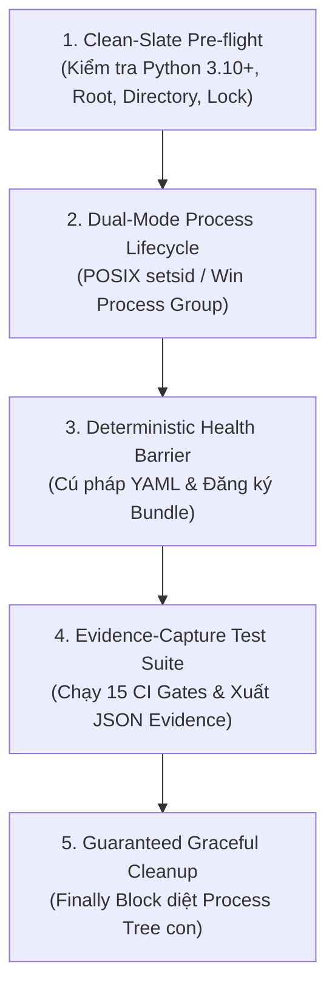

# Kỹ Năng Kiểm Định Tự Động Tri Thức Pháp Lý (ccba-verify-legal-knowledge)

Bộ kỹ năng kiểm định tự động chuyên biệt dành riêng cho Spoke `ccba-legal-knowledge`, tuân thủ nghiêm ngặt chuẩn mực kiến trúc kiểm định Pstack Upstream, ADR-0009 và ADR-0044 Spoke Cleanliness Rule. Toàn bộ mã nguồn harness được cô lập trong `.agents/skills/ccba-verify-legal-knowledge/harness/`, không làm ảnh hưởng đến ngân sách 15 kịch bản tại thư mục gốc `scripts/`.

---

## 5 Khối Chức Năng Cốt Lõi (Architecture Blocks)



### 1. Clean-Slate Pre-flight (Tiền Kiểm Sạch Sẽ)
- Kiểm tra phiên bản Python runtime ($\ge 3.10$).
- Kiểm tra sự tồn tại của các tài nguyên gốc: `legal_registry.yaml`, `legal_docs/`, `scripts/`.
- Chuẩn bị sẵn sàng thư mục lưu trữ chứng cứ `.md/reports/`.

### 2. Dual-Mode Process Lifecycle (Quản Trị Tiến Trình Đa Nền Tảng)
- Bảo đảm quản lý nhóm tiến trình độc lập khi gọi các kịch bản kiểm thử:
  - **POSIX (Linux/macOS):** `kwargs["preexec_fn"] = os.setsid`.
  - **Windows:** `kwargs["creationflags"] = subprocess.CREATE_NEW_PROCESS_GROUP`.

### 3. Deterministic Health Barrier (Rào Chắn Sẵn Sàng Xác Định)
- Tuyệt đối CẤM dùng `time.sleep(N)` võ đoán.
- Phân tích cú pháp tệp `legal_registry.yaml` in-memory để phát hiện lỗi cú pháp YAML ngay lập tức trước khi chạy suite.
- Kiểm tra tính hợp lệ của các entrypoint kiểm định (`scripts/validate_legal_spoke.py`, `scripts/check_spoke_cleanliness.py`).

### 4. Evidence-Capture Test Suite (Thực Thi Kiểm Thử & Thu Thập Bằng Chứng)
- Hỗ trợ 4 chế độ vận hành:
  - `--mode smoke`: Kiểm tra nhanh Spoke Cleanliness + Cấu trúc tổng quan không cần quét toàn bộ PDF Vault.
  - `--mode full`: Thực thi đầy đủ 15 Cổng Master CI Gate và Spoke Cleanliness Gate.
  - `--mode cleanliness`: Thực thi riêng bộ kiểm định vệ sinh Spoke (ADR-0044).
  - `--mode bundle --bundle <slug>`: Kiểm định chuyên sâu cho 1 tài liệu quy chuẩn cụ thể.
- Xuất báo cáo chứng cứ cấu trúc máy đọc được tại `.md/reports/evidence_verify_legal_knowledge.json`.

### 5. Guaranteed Graceful Cleanup (Dọn Dẹp Đảm Bảo Tuyệt Đối)
- Quá trình dừng tiến trình nằm trong khối `finally:` đảm bảo không bỏ sót tiến trình zombie:
  - **POSIX:** Gửi `SIGTERM` tới process group qua `os.killpg()`, kèm fallback `SIGKILL`.
  - **Windows:** Gọi `taskkill /F /T /PID <pid>`.

---

## Bảng Ánh Xạ Tính Năng (Features Map Reference)

Toàn bộ ma trận tính năng quy chuẩn và trạng thái kiểm định được quản trị tập trung tại [`features/INDEX.md`](file:///home/vvc/ccba/ccba-legal-knowledge/features/INDEX.md), bao gồm các mã định danh:
- `FEAT-LEG-001`: Legal Registry & Metadata Schema
- `FEAT-LEG-002`: OKF v2.4 Universal Compartments
- `FEAT-LEG-003`: Spoke Cleanliness & Script Budget (ADR-0044)
- `FEAT-LEG-004`: 15-Gate Master CI Validation
- `FEAT-LEG-005`: Scoped Document Bundle Verification
- `FEAT-LEG-006`: Verbatim Normative Parity (Gate 11 - ADR-0037)
- `FEAT-LEG-007`: Multimodal Decoupled Asset & Cards (Gate 12 - ADR-0040)
- `FEAT-LEG-008`: Table Knowledge 2D Regularity (Gate 13 - ADR-0041)
- `FEAT-LEG-009`: KaTeX Math Syntax & Rendering (Gate 14 - ADR-0038)

---

## Hướng Dẫn Sử Dụng & Quy Trình Vận Hành

### Bước 1: Khởi Động Tiền Kiểm & Xác Nhận Môi Trường
Chạy chế độ khói (smoke mode) để kiểm tra nhanh toàn bộ môi trường trước khi chỉnh sửa lớn:
```bash
python .agents/skills/ccba-verify-legal-knowledge/harness/verify_legal_harness.py --mode smoke
```
**Tiêu chí hoàn thành:** Pre-flight và Health Barrier hoàn thành < 2s, Spoke Cleanliness vượt qua, exit code 0.

### Bước 2: Kiểm Định Phạm Vi Tài Liệu Khi Nạp / Chỉnh Sửa Bundle (Scoped Check)
Khi thực hiện nạp mới hoặc cập nhật nội dung cho một văn bản quy chuẩn:
```bash
python .agents/skills/ccba-verify-legal-knowledge/harness/verify_legal_harness.py --mode bundle --bundle qcvn_06_2022_bxd
```
**Tiêu chí hoàn thành:** Bundle mục tiêu vượt qua toàn bộ các cổng kiểm định cục bộ, tỷ lệ verbatim parity đạt chuẩn hoặc có ghi chú bù trừ hợp lệ, exit code 0.

### Bước 3: Nghiệm Thu Master CI Gate Trước Khi Release (Full Mode)
Thực thi kiểm định toàn diện cho toàn bộ Kho Tri thức Pháp lý:
```bash
python .agents/skills/ccba-verify-legal-knowledge/harness/verify_legal_harness.py --mode full
```
**Tiêu chí hoàn thành:** Đạt `0 Errors`, vượt qua toàn bộ 15 Cổng kiểm định, tệp chứng cứ `.md/reports/evidence_verify_legal_knowledge.json` được ghi nhận thành công với trạng thái `PASSED`.

### Bước 4: Khắc Phục Sai Lệch Kiểm Định Tuân Thủ Nguyên Tắc COND-01
Khi có bất kỳ bài kiểm định nào trả về lỗi (exit code khác 0):
1. **Phân loại nguồn gốc:** Đối chiếu xem thay đổi là do nâng cấp hợp đồng hay do lỗi hồi quy (regression).
2. **Nguyên tắc vàng:** Nếu là lỗi hồi quy, **tuyệt đối không sửa mã test trong `harness/`** mà phải sửa dữ liệu tài liệu trong `legal_docs/`.
**Tiêu chí hoàn thành:** Nguyên nhân lỗi được phân loại chính xác, xử lý tận gốc tại nơi phát sinh và harness thoát sạch với exit code 0.

---

*Tạo bởi CCBA — Trung tâm Tư vấn và Ứng dụng BIM trong Xây dựng.*
*Tuân thủ Hiến pháp Nền tảng CCBA (ADR-0009, ADR-0044).*
