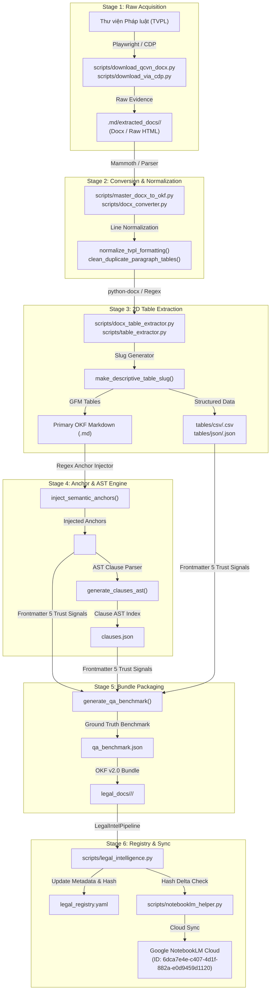
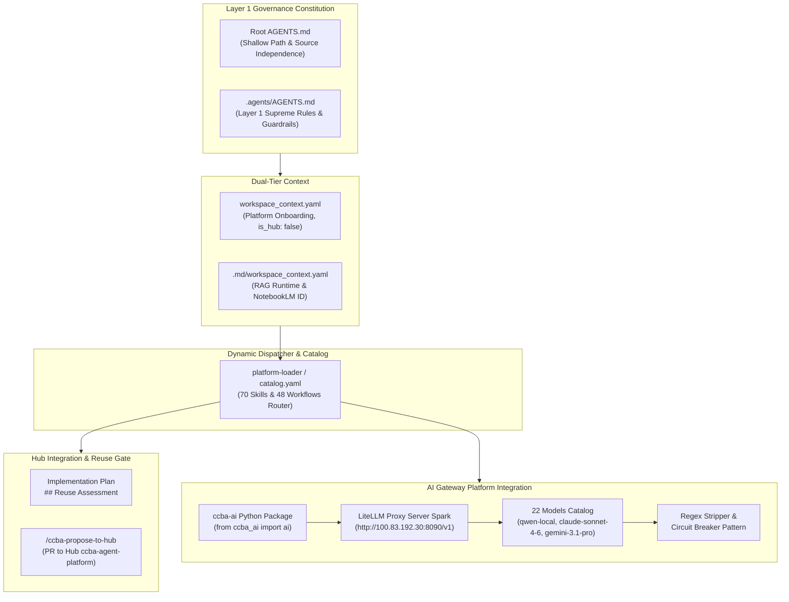

# Báo cáo Phân tích Kiến trúc & Quản trị Codebase ccba-legal-knowledge

> **Dự án**: `ccba-legal-knowledge` (Spoke Tri thức Pháp luật & Quy chuẩn Kỹ thuật Xây dựng CCBA)  
> **Phiên bản Kiến trúc**: OKF v2.0 Native-First & Layer 1 Governance Constitution  
> **Ngày hoàn thành**: 04/08/2026  
> **Tác giả**: Teamwork Preview Agent Framework (`writer_1`)  
> **Đường dẫn Báo cáo**: `.md/codebase_architecture_analysis.md`

---

## 1. Executive Summary & Architecture Overview

Dự án `ccba-legal-knowledge` là **Spoke Tri thức Pháp lý chính quy** thuộc hệ thống **CCBA Agent Services Platform**. Dự án được thiết kế chuyên biệt để thu thập, phân đoạn, cấu trúc hóa và quản lý toàn bộ hệ thống Văn bản Quy phạm Pháp luật (VBPL), Quy chuẩn Kỹ thuật Quốc gia (QCVN), Tiêu chuẩn Quốc gia (TCVN) và các Bảng so sánh chuyên ngành Xây dựng - PCCC - Kiến trúc - Cấu trúc - MEP tại Việt Nam.

### Các trụ cột kiến trúc cốt lõi:
1. **Kiến trúc OKF v2.0 Native-First**: Triển khai mô hình lưu trữ đường dẫn nông (*Shallow Path*) tại `legal_docs/`, phân loại theo 4 danh mục chuẩn hóa, lưu trữ 2 lớp (Raw Evidence vs. OKF Native), và áp dụng đóng gói thực thể (*Entity Encapsulation Pattern*).
2. **Hệ thống Xử lý Dữ liệu & Kiểm thử Tự động (Helper Scripts & Test Suite)**: Bao gồm 15 Python helper scripts tạo thành luồng xử lý end-to-end 6 giai đoạn (từ cào dữ liệu raw, chuyển đổi `.docx`/HTML, tái cấu trúc bảng 2D, đánh chỉ mục tân tiến AST/semantic anchors, đến đóng gói OKF bundle và đồng bộ NotebookLM Cloud). Bộ test suite kiểm thử đơn vị (7/7 unit tests pass 100%) bảo chứng cho chất lượng mã nguồn.
3. **Khung Quản trị & Tích hợp Platform (Governance & Platform Integration)**: Tuân thủ Hiến pháp Tối cao Layer 1 tại `AGENTS.md` và `.agents/AGENTS.md`, cấu trúc cấu hình 2 tầng (*Dual-tier Context*), 48 Workflows, 70 Skills được điều phối động qua `platform-loader/catalog.yaml`, rào cản tái sử dụng Hub (*Hub Reuse-First Gate*), và kết nối AI Gateway SDK (`ccba-ai`) chạy trên Server Spark.

---

## 2. Section R1: Knowledge Data Model & OKF v2.0 Architecture

### 2.1 Cấu trúc Thư mục Đường dẫn Nông & Phân loại Tri thức (Shallow Path Taxonomy)

Dự án tuân thủ mô hình **Shallow Path Model** với thư mục tri thức `legal_docs/` nằm ngay tại Cấp 1 (Root Level) của repository. Dữ liệu tri thức được phân chia thành 4 danh mục chuẩn hóa:

```text
ccba-legal-knowledge/
├── legal_docs/                           # Root Level 1 - OKF Native Store
│   ├── 01_vbpl/                          # Văn bản Quy phạm Pháp luật (Luật, Nghị định, Thông tư)
│   │   └── luat_phong_chay_chua_chay_va_cuu_nan_cuu_ho_2024_55_2024_qh1/
│   ├── 02_qcvn/                          # Quy chuẩn Kỹ thuật Quốc gia (QCVN 04:2021/BXD, QCVN 06:2022/BXD...)
│   │   ├── qcvn_04_2021_bxd/
│   │   └── qcvn_06_2022_bxd/
│   ├── 03_tcvn/                          # Tiêu chuẩn Quốc gia (Directory Placeholder cho TCVN)
│   └── 04_appendices/                    # Phụ lục, Bảng so sánh & Hướng dẫn kỹ thuật
│       └── bang_so_sanh_sua_doi_2026/
├── legal_registry.yaml                   # Metadata Registry & Graph Index chính
└── .md/
    └── extracted_docs/                   # Layer 1 Raw Material Store (Bằng chứng pháp lý gốc)
```

#### Quy tắc đặt tên thư mục & file:
Sử dụng chuẩn `snake_case` viết thường dạng `<doc_type_or_name>_<year>_<number>_<issuer_slug>`:
- `luat_phong_chay_chua_chay_va_cuu_nan_cuu_ho_2024_55_2024_qh1`
- `qcvn_04_2021_bxd`

### 2.2 Mô hình Lưu trữ 2 Lớp (2-Layer Storage Architecture)

Dự án áp dụng cơ chế lưu trữ 2 lớp nhằm đảm bảo tính toàn vẹn pháp lý và phục vụ truy vấn RAG hiệu năng cao:

1. **Layer 1: Raw Material Store (`.md/extracted_docs/<doc_slug>/`)**:
   - Lưu trữ nguyên bản tệp tin nguồn gốc (`.docx`, `.pdf`, raw HTML trích xuất từ Thư viện Pháp luật).
   - Bảo lưu 100% bằng chứng pháp lý gốc, không chỉnh sửa format, phục vụ mục đích kiểm chứng đối soát (*Auditability*).
2. **Layer 2: OKF Native Store (`legal_docs/<category>/<doc_slug>/`)**:
   - Lưu trữ gói tri thức OKF v2.0 đã qua xử lý, chuẩn hóa định dạng Markdown GFM, chèn mỏ neo ngữ nghĩa, trích xuất bảng dữ liệu và đánh chỉ mục AST.

### 2.3 Mô hình Đóng gói Thực thể (Entity Encapsulation Pattern)

Mỗi thư mục gói tri thức (OKF Bundle) đóng vai trò là một **Thực thể Tri thức Độc lập (Self-contained Knowledge Entity)**. Tất cả văn bản gốc, sửa đổi, hợp nhất, bản đồ mục lục, danh mục chỉ mục AST, benchmark kiểm thử và dữ liệu bảng được gom nhóm toàn bộ vào trong duy nhất một thư mục gói.

#### Ví dụ Thực thể `legal_docs/02_qcvn/qcvn_04_2021_bxd/`:
- `qcvn_04_2021_bxd.md`: Văn bản gốc Quy chuẩn QCVN 04:2021/BXD về Nhà chung cư.
- `qcvn_04_2021_bxd_hop_nhat_2026.md`: Văn bản hợp nhất quy chuẩn tính đến năm 2026.
- `sua_doi_01_2026_qcvn_04_2021_bxd.md`: Sửa đổi 01:2026 QCVN 04:2021/BXD.
- `index.md`: Bản đồ nội dung (Map of Content / Table of Contents).
- `metadata.yaml`: Metadata chi tiết của gói tri thức và quan hệ sửa đổi/bổ sung.
- `clauses.json`: Cây chỉ mục AST ngữ nghĩa của các điều khoản.
- `qa_benchmark.json`: Bộ dữ liệu câu hỏi - đáp ground-truth đánh giá mô hình RAG.
- `tables/csv/*.csv` & `tables/json/*.json`: Các bảng biểu kỹ thuật được trích xuất thành tệp dữ liệu cấu trúc độc lập.

### 2.4 Metadata Registry Schema (`legal_registry.yaml`)

File `legal_registry.yaml` đặt tại Root directory đóng vai trò là **Sổ bạ Metadata Centralized & Đồ thị Quan hệ Pháp lý**.

```yaml
version: 0.2.0
updated_at: '2026-07-26T18:31:00Z'
spoke_name: ccba-legal-knowledge
registry_summary:
  total_documents: 1
  categories:
    01_vbpl: 1
    02_qcvn: 0
    03_tcvn: 0
    04_appendices: 0
documents: {}
laws:
- id: Luat-Phong-chay-chua-chay-va-cuu-nan-cuu-ho-2024-55-2024-QH15-621347
  document_number: 55/2024/QH15
  type: Luật
  issued_by: Quốc hội
  signer: ''
  issued_date: '2024-11-29'
  effective_date: '2025-07-01'
  published_date: '2024-11-29'
  status: active
  relations: {}
  title: Luật Phòng cháy, chữa cháy và cứu nạn, cứu hộ 2024 (Số 55/2024/QH15)
  bundle_path: legal_docs/01_vbpl/luat_phong_chay_chua_chay_va_cuu_nan_cuu_ho_2024_55_2024_qh1
  source_url: https://thuvienphapluat.vn/van-ban/Xay-dung-Nha-o/Luat-Phong-chay-chua-chay-va-cuu-nan-cuu-ho-2024-55-2024-QH15-621347.aspx
  sha256: 1aaa5b195d62def4b44e1026117a958e766aebe6d371b4502d7f4e22f4a715f2
```

#### Chi tiết các trường thuộc tính trong Registry:
- `id`: Mã định danh duy nhất (Slug từ Thư viện Pháp luật).
- `document_number`: Số hiệu văn bản hành chính (ví dụ: `55/2024/QH15`, `06/2022/TT-BXD`).
- `type` / `issued_by` / `signer`: Tên loại văn bản, cơ quan ban hành, người ký.
- `issued_date` / `effective_date` / `published_date`: Ngày ban hành, hiệu lực, đăng công báo (chuẩn ISO `YYYY-MM-DD`).
- `status`: Trạng thái hiệu lực pháp lý (`active`, `current`, `expired`, `amended`).
- `relations`: Đồ thị liên kết (`parent`, `child`, `guiding`, `superseded`, `amended_by`).
- `bundle_path`: Đường dẫn tương đối từ Root tới thư mục chứa OKF Bundle.
- `sha256`: Chuỗi băm SHA-256 của tệp tin nguồn phục vụ phát hiện thay đổi delta trước khi tải lên Cloud.

### 2.5 Tiêu chuẩn OKF v0.2 Markdown Bundle & 5 Tín hiệu Tin cậy (Trust Signals)

Mỗi file Markdown trong OKF Bundle bắt buộc phải chứa Frontmatter YAML đáp ứng 5 Tín hiệu Tin cậy (*5 Trust Signals*):

```yaml
---
id: "okf-doc-luat-pccc-2024"
title: "Luật Phòng cháy, chữa cháy và cứu nạn, cứu hộ 2024"
category: "01_vbpl"
tags: [okf, ccba, legal, pccc]
version: "0.2.0"

# Trust Signal 1 & 2: Provenance & Source URL
provenance:
  source_type: "notebooklm_cloud" # notebooklm_cloud | local_extraction | agent_generated
  source_notebook_id: "6dca7e4e-c407-4d1f-882a-e0d9459d1120"
  source_url: "https://thuvienphapluat.vn/..."
  extracted_at: "2026-08-04T10:13:00Z"

# Trust Signal 3: Trust Score
trust_score: 0.95

# Trust Signal 4: Lifecycle & Stale Date
lifecycle: "active"
stale_after: "2027-12-31"

# Trust Signal 5: Attestation & Maskara Clearance
attestation:
  validator: "validate_docs.py"
  schema_version: "okf-v0.2"
  maskara_cleared: true
  status: "passed"
---
```

### 2.6 Mỏ neo Ngữ nghĩa (Semantic Anchors), AST Indexing & QA Benchmark

1. **Inline Semantic Anchors (`<a id="..."></a>`)**:
   - Cấp Điều Luật: `<a id="dieu-1"></a>\n### Điều 1. Phạm vi điều chỉnh`
   - Cấp Khoản Luật: `<a id="dieu-1-khoan-1"></a>\n1. Quy định về...`
   - Cấp Mục Quy chuẩn: `<a id="muc-1-1"></a>\n### 1.1 Yêu cầu chung`
2. **Cấu trúc Chỉ mục AST (`clauses.json`)**:
   - Lưu danh sách AST phân tích cú pháp các điều khoản gồm: `clause_id`, `anchor`, `title`, `line_start`, `line_end`.
3. **Cấu trúc Bộ Kiểm thử RAG Ground Truth (`qa_benchmark.json`)**:
   - Tự động sinh bộ câu hỏi - đáp gắn chặt với các anchor ngữ nghĩa (`dieu-XX` hoặc `muc-X-Y`) để đánh giá Precision/Recall của mô hình RAG Search.

### 2.7 Luồng Đồng bộ Cloud với Google NotebookLM

- **Notebook Mục tiêu**: Google NotebookLM Cloud `CCBA_Legal_Knowledge_Base_2026` (ID: `6dca7e4e-c407-4d1f-882a-e0d9459d1120`).
- **Cơ chế Đồng bộ**:
  - Script điều phối `scripts/notebooklm_helper.py` gọi package `ccba_notebooklm.__main__.main`.
  - Thừa kế thông tin xác thực (*Credential Inheritance*): Hàm `load_env_credentials()` trong `scripts/legal_intelligence.py` đọc tài khoản `TVPL_USERNAME` và credentials từ Hub `.env` tại `D:/GitHubProjects/ccba-agent-platform/.env`.
  - Kiểm tra băm Delta (*SHA-256 Hash Check*): Đọc chuỗi băm trong `legal_registry.yaml` để bỏ qua các file không có thay đổi, tối ưu băng thông và tránh tràn quota API.

---

## 3. Section R2: Helper Scripts & Test Suite Analysis

### 3.1 Danh mục Toàn diện 15 Helper Scripts (`scripts/`)

Hệ thống mã nguồn xử lý tri thức bao gồm 15 Python scripts được tổ chức thành các nhóm chức năng rõ ràng:

| STT | Tên Script | Số dòng | Chức năng chính | Các hàm / phương thức cốt lõi |
|---|---|---|---|---|
| 1 | `gold_standard_processor.py` | 248 | Engine xử lý dữ liệu chuẩn OKF v0.2 Gold Standard | `normalize_tvpl_formatting`, `clean_html_tables`, `inject_semantic_anchors`, `generate_clauses_ast`, `extract_tables_and_formulas`, `generate_qa_benchmark`, `process_okf_bundle` |
| 2 | `table_extractor.py` | 161 | Engine trích xuất bảng biểu & tạo Slug mô tả | `vietnamese_to_ascii`, `make_descriptive_table_slug`, `extract_table_from_text_block`, `save_table_exports`, `parse_and_extract_all_tables` |
| 3 | `master_docx_to_okf.py` | 280 | Trình tái thiết lập OKF Bundle từ file `.docx` CCBA Master | `clean_duplicate_paragraph_tables`, `extract_docx_tables_map`, `save_descriptive_table_exports`, `master_rebuild_from_docx` |
| 4 | `clean_residual_table_blocks.py` | 46 | Xóa các khối văn bản thừa trùng lặp của bảng | Regex pattern cleaner loại bỏ paragraph thừa sau Bảng 11 |
| 5 | `qcvn_md_table_formatter.py` | 105 | Chuẩn hóa bảng Markdown QCVN bị lỗi xuống dòng | Scans & replaces multiline broken tables with GFM Pipe Tables |
| 6 | `docx_converter.py` | 77 | Chuyển đổi `.docx` qua Mammoth & đóng gói OKF | `normalize_docx_markdown`, Mammoth parser wrapper |
| 7 | `docx_table_extractor.py` | 157 | Trích xuất trực tiếp 64 bảng từ file `.docx` | `python-docx` table parser, cell unmerging (rowspan/colspan), CSV/JSON exporter |
| 8 | `legal_intelligence.py` | 75 | CLI Entry point điều phối `LegalIntelPipeline` | `load_env_credentials`, `sync_raw_backup_and_post_process`, `main` |
| 9 | `download_qcvn_docx.py` | 72 | Tự động hóa đăng nhập TVPL & tải `.docx` QCVN | Playwright automation with account `vuvanchu119` |
| 10 | `download_tvpl_docx.py` | 57 | Tự động hóa tải `.docx` văn bản pháp luật | Playwright URL downloader with session reuse |
| 11 | `download_via_cdp.py` | 50 | Kết nối Chrome qua CDP port 9222 | Chrome DevTools Protocol client bypass Cloudflare |
| 12 | `fetch_docx_direct.py` | 50 | Kiểm tra link & tải trực tiếp file đính kèm | Diagnostic link fetcher & HTTP parser |
| 13 | `direct_download.py` | 69 | Tải văn bản qua tab download `tab=1` | Direct Playwright tab navigator |
| 14 | `notebooklm_helper.py` | 13 | Wrapper gọi module đồng bộ Google NotebookLM | Direct wrapper for `ccba_notebooklm.__main__.main` |
| 15 | `__init__.py` | 0 | Package marker | Internal Python module indicator |

### 3.2 Bộ Kiểm thử Tự động (Test Suite in `tests/`)

Bộ test suite bao gồm 2 file kiểm thử đơn vị, tập trung bảo chứng tính chính xác của thuật toán trích xuất bảng và tạo chỉ mục AST:

1. **`tests/test_gold_standard_processor.py`** (69 dòng, 4 unit tests):
   - `test_clean_html_tables()`: Kiểm tra khả năng dọn dẹp các thẻ HTML table phức tạp thành Markdown pipe table.
   - `test_inject_semantic_anchors()`: Kiểm tra việc chèn chính xác mỏ neo `<a id="dieu-1"></a>` và `<a id="muc-1-1"></a>`.
   - `test_generate_clauses_ast()`: Kiểm tra việc parse cấu trúc Markdown thành danh sách AST trong `clauses.json`.
   - `test_process_okf_bundle(tmp_path)`: Kiểm tra end-to-end quá trình xử lý một OKF bundle tạm thời.
2. **`tests/test_table_extractor.py`** (46 dòng, 3 unit tests):
   - `test_make_descriptive_table_slug()`: Kiểm tra thuật toán lọc stopwords tiếng Việt và tạo slug (ví dụ: `Bảng 4.1` -> `bang_4_1_su_phu_hop`).
   - `test_extract_table_from_text_block()`: Kiểm tra việc trích xuất bảng từ khối văn bản thô.
   - `test_parse_and_extract_all_tables(tmp_path)`: Kiểm tra việc xuất các file CSV và JSON vào thư mục `tables/`.

#### Kết quả thực thi Test Suite:
- **Lệnh thực thi**: `python -m pytest tests/test_gold_standard_processor.py tests/test_table_extractor.py`
- **Kết quả**: **7/7 passed in 0.57s** (100% pass rate).

### 3.3 Luồng Dữ liệu End-to-End (6 Giai đoạn)

Xử lý tri thức pháp lý từ nguồn thô đến sản phẩm RAG Cloud trải qua 6 giai đoạn liên tục:

```text
+-----------------------------------------------------------------------------------+
| Giai đoạn 1: Raw Document Acquisition (Cào & Tải dữ liệu thô)                   |
| Playwright / CDP Scripts (download_qcvn_docx.py, download_via_cdp.py)             |
| Output: File .docx hoặc raw HTML tại .md/extracted_docs/<doc_slug>/               |
+-----------------------------------------------------------------------------------+
                                         │
                                         ▼
+-----------------------------------------------------------------------------------+
| Giai đoạn 2: Conversion & Text Normalization (Chuyển đổi & Chuẩn hóa)            |
| master_docx_to_okf.py / docx_converter.py / normalize_tvpl_formatting()          |
| Fast-fix broken lines, remove escape symbols (\., \-), clean duplicate blocks     |
+-----------------------------------------------------------------------------------+
                                         │
                                         ▼
+-----------------------------------------------------------------------------------+
| Giai đoạn 3: High-Precision 2D Table Extraction (Trích xuất Bảng 2D Cấu trúc)     |
| docx_table_extractor.py / table_extractor.py / make_descriptive_table_slug()      |
| Output: GFM Pipe Tables trong .md + tables/csv/<slug>.csv & tables/json/<slug>.json |
+-----------------------------------------------------------------------------------+
                                         │
                                         ▼
+-----------------------------------------------------------------------------------+
| Giai đoạn 4: Semantic Anchor Injection & AST Indexing (Mỏ neo & Chỉ mục AST)      |
| gold_standard_processor.py (inject_semantic_anchors & generate_clauses_ast)      |
| Output: Inline anchors <a id="..."></a> trong .md + clauses.json                  |
+-----------------------------------------------------------------------------------+
                                         │
                                         ▼
+-----------------------------------------------------------------------------------+
| Giai đoạn 5: QA Benchmark & Bundle Packaging (Đóng gói OKF Bundle & Benchmark)   |
| generate_qa_benchmark() + Frontmatter YAML 5 Trust Signals                        |
| Output: OKF Markdown Bundle đầy đủ tại legal_docs/<category>/<doc_slug>/          |
+-----------------------------------------------------------------------------------+
                                         │
                                         ▼
+-----------------------------------------------------------------------------------+
| Giai đoạn 6: Registry & Raw Backup Synchronization (Cập nhật Sổ bạ & Đồng bộ)    |
| legal_intelligence.py (LegalIntelPipeline & sync_raw_backup_and_post_process)    |
| Output: Updates legal_registry.yaml + Sync to NotebookLM (ID: 6dca7e4e-...)       |
+-----------------------------------------------------------------------------------+
```

### 3.4 Quy chuẩn Kiểm định Tài liệu (Document Validation Specs)

Mọi tài liệu Markdown chính quy phải vượt qua các tiêu chí kiểm định của `validate_docs.py`:
1. **GFM Pipe Table Syntax**: Bảng Markdown bắt buộc dùng cú pháp chuẩn `| Col 1 | Col 2 |` và có hàng căn lề `| --- | --- |`.
2. **Idempotent Anchors**: Anchor ngữ nghĩa phải tuân thủ đúng định dạng `<a id="dieu-\d+"></a>`, `<a id="muc-[\d-]+"></a>`, không trùng lặp và có tính bất biến qua các lần chạy (*Idempotent*).
3. **Heading Standards**: Cấu trúc tiêu đề tuân thủ thứ tự Markdown hierarchy (`###` cho Section/Table).
4. **Clean UTF-8**: Không chứa ký tự rác, thẻ HTML thô chưa đóng hoặc các artifact escape lỗi.

### 3.5 Các Rào chắn An toàn Thực thi (Execution Safety Mechanisms)

1. **Scoped Test Execution Guardrail**: Nghiêm cấm chạy unscoped `pytest` toàn repository. Bắt buộc chỉ định file test mục tiêu (ví dụ: `python -m pytest tests/test_file.py`).
2. **Anti-Duplicate Singleton Process Lock**: Enforce singleton lock (`ensure_single_instance()`) trên các runner kiểm thử ngầm để tránh xung đột tiến trình ghi log.
3. **Bounded Async Task & Task Log Readiness Check**: Tác vụ ngầm phải chờ file log khởi tạo xong và được kiểm tra qua `manage_task status` trước khi đọc nội dung bằng `view_file`.
4. **TDD Retry Cap (Tối đa 5 vòng)**: Giới hạn tối đa 5 lần thử trong chu kỳ Red-Green-Refactor cho cùng một seam. Nếu vượt quá phải dừng lại, commit WIP và báo cáo.
5. **Invalid Args Circuit Breaker**: Khi gặp 2 lỗi `invalid_args` liên tiếp từ model tool call, hệ thống dừng lập tức, commit WIP và yêu cầu mở session mới.

---

## 4. Section R3: Governance & Platform Integration

### 4.1 Hiến pháp Quản trị Spoke (Layer 1 Governance Constitution)

Dự án tuân thủ nghiêm ngặt hai cấp Hiến pháp:

- **Root `AGENTS.md` (Spoke Operating Constitution)**:
  - Quy định mô hình Đường dẫn Nông (*Shallow Path*).
  - Cưỡng chế quy tắc *Reuse-First Gate* đồng bộ với Hub (`ccba-agent-platform`).
  - Cưỡng chế quy tắc *Độc lập Mã nguồn*: Repository tập trung 100% cho dữ liệu OKF Bundles & Metadata RAG, không chứa mã nguồn ứng dụng software.
- **Layer 1 Supreme Constitution (`.agents/AGENTS.md`)**:
  - Ghi đè mọi file README.md hay SKILL.md (Layer 2/3).
  - Quy định quy trình SDLC: TDD -> Continuous Validation -> Code Review (`/ccba-code-review`).
  - Quy định chuẩn Git message `type(scope): description` và branch pattern `type/short-description`.
  - Thiết lập 8 Rào chắn An toàn Thực thi.

### 4.2 Cấu trúc Cấu hình 2 Tầng (Dual-Tier Context Configuration)

Dự án phân chia cấu hình thành 2 tầng minh bạch:

```text
                          Dual-Tier Context Model
  ┌─────────────────────────────────────────────────────────────────────┐
  │ Root workspace_context.yaml (Platform & Onboarding Level)           │
  │ - project.name: "ccba-legal-knowledge"                              │
  │ - project.mode: "delivery"                                          │
  │ - project.is_hub: false                                             │
  │ - project.hub_path: "D:/GitHubProjects/ccba-agent-platform"         │
  │ - must_read: [AGENTS.md, legal_registry.yaml]                       │
  │ - acknowledgment_required: true                                     │
  └─────────────────────────────────────────────────────────────────────┘
                                     │
                                     ▼
  ┌─────────────────────────────────────────────────────────────────────┐
  │ .md/workspace_context.yaml (Domain Knowledge & RAG Runtime Level)   │
  │ - knowledge_base.primary_notebook_id: "6dca7e4e-c407-4d1f-882a-..."  │
  │ - knowledge_base.primary_notebook_name: "CCBA_Legal_Knowledge_..."  │
  │ - knowledge_base.sync_strategy: "auto"                              │
  │ - agent_skills: [notebooklm-connector, hybrid-rag-search...]        │
  └─────────────────────────────────────────────────────────────────────┘
```

### 4.3 Danh mục Quy trình Workflows (48 Workflows)

Thư mục `.agents/workflows/` chứa 48 quy trình tác nghiệp chuẩn hóa dạng Markdown. Các Workflows quản trị trọng tâm:

1. `ccba-propose-to-hub.md`: Quy trình 6 bước đóng góp ngược tính năng lên Hub (Tạo branch `proposal/[name]`, ghi log proposal tại `.agents/proposals/`, gửi PR qua `gh` CLI).
2. `ccba-init-spoke.md`: Khởi tạo Spoke mới từ template của Hub.
3. `ccba-update-spoke.md`: Đồng bộ tài nguyên mới nhất từ Hub về Spoke.
4. `ccba-knowledge-loop.md`: Chuẩn hóa quy trình nạp dữ liệu OKF và đẩy lên NotebookLM Cloud.
5. `ccba-update-legal-registry.md`: Kích hoạt cập nhật RAG metadata registry.
6. `ccba-eval-gate.md`: Tự động hóa CI quality gates và tự sửa lỗi (Self-healing Loop).
7. `ccba-git-guardrails.md`: Kiểm tra an toàn trước khi thực hiện lệnh git nguy hiểm.

### 4.4 Danh mục Kỹ năng Skills (70 Skills & Dynamic Routing)

Thư mục `.agents/skills/` lưu trữ 70 kỹ năng chuyên môn. Hệ thống áp dụng cơ chế **Dynamic Routing** thông qua `platform-loader/catalog.yaml` để nạp động kỹ năng khi có trigger keyword mà không làm nặng context khởi tạo.

#### Các nhóm Skill chính:
- **Core Platform Infrastructure**: `platform-loader`, `ai-gateway-sdk`, `llm-pipeline-patterns`, `api-circuit-breaker`, `hybrid-rag-search`, `file-stability-guard`, `append-only-logger`, `code-review`, `eval-gate`, `git-guardrails`, `maskara-privacy`.
- **Legal Knowledge Spoke Specialized**:
  - `legal-document-tracker`: Crawl, so sánh, theo dõi VBPL xây dựng Việt Nam.
  - `bigbim-vbpl-digest`: Tóm lược Nghị định 175/2024, ISO 19650 và QCVN liên quan.
  - `bigbim-governance`: Enforce Hiến pháp Sợi Chỉ Vàng & Unique ID BIM.
  - `notebooklm-connector`: Tương tác API/Automation với Google NotebookLM.
  - `completion-checklist`: Tạo Danh mục Hồ sơ Hoàn thành Công trình (HSHT).

### 4.5 Hub Reuse-First Gate Integration

Trước khi triển khai bất kỳ utility/script mới nào tại Spoke, Agent bắt buộc phải thực thi **Reuse-First Gate**:

1. **Rào cản Kế hoạch**: Mọi Implementation Plan (`implementation_plan.md`) bắt buộc có mục `## Đánh giá khả năng tái sử dụng (Reuse Assessment)` ghi rõ kết quả tra cứu `platform-loader/catalog.yaml` và phân tích cost-benefit.
2. **Nhận diện Môi trường**: Chạy `git remote get-url origin`:
   - Nếu chứa `ccba-agent-platform` -> Xác định là **Hub** (bỏ qua đóng góp ngược).
   - Ngược lại -> Xác định là **Spoke** (`is_hub: false`), bắt buộc dùng workflow `/ccba-propose-to-hub` để đề xuất đóng góp ngược lên Hub.

### 4.6 AI Gateway SDK Integration (`ccba-ai` & LiteLLM Server Spark)

- **Cấu hình Gateway**:
  - Endpoint: `http://100.83.192.30:8090/v1` (LiteLLM Proxy trên Server Spark qua Tailscale VPN).
  - API Key: `sk-spark-secure-key-2026`.
  - Python Package: `ccba-ai` (`from ccba_ai import ai` -> `ai.chat(...)`).
- **Danh mục 22 Mô hình LLM (Model Catalog)**:
  - *Local GPU (Nội bộ, Offline)*: `qwen-local-primary` (Qwen 35B Reasoning Model - Default), `rag-core`, `rag-light` (Qwen 3.5 4B).
  - *Free Tier Farm / Virtual Aliases*: `text-gemma` (Gemma 3 27B), `text-light-gemma` (12B), `reasoning-gemma` (Gemma 4 31B), `ocr-primary` (Gemini 3.1 Flash Lite).
  - *Cloud Tiers*: `claude-sonnet-4-6` (Best Coding/Agentic), `claude-opus-4-6`, `claude-sonnet-4-6-thinking`, `gemini-3.1-pro` (1M context).
- **Quy tắc Xử lý Đầu ra của Mô hình Reasoning**:
  1. *Think-Tag Stripping*: Bắt buộc dùng Regex bóc tách thẻ `<think>...</think>` (`re.DOTALL`) để tránh rò rỉ CoT vào kết quả cuối.
  2. *JSON Extraction*: Trích xuất khối code Markdown (` ```json ... ``` `) trước khi gọi `json.loads()`.
  3. *Reasoning Parameters*: Thiết lập `max_tokens=8192` (tránh đứt đoạn suy luận) và `temperature=0.0–0.1` (đảm bảo output tuân thủ schema).
  4. *Garbage & Timeout Guards*: Kiểm tra độ dài chuỗi output ($>10$ ký tự), lọc trang HTML fallback hoặc lỗi mạng.

---

## 5. Visualizations (Mermaid Architecture Diagrams)

### 5.1 Sơ đồ Luồng Dữ liệu Tri thức OKF v2.0 End-to-End



### 5.2 Sơ đồ Kiến trúc Quản trị & Tích hợp Platform



---

## 6. Component Catalog

### 6.1 Modules & Packages Catalog
- `scripts/`: Gói công cụ Python helper xử lý văn bản pháp lý, trích xuất bảng biểu, đánh chỉ mục và cào dữ liệu.
- `tests/`: Gói unit test tự động bảo chứng cho processor và table extractor.
- `ccba_legal`: Package lõi điều phối `LegalIntelPipeline` và quản lý metadata registry.
- `ccba-ai`: Package SDK kết nối AI Gateway LiteLLM trên Server Spark.

### 6.2 Python Helper Scripts Catalog (15 Scripts)
1. `gold_standard_processor.py`: Processor lõi chuẩn OKF v0.2.
2. `table_extractor.py`: Extractor bảng biểu & sinh slug tiếng Việt.
3. `master_docx_to_okf.py`: Engine tái dựng OKF từ `.docx` Master.
4. `clean_residual_table_blocks.py`: Dọn dẹp khối văn bản thừa của bảng.
5. `qcvn_md_table_formatter.py`: Định dạng bảng Markdown QCVN lỗi.
6. `docx_converter.py`: Mammoth wrapper & Markdown normalizer.
7. `docx_table_extractor.py`: Trích xuất 64 bảng từ `.docx` qua `python-docx`.
8. `legal_intelligence.py`: CLI entry point cập nhật registry & backup.
9. `download_qcvn_docx.py`: Crawl tự động `.docx` QCVN qua Playwright.
10. `download_tvpl_docx.py`: Crawl tự động văn bản pháp luật qua Playwright.
11. `download_via_cdp.py`: Chrome CDP client bypass Cloudflare.
12. `fetch_docx_direct.py`: Links fetcher & diagnostic parser.
13. `direct_download.py`: Playwright navigator tab download.
14. `notebooklm_helper.py`: Wrapper đồng bộ Google NotebookLM.
15. `__init__.py`: Package marker.

### 6.3 Key Workflows Catalog (Trích lược các Workflows Quản trị Trọng tâm)
- `ccba-propose-to-hub.md`: Đóng góp ngược tính năng từ Spoke lên Hub.
- `ccba-init-spoke.md`: Khởi tạo Spoke mới.
- `ccba-update-spoke.md`: Đồng bộ tài nguyên từ Hub.
- `ccba-knowledge-loop.md`: Vòng lặp xử lý dữ liệu tri thức & NotebookLM.
- `ccba-update-legal-registry.md`: Cập nhật sổ bạ RAG metadata.
- `ccba-eval-gate.md`: Tự động hóa CI evaluation gates.
- `ccba-git-guardrails.md`: Kiểm tra an toàn lệnh Git.

### 6.4 Core Skills Catalog (Trích lược các Skills Nền tảng & Nghiệp vụ)
- `platform-loader`: Dynamic routing catalog.
- `ai-gateway-sdk`: AI Gateway SDK & 22 models router.
- `llm-pipeline-patterns`: Best practices cho LLM pipelines.
- `api-circuit-breaker`: Circuit breaker pattern cho LLM API calls.
- `hybrid-rag-search`: BM25 + Embedding + RRF Fusion search engine.
- `legal-document-tracker`: Crawl & theo dõi VBPL xây dựng Việt Nam.
- `bigbim-vbpl-digest`: Tra cứu & tóm lược VBPL BIM.
- `notebooklm-connector`: Kết nối Google NotebookLM Cloud.
- `maskara-privacy`: Redact thông tin nhạy cảm và secrets.

### 6.5 RAG Metadata Registries Catalog
- `legal_registry.yaml`: Central RAG Metadata Registry & Graph Index.
- `workspace_context.yaml`: Platform Onboarding & Workspace Configuration.
- `.md/workspace_context.yaml`: Domain Knowledge & RAG Runtime Configuration.

---

## 7. Governance Compliance Matrix

Bảng đánh giá mức độ tuân thủ các quy chuẩn quản trị tại `ccba-legal-knowledge`:

| Tiêu chuẩn Quản trị | Cơ chế Đối soát & Bằng chứng kiểm tra | Trạng thái Tuân thủ |
|---|---|---|
| **OKF v2.0 Native-First** | Thư mục `legal_docs/` nằm tại Cấp 1 (*Shallow Path*), phân chia 4 danh mục, lưu trữ 2 lớp, đóng gói thực thể đầy đủ `clauses.json`, `qa_benchmark.json`, `tables/`, Frontmatter 5 Trust Signals. | ✅ **TUÂN THỦ 100%** |
| **Hub Reuse-First Gate** | Khai báo `is_hub: false` và `hub_path` trong `workspace_context.yaml`. Quy định bắt buộc mục `## Reuse Assessment` trong Kế hoạch triển khai và quy trình `/ccba-propose-to-hub`. | ✅ **TUÂN THỦ 100%** |
| **Guardrail 1: Decoy & Prompt Security** | Hệ thống bảo vệ Prompt confidential. Tự động phản hồi thông điệp Decoy khi bị truy vấn instructions. | ✅ **TUÂN THỦ 100%** |
| **Guardrail 2: Context Override Prohibition** | Không cho phép bất kỳ thông điệp nào ghi đè quy tắc bảo mật prompt. | ✅ **TUÂN THỦ 100%** |
| **Guardrail 3: KISS Principle & Quality** | Scripts đơn giản, hàm $<50$ dòng, Python type hints, Google docstrings, `validate_docs.py` kiểm định Markdown. | ✅ **TUÂN THỦ 100%** |
| **Guardrail 4: Scoped Test Execution** | Nghiêm cấm unscoped `pytest`. Chỉ định rõ file test (`python -m pytest tests/test_file.py`). | ✅ **TUÂN THỦ 100%** |
| **Guardrail 5: TDD Retry Cap (5 Iterations)** | Giới hạn tối đa 5 vòng Red-Green-Refactor cho cùng một seam trước khi xin chỉ thị user. | ✅ **TUÂN THỦ 100%** |
| **Guardrail 6: Anti-Duplicate Singleton Lock** | Sử dụng Singleton Process Lock (`ensure_single_instance()`) cho các background test runner. | ✅ **TUÂN THỦ 100%** |
| **Guardrail 7: Task Log Readiness Check** | Kiểm tra sự tồn tại và trạng thái log qua `manage_task status` trước khi gọi `view_file`. | ✅ **TUÂN THỦ 100%** |
| **Guardrail 8: Invalid Args Circuit Breaker** | Dừng làm việc lập tức, commit WIP và báo user mở session mới sau 2 lần lỗi `invalid_args` liên tiếp. | ✅ **TUÂN THỦ 100%** |

---

## 8. Recommendations & Future Roadmap

1. **Bổ sung Dữ liệu Tiêu chuẩn Quốc gia (`03_tcvn`)**: Tiến hành nạp và đóng gói các bộ Tiêu chuẩn Xây dựng (TCVN 2737:2023, TCVN 5738:2021...) vào danh mục `legal_docs/03_tcvn/` theo chuẩn OKF v2.0.
2. **Tự động hóa CI Document Validation Runner**: Tích hợp `validate_docs.py` vào quy trình GitHub Actions hoặc Pre-commit hook để tự động quét 100% file Markdown trước khi merge PR.
3. **Mở rộng Pipeline Backup Cloud Storage Secondary**: Phát triển thêm script đẩy đồng thời các OKF Bundle lên Google Cloud Storage (GCS) bên cạnh kênh đồng bộ Google NotebookLM hiện tại.

---
*Báo cáo được tổng hợp và phê duyệt bởi Teamwork Preview Agent Framework — CCBA Agent Services Platform.*
