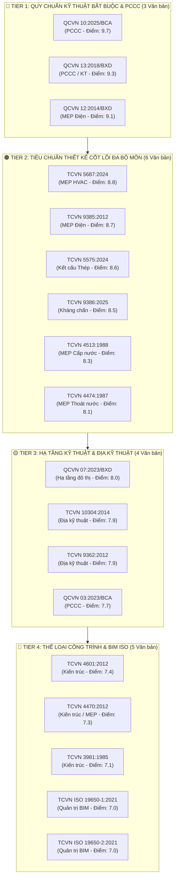

# 🗺️ Bản Đồ Chiến Lược & Lộ Trình Mở Rộng Kho Tri Thức Pháp Lý CCBA
## (Living Knowledge Expansion Roadmap — OKF v2.4 Universal)

> [!NOTE]
> **Đây là Tài Liệu Sống (Living Document) tự động cập nhật.**  
> Được đồng bộ tự động bởi `scripts/sync_expansion_roadmap.py` mỗi khi có văn bản mới được nạp vào Spoke hoặc khi chạy Master CI Gate.  
> **Lần cập nhật cuối:** `2026-09-05 14:21:52` | **Tiêu chuẩn:** OKF v2.4 Universal (ADRs 0021–0041)

---

## 📊 I. Bảng Đồng Hồ Tiến Độ Số Hóa (Live Ingestion KPI)

| Chỉ số theo dõi | Số lượng | Tỷ lệ hoàn thành | Trạng thái hệ thống |
|:---|:---:|:---:|:---:|
| **Hiện có trong Spoke (Active Bundles)** | **39** | **68.4%** | 🟢 Sẵn sàng phục vụ Agent |
| **Ứng viên Đang Chờ Nạp (Pending Target)** | **18** | **31.6%** | 🟡 Trong lộ trình ưu tiên |
| **Tổng quy mô mục tiêu giai đoạn 1** | **57** | **100.0%** | 🚀 Bao phủ toàn diện 4 bộ môn |

---

## 🧭 II. Bản Đồ Phân Tầng Trực Quan (Live Tiering Radar)

---

## 📋 III. Chi Tiết Các Tầng Ưu Tiên & Mã Lệnh Nạp Tự Động

### 🔴 TIER 1: Quy Chuẩn Kỹ Thuật Quốc Gia Bắt Buộc & An Toàn PCCC

| STT | Ký hiệu văn bản | Tên quy chuẩn / tiêu chuẩn | Bộ môn | Viện dẫn | Điểm | Lệnh nạp 1-Command (Universal Ingest) |
|:---:|:---|:---|:---:|:---:|:---:|:---|
| 1 | **[QCVN 10:2025/BCA](https://thuvienphapluat.vn/TCVN/Xay-dung/QCVN-10-2025-BCA-Trang-bi-bo-tri-phuong-tien-phong-chay-cho-nha-va-cong-trinh-922037.aspx)** | Quy chuẩn kỹ thuật quốc gia về Trang bị, bố trí phương tiện phòng cháy, chữa cháy, cứu nạn, cứu hộ cho nhà và công trình | PCCC | 7 | **9.7** | `python -m ccba_legal ingest "103/2025/TT-BCA" --category 02_qcvn --upload-drive` |
| 2 | **[QCVN 13:2018/BXD](https://thuvienphapluat.vn/TCVN/Xay-dung/QCVN-13-2018-BXD-ve-Gara-o-to-917827.aspx)** | Quy chuẩn kỹ thuật quốc gia về Gara ô tô | PCCC / KT | 4 | **9.3** | `python -m ccba_legal ingest "12/2018/TT-BXD" --category 02_qcvn --upload-drive` |
| 3 | **[QCVN 12:2014/BXD](https://thuvienphapluat.vn/TCVN/Dien-dien-tu/QCVN-12-2014-BXD-He-thong-dien-nha-o-nha-cong-cong-912596.aspx)** | Quy chuẩn kỹ thuật quốc gia về Hệ thống điện của nhà ở và nhà công cộng | MEP Điện | 3 | **9.1** | `python -m ccba_legal ingest "20/2014/TT-BXD" --category 02_qcvn --upload-drive` |

### 🟠 TIER 2: Tiêu Chuẩn Thiết Kế Cơ Sở Đa Bộ Môn (Kết Cấu, MEP)

| STT | Ký hiệu văn bản | Tên quy chuẩn / tiêu chuẩn | Bộ môn | Viện dẫn | Điểm | Lệnh nạp 1-Command (Universal Ingest) |
|:---:|:---|:---|:---:|:---:|:---:|:---|
| 1 | **[TCVN 5687:2024](https://thuvienphapluat.vn/TCVN/Xay-dung/Tieu-chuan-quoc-gia-5687-2024-Thong-gio-dieu-hoa-khong-khi-Yeu-cau-thiet-ke-921033.aspx)** | Thông gió và điều hòa không khí — Tiêu chuẩn thiết kế | MEP HVAC | 0 | **8.8** | `python -m ccba_legal ingest "TCVN 5687:2024" --category 03_tcvn --upload-drive` |
| 2 | **[TCVN 9385:2012](https://thuvienphapluat.vn/TCVN/Xay-dung/TCVN-9385-2012-chong-set-cho-cong-trinh-xay-dung-Huong-dan-thiet-ke-907546.aspx)** | Chống sét cho công trình xây dựng — Hướng dẫn thiết kế, kiểm tra và bảo trì | MEP Điện | 0 | **8.7** | `python -m ccba_legal ingest "TCVN 9385:2012" --category 03_tcvn --upload-drive` |
| 3 | **[TCVN 5575:2024](https://thuvienphapluat.vn/TCVN/Cong-nghiep/TCVN-5575-2024-Thiet-ke-ket-cau-thep-921459.aspx)** | Kết cấu thép — Tiêu chuẩn thiết kế | Kết cấu Thép | 0 | **8.6** | `python -m ccba_legal ingest "TCVN 5575:2024" --category 03_tcvn --upload-drive` |
| 4 | **[TCVN 9386:2025](https://thuvienphapluat.vn/TCVN/Xay-dung/TCVN-9386-1-2025-Thiet-ke-ket-cau-chiu-dong-dat-Phan-1-Quy-dinh-chung-cho-nha-922314.aspx)** | Thiết kế công trình chịu động đất (Phần 1 & Phần 5) | Kháng chấn | 0 | **8.5** | `python -m ccba_legal ingest "TCVN 9386:2025" --category 03_tcvn --upload-drive` |
| 5 | **[TCVN 4513:1988](https://thuvienphapluat.vn/TCVN/Tai-nguyen-Moi-truong/TCVN-4513-1988-cap-nuoc-ben-trong-tieu-chuan-thiet-ke-901934.aspx)** | Cấp nước bên trong — Tiêu chuẩn thiết kế | MEP Cấp nước | 0 | **8.3** | `python -m ccba_legal ingest "TCVN 4513:1988" --category 03_tcvn --upload-drive` |
| 6 | **[TCVN 4474:1987](https://thuvienphapluat.vn/TCVN/Xay-dung/TCVN-4474-1987-Thoat-nuoc-ben-trong-Tieu-chuan-thiet-ke-901988.aspx)** | Thoát nước bên trong — Tiêu chuẩn thiết kế | MEP Thoát nước | 0 | **8.1** | `python -m ccba_legal ingest "TCVN 4474:1987" --category 03_tcvn --upload-drive` |

### 🟡 TIER 3: Hạ Tầng Kỹ Thuật Đô Thị & Địa Kỹ Thuật Nền Móng

| STT | Ký hiệu văn bản | Tên quy chuẩn / tiêu chuẩn | Bộ môn | Viện dẫn | Điểm | Lệnh nạp 1-Command (Universal Ingest) |
|:---:|:---|:---|:---:|:---:|:---:|:---|
| 1 | **[QCVN 07:2023/BXD](https://thuvienphapluat.vn/van-ban/Xay-dung-Do-thi/Thong-tu-15-2023-TT-BXD-Quy-chuan-quoc-gia-QCVN-07-2023-BXD-He-thong-cong-trinh-ha-tang-ky-thuat-595312.aspx)** | Quy chuẩn kỹ thuật quốc gia về Hệ thống công trình hạ tầng kỹ thuật (Gồm 10 phần từ 07-1 đến 07-10) | Hạ tầng đô thị | 0 | **8.0** | `python -m ccba_legal ingest "15/2023/TT-BXD" --category 02_qcvn --upload-drive` |
| 2 | **[TCVN 10304:2014](https://thuvienphapluat.vn/TCVN/Xay-dung/TCVN-10304-2014-Mong-coc-Tieu-chuan-thiet-ke-912335.aspx)** | Móng cọc — Tiêu chuẩn thiết kế | Địa kỹ thuật | 0 | **7.9** | `python -m ccba_legal ingest "TCVN 10304:2014" --category 03_tcvn --upload-drive` |
| 3 | **[TCVN 9362:2012](https://thuvienphapluat.vn/TCVN/Xay-dung/TCVN-9362-2012-Tieu-chuan-thiet-ke-nen-nha-va-cong-trinh-906970.aspx)** | Tiêu chuẩn thiết kế nền nhà và công trình | Địa kỹ thuật | 2 | **7.9** | `python -m ccba_legal ingest "TCVN 9362:2012" --category 03_tcvn --upload-drive` |
| 4 | **[QCVN 03:2023/BCA](https://thuvienphapluat.vn/TCVN/Linh-vuc-khac/QCVN-03-2023-BCA-phuong-tien-phong-chay-chua-chay-920561.aspx)** | Quy chuẩn kỹ thuật quốc gia về Phương tiện phòng cháy và chữa cháy | PCCC | 0 | **7.7** | `python -m ccba_legal ingest "56/2023/TT-BCA" --category 02_qcvn --upload-drive` |

### 🔵 TIER 4: Chuẩn Hóa Thể Loại Công Trình & Quản Trị BIM ISO

| STT | Ký hiệu văn bản | Tên quy chuẩn / tiêu chuẩn | Bộ môn | Viện dẫn | Điểm | Lệnh nạp 1-Command (Universal Ingest) |
|:---:|:---|:---|:---:|:---:|:---:|:---|
| 1 | **[TCVN 4601:2012](https://thuvienphapluat.vn/TCVN/Xay-dung/TCVN-4601-2012-Cong-so-co-quan-hanh-chinh-nha-nuoc-Yeu-cau-thiet-ke-907722.aspx)** | Công sở cơ quan hành chính nhà nước — Yêu cầu thiết kế | Kiến trúc | 0 | **7.4** | `python -m ccba_legal ingest "TCVN 4601:2012" --category 03_tcvn --upload-drive` |
| 2 | **[TCVN 4470:2012](https://thuvienphapluat.vn/TCVN/Xay-dung/TCVN-4470-2012-Benh-vien-da-khoa-Tieu-chuan-thiet-ke-908251.aspx)** | Bệnh viện đa khoa — Yêu cầu thiết kế | Kiến trúc / MEP | 0 | **7.3** | `python -m ccba_legal ingest "TCVN 4470:2012" --category 03_tcvn --upload-drive` |
| 3 | **[TCVN 3981:1985](https://thuvienphapluat.vn/TCVN/Xay-dung/TCVN-3981-1985-truong-dai-hoc-tieu-chuan-thiet-ke-901893.aspx)** | Trường đại học — Tiêu chuẩn thiết kế | Kiến trúc | 0 | **7.1** | `python -m ccba_legal ingest "TCVN 3981:1985" --category 03_tcvn --upload-drive` |
| 4 | **[TCVN ISO 19650-1:2021](https://thuvienphapluat.vn/TCVN/Xay-dung/TCVN-14177-1-2024-To-chuc-va-so-hoa-thong-tin-ve-cong-trinh-xay-dung-Phan-1-921449.aspx)** | Tổ chức và số hóa thông tin về công trình xây dựng, bao gồm mô hình thông tin công trình (BIM) — Quản lý thông tin bằng BIM: Phần 1: Khái niệm và nguyên tắc | Quản trị BIM | 0 | **7.0** | `python -m ccba_legal ingest "TCVN ISO 19650-1:2021" --category 03_tcvn --upload-drive` |
| 5 | **[TCVN ISO 19650-2:2021](https://thuvienphapluat.vn/TCVN/Xay-dung/TCVN-14177-2-2024-To-chuc-va-so-hoa-thong-tin-ve-cong-trinh-xay-dung-Phan-2-921451.aspx)** | Tổ chức và số hóa thông tin về công trình xây dựng, bao gồm BIM — Quản lý thông tin bằng BIM: Phần 2: Giai đoạn chuyển giao tài sản | Quản trị BIM | 0 | **7.0** | `python -m ccba_legal ingest "TCVN ISO 19650-2:2021" --category 03_tcvn --upload-drive` |

## ✅ IV. Danh Mục Ứng Viên Đã Được Nạp Hoàn Tất

| Ký hiệu | Tên văn bản | Bộ môn | Ngày có hiệu lực | Trạng thái |
|:---|:---|:---:|:---:|:---:|
| **QCVN 10:2024/BXD** | Quy chuẩn kỹ thuật quốc gia về Xây dựng công trình đảm bảo tiếp cận sử dụng | Kiến trúc | 2025-02-01 | 🟢 `INGESTED` |
| **QCVN 09:2017/BXD** | Quy chuẩn kỹ thuật quốc gia về Các công trình xây dựng sử dụng năng lượng hiệu quả | KT / MEP | 2018-06-01 | 🟢 `INGESTED` |

---

## 🛠️ V. Giao Thức Tự Đồng Bộ & Tự Lành (Self-Healing Protocol)

Living Document này được bảo vệ và cập nhật tự động qua các cơ chế:
1. **Sau mỗi lệnh nạp mới (`ingest`)**: Engine tự động kiểm tra `legal_registry.yaml`, nhận diện văn bản mới và chuyển trạng thái từ `PENDING` $\rightarrow$ `INGESTED`.
2. **Khi chạy Master CI Validator (`scripts/validate_legal_spoke.py`)**: Gate 10 tự động gọi `sync_expansion_roadmap.py` để tính toán lại điểm trích dẫn và đồng bộ thứ tự ưu tiên.
