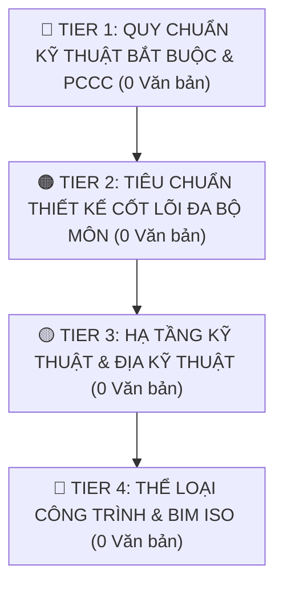

# 🗺️ Bản Đồ Chiến Lược & Lộ Trình Mở Rộng Kho Tri Thức Pháp Lý CCBA
## (Living Knowledge Expansion Roadmap — OKF v2.4 Universal)

> [!NOTE]
> **Đây là Tài Liệu Sống (Living Document) tự động cập nhật.**  
> Được đồng bộ tự động bởi `scripts/sync_expansion_roadmap.py` mỗi khi có văn bản mới được nạp vào Spoke hoặc khi chạy Master CI Gate.  
> **Lần cập nhật cuối:** `2026-09-22 15:01:00` | **Tiêu chuẩn:** OKF v2.4 Universal (ADRs 0021–0041)

---

## 📊 I. Bảng Đồng Hồ Tiến Độ Số Hóa (Live Ingestion KPI)

| Chỉ số theo dõi | Số lượng | Tỷ lệ hoàn thành | Trạng thái hệ thống |
|:---|:---:|:---:|:---:|
| **Hiện có trong Spoke (Active Bundles)** | **60** | **100.0%** | 🟢 Sẵn sàng phục vụ Agent |
| **Ứng viên Đang Chờ Nạp (Pending Target)** | **0** | **0.0%** | 🟡 Trong lộ trình ưu tiên |
| **Tổng quy mô mục tiêu giai đoạn 1** | **60** | **100.0%** | 🚀 Bao phủ toàn diện 4 bộ môn |

---

## 🧭 II. Bản Đồ Phân Tầng Trực Quan (Live Tiering Radar)

---

## 📋 III. Chi Tiết Các Tầng Ưu Tiên & Mã Lệnh Nạp Tự Động

### 🔴 TIER 1: Quy Chuẩn Kỹ Thuật Quốc Gia Bắt Buộc & An Toàn PCCC

*✅ Đã hoàn thành 100% các văn bản trong tầng này!*

### 🟠 TIER 2: Tiêu Chuẩn Thiết Kế Cơ Sở Đa Bộ Môn (Kết Cấu, MEP)

*✅ Đã hoàn thành 100% các văn bản trong tầng này!*

### 🟡 TIER 3: Hạ Tầng Kỹ Thuật Đô Thị & Địa Kỹ Thuật Nền Móng

*✅ Đã hoàn thành 100% các văn bản trong tầng này!*

### 🔵 TIER 4: Chuẩn Hóa Thể Loại Công Trình & Quản Trị BIM ISO

*✅ Đã hoàn thành 100% các văn bản trong tầng này!*

## ✅ IV. Danh Mục Ứng Viên Đã Được Nạp Hoàn Tất

| Ký hiệu | Tên văn bản | Bộ môn | Ngày có hiệu lực | Trạng thái |
|:---|:---|:---:|:---:|:---:|
| **QCVN 10:2024/BXD** | Quy chuẩn kỹ thuật quốc gia về Xây dựng công trình đảm bảo tiếp cận sử dụng | Kiến trúc | 2025-02-01 | 🟢 `INGESTED` |
| **QCVN 09:2017/BXD** | Quy chuẩn kỹ thuật quốc gia về Các công trình xây dựng sử dụng năng lượng hiệu quả | KT / MEP | 2018-06-01 | 🟢 `INGESTED` |
| **QCVN 10:2025/BCA** | Quy chuẩn kỹ thuật quốc gia về Trang bị, bố trí phương tiện phòng cháy, chữa cháy, cứu nạn, cứu hộ cho nhà và công trình | PCCC | 2025-12-30 | 🟢 `INGESTED` |
| **QCVN 13:2018/BXD** | Quy chuẩn kỹ thuật quốc gia về Gara ô tô | PCCC / KT | 2019-03-15 | 🟢 `INGESTED` |
| **QCVN 12:2014/BXD** | Quy chuẩn kỹ thuật quốc gia về Hệ thống điện của nhà ở và nhà công cộng | MEP Điện | 2015-07-01 | 🟢 `INGESTED` |
| **TCVN 5687:2024** | Thông gió và điều hòa không khí — Tiêu chuẩn thiết kế | MEP HVAC | 2024-02-07 | 🟢 `INGESTED` |
| **TCVN 5575:2024** | Kết cấu thép — Tiêu chuẩn thiết kế | Kết cấu Thép | 2024-12-24 | 🟢 `INGESTED` |
| **TCVN 9386:2025** | Thiết kế công trình chịu động đất (Phần 1 & Phần 5) | Kháng chấn | 2025-12-31 | 🟢 `INGESTED` |
| **TCVN 9385:2012** | Chống sét cho công trình xây dựng — Hướng dẫn thiết kế, kiểm tra và bảo trì | MEP Điện | 2012-12-20 | 🟢 `INGESTED` |
| **TCVN 4513:1988** | Cấp nước bên trong — Tiêu chuẩn thiết kế | MEP Cấp nước | 1988-01-01 | 🟢 `INGESTED` |
| **TCVN 4474:1987** | Thoát nước bên trong — Tiêu chuẩn thiết kế | MEP Thoát nước | 1987-01-01 | 🟢 `INGESTED` |
| **QCVN 07:2023/BXD** | Quy chuẩn kỹ thuật quốc gia về Hệ thống công trình hạ tầng kỹ thuật (Gồm 10 phần từ 07-1 đến 07-10) | Hạ tầng đô thị | 2024-07-01 | 🟢 `INGESTED` |
| **TCVN 10304:2014** | Móng cọc — Tiêu chuẩn thiết kế | Địa kỹ thuật | 2014-12-31 | 🟢 `INGESTED` |
| **TCVN 9362:2012** | Tiêu chuẩn thiết kế nền nhà và công trình | Địa kỹ thuật | 2012-12-20 | 🟢 `INGESTED` |
| **QCVN 03:2023/BCA** | Quy chuẩn kỹ thuật quốc gia về Phương tiện phòng cháy và chữa cháy | PCCC | 2024-04-01 | 🟢 `INGESTED` |
| **TCVN 4601:2012** | Công sở cơ quan hành chính nhà nước — Yêu cầu thiết kế | Kiến trúc | 2012-12-20 | 🟢 `INGESTED` |
| **TCVN 4470:2012** | Bệnh viện đa khoa — Yêu cầu thiết kế | Kiến trúc / MEP | 2012-12-20 | 🟢 `INGESTED` |
| **TCVN 3981:1985** | Trường đại học — Tiêu chuẩn thiết kế | Kiến trúc | 1985-01-01 | 🟢 `INGESTED` |
| **TCVN ISO 19650-1:2021** | Tổ chức và số hóa thông tin về công trình xây dựng, bao gồm mô hình thông tin công trình (BIM) — Quản lý thông tin bằng BIM: Phần 1: Khái niệm và nguyên tắc | Quản trị BIM | 2021-12-31 | 🟢 `INGESTED` |
| **TCVN ISO 19650-2:2021** | Tổ chức và số hóa thông tin về công trình xây dựng, bao gồm BIM — Quản lý thông tin bằng BIM: Phần 2: Giai đoạn chuyển giao tài sản | Quản trị BIM | 2021-12-31 | 🟢 `INGESTED` |

---

## 🛠️ V. Giao Thức Tự Đồng Bộ & Tự Lành (Self-Healing Protocol)

Living Document này được bảo vệ và cập nhật tự động qua các cơ chế:
1. **Sau mỗi lệnh nạp mới (`ingest`)**: Engine tự động kiểm tra `legal_registry.yaml`, nhận diện văn bản mới và chuyển trạng thái từ `PENDING` $\rightarrow$ `INGESTED`.
2. **Khi chạy Master CI Validator (`scripts/validate_legal_spoke.py`)**: Gate 10 tự động gọi `sync_expansion_roadmap.py` để tính toán lại điểm trích dẫn và đồng bộ thứ tự ưu tiên.
