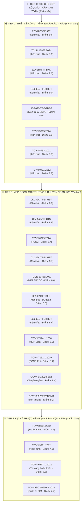

# 🗺️ Bản Đồ Chiến Lược & Lộ Trình Mở Rộng Kho Tri Thức Pháp Lý CCBA
## (Living Knowledge Expansion Roadmap — OKF v2.4 Universal)

> [!NOTE]
> **Đây là Tài Liệu Sống (Living Document) tự động cập nhật.**  
> Được đồng bộ tự động bởi `scripts/sync_expansion_roadmap.py` mỗi khi có văn bản mới được nạp vào Spoke hoặc khi chạy Master CI Gate.  
> **Lần cập nhật cuối:** `2026-10-03 10:53:51` | **Tiêu chuẩn:** OKF v2.4 Universal (ADRs 0021–0041)

---

## 📊 I. Bảng Đồng Hồ Tiến Độ Số Hóa (Live Ingestion KPI)

| Chỉ số theo dõi | Số lượng | Tỷ lệ hoàn thành | Trạng thái hệ thống |
|:---|:---:|:---:|:---:|
| **Hiện có trong Spoke (Active Bundles)** | **74** | **76.3%** | 🟢 Sẵn sàng phục vụ Agent |
| **Ứng viên Đang Chờ Nạp (Pending Target)** | **23** | **23.7%** | 🟡 Trong lộ trình ưu tiên |
| **Tổng quy mô mục tiêu giai đoạn 1** | **97** | **100.0%** | 🚀 Bao phủ toàn diện 4 bộ môn |

---

## 🧭 II. Bản Đồ Phân Tầng Trực Quan (Live Tiering Radar)

```mermaid
graph TD
    subgraph T1["🔴 TIER 1: THỂ CHẾ CỐT LÕI, ĐẤU THẦU & AN TOÀN (0 Văn bản)"]
    end

    subgraph T2["🟠 TIER 2: THIẾT KẾ CÔNG TRÌNH & MẪU ĐẤU THẦU (8 Văn bản)"]
        T2_1["225/2025/NĐ-CP<br/>(Đấu thầu - Điểm: 9.6)"]
        T2_2["TCVN 13967:2024<br/>(Kiến trúc - Điểm: 9.1)"]
        T2_3["83/VBHN-TT-BXD<br/>(Kiến trúc - Điểm: 9.1)"]
        T2_4["07/2024/TT-BKHĐT<br/>(Đấu thầu - Điểm: 9.0)"]
        T2_5["13/2020/TT-BGDĐT<br/>(Kiến trúc / CSVC - Điểm: 8.9)"]
        T2_6["TCVN 5065:2024<br/>(Kiến trúc - Điểm: 8.8)"]
        T2_7["TCVN 8793:2021<br/>(Kiến trúc - Điểm: 8.8)"]
        T2_8["TCVN 9411:2012<br/>(Kiến trúc - Điểm: 8.7)"]
    end

    subgraph T3["🟡 TIER 3: MEP, PCCC, MÔI TRƯỜNG & CHUYÊN NGÀNH (11 Văn bản)"]
        T3_1["05/2024/TT-BKHĐT<br/>(Đấu thầu - Điểm: 8.9)"]
        T3_2["105/2025/TT-BTC<br/>(Đấu thầu - Điểm: 8.9)"]
        T3_3["TCVN 6379:2024<br/>(PCCC - Điểm: 8.7)"]
        T3_4["02/2024/TT-BKHĐT<br/>(Đấu thầu - Điểm: 8.7)"]
        T3_5["TCVN 13456:2022<br/>(MEP / PCCC - Điểm: 8.6)"]
        T3_6["08/2021/TT-BXD<br/>(Kiến trúc / Dự toán - Điểm: 8.6)"]
        T3_7["03/2024/TT-BKHĐT<br/>(Đấu thầu - Điểm: 8.6)"]
        T3_8["TCVN 7114-1:2008<br/>(MEP Điện - Điểm: 8.5)"]
        T3_9["TCVN 7161-1:2009<br/>(PCCC Khí - Điểm: 8.4)"]
        T3_10["QCVN 01:2020/BCT<br/>(Chuyên ngành - Điểm: 8.4)"]
        T3_11["QCVN 26:2025/BNNMT<br/>(Môi trường - Điểm: 8.2)"]
    end

    subgraph T4["🔵 TIER 4: ĐỊA KỸ THUẬT, KIỂM ĐỊNH & BIM VẬN HÀNH (4 Văn bản)"]
        T4_1["TCVN 9361:2012<br/>(Địa kỹ thuật - Điểm: 7.7)"]
        T4_2["TCVN 9381:2012<br/>(Kiểm định - Điểm: 7.6)"]
        T4_3["TCVN 9377-1:2012<br/>(Thi công hoàn thiện - Điểm: 7.5)"]
        T4_4["TCVN ISO 19650-3:2024<br/>(Quản trị BIM - Điểm: 7.4)"]
    end

    T1 --> T2
    T2 --> T3
    T3 --> T4
```

---

## 📋 III. Chi Tiết Các Tầng Ưu Tiên & Mã Lệnh Nạp Tự Động

### 🔴 TIER 1: Thể Chế Cốt Lõi, Đấu Thầu & Quy Chuẩn Kỹ Thuật An Toàn

*✅ Đã hoàn thành 100% các văn bản trong tầng này!*

### 🟠 TIER 2: Thiết Kế Công Trình & Mẫu Hồ Sơ Đấu Thầu

| STT | Ký hiệu văn bản | Tên quy chuẩn / tiêu chuẩn | Bộ môn | Viện dẫn | Điểm | Lệnh nạp 1-Command (Universal Ingest) |
|:---:|:---|:---|:---:|:---:|:---:|:---|
| 1 | **[225/2025/NĐ-CP](https://congbao.chinhphu.vn/van-ban/nghi-dinh-so-225-2025-nd-cp-45892.htm)** | Nghị định sửa đổi, bổ sung một số điều của Nghị định số 23/2024/NĐ-CP và Nghị định số 115/2024/NĐ-CP quy định chi tiết thi hành Luật Đấu thầu về lựa chọn nhà đầu tư | Đấu thầu | 14 | **9.6** | `python -m ccba_legal ingest "225/2025/NĐ-CP" --category 01_vbpl --upload-drive` |
| 2 | **[TCVN 13967:2024](https://thuvienphapluat.vn/TCVN/Xay-dung/TCVN-13967-2024-Nha-o-rieng-le-Yeu-cau-chung-ve-thiet-ke-921867.aspx)** | Nhà ở riêng lẻ — Yêu cầu chung về thiết kế | Kiến trúc | 0 | **9.1** | `python -m ccba_legal ingest "TCVN 13967:2024" --category 03_tcvn --upload-drive` |
| 3 | **[83/VBHN-TT-BXD](https://thuvienphapluat.vn/van-ban/Xay-dung-Do-thi/Van-ban-hop-nhat-83-VBHN-TT-BXD-2026-ho-so-thiet-ke-kien-truc-chung-chi-hanh-nghe-661204.aspx)** | Văn bản hợp nhất Thông tư quy định chi tiết một số nội dung về hồ sơ thiết kế kiến trúc và mẫu chứng chỉ hành nghề kiến trúc | Kiến trúc | 0 | **9.1** | `python -m ccba_legal ingest "83/VBHN-TT-BXD" --category 01_vbpl --upload-drive` |
| 4 | **[07/2024/TT-BKHĐT](https://thuvienphapluat.vn/van-ban/Dau-tu/Thong-tu-07-2024-TT-BKH-DT-mau-ho-so-yeu-cau-bao-cao-danh-gia-kiem-tra-dau-thau-608412.aspx)** | Thông tư quy định chi tiết mẫu hồ sơ yêu cầu, báo cáo đánh giá, báo cáo thẩm định, kiểm tra, báo cáo tình hình thực hiện hoạt động đấu thầu | Đấu thầu | 0 | **9.0** | `python -m ccba_legal ingest "07/2024/TT-BKHĐT" --category 01_vbpl --upload-drive` |
| 5 | **[13/2020/TT-BGDĐT](https://thuvienphapluat.vn/van-ban/Giao-duc/Thong-tu-13-2020-TT-BGDDT-tieu-chuan-co-so-vat-chat-truong-mam-non-tieu-hoc-trung-hoc-443912.aspx)** | Thông tư ban hành Quy định tiêu chuẩn cơ sở vật chất các trường mầm non, tiểu học, trung học cơ sở, trung học phổ thông và trường phổ thông có nhiều cấp học | Kiến trúc / CSVC | 0 | **8.9** | `python -m ccba_legal ingest "13/2020/TT-BGDĐT" --category 01_vbpl --upload-drive` |
| 6 | **[TCVN 5065:2024](https://thuvienphapluat.vn/TCVN/Xay-dung/TCVN-5065-2024-Khach-san-Tieu-chuan-thiet-ke-922115.aspx)** | Khách sạn — Tiêu chuẩn thiết kế | Kiến trúc | 0 | **8.8** | `python -m ccba_legal ingest "TCVN 5065:2024" --category 03_tcvn --upload-drive` |
| 7 | **[TCVN 8793:2021](https://thuvienphapluat.vn/TCVN/Giao-duc/TCVN-8793-2021-Truong-tieu-hoc-Yeu-cau-thiet-ke-920412.aspx)** | Trường tiểu học — Yêu cầu thiết kế | Kiến trúc | 0 | **8.8** | `python -m ccba_legal ingest "TCVN 8793:2021" --category 03_tcvn --upload-drive` |
| 8 | **[TCVN 9411:2012](https://thuvienphapluat.vn/TCVN/Xay-dung/TCVN-9411-2012-Nha-o-lien-ke-Tieu-chuan-thiet-ke-906967.aspx)** | Nhà ở liên kế — Tiêu chuẩn thiết kế | Kiến trúc | 0 | **8.7** | `python -m ccba_legal ingest "TCVN 9411:2012" --category 03_tcvn --upload-drive` |

### 🟡 TIER 3: MEP, PCCC, Môi Trường & Chuyên Ngành Kỹ Thuật

| STT | Ký hiệu văn bản | Tên quy chuẩn / tiêu chuẩn | Bộ môn | Viện dẫn | Điểm | Lệnh nạp 1-Command (Universal Ingest) |
|:---:|:---|:---|:---:|:---:|:---:|:---|
| 1 | **[05/2024/TT-BKHĐT](https://thuvienphapluat.vn/van-ban/Dau-tu/Thong-tu-05-2024-TT-BKH-DT-chi-phi-lua-chon-nha-thau-nha-dau-tu-he-thong-mang-dau-thau-quoc-gia-606912.aspx)** | Thông tư quy định về quản lý và sử dụng các chi phí trong lựa chọn nhà thầu, nhà đầu tư trên Hệ thống mạng đấu thầu quốc gia | Đấu thầu | 1 | **8.9** | `python -m ccba_legal ingest "05/2024/TT-BKHĐT" --category 01_vbpl --upload-drive` |
| 2 | **[105/2025/TT-BTC](https://congbao.chinhphu.vn/van-ban/thong-tu-so-105-2025-tt-btc-46012.htm)** | Thông tư sửa đổi, bổ sung một số điều của Thông tư số 02/2024/TT-BKHĐT về hoạt động đào tạo, bồi dưỡng kiến thức và cấp chứng chỉ nghiệp vụ chuyên môn về đấu thầu | Đấu thầu | 20 | **8.9** | `python -m ccba_legal ingest "105/2025/TT-BTC" --category 01_vbpl --upload-drive` |
| 3 | **[TCVN 6379:2024](https://thuvienphapluat.vn/TCVN/PCCC/TCVN-6379-2024-Tru-nuoc-chua-chay-922150.aspx)** | Thiết bị chữa cháy — Trụ nước chữa cháy — Yêu cầu kỹ thuật và phương pháp thử | PCCC | 0 | **8.7** | `python -m ccba_legal ingest "TCVN 6379:2024" --category 03_tcvn --upload-drive` |
| 4 | **[02/2024/TT-BKHĐT](https://thuvienphapluat.vn/van-ban/Dau-tu/Thong-tu-02-2024-TT-BKH-DT-dao-tao-thi-cap-chung-chi-nghiep-vu-chuyen-mon-dau-thau-600312.aspx)** | Thông tư quy định về đào tạo, bồi dưỡng kiến thức và thi, cấp, thu hồi chứng chỉ nghiệp vụ chuyên môn về đấu thầu | Đấu thầu | 3 | **8.7** | `python -m ccba_legal ingest "02/2024/TT-BKHĐT" --category 01_vbpl --upload-drive` |
| 5 | **[TCVN 13456:2022](https://thuvienphapluat.vn/TCVN/PCCC/TCVN-13456-2022-Phuong-tien-chieu-sang-su-co-va-chi-dan-thoat-nan-920512.aspx)** | Phòng cháy chữa cháy — Phương tiện chiếu sáng sự cố và chỉ dẫn thoát nạn — Yêu cầu thiết kế, lắp đặt | MEP / PCCC | 0 | **8.6** | `python -m ccba_legal ingest "TCVN 13456:2022" --category 03_tcvn --upload-drive` |
| 6 | **[08/2021/TT-BXD](https://thuvienphapluat.vn/van-ban/Xay-dung-Do-thi/Thong-tu-08-2021-TT-BXD-huong-dan-chi-phi-lap-quy-che-quan-ly-kien-truc-487612.aspx)** | Thông tư hướng dẫn phương pháp xác định chi phí lập và tổ chức thực hiện quy chế quản lý kiến trúc | Kiến trúc / Dự toán | 0 | **8.6** | `python -m ccba_legal ingest "08/2021/TT-BXD" --category 01_vbpl --upload-drive` |
| 7 | **[03/2024/TT-BKHĐT](https://thuvienphapluat.vn/van-ban/Dau-tu/Thong-tu-03-2024-TT-BKH-DT-mau-ho-so-dau-thau-lua-chon-nha-dau-tu-du-an-dau-tu-kinh-doanh-600412.aspx)** | Thông tư quy định mẫu hồ sơ đấu thầu lựa chọn nhà đầu tư thực hiện dự án đầu tư kinh doanh | Đấu thầu | 0 | **8.6** | `python -m ccba_legal ingest "03/2024/TT-BKHĐT" --category 01_vbpl --upload-drive` |
| 8 | **[TCVN 7114-1:2008](https://thuvienphapluat.vn/TCVN/Xay-dung/TCVN-7114-1-2008-Ecgonomi-Chieu-sang-noi-lam-viec-Phan-1-Trong-nha-901412.aspx)** | Ecgônômi — Chiếu sáng nơi làm việc — Phần 1: Trong nhà | MEP Điện | 0 | **8.5** | `python -m ccba_legal ingest "TCVN 7114-1:2008" --category 03_tcvn --upload-drive` |
| 9 | **[TCVN 7161-1:2009](https://thuvienphapluat.vn/TCVN/PCCC/TCVN-7161-1-2009-He-thong-chua-chay-bang-khi-901512.aspx)** | Hệ thống chữa cháy bằng khí — Tính chất vật lý và thiết kế hệ thống — Phần 1: Yêu cầu chung | PCCC Khí | 0 | **8.4** | `python -m ccba_legal ingest "TCVN 7161-1:2009" --category 03_tcvn --upload-drive` |
| 10 | **[QCVN 01:2020/BCT](https://thuvienphapluat.vn/van-ban/Xay-dung-Do-thi/Thong-tu-15-2020-TT-BCT-Quy-chuan-ky-thuat-quoc-gia-yeu-cau-thiet-ke-cua-hang-xang-dau-447065.aspx)** | Quy chuẩn kỹ thuật quốc gia về Yêu cầu thiết kế cửa hàng xăng dầu (Ban hành kèm Thông tư 15/2020/TT-BCT) | Chuyên ngành | 30 | **8.4** | `python -m ccba_legal ingest "15/2020/TT-BCT" --category 02_qcvn --upload-drive` |
| 11 | **[QCVN 26:2025/BNNMT](https://thuvienphapluat.vn/van-ban/Tai-nguyen-Moi-truong/Thong-tu-01-2025-TT-BNNMT-QCVN-26-2025-QCVN-27-2025-tieng-on-do-rung-652312.aspx)** | Quy chuẩn kỹ thuật quốc gia về Tiếng ồn và Độ rung (Ban hành kèm Thông tư 01/2025/TT-BNNMT) | Môi trường | 0 | **8.2** | `python -m ccba_legal ingest "01/2025/TT-BNNMT" --category 02_qcvn --upload-drive` |

### 🔵 TIER 4: Địa Kỹ Thuật, Kiểm Định Thi Công & Quản Trị BIM ISO

| STT | Ký hiệu văn bản | Tên quy chuẩn / tiêu chuẩn | Bộ môn | Viện dẫn | Điểm | Lệnh nạp 1-Command (Universal Ingest) |
|:---:|:---|:---|:---:|:---:|:---:|:---|
| 1 | **[TCVN 9361:2012](https://thuvienphapluat.vn/TCVN/Xay-dung/TCVN-9361-2012-Cong-tac-nen-mong-Thi-cong-va-nghiem-thu-907123.aspx)** | Công tác nền móng — Thi công và nghiệm thu | Địa kỹ thuật | 0 | **7.7** | `python -m ccba_legal ingest "TCVN 9361:2012" --category 03_tcvn --upload-drive` |
| 2 | **[TCVN 9381:2012](https://thuvienphapluat.vn/TCVN/Xay-dung/TCVN-9381-2012-Huong-dan-danh-gia-muc-do-nguy-hiem-cua-ket-cau-nha-907412.aspx)** | Hướng dẫn đánh giá mức độ nguy hiểm của kết cấu nhà | Kiểm định | 0 | **7.6** | `python -m ccba_legal ingest "TCVN 9381:2012" --category 03_tcvn --upload-drive` |
| 3 | **[TCVN 9377-1:2012](https://thuvienphapluat.vn/TCVN/Xay-dung/TCVN-9377-1-2012-Cong-tac-hoan-thien-trong-xay-dung-Thi-cong-va-nghiem-thu-Phan-1-907651.aspx)** | Công tác hoàn thiện trong xây dựng — Thi công và nghiệm thu — Phần 1: Công tác lát và láng trong xây dựng | Thi công hoàn thiện | 0 | **7.5** | `python -m ccba_legal ingest "TCVN 9377-1:2012" --category 03_tcvn --upload-drive` |
| 4 | **[TCVN ISO 19650-3:2024](https://thuvienphapluat.vn/TCVN/Xay-dung/TCVN-14177-3-2024-To-chuc-va-so-hoa-thong-tin-ve-cong-trinh-xay-dung-Phan-3-921453.aspx)** | Tổ chức và số hóa thông tin về công trình xây dựng (BIM) — Quản lý thông tin bằng BIM: Phần 3 (Giai đoạn vận hành tài sản) và Phần 5 (Phương pháp tiếp cận an ninh) | Quản trị BIM | 0 | **7.4** | `python -m ccba_legal ingest "TCVN ISO 19650-3:2024" --category 03_tcvn --upload-drive` |

## ✅ IV. Danh Mục Ứng Viên Đã Được Nạp Hoàn Tất

| Ký hiệu | Tên văn bản | Bộ môn | Ngày có hiệu lực | Trạng thái |
|:---|:---|:---:|:---:|:---:|
| **QCVN 10:2024/BXD** | Quy chuẩn kỹ thuật quốc gia về Xây dựng công trình đảm bảo tiếp cận sử dụng | Kiến trúc | 2025-02-01 | 🟢 `INGESTED` |
| **QCVN 09:2017/BXD** | Quy chuẩn kỹ thuật quốc gia về Các công trình xây dựng sử dụng năng lượng hiệu quả | KT / MEP | 2018-06-01 | 🟢 `INGESTED` |
| **QCVN 10:2025/BCA** | Quy chuẩn kỹ thuật quốc gia về Trang bị, bố trí phương tiện phòng cháy, chữa cháy, cứu nạn, cứu hộ cho nhà và công trình | PCCC | 2025-12-30 | 🟢 `INGESTED` |
| **QCVN 13:2018/BXD** | Quy chuẩn kỹ thuật quốc gia về Gara ô tô | PCCC / KT | 2019-03-15 | 🟢 `INGESTED` |
| **QCVN 12:2014/BXD** | Quy chuẩn kỹ thuật quốc gia về Hệ thống điện của nhà ở và nhà công cộng | MEP Điện | 2015-07-01 | 🟢 `INGESTED` |
| **TCVN 5687:2024** | Thông gió và điều hòa không khí — Tiêu chuẩn thiết kế | MEP HVAC | 2024-02-07 | 🟢 `INGESTED` |
| **TCVN 5575:2024** | Kết cấu thép — Tiêu chuẩn thiết kế | Kết cấu Thép | 2024-12-24 | 🟢 `INGESTED` |
| **TCVN 9386:2025** | Thiết kế công trình chịu động đất (Phần 1 & Phần 5) | Kháng chấn | 2025-12-31 | 🟢 `INGESTED` |
| **TCVN 9385:2012** | Chống sét cho công trình xây dựng — Hướng dẫn thiết kế, kiểm tra và bảo trì | MEP Điện | 2012-12-20 | 🟢 `INGESTED` |
| **TCVN 4513:1988** | Cấp nước bên trong — Tiêu chuẩn thiết kế | MEP Cấp nước | 1988-01-01 | 🟢 `INGESTED` |
| **TCVN 4474:1987** | Thoát nước bên trong — Tiêu chuẩn thiết kế | MEP Thoát nước | 1987-01-01 | 🟢 `INGESTED` |
| **QCVN 07:2023/BXD** | Quy chuẩn kỹ thuật quốc gia về Hệ thống công trình hạ tầng kỹ thuật (Gồm 10 phần từ 07-1 đến 07-10) | Hạ tầng đô thị | 2024-07-01 | 🟢 `INGESTED` |
| **TCVN 10304:2014** | Móng cọc — Tiêu chuẩn thiết kế | Địa kỹ thuật | 2014-12-31 | 🟢 `INGESTED` |
| **TCVN 9362:2012** | Tiêu chuẩn thiết kế nền nhà và công trình | Địa kỹ thuật | 2012-12-20 | 🟢 `INGESTED` |
| **QCVN 03:2023/BCA** | Quy chuẩn kỹ thuật quốc gia về Phương tiện phòng cháy và chữa cháy | PCCC | 2024-04-01 | 🟢 `INGESTED` |
| **TCVN 4601:2012** | Công sở cơ quan hành chính nhà nước — Yêu cầu thiết kế | Kiến trúc | 2012-12-20 | 🟢 `INGESTED` |
| **TCVN 4470:2012** | Bệnh viện đa khoa — Yêu cầu thiết kế | Kiến trúc / MEP | 2012-12-20 | 🟢 `INGESTED` |
| **TCVN 3981:1985** | Trường đại học — Tiêu chuẩn thiết kế | Kiến trúc | 1985-01-01 | 🟢 `INGESTED` |
| **TCVN ISO 19650-1:2021** | Tổ chức và số hóa thông tin về công trình xây dựng, bao gồm mô hình thông tin công trình (BIM) — Quản lý thông tin bằng BIM: Phần 1: Khái niệm và nguyên tắc | Quản trị BIM | 2021-12-31 | 🟢 `INGESTED` |
| **TCVN ISO 19650-2:2021** | Tổ chức và số hóa thông tin về công trình xây dựng, bao gồm BIM — Quản lý thông tin bằng BIM: Phần 2: Giai đoạn chuyển giao tài sản | Quản trị BIM | 2021-12-31 | 🟢 `INGESTED` |
| **40/2019/QH14** | Luật Kiến trúc 2019 | Kiến trúc | 2020-07-01 | 🟢 `INGESTED` |
| **QCVN 18:2021/BXD** | Quy chuẩn kỹ thuật quốc gia về An toàn trong thi công xây dựng | An toàn thi công | 2022-06-20 | 🟢 `INGESTED` |
| **115/2024/NĐ-CP** | Nghị định quy định chi tiết một số điều và biện pháp thi hành Luật Đấu thầu về lựa chọn nhà đầu tư thực hiện dự án đầu tư có sử dụng đất | Đấu thầu | 2024-09-16 | 🟢 `INGESTED` |
| **QCVN 16:2023/BXD** | Quy chuẩn kỹ thuật quốc gia về Sản phẩm, hàng hóa vật liệu xây dựng | Vật liệu XD | 2024-01-01 | 🟢 `INGESTED` |
| **85/2020/NĐ-CP** | Nghị định quy định chi tiết một số điều của Luật Kiến trúc | Kiến trúc | 2020-09-07 | 🟢 `INGESTED` |
| **214/2025/NĐ-CP** | Nghị định quy định chi tiết một số điều và biện pháp thi hành Luật Đấu thầu về lựa chọn nhà thầu | Đấu thầu | 2025-08-04 | 🟢 `INGESTED` |
| **79/2025/TT-BTC** | Thông tư hướng dẫn việc cung cấp, đăng tải thông tin về đấu thầu và các mẫu hồ sơ đấu thầu trên Hệ thống mạng đấu thầu quốc gia | Đấu thầu | 2025-08-04 | 🟢 `INGESTED` |
| **27/2023/QH15** | Luật Nhà ở 2023 | Pháp chế Nhà ở | 2024-08-01 | 🟢 `INGESTED` |
| **31/2024/QH15** | Luật Đất đai 2024 | Pháp lý Đất đai | 2024-08-01 | 🟢 `INGESTED` |
| **23/2024/NĐ-CP** | Nghị định quy định chi tiết một số điều và biện pháp thi hành Luật Đấu thầu về lựa chọn nhà đầu tư thực hiện dự án thuộc ngành, lĩnh vực quản lý | Đấu thầu | 2024-02-27 | 🟢 `INGESTED` |
| **47/2024/QH15** | Luật Quy hoạch đô thị và nông thôn 2024 | Quy hoạch đô thị | 2025-07-01 | 🟢 `INGESTED` |
| **98/2025/TT-BTC** | Thông tư hướng dẫn mẫu hồ sơ đấu thầu lựa chọn nhà đầu tư thực hiện dự án đầu tư theo phương thức đối tác công tư, dự án đầu tư kinh doanh có sử dụng đất | Đấu thầu | 2025-10-27 | 🟢 `INGESTED` |
| **349/2026/NĐ-CP** | Nghị định sửa đổi, bổ sung một số điều của các Nghị định quy định chi tiết một số điều và biện pháp thi hành Luật Đấu thầu về lựa chọn nhà thầu | Đấu thầu | 2026-09-09 | 🟢 `INGESTED` |
| **57/2024/QH15** | Luật sửa đổi, bổ sung một số điều của Luật Quy hoạch, Luật Đầu tư, Luật Đầu tư theo phương thức đối tác công tư và Luật Đấu thầu | Đấu thầu / Thể chế | 2025-01-15 | 🟢 `INGESTED` |

---

## 🛠️ V. Giao Thức Tự Đồng Bộ & Tự Lành (Self-Healing Protocol)

Living Document này được bảo vệ và cập nhật tự động qua các cơ chế:
1. **Sau mỗi lệnh nạp mới (`ingest`)**: Engine tự động kiểm tra `legal_registry.yaml`, nhận diện văn bản mới và chuyển trạng thái từ `PENDING` $\rightarrow$ `INGESTED`.
2. **Khi chạy Master CI Validator (`scripts/validate_legal_spoke.py`)**: Gate 10 tự động gọi `sync_expansion_roadmap.py` để tính toán lại điểm trích dẫn và đồng bộ thứ tự ưu tiên.
