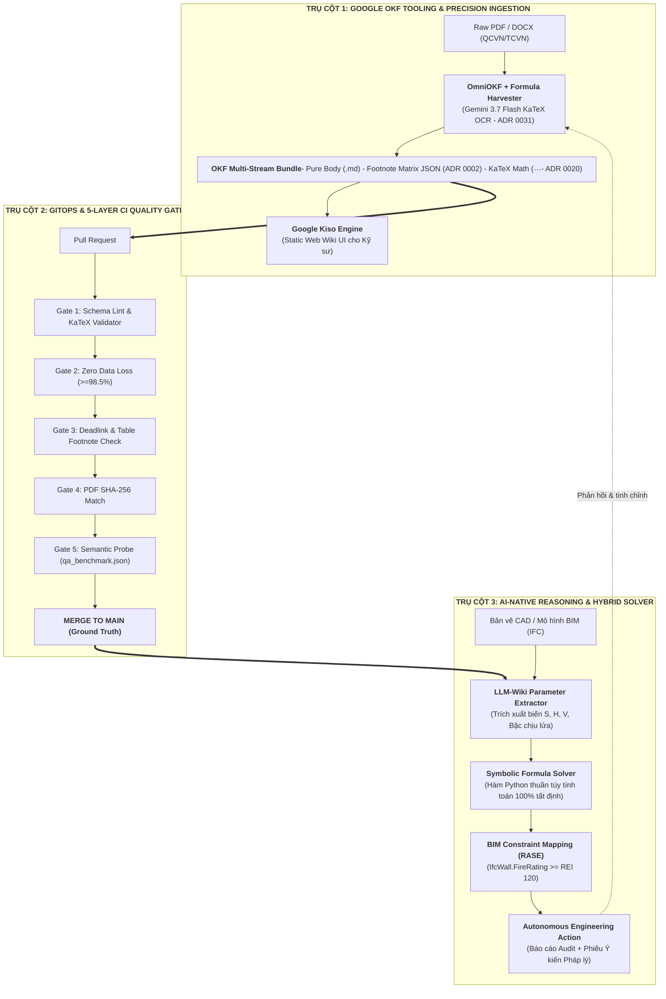
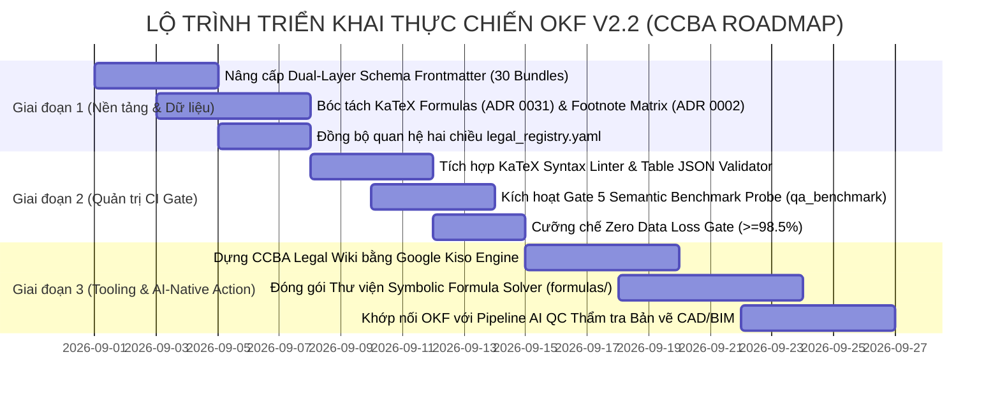

# 🏛️ CCBA Whitepaper: Google Open Knowledge Format (OKF) & AI-Native Architecture

> **Chủ đề:** Ứng dụng Open Knowledge Format (Google Cloud OKF Specification) vào Hệ thống Tri thức Pháp lý & Quy chuẩn Kỹ thuật Xây dựng CCBA  
> **Ngày cập nhật:** 2026-08-25  
> **Phiên bản:** 1.1.0 (OKF v2.2 Dual-Layer Native & Engineering Precision Engine)  
> **Tác giả:** CCBA Legal Intelligence Architecture Team & AI Brainstorming Engine  
> **Tài liệu liên quan:** [ADR 0002](file:///d:/GitHubProjects/ccba-legal-knowledge/docs/adr/0002-structured-table-footnote-binding.md), [ADR 0011](file:///d:/GitHubProjects/ccba-legal-knowledge/docs/adr/0011-atomic-clause-rag-chunking-strategy.md), [ADR 0016](file:///d:/GitHubProjects/ccba-legal-knowledge/docs/adr/0016-dual-track-hybrid-pdf-anchor-of-trust.md), [ADR 0020](file:///d:/GitHubProjects/ccba-legal-knowledge/docs/adr/0020-hybrid-symbolic-formula-solver-engine.md), [ADR 0021](file:///d:/GitHubProjects/ccba-legal-knowledge/docs/adr/0021-okf-v2-2-pure-normative-body-legal-graph.md), [ADR 0022](file:///d:/GitHubProjects/ccba-legal-knowledge/docs/adr/0022-okf-v2-2-qcvn-modular-annexes.md), [ADR 0030](file:///d:/GitHubProjects/ccba-legal-knowledge/docs/adr/0030-visual-parity-and-2d-navigation-matrix.md), [ADR 0031](file:///d:/GitHubProjects/ccba-legal-knowledge/docs/adr/0031-tvpl-vip-digital-pdf-priority-and-session-engine.md), [legal_registry.yaml](file:///d:/GitHubProjects/ccba-legal-knowledge/legal_registry.yaml)

---

## 1. Bối Cảnh & Nguồn Cảm Hứng (Context & References)

1. **Medium Post:** *"Beyond RAG: How Google's Open Knowledge Format (OKF) is Replacing the Vector Database"* (Secret Dev / *The Code Frontier*, 07/2026) — Luận giải về sự thất bại của Vector DB trong việc xử lý tri thức kỹ thuật đa tầng (Table chunking, ghost chunks, probabilistic error) và sự trỗi dậy của mô hình **LLM-Wiki / Deterministic Knowledge Graph**.
2. **Google Cloud Open Source Ecosystem:** [`GoogleCloudPlatform/knowledge-catalog`](https://github.com/GoogleCloudPlatform/knowledge-catalog) — Chuẩn mở OKF, trình biên dịch tài liệu đa phương thức `OmniOKF`, công cụ sinh schema `okc` và publishing engine `Kiso`.
3. **Thực trạng CCBA Spoke:** Kho tri thức `ccba-legal-knowledge` hiện quản lý $30$ văn bản quy phạm và tiêu chuẩn xây dựng cốt lõi theo tiêu chuẩn OKF v2.2 (Pure Normative Body, Atomic Templates, Table Attachments).

---

## 2. Nhật Ký Ý Tưởng Phiên Brainstorming (Ideation Log)

* `(AI)` Nhận diện 3 điểm nghẽn chí mạng của Vector RAG: Mù cấu trúc bảng biểu, Khủng hoảng đồng bộ/hộp đen, và Đứt gãy suy luận đa tầng.
* `(user)` Định hướng tích hợp đồng thời cả 3 trụ cột (Tooling Google $\leftrightarrow$ GitOps CI Gate $\leftrightarrow$ Agentic Graph Reasoning) thay vì chỉ chọn một góc nhìn hẹp.
* `(user)` Ưu tiên bắt đầu từ việc **Chuẩn hóa Schema Frontmatter** làm nền tảng kết nối.
* `(AI)` Đề xuất mô hình **Dual-Layer Schema**: Tầng Google OKF Core Spec đảm bảo tính tương thích mở, Tầng CCBA Legal Extensions phục vụ đồ thị pháp lý chuyên ngành.
* `(AI)` Đề xuất 4 hướng mở rộng quan hệ đồ thị: Cấp bậc hiệu lực (`enforcement`), Dẫn chiếu sâu Điều/Khoản (`clause_level_link`), Đột biến dòng thời gian (`temporal_mutations`), và Ánh xạ sang mô hình BIM (`bim_constraint_link`).
* `(user)` Khẳng định cả **Dẫn chiếu sâu Điều/Khoản** và **Ràng buộc Kỹ thuật BIM** đều mang giá trị đặc biệt cho định hướng **AI-Native Workflows**.
* `(AI)` Thiết kế chuỗi giá trị AI-Native 4 tầng: Legal Ground Truth $\rightarrow$ Atomic Clause Graph $\rightarrow$ Computational Rule (IFC/RASE) $\rightarrow$ Autonomous Action.
* `(user)` Kích hoạt quy trình `/ccba-wait-what` khảo sát toàn diện công cụ hiện có và đặc điểm cấu trúc dữ liệu kỹ thuật phức tạp (Bảng ma trận & Công thức toán học QCVN/TCVN).
* `(AI)` Khảo sát hệ thống package Hub (`ccba-legal-intel`), Spoke scripts (`validate_legal_spoke.py`, `qcvn_md_table_formatter.py`) và bộ ADRs nền tảng (ADR 0002, 0020, 0022, 0030, 0031):
  * **Giải pháp Bảng biểu:** Tách bảng CSV + JSON Ma trận Footnote (`tables_catalog.json` theo ADR 0002 & ADR 0030).
  * **Giải pháp Công thức:** Bóc tách KaTeX `$$...$$` bằng `AIVisionFormulaHarvester` (Gemini 3.7 Flash) + Động cơ tính toán giải tích lai ghép **Hybrid Symbolic Formula Solver Engine** (`formulas/` theo ADR 0020).

---

## 3. Kiến Trúc Tổng Thể: Mô Hình "Kiềng 3 Chân" Nâng Cấp Kỹ Thuật



---

## 4. Đặc Tả Chuẩn Hóa Schema Frontmatter (Dual-Layer OKF v2.2)

Mỗi tài liệu trong kho `legal_docs/` sẽ tuân thủ cấu trúc YAML Frontmatter 2 tầng:

```yaml
---
# ==============================================================================
# TẦNG 1: GOOGLE OKF CORE SPECIFICATION (Vendor-Neutral Open Standard)
# ==============================================================================
okf_version: "2.2"
type: "technical_standard_qcvn"     # legal_normative_body | technical_standard_qcvn | technical_standard_tcvn
title: "Quy chuẩn kỹ thuật quốc gia về An toàn cháy cho nhà và công trình (QCVN 06:2022/BXD)"
description: "Quy chuẩn kỹ thuật bắt buộc áp dụng về an toàn PCCC trong thiết kế, xây dựng nhà và công trình dân dụng, công nghiệp tại Việt Nam."
tags:
  - "pccc"
  - "qcvn_06"
  - "an_toan_chay"
  - "thoat_nan"
  - "ngan_chay"
timestamp: "2026-08-25T00:00:00Z"
resource: "legal_docs/02_qcvn/qcvn_06_2022_bxd/qcvn_06_2022_bxd.md"

# ==============================================================================
# TẦNG 2: CCBA LEGAL & TECHNICAL GRAPH EXTENSIONS
# ==============================================================================
doc_id: "qcvn_06_2022_bxd"
document_number: "QCVN 06:2022/BXD"
document_type: "QCVN"
issued_by: "Bộ Xây dựng"
signer: "Nguyễn Văn Sinh"
issued_date: "2022-11-30"
effective_date: "2023-01-16"
status: "active" # active | replaced | amended_consolidated

# Mỏ neo Pháp lý Tối thượng (ADR 0016)
pdf_anchor:
  path: "./sources/qcvn_06_2022_bxd_goc.pdf"
  sha256: "706a8bfbb2328ca11e2e54bd44849b22854256a2d68240cdf8fa320909c6f90b"
  cong_bao_number: "1187+1188/2022"

# Đồ thị Quan hệ Pháp lý Đa tầng có hướng (Legal Graph Edges)
relations:
  - target_id: "luat_phong_chay_chua_chay_2024_55_2024_qh15"
    relation_type: "based_on"
    enforcement: "mandatory"
  - target_id: "thong_tu_09_2023_tt_bxd"
    relation_type: "amended_by"
    effective_from: "2023-12-01"

# Danh mục Thành phẩm Nguyên tử & Kỹ thuật Số hóa (Engineering Artifacts)
artifacts:
  annexes_dir: "./annexes/"
  tables_dir: "./tables/"
  tables_catalog: "./tables/tables_catalog.json"
  formulas_dir: "./formulas/"
  benchmark_file: "./qa_benchmark.json"

# Ràng buộc Mô hình Kỹ thuật số BIM / IFC / RASE (ADR 0020 & ADR 0002)
bim_constraints:
  - ifc_entity: "IfcWall"
    property_set: "Pset_WallCommon.FireRating"
    rule_source: "#dieu_2_3"
    table_ref: "tables/json/bang_04.json"
    formula_ref: "formulas.fire_water_calc.calc_outdoor_fire_water_demand"
    requirement: "REI >= 120"
---
```

---

## 5. Bản Thiết Kế 5 Cổng Kiểm Thử GitOps CI Gate (Đã bổ sung Bảng & Toán học)

| Tầng Kiểm Thử | Tên Cổng | Cơ Chế Kiểm Tra | Tiêu Chuẩn Nghiệm Thu |
| :--- | :--- | :--- | :--- |
| **Gate 1** | **Schema & KaTeX Syntax Lint** | Parse YAML Frontmatter đối chiếu JSON Schema và quét cú pháp KaTeX (`$$...$$`). | $0$ Lỗi YAML, $100\%$ công thức KaTeX biên dịch hợp lệ. |
| **Gate 2** | **Zero Data Loss Audit** | Đo tổng dung lượng văn bản, số lượng Điều/Khoản và Bảng/Phụ lục so với DOCX gốc. | Tỷ lệ bảo toàn $\ge 98.5\%$, $100\%$ Điều/Khoản ($N/N$), $100\%$ Phụ lục ($M/M$). |
| **Gate 3** | **Anchor, Deadlink & Table Footnote Check** | Quét toàn bộ hyperlink nội bộ và kiểm tra tính hợp lệ của `condition_refs` trong bảng JSON (ADR 0002). | $0$ Deadlinks, $100\%$ Chú thích điều kiện liên kết đúng ID. |
| **Gate 4** | **PDF Cryptographic Match** | Đối soát mã băm SHA-256 tệp PDF đính kèm với `legal_registry.yaml`. | Trùng khớp $100\%$ mã băm SHA-256. |
| **Gate 5** | **Semantic & Calculation Probe (Regression)** | Chạy bộ câu hỏi mẫu từ `qa_benchmark.json` và kiểm thử Unit Test các hàm tính toán `formulas/` (ADR 0020). | $100\%$ Trích dẫn chính xác số hiệu Điều/Khoản, sai số số học $0\%$. |

---

## 6. Lộ Trình Triển Khai Thực Chiến Đã Điều Chỉnh (Action Plan v1.1)



### 📌 Giai đoạn 1: Chuẩn hóa Schema & Bóc tách Chuyên sâu Bảng/Toán học (Tuần 1)
* [ ] **Schema Migration:** Viết script nâng cấp Frontmatter của $30$ văn bản hiện có sang chuẩn Google OKF Core + CCBA Legal Extension.
* [ ] **KaTeX Formula Harvesting (ADR 0031):** Chạy `formula_harvester.py` trên toàn bộ các file QCVN/TCVN để chuyển $100\%$ công thức dạng ảnh sang mã KaTeX chuẩn `$$...$$` gắn `<!-- formula_id: "F_..." -->`.
* [ ] **Structured Footnote Extraction (ADR 0002):** Chạy bộ phân tích bảng biểu để tách riêng `tables/json/*.json` có cấu trúc footnote điều kiện và sinh `tables/tables_catalog.json`.
* [ ] **Registry Graph Sync:** Cập nhật liên kết quan hệ hai chiều (`replaces` $\leftrightarrow$ `replaced_by`, `detailed_by` $\leftrightarrow$ `based_on`) trong `legal_registry.yaml`.

### 📌 Giai đoạn 2: Nâng cấp Toàn diện Master CI Gate (Tuần 2)
* [ ] **KaTeX & Math Integrity Lint:** Bổ sung vào [`validate_legal_spoke.py`](file:///d:/GitHubProjects/ccba-legal-knowledge/scripts/validate_legal_spoke.py) bộ kiểm tra cú pháp KaTeX.
* [ ] **Table Footnote Linkage Check:** Kiểm tra tự động $100\%$ `condition_refs` trong ô bảng có trỏ đúng vào ID chú thích tồn tại trong file JSON.
* [ ] **Semantic & Calculation Probe (Gate 5):** Tích hợp kiểm thử tự động bộ câu hỏi trích dẫn từ `qa_benchmark.json` và chạy pytest cho các hàm tính toán `formulas/`.
* [ ] **GitHub Actions Workflow:** Cài đặt CI Pipeline tự động chạy 5 Cổng mỗi khi có PR đóng góp dữ liệu tri thức.

### 📌 Giai đoạn 3: Tích hợp Google Tooling & Động Cơ Tính Toán Lai Ghép (Tuần 3 - 4)
* [ ] **Google Kiso Web Wiki:** Dựng cổng tra cứu trực quan hỗ trợ render đầy đủ công thức KaTeX và bảng biểu ma trận 2D cho kỹ sư CCBA.
* [ ] **Symbolic Formula Solver Package (`formulas/`):** Xây dựng thư viện các hàm Python tính toán lưu lượng nước chữa cháy, hút khói theo QCVN 06 và TCVN 7336.
* [ ] **End-to-End AI-Native Test:** Thử nghiệm luồng thẩm tra thực tế từ bản vẽ thiết kế $\rightarrow$ Agent tra cứu OKF $\rightarrow$ trích xuất biến $\rightarrow$ gọi hàm Python tính toán $\rightarrow$ xuất Phiếu Ý kiến Pháp lý.
* [ ] **Ban hành ADR 0032:** Soạn thảo và ban hành chính thức **ADR 0032: Google OKF Interoperability & AI-Native Architecture**.

---

*Tài liệu được sinh tự động bởi CCBA AI Agent Platform — Brainstorming & Ingestion Workflow.*
