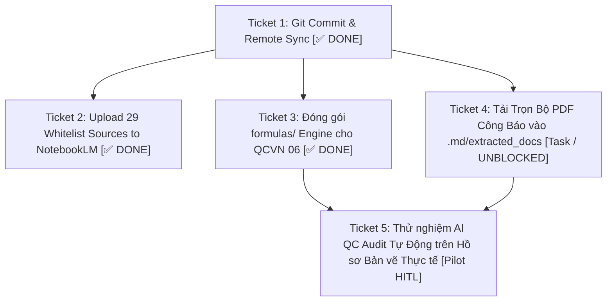

# Bản Đồ Định Hướng Tri Thức Pháp Lý CCBA (Wayfinder Map)

- **Mã Bản Đồ:** `WAYFINDER-LEGAL-KNOWLEDGE-V2`
- **Phiên bản:** 2.0.0
- **Ngày khởi tạo:** 2026-08-19
- **Người lập:** CCBA Legal Intelligence Architecture Team
- **Trạng thái:** Active (Đang vận hành)

---

## 1. Điểm Đích (Destination)

Xây dựng và vận hành thành công **Kho Tri thức Pháp lý Xây dựng & PCCC Việt Nam Chính quy (CCBA Legal Knowledge Spoke)** đạt chuẩn **OKF v2.0 Native-First**, đóng vai trò là "Bộ Não Luật Định" duy nhất cho toàn bộ hệ sinh thái CCBA Agent Platform, với các tiêu chí hoàn thành đo lường được:

1. **Dữ liệu Chuẩn hóa 100%:** 29+ văn bản quy chuẩn, luật, nghị định, thông tư được bóc tách cấu trúc, hợp nhất toàn văn, gắn thẻ neo bất biến và đối soát khớp $100\%$ với bản in PDF Công báo có dấu mộc đỏ nhà nước.
2. **Cây AST Giàu Siêu Dữ Liệu (Rich AST):** 100% điều khoản trong `clauses.json` được gắn nhãn Thẩm quyền (`CQXD`, `CONG_AN`, `CHU_DAU_TU_TU_THAM_DINH`), số trang công báo (`source_pdf_page`), mốc ân hạn chuyển tiếp (`grace_period_end`) và mã công thức kỹ thuật (`formula_id`).
3. **Bộ Động Cơ Tự Động Hóa:** Vận hành trơn tru Động cơ Hợp nhất Văn bản (AST Structural Patching Engine - ADR 0017) và Động cơ Tính toán Công thức Kỹ thuật (Hybrid Formula Solver Engine - ADR 0020).
4. **Đồng Bộ Đa Nền Tảng Tự Động:** Đồng bộ song song 32 nguồn Markdown sạch lên Google NotebookLM và đẩy cây AST Vector Embeddings lên Local Spark Vector DB (:8090) qua rào chắn Git-Ratchet CI Gates.

---

## 2. Ghi Chú & Ràng Buộc Kiến Trúc (Notes & Invariants)

- **Shallow Path Invariant:** `legal_docs/` nằm tại Cấp 1 của Spoke; `legal_registry.yaml` nằm tại Root.
- **Reuse-First Gate:** Mọi công cụ bóc tách tổng quát phải đóng gói vào Hub (`ccba-agent-platform/packages/ccba-legal`), Spoke chỉ chứa dữ liệu và runner script mỏng.
- **Legal Anchor of Trust (ADR 0016):** Mọi kết luận kiểm toán phải truy vết được về số trang và tệp PDF Công báo có dấu mộc đỏ.

---

## 3. Quyết Định Đã Chốt (Decisions So Far)

*   `[ADR 0011]` [Atomic Clause RAG Chunking Strategy](../../docs/adr/0011-atomic-clause-rag-chunking-strategy.md) — Giữ nguyên khối điều/khoản lớn ~800 tokens để bảo toàn điều kiện tiên quyết.
*   `[ADR 0012]` [Clean Unified NotebookLM Ingestion Strategy](../../docs/adr/0012-clean-unified-notebooklm-ingestion-strategy.md) — Chỉ nạp 32 nguồn Markdown sạch hiện hành, cách ly toàn bộ bản gốc/bản cũ.
*   `[ADR 0013]` [Dynamic Grace Period Compliance Gate](../../docs/adr/0013-dynamic-grace-period-compliance-gate.md) — Gán nhãn Cảnh báo vàng trong hạn ân hạn 6 tháng đến 15/06/2027 cho chung cư hiện hữu sạc xe điện.
*   `[ADR 0014]` [Split Jurisdiction PCCC Audit Routing](../../docs/adr/0014-split-jurisdiction-pccc-audit-routing.md) — Phân luồng thẩm quyền Sở Xây dựng (`CQXD`) vs Cảnh sát PC07 (`CONG_AN`) theo Luật 55/2024 & NĐ 105/2025.
*   `[ADR 0015]` [Unresolved Normative Reference Metadata Fallback](../../docs/adr/0015-unresolved-reference-metadata-fallback.md) — Định tuyến giao thức `legal://` về Thẻ Siêu dữ liệu Tra cứu & nút mở file PDF gốc.
*   `[ADR 0016]` [Dual-Track Hybrid Extraction & PDF Anchor of Trust](../../docs/adr/0016-dual-track-hybrid-pdf-anchor-of-trust.md) — DOCX bóc tách cấu trúc, PDF Công báo làm mỏ neo pháp lý tối thượng.
*   `[ADR 0017]` [AST Structural Patching Engine for Legislative Consolidation](../../docs/adr/0017-ast-structural-patching-consolidation-engine.md) — Hợp nhất văn bản xác định $100\%$ qua Semantic Action Tokens.
*   `[ADR 0018]` [Git-Ratchet Multi-Platform Knowledge Sync Topology](../../docs/adr/0018-git-ratchet-multi-platform-knowledge-sync.md) — Đồng bộ tự động kép có CI Gate lên Cloud NotebookLM và Local Server Spark.
*   `[ADR 0019]` [Tiered Audit Persona & Client Self-Audit Affidavit Engine](../../docs/adr/0019-tiered-audit-persona-and-self-audit-affidavit.md) — Phân hạng hồ sơ kiểm toán và tự động xuất Biên bản Tự Thẩm định PCCC theo NĐ 105/2025.
*   `[ADR 0020]` [Hybrid Symbolic Formula Solver Engine](../../docs/adr/0020-hybrid-symbolic-formula-solver-engine.md) — Trích xuất biến số qua LLM, tính toán số học xác định qua Python pure functions trong `formulas/`.

---

## 4. Danh Sách Ticket Ở Biên Giới (Frontier Tickets)

### 🎫 [Ticket 1: Đóng Gói Git Commit & Đồng Bộ Remote Hub](file:///d:/GitHubProjects/ccba-legal-knowledge) `[✅ DONE]`
- **Mục tiêu:** Thực hiện Commit có cấu trúc Conventional Commit cho toàn bộ 10 ADRs, bộ script CI Gates nâng cấp và dữ liệu AST `clauses.json` đã chuẩn hóa.
- **Trạng thái:** `✅ DONE` (Đã hoàn tất tại commit `2cc368b` & `254c55b` trên `main`).

### 🎫 [Ticket 2: Đồng Bộ 29 Nguồn Markdown Sạch lên Google NotebookLM](file:///d:/GitHubProjects/ccba-legal-knowledge/scripts/sync_notebooklm_knowledge.py) `[✅ DONE]`
- **Mục tiêu:** Kích hoạt `sync_notebooklm_knowledge.py` nạp 29 tệp Markdown hợp nhất (4.24 MB, 562,226 từ) vào Notebook `6dca7e4e-c407-4d1f-882a-e0d9459d1120`.
- **Trạng thái:** `✅ DONE` (Đã tải lên thành công 29/29 tệp và kiểm thử truy vấn RAG grounding chính xác 100%).

### 🎫 [Ticket 3: Xây Dựng Thư Viện Hàm Tính Toán `formulas/` cho QCVN 06](file:///d:/GitHubProjects/ccba-legal-knowledge/formulas) `[✅ DONE]`
- **Mục tiêu:** Lập trình các hàm tính toán xác định cho cấp nước chữa cháy ngoài nhà (Bảng 8), dung tích bể chứa, lưu lượng hút khói hành lang (Phụ lục D), sảnh thông tầng và bán kính Sprinkler (theo ADR 0020).
- **Trạng thái:** `✅ DONE` (Đã hoàn thành 6 module, đóng gói `SymbolicFormulaSolver` và vượt qua 12/12 unit tests).

### 🎫 [Ticket 4: Thu Thập & Tính Mã Băm Toàn Bộ File PDF Công Báo Gốc](file:///d:/GitHubProjects/ccba-legal-knowledge/scripts/fetch_tvpl_doc.py) `[Task / UNBLOCKED]`
- **Mục tiêu:** Chạy batch download file PDF Công báo cho 24 Nghị định/Thông tư còn lại và cập nhật `pdf_sha256` vào `legal_registry.yaml`.
- **Trạng thái:** `🟢 UNBLOCKED` (Sẵn sàng chạy ngay).

### 🎫 [Ticket 5: Thử Nghiệm Kiểm Toán Thẩm Tra PCCC Tự Động (AI QC Pilot Test)](file:///d:/GitHubProjects/ccba-legal-knowledge) `[Pilot / HITL]`
- **Mục tiêu:** Sử dụng một bộ hồ sơ thiết kế chung cư thực tế (có hạ tầng sạc xe điện) để chạy thử toàn trình AI QC Audit Pipeline phân luồng CQXD vs PC07 vs CDT Self-Audit.
- **Phụ thuộc:** `Blocked by: Ticket 4`.

---

## 5. Sương Mù Chiến Trận / Chưa Xác Định Rõ (Not Yet Specified)

1. **Tích hợp Ký số Điện tử Doanh nghiệp (Digital Signature HSM/USB Token):**
   - Cơ chế cắm USB Token hoặc Cloud HSM để tự động ký số lên Biên bản Tự thẩm định PCCC (.pdf) sau khi AI QC duyệt xong. Cần khảo sát API của Viettel-CA / VNPT-CA.
2. **Trình Xem PDF Tích Hợp Sẵn Tọa Độ Trang (Embedded Web PDF Viewer):**
   - Giao diện người dùng mở trực tiếp trang PDF Công báo có highlight điều khoản tương ứng trong trình duyệt Web.

---

## 6. Ngoài Phạm Vi (Out of Scope)

*   **Xây dựng Giao diện Web Frontend tổng thể:** Thuộc phạm vi của Spoke `ccba-ai-qc-frontend` hoặc Hub `ccba-agent-platform`.
*   **Số hóa Tiêu chuẩn Nước ngoài (NFPA, BS EN, IBC):** Chỉ tập trung $100\%$ cho hệ thống Văn bản Quy phạm Pháp luật và Quy chuẩn/Tiêu chuẩn chính thức của Việt Nam.
