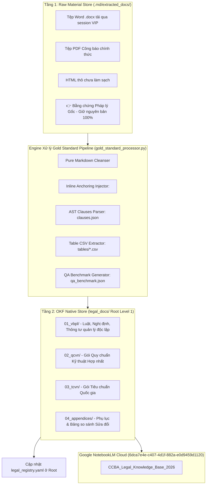

# 🗺️ Wayfinding Map: Kiến trúc Tổng thể Hệ thống Tri thức Pháp lý & Quy chuẩn CCBA (OKF v0.2 Native)

> **Trạng thái:** Active  
> **Repository:** `d:\GitHubProjects\ccba-legal-knowledge`  
> **Chủ sở hữu:** CCBA Agent Platform  
> **Chuẩn áp dụng:** Open Knowledge Format v0.2 (OKF v0.2 Native Spec)  

---

## 🎯 1. Điểm đích (Destination)

Vận hành khép kín **Hệ thống Tri thức Pháp lý & Quy chuẩn Kỹ thuật CCBA (`ccba-legal-knowledge`)**, đạt 100% tiêu chuẩn OKF v0.2 Native-First với:
1. **Kiến trúc Lưu trữ 2 Tầng:** Tầng 1 Raw Material Store (`.md/extracted_docs/`) & Tầng 2 Processed OKF Native Store (`legal_docs/`).
2. **Cấu trúc Thư mục Phẳng Root Cấp 1:** 4 nhóm tri thức `01_vbpl`, `02_qcvn`, `03_tcvn`, `04_appendices` tại Root level 1.
3. **Bọc gói Thực thể (Entity Encapsulation Pattern):** Mọi văn bản gốc, sửa đổi và hợp nhất của một Quy chuẩn nằm gọn trong 1 thư mục gói thực thể chính.
4. **Engine Xử lý Gold Standard Pipeline (`gold_standard_processor.py`):** Làm sạch Pure Markdown, Inline Anchors ``, chỉ mục AST `clauses.json`, bảng CSV `tables/`, và `qa_benchmark.json`.
5. **Đồ thị Quan hệ Metadata Root (`legal_registry.yaml`):** Quản lý mối quan hệ *Parent-Child*, *Guiding*, *Superseded* bằng YAML metadata tại Root.
6. **Cloud Indexing:** Đồng bộ tự động với Google NotebookLM Cloud chuyên biệt **`CCBA_Legal_Knowledge_Base_2026` (`6dca7e4e-c407-4d1f-882a-e0d9459d1120`)**.

---

## 📐 2. Sơ đồ Kiến trúc 2 Tầng & Luồng Dữ liệu

---

## ✅ 3. Quyết định Đã chốt (Decisions so far)

- [x] **[Phân tách 2 Tầng Lưu trữ]**: Tầng 1 Raw Store tại `.md/extracted_docs/` & Tầng 2 Processed OKF Store tại `legal_docs/`.
- [x] **[Mô hình Thư mục Phẳng Root Cấp 1](file:///d:/GitHubProjects/ccba-legal-knowledge/legal_docs/)**: Triển khai 4 nhóm tri thức `01_vbpl`, `02_qcvn`, `03_tcvn`, `04_appendices` tại Root level 1.
- [x] **[Hợp nhất Thông tư Ban hành vào Gói QCVN]**: Thông tư ban hành QCVN được nhúng siêu dữ liệu vào YAML Frontmatter của Gói QCVN tương ứng ở `02_qcvn/`.
- [x] **[Bọc gói Thực thể (Entity Encapsulation Pattern)]**: Bản gốc, bản sửa đổi và bản hợp nhất của QCVN 04 nằm gọn trong duy nhất 1 thư mục `qcvn_04_2021_bxd/`.
- [x] **[Gold Standard Processor Engine (`gold_standard_processor.py`)]**: Pure Markdown Cleansing, Inline Anchors ``, `clauses.json`, `tables/*.csv`, `qa_benchmark.json`. (4/4 Unit Tests Passed).
- [x] **[Khởi tạo Notebook Cloud Chuyên biệt](file:///d:/GitHubProjects/ccba-legal-knowledge/.md/workspace_context.yaml)**: Notebook `CCBA_Legal_Knowledge_Base_2026` (`6dca7e4e-c407-4d1f-882a-e0d9459d1120`).
- [x] **[Hoàn tất Đóng gói Gold Standard cho Luật PCCC 2024, QCVN 06 & QCVN 04]**:
  - Luật PCCC 2024: **258 Khoản/Điều AST**, **55 bộ Q&A**.
  - QCVN 06:2022/BXD: **433 Mục AST**, **317 bộ Q&A**.
  - QCVN 04:2021/BXD: **103 Mục AST**, **103 bộ Q&A**.

---

## 🚩 4. Các Ticket ở Biên giới (Frontier Action Tickets)

### 🎫 [Ticket-INT-01] [Task AFK] Auto-save Raw Downloads to `.md/extracted_docs/`
- **Mục tiêu:** Cập nhật `legal_intelligence.py` tự động lưu bản sao tệp thô (.docx, PDF, HTML) vào `.md/extracted_docs/<doc_slug>/` khi cào.
- **Loại:** `Task [AFK]` | **Assignee:** Unassigned

### 🎫 [Ticket-INT-02] [Task AFK] Crawl & Process Luật Xây dựng 2025 (135/2025/QH15)
- **Mục tiêu:** Cào toàn văn Luật Xây dựng 2025, lưu tệp thô vào `.md/extracted_docs/` và đóng gói Gold Standard OKF vào `legal_docs/01_vbpl/`.
- **Loại:** `Task [AFK]` | **Assignee:** Unassigned

### 🎫 [Ticket-INT-03] [Task AFK] Crawl & Process Luật Quy hoạch đô thị và nông thôn 2024 (47/2024/QH15)
- **Mục tiêu:** Cào toàn văn Luật Quy hoạch đô thị 2024 và đóng gói Gold Standard OKF.
- **Loại:** `Task [AFK]` | **Assignee:** Unassigned

### 🎫 [Ticket-INT-04] [Task AFK] Crawl & Process TCVN 3890:2023 (Phương tiện PCCC)
- **Mục tiêu:** Cào và đóng gói Tiêu chuẩn PCCC TCVN 3890 vào `legal_docs/03_tcvn/`.
- **Loại:** `Task [AFK]` | **Assignee:** Unassigned

---
*Khởi tạo bởi CCBA Wayfinder Agent — 2026-07-26*
