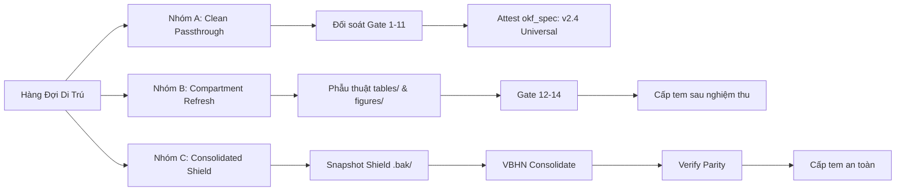

# Hàng Đợi Di Trú & Kiểm Toán Nguồn Gốc Tri Thức (OKF v2.4 Universal Provenance Queue)

> [!IMPORTANT]
> **Tài liệu kiểm toán nguồn gốc độc lập của CCBA Legal Spoke (Gate 15 ADR 0036 - ADR 0042).**
> Tuyệt đối không chạy script đóng dấu khống (False Attestation). Mọi việc cấp tem `okf_spec: v2.4 Universal`
> bắt buộc phải tuân theo Chiến lược Di trú Phân tầng (Tiered Migration Protocol).

- **Thời điểm quét:** `2026-09-24 23:24:58 UTC`
- **Tiêu chuẩn chuẩn hóa:** `v2.4 Universal` (Converter: `0.4.0`)
- **Quy mô kho tài liệu:** **60 văn bản** (57 gói tri thức chính quy + 3 ma trận đối chiếu)
- **Tiến độ cấp tem bảo chứng:** **57 / 57** (100.0%)

---

## 1. Ma Trận Phân Hạng Chiến Lược Di Trú (Strategy Matrix)

| Nhóm Phân Loại | Số Lượng | Bản Chất Dữ Liệu | Chiến Lược Di Trú Đề Xuất | Mức Độ Rủi Ro |
| :--- | :---: | :--- | :--- | :---: |
| **🟢 Nhóm A (Clean Passthrough)** | **20** | Luật, Nghị định, Thông tư thuần túy; bảng biểu mẫu phẳng | Chạy kiểm toán Gate 1-11, cấp tem Attestation có bảo chứng | 🟢 Rất Thấp |
| **🔶 Nhóm B (Compartment Refresh)** | **35** | QCVN/TCVN kỹ thuật dày đặc bảng số liệu 2D, KaTeX, đồ họa | Phẫu thuật cục bộ ngăn kéo `tables/` và `figures/cards/` | 🟡 Trung Bình |
| **🔷 Nhóm C (Consolidated Shield)** | **2** | Văn bản Hợp nhất VBHN có `bang_so_sanh_thay_doi.md` | Snapshot bảo vệ -> Chạy VBHN Engine tái hợp nhất | 🔴 Cần Cẩn Trọng |
| **🛡️ Phụ Lục Nội Bộ** | **3** | Ma trận đối chiếu VBHN nội bộ CCBA | Bảo tồn nguyên trạng (Internal Document) | 🟢 Không Áp Dụng |

---

## 2. Danh Sách Chi Tiết Hàng Đợi 38 Văn Bản

| STT | Số Hiệu / ID | Thể Loại | Nhóm Di Trú | Trạng Thái Gate 15 | Đặc Tính (Math / Table / Fig) | Hành Động Đề Xuất |
| :---: | :--- | :--- | :--- | :---: | :--- | :--- |
| 1 | `10/2021/NĐ-CP` | Nghị định | 🟢 Nhóm A (Clean Passthrough) | ✅ VERIFIED | Văn bản thuần túy | Attestation hợp chuẩn sau khi đối soát Gate 1-11 |
| 2 | `22/2023/QH15` | Luật | 🟢 Nhóm A (Clean Passthrough) | ✅ VERIFIED | Văn bản thuần túy | Attestation hợp chuẩn sau khi đối soát Gate 1-11 |
| 3 | `55/2024/QH15` | Luật | 🟢 Nhóm A (Clean Passthrough) | ✅ VERIFIED | Văn bản thuần túy | Attestation hợp chuẩn sau khi đối soát Gate 1-11 |
| 4 | `135/2025/QH15` | Luật | 🟢 Nhóm A (Clean Passthrough) | ✅ VERIFIED | Văn bản thuần túy | Attestation hợp chuẩn sau khi đối soát Gate 1-11 |
| 5 | `105/2025/NĐ-CP` | Nghị định | 🟢 Nhóm A (Clean Passthrough) | ✅ VERIFIED | Văn bản thuần túy | Attestation hợp chuẩn sau khi đối soát Gate 1-11 |
| 6 | `193/2026/NĐ-CP` | Nghị định | 🟢 Nhóm A (Clean Passthrough) | ✅ VERIFIED | 5 CSV/5 JSON | Attestation hợp chuẩn sau khi đối soát Gate 1-11 |
| 7 | `206/2026/NĐ-CP` | Nghị định | 🟢 Nhóm A (Clean Passthrough) | ✅ VERIFIED | Văn bản thuần túy | Attestation hợp chuẩn sau khi đối soát Gate 1-11 |
| 8 | `207/2026/NĐ-CP` | Nghị định | 🟢 Nhóm A (Clean Passthrough) | ✅ VERIFIED | 3 CSV/3 JSON | Attestation hợp chuẩn sau khi đối soát Gate 1-11 |
| 9 | `209/2026/NĐ-CP` | Nghị định | 🟢 Nhóm A (Clean Passthrough) | ✅ VERIFIED | Văn bản thuần túy | Attestation hợp chuẩn sau khi đối soát Gate 1-11 |
| 10 | `210/2026/NĐ-CP` | Nghị định | 🟢 Nhóm A (Clean Passthrough) | ✅ VERIFIED | Văn bản thuần túy | Attestation hợp chuẩn sau khi đối soát Gate 1-11 |
| 11 | `212/2026/NĐ-CP` | Nghị định | 🟢 Nhóm A (Clean Passthrough) | ✅ VERIFIED | 3 CSV/3 JSON | Attestation hợp chuẩn sau khi đối soát Gate 1-11 |
| 12 | `217/2026/NĐ-CP` | Nghị định | 🟢 Nhóm A (Clean Passthrough) | ✅ VERIFIED | 1 CSV/1 JSON | Attestation hợp chuẩn sau khi đối soát Gate 1-11 |
| 13 | `24/2024/NĐ-CP` | Nghị định | 🟢 Nhóm A (Clean Passthrough) | ✅ VERIFIED | Văn bản thuần túy | Attestation hợp chuẩn sau khi đối soát Gate 1-11 |
| 14 | `339/2026/NĐ-CP` | Nghị định | 🟢 Nhóm A (Clean Passthrough) | ✅ VERIFIED | Văn bản thuần túy | Attestation hợp chuẩn sau khi đối soát Gate 1-11 |
| 15 | `101/2026/TT-BQP` | Thông tư | 🟢 Nhóm A (Clean Passthrough) | ✅ VERIFIED | Văn bản thuần túy | Attestation hợp chuẩn sau khi đối soát Gate 1-11 |
| 16 | `32/2026/TT-BXD` | Thông tư | 🟢 Nhóm A (Clean Passthrough) | ✅ VERIFIED | 1 CSV/1 JSON | Attestation hợp chuẩn sau khi đối soát Gate 1-11 |
| 17 | `33/2026/TT-BXD` | Thông tư | 🟢 Nhóm A (Clean Passthrough) | ✅ VERIFIED | Văn bản thuần túy | Attestation hợp chuẩn sau khi đối soát Gate 1-11 |
| 18 | `34/2026/TT-BXD` | Thông tư | 🔶 Nhóm B (Compartment Refresh) | ✅ VERIFIED | 6 CSV/6 JSON | Phẫu thuật cục bộ ngăn kéo tables/ và figures/ |
| 19 | `36/2026/TT-BXD` | Thông tư | 🔶 Nhóm B (Compartment Refresh) | ✅ VERIFIED | 51 CSV/51 JSON | Phẫu thuật cục bộ ngăn kéo tables/ và figures/ |
| 20 | `37/2026/TT-BXD` | Thông tư | 🟢 Nhóm A (Clean Passthrough) | ✅ VERIFIED | 2 CSV/2 JSON | Attestation hợp chuẩn sau khi đối soát Gate 1-11 |
| 21 | `38/2026/TT-BXD` | Thông tư | 🟢 Nhóm A (Clean Passthrough) | ✅ VERIFIED | 3 CSV/3 JSON | Attestation hợp chuẩn sau khi đối soát Gate 1-11 |
| 22 | `39/2026/TT-BXD` | Thông tư | 🔶 Nhóm B (Compartment Refresh) | ✅ VERIFIED | 8 CSV/8 JSON | Phẫu thuật cục bộ ngăn kéo tables/ và figures/ |
| 23 | `40/2026/TT-BXD` | Thông tư | 🔶 Nhóm B (Compartment Refresh) | ✅ VERIFIED | 11 CSV/11 JSON | Phẫu thuật cục bộ ngăn kéo tables/ và figures/ |
| 24 | `41/2026/TT-BXD` | Thông tư | 🔶 Nhóm B (Compartment Refresh) | ✅ VERIFIED | 6 CSV/6 JSON | Phẫu thuật cục bộ ngăn kéo tables/ và figures/ |
| 25 | `73/2026/TT-BTC` | Thông tư | 🔶 Nhóm B (Compartment Refresh) | ✅ VERIFIED | 20 CSV/20 JSON | Phẫu thuật cục bộ ngăn kéo tables/ và figures/ |
| 26 | `79/2026/TT-BTC` | Thông tư | 🔶 Nhóm B (Compartment Refresh) | ✅ VERIFIED | 23 CSV/23 JSON | Phẫu thuật cục bộ ngăn kéo tables/ và figures/ |
| 27 | `38/2026/QĐ-UBND` | Quyết định | 🟢 Nhóm A (Clean Passthrough) | ✅ VERIFIED | Văn bản thuần túy | Attestation hợp chuẩn sau khi đối soát Gate 1-11 |
| 28 | `QCVN 01:2021/BXD` | Quy chuẩn kỹ thuật quốc gia | 🔶 Nhóm B (Compartment Refresh) | ✅ VERIFIED | 32 CSV/32 JSON | Phẫu thuật cục bộ ngăn kéo tables/ và figures/ |
| 29 | `QCVN 02:2022/BXD` | Quy chuẩn kỹ thuật quốc gia | 🔶 Nhóm B (Compartment Refresh) | ✅ VERIFIED | 49 CSV/49 JSON | Phẫu thuật cục bộ ngăn kéo tables/ và figures/ |
| 30 | `QCVN 03:2022/BXD` | Quy chuẩn kỹ thuật quốc gia | 🔶 Nhóm B (Compartment Refresh) | ✅ VERIFIED | 3 CSV/3 JSON | Phẫu thuật cục bộ ngăn kéo tables/ và figures/ |
| 31 | `QCVN 03:2023/BCA` | Quy chuẩn kỹ thuật quốc gia | 🔶 Nhóm B (Compartment Refresh) | ✅ VERIFIED | 7 CSV/7 JSON | Phẫu thuật cục bộ ngăn kéo tables/ và figures/ |
| 32 | `QCVN 04:2021/BXD` | Quy chuẩn kỹ thuật quốc gia | 🔷 Nhóm C (Consolidated Shield) | ✅ VERIFIED | Văn bản thuần túy | Bảo vệ Snapshot -> Tái hợp nhất qua VBHN Engine |
| 33 | `QCVN 06:2022/BXD` | Quy chuẩn kỹ thuật quốc gia | 🔷 Nhóm C (Consolidated Shield) | ✅ VERIFIED | 64 CSV/64 JSON | Bảo vệ Snapshot -> Tái hợp nhất qua VBHN Engine |
| 34 | `QCVN 07:2023/BXD` | Quy chuẩn kỹ thuật quốc gia | 🔶 Nhóm B (Compartment Refresh) | ✅ VERIFIED | 1 KaTeX, 25 CSV/25 JSON, 2 Cards | Phẫu thuật cục bộ ngăn kéo tables/ và figures/ |
| 35 | `QCVN 09:2017/BXD` | Quy chuẩn kỹ thuật quốc gia | 🔶 Nhóm B (Compartment Refresh) | ✅ VERIFIED | 9 CSV/9 JSON | Phẫu thuật cục bộ ngăn kéo tables/ và figures/ |
| 36 | `QCVN 10:2024/BXD` | Quy chuẩn kỹ thuật quốc gia | 🔶 Nhóm B (Compartment Refresh) | ✅ VERIFIED | 2 CSV/2 JSON, 25 Cards | Phẫu thuật cục bộ ngăn kéo tables/ và figures/ |
| 37 | `QCVN 10:2025/BCA` | Quy chuẩn kỹ thuật quốc gia | 🔶 Nhóm B (Compartment Refresh) | ✅ VERIFIED | 19 CSV/19 JSON, 2 Cards | Phẫu thuật cục bộ ngăn kéo tables/ và figures/ |
| 38 | `QCVN 12:2014/BXD` | Quy chuẩn kỹ thuật quốc gia | 🔶 Nhóm B (Compartment Refresh) | ✅ VERIFIED | 6 KaTeX, 17 CSV/17 JSON, 14 Cards | Phẫu thuật cục bộ ngăn kéo tables/ và figures/ |
| 39 | `QCVN 13:2018/BXD` | Quy chuẩn kỹ thuật quốc gia | 🔶 Nhóm B (Compartment Refresh) | ✅ VERIFIED | 9 CSV/9 JSON | Phẫu thuật cục bộ ngăn kéo tables/ và figures/ |
| 40 | `TCVN 10304:2014` | Tiêu chuẩn quốc gia | 🔶 Nhóm B (Compartment Refresh) | ✅ VERIFIED | 54 KaTeX, 26 CSV/26 JSON, 5 Cards | Phẫu thuật cục bộ ngăn kéo tables/ và figures/ |
| 41 | `TCVN 2737:2023` | Tiêu chuẩn quốc gia | 🔶 Nhóm B (Compartment Refresh) | ✅ VERIFIED | 29 KaTeX, 37 CSV/37 JSON, 44 Cards | Phẫu thuật cục bộ ngăn kéo tables/ và figures/ |
| 42 | `TCVN 3890:2023` | Tiêu chuẩn quốc gia | 🔶 Nhóm B (Compartment Refresh) | ✅ VERIFIED | 11 CSV/11 JSON | Phẫu thuật cục bộ ngăn kéo tables/ và figures/ |
| 43 | `TCVN 3981:1985` | Tiêu chuẩn quốc gia | 🔶 Nhóm B (Compartment Refresh) | ✅ VERIFIED | 22 CSV/22 JSON | Phẫu thuật cục bộ ngăn kéo tables/ và figures/ |
| 44 | `TCVN 4470:2012` | Tiêu chuẩn quốc gia | 🔶 Nhóm B (Compartment Refresh) | ✅ VERIFIED | 39 CSV/39 JSON, 34 Cards | Phẫu thuật cục bộ ngăn kéo tables/ và figures/ |
| 45 | `TCVN 4474:1987` | Tiêu chuẩn quốc gia | 🔶 Nhóm B (Compartment Refresh) | ✅ VERIFIED | 9 KaTeX, 11 CSV/11 JSON | Phẫu thuật cục bộ ngăn kéo tables/ và figures/ |
| 46 | `TCVN 4513:1988` | Tiêu chuẩn quốc gia | 🔶 Nhóm B (Compartment Refresh) | ✅ VERIFIED | 9 KaTeX, 21 CSV/21 JSON | Phẫu thuật cục bộ ngăn kéo tables/ và figures/ |
| 47 | `TCVN 4601:2012` | Tiêu chuẩn quốc gia | 🔶 Nhóm B (Compartment Refresh) | ✅ VERIFIED | 10 CSV/10 JSON | Phẫu thuật cục bộ ngăn kéo tables/ và figures/ |
| 48 | `TCVN 5574:2018` | Tiêu chuẩn quốc gia | 🔶 Nhóm B (Compartment Refresh) | ✅ VERIFIED | 230 KaTeX, 32 CSV/32 JSON, 40 Cards | Phẫu thuật cục bộ ngăn kéo tables/ và figures/ |
| 49 | `TCVN 5575:2024` | Tiêu chuẩn quốc gia | 🔶 Nhóm B (Compartment Refresh) | ✅ VERIFIED | 261 KaTeX, 107 CSV/107 JSON, 48 Cards | Phẫu thuật cục bộ ngăn kéo tables/ và figures/ |
| 50 | `TCVN 5687:2024` | Tiêu chuẩn quốc gia | 🔶 Nhóm B (Compartment Refresh) | ✅ VERIFIED | 3 KaTeX, 17 CSV/17 JSON | Phẫu thuật cục bộ ngăn kéo tables/ và figures/ |
| 51 | `TCVN 5738:2021` | Tiêu chuẩn quốc gia | 🔶 Nhóm B (Compartment Refresh) | ✅ VERIFIED | 5 CSV/5 JSON, 3 Cards | Phẫu thuật cục bộ ngăn kéo tables/ và figures/ |
| 52 | `TCVN 7336:2021` | Tiêu chuẩn quốc gia | 🔶 Nhóm B (Compartment Refresh) | ✅ VERIFIED | 10 CSV/10 JSON | Phẫu thuật cục bộ ngăn kéo tables/ và figures/ |
| 53 | `TCVN 9362:2012` | Tiêu chuẩn quốc gia | 🔶 Nhóm B (Compartment Refresh) | ✅ VERIFIED | 39 KaTeX, 38 CSV/38 JSON, 7 Cards | Phẫu thuật cục bộ ngăn kéo tables/ và figures/ |
| 54 | `TCVN 9385:2012` | Tiêu chuẩn quốc gia | 🔶 Nhóm B (Compartment Refresh) | ✅ VERIFIED | 14 KaTeX, 25 CSV/25 JSON, 60 Cards | Phẫu thuật cục bộ ngăn kéo tables/ và figures/ |
| 55 | `TCVN 9386:2025` | Tiêu chuẩn quốc gia | 🔶 Nhóm B (Compartment Refresh) | ✅ VERIFIED | 158 KaTeX, 27 CSV/27 JSON, 45 Cards | Phẫu thuật cục bộ ngăn kéo tables/ và figures/ |
| 56 | `TCVN ISO 19650-1:2021` | Tiêu chuẩn quốc gia | 🔶 Nhóm B (Compartment Refresh) | ✅ VERIFIED | 1 CSV/1 JSON, 14 Cards | Phẫu thuật cục bộ ngăn kéo tables/ và figures/ |
| 57 | `TCVN ISO 19650-2:2021` | Tiêu chuẩn quốc gia | 🔶 Nhóm B (Compartment Refresh) | ✅ VERIFIED | 2 CSV/2 JSON, 12 Cards | Phẫu thuật cục bộ ngăn kéo tables/ và figures/ |
| 58 | `APPENDIX-XD-2025-2014` | Phụ lục đối chiếu | 🛡️ Phụ Lục Nội Bộ | 🛡️ INTERNAL | Văn bản thuần túy | Bảo tồn nguyên vẹn (Internal Comparison Matrix) |
| 59 | `APPENDIX-SD-2023-QCVN-06` | Phụ lục đối chiếu | 🛡️ Phụ Lục Nội Bộ | 🛡️ INTERNAL | Văn bản thuần túy | Bảo tồn nguyên vẹn (Internal Comparison Matrix) |
| 60 | `APPENDIX-SD-2026-QCVN-04` | Phụ lục đối chiếu | 🛡️ Phụ Lục Nội Bộ | 🛡️ INTERNAL | Văn bản thuần túy | Bảo tồn nguyên vẹn (Internal Comparison Matrix) |

---

## 3. Quy Trình Vận Hành Di Trú (Operational SOP)

### 3.1 Hướng Dẫn Di Trú Từng Nhóm
- **Xử lý Nhóm A (Văn bản thuần túy):**
  1. Chạy lệnh: `python scripts/spoke_cli.py validate` để chắc chắn 15 gates xanh.
  2. Cấp dấu Provenance chính thức vào `metadata.yaml` ghi nhận đúng phiên bản bóc tách.
- **Xử lý Nhóm B (Quy chuẩn/Tiêu chuẩn kỹ thuật):**
  1. Không ghi đè toàn bộ bundle.
  2. Tái tạo `tables/` bằng `TableKnowledgeExtractor` (ADR 0041).
  3. Đồng bộ `figures/cards/` bằng `FigureExtractor` (ADR 0040).
  4. Xác nhận Gate 12, Gate 13, Gate 14 đạt $100\%$ trước khi cấp dấu.
- **Xử lý Nhóm C (Văn bản Hợp nhất VBHN):**
  1. Sao lưu dự phòng `bang_so_sanh_thay_doi.md` và `patch_manifest.yaml`.
  2. Thực thi VBHN Engine tái hợp nhất từ `sources/*_goc.md` và `sources/sua_doi_*.md`.
  3. Đối chiếu diff bảo toàn toàn diện trước khi cấp dấu.
