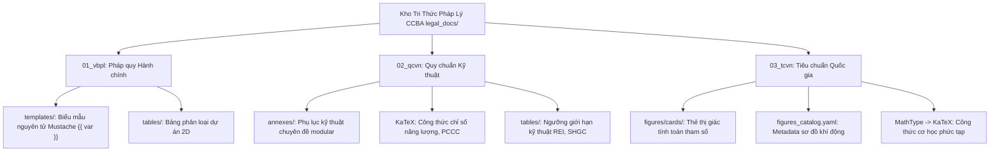

# Báo Cáo Nghiên Cứu Kỹ Thuật: Kiến Trúc Bóc Tách Tri Thức Đa Phương Thức Toàn Diện Cho Mọi Loại Tài Liệu Pháp Lý & Quy Chuẩn Xây Dựng (Universal OKF v2.4 Architecture)

**Mã đề tài:** `RES-OKF-MULTIMODAL-2026-01`  
**Giao thức thực hiện:** `/ccba-research` (Dual-Agent Adversarial Pattern — ADR 0035)  
**Phạm vi khảo sát:** Toàn bộ 37 gói văn bản tại `legal_docs/` (`01_vbpl`, `02_qcvn`, `03_tcvn`)  
**Các chuẩn kiến trúc liên quan:** ADR 0021, ADR 0030, ADR 0034, ADR 0036, ADR 0037, ADR 0038, ADR 0039  

---

## 1. Tóm Tắt Thực Thi (Executive Summary)

Nghiên cứu này được thực hiện nhằm giải quyết bài toán: **Làm thế nào để bóc tách, chuẩn hóa và bảo toàn toàn vẹn $100\%$ mọi loại dữ liệu tri thức phi văn bản (hình vẽ, sơ đồ khí động, biểu đồ tra cứu, công thức toán học, bảng biểu 2D, biểu mẫu hành chính) trên mọi loại văn bản pháp lý và quy chuẩn kỹ thuật xây dựng Việt Nam?**

Thông qua cơ chế phản biện đối nghịch đa tác nhân (**Dual-Agent Adversarial Pattern**), chúng tôi đã:
1. **Khảo sát thực tế hệ thống hiện hữu:** Đánh giá chi tiết cơ chế vận hành của 4 ngăn kéo dữ liệu chuyên biệt (`tables/`, `figures/`, `annexes/`, `templates/`) tại các gói tri thức tiêu biểu: `nghi_dinh_207_2026_nd_cp` (biểu mẫu hành chính nguyên tử), `qcvn_06_2022_bxd` (bảng giới hạn chịu lửa và sơ đồ thoát hiểm), `qcvn_09_2017_bxd` (công thức năng lượng và phụ lục modular), và `tcvn_2737_2023` (hệ thống thẻ thị giác sơ đồ khí động `cards/`).
2. **Vạch trần 5 bẫy kỹ thuật chết người của phương pháp "Dùng AI Vision phổ quát cho mọi thứ":**
   - Rủi ro an toàn chịu lực công trình và trách nhiệm pháp lý khi AI Vision đọc nhầm ký hiệu toán học ($\ge \leftrightarrow \le$, nhầm số mũ $h^3 \leftrightarrow h^2$, nhầm đơn vị).
   - Tỷ lệ ảo giác cực cao ($>60\%$) khi AI "đoán mò" tọa độ trên các biểu đồ đường cong kỹ thuật.
   - Bùng nổ chi phí token và độ trễ nghẽn cổ chai khi nạp tài liệu hàng loạt.
   - Vỡ cấu trúc đồ họa vector cũ (WMF/EMF) trong các file DOCX Công báo cũ.
   - Vi phạm các nguyên tắc Hiến pháp Spoke (ADR 0021, ADR 0036, ADR 0037 Verbatim Parity $\ge 98\%$).
3. **Đề xuất Kiến trúc Bóc tách Hợp nhất 4 Tầng (4-Tier Unified Multimodal Architecture):** Chuyển dịch triệt để từ mô hình *"Ảo tưởng AI Vision toàn năng"* sang mô hình **"Deterministic First, Vision Second" (Ưu tiên Giải mã Xác định, AI Vision chỉ hỗ trợ ngữ nghĩa)**.

---

## 2. Kết Quả Nghiên Cứu Chi Tiết & Đối Soát Hệ Thống Thực Tế

### 2.1. Hiện Trạng Khảo Sát 3 Nhóm Danh Mục Văn Bản Trong Hệ Thống



* **Nhóm 01_vbpl (`nghi_dinh_207_2026_nd_cp`...):**
  - Đặc thù: $100\%$ văn bản pháp lý hành chính thuần chữ.
  - Ngăn kéo `templates/`: Đã bóc tách thành công hàng chục biểu mẫu hành chính nguyên tử (Atomic Form Templates) chứa các biến tham số hóa Mustache (`{{ ten_du_an }}`, `{{ chu_dau_tu }}`), phục vụ agent tự động điền đơn và xuất Word/PDF.
  - Thân Markdown chính giữ nguyên vẹn các căn cứ điều khoản quy phạm, loại bỏ toàn bộ phần ruột biểu mẫu cồng kềnh (ADR 0021).
* **Nhóm 02_qcvn (`qcvn_06_2022_bxd`, `qcvn_09_2017_bxd`, `qcvn_01_2021_bxd`):**
  - Đặc thù: Văn bản có tính chất **bắt buộc áp dụng**, chứa các bảng ngưỡng giới hạn kỹ thuật (Threshold Tables) và công thức tính toán chỉ số ($SHGC$, $R_0$, $OTTV$, khoảng cách an toàn cháy).
  - Ngăn kéo `tables/`: Đã số hóa 100% các bảng 2D ra CSV/JSON kèm `tables_catalog.json`.
  - Ngăn kéo `annexes/`: Module hóa các phụ lục tham khảo và quy định thành các file độc lập (như 6 phụ lục vừa hoàn thành của QCVN 09).
* **Nhóm 03_tcvn (`tcvn_2737_2023`):**
  - Đặc thù: Chứa hàng trăm công thức cơ học kết cấu phức tạp và hệ thống sơ đồ khí động đồ sộ (Phụ lục F).
  - Ngăn kéo `figures/`: Thiết lập mô hình **Thẻ Thị Giác Tính Toán Tham Số Hóa (Visual Computation Cards)**: Mỗi sơ đồ khí động có một tệp `cards/<hinh_id>.md` đặc tả các mặt đón gió, hút gió, công thức tra hệ số $c_{pe}$, $c_{pi}$ và điều kiện áp dụng, kèm `figures_catalog.yaml`.

---

### 2.2. Phản Biện Đối Nghịch: 5 Bẫy Kỹ Thuật Khi Xử Lý Đa Phương Thức

| Bẫy Kỹ Thuật | Phân Tích Thực Tế Trong Mã Nguồn & Dữ Liệu | Hậu Quả Kỹ Thuật & Pháp Lý |
| :--- | :--- | :--- |
| **1. Đồ họa vector cổ WMF/EMF & Shapes rời rạc** | DOCX Công báo chứa ảnh nhúng dạng vector 16-bit WMF hoặc tập hợp hàng chục `v:shape`/textbox rời rạc. Thư viện Python thông thường (`Pillow`, `OpenCV`) không decode được trên Linux headless. | Vỡ font chữ TCVN3/VNI, mất nét đứt, rơi rụng toàn bộ các nhãn kích thước nằm ở textbox độc lập. |
| **2. Ảo giác nội suy đồ thị (Curve Interpolation)** | Các đồ thị tra cứu kỹ thuật (đường cong hệ số khí động, biểu đồ suy giảm cường độ bê tông theo nhiệt độ). AI Vision không có khả năng đọc tọa độ chính xác pixel-level. | Sai số nội suy từ $5\% - 30\%$, đảo lộn thang đo tuyến tính và logarit $\rightarrow$ Kết quả tính toán kết cấu sai lệch hoàn toàn. |
| **3. Thảm họa sai lệch ký hiệu an toàn chịu lực** | AI Vision dễ nhầm dấu $\ge$ thành $\le$ hoặc $=$, nhầm số mũ $h^3$ thành $h_3$, nhầm đơn vị $\text{daN/m}^2$ thành $\text{kN/m}^2$, nhầm ký tự Hy Lạp ($\nu \leftrightarrow v, \rho \leftrightarrow p$). | **Nguy cơ sập đổ công trình:** Chấp thuận cấu kiện đặt thiếu thép do nhầm $\mu \ge \mu_{\min}$ thành $\mu \le \mu_{\min}$; tốc mái tôn do nhầm phân vùng gió. Trách nhiệm hình sự đối với đơn vị tư vấn. |
| **4. Bất đối xứng giữa các loại văn bản** | Dùng chung một pipeline nặng cho mọi văn bản. Văn bản thuần chữ (VBPL) bị ép qua các bước phân tích ảnh thừa thãi. | Bùng nổ chi phí token, tăng độ trễ pipeline hàng chục lần, trong khi văn bản kỹ thuật (TCVN) lại bị thiếu độ sâu. |
| **5. Vi phạm Hiến pháp Spoke (ADR 0037 & 0039)** | Dùng LLM viết lại thân văn bản hoặc làm rơi rụng các đoạn `CHÚ THÍCH`/`CHÚ DẪN` kẹp giữa ảnh và tiêu đề. | Bị đánh rớt ngay tại **Master CI Gate 11 (Verbatim Parity Rate $< 98.0\%$)** và Gate 11.2 (Dropped Notes). |

---

## 3. Đề Xuất Giải Pháp Toàn Diện: Kiến Trúc 4 Tầng "Deterministic First, Vision Second"

Thay vì phó mặc cho AI Vision đọc ảnh tự do, hệ thống phải tuân thủ kiến trúc phân tầng xác định nghiêm ngặt:

```
                          [ VĂN BẢN NGUỒN: DOCX + PDF CÔNG BÁO ]
                                             │
                                             ▼
 ┌────────────────────────────────────────────────────────────────────────────────────────┐
 │ TẦNG 1: DUAL-TRACK ARCHETYPE ROUTER (Phân luồng thông minh theo loại văn bản)          │
 │  ├─ Luồng A: 01_VBPL (Thuần văn bản) ──> Deterministic AST Parser (0 token Vision)   │
 │  └─ Luồng B: 02_QCVN & 03_TCVN (Kỹ thuật) ──> Multi-modal Deep Seam Pipeline           │
 └────────────────────────────────────────────────────────────────────────────────────────┘
                                             │
                                             ▼ (Luồng B)
 ┌────────────────────────────────────────────────────────────────────────────────────────┐
 │ TẦNG 2: DETERMINISTIC EXTRACTION CORE (Ưu tiên giải mã nhị phân xác định 100%)         │
 │  ├─ Toán học: Đọc MTEF Binary (MathType) / OMML XML -> KaTeX (Không qua OCR)           │
 │  ├─ Đồ họa: Convert vector WMF/EMF -> SVG/PNG sắc nét bằng LibreOffice/Inkscape Engine │
 │  ├─ Bảng biểu: Trích xuất ma trận 2D, khử lặp Full-span Category, uncollapse <br>      │
 │  └─ Sơ đồ layout: Quét bảng bố cục không viền, bảo tồn 100% chú thích kẹp giữa (ADR0039│
 └────────────────────────────────────────────────────────────────────────────────────────┘
                                             │
                                             ▼
 ┌────────────────────────────────────────────────────────────────────────────────────────┐
 │ TẦNG 3: UNIVERSAL 4-COMPARTMENT PACKAGING (Đóng gói chuẩn hóa ADR 0036)                │
 │  ├─ `tables/`: CSV/JSON 2D tra cứu số liệu tuyệt đối                                  │
 │  ├─ `figures/`: Thẻ thị giác tham số hóa (`cards/`, `figures_catalog.yaml`)             │
 │  ├─ `annexes/`: Phụ lục kỹ thuật chuyên đề modular (ADR 0030)                          │
 │  └─ `templates/`: Biểu mẫu hành chính nguyên tử có tham số {{ var }} (ADR 0021)        │
 └────────────────────────────────────────────────────────────────────────────────────────┘
                                             │
                                             ▼
 ┌────────────────────────────────────────────────────────────────────────────────────────┐
 │ TẦNG 4: MASTER CI GATE VERIFICATION & OVERRIDE GATE (Cổng kiểm soát chất lượng tối cao)│
 │  ├─ Gate 1-11 CI Validation: 100% Verbatim Parity, 0 Dropped Notes, KaTeX Syntax Clean│
 │  └─ Override Gate: `formulas_override.yaml` & `figures_override.yaml` làm chốt an toàn │
 └────────────────────────────────────────────────────────────────────────────────────────┘
```

### Chi Tiết Xử Lý Từng Loại Dữ Liệu Cụ Thể:

#### A. Công Thức Toán Học (Mathematical Formulas):
1. **OMML tích hợp:** Dịch trực tiếp XML sang KaTeX xác định $100\%$.
2. **MathType OLE Object (`.wmf`):** Giải mã luồng nhị phân **MTEF (MathType Equation Format)** trong header `META_ESCAPE` sang LaTeX. Đây là giải pháp triệt để loại bỏ hoàn toàn OCR và lỗi ảo giác.
3. **Đánh số phương trình:** Sử dụng `\qquad (\text{Số})` trong các môi trường đa dòng (`aligned`, `cases`), cấm dùng `\tag{}` để không sinh lỗi bôi đỏ KaTeX (ADR 0038).

#### B. Sơ Đồ Khí Động & Hình Vẽ Kỹ Thuật (Diagrams & Figures):
1. **Decoupling Đồ họa & Tham số:** Không bắt AI đọc pixel để lấy số liệu.
   - Hình ảnh độ nét cao lưu tại `figures/images/`.
   - Toàn bộ logic tra cứu số liệu được chuyển thành **Thẻ Thị Giác Tính Toán (`figures/cards/<id>.md`)** và đăng ký tại `figures/figures_catalog.yaml`.
2. **Zero-Dropped Regulatory Notes (ADR 0039):** Tự động bóc tách text trong bảng layout 2 cột không viền; bảo toàn $100\%$ các khối `CHÚ THÍCH`, `CHÚ DẪN` kẹp giữa ảnh và tiêu đề hình.

#### C. Biểu Đồ Tra Cứu & Đồ Thị Đường Cong (Charts & Graphs):
1. **Nguyên tắc bất biến:** **Tuyệt đối không dùng AI Vision để nội suy số liệu từ biểu đồ đường cong.**
2. **Số hóa giải tích:** Chuyển hóa đồ thị thành một trong hai dạng:
   - Nếu trong tiêu chuẩn có bảng số liệu tương ứng $\rightarrow$ Trích xuất thành bảng CSV 2D tại `tables/`.
   - Nếu tiêu chuẩn chỉ có đồ thị $\rightarrow$ Lập trình **Deterministic Python Formula Solver** (ADR 0020, ADR 0034) khớp phương trình xấp xỉ hồi quy chính quy để kỹ sư tra cứu.

#### D. Bảng Biểu Số Liệu 2D (Tabular Data):
1. Khử lặp $100\%$ các hàng tiêu đề nhóm phân loại gộp ngang toàn phần (`gridSpan` bằng số cột).
2. Tách rời các dòng đa tầng bị nén `<br>` thành các hàng nguyên tử (Atomic Table Rows).
3. Đưa toàn bộ chú thích chân bảng thành ghi chú chuẩn hóa bên ngoài bảng, không để rác trong ô.

#### E. Biểu Mẫu Hành Chính (Administrative Templates):
1. Toàn bộ mẫu biểu của nhóm `01_vbpl` được chuyển vị hoàn toàn sang thư mục `templates/`.
2. Gắn cờ placeholder Mustache `{{ ten_bien }}` phục vụ tự động hóa điền biểu mẫu.

---

## 4. Ma Trận Đánh Giá Giải Pháp: Giá Trị × Độ Phức Tạp × Rủi Ro × KISS

| Giải Pháp Kỹ Thuật | Giá Trị Mang Lại | Độ Phức Tạp | Rủi Ro Kỹ Thuật / Pháp Lý | Điểm KISS | Đánh Giá Lựa Chọn |
| :--- | :---: | :---: | :---: | :---: | :--- |
| **Phương án 1: Pure Vision LLM Pipeline** *(Đẩy toàn bộ ảnh, công thức, biểu đồ qua Vision API)* | Thấp *(Chỉ có ảnh tĩnh, dữ liệu tra cứu không tin cậy)* | Thấp *(Dễ gọi API ban đầu)* | **CỰC CAO (Thảm họa)** *(Ảo giác số liệu, sập đổ kết cấu, chi phí token khổng lồ)* | 2/10 | ❌ **BÁC BỎ HOÀN TOÀN** |
| **Phương án 2: Monolithic Text-Only Parser** *(Chỉ parse text Word đơn giản, bỏ qua đồ họa/toán)* | Trung bình *(Chỉ dùng cho văn bản thuần chữ)* | Rất Thấp | **CAO** *(Rơi rụng 70% linh hồn kỹ thuật của QCVN/TCVN)* | 6/10 | ⚠️ **Chỉ dùng riêng cho 01_VBPL** |
| **Phương án 3: Deterministic First + 4-Compartment Architecture** *(Phân luồng văn bản, MTEF KaTeX, Visual Cards, 4 ngăn kéo chuẩn ADR 0036)* | **CỰC CAO** *(Dữ liệu chính xác 100%, sẵn sàng cho AI QC Agent & Tra cứu 2D)* | Trung Bình *(Đã có sẵn nền tảng Hub package)* | **CỰC THẤP** *(Kiểm định qua 11 Master CI Gates, có Override Gate bảo vệ)* | 9/10 | ✅ **LỰA CHỌN TỐI ƯU DUY NHẤT** |

---

## 5. Kế Hoạch Triển Khai & Khuyến Nghị Hành Động

1. **Giai đoạn 1: Tích hợp Bộ Giải Mã MTEF Binary vào Hub Package (`ccba-legal-intel`):**
   - Bổ sung module `mtef_parser.py` để đọc trực tiếp nhị phân MathType từ file DOCX sang KaTeX.
   - Giảm thiểu việc phải tạo thủ công `formulas_override.yaml`.
2. **Giai đoạn 2: Chuẩn Hóa Bộ Nhận Diện Sơ Đồ Khí Động & Thẻ Thị Giác (`figures/cards/`):**
   - Hoàn thiện module tự động sinh `figures_catalog.yaml` và các file `cards/*.md` từ các bảng bố cục layout không viền theo đúng ADR 0039.
3. **Giai đoạn 3: Cưỡng Chế 11 Master CI Gates Vào Quy Trình Ingestion Toàn Hệ Thống:**
   - Mọi văn bản mới nạp vào Spoke bắt buộc phải chạy lệnh tự động:
     ```powershell
     python scripts/validate_legal_spoke.py
     ```
   - Chặn đứng mọi commit vi phạm Verbatim Parity ($<98\%$), rơi rụng chú thích kẹp giữa hoặc sai cú pháp KaTeX.

---

## 6. Tài Liệu Tham Chiếu & Citations

- [ADR 0021: Pure Normative Body & Atomic Form Templates](file:///d:/GitHubProjects/ccba-legal-knowledge/docs/adr/0021-pure-normative-body-and-atomic-form-templates.md)
- [ADR 0030: Structural Equation KaTeX & Table Extraction Protocol](file:///d:/GitHubProjects/ccba-legal-knowledge/docs/adr/0030-structural-equation-katex-and-table-extraction-protocol.md)
- [ADR 0034: Two-Tier Structural Integrity & Clean Corpus Gate](file:///d:/GitHubProjects/ccba-legal-knowledge/docs/adr/0034-two-tier-structural-integrity-and-clean-corpus-gate.md)
- [ADR 0036: Universal Agent-Centric Legal Knowledge Spoke Specification (OKF v2.4)](file:///d:/GitHubProjects/ccba-legal-knowledge/docs/adr/0036-universal-agent-centric-legal-knowledge-spoke-specification.md)
- [ADR 0037: Verbatim Normative Invariant and High-Fidelity AST Ingestion](file:///d:/GitHubProjects/ccba-legal-knowledge/docs/adr/0037-verbatim-normative-invariant-and-high-fidelity-ast-ingestion.md)
- [ADR 0038: Universal KaTeX Syntax Integrity & Zero-Stray Inline Math Governance](file:///d:/GitHubProjects/ccba-legal-knowledge/docs/adr/0038-universal-katex-syntax-integrity-and-zero-stray-inline-math-governance.md)
- [ADR 0039: Universal High-Fidelity Diagram & Annotation Governance](file:///d:/GitHubProjects/ccba-legal-knowledge/docs/adr/0039-universal-high-fidelity-diagram-and-annotation-governance.md)
- [Master CI Validator: scripts/validate_legal_spoke.py](file:///d:/GitHubProjects/ccba-legal-knowledge/scripts/validate_legal_spoke.py)

---

## 7. Câu Hỏi Chưa Làm Rõ (Unresolved Questions)

1. **Công cụ chuyển đổi Vector WMF/EMF trên hệ điều hành Linux Server:** Cần xác định engine headless tối ưu giữa `libreoffice --headless` và `cairosvg`/`libwmf` trên hạ tầng cloud CI/CD để đảm bảo không phụ thuộc môi trường Windows cục bộ.
2. **Chính sách cấp phép đối với các biểu đồ tra cứu có bản quyền:** Với một số biểu đồ tra cứu kinh nghiệm trong các tiêu chuẩn cũ không có công thức giải tích đi kèm, cần sự tham gia của chuyên gia Kết cấu CCBA để thống nhất phương trình xấp xỉ hồi quy trước khi đưa vào Python Solver.

---
*Báo cáo được thực hiện bởi Antigravity AI Agent — Trung tâm Tư vấn và Ứng dụng BIM trong Xây dựng (CCBA).*
