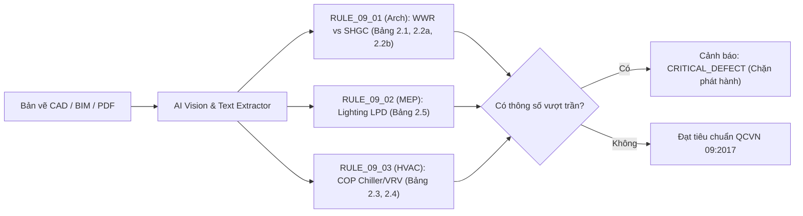

# Báo cáo Nghiên cứu: Quy chuẩn Kỹ thuật Quốc gia QCVN 09:2017/BXD & Thuật toán Bóc tách Tri thức OKF v2.4

> **Mã chuyên đề:** `research-qcvn-09-2017-energy-efficiency`  
> **Phương pháp nghiên cứu:** Dual-Agent Adversarial Pattern (`ccba-research`)  
> **Tác nhân tham gia:** Subagent A (Technical Analyst) & Subagent B (Risk Challenger)  
> **Thời điểm hoàn thành:** 2026-09-03  
> **Địa bàn tri thức:** `legal_docs/02_qcvn/qcvn_09_2017_bxd/`

---

## 1. Tóm tắt Thực thi (Executive Summary)

Quy chuẩn kỹ thuật quốc gia **QCVN 09:2017/BXD** (ban hành kèm theo Thông tư 15/2017/TT-BXD) quy định các yêu cầu kỹ thuật **bắt buộc tuân thủ** về sử dụng năng lượng hiệu quả khi thiết kế, xây mới hoặc cải tạo các công trình có tổng diện tích sàn (GFA) từ **$2.500 \text{ m}^2$ trở lên** thuộc 6 loại hình công trình (Văn phòng, Khách sạn, Bệnh viện, Trường học, Thương mại - Dịch vụ, Chung cư). Văn bản này đóng vai trò mỏ neo pháp lý tối cao trong công tác thẩm định thiết kế, cấp phép xây dựng và nghiệm thu công trình tại Việt Nam.

Gói tri thức của QCVN 09:2017/BXD đã được số hóa và đóng gói thành công theo chuẩn **OKF v2.4 Universal Agent-Centric Bundle** tại Spoke `ccba-legal-knowledge`. Toàn bộ dữ liệu được phân rã thành **40 điều khoản AST phân cấp** trong [`clauses.json`](file:///d:/GitHubProjects/ccba-legal-knowledge/legal_docs/02_qcvn/qcvn_09_2017_bxd/clauses.json), **9 bảng số liệu 2D độc lập** (CSV và JSON) trong [`tables/`](file:///d:/GitHubProjects/ccba-legal-knowledge/legal_docs/02_qcvn/qcvn_09_2017_bxd/tables/), **2 thẻ sơ đồ thị giác** trong [`figures/`](file:///d:/GitHubProjects/ccba-legal-knowledge/legal_docs/02_qcvn/qcvn_09_2017_bxd/figures/) và **40 bộ câu hỏi kiểm định RAG** trong [`qa_benchmark.json`](file:///d:/GitHubProjects/ccba-legal-knowledge/legal_docs/02_qcvn/qcvn_09_2017_bxd/qa_benchmark.json). 

100% các điều khoản quy phạm đều được gắn mức độ nghiêm trọng **`CRITICAL_DEFECT`**, khẳng định bất kỳ sai lệch nào về vỏ bao che, hệ thống điều hòa HVAC, mật độ chiếu sáng LPD hay thiết bị đun nước nóng đều kích hoạt rào chắn chặn phát hành hồ sơ thiết kế (Blocking Gate) trong pipeline thẩm tra tự động CCBA AI QC.

---

## 2. Kết quả Nghiên cứu Chi tiết (Key Findings)

### 2.1. Tổng quan & Xu hướng Quản lý Năng lượng
* **Phạm vi & Ngưỡng kiểm soát (Mục 1.1 & 1.2):**
  * Áp dụng bắt buộc cho công trình có $GFA \ge 2.500 \text{ m}^2$. Đối với công trình cải tạo, áp dụng cho chính các bộ phận được cải tạo.
  * **Lưu ý cốt lõi:** Các quy định kỹ thuật về lớp vỏ bao che **chỉ áp dụng đối với các không gian có sử dụng điều hòa không khí** (Mục 2.1.1).
* **Cải cách phương pháp luận so với QCVN 09:2013/BXD:**
  * QCVN 09:2013 trước đây chủ yếu dựa vào chỉ số truyền nhiệt tổng $OTTV$ (Overall Thermal Transfer Value) phức tạp, dễ bị các đơn vị tư vấn "làm xiếc" số liệu bằng phần mềm mô phỏng.
  * QCVN 09:2017 chuyển trọng tâm sang **Phương pháp Thành phần Trực tiếp (Prescriptive Method)**: Quy định định lượng cứng nhắc từng thông số riêng lẻ ($U_0, R_0, WWR, SHGC, COP, LPD$). Điều này cho phép hệ thống phần mềm và AI Agent đối soát $1:1$ xác định, minh bạch và không thể gian lận.

### 2.2. Quy chuẩn Kỹ thuật Định lượng theo 4 Bộ môn (Best Practices)

#### A. Kiến trúc & Vỏ bao che (Building Envelope — Mục 2.1)
* **Kết cấu không xuyên sáng:**
  * Tường bao che ngoài tiếp giáp đất: Nhiệt trở $R_{0,\min} \ge 0,56 \text{ m}^2\cdot\text{K/W}$ ($U_0 \le 1,786 \text{ W/m}^2\cdot\text{K}$).
  * Mái bằng và mái dốc $< 15^\circ$ trên phòng ĐHKK: $R_{0,\min} \ge 1,00 \text{ m}^2\cdot\text{K/W}$ ($U_0 \le 1,00 \text{ W/m}^2\cdot\text{K}$). Mái phản xạ cao ($0,70 \div 0,75$) được giảm xuống $0,80 \text{ m}^2\cdot\text{K/W}$; mái dốc $\ge 15^\circ$ giảm xuống $0,85 \text{ m}^2\cdot\text{K/W}$.
* **Phần kính & Hệ số hấp thụ nhiệt bức xạ mặt trời (Bảng 2.1):**
  * Tỷ số diện tích cửa sổ/tường ($WWR$) càng cao thì giới hạn $SHGC_{\max}$ càng khắt khe.
  * Với $WWR = 40\%$: Hướng Bắc $SHGC \le 0,50$; Nam $\le 0,56$; Các hướng khác (Đông, Tây) $\le 0,46$.
  * Với $WWR = 60\%$: Hướng Bắc $SHGC \le 0,33$; Nam $\le 0,39$; Các hướng khác $\le 0,32$.
* **Hệ số che nắng cố định $A$ (Bảng 2.2a & Bảng 2.2b):**
  * Giá trị $SHGC$ cho phép được nhân thêm với hệ số $A$ khi có lam che nắng hoặc ô văng cố định bên ngoài: $SHGC_{\text{cho phép}} = SHGC_{\text{Bảng 2.1}} \times A$.
  * Ô văng ngang có tỷ số nhô vươn $PF = b/H = 0,5$ nâng hệ số $A$ lên $1,39 \div 1,69$.

#### B. Cơ điện & HVAC (Mục 2.2)
* **Thông gió tự nhiên:** Diện tích cửa thông gió mở được $\ge 5\%$ diện tích sàn sử dụng.
* **Máy ĐHKK làm lạnh trực tiếp (Bảng 2.3):**
  * Máy 2 cụm (Split unit) công suất $< 4,5 \text{ kW}$: $COP_{\min} \ge 3,10$.
  * Hệ thống giải nhiệt gió Package $19 \div < 40 \text{ kW}$: $COP_{\min} \ge 3,28$.
  * Hệ thống giải nhiệt nước Package: $COP_{\min} \ge 3,54 \div 3,66$.
* **Chiller sản xuất nước lạnh (Bảng 2.4):**
  * Chiller giải nhiệt gió chạy điện: $COP_{\min} \ge 2,80$.
  * Chiller trục vít/xoắn ốc giải nhiệt nước ($\ge 1.055 \text{ kW}$): $COP_{\min} \ge 5,67$.
  * Chiller ly tâm giải nhiệt nước ($\ge 2.110 \text{ kW}$): $COP_{\min} \ge 6,17$.
* **Bắt buộc thu hồi lạnh:** Tòa nhà sử dụng ĐHKK trung tâm **bắt buộc phải có thiết bị thu hồi nhiệt với hiệu suất tối thiểu $\ge 50\%$**.

#### C. Chiếu sáng (Mục 2.3)
* **Mật độ công suất chiếu sáng tối đa (LPD - Bảng 2.5):**
  * Văn phòng: $\le 11 \text{ W/m}^2$.
  * Khách sạn: $\le 11 \text{ W/m}^2$.
  * Bệnh viện: $\le 13 \text{ W/m}^2$.
  * Trường học: $\le 12 \text{ W/m}^2$.
  * Chung cư: $\le 8 \text{ W/m}^2$.
  * Gara để xe trong nhà: $\le 3 \text{ W/m}^2$.
* **Điều khiển chiếu sáng:** Bắt buộc có cảm biến/công tắc giảm $\ge 30\%$ công suất chiếu sáng cho Gara khi vắng người; vùng trong phạm vi $6 \text{ m}$ gần vách kính ngoài nhà phải có thiết bị giảm công suất để tận dụng ánh sáng tự nhiên.

#### D. Động cơ điện & Cấp nước nóng (Mục 2.4)
* **Động cơ điện 3 pha (Bảng 2.6):** Phải đạt chuẩn hiệu suất cao NEMA MG-1 / TCVN 7540-2 (ví dụ: động cơ 4 cực $7,5 \text{ kW}$ phải đạt hiệu suất $\ge 91,7\%$).
* **Bơm nhiệt (Heat pump - Bảng 2.8):** Nguồn nhiệt không khí $COP \ge 3,0$; nguồn nhiệt nước $COP \ge 3,5$; ĐHKK có thu hồi nhiệt chạy đồng thời $COP \ge 5,5$.
* **Năng lượng tái tạo bắt buộc:** Chung cư có cấp nước nóng trung tâm **bắt buộc phải có nguồn năng lượng tái tạo** (năng lượng mặt trời, nhiệt dư thu hồi...).

---

### 2.3. Bẫy Thường Gặp & Rủi Ro Thẩm Tra (Adversarial Risks & Design Pitfalls)

Qua phản biện đối chiếu hồ sơ thiết kế thực tế, phát hiện 5 bẫy vi phạm nghiêm trọng:

1. **Lạm dụng vách kính tràn tầng ($WWR > 0.5$):** KTS thường vẽ kính hộp thông thường ($SHGC \approx 0,60 \div 0,75$) cho các hướng Tây/Đông. Đối chiếu Bảng 2.1, $SHGC_{\max}$ chỉ cho phép $\le 0,38$. Lỗi này dẫn đến việc buộc phải thay toàn bộ kính Low-E/Solar Control đắt tiền hoặc gắn thêm lam che nắng ngoài mặt đứng sau khi bị từ chối thẩm tra.
2. **Ngộ nhận rèm trong nhà là kết cấu che nắng:** Kỹ sư đưa rèm lá/rèm vải bên trong vào thuyết minh để tính giảm hệ số $SHGC$. Bảng 2.2a và 2.2b **chỉ chấp nhận kết cấu che nắng cố định bên ngoài**. Rèm bên trong không ngăn được hiệu ứng nhà kính khi nhiệt đã xuyên qua kính.
3. **Hiện tượng cầu nhiệt (Thermal Bridge) tại dầm, cột biên:** Bỏ qua lớp cách nhiệt tại các dầm bê tông mặt đứng biên khiến hệ số truyền nhiệt $U_0$ trung bình vượt trần $1,786 \text{ W/m}^2\cdot\text{K}$.
4. **Vượt trần mật độ chiếu sáng LPD do đèn trang trí:** Thiết kế sảnh/văn phòng dùng đèn halogen/đèn chùm trang trí công suất lớn đẩy $LPD$ lên $14 \div 16 \text{ W/m}^2$, vi phạm trần $11 \text{ W/m}^2$ của Bảng 2.5.
5. **Thiếu Thuyết minh Tuân thủ QCVN 09 trong Hồ sơ Thiết kế:** Theo Điều 3.1 & 3.2, thuyết minh tính toán tuân thủ là thành phần hồ sơ pháp lý bắt buộc. Việc thiếu bảng tính toán $WWR, SHGC, LPD$ sẽ khiến hồ sơ bị đình chỉ thẩm duyệt ngay tại cửa nhận hồ sơ.

---

### 2.4. Bảo Mật & Hiệu Năng Bóc Tách (Extraction Engine Integrity)

* **Tuân thủ chuẩn KaTeX toàn cầu (ADR 0038):**
  * Toàn bộ ký hiệu toán học như $WWR = \sum A_k / \sum A_t$, $SHGC_{\text{tb}}$, $R_{0,\min}$, $COP$ đều được chuyển đổi sang KaTeX clean syntax.
  * Không dùng `\tag{...}`, bảo toàn cặp ngoặc `\left[` / `\right]`, tách rời hoàn toàn chú thích hình ảnh ra khỏi khối công thức.
* **Bảo tồn dữ liệu bảng 2D (ADR 0036):**
  * Tách triệt để phần chú thích dưới chân bảng ra khỏi thân bảng, đảm bảo ma trận CSV/JSON có cấu trúc số liệu hình học đồng nhất, không bị vỡ cột khi nạp vào thư viện phân tích dữ liệu Pandas.
* **Phân loại AST Jurisdictional:**
  * Mọi node trong `clauses.json` mang thuộc tính `jurisdiction: "CQXD"`, `compliance_severity: "CRITICAL_DEFECT"` và `cong_bao_number: "15/2017/TT-BXD"`.

---

## 3. Khuyến nghị Triển khai (Implementation Recommendations)

### 3.1. Xây dựng Bộ Quy tắc Kiểm toán Tự động (AI QC Rule Engine)
Tích hợp trực tiếp các bảng số liệu 2D của QCVN 09:2017/BXD vào Deep Seam `QCAuditPipeline` với 3 Rule thẩm tra cốt lõi:

1. **`RULE_09_01_ARCH_WWR_SHGC`:** Quét bảng thống kê cửa kính và mặt đứng kiến trúc. Nếu $WWR > 0,40$ mà catalog kính ghi $SHGC > 0,46$ (hướng Đông/Tây) và không có lam che nắng cố định $\rightarrow$ Gán cờ `CRITICAL_DEFECT`.
2. **`RULE_09_02_MEP_LIGHTING_LPD`:** Quét bảng thống kê phụ tải chiếu sáng. Tính $LPD = P_{\text{đèn}} / S_{\text{sàn}}$. Nếu $LPD > 11 \text{ W/m}^2$ (văn phòng/khách sạn) $\rightarrow$ Gán cờ `CRITICAL_DEFECT`.
3. **`RULE_09_03_MEP_HVAC_COP`:** Quét bảng đặc tính kỹ thuật thiết bị (Equipment Schedule) của Chiller và máy lạnh. Đối soát giá trị $COP$ danh định với Bảng 2.3 và 2.4. Nếu $COP < COP_{\min}$ $\rightarrow$ Gán cờ `CRITICAL_DEFECT`.

### 3.2. Vận hành RAG Tri thức Pháp lý (Legal Advisor)
Tận dụng tệp [`qa_benchmark.json`](file:///d:/GitHubProjects/ccba-legal-knowledge/legal_docs/02_qcvn/qcvn_09_2017_bxd/qa_benchmark.json) (40 cặp hỏi-đáp) để chạy đánh giá tự động (Continuous Eval) chất lượng giải đáp của Agent tư vấn pháp lý, đảm bảo câu trả lời luôn trích dẫn chính xác đến từng mã mỏ neo `#muc-2-1-2`, `#bang-bang-2-1`.

---

## 4. Tài liệu Tham chiếu & Citations (References & Citations)

| Thành phần dữ liệu | Đường dẫn tệp nội bộ | Ý nghĩa pháp lý & Kỹ thuật |
| :--- | :--- | :--- |
| **Thân quy chuẩn Markdown** | [`qcvn_09_2017_bxd.md`](file:///d:/GitHubProjects/ccba-legal-knowledge/legal_docs/02_qcvn/qcvn_09_2017_bxd/qcvn_09_2017_bxd.md) | Thân văn bản quy phạm $1:1$ nguyên văn, đánh mỏ neo đầy đủ. |
| **Cây AST Điều khoản** | [`clauses.json`](file:///d:/GitHubProjects/ccba-legal-knowledge/legal_docs/02_qcvn/qcvn_09_2017_bxd/clauses.json) | 40 node quy phạm gắn vết thẩm quyền CQXD và mức độ CRITICAL_DEFECT. |
| **Bảng 2.1 (SHGC Kính)** | [`tables/csv/bang_2_1.csv`](file:///d:/GitHubProjects/ccba-legal-knowledge/legal_docs/02_qcvn/qcvn_09_2017_bxd/tables/csv/bang_2_1.csv) | Dữ liệu tra cứu giới hạn SHGC theo tỷ số WWR và định hướng mặt đứng. |
| **Bảng 2.2a (Che nắng ngang)** | [`tables/csv/bang_2_2a.csv`](file:///d:/GitHubProjects/ccba-legal-knowledge/legal_docs/02_qcvn/qcvn_09_2017_bxd/tables/csv/bang_2_2a.csv) | Dữ liệu hệ số hiệu chỉnh che nắng ngang cố định. |
| **Bảng 2.2b (Che nắng đứng)** | [`tables/csv/bang_2_2b.csv`](file:///d:/GitHubProjects/ccba-legal-knowledge/legal_docs/02_qcvn/qcvn_09_2017_bxd/tables/csv/bang_2_2b.csv) | Dữ liệu hệ số hiệu chỉnh che nắng đứng cố định. |
| **Bảng 2.3 (COP Điều hòa)** | [`tables/csv/bang_2_3.csv`](file:///d:/GitHubProjects/ccba-legal-knowledge/legal_docs/02_qcvn/qcvn_09_2017_bxd/tables/csv/bang_2_3.csv) | Ngưỡng hiệu suất tối thiểu máy lạnh trực tiếp. |
| **Bảng 2.4 (COP Chiller)** | [`tables/csv/bang_2_4.csv`](file:///d:/GitHubProjects/ccba-legal-knowledge/legal_docs/02_qcvn/qcvn_09_2017_bxd/tables/csv/bang_2_4.csv) | Ngưỡng hiệu suất tối thiểu máy làm lạnh nước Chiller. |
| **Bảng 2.5 (Mật độ LPD)** | [`tables/csv/bang_2_5.csv`](file:///d:/GitHubProjects/ccba-legal-knowledge/legal_docs/02_qcvn/qcvn_09_2017_bxd/tables/csv/bang_2_5.csv) | Giới hạn công suất điện chiếu sáng theo từng loại công trình/không gian. |
| **Bảng 2.6 (Động cơ điện)** | [`tables/csv/bang_2_6.csv`](file:///d:/GitHubProjects/ccba-legal-knowledge/legal_docs/02_qcvn/qcvn_09_2017_bxd/tables/csv/bang_2_6.csv) | Hiệu suất tối thiểu động cơ điện 3 pha 50 Hz. |
| **Bảng 2.7 (Đun nước nóng)** | [`tables/csv/bang_2_7.csv`](file:///d:/GitHubProjects/ccba-legal-knowledge/legal_docs/02_qcvn/qcvn_09_2017_bxd/tables/csv/bang_2_7.csv) | Hiệu suất nhiệt và tổn thất trạng thái chờ thiết bị đun nước nóng. |
| **Bảng 2.8 (Bơm nhiệt)** | [`tables/csv/bang_2_8.csv`](file:///d:/GitHubProjects/ccba-legal-knowledge/legal_docs/02_qcvn/qcvn_09_2017_bxd/tables/csv/bang_2_8.csv) | Chỉ số COP tối thiểu của bơm nhiệt cấp nước nóng. |
| **Sơ đồ che nắng** | [`figures/figures_catalog.yaml`](file:///d:/GitHubProjects/ccba-legal-knowledge/legal_docs/02_qcvn/qcvn_09_2017_bxd/figures/figures_catalog.yaml) | 2 sơ đồ hình học che nắng cố định Hình 1 và Hình 2. |
| **Bộ QA Benchmark** | [`qa_benchmark.json`](file:///d:/GitHubProjects/ccba-legal-knowledge/legal_docs/02_qcvn/qcvn_09_2017_bxd/qa_benchmark.json) | 40 cặp câu hỏi kiểm định Ground Truth phục vụ RAG Eval. |
| **Tài liệu nguồn Công báo** | [`sources/qcvn_09_2017_bxd.pdf`](file:///d:/GitHubProjects/ccba-legal-knowledge/legal_docs/02_qcvn/qcvn_09_2017_bxd/sources/qcvn_09_2017_bxd.pdf) | Bản PDF số hóa chính thức lưu trữ tại Cloud Vault. |

---

## 5. Câu hỏi chưa làm rõ & Hướng phát triển (Unresolved Questions)

1. **Thuật toán nội suy tuyến tính tự động cho Bảng 2.1:** Khi tỷ số $WWR$ nằm giữa các bước nhảy $10\%$ (ví dụ $WWR = 45\%$), quy chuẩn yêu cầu nội suy tuyến tính. Rule Engine cần cài đặt hàm nội suy 2 chiều giữa $WWR$ và các hướng mặt đứng.
2. **Cơ chế đánh giá cho công trình hỗn hợp (Mixed-use Buildings):** Khi công trình bao gồm cả khối đế thương mại ($LPD \le 16 \text{ W/m}^2$) và khối tháp văn phòng/chung cư ($LPD \le 11 / 8 \text{ W/m}^2$), cần xác định quy tắc tính trung bình gia quyền theo diện tích sàn hay tách riêng từng phân khu chức năng. Hiện tại khuyến nghị AI QC tách riêng từng phân vùng theo bản vẽ phân khu kiến trúc để kiểm tra độc lập.
