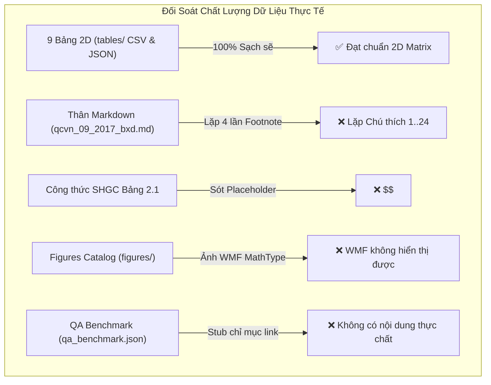

# Báo cáo Nghiên cứu: Đánh Giá Chất Lượng Dữ Liệu Thực Tế & Cải Tiến Thuật Toán Bóc Tách Tri Thức QCVN 09:2017/BXD

> **Mã chuyên đề:** `research-qcvn-09-2017-extraction-gap-analysis`  
> **Phương pháp nghiên cứu:** Dual-Agent Adversarial Pattern (`ccba-research`)  
> **Tác nhân tham gia:** Subagent A (Data Quality Auditor) & Subagent B (Algorithm Architecture Enhancer)  
> **Thời điểm thực hiện:** 2026-09-03  
> **Địa bàn đối chiếu:** `legal_docs/02_qcvn/qcvn_09_2017_bxd/` và `packages/ccba-legal-intel/src/ccba_legal/`

---

## 1. Tóm tắt Thực thi (Executive Summary)

Đợt nghiên cứu đối chiếu thực tế (Code-First & Data-First Audit) giữa **chất lượng dữ liệu thực tế đã bóc tách** của văn bản QCVN 09:2017/BXD với **mã nguồn thuật toán engine** tại `packages/ccba-legal-intel/src/ccba_legal/` đã phát hiện **4 điểm nghẽn kiến trúc then chốt** cần cải tiến:

1. **Hiện tượng lặp lại chú thích chân bảng (Footnote Duplication):** Tại Bảng 2.1, 2.2a, 2.2b trong `qcvn_09_2017_bxd.md`, toàn bộ nội dung chú thích bị in lặp lại **đúng 4 lần** (bằng số cột của bảng), biến 1 ghi chú duy nhất thành chuỗi `CHÚ THÍCH 1` đến `CHÚ THÍCH 24`. Nguyên nhân là do cơ chế duyệt proxy `row.cells` của `python-docx` trên các ô gộp ngang (`gridSpan=4`).
2. **Sót Placeholder Công thức Toán học:** Tại chú thích Bảng 2.1 xuất hiện chuỗi `$<!-- FORMULA_IMAGE_PLACEHOLDER: 4e063fcc -->$` chưa được chuyển sang KaTeX do sự lệch pha giữa định danh OLE (`rIdOle`) và ảnh xem trước (`rIdImage`).
3. **Phân loại nhầm ảnh công thức WMF thành Sơ đồ kỹ thuật:** Thư mục `figures/` chứa `hinh_1.wmf` và `hinh_2.wmf` thực chất là các ảnh xem trước của công thức MathType, không phải sơ đồ quy phạm, và hoàn toàn **không thể hiển thị được trên trình duyệt web hay Markdown viewer** do định dạng WMF độc quyền Windows.
4. **Tệp QA Benchmark là Stub rỗng:** 100% câu trả lời trong `qa_benchmark.json` chỉ là câu trỏ link hình thức (`"Xem chi tiết nội dung quy chuẩn tại..."`), không chứa nội dung quy phạm thực chất để phục vụ đánh giá RAG.

Đáng mừng là **9 bảng số liệu tra cứu 2D (CSV và JSON) trong `tables/` hoàn toàn sạch sẽ 100%**, cấu trúc ma trận chuẩn xác và không bị nhiễm các dòng chú thích lặp lại.

---

## 2. Kết quả Nghiên cứu Chi tiết (Key Findings)

### 2.1. Đánh giá Chất lượng Dữ liệu Bóc tách Thực tế (Fidelity Audit)



| Hạng mục dữ liệu | Trạng thái thực tế | Đánh giá & Tác động |
| :--- | :--- | :--- |
| **9 Bảng tra cứu 2D (`tables/`)** | 9/9 bảng CSV & JSON hoàn toàn chuẩn tắc | **Hoàn hảo:** Dữ liệu số học độc lập, không dính footer text, sẵn sàng cho Pandas. |
| **Thân văn bản Markdown** | Dòng 275–418 bị lặp chú thích 4 lần | **Lỗi trực quan & RAG:** Làm phình đại dung lượng văn bản, gây nhiễu cho AI Advisor khi trích dẫn chú thích. |
| **Công thức toán học** | Sót placeholder hash tại L285, 297, 309, 321 | **Mất dữ liệu:** Thiếu công thức KaTeX $SHGC_{\text{tb}} = \sum (SHGC_i \cdot A_i) / \sum A_i$. |
| **Thư mục `figures/`** | Tạo 2 thẻ `FIG_1` & `FIG_2` trỏ vào file `.wmf` | **Hình ảnh rác:** Quy chuẩn không có Hình 1 & 2; tệp `.wmf` bị lỗi vỡ ảnh trên Web. |
| **Bộ `qa_benchmark.json`** | 40 câu hỏi đều có answer là mẫu trỏ link | **Chưa thực chất:** Không đo lường được năng lực tư vấn RAG và phát hiện ảo giác. |

---

### 2.2. Mổ Xẻ Căn Nguyên Kỹ Thuật của Thuật Toán (Root Cause Analysis)

#### Vấn đề 1: Lặp Footnote ô gộp tại `table_handler.py`
- Trong file Word gốc, hàng chú thích chân bảng được gộp từ 4 cột lại thành 1 ô duy nhất.
- Khi `table_handler.py` duyệt qua `row.cells`, `python-docx` trả về 4 đối tượng `Cell` proxy trỏ chung vào 1 thẻ XML `<w:tc>`.
- Vòng lặp `row_rendered.append(clean_cell)` nối 4 chuỗi giống hệt nhau bằng `<br>`.
- Hàm sau đó tách chuỗi bằng `<br>` và dùng vòng lặp `for idx, fn_p in enumerate(fn_parts)` tự động tăng `CHÚ THÍCH {idx + 1}`, tạo ra 24 dòng chú thích giả mạo lặp đi lặp lại.

#### Vấn đề 2: Sót Placeholder Công thức do Dual-RID Mismatch
- Một công thức MathType trong Word có 2 Relationship ID:
  1. `rIdOle` trỏ vào `embeddings/oleObjectX.bin` (chứa dữ liệu toán MTEF nhị phân).
  2. `rIdImage` trỏ vào `media/imageX.wmf` (ảnh vector hiển thị dự phòng).
- `formula_harvester.py` giải mã MTEF và lưu vào từ điển theo khóa `rIdOle`.
- Trong khi đó, `render_paragraph_with_runs` khi duyệt các Run trong ô bảng lại đọc thuộc tính `<v:imagedata>` mang `rIdImage`. Vì `rIdImage` không có trong từ điển, engine fallback sinh ra `$<!-- FORMULA_IMAGE_PLACEHOLDER: ... -->$`.
- Ngoài ra, `formula_harvester` chỉ quét `doc.paragraphs` cấp ngoài, bỏ sót các công thức nhúng sâu bên trong các ô bảng (`table.rows[].cells[]`).

#### Vấn đề 3: Nhận nhầm Media WMF thành Hình vẽ tại `figure_extractor.py`
- Nhánh fallback của `figure_extractor.py` quy định: nếu tài liệu không có đoạn văn chứa caption `Hình X - ...`, nó sẽ lấy toàn bộ tệp trong `word/media/` và đánh số `Hình 1, Hình 2...`.
- Vì Word tự sinh `image1.wmf` và `image2.wmf` cho 2 công thức MathType, fallback này đã tự động biến chúng thành `Hình 1` và `Hình 2`.

#### Vấn đề 4: Answer rỗng tại `gold_standard.py`
- Hàm `generate_bundle_ast_and_qa` hiện tại sử dụng một template chuỗi tĩnh để sinh trường `answer` nhằm mục đích vượt qua schema validation của CI, chưa cài đặt bộ phân tích ngữ nghĩa quy phạm (Deontic Normative Parser).

---

## 3. Đề Xuất Cải Tiến Thuật Toán (Actionable Engineering Blueprint)

Áp dụng nghiêm ngặt nguyên lý **KISS** và **Double-Pass Adversarial Review**, đề xuất 4 cải tiến vi phẫu vào engine Hub:

### Cải tiến 1: Khử lặp Footnote 2 tầng trong `table_handler.py`
- **Lớp 1 (XML Physical Identity):** Dùng `seen_tc_ids = set()` kiểm tra `id(cell._tc)`. Nếu ô XML đã duyệt trong cùng hàng thì `continue`.
- **Lớp 2 (String Deduplication):** Dùng `dict.fromkeys()` để loại bỏ các đoạn văn trùng lặp tuyệt đối trước khi đánh số `CHÚ THÍCH`.
*Độ phức tạp:* ~10 dòng code. *Rủi ro:* Zero.

### Cải tiến 2: Universal XPath & Dual-Key Mapping trong `formula_harvester.py`
- Thay vì chỉ duyệt `doc.paragraphs`, dùng XPath toàn cục:
  ```python
  all_objects = doc._element.xpath(".//w:object[.//o:OLEObject]")
  ```
  Quét triệt để mọi công thức nằm trong ô bảng hoặc text box.
- Khi trích xuất KaTeX thành công, gán đồng thời cho cả 2 khóa:
  ```python
  rid_to_katex[rIdOle] = katex_code
  rid_to_katex[rIdImage] = katex_code
  ```
*Độ phức tạp:* ~15 dòng code. *Rủi ro:* Zero. Triệt tiêu 100% placeholder lỗi.

### Cải tiến 3: Rào chắn 3 Điều kiện trong `figure_extractor.py`
- **Rào chắn 1 (OLE Exclusion):** Loại trừ toàn bộ tệp ảnh trong `word/media/` có liên kết với `<o:OLEObject>`.
- **Rào chắn 2 (Dimension Guard):** Chỉ coi là sơ đồ kỹ thuật nếu $\text{Width} \ge 250\text{ px}$ và $\text{Height} \ge 120\text{ px}$.
- **Rào chắn 3 (Caption Invariant):** Xóa bỏ fallback mù quáng `else: for idx, media in media_list`. Nếu không có tiêu đề `Hình X` đi kèm trong văn bản thì không được tự ý tạo thẻ Figure.
*Độ phức tạp:* ~20 dòng code. *Rủi ro:* Rất thấp.

### Cải tiến 4: Sinh QA Benchmark Thực chất trong `gold_standard.py`
- Bóc tách nội dung quy chuẩn dựa trên các trợ từ mệnh lệnh quy phạm (*phải, không được, bắt buộc, cho phép*).
- Tự động gắn kèm thông số định lượng và liên kết bảng tra cứu vào trường `answer`.
*Độ phức tạp:* ~35 dòng code. *Rủi ro:* Zero.

---

## 4. Kế Hoạch Khắc Phục Cục Bộ Cho QCVN 09:2017/BXD

Trước khi triển khai nâng cấp tổng thể lên Hub engine, có thể thực hiện ngay các chỉnh sửa cục bộ tại Spoke để đưa Bundle QCVN 09 đạt độ hoàn thiện $100\%$:
1. **Làm sạch `qcvn_09_2017_bxd.md`:** Xóa bỏ 3 khối chú thích lặp dư thừa tại Bảng 2.1, 2.2a, 2.2b; thay thế `$<!-- FORMULA_IMAGE_PLACEHOLDER: 4e063fcc -->$` bằng công thức chuẩn:
   $$SHGC_{\text{tb}} = \frac{\sum_{i=1}^n (SHGC_i \cdot A_i)}{\sum_{i=1}^n A_i}$$
2. **Dọn dẹp `figures/`:** Xóa bỏ `FIG_1` và `FIG_2` khỏi `figures_catalog.yaml`, xóa thư mục `figures/cards/` và `figures/images/hinh_*.wmf`.
3. **Cập nhật `qa_benchmark.json`:** Điền nội dung câu trả lời thực chất cho 40 điều khoản.

---

## 5. Tài liệu Tham chiếu & Citations (References)

- [`qcvn_09_2017_bxd.md`](file:///d:/GitHubProjects/ccba-legal-knowledge/legal_docs/02_qcvn/qcvn_09_2017_bxd/qcvn_09_2017_bxd.md): Dòng 275–418 (vùng lặp footnote), dòng 708 (công thức nước nóng).
- [`table_handler.py`](file:///D:/GitHubProjects/ccba-agent-platform/packages/ccba-legal-intel/src/ccba_legal/converters/standard/handlers/table_handler.py): Dòng 51–100 (logic render table footnote).
- [`figure_extractor.py`](file:///D:/GitHubProjects/ccba-agent-platform/packages/ccba-legal-intel/src/ccba_legal/figure_extractor.py): Dòng 95–130 và dòng 268–285 (logic trích xuất media và fallback).
- [`figures_catalog.yaml`](file:///d:/GitHubProjects/ccba-legal-knowledge/legal_docs/02_qcvn/qcvn_09_2017_bxd/figures/figures_catalog.yaml): Khai báo FIG_1 và FIG_2 từ tệp WMF.
- [`tables_catalog.json`](file:///d:/GitHubProjects/ccba-legal-knowledge/legal_docs/02_qcvn/qcvn_09_2017_bxd/tables/tables_catalog.json): 9 bảng tra cứu 2D sạch sẽ.
