# Báo Cáo Nghiên Cứu Chuyên Sâu: Khả Năng Mở Rộng Mô Hình Single Source of Truth (SSoT) & Provenance Stamping Trong Hệ Thống Tri Thức Pháp Lý CCBA

> [!IMPORTANT]
> **Quy trình:** `ccba-research` (Dual-Agent Adversarial Pattern)  
> **Chủ đề nghiên cứu:** Từ tiền lệ thành công của việc chuẩn hóa `from ccba_legal.constants import CURRENT_OKF_SPEC`, khảo sát và đánh giá toàn diện các module, scripts, thuật toán trong toàn bộ nền tảng (Hub & Spoke) có thể áp dụng mô hình này.  
> **Đơn vị phối hợp:** Solution Explorer & Codebase Auditor vs. Risk & Boundary Challenger  
> **Cơ sở kiến trúc:** ADR 0016, ADR 0021, ADR 0034, ADR 0036, ADR 0037, ADR 0038, ADR 0041, và Hiến pháp Spoke (`AGENTS.md`).

---

## 1. Tóm Tắt Thực Thi (Executive Summary)

Đợt nâng cấp Master CI 2.0 và chuẩn hóa `bundle_writer.py` vừa qua đã chứng minh sức mạnh của mô hình **Single Source of Truth (SSoT) tập trung** kết hợp **Tự động đóng dấu xuất xứ (Automatic Provenance Stamping)**:
- Tập trung hóa các thông số định danh (`CURRENT_OKF_SPEC`, `CURRENT_OKF_VERSION`, `CURRENT_CONVERTER_VERSION`, `CURRENT_OKF_SCHEMA_URI`) tại `ccba_legal.constants`.
- Tự động đóng dấu 4 trường xuất xứ vào `metadata.yaml` mỗi khi chạy converter.
- Sử dụng Gate 15 Master CI để đối soát tự động mà không làm gãy các văn bản cũ nhờ cơ chế Bánh cóc (Ratchet Warning Mode).

Qua nghiên cứu đối kháng 2 vòng (Code-First Audit song song với Adversarial Review) trên toàn bộ codebase Hub (`packages/ccba-legal-intel`) và Spoke (`scripts/`, `legal_docs/`):
1. **Phát hiện:** Hiện tượng hardcode phiên bản, chuỗi quy chuẩn (`v2.4`, `OKF v2.4 Universal`), và ngưỡng kiểm định (`98.0%`, `70.0%`) vẫn còn tồn tại rải rác ở ít nhất **5 khu vực**: Bộ kiểm định Spoke (`validate_legal_spoke.py`), Bộ đo Parity (`provenance.py`), Bộ hợp nhất VBHN (`consolidator/`), Cây cú pháp điều khoản (`ast_parser.py`), và Danh mục ngăn kéo phân vùng (`bundle_writer.py`, `strategy.py`, `vbpl_admin.py`).
2. **Cảnh báo rủi ro:** Challenger đã chỉ ra nguy cơ biến `constants.py` thành **"God Module" (Bãi rác hằng số)** gây Tight Coupling, Circular Imports, và rủi ro **"Metadata Inception"** (nhồi nhét provenance thừa thãi vào từng file CSV con gây vỡ lưới 2D Gate 13 và Pure Body Gate 6).
3. **Đề xuất cốt lõi:** Thiết lập **Bộ Lọc 4 Chốt Chặn (The 4-Filter Gatekeeper Matrix)** để sàng lọc khắt khe. Phân loại rõ ràng:
   - **Tier 1 (Chấp thuận - Ưu tiên cao, Rủi ro 0%):** Gom Danh mục 5 Ngăn kéo chuẩn (`STANDARD_COMPARTMENTS`) và Ngưỡng kiểm định Master CI (`GATE_11_VERBATIM_THRESHOLD`, `GATE_0_PARITY_THRESHOLD`) vào SSoT.
   - **Tier 2 (Chấp thuận có điều kiện - Cần tương thích ngược):** Chuẩn hóa Schema Version cho VBHN Patch Manifest (`PATCH_MANIFEST_VERSION = "2.0"`).
   - **Tier 3 (Bác bỏ hoàn toàn - Anti-patterns):** Cấm đóng dấu provenance vào sub-files (CSV, cards); cấm hardcode TVPL Crawler signatures và LiteLLM Model names vào SSoT.

---

## 2. Kết Quả Nghiên Cứu Chi Tiết (Key Findings)

### 2.1. Bản Đồ Hiện Trạng Hardcoding & Drift Trong Codebase

| Khu vực / Tệp tin | Hiện trạng Hardcoding | Hậu quả & Rủi ro khi nâng cấp OKF |
| :--- | :--- | :--- |
| **`scripts/validate_legal_spoke.py`** | Hardcode danh sách 5 ngăn kéo (`sources`, `tables`, `figures`, `annexes`, `templates`); Hardcode chuỗi regex `v2.4` và `OKF v2.4 Universal`. | Khi Hub nâng cấp OKF v2.5, Spoke CI sẽ lập tức báo lỗi đỏ giả (False Failures) do lệch chuỗi so sánh. |
| **`ccba_legal/provenance.py`** | Hardcode ngưỡng Parity Rate Gate 0 (`>= 70.0`), Gate 11 (`>= 98.0`); Hardcode đường dẫn mẫu `01_vbpl/nghi_dinh_207_2026_nd_cp`. | Ngưỡng kiểm định không đồng bộ với CI của Spoke; thay đổi ngưỡng ở một nơi sẽ làm nơi kia sai lệch. |
| **`ccba_legal/consolidator/` & `vbhn_engine.py`** | `patch_manifest.yaml` không có trường `manifest_format_version`; Tiêu đề bảng đối chiếu hardcode `# BẢNG ĐỐI CHIẾU THAY ĐỔI THEO VBHN - OKF v2.4`. | Không phân biệt được manifest thế hệ cũ vs thế hệ mới; khó nâng cấp thuật toán patch AST tự động. |
| **`ccba_legal/ast_parser.py`** | `clauses.json` và `DeltaPatchItem` không chứa metadata phiên bản schema AST (`ast_schema_version`). | Cây AST điều khoản phục vụ RAG/AI QC không tự công bố được version cấu trúc dữ liệu. |
| **`ccba_legal/crawler/`** | URL `https://thuvienphapluat.vn`, `tab=7`, User-Agent nằm rải rác trong `session.py` và `cdp.py`. | Phân mảnh cấu hình kết nối, khó điều chỉnh khi crawler cần đổi endpoint hoặc gateway proxy. |

---

### 2.2. Phản Biện Đối Kháng: Ranh Giới Giữa Global SSoT và Module-Scoped Constants

Qua phản biện của Challenger, hệ thống **bắt buộc phải tuân thủ nguyên tắc phân định rạch ròi** để tránh biến `constants.py` thành God Module:

```mermaid
graph TD
    subgraph Global_SSoT ["Global SSoT (ccba_legal.constants)"]
        direction TB
        G1["CURRENT_OKF_SPEC / VERSION"]
        G2["CURRENT_CONVERTER_VERSION"]
        G3["STANDARD_COMPARTMENTS (5 Ngăn kéo)"]
        G4["MASTER_CI_PARITY_THRESHOLDS (98%, 70%)"]
    end

    subgraph Module_Scoped ["Module-Scoped Constants (Cục bộ từng module)"]
        direction TB
        M1["table_extractor: MAX_HEADER_DEPTH, FORWARD_FILL_MAX"]
        M2["katex: RE_KATEX_TAG, BALANCED_BRACKETS"]
        M3["mtef_parser: RECORD_TAGS, FONT_ENCODINGS"]
        M4["visual_parity: BULLET_PATTERN, NOISE_PHRASES"]
    end

    subgraph Dynamic_Config ["Dynamic / Runtime Config (Env Vars / State)"]
        direction TB
        D1["crawler: TVPL_USER_AGENT, ROTATING_PROXIES"]
        D2["ai_gateway: LITELLM_MODELS, TIMEOUTS"]
        D3["cloud_vault: GDRIVE_FOLDER_ID, VAULT_SECRETS"]
    end

    Global_SSoT -->|"Chia sẻ hợp đồng"| Hub_Spoke["Hub Converters & Spoke Master CI"]
    Module_Scoped -->|"Đóng gói nội bộ"| Internal_Logic["Thuật toán chuyên biệt"]
    Dynamic_Config -->|"Biến thiên theo môi trường"| Runtime_Ops["Hạ tầng & Network"]
```



#### Quy tắc Phân định 3 Nhóm:
1. **Global SSoT (`ccba_legal.constants`):** CHỈ CHỨA các hằng số đóng vai trò là **"Hợp đồng giao thức hệ thống (System Protocol Contract)"** được chia sẻ giữa $\ge 2$ thực thể độc lập (ví dụ: Hub Converter sinh ra $\leftrightarrow$ Spoke CI kiểm định; hoặc Tiêu chuẩn OKF chi phối toàn bộ kho dữ liệu).
2. **Module-Scoped Constants (Đặt ngay đầu file của module):** Chứa các tham số tinh chỉnh thuật toán nội bộ. CẤM kéo vào `constants.py` các biến như: Regex KaTeX, độ sâu header bảng, mã font VNI/TCVN3 của MathType, lề an toàn ảnh $\ge 40\text{ px}$.
3. **Dynamic / Runtime Configuration (Đọc từ `.env` hoặc tham số gọi hàm):** CẤM "đúc chết" thành constant bất kỳ thông số nào phụ thuộc bên thứ 3: User-Agent crawler, Model names LiteLLM (`gemini-2.5-pro`), Vault folder IDs.

---

### 2.3. Rủi Ro "Metadata Inception" (Nghịch Lý Bội Thực Xuất Xứ)

Một phát hiện phản biện đặc biệt quan trọng từ Challenger:
- **Không được lạm dụng Provenance Stamping xuống cấp độ tệp con.**
- Mỗi bundle đã có `metadata.yaml` đóng vai trò là **Căn cước duy nhất cấp Bundle (Bundle-Level Identity)**, lưu trữ: `okf_spec`, `converter_version`, `schema_uri`, `extracted_at`, `sha256`, `pdf_sha256`.
- Nếu tiếp tục đóng dấu provenance vào từng file `bang_01.csv`, `bang_02.csv`, `cards/hinh_01.md`:
  - Trong CSV: Dòng provenance sẽ trở thành **hàng rác gây ô nhiễm dữ liệu quan hệ** và lập tức bị Gate 13 (Zero Ragged Rows & Footnote Contamination) đánh rớt.
  - Trong Cards Markdown: Gây vi phạm Gate 6 (Pure Body) hoặc Gate 9 (Visual Parity).
  - Tăng vọt I/O Overhead: Master CI phải mở đọc và parse hàng nghìn file chỉ để kiểm tra metadata lặp lại vô nghĩa.
- 👉 **Kết luận:** Giữ vững nguyên tắc **"1 Bundle = 1 Căn cước Provenance duy nhất tại metadata.yaml"**.

---

## 3. Khuyến Nghị Triển Khai (Implementation Recommendations)

Dựa trên ma trận **Giá trị × Độ phức tạp × Rủi ro × KISS**, lộ trình triển khai được phân thành 3 nhóm rõ ràng:

### 3.1. Nhóm 1: Triển Khai Ngay (Quick Wins — Giá Trị Cao, Rủi Ro 0%)

#### A. Mở rộng `ccba_legal.constants` với Ngăn kéo và Ngưỡng Master CI:
Bổ sung vào [`packages/ccba-legal-intel/src/ccba_legal/constants.py`](file:///D:/GitHubProjects/ccba-agent-platform/packages/ccba-legal-intel/src/ccba_legal/constants.py):
```python
# Universal 5 Compartments Invariant (ADR 0036)
DIR_SOURCES: str = "sources"
DIR_TABLES: str = "tables"
DIR_FIGURES: str = "figures"
DIR_ANNEXES: str = "annexes"
DIR_TEMPLATES: str = "templates"
STANDARD_COMPARTMENTS: tuple[str, ...] = (
    DIR_SOURCES, DIR_TABLES, DIR_FIGURES, DIR_ANNEXES, DIR_TEMPLATES
)

# Master CI Verbatim & Parity Thresholds (ADR 0016, ADR 0037)
GATE_0_MIN_DOCX_PDF_PARITY: float = 70.0      # Ngưỡng Gate 0 DOCX vs PDF
GATE_11_MIN_VERBATIM_PARITY: float = 98.0     # Ngưỡng Gate 11 Verbatim Normative Parity
```

#### B. Đồng bộ vào Spoke Master CI (`scripts/validate_legal_spoke.py`):
- Thay thế danh sách hardcoded `["sources", "tables", "figures", "annexes", "templates"]` và ngưỡng `98.0%` bằng việc import từ `ccba_legal.constants` (có fallback an toàn nếu Spoke chạy standalone):
```python
try:
    from ccba_legal.constants import (
        CURRENT_OKF_SPEC,
        CURRENT_CONVERTER_VERSION,
        STANDARD_COMPARTMENTS,
        GATE_11_MIN_VERBATIM_PARITY,
    )
except ImportError:
    CURRENT_OKF_SPEC = "v2.4 Universal"
    CURRENT_CONVERTER_VERSION = "0.4.0"
    STANDARD_COMPARTMENTS = ("sources", "tables", "figures", "annexes", "templates")
    GATE_11_MIN_VERBATIM_PARITY = 98.0
```

---

### 3.2. Nhóm 2: Triển Khai Khi Nâng Cấp Subsystem Tương Ứng (Có Điều Kiện)

#### A. VBHN Engine (`patch_manifest.yaml`):
- Khi thực hiện nâng cấp công cụ hợp nhất văn bản (VBHNEngine), bổ sung trường `manifest_version: "2.0"` vào manifest generator.
- Bắt buộc kiểm tra tương thích ngược: Validator chấp nhận manifest không có version (coi là v1.0) để không làm vỡ các văn bản đã hợp nhất trước đó (`qcvn_06_2022_bxd`).

#### B. AST Clauses Schema (`clauses.json`):
- Khi nâng cấp module Semantic AST phục vụ RAG, bổ sung thuộc tính wrapper hoặc metadata ở đầu file `clauses.json`:
  `{"ast_version": "1.0", "converter_version": CURRENT_CONVERTER_VERSION, "nodes": [...]}`.
- Giữ cơ chế fallback: Parser của AI QC phải đọc được cả dạng list thuần túy `[...]` lẫn dạng dict đóng gói.

---

### 3.3. Nhóm 3: Nghiêm Cấm Triển Khai (Anti-Patterns — Loại Trừ Tuyệt Đối)

1. ❌ **CẤM tạo provenance trong từng file `.csv`:** Giữ nguyên CSV thuần khiết 100% dữ liệu số và text hàng cột (Zero Ragged Rows).
2. ❌ **CẤM hardcode TVPL Anti-Bot Signatures vào constants:** User-Agents và request headers phải giữ ở dạng dynamic rotating hoặc override qua biến môi trường.
3. ❌ **CẤM hardcode Model IDs AI Gateway:** Các tên mô hình (`gemini-2.5-pro`, `gpt-4o`) phải được chỉ định qua config / payload API, không đưa vào file hằng số bất biến của thư viện pháp lý.

---

## 4. Ma Trận Đánh Giá Tổng Thể (Decision Matrix)

| Ứng viên Chuẩn Hóa SSoT | Giá trị mang lại | Độ phức tạp | Rủi ro hồi quy | Tuân thủ KISS | Quyết định cuối cùng |
| :--- | :---: | :---: | :---: | :---: | :--- |
| **1. 5 Ngăn kéo chuẩn (`STANDARD_COMPARTMENTS`)** | ⭐⭐⭐⭐⭐ Rất cao | Rất thấp (5 dòng) | 0% | ✅ Tối đa | **CHẤP THUẬN (Tier 1)** |
| **2. Ngưỡng Parity Master CI (98% & 70%)** | ⭐⭐⭐⭐⭐ Rất cao | Rất thấp (3 dòng) | 0% | ✅ Tối đa | **CHẤP THUẬN (Tier 1)** |
| **3. VBHN Manifest Version (`2.0`)** | ⭐⭐⭐ Trung bình | Thấp (~15 dòng) | Thấp (nếu có fallback) | ✅ Cao | **CHẤP THUẬN CÓ ĐIỀU KIỆN (Tier 2)** |
| **4. AST Clauses Schema Version** | ⭐⭐⭐ Trung bình | Trung bình | Trung bình (cần update RAG) | ⚠️ Trung bình | **CHỜ NÂNG CẤP AST (Tier 2)** |
| **5. Provenance trong từng file CSV con** | ❌ Không có | Trung bình | 💥 Cực cao (vỡ Gate 13) | ❌ Vi phạm nặng | ⛔ **BÁC BỎ HOÀN TOÀN** |
| **6. User-Agent / LiteLLM Models vào SSoT** | ❌ Phản tác dụng | Thấp | 💥 Cực cao (xơ cứng hệ thống) | ❌ Vi phạm | ⛔ **BÁC BỎ HOÀN TOÀN** |

---

## 5. Tài Liệu Tham Chiếu & Citations

1. [`packages/ccba-legal-intel/src/ccba_legal/constants.py`](file:///D:/GitHubProjects/ccba-agent-platform/packages/ccba-legal-intel/src/ccba_legal/constants.py) — Khởi nguồn Single Source of Truth của hệ thống.
2. [`packages/ccba-legal-intel/src/ccba_legal/packager/bundle_writer.py`](file:///D:/GitHubProjects/ccba-agent-platform/packages/ccba-legal-intel/src/ccba_legal/packager/bundle_writer.py) — Tiền lệ chuẩn hóa Phương án B đồng bộ OKF v2.4 Universal.
3. [`scripts/validate_legal_spoke.py`](file:///d:/GitHubProjects/ccba-legal-knowledge/scripts/validate_legal_spoke.py) — 15 Cổng kiểm định Master CI Gatekeeper.
4. [`AGENTS.md`](file:///d:/GitHubProjects/ccba-legal-knowledge/AGENTS.md) — Hiến pháp Spoke Tri thức Pháp lý CCBA (Core Invariants 4, 5, 8, 9, 10, 12, 13).
5. [`docs/adr/0036-universal-sources-drawer-and-modular-annexes.md`](file:///d:/GitHubProjects/ccba-legal-knowledge/docs/adr/0036-universal-sources-drawer-and-modular-annexes.md) — Kiến trúc 4 ngăn kéo chuyên biệt và ngăn kéo nguồn gốc bắt buộc.
6. [`docs/adr/0041-universal-deterministic-table-knowledge-extraction-architecture.md`](file:///d:/GitHubProjects/ccba-legal-knowledge/docs/adr/0041-universal-deterministic-table-knowledge-extraction-architecture.md) — Kiến trúc bóc tách bảng biểu 2D và chuẩn Zero Ragged Rows.

---

## 6. Câu Hỏi Chưa Làm Rõ (Unresolved Questions)

1. **Chu kỳ phát hành Schema URI:** Hiện tại `CURRENT_OKF_SCHEMA_URI` trỏ về `https://schemas.ccba.vn/okf/v2.4/schema.json`. Khi hệ thống chạy offline hoàn toàn (on-premise không có internet), CI có cần cơ chế validate schema qua local JSON Schema validator (`jsonschema`) bằng tệp bundled schema offline hay không?
2. **Kế hoạch Backfill 36 Bundle Còn Lại:** Hiện tại mới chỉ có `qcvn_03_2022_bxd` được re-convert sạch sang OKF v2.4 Universal có đầy đủ 4 trường Provenance. Cần xác định lộ trình (Roadmap) chạy batch re-convert cho 36 văn bản còn lại theo từng danh mục (`02_qcvn` $\rightarrow$ `03_tcvn` $\rightarrow$ `01_vbpl`).

---
*Báo cáo được hoàn thành theo tiêu chuẩn kỹ thuật CCBA Research với sự tham gia của 2 subagents đối kháng.*
