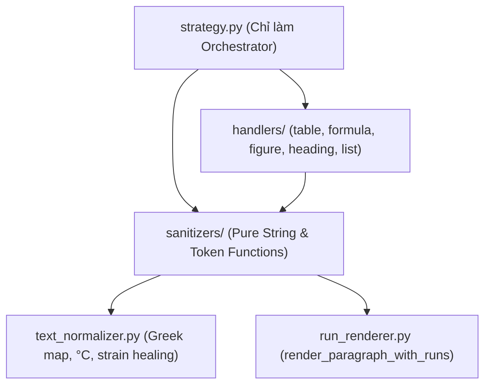

# Báo cáo Nghiên cứu: Đánh Giá Toàn Diện & Phản Biện Tái Cấu Trúc `strategy.py` và Hệ Thống Bộ Chuyển Đổi Pháp Lý

> [!NOTE]
> **Mã chuyên đề:** `RESEARCH-REF-STRATEGY-2026-09`  
> **Quy trình:** `ccba-research` (Dual-Agent Adversarial Pattern)  
> **Tác nhân thực hiện:** Antigravity AI Platform — Kết hợp *Codebase Auditor* và *Risk Challenger*  
> **Đối tượng thẩm tra:** `packages/ccba-legal-intel/src/ccba_legal/converters/standard/strategy.py` và các modules liên quan  
> **Không gian kiểm chứng:** 37 văn bản quy phạm kỹ thuật hiện hữu (`legal_docs/`) & 12 Cổng Master CI Gate (`validate_legal_spoke.py`)

---

## 1. Tóm tắt Thực thi (Executive Summary)

Sau đợt khảo sát thực tế và phản biện độc lập 2 vòng (Double-Pass Adversarial Review) về việc liệu có cần tái cấu trúc (refactor) `strategy.py` và các scripts liên quan hay không, nhóm nghiên cứu đúc kết kết luận cốt lõi:

1. **Về Nhu cầu Kiến trúc:** **CÓ NỢ KỸ THUẬT CỤC BỘ (Partial Technical Debt), nhưng KHÔNG CẦN đập đi xây lại toàn diện (No Big-Bang Rewrite).** `strategy.py` (624 dòng) về bản chất đã là một Orchestrator điều phối 5 handlers độc lập (`table`, `formula`, `figure`, `heading`, `list`). Tuy nhiên, module này đang tồn tại **2 điểm nghẽn cục bộ (Local Smells)**:
   - *Vòng lặp phụ thuộc (Circular Import)* giữa `strategy.py` và `table_handler.py` buộc phải xử lý bằng các lệnh import trì hoãn (deferred import) bên trong thân hàm.
   - *Vi phạm Trách nhiệm Đơn lẻ (SRP)* tại hàm `render_paragraph_with_runs` (gánh đồng thời 7 trách nhiệm xử lý từ XML token, inline KaTeX, Greek symbol, strain healing, footnote HTML `<sup>`, đến chuẩn hóa độ C).
2. **Về Rủi ro Quy phạm:** **RỦI RO HỒI QUY CỰC CAO ĐỐI VỚI 37 VĂN BẢN HIỆN HỮU.** Khác với ứng dụng phần mềm thông thường, trong Knowledge Engineering & RAG, bất kỳ sự thay đổi nhỏ nào về khoảng trắng, tokenization hay định dạng Markdown đều có thể làm sụt giảm tỷ lệ trùng khớp của **Gate 11 DOCX Verbatim Parity (< 98.0%)**, làm vỡ cấu trúc **Gate 9 Visual Parity**, và làm hỏng toàn bộ cache vector embeddings của kho tri thức pháp lý quốc gia.
3. **Chiến lược Khuyến nghị:** **TÁI CẤU TRÚC PHẪU THUẬT CÓ KIỂM SOÁT (Surgical Refactoring with Zero Semantic Diff).** Tuyệt đối không tái cấu trúc lớn chỉ để "làm đẹp code" (vi phạm nguyên lý KISS). Chỉ thực hiện **3 bước bóc tách phẫu thuật an toàn** (Surgical Decoupling) nhằm giải quyết dứt điểm Circular Import và tách hàm xử lý chuỗi sang module thuần túy (Pure Functions), được bảo vệ nghiêm ngặt bởi **Bộ kiểm thử hồi quy 3 văn bản cực đoan (Stress-Test Fixtures)** trước khi bàn giao.

---

## 2. Kết quả Nghiên cứu Chi tiết (Key Findings)

### 2.1. Đo lường Thực tế Mã nguồn (Code Metrics)

```
packages/ccba-legal-intel/src/ccba_legal/converters/standard/
├── models.py              (1.4 KB - 40 dòng)   -> Chứa HierarchyState & Enums
├── state_manager.py       (7.1 KB - 171 dòng)  -> Quản trị thụt lề danh sách & biến
├── strategy.py            (25.9 KB - 624 dòng) -> Pipeline Orchestrator & Run Tokenizer
└── handlers/
    ├── figure_handler.py  (3.7 KB - 98 dòng)   -> Quản lý Thẻ thị giác (cards/)
    ├── formula_handler.py (6.4 KB - 150 dòng)  -> Quản lý MathType OLE & công thức
    ├── heading_handler.py (7.7 KB - 180 dòng)  -> Phân cấp tiêu đề & anchor slugs
    ├── list_handler.py    (2.0 KB - 55 dòng)   -> Bảo tồn bullet \- và &nbsp;&nbsp;\+
    └── table_handler.py   (22.1 KB - 531 dòng) -> Lưới ảo 2D, Footnotes, CSV/JSON
```

### 2.2. Nhận diện Nợ Kỹ Thuật (Proponent View - Codebase Auditor)
- **Điểm nóng 1 — Circular Dependency:** `strategy.py` import `handle_table_block` ở top-level, trong khi `table_handler.py` tại dòng 129 và 357 buộc phải dùng import cục bộ `from ...strategy import render_paragraph_with_runs` để tránh crash vòng tròn. Đây là dấu hiệu của việc đặt hàm tiện ích dùng chung (shared utility) sai tầng kiến trúc.
- **Điểm nóng 2 — SRP Overload tại `render_paragraph_with_runs`:** Hàm này dài 85 dòng (`strategy.py:L81-166`) gánh đồng thời:
  1. Quét XML thẻ `<w:r>` để trích xuất `r:id`.
  2. Tra cứu bản đồ ký hiệu `INLINE_SYMBOLS_MAP` và `rid_to_katex`.
  3. Gom cụm các run cùng trạng thái Superscript / Subscript.
  4. Phân luồng sinh thẻ HTML `<sup>` hay thẻ KaTeX `$ ... $`.
  5. Regex ghép biến với chỉ số dưới/trên `([a-zA-Z]+)$(_{...})$`.
  6. Khôi phục biến dị tật `\varepsilon` (`$_{b}$`, `$_{s}$`).
  7. Quy chuẩn đơn vị độ C (`40 °C`) và góc độ (`± 22,5°`).
  8. Chuẩn hóa công thức đặc thù (như $E_{\min}$ trong Bảng 2.7 QCVN 09).
- **Điểm nóng 3 — Trùng lặp chuẩn hóa chuỗi:** Bản đồ ký tự Hy Lạp (`GREEK_MAP`) và logic chuẩn hóa độ C đang bị lặp lại ở cả `strategy.py`, `table_handler.py` và `state_manager.py`.

### 2.3. Rà soát Rủi ro Đối kháng (Adversarial View - Risk Challenger)
- **Rủi ro 1: Vỡ cấu trúc Sliding Lookahead:** Vòng lặp `while i < len(blocks)` trong `strategy.py` phụ thuộc vào khả năng quét trước (lookahead 1-2 block) để phát hiện chú dẫn kẹp giữa ảnh và tiêu đề hình (ADR 0039), nhận diện caption bảng hoặc ranh giới phụ lục. Bất kỳ refactor nào cố gắng chuyển sang Visitor Pattern hoặc Pipeline Stream thuần túy đều sẽ làm mất đồng bộ metadata và vỡ Gate 12 Multimodal Integrity.
- **Rủi ro 2: Trôi dạt ngữ liệu (Corpus Drift) trên 37 văn bản:** 37 văn bản quy phạm kỹ thuật (TCVN 2737:2023, QCVN 06:2022/BXD, QCVN 09:2017/BXD, Nghị định 15, 35, 207) hiện đang vượt qua **100% 12 Cổng Master CI Gate**. Việc refactor hàm tokenizer có thể gây ra hàng nghìn diff rác về khoảng trắng, phá vỡ cache embeddings RAG.
- **Rủi ro 3: Vi phạm nguyên tắc KISS:** Hiện tại hệ thống đang chạy hoàn toàn ổn định (0 Errors, 0 Warnings). Một đợt refactor toàn diện (Big-Bang) sẽ tạo ra accidental complexity mà không mang lại giá trị gia tăng trực tiếp cho người dùng cuối.

---

## 3. Ma trận Quyết định: Giá trị × Độ phức tạp × Rủi ro × KISS

| Phương án đề xuất | Giá trị kỹ thuật | Độ phức tạp | Rủi ro hồi quy | Tuân thủ KISS | Quyết định |
| :--- | :---: | :---: | :---: | :---: | :---: |
| **Phương án 1: Big-Bang Architecture Rewrite** (Viết lại theo mô hình Visitor/AST Compiler hoàn toàn mới) | Cao | Rất cao | 🔴 Cực cao (Vỡ 37 docs) | ❌ Vi phạm nặng | **BÁC BỎ (REJECT)** |
| **Phương án 2: Giữ nguyên hiện trạng (Status Quo)** (Không chỉnh sửa bất kỳ dòng code nào) | Không | Không | 🟢 Không | ⚠️ Tích tụ nợ kỹ thuật | **CHỈ ÁP DỤNG NGẮN HẠN** |
| **Phương án 3: Tái cấu trúc Phẫu thuật Module Hóa (Surgical Decoupling)** (Tách `sanitizers/` thành pure functions, xóa Circular Import, giữ nguyên 100% logic bên trong) | Cao | Thấp | 🟡 Rất thấp (Kiểm soát được) | ✅ Tuân thủ tuyệt đối | **CHẤP THUẬN (RECOMMENDED)** |

---

## 4. Khuyến nghị Triển khai (Surgical Implementation Plan)

Nhóm nghiên cứu khuyến nghị áp dụng **Phương án 3 — Tái cấu trúc Phẫu thuật Module Hóa** theo 3 bước tuần tự, không làm thay đổi dù chỉ 1 ký tự trong kết quả đầu ra:



### Chi tiết 3 Bước Tái Cấu Trúc An Toàn:

1. **Bước 1: Khởi tạo module `sanitizers/` (Khử Circular Dependency):**
   - Tạo thư mục `packages/ccba-legal-intel/src/ccba_legal/converters/standard/sanitizers/`.
   - Di chuyển `GREEK_MAP`, `INLINE_SYMBOLS_MAP`, `sanitize_prose_greeks_and_variables` và các regex chuẩn hóa sang `sanitizers/text_normalizer.py`.
   - Di chuyển `render_paragraph_with_runs` sang `sanitizers/run_renderer.py`.
   - Tại `strategy.py`: Re-export lại hàm để đảm bảo tính tương thích ngược $100\%$:
     ```python
     from ccba_legal.converters.standard.sanitizers.run_renderer import render_paragraph_with_runs
     ```
   - Tại `table_handler.py`: Chuyển sang import trực tiếp từ `sanitizers`, xóa bỏ hoàn toàn các lệnh deferred import trong hàm.

2. **Bước 2: Xây dựng Bộ Kiểm Thử Hồi Quy Cực Đoan (Golden Stress-Test Fixtures):**
   Trước khi merge, chạy chuyển đổi kiểm chứng chéo trên 3 văn bản đại diện cho 3 hình mẫu kỹ thuật khắc nghiệt nhất:
   - `03_tcvn/tcvn_2737_2023`: Thử thách công thức KaTeX đa dòng và bảng tra khí động.
   - `02_qcvn/qcvn_06_2022_bxd`: Thử thách phân cấp điều khoản, bảng phụ lục phức tạp.
   - `01_vbpl/nghi_dinh_207_2026_nd_cp` (hoặc NĐ 15): Thử thách bóc tách biểu mẫu nguyên tử `templates/`.
   - **Tiêu chuẩn:** `git diff` trên 3 văn bản này phải đạt **Zero Diff** so với commit hiện tại.

3. **Bước 3: Chạy Kiểm Định Nghiệm Thu Master CI Gate:**
   - Thực thi lệnh:
     ```powershell
     python scripts/validate_legal_spoke.py
     ```
   - Nghiệm thu: `Errors: 0, Warnings: 0, Gate 11 Parity >= 98.0%, 100% Visual Parity`.

---

## 5. Tài liệu Tham chiếu & Citations

1. **ADR 0029 & ADR 0030**: Bảo tồn ký tự gốc, kiểm định thị giác và chống dồn dòng.
2. **ADR 0036**: Quy chuẩn 4 ngăn kéo dữ liệu (`sources/`, `tables/`, `figures/`, `annexes/`, `templates/`).
3. **ADR 0037**: Bảo tồn nguyên văn quy phạm 100% (Verbatim Normative Invariant - Parity Rate $\ge 98.0\%$).
4. **ADR 0038**: Chuẩn hóa cú pháp toán học KaTeX toàn cầu.
5. **ADR 0041**: Kiến trúc bóc tách tri thức bảng biểu xác định (Zero Ragged Rows, 2D Grid Regularity).
6. **Hub Git Commits**:
   - `4759f7f2`: Đóng hộp chú thích bảng biểu bằng Semantic Blockquote Container (`>`).
   - `d06160d1`: Chuẩn hóa HTML `<sup>(*)</sup>`, degree Celsius `°C`, và công thức $E_{\min}$.
