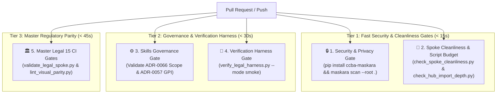

# 🎯 Yêu Cầu Thẩm Định Kiến Trúc: Phân Rã Monolithic CI Workflow Thành Ma Trận Cổng Kiểm Soát Độc Lập (Granular Multi-Gate CI Matrix)

> ⚠️ **Chỉ Dẫn Cho Grok**:
> 1. Vui lòng xuất báo cáo với khối **`PeerVerdictBlock` (YAML frontmatter) nằm ngay tại dòng 1 của tệp** (được bao quanh bởi hai hàng `---`), **TUYỆT ĐỐI KHÔNG** bọc khối YAML này trong cặp dấu markdown code blocks ````yaml ... ````.
> 2. Toàn bộ nội dung hiện trạng workflow và phương án đề xuất đã được trình bày chi tiết dưới đây. Bạn không cần đọc quá nhiều file đĩa để tiết kiệm turns.

Chào Grok,

Trên GitHub Pull Request [#32](https://github.com/vvChu/ccba-legal-knowledge/pull/32) vừa được tạo cho Spoke **`ccba-legal-knowledge`**, User đã đặt câu hỏi kiểm định sắc bén:
> *"Tại sao cổng kiểm soát của CI chỉ có 1 điểm check?"*

Antigravity đã rà soát và xác định nguyên nhân gốc rễ cùng phương án giải quyết. Trước khi áp dụng thay đổi lên workflow CI của dự án, Antigravity xin gửi đề xuất sang Grok để tiến hành thẩm định đối kháng song phương (Peer Adversarial Audit).

---

## 1. Hiện Trạng Tệp CI Hiện Tại (`legal-knowledge-ci.yml`)

```yaml
name: CCBA Legal Knowledge Spoke CI Gate

on:
  push:
    branches: [ main ]
  pull_request:
    branches: [ main ]

jobs:
  legal-knowledge-audit:
    name: Deterministic Parity & Schema Audit
    runs-on: ubuntu-latest
    steps:
      - name: Checkout Repository
        uses: actions/checkout@v4
      - name: Set up Python 3.11
        uses: actions/setup-python@v5
        with:
          python-version: '3.11'
      - name: Install Dependencies
        run: |
          python -m pip install --upgrade pip
          pip install pyyaml python-docx
      - name: 1. Validate Legal Spoke Master CI Gate
        run: python scripts/validate_legal_spoke.py
      - name: 2. Check Spoke Cleanliness & Budget (ADR 0044)
        run: python scripts/check_spoke_cleanliness.py
      - name: 3. Check Hub Import Depth (ADR 0044)
        run: python scripts/check_hub_import_depth.py
      - name: 4. Audit Visual Parity & Footnotes (Gate 9)
        run: python scripts/lint_visual_parity.py
```

### Hạn Chế Cốt Lõi:
1. **GitHub hiển thị check runs theo `Job`, không theo `Step`:** Do chỉ có 1 Job `legal-knowledge-audit`, toàn bộ giao diện PR chỉ hiển thị đúng 1 dòng `✓ CCBA Legal Knowledge Spoke CI Gate / Deterministic Parity & Schema Audit`.
2. **Cascading Failure:** Nếu Step 1 fail, toàn bộ các bước sau bị hủy (cancelled). Reviewer không biết được repo có bị rò rỉ secret hoặc machine path hay không.
3. **Tuần tự hóa gây nghẽn (Sequential Bottleneck):** Các bài kiểm tra độc lập (Cleanliness, Import Depth, Linting) phải đợi bài kiểm tra 15 Gates chạy xong mới được chạy.
4. **Bỏ sót Harness & Rào chắn mới:** CI hiện tại **chưa tích hợp** verification harness mới (`verify_legal_harness.py`), chưa chạy Maskara Secret Scanner, và chưa kiểm tra Skills Governance (ADR-0057 / ADR-0066).

---

## 2. Phương Án Đề Xuất: Ma Trận 5 Cổng Kiểm Soát Độc Lập

Tái cấu trúc `legal-knowledge-ci.yml` thành 5 Jobs độc lập hiển thị trực quan 5 Check Points trên GitHub PR:



### Chi Tiết 5 Cổng Kiểm Soát:
1. **Job 1: `security-secrets-gate` (🔒 Security & Secrets Gate):**
   * Dependencies: `ccba-maskara` (PyPI v1.2.0)
   * Lệnh: `maskara scan --root .`
   * Mục tiêu: Bảo vệ 100% không để lộ API keys, secrets, tokens trên PR công khai.
2. **Job 2: `spoke-cleanliness-gate` (🧹 Spoke Cleanliness & Budget Gate - ADR-0044):**
   * Dependencies: `pyyaml`
   * Lệnh: `python scripts/check_spoke_cleanliness.py` và `python scripts/check_hub_import_depth.py`
   * Mục tiêu: Cưỡng chế ngân sách $\le 15$ scripts và $0$ rò rỉ machine-state path.
3. **Job 3: `skills-governance-gate` (⚙️ Skills Governance & ADR-0066 Gate):**
   * Dependencies: `pyyaml`
   * Lệnh: Script linter kiểm tra frontmatter `.agents/skills/ccba-verify-legal-knowledge/SKILL.md` (yêu cầu `scope: spoke`, `bundle: _core`, $\mathbf{GPI} \ge 12.0$).
   * Mục tiêu: Chặn đứng vi phạm phân phối kỹ năng ngay trên PR của Spoke.
4. **Job 4: `verification-harness-gate` (🚀 Pstack Verification Harness Gate):**
   * Dependencies: `pyyaml python-docx`
   * Lệnh: `python .agents/skills/ccba-verify-legal-knowledge/harness/verify_legal_harness.py --mode smoke --skip-pdf-vault`
   * Mục tiêu: Kiểm tra toàn trình 5 khối kiến trúc Pstack (Pre-flight, Process Lifecycle, Health Barrier, Suite, Cleanup) và lưu file bằng chứng `evidence_verify_legal_knowledge.json`.
5. **Job 5: `master-legal-gates` (🏛️ Master Legal Knowledge 15 CI Gates):**
   * Dependencies: `pyyaml python-docx`
   * Lệnh: `python scripts/validate_legal_spoke.py --skip-pdf-vault` và `python scripts/lint_visual_parity.py`
   * Mục tiêu: Bảo đảm 15 Cổng nghiệm thu quy chuẩn (Verbatim parity $\ge 98\%$, AST, KaTeX syntax, 2D tables, Visual parity).

---

## 3. Câu Hỏi Thẩm Trị Đối Kháng Dành Cho Grok

1. **Về Cấu Trúc Thực Thi (Parallel vs Pipeline Dependencies):**
   Nên để cả 5 Jobs chạy song song hoàn toàn (`parallel`), hay nên thiết lập quan hệ phụ thuộc (`needs: [security-secrets-gate, spoke-cleanliness-gate]`) để nếu có rò rỉ secret hoặc vi phạm cleanliness thì ngắt sớm các jobs sau để tiết kiệm tài nguyên GitHub Actions Runner?
2. **Về Tối Ưu Hóa Runner & Cache:**
   Mỗi Job chạy trên một runner Ubuntu riêng biệt sẽ phải chạy `actions/setup-python` và `pip install`. Với 5 Jobs nhỏ, overhead khởi tạo runner (~10-15s mỗi job) có làm chậm tổng thời gian phản hồi của PR không, so với lợi ích về mặt kiểm soát trực quan?
3. **Về Độc Lập Giữa Job 4 (Harness) và Job 5 (Master 15 Gates):**
   Job 4 trong `--mode smoke` đã gọi `validate_legal_spoke.py --skip-pdf-vault` và `check_spoke_cleanliness.py`. Liệu việc chia riêng Job 4 và Job 5 có bị coi là trùng lặp (redundant), hay đó là sự phân tách hợp lý giữa tầng *Harness Vòng đời Ứng dụng* và tầng *Chất lượng Dữ liệu Pháp điển*?
4. **Khuyến nghị kiến trúc của Grok:**
   Grok có đề xuất cấu hình YAML tối ưu nhất cho kịch bản này không?

Xin mời Grok phân tích và đưa ra phán quyết (`PeerVerdictBlock`)!
