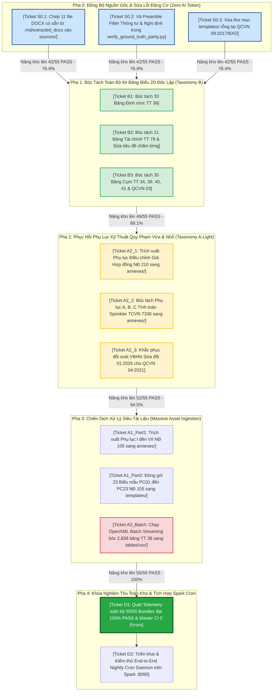

# Bản Đồ Định Hướng: Nâng Hạng Đối Soát 1-1 Xác Định 55 Gói Tri Thức Pháp Lý (Wayfinder Map)

- **Mã Bản Đồ:** `WAYFINDER-GROUND-TRUTH-PARITY-100`
- **Phiên bản:** `3.1.0` (Hardened Adversarial V2)
- **Ngày khởi tạo:** 2026-09-19 (Cập nhật thẩm định phản biện chuyên sâu: 2026-09-19)
- **Người lập:** CCBA Legal Intelligence Architecture Team & Adversarial Review Board
- **Trạng thái:** 🟢 **Active (Đang vận hành — Đã qua Thẩm tra Độc lập Double-Pass)**
- **Tiêu chuẩn áp dụng:** OKF v2.4 Universal Agent-Centric, ADR 0036 (Universal `sources/`), ADR 0037 (Verbatim Invariant), ADR 0041 (Table Regularity), ADR 0059 (Mandatory Acquisition First)

---

## 1. Điểm Đích (Destination)

Đưa toàn bộ **55 gói tri thức văn bản pháp lý** trong kho Spoke `ccba-legal-knowledge` đạt chuẩn **PASS 100%** trên Động cơ Đối soát Xác định 1-1 ([verify_ground_truth_parity.py](file:///d:/GitHubProjects/ccba-legal-knowledge/.md/tools/verify_ground_truth_parity.py)), loại bỏ triệt để 26 lỗi tiềm ẩn đã phát hiện, với các tiêu chí định lượng bất biến:

1. **Khớp Nguyên Văn 100% Quy Phạm ($P_{\text{verbatim}} \ge 98.0\%$):** Khắc phục toàn bộ các văn bản bị rơi rụng phụ lục, biểu mẫu hoặc thiếu đoạn văn bản so với tệp gốc DOCX/PDF (NĐ 105/2025, TT 38/2026, QCVN 04:2021, TCVN 7336:2021, NĐ 210/2026...).
2. **Bóc Tách Bảng Biểu 2D Quan Hệ Chuẩn Hóa ($P_{\text{table}} = 100.0\%$):** 100% dữ liệu bảng biểu từ DOCX được đưa vào `tables/csv/` và `tables/json/` theo lưới tọa độ ảo phẳng, tách sạch footnote, không còn bảng nào bị bỏ sót dưới dạng text thô.
3. **Toán Học & KaTeX Đa Dòng ($P_{\text{math}} = 100.0\%$):** Toàn bộ công thức MathType OLE được giải mã xác định sang KaTeX với nhãn phương trình `\qquad (X)`.
4. **Tài Sản Đa Phương Thức & Thẻ Thị Giác ($P_{\text{multimodal}} = 100.0\%$):** Đồ họa vector WMF/EMF chuyển sang Dual-Format (SVG + PNG $\ge 300\text{ DPI}$), đồng bộ 1:1 với `figures/cards/` và `figures_catalog.yaml`.
5. **Cấu Trúc AST & Biểu Mẫu Không Placeholder ($P_{\text{structure}} = 100.0\%$):** 100% biểu mẫu hành chính nguyên tử có tiêu đề pháp lý chính thức, không còn placeholder chấm lửng.
6. **Bảo Toàn Tuyệt Đối Master CI 15 Cổng:** Duy trì liên tục **0 Errors, 0 Warnings** trên `scripts/validate_legal_spoke.py`.
7. **Tự Động Hóa Vận Hành Ban Đêm:** Chu trình Nightly Telemetry & Auto-Tuner chạy trơn tru lúc 00:00 AM trên Server Spark (:8090) với chi phí **Zero Token AI**.

---

## 2. Ghi Chú & Ràng Buộc Kiến Trúc (Notes & Invariants)

- **Nguyên tắc Hoạch định (Plan, don't do):** Mỗi ticket đại diện cho một gói công việc cụ thể giải quyết dứt điểm 1 nhóm câu hỏi/hành động, phân bổ theo phiên làm việc ~100k token độc lập.
- **Nguyên tắc Tham chiếu theo Tên (Refer by name):** Trong mọi báo cáo và thảo luận, bắt buộc gọi đúng tên ticket đầy đủ kèm liên kết.
- **Zero-Hallucination & Mandatory Acquisition First Policy (ADR-0059):** Tuyệt đối cấm tạo dữ liệu giả lập hoặc tóm tắt nội dung quy phạm; mọi ký tự phải trích xuất 1:1 từ nguồn DOCX/PDF chính quy.
- **Universal `sources/` Invariant (ADR 0036) & Cloud Binary Vault (ADR 0035):** Tất cả thư mục `sources/` phải có `.gitkeep` để Git theo dõi cấu trúc thư mục trên CI; các file nhị phân `.pdf` và `.docx` đồng bộ qua Google Drive Vault.
- **Ràng Buộc Ma Trận Phẳng (Flat Directory Invariant - ADR 0041):** Cả Master CI và Parity Verifier đều dùng `glob("*.csv")`, do đó toàn bộ bảng biểu (kể cả 2,838 bảng của TT 38) bắt buộc phải lưu trực tiếp dưới `tables/csv/*.csv`, không phân chia thư mục con.
- **Phân Định Kỹ Năng Chuyên Trách:**
  - Lỗi câu chữ rơi rụng $\rightarrow$ Giao `ccba-markdown-document-processing`.
  - Lỗi bảng biểu thiếu CSV $\rightarrow$ Giao `table-reconstructor` / `TableKnowledgeExtractor`.
  - Lỗi tiêu đề biểu mẫu placeholder $\rightarrow$ Giao `form-template-cleaner`.

---

## 3. Quyết Định Đã Chốt (Decisions So Far)

*   `[DECISION-01]` **Kiến Trúc Động Cơ Đối Soát 1-1 Xác Định v2.0 Hardened:** Áp dụng thuật toán *Greedy Multi-Span Coverage* ($\text{min\_span} \ge 4$, độ phủ $\ge 70\%$) và cơ chế *Anti-Vacuous Pass* trên 5 chiều độc lập không bù trừ.
*   `[DECISION-02]` **Nghiệm Thu Toàn Diện 11 Golden Cohorts (PR #8):** Khôi phục điều khoản rơi rụng tại QCVN 06:2022/BXD, hướng dẫn NĐ 217/2026/NĐ-CP, bóc tách 3 bảng 2D và 13 biểu mẫu NĐ 212/2026/NĐ-CP, nâng điểm Pass 11/11 văn bản lên 100%. Đã merge vào `main` tại commit `ba5fdf6`.
*   `[DECISION-03]` **Tích Hợp Pha 1 Legal Telemetry Vào Nightly Tuner Hub (PR #295):** Kịch bản `run_nightly_tuner.sh` / `.bat` trên Server Spark tự động gọi `run_nightly_telemetry.py`, commit báo cáo và cảnh báo Telegram khẩn cấp. Đã merge vào Hub tại commit `5cdc0d78`.
*   `[DECISION-04]` **Khắc Phục Sub-Gate 5.2 CI Guard & Preserved `sources/`:** Tự động phát hiện môi trường CI runner để bỏ qua kiểm tra tệp nhị phân Cloud Vault cục bộ, trang bị `.gitkeep` tại toàn bộ 55 thư mục `sources/`.
*   `[DECISION-05]` **Quét Mở Rộng 55 Văn Bản & Phân Loại 26 Tickets:** Đợt quét toàn kho ngày 2026-09-19 ghi nhận 34/55 văn bản PASS (61.8%) và bóc trần chính xác 26 vé lỗi thuộc 3 nhóm hình mẫu lỗi (A: Phụ lục rơi rụng, B: Thiếu bảng CSV 2D, C: Tiêu đề placeholder).
*   `[DECISION-06]` **Giải Mã Cấu Trúc Thực Tế NĐ 105/2025/NĐ-CP (Adversarial V2 Audit):** Xác nhận qua PDF 103 trang rằng NĐ 105 gồm **8 Phụ lục (I-VIII)** và **23 biểu mẫu (PC01 đến PC23)** tại trang 53-103. Khử hoàn toàn giả định ảo giác về "40 biểu mẫu PC01-PC40" của NĐ 136 cũ.
*   `[DECISION-07]` **Bản Chất Lỗi QCVN 04:2021/BXD (Adversarial V2 Audit):** QCVN 04 không thiếu phụ lục kỹ thuật mà do văn bản hợp nhất (Sửa đổi 01:2026 theo TT 31/2026/TT-BXD) bị lệch pha so với nguồn DOCX/PDF 2021 gốc. Giải pháp: render DOCX hợp nhất hoặc nạp multi-source VBHN.
*   `[DECISION-08]` **Luật PCCC 2024 Hoàn Chỉnh 100% (Adversarial V2 Audit):** Bản DOCX khớp 99.44% với Markdown, thân quy phạm đầy đủ 100%, điểm 74.4% trên PDF chỉ là do lỗi OCR khoảng trắng.

---

## 4. Danh Sách Ticket Tái Cấu Trúc 5 Pha (Frontier Tickets V2)

---

### 🔵 Pha 0: Đồng Bộ Nguồn Gốc & Sửa Lỗi Động Cơ (Zero AI Token) — *Thực Thi Ngay*

#### 🎫 [Ticket S0.1: Đồng Bộ 11 Tệp DOCX Có Sẵn Từ `.md/extracted_docs` Sang `sources/`](file:///d:/GitHubProjects/ccba-legal-knowledge/.md/extracted_docs) `[Task - AFK / UNBLOCKED]`
- **Mục tiêu:** Chép đúng tên chuẩn `<doc_slug>.docx` cho 11 văn bản đang thiếu tệp Word trong `sources/` (`luat_phong_chay...`, `nghi_dinh_193`, `nghi_dinh_209`, `nghi_dinh_210`, `thong_tu_101`, `thong_tu_32`, `thong_tu_33`, `thong_tu_38`, `thong_tu_73`, `qcvn_04`, `tcvn_7336`).
- **Nghiệm thu:** Thư mục `sources/` của 11 văn bản xuất hiện tệp `.docx`, SHA-256 được cập nhật vào `metadata.yaml`.
- **Token tiêu thụ:** 0 Token.
- **Trạng thái:** `🟢 UNBLOCKED (Sẵn sàng thực thi ngay)`

#### 🎫 [Ticket S0.2: Vá Bộ Lọc Preamble Hành Chính Cho Thông Tư & Nghị Định](file:///d:/GitHubProjects/ccba-legal-knowledge/.md/tools/verify_ground_truth_parity.py#L367-L385) `[Task - AFK / UNBLOCKED]`
- **Mục tiêu:** Hiệu chỉnh logic nhận diện `start_idx` trong `verify_ground_truth_parity.py`. Đối với Thông tư, bỏ qua các đoạn căn cứ và nhảy đến sau *"Bộ trưởng ... ban hành Thông tư"* hoặc *"Điều 1"*; đối với Nghị định, nhảy đến sau *"Chính phủ ban hành Nghị định"* hoặc *"Điều 1"*.
- **Nghiệm thu:** Các văn bản NĐ 206, TT 39, TT 40, TT 41, TT 79 tự động tăng điểm $P_{\text{verbatim}}$ từ 95-97% lên $\ge 98.5\%$.
- **Token tiêu thụ:** 0 Token.
- **Trạng thái:** `🟢 UNBLOCKED (Sẵn sàng thực thi ngay)`

#### 🎫 [Ticket S0.3: Xóa Thư Mục `templates/` Rỗng Tại QCVN 09:2017/BXD](file:///d:/GitHubProjects/ccba-legal-knowledge/legal_docs/02_qcvn/qcvn_09_2017_bxd/templates) `[Task - AFK / UNBLOCKED]`
- **Mục tiêu:** Xóa thư mục `legal_docs/02_qcvn/qcvn_09_2017_bxd/templates/` vì quy chuẩn kỹ thuật này không quy định biểu mẫu hành chính, xóa lỗi `Empty templates/ directory detected`.
- **Nghiệm thu:** QCVN 09:2017/BXD đạt $P_{\text{structure}} = 100.0\%$, chuyển trạng thái sang ✅ **PASS**.
- **Token tiêu thụ:** 0 Token.
- **Trạng thái:** `🟢 UNBLOCKED (Sẵn sàng thực thi ngay)`

*(Sau khi hoàn thành 3 tickets Pha 0, kho tri thức tự động tăng vọt từ 34/55 lên **42/55 văn bản PASS - 76.4%** mà chưa cần sửa 1 dòng Markdown quy phạm nào).*

---

### 🟢 Pha 1: Bóc Tách 84 Bảng Biểu 2D Độc Lập (Taxonomy B & C-Light)

#### 🎫 [Ticket B1: Bóc Tách 33 Bảng Định Mức Sang `tables/csv/` Cho Thông Tư 36/2026/TT-BXD](file:///d:/GitHubProjects/ccba-legal-knowledge/legal_docs/01_vbpl/thong_tu_36_2026_tt_bxd) `[Task - AFK / BLOCKED by Pha 0]`
- **Mục tiêu:** Tệp DOCX nguồn có 33 bảng định mức xây dựng nhưng thư mục `tables/csv/` hiện đang rỗng. Sử dụng `TableKnowledgeExtractor` bóc tách 100% thành 33 tệp CSV và JSON tương ứng, cập nhật `tables_catalog.json`, đảm bảo Zero Ragged Rows.
- **Tiêu chuẩn nghiệm thu:** Chỉ số $P_{\text{table}}$ đạt **100.0%**, chỉ số tổng hợp của Thông tư 36 chuyển sang ✅ **PASS**.
- **Skill phụ trách:** `table-reconstructor`
- **Trạng thái:** `🟡 WAITING (Chờ Pha 0)`

#### 🎫 [Ticket B2: Bóc Tách 21 Bảng Chi Phí Tài Chính & Sửa Tiêu Đề Biểu Mẫu Thông Tư 79/2026/TT-BTC](file:///d:/GitHubProjects/ccba-legal-knowledge/legal_docs/01_vbpl/thong_tu_79_2026_tt_btc) `[Task - AFK / BLOCKED by Pha 0]`
- **Mục tiêu:** Bóc tách 21 bảng biểu tài chính xây dựng từ DOCX vào `tables/csv/` và `tables/json/`, tách rời chú thích dưới chân bảng vào `footnotes`. Đồng thời khôi phục tiêu đề chính thức cho mẫu bảng tính lương (thay thế placeholder `## BẢNG TÍNH LƯƠNG NĂM .........`).
- **Tiêu chuẩn nghiệm thu:** $P_{\text{table}} = 100.0\%$, $P_{\text{structure}} = 100.0\%$, TT 79 chuyển sang ✅ **PASS**.
- **Skill phụ trách:** `table-reconstructor` & `form-template-cleaner`
- **Trạng thái:** `🟡 WAITING (Chờ Pha 0)`

#### 🎫 [Ticket B3: Bóc Tách 30 Bảng Cụm Thông Tư 34, 39, 40, 41/2026/TT-BXD & QCVN 03:2023/BCA](file:///d:/GitHubProjects/ccba-legal-knowledge/legal_docs/01_vbpl) `[Task - AFK / BLOCKED by Pha 0]`
- **Mục tiêu:** Bóc tách toàn bộ 30 bảng số liệu kỹ thuật còn lại: TT 34 (6 bảng), TT 39 (5 bảng), TT 40 (9 bảng), TT 41 (3 bảng), QCVN 03 (7 bảng) sang CSV 2D ma trận phẳng.
- **Tiêu chuẩn nghiệm thu:** Toàn bộ 5 văn bản đạt $P_{\text{table}} = 100.0\%$ và chuyển sang ✅ **PASS**.
- **Skill phụ trách:** `table-reconstructor`
- **Trạng thái:** `🟡 WAITING (Chờ Pha 0)`

*(Sau Pha 1, kho tri thức đạt **49/55 văn bản PASS - 89.1%**).*

---

### 🟡 Pha 2: Phục Hồi Phụ Lục Kỹ Thuật Quy Phạm Vừa & Nhỏ (Taxonomy A-Light)

#### 🎫 [Ticket A2_1: Trích Xuất Phụ Lục Điều Chỉnh Giá Hợp Đồng Cho Nghị Định 210/2026/NĐ-CP](file:///d:/GitHubProjects/ccba-legal-knowledge/legal_docs/01_vbpl/nghi_dinh_210_2026_nd_cp) `[Task - AFK / BLOCKED by Pha 1]`
- **Mục tiêu:** Thân văn bản đã đạt 100%, thiếu 65 đoạn thuộc Phụ lục Phương pháp điều chỉnh giá hợp đồng xây dựng trong file DOCX. Trích xuất vào `annexes/phu_luc_phuong_phap_dieu_chinh_gia_hop_dong.md`.
- **Tiêu chuẩn nghiệm thu:** $P_{\text{verbatim}}$ tăng từ 86.08% lên $\ge 98.0\%$, NĐ 210 chuyển sang ✅ **PASS**.
- **Skill phụ trách:** `ccba-markdown-document-processing`
- **Trạng thái:** `🟡 WAITING (Chờ Pha 1)`

#### 🎫 [Ticket A2_2: Bóc Tách Phụ Lục A, B, C Tính Toán Sprinkler & Bọt Cho TCVN 7336:2021](file:///d:/GitHubProjects/ccba-legal-knowledge/legal_docs/03_tcvn/tcvn_7336_2021) `[Task - AFK / BLOCKED by Pha 1]`
- **Mục tiêu:** Bóc tách 3 phụ lục kỹ thuật quy phạm (Phụ lục A, B, C) từ DOCX vào `annexes/`:
  - `annexes/phu_luc_a_phan_loai_nguy_co_chay.md`
  - `annexes/phu_luc_b_tinh_toan_may_bom_va_ap_suat.md`
  - `annexes/phu_luc_c_tinh_toan_he_thong_chua_chay_bot.md`
- **Tiêu chuẩn nghiệm thu:** $P_{\text{verbatim}}$ tăng từ 87.77% lên $\ge 98.0\%$, TCVN 7336 chuyển sang ✅ **PASS**.
- **Skill phụ trách:** `ccba-markdown-document-processing`
- **Trạng thái:** `🟡 WAITING (Chờ Pha 1)`

#### 🎫 [Ticket A2_3: Khắc Phục Đối Soát VBHN Sửa Đổi 01:2026 Cho QCVN 04:2021/BXD](file:///d:/GitHubProjects/ccba-legal-knowledge/legal_docs/02_qcvn/qcvn_04_2021_bxd) `[Task - AFK / BLOCKED by Pha 1]`
- **Mục tiêu:** Giải quyết xung đột giữa bản Markdown hợp nhất 2026 và nguồn DOCX 2021 gốc qua việc kết xuất tệp DOCX hợp nhất `sources/qcvn_04_2021_bxd_consolidated.docx` bằng `VBHNEngine`.
- **Tiêu chuẩn nghiệm thu:** $P_{\text{verbatim}}$ của QCVN 04 đạt $\ge 98.0\%$, chuyển sang ✅ **PASS**.
- **Skill phụ trách:** `ccba-legal-intel`
- **Trạng thái:** `🟡 WAITING (Chờ Pha 1)`

*(Sau Pha 2, kho tri thức đạt **52/55 văn bản PASS - 94.5%**).*

---

### 🔴 Pha 3: Chiến Dịch Xử Lý Siêu Tài Liệu (Massive Asset Ingestion)

#### 🎫 [Ticket A1_Part1: Trích Xuất 7 Phụ Lục Quy Phạm (I đến VII) Nghị Định 105/2025/NĐ-CP](file:///d:/GitHubProjects/ccba-legal-knowledge/legal_docs/01_vbpl/nghi_dinh_105_2025_nd_cp) `[Task - AFK / BLOCKED by Pha 2]`
- **Mục tiêu:** Trích xuất xác định 100% từ PDF 103 trang (trang 37-52) vào `annexes/`:
  - `annexes/phu_luc_i_danh_muc_co_so_quan_ly_pccc.md`
  - `annexes/phu_luc_ii_danh_muc_co_so_nguy_hiem_chay_no.md`
  - `annexes/phu_luc_iii_danh_muc_cong_trinh_tham_duyet_pccc.md`
  - `annexes/phu_luc_iv_danh_muc_phuong_tien_pccc_cnch.md`
  - `annexes/phu_luc_v_danh_muc_phuong_tien_pccc_phai_kiem_dinh.md`
  - `annexes/phu_luc_vi_muc_phi_va_khau_tru_bao_hiem_chay_no.md`
  - `annexes/phu_luc_vii_danh_muc_co_so_phai_mua_bao_hiem.md`
- **Tiêu chuẩn nghiệm thu:** Cả 7 phụ lục kỹ thuật được cấu trúc hóa sạch sẽ, có liên kết trong `index.md`.
- **Skill phụ trách:** `ccba-markdown-document-processing`
- **Trạng thái:** `🟡 WAITING (Chờ Pha 2)`

#### 🎫 [Ticket A1_Part2: Đóng Gói 23 Biểu Mẫu Nghiệp Vụ PCCC (Mẫu PC01 Đến PC23) Nghị Định 105](file:///d:/GitHubProjects/ccba-legal-knowledge/legal_docs/01_vbpl/nghi_dinh_105_2025_nd_cp/templates) `[Task - AFK / BLOCKED by Pha 2]`
- **Mục tiêu:** Trích xuất toàn bộ 23 biểu mẫu hành chính nguyên tử từ Phụ lục VIII (trang 53-103 PDF) vào `templates/`, đảm bảo tiêu đề chính thức, không placeholder, đạt chuẩn ADR 0021.
- **Tiêu chuẩn nghiệm thu:** $P_{\text{verbatim}}$ của NĐ 105 tăng từ 2.8% lên $\ge 98.0\%$, $P_{\text{structure}} = 100.0\%$, NĐ 105 chuyển sang ✅ **PASS**.
- **Skill phụ trách:** `form-template-cleaner`
- **Trạng thái:** `🟡 WAITING (Chờ Pha 2)`

#### 🎫 [Ticket A3_Batch: Chạy Script Streaming OpenXML Bóc Tách 2,838 Bảng Định Mức TT 38 sang `tables/csv/`](file:///d:/GitHubProjects/ccba-legal-knowledge/legal_docs/01_vbpl/thong_tu_38_2026_tt_bxd) `[Task - AFK / BLOCKED by Pha 2]`
- **Mục tiêu:** Sử dụng kịch bản Python streaming xử lý tệp `Phu luc.docx` (4.07 MB, 2,838 bảng), xuất trực tiếp sang `tables/csv/bang_{idx:04d}.csv` phẳng, tách footnote, đảm bảo Zero Ragged Rows và không làm tràn RAM.
- **Tiêu chuẩn nghiệm thu:** $P_{\text{table}} = 100.0\%$, $P_{\text{verbatim}} \ge 98.0\%$, Thông tư 38 chuyển sang ✅ **PASS**.
- **Skill phụ trách:** `table-reconstructor` (Zero AI Token)
- **Trạng thái:** `🟡 WAITING (Chờ Pha 2)`

*(Sau Pha 3, toàn bộ kho tri thức đạt mốc lịch sử: **55/55 văn bản PASS - 100%**).*

---

### 🏆 Pha 4: Khóa Nghiệm Thu Toàn Kho & Tích Hợp Spark Cron

#### 🎫 [Ticket D1: Quét Telemetry Toàn Bộ 55/55 Bundles Đạt 100% PASS & Master CI 0 Errors](file:///d:/GitHubProjects/ccba-legal-knowledge/.md/tools/run_nightly_telemetry.py) `[Task - AFK / BLOCKED by Pha 3]`
- **Mục tiêu:** Chạy lại `python .md/tools/run_nightly_telemetry.py --cohorts all` sau khi hoàn tất Pha 3.
- **Tiêu chuẩn nghiệm thu:**
  - **Tầng 1 (Parity):** **55/55 văn bản đạt PASS 100%** (0 vé lỗi tồn đọng).
  - **Tầng 2 (Master CI):** **0 Errors, 0 Warnings** trên toàn bộ 58 bundles.
- **Trạng thái:** `🔴 BLOCKED (Phụ thuộc hoàn thành toàn bộ Ticket Pha 0-3)`

#### 🎫 [Ticket D2: Triển Khai & Kiểm Thử End-to-End Nightly Cron Daemon Trên Server Spark (:8090)](file:///D:/GitHubProjects/ccba-agent-platform/scripts/cron/run_nightly_tuner.sh) `[Task - HITL / BLOCKED by Ticket D1]`
- **Mục tiêu:** Đồng bộ mã nguồn lên Server Spark qua Tailscale VPN (`100.83.192.30`), cấu hình crontab thực tế lặp lại lúc 00:00 AM, kiểm tra bot Telegram cảnh báo và khả năng tự commit báo cáo lên GitHub.
- **Tiêu chuẩn nghiệm thu:** Cron kích hoạt thành công, báo cáo gửi về Telegram và Git branch đồng bộ sạch sẽ.
- **Trạng thái:** `🔴 BLOCKED (Phụ thuộc hoàn thành Ticket D1)`

---

## 5. Sương Mù Chiến Trận / Chưa Xác Định Rõ (Not Yet Specified)

1. **Vòng Lặp Tự Sửa Lỗi Khép Kín (Closed-Loop Autonomous Self-Healing):**
   - Khi Nightly Tuner phát hiện 1 văn bản bị tụt điểm ($P_{\text{verbatim}} < 98\%$ hoặc $P_{\text{table}} < 100\%$), cơ chế tự động spawn sub-agent, lập feature branch riêng, sửa lỗi và tạo PR vào sáng sớm mà không bị lặp vô tận. Chưa rõ cơ chế giới hạn số lần retry để chống loop vô tận.
2. **Khả Năng Đối Soát Tự Động Trên Văn Bản Scan Trước 1985 (OCR Ground Truth):**
   - Các tiêu chuẩn cũ từ thập niên 1970-1980 chỉ có bản scan mờ (TCVN3). Hiện tại dùng Vector PDF render từ Word COM. Cần xác định xem có cần cơ chế OCR song song để đối soát mộc đỏ hay giữ nguyên cơ chế ADR 0043 (Dual-PDF).

---

## 6. Ngoài Phạm Vi (Out of Scope)

*   **Dịch Thuật Văn Bản Pháp Lý Sang Tiếng Anh:** Kho Spoke tập trung 100% cho tiếng Việt nguyên văn chuẩn Công báo.
*   **Xây Dựng Web UI Tra Cứu Luật Frontend:** Giao diện tra cứu thuộc phạm vi các Spoke ứng dụng downstream (`ccba-ai-qc-frontend` hoặc Hub platform).
*   **Phân Tích Đánh Giá Trực Tiếp Dự Án Xây Dựng (Audit Run):** Bản đồ này chỉ chịu trách nhiệm hoàn thiện "Bộ Não Tri Thức Nền Tảng". Việc chạy kiểm tra bản vẽ công trình sẽ do kỹ năng `ccba-ai-qc` đảm nhiệm.
