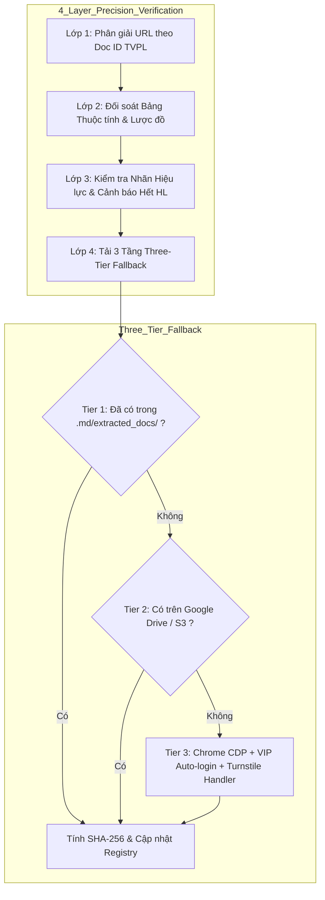

# ADR 0010: Cơ Chế Cào TVPL 4 Lớp Tự Động Kết Hợp Đăng Nhập VIP Chrome CDP & Fallback 3 Tầng

- **Trạng thái:** Accepted (Đã chấp thuận)
- **Ngày quyết định:** 2026-08-18
- **Tác giả:** CCBA Legal Intelligence Architecture Team
- **Liên quan:** [ADR 0001: Dual-Track VBHN](0001-vbhn-dual-track-provenance.md), [ADR 0007: Dual-Layer CI Verification](0007-dual-layer-ci-verification-gate.md), [CONTEXT.md](../../CONTEXT.md)

---

## 1. Bối Cảnh (Context)
Spoke Tri thức Pháp lý (`ccba-legal-knowledge`) yêu cầu thu thập và đóng gói toàn bộ văn bản quy phạm pháp luật xây dựng và PCCC theo tiêu chuẩn OKF v2.0 Native-First. Nguồn dữ liệu pháp lý phong phú và cập nhật nhất tại Việt Nam là Thư Viện Pháp Luật (TVPL).

Tuy nhiên, việc cào tự động và tải tệp văn bản gốc (`.doc`/`.docx`) từ TVPL gặp 3 thách thức lớn:
1. **Lớp bảo vệ Cloudflare Turnstile:** Màn hình xác thực *"Just a moment..."* chặn đứng các HTTP bot thông thường (requests, urllib, curl).
2. **Khóa Tải Tệp VIP:** Nút tải file Word `.docx` yêu cầu tài khoản trả phí (VIP), nếu chưa đăng nhập sẽ hiện popup chặn tải.
3. **Nguy cơ Lệch Phiên Bản (Slug vs. Doc ID Rewrite):** TVPL điều hướng URL hoàn toàn theo số nguyên Doc ID ở đuôi (ví dụ `711082.aspx`), nếu slug sai hoặc hệ thống bóc nhầm URL con, agent sẽ tải nhầm văn bản hoàn toàn khác.
4. **Nguyên tắc Tính Xác Thực (Authenticity Check):** Hệ thống không chấp nhận file convert ngược từ Markdown hay file rỗng, bắt buộc phải có tệp gốc thật kèm mã băm SHA-256 đối soát.

---

## 2. Quyết Định Kiến Trúc (Decision)

Chúng tôi quyết định chuẩn hóa toàn bộ quy trình thu thập dữ liệu pháp lý thông qua **Cơ chế Cào 4 Lớp (4-Layer Precision TVPL Crawler)** và **Chiến lược Tải 3 Tầng (Three-Tier Fallback Strategy)** trong Hub package `ccba-legal-intel`:

### Chi Tiết 4 Lớp Kiểm Soát:
1. **Lớp 1 (Định danh URL theo Doc ID):** Mọi văn bản đăng ký trong `legal_registry.yaml` phải gắn với TVPL URL chứa Doc ID chuẩn xác (ví dụ `.../Thong-tu-31-2026-TT-BXD...-711082.aspx`).
2. **Lớp 2 (Đối soát Thuộc tính & Lược đồ):** Crawler nhắm trực tiếp vào container `#divThuocTinh` và `#ctl00_Content_Tab_ThuocTinh` để trích xuất số hiệu, cơ quan ban hành, ngày ban hành và danh sách văn bản liên quan.
3. **Lớp 3 (Kiểm tra Trạng thái Hiệu lực):** Quét nhãn hiệu lực trên trang. Bật cảnh báo đỏ nếu văn bản `Hết hiệu lực`, cảnh báo vàng nếu `Chưa có hiệu lực` (áp dụng tương lai).
4. **Lớp 4 (Tải 3 Tầng Three-Tier):**
   - **Tier 1 (Local):** Kiểm tra thư mục `.md/extracted_docs/[slug]/` và cache nội bộ.
   - **Tier 2 (Cloud):** Truy vấn Google Drive API hoặc AWS S3.
   - **Tier 3 (Live Chrome CDP):** Kết nối Chrome thật qua cổng điều khiển `9222`, phát hiện Cloudflare Turnstile, nạp biến môi trường bí mật (`TVPL_USERNAME`, `TVPL_PASSWORD`), tự động click tải, bắt file từ `Downloads`, đổi tên chuẩn và tính mã băm SHA-256.

---

## 3. Hệ Quả & Đánh Đổi (Consequences & Trade-offs)

### Tích cực:
- **Tự động hóa 100% (Zero Manual Work):** Khi đã cấu hình tài khoản VIP trong `.env`, toàn bộ chu trình từ mở web, đăng nhập, tải file, trích xuất text và tính SHA-256 diễn ra hoàn toàn tự động.
- **Bảo toàn Tính Xác Thực:** Loại bỏ hoàn toàn nguy cơ sinh file giả lập, đảm bảo mọi dữ liệu đối soát pháp lý đều có tệp gốc của cơ quan ban hành làm căn cứ.
- **Khả năng Tự phục hồi:** Nếu môi trường mạng chặn Chrome CDP, hệ thống tự động fallback qua Tier 1/Tier 2 mà không làm sập pipeline.

### Đánh đổi:
- Tier 3 yêu cầu cài đặt Google Chrome trên máy trạm và biến môi trường tài khoản TVPL VIP.
