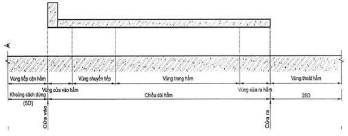
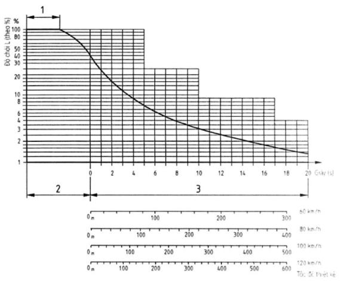

**QCVN 07:2023/BXD**

QUY CHUẨN KỸ THUẬT QUỐC GIA VỀ HỆ THỐNG CÔNG TRÌNH HẠ TẦNG KỸ THUẬT

National Technical Regulation on Technical Infrastructure System

## LỜI NÓI ĐẦU

**QCVN 07-1:2023/BXD, QUY CHUẨN KỸ THUẬT QUỐC GIA VỀ HỆ THỐNG CÔNG TRÌNH HẠ TẦNG KỸ THUẬT - CÔNG TRÌNH CẤP NƯỚC**

**QCVN 07-2:2023/BXD, QUY CHUẨN KỸ THUẬT QUỐC GIA VỀ HỆ THỐNG CÔNG TRÌNH HẠ TẦNG KỸ THUẬT - CÔNG TRÌNH THOÁT NƯỚC**

**QCVN 07-3:2023/BXD, QUY CHUẨN KỸ THUẬT QUỐC GIA VỀ HỆ THỐNG CÔNG TRÌNH HẠ TẦNG KỸ THUẬT - CÔNG TRÌNH HÀO VÀ TUY NEN KỸ THUẬT**

**QCVN 07-4:2023/BXD, QUY CHUẨN KỸ THUẬT QUỐC GIA VỀ HỆ THỐNG CÔNG TRÌNH HẠ TẦNG KỸ THUẬT - CÔNG TRÌNH GIAO THÔNG ĐÔ THỊ**

**QCVN 07-5:2023/BXD, QUY CHUẨN KỸ THUẬT QUỐC GIA VỀ HỆ THỐNG CÔNG TRÌNH HẠ TẦNG KỸ THUẬT - CÔNG TRÌNH CẤP ĐIỆN**

**QCVN 07-6:2023/BXD, QUY CHUẨN KỸ THUẬT QUỐC GIA VỀ HỆ THỐNG CÔNG TRÌNH HẠ TẦNG KỸ THUẬT - CÔNG TRÌNH CẤP XĂNG DẦU, KHÍ ĐỐT**

**QCVN 07-7:2023/BXD, QUY CHUẨN KỸ THUẬT QUỐC GIA VỀ HỆ THỐNG CÔNG TRÌNH HẠ TẦNG KỸ THUẬT - CÔNG TRÌNH CHIẾU SÁNG**

**QCVN 07-8:2023/BXD, QUY CHUẨN KỸ THUẬT QUỐC GIA VỀ HỆ THỐNG CÔNG TRÌNH HẠ TẦNG KỸ THUẬT - CÔNG TRÌNH VIỄN THÔNG**

**QCVN 07-9:2023/BXD, QUY CHUẨN KỸ THUẬT QUỐC GIA VỀ HỆ THỐNG CÔNG TRÌNH HẠ TẦNG KỸ THUẬT - CÔNG TRÌNH THU GOM, XỬ LÝ CHẤT THẢI RẮN VÀ NHÀ VỆ SINH CÔNG CỘNG**

**QCVN 07-10:2023/BXD, QUY CHUẨN KỸ THUẬT QUỐC GIA VỀ HỆ THỐNG CÔNG TRÌNH HẠ TẦNG KỸ THUẬT - CÔNG TRÌNH NGHĨA TRANG, CƠ SỞ HỎA TÁNG VÀ NHÀ TANG LỄ**

## Lời nói đầu

**QCVN 07:2023/BXD do Hội Môi trường Xây dựng Việt Nam biên soạn, Cục Hạ tầng kỹ thuật phối hợp chuyên môn, Vụ Khoa học Công nghệ và Môi trường trình duyệt, Bộ Khoa học và Công nghệ thẩm định, Bộ Xây dựng ban hành theo Thông tư số 15/2023/TT-BXD ngày 29 tháng 12 năm 2023.**

**QCVN 07:2023/BXD thay thế QCVN 07:2016/BXD được ban hành theo Thông tư số 01/2016/TT-BXD ngày 01 tháng 02 năm 2016 của Bộ trưởng Bộ Xây dựng**

**QCVN 07-1:2023/BXD**

QUY CHUẨN KỸ THUẬT QUỐC GIA VỀ HỆ THỐNG CÔNG TRÌNH HẠ TẦNG KỸ THUẬT - CÔNG TRÌNH CẤP NƯỚC

National Technical Regulation on Technical Infrastructure System - Water Supply Works

---

## 1  QUY ĐỊNH CHUNG

### 1.1  Phạm vi điều chỉnh

### 1.1.1  Quy chuẩn này quy định các yêu cầu kỹ thuật và yêu cầu quản lý bắt buộc phải tuân thủ trong hoạt động đầu tư xây dựng mới, cải tạo, nâng cấp các công trình cấp nước.

### 1.1.2  Những quy định trong quy chuẩn này được áp dụng cho:

&nbsp;&nbsp;\- Các công trình khai thác nước mặt, nước dưới đất;

&nbsp;&nbsp;\- Các nhà máy xử lý nước cấp từ công trình khai thác nước tới trạm bơm nước sạch;

&nbsp;&nbsp;\- Mạng lưới đường ống và trạm bơm tăng áp, các công trình phụ trợ trên mạng lưới.

### 1.2  Đối tượng áp dụng

Quy chuẩn này áp dụng đối với mọi tổ chức, cá nhân có các hoạt động liên quan đến đầu tư xây dựng mới, cải tạo, nâng cấp các công trình cấp nước.

### 1.3  Tài liệu viện dẫn

Các tài liệu được viện dẫn dưới đây là cần thiết trong việc áp dụng quy chuẩn này. Trường hợp các tài liệu viện dẫn được sửa đổi, bổ sung và thay thế thì áp dụng theo phiên bản mới nhất.

QCVN 01:2021/BXD, Quy chuẩn kỹ thuật quốc gia về Quy hoạch xây dựng;

QCVN 07-3:2023/BXD, Quy chuẩn kỹ thuật quốc gia về Hệ thống công trình hạ tầng kỹ thuật - Công trình hào và tuynen kỹ thuật;

QCVN 40:2011/BTNMT, Quy chuẩn kỹ thuật quốc gia về Nước thải công nghiệp;

QCVN 50:2013/BTNMT, Quy chuẩn kỹ thuật quốc gia về Ngưỡng chất thải nguy hại đối với bùn thải từ quá trình xử lý nước;

QCVN 08-MT:2023/BTNMT, Quy chuẩn kỹ thuật quốc gia về Chất lượng nước mặt;

QCVN 09-MT:2023/BTNMT, Quy chuẩn kỹ thuật quốc gia về Chất lượng nước ngầm;

QCVN 01-1:2018/BYT, Quy chuẩn kỹ thuật quốc gia về Chất lượng nước sinh hoạt.

### 1.4  Giải thích từ ngữ

Trong quy chuẩn này, các từ ngữ dưới đây được hiểu như sau:

1.4.1

Hệ thống cấp nước

Tập hợp các công trình khai thác nước, trạm bơm, trạm xử lý nước, nhà máy nước, bể chứa, đài nước, mạng lưới đường ống và các công trình phụ trợ để cung cấp nước đảm bảo chất lượng, lưu lượng và áp lực bảo đảm tới các đối tượng dùng nước.

1.4.2

Công trình khai thác nước

Công trình tiếp nhận nước từ nguồn nước vào bể thu hoặc giếng thu để đưa nước đến trạm xử lý. Trường hợp độ dao động mực nước lớn cho phép sử dụng công trình khai thác nước dạng nổi hoặc dạng ray trượt.

1.4.3

Trạm bơm nước thô

Công trình bơm nước từ công trình khai thác nước tới trạm xử lý nước.

1.4.4

Trạm xử lý nước, nhà máy nước

Tập hợp các công trình để xử lý nước đạt yêu cầu chất lượng nước sạch theo quy định.

1.4.5

Bể chứa nước sạch

Công trình điều hòa giữa chế độ chảy đến và chế độ vận chuyển nước đi, dự trữ lượng nước dùng cho bản thân trạm xử lý nước, nhà máy nước và lượng nước chữa cháy.

1.4.6

Trạm bơm nước sạch

Công trình đưa nước sạch từ bể chứa nước sạch tới mạng lưới cấp nước.

1.4.7

Mạng lưới cấp nước

Mạng lưới đường ống dẫn nước sạch từ trạm bơm nước sạch đến nơi tiêu thụ bao gồm mạng cấp I, mạng cấp II, mạng cấp III và các công trình phụ trợ có liên quan.

1.4.8

Đường ống dẫn nước thô

Đường ống dẫn nước từ trạm bơm nước thô đến trạm xử lý nước, nhà máy nước.

1.4.9

Mạng lưới cấp nước vòng

Mạng lưới cấp nước đến nơi sử dụng từ hai hướng, các đường ống tạo thành một vòng kín.

1.4.10

Mạng lưới cấp nước cụt

Mạng lưới cấp nước đến nơi sử dụng từ một hướng, các đường ống tạo thành hình nhánh (cành cây).

1.4.11

Mạng cấp I (mạng truyền dẫn)

Các đường ống có chức năng vận chuyển nước tới các khu vực của vùng phục vụ cấp nước.

1.4.12

Mạng cấp II (mạng phân phối)

Các đường ống nối có chức năng điều hoà lưu lượng cho các tuyến ống của mạng lưới cấp I, bảo đảm sự làm việc an toàn của hệ thống cấp nước và tới các khách hàng có nhu cầu sử dụng nước lớn.

1.4.13

Mạng cấp III (mạng dịch vụ)

Các đường ống lấy nước từ các đường ống của tuyến ống mạng cấp II và ống nối dẫn nước tới các khách hàng sử dụng nước.

1.4.14

Đồng hồ tiểu vùng

Thiết bị theo dõi lượng nước đầu vào và lượng nước tiêu thụ của tiểu vùng cấp nước.

1.4.15

Đồng hồ vùng

Thiết bị theo dõi lượng nước đầu vào và lượng nước tiêu thụ của vùng cấp nước.

1.4.16

Van giảm áp

Van để giảm áp lực cho phần mạng lưới ở phía sau van trên mạng cấp II khi áp lực trước van từ 30 m cột nước trở lên.

1.4.17

Van chống va

Van lắp đặt trên đường ống đẩy của trạm bơm và trên mạng lưới tại nơi áp lực có khả năng gây nên hiện tượng nước va để giảm áp lực trên đường ống đẩy khi xảy ra hiện tượng nước va.

1.4.18

Đài nước

Công trình điều hòa lưu lượng và áp lực, ngoài ra còn dự trữ lượng nước chữa cháy khi máy bơm chữa cháy chưa làm việc và dự trữ nước để rửa bể lọc.

1.4.19

Trạm bơm tăng áp

Trạm bơm có chức năng đảm bảo lưu lượng và áp lực cho phần mạng lưới phía sau hoặc nơi có độ cao địa hình thay đổi để giảm áp lực cho trạm bơm chính.

1.4.20

Bơm tăng áp trực tiếp từ đường ống

Máy bơm đặt ngay trong đường ống để tăng áp lực cho phần mạng lưới phía sau mà không cần bể chứa trước nó.

1.4.21

Công trình khai thác nước dạng tia

Công trình khai thác nước ngầm mạch nông bằng hệ thống thu nước hoặc đường hầm ngang để thu nước đến giếng tập trung nước.

1.4.22

Thiết bị biến tần

Thiết bị thay đổi tần số để thay đổi số vòng quay của máy bơm theo lưu lượng và áp lực trên mạng lưới cấp nước theo yêu cầu.

1.4.23

Lắng La-men

Thiết bị lắng bao gồm các tấm với các dạng hình học khác nhau, được sử dụng để tạo dòng chảy tầng trong bể lắng nhằm nâng cao đặc tính lắng của bể lắng.

## 2  QUY ĐỊNH KỸ THUẬT

### 2.1  Yêu cầu chung

### 2.1.1  Đầu tư xây dựng hệ thống cấp nước phải phù hợp với quy hoạch được cấp có thẩm quyền phê duyệt, đảm bảo việc sử dụng hợp lý các nguồn nước an toàn và bền vững trong điều kiện biến đổi khí hậu.

### 2.1.2  Kết cấu và vật liệu xây dựng công trình cấp nước phải đảm bảo yêu cầu bền vững, ổn định trong suốt thời hạn sử dụng theo thiết kế của công trình (tuổi thọ thiết kế) dưới tác động của điều kiện tự nhiên, các tác động của môi trường xung quanh, các tác động trong quá trình vận hành. Hoá chất, vật liệu, thiết bị trong xử lý, vận chuyển và dự trữ nước sinh hoạt không được ảnh hưởng đến chất lượng nước và sức khoẻ của con người.

### 2.1.3  Chất lượng nước sạch sử dụng cho mục đích sinh hoạt phải đảm bảo yêu cầu của QCVN 01- 1:2018/BYT và quy chuẩn địa phương.

### 2.1.4  Công suất của hệ thống cấp nước phải tính toán cho ngày có nhu cầu dùng nước lớn nhất trong năm; nước dùng cho sinh hoạt có tính tới hệ số dùng nước không điều hòa ngày; nước tưới đường, tưới cây, nước cho các công trình công cộng, nước cho thương mại dịch vụ, nước cho các công trình đặc biệt, cho công nghiệp, lượng nước thất thoát và lượng nước dùng cho bản thân trạm xử lý nước, nhà máy nước tuân thủ theo QCVN 01:2021/BXD.

### 2.2  Nguồn nước

### 2.2.1  Chất lượng nước thô phải đáp ứng theo yêu cầu của QCVN 08-MT: 2023/BTNMT và QCVN 09- MT:2023/BTNMT. Các loại nguồn nước khác như nước nhiễm mặn không áp dụng các quy chuẩn này. Trong trường hợp nguồn nước không đạt yêu cầu của QCVN 08-MT:2023/BTNMT và QCVN 09-MT:2023/BTNMT, cho phép sử dụng nguồn nước đó và phải có biện pháp xử lý để đảm bảo chất lượng nước sau xử lý đạt theo quy định tại 2.1.3.

### 2.2.2  Nguồn nước phải có điều kiện bảo đảm vệ sinh và tổ chức vùng bảo vệ vệ sinh, bảo vệ nguồn nước không bị nhiễm bẩn bởi nước thải sinh hoạt, nước thải sản xuất và các nguy cơ ô nhiễm khác.

### 2.2.3  Nguồn nước cấp cho trạm xử lý nước cấp, nhà máy nước phải tuân thủ các quy hoạch có liên quan đến sử dụng nguồn nước được cơ quan có thẩm quyền phê duyệt, bảo đảm an ninh an toàn nguồn nước, có khả năng đáp ứng đủ lượng nước yêu cầu cho các giai đoạn quy hoạch sử dụng nước và phải có giải pháp đủ để cấp đủ cho nhu cầu dùng nước cho cả mùa khô.

### 2.3  Công trình khai thác nước

### 2.3.1  Công trình khai thác nước mặt

### 2.3.2.1  Công trình khai thác nước mặt phải bảo đảm:

&nbsp;&nbsp;\- Đủ công suất thiết kế cho các giai đoạn của dự án;

&nbsp;&nbsp;\- Công trình làm việc an toàn, ổn định, bền lâu; không gây ảnh hưởng đến chế độ thủy văn của nguồn cấp nước và giao thông đường thủy;

&nbsp;&nbsp;\- Phải tính đến mực nước biển dâng cao và xâm nhập mặn ở khu vực ven biển, việc hạ thấp mực nước do khô hạn, do ảnh hưởng của biến đổi khí hậu.

### 2.3.1.2  Vị trí công trình khai thác nước mặt, phải đảm bảo các yêu cầu sau:

&nbsp;&nbsp;\- Phải đặt ở thượng lưu của dòng chảy so với khu vực dùng nước theo các quy hoạch đã được phê duyệt. Trong trường hợp không xác định được hướng dòng chảy hoặc hướng dòng chảy thay đổi theo thời gian, nguồn nước bị xâm nhập mặn thì chọn vị trí công trình thu ở vị trí thích hợp để đảm bảo điều kiện kỹ thuật và kinh tế;

&nbsp;&nbsp;\- Phải đặt ở nơi có điều kiện địa chất công trình tốt và tránh được ảnh hưởng của các hiện tượng thuỷ văn khác, có bờ và lòng sông ổn định, ít bị xói lở bồi đắp và thay đổi dòng nước, có đủ độ sâu cần thiết khi ở mực nước thấp nhất, đảm bảo công trình ổn định lâu dài;

&nbsp;&nbsp;\- Không được phép đặt công trình thu ở hạ lưu gần nhà máy thuỷ điện. Khoảng cách nhỏ nhất cho phép là 1 000 m.

### 2.3.1.3  Khi xây dựng công trình khai thác nước phải tính đến khả năng súc xả, thuận tiện nạo vét bùn cặn, vớt rác.

### 2.3.1.4  Cửa thu nước:

&nbsp;&nbsp;\- Phải đảm bảo khi thu nước không tạo xoáy trên mặt nước; khoảng cách tối thiểu giữa mực nước thấp nhất đến đỉnh của cửa thu hoặc họng thu là 0,5 m;

&nbsp;&nbsp;\- Không được xây dựng cửa thu nước trong phạm vi bảo vệ luồng chạy tàu thuyền hoặc khu vực có rong tảo phát triển.

### 2.3.2  Giếng khoan khai thác nước dưới đất

### 2.3.2.1  Giếng khoan khai thác nước dưới đất phải đảm bảo các quy định về kỹ thuật, ổn định về lưu lượng, chất lượng nước và độ hạ mực nước trong quá trình khai thác và phải tuân theo các quy định pháp luật về khai thác nước ngầm.

### 2.3.2.2  Số lượng giếng công tác được xác định phụ thuộc vào lưu lượng khai thác, khả năng cung cấp của tầng chứa nước và độ hạ thấp mực nước cho phép, số lượng giếng dự phòng được xác định phụ thuộc vào số lượng giếng công tác và mức độ an toàn cấp nước.

### 2.3.2.3  Khoảng trống giữa các ống vách, giữa ống vách và thành lỗ khoan phải được chèn bằng đất sét hoặc vật liệu tương đương, tránh xâm nhập của nước mặt gây ô nhiễm nguồn nước.

### 2.3.2.4  Khi giếng không sử dụng phải trám lấp giếng bằng vật liệu không thấm nước để đảm bảo không gây ô nhiễm nguồn nước. Trong trường hợp điều kiện địa chất thuận lợi, cho phép khai thác nước bằng công trình khai thác nước bằng ống lọc có khe chôn trong lòng đất.

### 2.4  Trạm bơm

### 2.4.1  Yêu cầu chung

### 2.4.1.1  Trạm bơm phải được thiết kế theo tính chất riêng của từng loại trạm bơm; phải tính đến việc cải tạo, mở rộng theo quy hoạch.

### 2.4.1.2  Kích thước trạm bơm phải đảm bảo bố trí được các máy bơm công tác, máy bơm dự phòng, máy bơm rửa bể lọc, máy gió rửa lọc, các thiết bị điều khiển, đường ống và thiết bị nâng và khoảng không gian thao tác lắp đặt, sửa chữa.

### 2.4.1.3  Phần chìm dưới mặt đất của trạm bơm phải được xây dựng bằng vật liệu không thấm nước. Trường hợp tường của trạm bơm nằm dưới mực nước ngầm phải phủ một lớp vật liệu chống thấm ở sàn đáy, mặt trong và mặt ngoài tường của trạm bơm.

### 2.4.1.4  Bố trí ống hút của trạm bơm

Ống hút của máy bơm phải có độ dốc cao dần về phía máy bơm, không được phép có các điểm gây tụ khí trong bất kỳ điểm nào của ống hút.

### 2.4.1.5  Bố trí ống đẩy của trạm bơm

Mỗi trạm bơm ít nhất có 2 ống đẩy chung trong đó 1 ống có thể đặt chờ đấu nối cho giai đoạn sau. Cho phép bố trí một ống đẩy đối với trạm có công suất nhỏ hơn 10 000 $m^{3}$/d hoặc trong hệ thống có nhiều trạm bơm cùng cấp nước vào mạng lưới.

### 2.4.1.6  Trong gian máy phải bố trí thiết bị nâng. Loại thiết bị nâng được chọn theo trọng lượng tổ máy bơm lớn nhất đặt trong trạm bơm.

### 2.4.2  Trạm bơm giếng khoan

### 2.4.2.1  Diện tích mặt bằng của trạm bơm giếng khoan tối thiểu là 12 $m^{2}$.

### 2.4.2.2  Mái nhà trạm phải có cửa rút ống.

### 2.4.2.3  Các trạm bơm giếng xây dựng ở vùng ngập lụt phải xây dựng có cao độ sàn gian máy cao hơn độ cao mực nước cao nhất tối thiểu 0,5 m.

### 2.4.2.4  Miệng giếng phải cao hơn sàn ít nhất là 0,3 m.

### 2.4.2.5  Phải có giếng khoan có lắp đặt máy bơm với chức năng giếng dự trữ. Giếng dự trữ phải được làm việc luân phiên cùng với tổ hợp của nhóm giếng.

### 2.4.3  Trạm bơm nước thô (khai thác nước mặt)

### 2.4.3.1  Thiết kế trạm bơm nước thô phải theo chế độ làm việc điều hòa của trạm xử lý nước, nhà máy nước.

### 2.4.3.2  Trạm bơm nước thô cấp nước thô về trạm xử lý nước, nhà máy nước, gồm máy bơm nước sinh hoạt và các bơm dự phòng. Khi công trình thu và trạm bơm xây dựng kết hợp có phân đợt xây dựng thì phần xây dựng công trình thu và nhà trạm phải được xây dựng cho cả hai giai đoạn ngay từ đợt đầu, phần thiết bị lắp đặt phù hợp với từng giai đoạn.

### 2.4.4  Trạm bơm nước sạch

### 2.4.4.1  Trạm bơm phải đảm bảo công trình vận hành an toàn, ổn định với các trường hợp thiết kế; thuận lợi trong quản lý, khai thác, bảo dưỡng và sửa chữa, có sàn bố trí các thiết bị phục vụ công tác quản lý; có hệ thống thông gió và chiếu sáng; có giải pháp vận chuyển máy móc, thiết bị; có rãnh thu nước, hố tập trung nước và lắp đặt máy bơm để tiêu nước rò rỉ.

### 2.4.4.2  Trong trạm bơm nước sạch bố trí bơm nước sinh hoạt, sản xuất, bơm nước chữa cháy và được phép bố trí máy bơm rửa lọc và máy gió rửa lọc.

### 2.4.4.3  Mỗi nhóm bơm phải có bơm dự phòng. Khi bơm chữa cháy và bơm nước sinh hoạt cùng loại thì bơm dự phòng được chọn chung cho cả hai nhóm bơm.

### 2.4.4.4  Lưu lượng của máy bơm sinh hoạt phải đảm bảo cung cấp nước cho khu vực thiết kế cho giờ dùng nước lớn nhất. Lưu lượng của máy bơm chữa cháy phải cung cấp đủ lượng nước sinh hoạt và chữa cháy xảy ra trong giờ dùng nước lớn nhất.

### 2.4.4.5  Áp lực của máy bơm phải xác định theo điều kiện đảm bảo áp lực tự do tại điểm bất lợi nhất của mạng lưới trong giờ dùng nước lớn nhất và khi có cháy xảy ra trong giờ dùng nước lớn nhất là 10 m.

### 2.4.4.6  Các trạm bơm nước sạch của các trạm cấp nước, nhà máy nước có công suất từ 10 000 $m^{3}$/d trở lên cần phải lắp đặt thiết bị biến tần. Việc điều khiển thiết bị biến tần phải được tự động hoá theo áp lực thực tế trên mạng lưới, lưu lượng nước bơm vào mạng lưới và mực nước trong bể chứa.

### 2.5  Trạm xử lý nước, nhà máy nước

### 2.5.1  Yêu cầu chung

### 2.5.1.1  Mỗi loại công trình đơn vị tối thiểu có 2 đơn nguyên nhằm đảm bảo điều kiện làm việc điều hòa suốt ngày đêm với khả năng có thể ngừng từng công trình của trạm để thau rửa, sửa chữa. Đối với trạm có công suất dưới 3 000 $m^{3}$/d được phép ngừng làm việc một số giờ để thau rửa, sửa chữa thì cho phép xây dựng 1 đơn nguyên.

### 2.5.1.2  Trạm xử lý nước, nhà máy nước phải thiết kế hệ thống xử lý nước xả cặn bể lắng, rửa bể lọc hoặc xả vào hồ lắng nước rửa lọc với điều kiện phải tuân thủ các yêu cầu tại QCVN 40:2011/BTNMT và các yêu cầu bảo vệ môi trường khác.

### 2.5.2  Dây chuyền công nghệ xử lý nước cấp

Dây chuyền công nghệ xử lý nước mặt và nước dưới đất phải được lựa chọn căn cứ vào thành phần tính chất của nước thô, quy mô công suất của trạm xử lý nước, nhà máy nước, yêu cầu chất lượng nước sạch phục vụ cho sinh hoạt, sản xuất và các mục đích khác theo quy định, đảm bảo yêu cầu sử dụng năng lượng hiệu quả, tiết kiệm.

### 2.5.3  Ngăn tiếp nhận, ngăn tách khí

### 2.5.3.1  Ngăn tiếp nhận và phân phối nước thô phải đảm bảo cho giai đoạn làm việc hết công suất theo dự án được phê duyệt.

### 2.5.3.2  Phải bố trí ngăn tách khí khi sử dụng bể phản ứng có lớp cặn lơ lửng, bể lắng trong có lớp cặn lơ lửng và bể lọc tiếp xúc.

### 2.5.4  Bể phản ứng-tạo bông cặn

Trong dây chuyền công nghệ xử lý nước bằng hóa chất keo tụ phải bố trí bể trộn, bể phản ứng. Trường hợp bắt buộc phải dùng ống dẫn nước từ bể phản ứng sang bể lắng thì vận tốc nước trong ống không được vượt quá 0,3 m/s.

### 2.5.5  Bể lắng

### 2.5.5.1  Bể lắng sơ bộ, hồ lắng sơ bộ

Phải xây dựng bể lắng sơ bộ, hồ lắng sơ bộ trong trường hợp nước có hàm lượng cặn lớn nhất lớn hơn 1 000 mg/L. Trong trường hợp điều kiện diện tích đất cho phép, xây dựng hồ sơ lắng có khả năng dự trữ nước lớn phục vụ cấp nước an toàn khi nguồn nước có sự cố hoặc hạn hán, cho phép áp dụng khi hàm lượng cặn lớn nhất nhỏ hơn 1 000 mg/L. Thời gian lưu nước tối thiểu là 1 ngày, khi điều kiện đất đai cho phép tính thời gian lưu nước lớn hơn để phục vụ cấp nước an toàn khi nguồn nước có sự cố, phải thiết kế hệ thống xả bùn cặn cho bể lắng sơ bộ và biện pháp nạo vét bùn cho hồ lắng sơ bộ.

### 2.5.5.2  Hàm lượng cặn sau bể lắng

### 2.5.5.2.1  Hàm lượng cặn sau khi ra khỏi bể lắng cho nguồn nước mặt không được lớn hơn 20 mg/L.

### 2.5.5.2.2  Trong công nghệ xử lý nước dưới đất, khi tổng hàm lượng cặn sau khi làm thoáng lớn hơn 20 mg/L phải tính toán bể lắng tiếp xúc có chức năng lắng cặn. Bể lắng tiếp xúc phải tính toán với thời gian nước lưu lại trong bể tối thiểu là 90 phút khi không dùng chất keo tụ. Khi pH và độ kiềm của nước nguồn cao và có giải pháp trợ lắng hiệu quả hoặc khi dùng bể lắng La-men thì cho phép thời gian lưu nước tối thiểu là 60 phút.

### 2.5.5.2.3  Các loại bể lắng phải thiết kế hệ thống xả cặn bằng áp lực thủy tĩnh hoặc bằng máy bơm.

### 2.5.5.3  Bể tuyển nổi áp lực

### 2.5.5.3.1  Cho phép sử dụng bể tuyển nổi áp lực thay cho bể lắng trong trường hợp hàm lượng cặn lơ lửng trong nước nguồn nhỏ, cặn có dạng mịn, nước hồ có độ mầu cao, nguồn nước có tảo và ở những trường hợp, điều kiện kinh tế kỹ thuật cho phép.

### 2.5.5.3.2  Phải thiết kế hệ thống thu chất nổi trên bề mặt sao cho khi hệ thống này làm việc không ảnh hưởng đến chất lượng nước đưa sang bể lọc.

### 2.5.6  Bể lọc

### 2.5.6.1  Bể lọc nhanh trọng lực

### 2.5.6.1.1  Bể lọc nhanh trọng lực phải được tính toán theo 2 chế độ làm việc, chế độ làm việc bình thường và chế độ làm việc tăng cường. Trong các trạm xử lý có số lượng bể lọc đến 20 phải dự tính ngừng 1 bể lọc để sửa chữa, khi số lượng bể lớn hơn 20 phải dự tính ngừng 2 bể để sửa chữa đồng thời.

### 2.5.6.1.2  Phải thiết kế hệ thống rửa cát lọc của bể, thông số thiết kế hệ thống rửa phù hợp đảm bảo rửa sạch đều cát tại mọi vị trí của bể, tránh hao hụt cát khi rửa.

### 2.5.6.1.3  Kích thước ống dẫn hoặc máng của bể lọc phải tính theo chế độ làm việc tăng cường.

### 2.5.6.2  Lọc màng

### 2.5.6.2.1  Cho phép sử dụng công nghệ lọc màng để xử lý nước mặt, nước ngầm, nước lợ, làm ngọt nước biển, lọc nước tinh khiết.

### 2.5.6.2.2  Phải có biện pháp tiền xử lý nước nguồn trước khi lọc màng để giảm tải, kéo dài thời gian làm việc cho các màng lọc, phải sử dụng các loại màng lọc có kích thước nhỏ dần trước khi lọc thẩm thấu ngược (RO).

### 2.5.7  Loại bỏ sắt và mangan trong nước

### 2.5.7.1  Cho phép sử dụng các loại vật liệu tiếp xúc trong bể lọc loại bỏ mangan với điều kiện vật liệu tiếp xúc không gây hại cho sức khỏe con người và được các cơ quan kiểm định cho phép, có thể dùng hóa chất để xử lý loại bỏ mangan trong nước.

### 2.5.7.2  Loại bỏ sắt bằng phương pháp làm thoáng đơn giản và lọc

Khi hàm lượng sắt tổng cộng trong nước nhỏ hơn 6 mg/L, hàm lượng $Fe^{2+}$ chiếm tỷ lệ từ 80 % trở lên, nguồn nước không bị nhiễm $NH_{4}^{+}$, pH>7 và các điều kiện khác cho phép, thì được áp dụng công nghệ làm thoáng đơn giản và lọc bằng hệ thống phân phối nước trên mặt bể lọc hoặc các máng tràn trước khi vào bể lọc.

### 2.5.7.3  Làm thoáng bằng dàn mưa

Cho phép dùng dàn mưa trong công nghệ loại bỏ sắt và mangan bằng phương pháp làm thoáng trong điều kiện không có công trình che khuất, cản trở luồng gió.

### 2.5.7.4  Làm thoáng bằng thùng quạt gió

### 2.5.7.4.1  Thiết kế thùng quạt gió phải tính toán chiều dầy lớp vật liệu tiếp xúc, không được phép dùng các vật liệu tiếp xúc gây tắc thùng quạt gió, phải thiết kế hệ thống rửa lớp vật liệu tiếp xúc.

### 2.5.7.4.2  Phải tính toán chọn quạt gió có lưu lượng phù hợp, để hạn chế việc tạo thành cặn Fe(OH)$_{3}$ ngay trong thùng quạt gió.

### 2.5.7.5  Loại bỏ Asen trong nước

### 2.5.7.5.1  Các vật liệu lọc, vật liệu tiếp xúc dùng trong công nghệ xử lý Asen không được chứa các thành phần ảnh hưởng đến sức khỏe con người.

### 2.5.7.5.2  Vật liệu lọc, vật liệu hấp phụ Asen sau khi thải bỏ phải được quản lý, xử lý như chất thải nguy hại.

### 2.5.8  Xử lý bùn cặn

### 2.5.8.1  Bùn cặn của trạm xử lý nước phải được thu gom, làm khô, tái sử dụng hoặc chuyên chở tới các khu xử lý chất thải để xử lý đảm bảo an toàn vệ sinh môi trường theo qui định. Xử lý bùn cặn của quá trình xử lý nước phải đáp ứng yêu cầu của QCVN 50:2013/BTNMT.

### 2.5.8.2  Phải lựa chọn công nghệ xử lý bùn cặn đơn giản, đạt hiệu quả, đảm bảo chất lượng nước sau xử lý có thể tái sử dụng với trạm có công suất từ 5 000 $m^{3}$/d đưa vào công trình đầu tiên của dây chuyền xử lý chính của trạm xử lý, nhà máy nước.

### 2.5.9  Bể chứa nước sạch

### 2.5.9.1  Dung tích của bể chứa nước sạch trong trạm xử lý, nhà máy nước phải đủ để điều hòa lưu lượng giữa lượng nước chảy vào bể và chế độ làm việc của trạm bơm nước sạch, lượng nước chữa cháy trong 3 giờ của khu vực đô thị mà bể phục vụ, lượng nước cho bản thân trạm cấp nước, nhà máy nước. Dung tích bể chứa nhỏ nhất là 20 % công suất của nhà máy. Trường hợp sử dụng nguồn nước hồ để chữa cháy thì không tính nước dự trữ chữa cháy cho bể chứa nước sạch.

### 2.5.9.2  Trong bể chứa phải có các vách ngăn để tạo dòng nước chảy vòng với thời gian lưu nước phải lớn hơn 30 phút, đủ thời gian tiếp xúc cần thiết cho việc khử trùng (trừ bể chứa của khu đô thị nếu không bổ sung Clo vào bể).

### 2.5.10  Khử trùng nước

### 2.5.10.1  Hoá chất được lựa chọn để khử trùng phải đảm bảo hiệu quả khử trùng cao, an toàn cho sức khỏe con người, kể cả công nhân vận hành hệ thống khử trùng.

### 2.5.10.2  Trong nhà chứa hóa chất phải trang bị các thiết bị bảo hộ lao động, hệ thống thông gió, thiết bị báo lượng Clo rò rỉ, hệ thống trung hòa hoặc tự động hấp thụ Clo bằng hóa chất khi có sự cố để đảm bảo an toàn cho người vận hành, cho toàn thể nhân viên trong trạm và dân cư xung quanh.

### 2.5.11  Các điều kiện khác

### 2.5.11.1  Đường nội bộ trong trạm cấp nước, nhà máy nước phải có chiều rộng tối thiểu là 3,5 m, đủ sức chịu tải cho xe chở thiết bị nặng nhất trong trạm và phải có chỗ quay xe.

### 2.5.11.2  Nguồn điện cấp cho trạm cấp nước, nhà máy nước phải là nguồn điện ưu tiên, trong nhà máy phải trang bị máy phát điện dự phòng cho trạm cấp nước, nhà máy nước có bậc tin cậy bậc I. Công suất của máy phát điện dự phòng phải đủ cho các công trình sản xuất chính nhà máy hoạt động.

### 2.6  Mạng lưới cấp nước

### 2.6.1  Đường ống truyền dẫn

### 2.6.1.1  Đường ống truyền dẫn nước thô từ công trình thu đến nhà máy nước và đường ống dẫn nước sạch từ nhà máy nước đến điểm đầu của mạng lưới phân phối phải thiết kế 2 đường ống và có các đường ống nối, phải đảm bảo khi có 1 đoạn ống trong hệ thống bị hư hỏng vẫn cấp được 70 % lưu lượng tính toán.

### 2.6.1.2  Vật liệu làm đường ống truyền dẫn phải đảm bảo độ bền cơ học, hóa học, chịu áp lực và tác động cơ học, không bị phá hủy trong mọi điều kiện làm việc.

### 2.6.1.3  Phải có mốc đánh dấu vị trí tuyến ống và hành lang an toàn để tránh làm hư hỏng ống khi thi công mở rộng đường hoặc các công trình xây dựng khác.

### 2.6.2  Đường ống cấp nước

### 2.6.2.1  Mạng lưới cấp nước của khu đô thị mới phải đặt trong hào hoặc tuy nen kỹ thuật theo quy định tại QCVN 07-3:2023/BXD.

### 2.6.2.2  Mạng lưới đường ống cấp nước của đô thị loại III trở lên phải chia thành 3 cấp. Nghiêm cấm việc đấu nối từ đường ống của khách hàng dùng nước với đường ống của mạng cấp I hoặc mạng cấp II. Cho phép khách hàng sử dụng nước 500 $m^{3}$/d trở lên đấu nối với mạng cấp II.

### 2.6.2.3  Mạng lưới đường ống cấp nước phải là mạng lưới vòng. Mạng lưới cụt chỉ được phép áp dụng trong các trường hợp:

&nbsp;&nbsp;\- Cơ sở sản xuất được phép ngừng để sửa chữa;

&nbsp;&nbsp;\- Mạng lưới cấp nước cho đô thị loại V hoặc các điểm dân cư khi số dân dưới 3 000 người;

&nbsp;&nbsp;\- Theo phân đợt xây dựng trước khi đặt hoàn chỉnh mạng lưới vòng theo quy hoạch.

### 2.6.2.4  Đường kính tối thiểu của mạng lưới cấp nước sinh hoạt kết hợp với chữa cháy ngoài nhà trong các khu đô thị phải là 100 mm.

### 2.6.2.5  Vật liệu ống phải chịu được áp lực và tác động cơ học do xe trọng tải lớn chạy trên đường, lớp tráng trong phải đảm bảo độ bền về cơ học, hóa học và không ảnh hưởng đến chất lượng nước, không ảnh hưởng đến sức khỏe con người, được cơ quan y tế cho phép. Trường hợp đặt ống trong vùng đất hoặc nước có tính ăn mòn thì phải có biện pháp chống ăn mòn cho ống.

### 2.6.2.6  Trên đường ống tự chảy có áp phải đặt các thiết bị hấp thụ năng lượng hay thiết bị bảo vệ khác để đường ống làm việc trong giới hạn áp lực cho phép.

### 2.6.2.7  Đối với đường ống dẫn tự chảy không áp phải xây dựng các giếng thăm. Nếu địa hình quá dốc phải xây dựng các giếng chuyển bậc để giảm tốc độ dòng nước.

### 2.6.2.8  Độ sâu đặt ống dưới đất phải được xác định theo tải trọng trên đỉnh ống, độ bền của ống, ảnh hưởng của nhiệt độ xung quanh và các điều kiện khác nhưng không nhỏ hơn 0,7 m tính từ mặt đất đến đỉnh ống đối với đường kính ống nhỏ hơn hoặc bằng 300 mm, không nhỏ hơn 1 m đối với đường kính ống lớn hơn 300 mm. Đường ống đi qua nền đất yếu phải đặt trên kết cấu đỡ ống để đảm bảo không gây chuyển vị và hư hỏng mối nối.

**CHÚ THÍCH:** Độ sâu đặt ống tối thiểu cho phép giảm 0,3 m so với quy định trên khi đặt ống trên vỉa hè, hoặc có các biện pháp kỹ thuật bảo vệ đường ống.

### 2.6.2.9  Sau khi lắp đặt từng phần của mạng lưới, phải thử áp lực để kiểm tra độ kín của ống và các bộ phận nối, áp lực thử bằng 1,5 lần áp lực làm việc của đường ống. Quy trình thử áp lực phải tuân thủ tiêu chuẩn quốc gia về thử áp lực đường ống cấp nước sau khi lắp đặt.

### 2.6.3  Các thiết bị phục vụ kiểm soát đảm bảo cấp nước an toàn

### 2.6.3.1  Phải thiết kế, lắp đặt van xả, thu khí tại các điểm cao của mạng lưới cấp nước.

### 2.6.3.2  Phải thiết kế, lắp đặt van xả cặn tại các điểm thấp nhất, trên từng phần của mạng lưới.

### 2.6.3.3  Phải tính toán nước va, khi cần thiết phải lắp đặt van chống nước va trong trạm bơm và mạng lưới cấp nước.

### 2.6.3.4  Phải lắp đặt các thiết bị giám sát chất lượng nước tại trạm xử lý, nhà máy nước và độ đục, Clo dư trên đường ống truyền tải, phân phối nước khi công suất từ 10 000 $m^{3}$/d trở lên.

### 2.6.4  Phân vùng tách mạng

### 2.6.4.1  Mạng lưới cấp nước của đô thị loại III trở lên phải phân vùng tách mạng nhằm giảm thất thoát nước, phải lắp đặt các loại đồng hồ vùng, đồng hồ tiểu vùng.

### 2.6.4.2  Mỗi đồng hồ tiểu vùng cấp nước phục vụ không quá 5 000 khách hàng dùng nước, đối với đô thị loại đặc biệt và loại I cho phép phục vụ tới 8 000 khách hàng, mỗi đồng hồ vùng cấp nước gồm 3 tiểu vùng cấp nước trở lên.

### 2.6.5  Đường ống qua sông, đường cao tốc, đường tàu hỏa

### 2.6.5.1  Đường ống ngầm qua sông (Điu-ke):

&nbsp;&nbsp;\- Số lượng ống qua đáy sông phải không nhỏ hơn 2; vật liệu làm ống ngầm qua sông phải có tính đàn hồi, chịu áp lực và tác động cơ học;

&nbsp;&nbsp;\- Độ sâu từ đáy sông đến đỉnh ống phải xác định theo điều kiện xói lở của lòng sông và trọng tải lớn nhất của tàu qua lại trên sông khi thả neo không gây hư hỏng ống qua sông. Vật liệu lấp ống phải là sỏi, đá dăm có kích thước 20 mm đến 40 mm chiều sâu lấp ống tối thiểu là 0,5 m phải có neo cố định chống đẩy nổi đường ống;

&nbsp;&nbsp;\- Phải có giếng kiểm tra hai bên bờ sông và biển báo hiệu cho tàu thuyền qua lại trên sông.

### 2.6.5.2  Đường ống qua đường cao tốc, đường tàu hỏa phải được đặt trong ống lồng, ở hai đầu ống qua đường phải có giếng kiểm tra, van chặn và mối nối co giãn.

### 2.6.6  Thử áp lực, thau rửa, tẩy trùng đường ống

### 2.6.6.1  Đường ống lắp đặt xong phải được thử áp lực theo tiêu chuẩn kỹ thuật. Trước khi đưa mạng lưới cấp nước vào sử dụng phải thau rửa mạng lưới bằng nước sạch.

### 2.6.6.2  Sau khi thau rửa mạng lưới phải tẩy trùng mạng lưới, sau khi tẩy trùng phải rửa sạch đường ống bằng nước sạch cho tới khi lượng Clo dư trong nước không vượt quá 1,0 mg/L.

### 2.6.7  Đồng hồ đo nước

### 2.6.7.1  Trên các đường ống dẫn nước vào nơi tiêu thụ phải đặt đồng hồ đo nước; phải có van chặn trước đồng hồ, việc đóng mở van chỉ do đơn vị quản lý mạng lưới cấp nước thực hiện.

### 2.6.7.2  Đồng hồ đo nước phải đặt tại trạm bơm nước sạch, tại điểm kết nối giữa các trạm cấp nước, đầu các ống mạng cấp II và mạng cấp III.

### 2.6.7.3  Các khách hàng sử dụng nước phải có đồng hồ đo nước. Đường kính đồng hồ cho hộ gia đình không được lớn hơn 15 mm, cấp chính xác tối thiểu là cấp B, trường hợp biệt thự có bể bơi, cho phép sử dụng cỡ đồng hồ 20 mm; Các khách hàng sử dụng lượng nước từ 10 $m^{3}$/d trở lên phải chọn đồng hồ theo tính toán, đồng hồ đo nước phải được kiểm định theo quy định của pháp luật về đo lường.

### 2.7  Bảo trì, bảo dưỡng

### 2.7.1  Công trình và hạng mục công trình cấp nước phải được định kỳ bảo trì, bảo dưỡng hoặc thay thế nhằm đảm bảo chức năng sử dụng theo thiết kế.

### 2.7.2  Thời gian ngừng cấp nước để sửa chữa đường ống, bảo dưỡng, thay thế thiết bị không quá 36 giờ trong một năm (trừ trường hợp sự cố vỡ ống truyền tải).

### 2.7.3  Thời gian ngừng cấp nước để thau rửa đường ống từng khu vực của mạng lưới không quá 8 giờ.

## 3  TỔ CHỨC THỰC HIỆN

### 3.1  Quy định chuyển tiếp

### 3.1.1  Dự án đầu tư xây dựng đã được phê duyệt trước khi quy chuẩn này có hiệu lực thi hành thì tiếp tục thực hiện theo các quy định tại thời điểm được phê duyệt; người quyết định đầu tư được quyền lựa chọn quyết định áp dụng quy chuẩn này.

### 3.1.2  Dự án đầu tư xây dựng được phê duyệt kể từ thời điểm quy chuẩn này có hiệu lực thi hành thì thực hiện theo quy định của quy chuẩn này.

### 3.2  Các cơ quan quản lý nhà nước về xây dựng tại các địa phương có trách nhiệm tổ chức kiểm tra sự tuân thủ quy chuẩn này trong việc lập, thẩm định, phê duyệt và quản lý thiết kế xây dựng công trình.

### 3.3  Bộ Xây dựng có trách nhiệm phổ biến, hướng dẫn áp dụng quy chuẩn này cho các đối tượng có liên quan. Trong quá trình triển khai thực hiện quy chuẩn này, nếu có vướng mắc, mọi ý kiến gửi về Cục Hạ tầng kỹ thuật, Bộ Xây dựng để được hướng dẫn và xử lý.

QCVN 07-2:2023/BXD

QUY CHUẨN KỸ THUẬT QUỐC GIA VỀ HỆ THỐNG CÔNG TRÌNH HẠ TẦNG KỸ THUẬT - CÔNG TRÌNH THOÁT NƯỚC

National Technical Regulation on Technical Infrastructure System - Sewerage, Drainage Works

## 1  QUY ĐỊNH CHUNG

### 1.1  Phạm vi điều chỉnh

Quy chuẩn này quy định các yêu cầu kỹ thuật và yêu cầu quản lý bắt buộc phải tuân thủ trong hoạt động đầu tư xây dựng mới, cải tạo, nâng cấp các công trình thoát nước.

### 1.2  Đối tượng áp dụng

Quy chuẩn này áp dụng đối với các tổ chức, cá nhân có liên quan đến hoạt động đầu tư xây dựng mới, cải tạo, nâng cấp công trình thoát nước mưa, nước thải và xử lý nước thải.

### 1.3  Tài liệu viện dẫn

Các tài liệu được viện dẫn dưới đây là cần thiết trong việc áp dụng quy chuẩn này. Trường hợp các tài liệu viện dẫn được sửa đổi, bổ sung và thay thế thì áp dụng theo phiên bản mới nhất.

QCVN 01:2021/BXD, Quy chuẩn kỹ thuật quốc gia về Quy hoạch xây dựng;

QCVN 05:2023/BTNMT, Quy chuẩn kỹ thuật quốc gia về Chất lượng môi trường không khí xung quanh;

QCVN 50:2013/BTNMT, Quy chuẩn kỹ thuật quốc gia về Ngưỡng chất thải nguy hại đối với bùn thải từ quá trình xử lý nước.

### 1.4  Giải thích từ ngữ

Trong quy chuẩn này, các từ ngữ dưới đây được hiểu như sau:

1.4.1

Nước thải

Nước đã bị thay đổi đặc điểm, tính chất do sử dụng hoặc do các hoạt động của con người xả vào hệ thống thoát nước hoặc ra môi trường.

1.4.2

Nước thải sinh hoạt

Nước thải ra từ các hoạt động sinh hoạt của con người, bao gồm: ăn uống, tắm giặt, vệ sinh cá nhân và các hoạt động tương tự.

1.4.3

Nước thải đô thị

Nước thải từ nhiều nguồn khác nhau trong đô thị.

1.4.4

Lưu vực thoát nước

Một khu vực nhất định nước mưa hoặc nước thải được thu gom vào mạng lưới thoát nước chuyển tải về nhà máy xử lý nước thải hoặc xả vào nguồn tiếp nhận.

1.4.5

Hệ thống thoát nước

Bao gồm mạng lưới thoát nước (đường ống, cống, kênh, mương, hồ điều hòa, v.v.), các trạm bơm thoát nước mưa, nước thải, các công trình xử lý nước thải và các công trình phụ trợ khác nhằm mục đích thu gom, chuyển tải, tiêu thoát nước mưa, nước thải, chống ngập úng và xử lý nước thải. Hệ thống thoát nước được chia làm các loại sau đây:

&nbsp;&nbsp;\- Hệ thống thoát nước chung là hệ thống trong đó nước thải, nước mưa được thu gom trong cùng một hệ thống;

&nbsp;&nbsp;\- Hệ thống thoát nước riêng là hệ thống thoát nước mưa và nước thải riêng biệt;

&nbsp;&nbsp;\- Hệ thống thoát nước nửa riêng là hệ thống thoát nước chung có tuyến cống bao để tách nước thải đưa về nhà máy xử lý.

1.4.6

Hệ thống thoát nước mưa

Bao gồm mạng lưới cống, kênh mương thu gom và chuyển tải, hồ điều hòa, các trạm bơm nước mưa, cửa thu, giếng thu nước mưa, cửa xả và các công trình phụ trợ khác nhằm mục đích thu gom và tiêu thoát nước mưa.

1.4.7

Hệ thống thoát nước thải

Bao gồm mạng lưới cống, đường ống thu gom và chuyển tải nước thải, trạm bơm nước thải, nhà máy xử lý nước thải, cửa xả; giếng tách dòng và cống bao (nếu có) và các công trình phụ trợ khác nhằm mục đích thu gom, tiêu thoát và xử lý nước thải.

1.4.8

Cống bao

Tuyến cống chuyển tải nước thải từ các giếng tách nước thải để thu gom toàn bộ nước thải khi không có mưa và một phần nước thải đã được hòa trộn khi có mưa trong hệ thống thoát nước chung từ các lưu vực khác nhau và chuyển tải đến trạm bơm hoặc nhà máy xử lý nước thải.

1.4.9

Mạng lưới thoát nước

&nbsp;&nbsp;\- Tuyến cống cấp 1 là tuyến cống chính thu gom dẫn nước từ các lưu vực thoát nước đến nhà máy xử lý nước thải hoặc xả ra nguồn tiếp nhận;

&nbsp;&nbsp;\- Tuyến cống cấp 2 là cống tiếp nhận và vận chuyển nước từ cống cấp 3 vào cống cấp 1;

&nbsp;&nbsp;\- Tuyến cống cấp 3 là cống thu gom nước mưa, nước thải từ các hộ thoát nước đến cống cấp 2 hoặc cống cấp 1.

1.4.10

Nguồn tiếp nhận nước thải

Các nguồn nước chảy thường xuyên hoặc định kỳ như sông suối, kênh rạch, ao hồ, đầm phá, biển, các tầng chứa nước dưới đất.

1.4.11

Hồ điều hòa

Các hồ tự nhiên hoặc nhân tạo có chức năng tiếp nhận nước mưa và điều hòa tiêu thoát nước cho hệ thống thoát nước.

1.4.12

Nước thải quy ước sạch

Nước đã tuân thủ yêu cầu về chất lượng, đáp ứng quy định của quy chuẩn hay tiêu chuẩn môi trường trước khi xả ra nguồn tiếp nhận. Ví dụ, nước làm mát trong hệ thống trao đổi nhiệt, chỉ nóng lên nhưng vẫn nằm trong quy định về nhiệt độ và không bị nhiễm bẩn bởi các tạp chất bẩn.

1.4.13

Nước thải tái sử dụng

Nước thải sau khi xử lý tới một mức độ nhất định, đảm bảo yêu cầu để sử dụng cho những mục đích khác nhau.

1.4.14

Bùn thải

Bùn hữu cơ hoặc vô cơ được nạo vét, thu gom từ các bể tự hoại, mạng lưới thoát nước, hồ điều hòa, trạm bơm thoát nước và nhà máy xử lý nước thải.

1.4.15

Đấu nối hệ thống thoát nước

Kết nối cống thoát nước từ hộ thoát nước vào hệ thống thoát nước.

1.4.16

Quá trình xử lý nước thải trong điều kiện hiếu khí

Quá trình xử lý nước thải dưới tác dụng của các vi sinh vật trong điều kiện có ôxy.

1.4.17

Quá trình xử lý nước thải trong điều kiện yếm khí hay kỵ khí

Quá trình xử lý nước thải dưới tác dụng của các vi sinh vật trong điều kiện không có ôxy.

1.4.18

Quá trình xử lý nước thải trong điều kiện thiếu khí

Quá trình xử lý nước thải dưới tác dụng của các vi sinh vật trong điều kiện nồng độ ôxy hòa tan trong nước dưới 0,5 mg/L.

1.4.19

Thoát nước tự chảy

Thoát nước nhờ trọng lực.

1.4.20

Thoát nước cưỡng bức hay có áp

Thoát nước cưỡng bức bằng máy bơm trong đường ống có áp.

1.4.21

Trạm, nhà máy xử lý nước thải đô thị

Có nhiệm vụ xử lý nước thải của một lưu vực, một số lưu vực hay toàn bộ nước thải của đô thị đạt quy chuẩn về môi trường trước khi xả ra nguồn tiếp nhận.

1.4.22

Xử lý nước thải bằng phương pháp cơ học

Quá trình công nghệ xử lý nước thải được thực hiện bằng các quá trình cơ học trong các công trình hoặc thiết bị như: song chắn rác, lưới lọc, bể lắng cát, bể lắng, bể tách dầu mỡ, bể lọc v.v. để loại bỏ các tạp chất thô kích thước lớn hay các chất rắn không tan ra khỏi nước thải.

1.4.23

Xử lý nước thải bằng phương pháp sinh học, sinh hóa

Quá trình công nghệ xử lý nước thải được thực hiện dựa vào khả năng của các vi sinh vật phân hủy các chất bẩn hay chất ô nhiễm.

1.4.24

Xử lý nước thải bằng phương pháp hóa học

Quá trình công nghệ xử lý nước thải bằng hóa chất. Các chất bẩn sẽ phản ứng với hóa chất và tạo thành chất kết tủa dễ lắng hoặc tạo thành chất hòa tan nhưng không độc hại hay tạo thành khí dễ bay hơi và tách khỏi nước. Đại diện cho phương pháp hóa học là phương pháp keo tụ, kết tủa, trung hòa, ôxy hóa, khử hóa học.

1.4.25

Xử lý nước thải bằng phương pháp hóa lý

Quá trình xử lý nước thải, trong đó sử dụng các tác nhân hóa lý như: tuyển nổi, hấp phụ, hấp thụ, trích ly hay cốc chiết, chưng bay hơi để chất ô nhiễm bay đi cùng hơi nước v.v.

1.4.26

Công trình xử lý nước thải tại chỗ

Xử lý tại nơi phát sinh nước thải tại hộ gia đình, khuôn viên của chung cư, cơ quan, công trình thương mại, dịch vụ và các công trình khác.

## 2  QUY ĐỊNH KỸ THUẬT

### 2.1  Yêu cầu chung

### 2.1.1  Đầu tư xây dựng các công trình thoát nước phải phù hợp với quy hoạch được cấp có thẩm quyền phê duyệt và phải tính đến ảnh hưởng của biến đổi khí hậu và nước biển dâng. Đối với các khu đô thị mới và đô thị mới, phải áp dụng hệ thống thoát nước riêng.

### 2.1.2  Đường ống, giếng thăm và các công trình phụ trợ trên mạng lưới thoát nước phải đảm bảo những yêu cầu kỹ thuật sau:

&nbsp;&nbsp;\- Có cấu trúc chắc chắn, bền vững dưới tác động của nước thải và môi trường xung quanh;

&nbsp;&nbsp;\- Có khả năng vận chuyển nước thải, nước mưa một cách bình thường với tổn thất thủy lực nhỏ nhất;

&nbsp;&nbsp;\- Áp dụng các biện pháp kỹ thuật phù hợp để tránh rò rỉ nước từ trong ống ra ngoài môi trường và xâm nhập nước ngầm vào trong ống;

&nbsp;&nbsp;\- Vật liệu để chế tạo ống và xây dựng giếng thăm và các công trình phụ trợ trên mạng lưới thoát nước phải có tính bền vững, chống chịu môi trường xung quanh.

### 2.1.3  Hồ điều hoà

### 2.1.3.1  Hồ điều hoà phải được xây dựng theo quy hoạch được duyệt.

### 2.1.3.2  Hệ thống thoát nước chung có điều tiết bằng hồ điều hòa, nước mưa khi xả vào hồ điều hòa phải qua giếng tràn nước. Việc trữ nước và điều tiết mực nước của hồ điều hòa phải bảo đảm nhiệm vụ điều tiết nước mưa.

### 2.1.3.3  Phải đảm bảo tỷ lệ hợp lý giữa diện tích hồ điều hòa trên tổng diện tích lưu vực thoát nước với chiều sâu hồ phù hợp hợp để hạn chế úng ngập. Phải kiểm tra, thu thập số liệu khí tượng thủy văn, xác định lưu lượng tính toán với chu kỳ tràn cống và đảm bảo tuân thủ quy định về hồ điều hòa theo QCVN 01:2021/BXD.

### 2.1.3.4  Đối với những trận mưa với cường độ và lưu lượng vượt quá giá trị tính toán với chu kỳ tràn cống đã lựa chọn, phải có giải pháp phù hợp để hạn chế, giảm thiểu úng ngập, hướng tới mô hình thoát nước bền vững.

### 2.1.4  Phải bố trí hộp đấu nối nước thải từ các hộ thoát nước với mạng lưới thoát nước bên ngoài đường phố. Hộp đấu nối phải đảm bảo tiếp cận được mọi thời điểm, phục vụ cho việc kiểm tra, nạo vét, thông tắc, sửa chữa.

### 2.2  Mạng lưới thoát nước

### 2.2.1  Xác định lưu lượng nước mưa, nước thải được quy định theo QCVN 01:2021/BXD.

### 2.2.2  Đường kính tối thiểu của ống, cống thoát nước mưa, cống thoát nước chung của đơn vị ở phải là 300 mm, ngoài đường phố là 400 mm. Đường kính tối thiểu của ống, cống thoát nước thải trong đơn vị ở là 150 mm, ngoài đường phố là 200 mm.

### 2.2.3  Vận tốc dòng chảy

### 2.2.3.1  Vận tốc dòng chảy nhỏ nhất trong mạng lưới thoát nước phải đảm bảo vận tốc tự rửa trôi để tránh lắng cặn.

### 2.2.3.2  Vận tốc dòng chảy nhỏ nhất trong ống áp lực dẫn bùn (cặn bùn tươi, cặn bùn đã phân huỷ, bùn hoạt tính, v.v.) đã được nén phải đảm bảo vận tốc tự rửa trôi để tránh lắng cặn.

### 2.2.3.3  Vận tốc dòng chảy lớn nhất trong mương dẫn nước mưa và nước thải sản xuất quy ước sạch được phép xả vào nguồn tiếp nhận, phải đảm bảo tránh phá vỡ và xói lở bờ mương dẫn, tùy thuộc loại vật liệu hay kiểu gia cố mương dẫn.

### 2.2.4  Độ dốc nhỏ nhất

### 2.2.4.1  Độ dốc nhỏ nhất của cống phải chọn trên cơ sở đảm bảo vận tốc dòng chảy nhỏ nhất đã quy định cho từng loại cống và kích thước của cống.

### 2.2.4.2  Độ dốc tối thiểu của rãnh thoát nước mưa bên đường không nhỏ hơn 0,3 %.

### 2.2.5  Độ đầy của ống thoát nước thải phải đảm bảo không gian tối thiểu để thoát khí và dự phòng khi lưu lượng nước thải vượt ngưỡng thiết kế.

### 2.2.6  Độ sâu chôn ống nhỏ nhất (tính đến đỉnh ống) không nhỏ hơn quy định sau:

&nbsp;&nbsp;\- Khu vực không có xe cơ giới qua lại: 0,3 m;

&nbsp;&nbsp;\- Khu vực có xe cơ giới qua lại: 0,5 m đối với tất cả các loại đường kính ống tính từ cao độ mặt đường. Trong trường hợp đặc biệt khi chiều sâu nhỏ hơn 0,5 m phải có biện pháp bảo vệ ống.

### 2.2.7  Khi đường ống và công trình thoát nước đi qua khu vực nền đất yếu phải có biện pháp kỹ thuật phù hợp để đảm bảo đường ống và công trình ổn định, không bị lún và biến dạng.

### 2.2.8  Mối nối ống, cống kiểu miệng bát nối bằng gioăng cao su và cống hai đầu trơn nối bằng đai và chỉ sử dụng với các tuyến cống có đường kính nhỏ hơn hoặc bằng 300 mm. Phương pháp nối ống, cống nhựa PVC, uPVC, HDPE và ống, cống làm bằng các vật liệu khác phải theo hướng dẫn của các nhà sản xuất.

### 2.2.9  Giếng thu nước mưa

### 2.2.9.1  Phải bố trí giếng thu nước mưa trên đường phố, quảng trường nhằm đảm bảo thu hết nước mưa.

### 2.2.9.2  Chu kỳ lặp trận mưa tính toán được quy định trong QCVN 01:2021/BXD.

### 2.2.9.3  Chiều dài của đoạn ống nối từ giếng thu đến giếng thăm của đường cống không lớn hơn 40 m. Đường kính tối thiểu của đoạn ống nối phải xác định theo diện tích thu nước mưa tính toán trong đơn vị ở nhưng không được dưới 300 mm.

### 2.2.9.4  Đáy của giếng thu nước mưa phải có hố thu cặn với chiều sâu lớn hơn hoặc bằng 0,3 m và cửa thu phải có song chắn rác.

### 2.2.9.5  Đối với hệ thống thoát nước chung trong các đơn vị ở, giếng thu phải có cấu tạo ngăn mùi và phải đảm bảo không cản trở dòng chảy.

### 2.2.9.6  Đối với mạng lưới thoát nước mưa khi độ chênh cốt đáy ống nhỏ hơn hoặc bằng 0,5 m, đường kính ống dưới 1 500 mm và tốc độ dòng chảy không quá 4 m/s, cho phép nối ống bằng giếng thăm. Khi độ chênh cốt lớn hơn phải có giếng chuyển bậc.

### 2.2.10  Giếng thăm

### 2.2.10.1  Trong mạng lưới thoát nước thải, giếng thăm phải đặt ở những chỗ:

&nbsp;&nbsp;\- Nối các tuyến cống;

&nbsp;&nbsp;\- Đường cống chuyển hướng, thay đổi độ dốc hoặc thay đổi đường kính;

&nbsp;&nbsp;\- Khoảng cách giữa các giếng thăm trên các đoạn cống đặt thẳng phải đảm bảo thuận lợi khi vận hành, tùy thuộc kích thước ống cống và biện pháp thi công;

&nbsp;&nbsp;\- Trong các giếng thăm có đấu nối với cống đường kính từ 700 mm trở lên cho phép làm sàn công tác ở một phía của máng. Sàn cách tường đối diện không nhỏ hơn 1 000 mm. Trong các giếng thăm có cống đường kính từ 2 000 mm trở lên cho phép đặt sàn công tác trên dầm công xôn; kích thước phần hở của máng không được nhỏ hơn (2 000 x 2 000) mm.

### 2.2.10.2  Kích thước trên mặt bằng của giếng thăm quy định như sau:

&nbsp;&nbsp;\- Cống có đường kính nhỏ hơn hoặc bằng 800 mm, kích thước bên trong giếng thăm là hình tròn đường kính 1 000 mm hoặc hình vuông kích thước (1 000 x 1 000) mm;

&nbsp;&nbsp;\- Cống có đường kính lớn hơn 800 mm, kích thước bên trong giếng thăm có chiều dài bằng 1 200 mm và chiều rộng lớn hơn đường kính cống là 500 mm;

&nbsp;&nbsp;\- Miệng giếng hình tròn, đường kính trong nhỏ nhất là 600 mm, kích thước hình vuông hay chữ nhật chỉ dùng trong trường hợp đặc biệt;

&nbsp;&nbsp;\- Đối với giếng có sàn công tác, chiều cao phần công tác của giếng (tính từ sàn công tác tới dàn đỡ cổ giếng) không nhỏ hơn 1,8 m.

### 2.2.10.3  Phải có thang lên xuống giếng thăm để bảo trì khi độ sâu giếng thăm lớn hơn 1,2 m tính đến sàn công tác.

### 2.2.10.4  Trong những khu vực xây dựng đã hoàn thiện, nắp giếng đặt bằng cao độ mặt đường. Trong khu vực trồng cây, nắp giếng cao hơn mặt đất tối thiểu 100 mm, còn trong khu vực không xây dựng là 200 mm. Giếng thăm trong hệ thống thoát nước mưa có cấu tạo tương tự như đối với nước thải nhưng riêng phần đáy giếng phải có hố thu cặn. Chiều sâu hố thu cặn lấy từ 0,3 m đến 0,5 m.

### 2.2.10.5  Phải có biện pháp chống thấm cho thành và đáy giếng phù hợp. Nếu giếng xây gạch thì lớp chống thấm phải cao hơn mực nước ngầm 0,5 m.

### 2.2.10.6  Nắp giếng thăm và giếng chuyển bậc phải bằng vật liệu và kết cấu đảm bảo khả năng chịu tải trọng tiêu chuẩn tương ứng với đường hoặc vỉa hè.

### 2.2.11  Giếng chuyển bậc và các giếng khác

Giếng chuyển bậc, giếng thu nước mưa, giếng tẩy rửa, giếng kiểm tra, cửa xả nước thải, cửa xả nước mưa và giếng tràn tách nước phải phù hợp với yêu cầu kỹ thuật của tiêu chuẩn kỹ thuật được lựa chọn áp dụng.

### 2.2.12  Ống luồn qua sông (Điu-ke)

Về nguyên tắc, không đặt ống luồn qua sông. Trong trường hợp cần thiết, như khi ống thoát nước đi qua sông có chiều sâu lớn mới phải đặt ống luồn kiểu xi phông:

&nbsp;&nbsp;\- Ít nhất phải lắp đặt hai ống luồn để bảo trì khi một đường ống bị tắc;

&nbsp;&nbsp;\- Ống nằm ngang phải có độ dốc theo hướng dòng chảy phía dưới;

&nbsp;&nbsp;\- Vận tốc dòng chảy của đoạn ống nằm ngang phải lớn hơn 20 % ÷ 30 % so với ống thượng nguồn để ngăn chặn sự lắng đọng cặn;

&nbsp;&nbsp;\- Phía trước và phía sau các đường ống này phải đặt giếng thăm. Giếng trước ống lồng phải có hố lắng cát.

### 2.2.13  Cửa xả nước thải, nước mưa và giếng tràn nước mưa

### 2.2.13.1  Cửa xả nước thải sau xử lý vào nguồn tiếp nhận:

&nbsp;&nbsp;\- Vị trí cống, cửa xả nước thải phải được lựa chọn phù hợp để nước thải hòa trộn với nước nguồn tiếp nhận và không gây xói lở bờ, không ảnh hưởng đến môi trường cảnh quan, các công trình xung quanh và hoạt động giao thông trên thủy vực;

&nbsp;&nbsp;\- Kết cấu cống, cửa xả nước thải phải đảm bảo việc xáo trộn nước thải đã làm sạch với nước sông hồ có hiệu quả nhất. Miệng xả phải đảm bảo không ảnh hưởng đến tác động của tàu bè đi lại, điều kiện địa chất, thủy văn của sông hồ;

&nbsp;&nbsp;\- Khi xả nước thải đã xử lý vào hồ chứa nước, miệng xả phải ngập sâu dưới mực nước thấp nhất của hồ không dưới 0,2 m.

### 2.2.13.2  Cống, cửa xả nước mưa áp dụng các kiểu:

&nbsp;&nbsp;\- Khi không gia cố bờ - kiểu mương hở;

&nbsp;&nbsp;\- Khi gia cố bờ - kiểu miệng xả ống kín.

**CHÚ THÍCH:** Khi mức nước trong nguồn tiếp nhận cao hơn mức nước trong cống, tại các miệng xả phải lắp đặt van cửa chống chảy ngược.

### 2.2.13.3  Giếng tràn tách nước của hệ thống thoát nước chung phải có vách tràn để ngăn nước thải. Kích thước và cấu tạo vách tràn phụ thuộc vào lưu lượng nước xả vào nguồn, các mức nước trong cống và nguồn tiếp nhận.

### 2.2.13.4  Thoát khí cho mạng lưới thoát nước

Phải đảm bảo có giải pháp thoát khí cho mạng lưới thoát nước thải.

### 2.2.14  Trạm bơm, bể chứa nước thải

### Bảng 1 - Độ tin cậy của trạm bơm

| Phân loại theo độ tin cậy | Đặc tính làm việc của trạm bơm |
| :--- | :--- |
| Loại I | Không cho phép ngừng hay giảm lưu lượng |
| Loại II | Cho phép ngừng bơm nước thải không quá 6 giờ |
| Loại III | Cho phép ngừng bơm nước thải không quá 1 ngày |

### 2.2.14.1  Theo mức độ tin cậy, vị trí, chức năng, các trạm bơm nước thải, trạm bơm bùn phải được phân biệt thành 3 loại theo Bảng 1.

### 2.2.14.2  Trên tuyến ống dẫn nước thải vào trạm bơm phải có van chặn.

### 2.2.14.3  Số lượng đường ống áp lực đối với trạm bơm loại I không nhỏ hơn 2 và khi có sự cố một đường ống ngừng làm việc thì ống dẫn còn lại phải đảm bảo tải 100 % lưu lượng tính toán. Khi đó phải xét đến việc sử dụng máy bơm dự phòng.

### 2.2.14.4  Đối với trạm bơm thuộc độ tin cậy loại II và loại III cho phép chỉ có một đường ống áp lực. Mỗi máy bơm phải có một ống hút riêng.

### 2.2.14.5  Trong các trạm bơm bùn cặn phải có biện pháp rửa ống hút và ống đẩy.

### 2.2.14.6  Trong ngăn thu nước thải phải có song chắn rác. Phải có biện pháp chống lắng cặn trong ngăn thu chứa nước của trạm bơm.

### 2.2.14.7  Kết cấu ngăn thu nước thải phải bảo đảm không để nước thải ngấm vào đất; phải có các biện pháp chống ăn mòn công trình và thiết bị.

### 2.2.14.8  Phải có biện pháp thông gió và đảm bảo an toàn cho người vận hành bể chứa, trạm bơm.

### 2.2.14.9  Đối với máy bơm công suất lớn, phải xem xét khả năng cần thiết phải bố trí thiết bị nâng hạ khi lắp đặt máy bơm.

### 2.2.15  Trường hợp thi công cống ngầm thoát nước đặt sâu dưới lòng đất dẫn nước thải đến trạm, nhà máy xử lý nước thải khi sử dụng phương pháp khoan kích ngầm phải tuân thủ quy định riêng.

### 2.3  Công trình xử lý nước thải

### 2.3.1  Trạm, nhà máy xử lý nước thải

Phải có thiết bị thu gom và khử mùi hoặc phải có các giải pháp ngăn ngừa mùi, khí thải phát tán ra môi trường xung quanh, phải đảm bảo tuân thủ QCVN 05:2023/BTNMT.

### 2.3.2  Các công trình đơn vị trong trạm, nhà máy xử lý nước thải

### 2.3.2.1  Song chắn rác phải được lắp đặt ở mọi trạm xử lý nước thải với công suất bất kỳ.

### 2.3.2.2  Bể lắng cát phải được lắp đặt ở mọi trạm, nhà máy xử lý nước thải khi có nguồn phát sinh cát, sỏi.

### 2.3.2.3  Thiết bị thu dầu mỡ phải được bố trí khi nồng độ dầu mỡ lớn hơn 100 mg/L.

### 2.3.2.4  Bể điều hòa dùng để điều hoà lưu lượng và nồng độ chất bẩn trong nước thải. Thể tích bể xác định theo biểu đồ lưu lượng và biểu đồ dao động nồng độ chất bẩn trong nước thải. Trường hợp không có số liệu thì tham khảo số liệu của các trạm, nhà máy tương tự đang hoạt động.

### 2.3.2.5  Bể lắng sơ cấp (bể lắng đợt 1) cho phép không phải lắp đặt ở trạm, nhà máy xử lý nước thải khi nước thải đầu vào có hàm lượng chất lơ lửng nhỏ hơn 150 mg/L.

### 2.3.2.6  Các công trình xử lý nước thải trên đất: bãi lọc trồng cây được phép đặt ở những nơi có đủ điều kiện địa chất thủy văn (cấu trúc hạt, cao độ đáy công trình phải cao hơn mực nước ngầm ít nhất 0,5 m), đáp ứng những yêu cầu vệ sinh của địa phương. Trường hợp ngược lại, phải có các giải pháp kỹ thuật phù hợp. Việc xây dựng, vận hành bãi lọc cát sỏi và hào lọc phải tuân thủ các quy định có liên quan.

### 2.3.2.7  Các công trình xử lý sinh học nước thải sinh trưởng, phát triển dính bám trên giá thể, vật liệu như bể lọc sinh học, hoặc sinh trưởng lơ lửng công nghệ bùn hoạt tính như bể aeroten, CAS, MBBR, SBR, AO, A2O, kênh ôxy hóa v.v. được sử dụng để xử lý sinh học nước thải bậc hai, bậc ba.

### 2.3.2.8  Xây dựng và vận hành các công trình xử lý sinh học nước thải phải căn cứ vào các yếu tố thành phần và tính chất cũng như công suất nước thải. Hàm lượng các chất độc hại trong nước thải phải nhỏ hơn ngưỡng giới hạn cho phép để đảm bảo sự hoạt động bình thường của vi sinh vật trong các công trình xử lý sinh học.

### 2.3.2.9  Bể lắng thứ cấp (bể lắng đợt 2) phải lắp đặt trong trạm, nhà máy xử lý nước thải sau quá trình xử lý sinh học hoặc hóa học. Trường hợp sử dụng công nghệ SBR thì bể lắng thứ cấp được tích hợp trong cùng một công trình.

### 2.3.2.10  Thiết bị và công trình khử trùng phải được lắp đặt trong trạm, nhà máy xử lý nước thải.

### 2.3.2.11  Bể nén bùn phải được bố trí trong các trạm, nhà máy xử lý nước thải có các công trình xử lý nước thải bằng phương pháp bùn hoạt tính (trong công nghệ CAS, MBBR, SBR, AO, A2O, kênh ôxy hóa, v.v.). Đối với các trạm, nhà máy xử lý nước thải dưới 1 000 $m^{3}$/d tùy theo kết quả so sánh kinh tế, kỹ thuật cho phép không sử dụng bể nén bùn.

### 2.3.2.12  Tùy thuộc mục tiêu tái sử dụng nước sau xử lý, điều kiện kinh tế, kỹ thuật đảm bảo, cho phép sử dụng các công nghệ xử lý nước thải tiên tiến. Nếu nước thải sau xử lý đáp ứng những mục tiêu yêu cầu cụ thể.

### 2.3.2.13  Bể mê tan:

&nbsp;&nbsp;\- Bể mê tan phải được xem xét như một phương án để phân huỷ cặn lắng hữu cơ có thể phân hủy sinh học của nước thải sinh hoạt và sản xuất. Cho phép đưa vào bể các chất hữu cơ khác nhau có thể phân hủy sinh học sau khi đã nghiền nhỏ (rác từ song chắn, các loại phế liệu có nguồn gốc hữu cơ);

&nbsp;&nbsp;\- Phải có giải pháp phòng chống cháy nổ và an toàn cháy nổ cho bể mê tan;

&nbsp;&nbsp;\- Khi tiếp nhận vật liệu, phế liệu có nguồn gốc hữu cơ từ bên ngoài nhà máy xử lý nước thải, các thành phần, chất gây hại và kích thước hạt sau khi nghiền phải được xem xét cẩn thận và tiền xử lý nếu cần để không ảnh hưởng đến hiệu suất xử lý;

&nbsp;&nbsp;\- Phải có các giải pháp tăng cường quá trình lên men để sử dụng hiệu quả khí lên men.

### 2.3.2.14  Các công trình, thiết bị làm khô hay tách nước khỏi bùn:

&nbsp;&nbsp;\- Sân phơi bùn không cho phép bố trí trên nền đất tự nhiên, phải lắp đặt dàn ống thu nước bùn và không cho phép nước bùn thấm vào trong đất;

&nbsp;&nbsp;\- Làm khô bằng các thiết bị cơ giới áp dụng để khắc phục các ảnh hưởng của tự nhiên (mưa nhiều, độ ẩm không khí cao) hay đất đai chật hẹp;

&nbsp;&nbsp;\- Lò đốt bùn có thể sử dụng để khử độc hoàn toàn và giảm khối lượng bùn, nhưng yêu cầu phải xử lý khí thải theo Luật Bảo vệ môi trường;

&nbsp;&nbsp;\- Bùn và tro sau khi khử nước hoặc sấy khô hoặc đốt phải được kiểm soát bằng các phương pháp phù hợp và tái sử dụng hiệu quả tuân thủ QCVN 50:2013/BTNMT.

**CHÚ THÍCH:** CHÚ THÍCH. Để khắc phục ảnh hưởng của mưa, áp dụng kiểu sân phơi có mái che.

### 2.3.2.15  Trạm cấp khí:

&nbsp;&nbsp;\- Trong các nhà của trạm cấp khí cho phép đặt các thiết bị lọc không khí, các máy bơm để bơm nước kỹ thuật và xả cạn bể aerôten, máy bơm bùn hoạt tính, các thiết bị điều khiển tập trung, các thiết bị phân phối, máy biến áp, các phòng sinh hoạt và các thiết bị phụ trợ khác;

&nbsp;&nbsp;\- Trạm cấp khí phải có thiết bị phòng chống cháy nổ theo quy định pháp luật phòng cháy và chữa cháy.

### 2.3.3  Đối với khu đô thị mới, cụm dân cư, khu vực mới phát triển có mật độ dân cư thưa thớt, phải áp dụng các công trình xử lý nước thải tại chỗ hay phân tán (phi tập trung) (như bãi lọc cát sỏi, hào lọc, và bãi lọc trồng cây) trên cơ sở đánh giá được lợi thế về kinh tế - kỹ thuật so với công trình xử lý nước thải tập trung.

### 2.4  Bảo trì, bảo dưỡng

### 2.4.1  Công trình và hạng mục công trình thoát nước phải được định kỳ bảo trì, bảo dưỡng hoặc thay thế nhằm đảm bảo chức năng sử dụng theo thiết kế.

### 2.4.2  Khi thi công xây dựng và vận hành mạng lưới thoát nước và xử lý nước thải, phải tuân thủ quy định về an toàn lao động cũng như phòng chống cháy nổ và phải trang bị đầy đủ các trang thiết bị bảo hộ, an toàn lao động.

## 3  TỔ CHỨC THỰC HIỆN

### 3.1  Quy định chuyển tiếp

### 3.1.1  Dự án đầu tư xây dựng đã được phê duyệt trước khi quy chuẩn này có hiệu lực thi hành thì tiếp tục thực hiện theo các quy định tại thời điểm được phê duyệt; người quyết định đầu tư được quyền lựa chọn quyết định áp dụng quy chuẩn này.

### 3.1.2  Dự án đầu tư xây dựng được phê duyệt kể từ thời điểm quy chuẩn này có hiệu lực thi hành thì thực hiện theo quy định của quy chuẩn này.

### 3.2  Các cơ quan quản lý nhà nước về xây dựng tại các địa phương có trách nhiệm tổ chức kiểm tra sự tuân thủ quy chuẩn này trong việc lập, thẩm định, phê duyệt và quản lý thiết kế xây dựng công trình.

### 3.3  Bộ Xây dựng có trách nhiệm phổ biến, hướng dẫn áp dụng quy chuẩn này cho các đối tượng có liên quan. Trong quá trình triển khai thực hiện quy chuẩn này, nếu có vướng mắc, mọi ý kiến gửi về Cục Hạ tầng kỹ thuật, Bộ Xây dựng để được hướng dẫn và xử lý.

QCVN 07-3:2023/BXD

QUY CHUẨN KỸ THUẬT QUỐC GIA VỀ HỆ THỐNG CÔNG TRÌNH HẠ TẦNG KỸ THUẬT - CÔNG TRÌNH HÀO VÀ TUY NEN KỸ THUẬT

National Technical Regulation on Technical Infrastructure System - Trench and Tunnel Works

## 1  QUY ĐỊNH CHUNG

### 1.1  Phạm vi điều chỉnh

Quy chuẩn này quy định các yêu cầu kỹ thuật và yêu cầu quản lý bắt buộc phải tuân thủ trong hoạt động đầu tư xây dựng mới, cải tạo, nâng cấp các công trình hào và tuy nen kỹ thuật.

### 1.2  Đối tượng áp dụng

Quy chuẩn này áp dụng đối với các tổ chức, cá nhân có liên quan đến hoạt động đầu tư xây dựng mới, cải tạo và vận hành các công trình tuy nen và hào kỹ thuật.

### 1.3  Tài liệu viện dẫn

Các tài liệu được viện dẫn dưới đây là cần thiết trong việc áp dụng quy chuẩn này. Trường hợp các tài liệu viện dẫn được sửa đổi, bổ sung và thay thế thì áp dụng theo phiên bản mới nhất.

QCVN 01:2021/BXD, Quy chuẩn kỹ thuật quốc gia về Quy hoạch xây dựng;

QCVN 02:2022/BXD, Quy chuẩn kỹ thuật quốc gia về số liệu điều kiện tự nhiên dùng trong xây dựng;

QCVN 33:2019/BTTTT, Quy chuẩn kỹ thuật quốc gia về Lắp đặt mạng cáp ngoại vi viễn thông;

QCVN 01:2020/BCT, Quy chuẩn kỹ thuật quốc gia về An toàn điện.

### 1.4  Giải thích từ ngữ

Trong quy chuẩn này, các từ ngữ dưới đây được hiểu như sau:

1.4.1

Hào kỹ thuật

Công trình ngầm theo tuyến có kích thước nhỏ để lắp đặt các đường dây, cáp và các đường ống kỹ thuật.

1.4.2

Hố ga kỹ thuật

Công trình ngầm dạng đứng nằm trong hệ thống hào kỹ thuật, dùng để lắp đặt, đấu nối các đường dây, cáp viễn thông, điện lực, chiếu sáng công cộng, đường ống cấp nước, đường ống cấp năng lượng (nếu có) và cấp dự trữ.

1.4.3

Tuy nen kỹ thuật

Công trình ngầm theo tuyến có kích thước lớn đủ để đảm bảo cho con người có thể thực hiện các nhiệm vụ lắp đặt, sửa chữa và bảo trì các thiết bị, đường ống kỹ thuật.

1.4.4

Đấu nối kỹ thuật

Kết nối giữa các đường dây, cáp, đường ống kỹ thuật ngầm, hào và tuy nen kỹ thuật với nhau.

1.4.5

Đường dây, cáp, đường ống kỹ thuật ngầm

Các công trình đường ống cấp nước, cấp năng lượng, thoát nước, đường dây cấp điện, thông tin liên lạc được xây dựng dưới mặt đất.

1.4.6

Lối thoát khẩn cấp

Công trình bảo đảm thoát nhân viên vận hành từ tuy nen kỹ thuật lên mặt đất trong trường hợp khẩn cấp.

1.4.7

Khoang cách ly

Một phần của tuy nen kỹ thuật, có hệ thống thông gió độc lập, là nơi trú ẩn tạm thời cho nhân viên vận hành, sửa chữa, bảo dưỡng thiết bị trong trường hợp khẩn cấp.

1.4.8

Trạm điều khiển

Công trình xây dựng để lắp đặt hệ thống điều khiển và kiểm soát hoạt động các thiết bị kỹ thuật của tuy nen kỹ thuật.

## 2  QUY ĐỊNH KỸ THUẬT

### 2.1  Yêu cầu chung

### 2.1.1  Công trình hào và tuy nen kỹ thuật phải phù hợp quy hoạch xây dựng, quy hoạch đô thị, quy hoạch chuyên ngành được cấp có thẩm quyền phê duyệt.

### 2.1.2  Việc thiết kế và xây dựng công trình hào, tuy nen kỹ thuật phải xem xét đến tác động của điều kiện tự nhiên, thời hạn sử dụng của công trình, ảnh hưởng của biến đổi khí hậu và nước biển dâng. Trong đó, phải xét đến:

&nbsp;&nbsp;\- Đảm bảo khả năng chịu lực của kết cấu xây dựng;

&nbsp;&nbsp;\- Tính đến điều kiện địa hình, địa chất thuỷ văn và điều kiện nước biển dâng tại khu vực;

&nbsp;&nbsp;\- Không làm ảnh hưởng đến các công trình lân cận và các công trình khác mà hào, tuy nen kỹ thuật cắt qua;

&nbsp;&nbsp;\- Cho phép áp dụng công nghệ thi công tiên tiến;

&nbsp;&nbsp;\- Thuận tiện, hiệu quả trong thi công và khai thác.

### 2.1.3  Vật liệu, kết cấu công trình hào và tuy nen kỹ thuật phải đảm bảo yêu cầu về độ bền, an toàn cháy, chống thấm, ổn định trong suốt thời hạn sử dụng (tuổi thọ) dưới tác động của tải trọng và môi trường tự nhiên, đáp ứng các yêu cầu kỹ thuật theo quy chuẩn được lựa chọn áp dụng.

### 2.1.4  Kích thước hào và tuy nen kỹ thuật phải đảm bảo công năng thiết kế, an toàn, thuận tiện trong quá trình khai thác và có kể đến sự tăng trưởng trong tương lai.

### 2.1.5  Độ sâu và vị trí bố trí hào, tuy nen kỹ thuật phải dựa trên đặc điểm công nghệ, điều kiện địa hình, điều kiện địa chất công trình, địa chất thuỷ văn. Phải xét đến độ sâu mạng lưới hạ tầng kỹ thuật và các công trình khác mà hào, tuy nen kỹ thuật cắt qua, cũng như các phương pháp xây dựng và tải trọng tác động lên chúng.

### 2.1.6  Việc đấu nối các công trình hạ tầng kỹ thuật ngầm với nhau và với các công trình ngầm khác phải đảm bảo an toàn, thuận tiện trong khai thác và đảm bảo yêu cầu kỹ thuật cho các công trình đấu nối.

### 2.1.7  Hệ thống an toàn cháy nổ, thoát nước, chiếu sáng, thông gió trong hào, tuy nen kỹ thuật phải đảm bảo thuận tiện khi xây dựng, sửa chữa, bảo trì, bảo dưỡng.

### 2.1.8  Tại các vùng chịu ảnh hưởng của hoạt động khai thác mỏ, vùng đất lún sụt phải có biện pháp kỹ thuật đảm bảo an toàn cho hào, tuy nen kỹ thuật.

### 2.1.9  Phải đảm bảo khô ráo, sạch sẽ trong hào, tuy nen kỹ thuật.

### 2.1.10  Hào và tuy nen kỹ thuật phải có dấu hiệu nhận biết trên mặt đất.

### 2.1.11  Công tác quan trắc địa kỹ thuật - môi trường, môi trường địa chất, bản thân công trình tuy nen kỹ thuật, các công trình đầu mối hạ tầng kỹ thuật ngầm, các công trình lân cận phải được thực hiện trong quá trình thi công và khai thác công trình tuy nen kỹ thuật.

### 2.2  Hào kỹ thuật

### 2.2.1  Cấu tạo hào kỹ thuật

### 2.2.1.1  Hào kỹ thuật có cấu tạo gồm: các hố ga kỹ thuật, hệ thống giá đỡ và các ngăn riêng biệt (nếu có) để bố trí đường dây, cáp, đường ống.

### 2.2.1.2  Kích thước, hình dạng hào kỹ thuật phải đảm bảo nhu cầu (có dự phòng 10 %) lắp đặt các chủng loại, kích cỡ đường dây, cáp, đường ống và khoảng cách an toàn giữa chúng, tuân thủ các quy định trong quy chuẩn đối với từng loại tuyến ống bố trí trong hào kỹ thuật.

### 2.2.1.3  Độ sâu hào kỹ thuật được xác định dựa theo nguyên tắc sau:

&nbsp;&nbsp;\- Đảm bảo khả năng chịu lực của kết cấu xây dựng;

&nbsp;&nbsp;\- Tính đến điều kiện địa hình, địa chất thuỷ văn và điều kiện nước biển dâng tại khu vực;

&nbsp;&nbsp;\- Không làm ảnh hưởng đến các công trình lân cận và các công trình khác mà hào cắt qua;

&nbsp;&nbsp;\- Cho phép áp dụng công nghệ thi công tiên tiến;

&nbsp;&nbsp;\- Thuận tiện, hiệu quả trong thi công và khai thác.

### 2.2.1.4  Khi bố trí hào kỹ thuật dưới hè phố, bên ngoài tuyến xe chạy, mép hào cách tường nhà không nhỏ hơn 1,0 m.

### 2.2.1.5  Tại các tuyến nhánh trong các khu dân cư được phép bố trí dưới phần đường xe chạy. Khoảng cách theo chiều ngang giữa hào kỹ thuật với các công trình hạ tầng kỹ thuật ngầm đô thị không nằm trong hào, tuy nen kỹ thuật phải tuân thủ quy định của QCVN 01:2021/BXD.

### 2.2.1.6  Sơ đồ bố trí hào kỹ thuật khu vực dân cư phải dự kiến khả năng xây dựng công trình theo giai đoạn cũng như việc mở rộng và sửa chữa chúng.

### 2.2.1.7  Độ sâu từ đỉnh nắp hào tới mặt của hè phố không nhỏ hơn 0,3 m và tới mặt đường của xe chạy không nhỏ hơn 0,7 m.

### 2.2.1.8  Đáy của hào kỹ thuật phải có độ dốc dọc nhỏ nhất 0,1 % để đảm bảo thoát nước và khô ráo trong hào kỹ thuật.

### 2.2.1.9  Hố ga kỹ thuật phải được bố trí tại vị trí giao nhau, chuyển hướng và trên đường thẳng của hào kỹ thuật với khoảng cách tối đa 100 m.

### 2.2.2  Đường dây, cáp, đường ống trong hào kỹ thuật

### 2.2.2.1  Trong hào kỹ thuật được phép bố trí các đường dây, cáp viễn thông, điện lực và chiếu sáng công cộng; đường ống cấp nước; đường ống cấp năng lượng. Các đường dây, cáp, đường ống bố trí trong hào kỹ thuật phải có ký hiệu nhận biết theo quy định hiện hành.

### 2.2.2.2  Việc sắp xếp và hạ ngầm các đường dây, cáp, đường ống phải dựa trên các nguyên tắc sau:

&nbsp;&nbsp;\- Bảo đảm sự kết nối với hệ thống đường dây, cáp, đường ống chung của đô thị;

&nbsp;&nbsp;\- Khi kết hợp bố trí các đường dây, cáp, đường ống trong hào kỹ thuật tới các thuê bao phải tuân thủ quy định về sử dụng chung hệ thống cống, bể kỹ thuật trên địa bàn khu vực và các quy chuẩn của các chuyên ngành có liên quan;

&nbsp;&nbsp;\- Vị trí đường dây, cáp, đường ống, khoảng cách giữa chúng phải được xác định rõ để không làm ảnh hưởng lẫn nhau và phải đảm bảo an toàn trong suốt quá trình khai thác, tuân thủ các quy định tại QCVN 01:2020/BCT, QCVN 33:2019/BTTTT và các quy định pháp luật khác có liên quan;

&nbsp;&nbsp;\- Bố trí đường dây, cáp, đường ống theo phương ngang phải phù hợp với yêu cầu kỹ thuật cho từng loại, thuận tiện khai thác, vận hành, bảo trì bảo dưỡng, đảm bảo an toàn cháy nổ. Khoảng cách từ đường ống đến thành hào kỹ thuật không nhỏ hơn 0,05 m.

### 2.2.2.3  Đường dây, cáp, đường ống trong hào kỹ thuật phải đặt trên những giá đỡ hoặc trong các ngăn riêng biệt. Kết cấu giá đỡ đường ống cũng như vị trí tiếp xúc giữa ống và gối đỡ phải đảm bảo độ bền, ổn định, an toàn và thuận tiện trong quá trình quản lý, vận hành hệ thống.

### 2.2.2.4  Khoảng cách, kích thước, số lượng giá đỡ các loại đường ống, cấp điện phải phù hợp với thiết kế của từng công trình và đảm bảo quy định tại 2.2.1. Đối với các loại dây và cáp điện có điện áp khác nhau khi đặt trên cùng giã đỡ phải có vách ngăn hoặc cách nhau 0,05 m.

### 2.2.2.5  Đường dây, cáp, đường ống, các mối nối liên kết trong hào kỹ thuật phải bảo đảm các yêu cầu về cơ, lý, hóa, điện, các tính năng chống ẩm, chống ăn mòn và độ bền trong môi trường ngầm.

### 2.2.2.6  Ống, vật liệu lót ống và vật liệu bọc hay phụ kiện, phụ tùng của hệ thống đường ống đều phải phù hợp với công năng sử dụng và cấp áp suất vận hành tối đa. Phải tuân thủ các quy chuẩn của các ngành có liên quan.

### 2.2.2.7  Phải có biện pháp chống nhiễu cho đường dây thông tin do đường dây điện lực gây ra khi bố trí chung trong hào kỹ thuật.

### 2.2.2.8  Khoảng cách thông thủy tối thiểu theo phương đứng giữa các công xôn đỡ đường dây, cáp, đường ống trong hào kỹ thuật phải đảm bảo:

&nbsp;&nbsp;\- Giữa các công xôn đỡ cấp thông tin tối thiểu 0,15 m, khoảng cách từ công xôn cấp thông tin đến giá đỡ cấp điện nằm phía trên tối thiểu 0,2 m;

&nbsp;&nbsp;\- Khoảng cách từ công xôn đỡ cấp thiết bị kỹ thuật đến mái và đáy hào kỹ thuật tối thiểu 0,15 m;

&nbsp;&nbsp;\- Khoảng cách từ đường ống cấp nước hoặc hệ thống kỹ thuật khác và từ công xôn đỡ cấp điện đến mái và đáy hào kỹ thuật tối thiểu 0,2 m.

### 2.2.3  Hố ga kỹ thuật

### 2.2.3.1  Kích thước thông thủy tối thiểu trên mặt bằng của hố ga kỹ thuật trong hệ thống hào kỹ thuật phải đảm bảo thuận tiện trong khai thác, chiều dài không nhỏ hơn 1,5 m, độ sâu và chiều rộng hố ga phải lớn hơn độ sâu và chiều rộng hào kỹ thuật tối thiểu 10 %.

### 2.2.3.2  Phải đảm bảo khô ráo, sạch sẽ, thuận tiện lên xuống, thao tác trong hố ga kỹ thuật.

### 2.2.3.3  Mặt nắp hố ga kỹ thuật:

&nbsp;&nbsp;\- Phải bằng cao trình hoàn thiện đường giao thông và hè phố;

&nbsp;&nbsp;\- Phải cao hơn cao độ mặt đất khu vực trồng cây xanh tối thiểu 0,05 m;

&nbsp;&nbsp;\- Phải cao hơn cao độ mặt đất trong các khu vực không xây dựng tối thiểu 0,2 m;

&nbsp;&nbsp;\- Nắp hố ga kỹ thuật phải đảm bảo chịu tải trọng tác động trong mọi trường hợp;

&nbsp;&nbsp;\- Đảm bảo chất thải rắn không lọt xuống hố ga kỹ thuật.

### 2.2.3.4  Tại các vị trí có bố trí thu nước phải bố trí tối thiểu 02 máy bơm chìm (một máy bơm làm việc, một máy bơm dự phòng).

### 2.2.3.5  Khi sử dụng hệ thống thoát nước tự chảy từ hố ga hoặc hố thu nước theo đường ống hoặc rãnh, đường kính ống hoặc rãnh không được nhỏ hơn 0,2 m, trong đó độ dốc thoát nước từ hố ga hoặc hố thu nước đến hệ thống thoát nước chung tối thiểu 0,5 %.

### 2.3  Tuy nen kỹ thuật

### 2.3.1  Cấu tạo tuy nen kỹ thuật

### 2.3.1.1  Tuy nen kỹ thuật có cấu tạo gồm: các phòng chức năng, khoang cách ly, trạm điều khiển, các cửa lên hoặc xuống và thoát nạn, hố thu nước, các chi tiết kết cấu để lắp đặt hệ thống chiếu sáng, thoát nước, các thiết bị thông gió, thông tin liên lạc, tín hiệu an ninh và thiết bị cảnh báo tự động khi phát sinh sự cố cháy nổ.

### 2.3.1.2  Lựa chọn kích thước và hình dạng, cấu tạo của tuy nen kỹ thuật phải dựa trên nguyên tắc sau:

&nbsp;&nbsp;\- Đảm bảo nhu cầu lắp đặt các chủng loại, kích cỡ đường dây, cáp, đường ống và khoảng cách an toàn giữa chúng, tuân thủ các quy định trong quy chuẩn đối với từng loại đường dây, cáp, đường ống bố trí trong tuy nen kỹ thuật;

&nbsp;&nbsp;\- Đảm bảo an toàn, hiệu quả và thuận tiện trong khai thác, bảo dưỡng, sửa chữa đường dây, cáp, đường ống bố trí trong tuy nen kỹ thuật;

&nbsp;&nbsp;\- Phải có dự phòng cho việc phát triển mở rộng trong tương lai.

### 2.3.1.3  Chiều cao thông thủy tối thiểu của tuy nen kỹ thuật là 1,9 m; chiều rộng thông thủy tối thiểu là 1,6 m. Chiều rộng và chiều cao thông thủy của lối đi lại trong tuy nen kỹ thuật không nhỏ hơn 0,8 m và 1,8 m.

### 2.3.1.4  Đáy của tuy nen kỹ thuật phải có độ dốc dọc tối thiểu 0,1 % về phía hố thu nước, đảm bảo thoát nước và khô ráo trong tuy nen kỹ thuật.

### 2.3.1.5  Mỗi khoang cách ly trong tuy nen kỹ thuật phải có một thiết bị thông gió độc lập. Chiều dài của mỗi khoang cách ly, vị trí các khoang cách ly phải được tính toán dựa trên các điều kiện xây dựng đô thị, các giải pháp kỹ thuật và quy hoạch tổng thể.

### 2.3.1.6  Phải bố trí cửa lên hoặc xuống tại chỗ giao nhau và trên tuyến tuy nen với khoảng cách tối đa 500 m/cửa, với chiều dài thông thủy không nhỏ hơn 1,5 m, chiều rộng thông thủy không nhỏ hơn 1 m. Các cửa phải có thang công tác xuống tuy nen kỹ thuật.

### 2.3.1.7  Các nắp cửa lên hoặc xuống công trình tuy nen kỹ thuật phải có cấu tạo loại trừ được khả năng tràn nước vào tuy nen với xác suất vượt mức ngập lụt dựa trên các số liệu lịch sử khí tượng thủy văn, địa chất thủy văn và các số liệu dự báo nước biển dâng.

### 2.3.1.8  Trong tuy nen kỹ thuật phải có hệ thống các biển báo lối đi, lối thoát hiểm.

### 2.3.2  Đường dây, cáp, đường ống trong tuy nen kỹ thuật

### 2.3.2.1  Việc bố trí đường dây, cáp, đường ống trong tuy nen kỹ thuật phải tuân thủ hồ sơ thiết kế được cấp có thẩm quyền phê duyệt.

### 2.3.2.2  Trong tuy nen kỹ thuật được phép bố trí đường dây, cáp viễn thông, điện lực và chiếu sáng công cộng; đường ống cấp nước; đường ống cấp năng lượng; đường ống thoát nước (nếu có). Các đường dây, cáp, đường ống bố trí trong tuy nen kỹ thuật phải có ký hiệu nhận biết theo quy định hiện hành.

### 2.3.2.3  Việc sắp xếp và hạ ngầm các đường dây, cáp, đường ống trong tuy nen kỹ thuật phải đáp ứng các yêu cầu sau;

&nbsp;&nbsp;\- Bảo đảm an toàn cho người, bản thân công trình, các công trình lân cận và cho hệ thống hạ tầng kỹ thuật có liên quan;

&nbsp;&nbsp;\- Bảo đảm sự kết nối với hệ thống đường dây, cáp, đường ống chung của đô thị;

&nbsp;&nbsp;\- Khi kết hợp bố trí các đường dây, cáp, đường ống chung trong tuy nen kỹ thuật phải tuân thủ quy định về sử dụng chung hệ thống cống, bể kỹ thuật trên địa bàn khu vực và các quy chuẩn của các ngành có liên quan;

&nbsp;&nbsp;\- Vị trí đường dây, cáp, đường ống, khoảng cách giữa chúng theo phương ngang phải được xác định rõ để không làm ảnh hưởng lẫn nhau và phải đảm bảo an toàn trong suốt quá trình khai thác, tuân thủ các quy định tại QCVN 01:2020/BCT, QCVN 33:2019/BTTTT và các quy định của pháp luật khác có liên quan. Khoảng cách thông thủy từ đường ống đến thành tuy nen kỹ thuật không nhỏ hơn 0,05 m.

### 2.3.2.4  Đường dây, cáp, đường ống trong tuy nen kỹ thuật phải đặt trên những giá đỡ hoặc trong các ngăn riêng biệt. Kết cấu giá đỡ đường ống cũng như vị trí tiếp xúc giữa ống và gối đỡ phải đảm bảo độ bền, ổn định, an toàn và thuận tiện trong quá trình quản lý, vận hành hệ thống.

### 2.3.2.5  Khoảng cách, kích thước, số lượng giá đỡ các loại đường ống, cấp điện phải phù hợp với thiết kế của từng công trình và đảm bảo quy định tại 2.3.1. Đối với các loại dây và cấp điện có điện áp khác nhau khi đặt trên cùng giá đỡ phải có vách ngăn hoặc cách nhau 0,05 m.

### 2.3.2.6  Đường dây, cáp, đường ống, các mối nối liên kết trong tuy nen kỹ thuật phải bảo đảm các yêu cầu về cơ, lý, hóa, điện, các tính năng chống ẩm, chống ăn mòn và độ bền trong môi trường ngầm.

### 2.3.2.7  Ống, vật liệu lót ống và vật liệu bọc hay phụ kiện, phụ tùng của hệ thống đường ống đều phải phù hợp với công năng sử dụng và cấp áp suất vận hành tối đa. Phải tuân thủ các quy chuẩn của các ngành có liên quan.

### 2.3.2.8  Phải có biện pháp chống nhiễu cho đường dây thông tin do đường dây điện lực gây ra khi bố trí chung trong tuy nen kỹ thuật.

### 2.3.2.9  Khoảng cách thông thủy tối thiểu theo phương đứng giữa các công xôn đỡ đường dây, cáp, đường ống trong tuy nen kỹ thuật phải đảm bảo:

&nbsp;&nbsp;\- Giữa các công xôn đỡ cấp thông tin tối thiểu 0,15 m, khoảng cách từ công xôn cấp thông tin đến giá đỡ cấp điện nằm phía trên tối thiểu 0,2 m;

&nbsp;&nbsp;\- Khoảng cách từ công xôn đỡ cấp thiết bị kỹ thuật đến mái và đáy tuy nen kỹ thuật tối thiểu 0,15 m;

&nbsp;&nbsp;\- Khoảng cách từ giá đỡ đường ống nước hoặc hệ thống kỹ thuật khác và từ công xôn đỡ cấp điện đến mái và đáy tuy nen kỹ thuật tối thiểu 0,2 m;

&nbsp;&nbsp;\- Khoảng cách giữa các công xôn đỡ cấp điện điện áp tới 35 kV tối thiểu 0,25 m.

### 2.3.2.10  Khoảng cách tối thiểu giữa cấp quang và hệ thống đường dây điện lực bố trí trong tuy nen kỹ thuật phải được thực hiện theo quy định về khoảng cách an toàn theo QCVN 01:2020/BCT, QCVN 33:2019/BTTTT.

### 2.3.2.11  Đường ống bằng vật liệu dễ cháy trong tuy nen kỹ thuật phải đặt trong các ngăn riêng biệt.

### 2.3.2.12  Không được phép lắp đặt chung đường ống khí ga, đường ống vận chuyển chất cháy và dễ cháy cùng với đường cáp trong tuy nen kỹ thuật.

### 2.3.3  Yêu cầu kỹ thuật đối với tuy nen kỹ thuật

### 2.3.3.1  Trong mặt bằng, tuyến tuy nen kỹ thuật phải được ưu tiên đặt dọc theo tuyến phố và các trục đường giao thông chính; được phép đặt dưới hè phố hoặc dưới phần đường xe chạy.

### 2.3.3.2  Khoảng cách tối thiểu theo phương ngang giữa tuy nen kỹ thuật tới các công trình hạ tầng kỹ thuật ngầm đô thị phải tuân thủ QCVN 01:2021/BXD.

### 2.3.3.3  Độ sâu từ mặt đất đến mặt trên mái tuy nen kỹ thuật phải đảm bảo an toàn khi chịu tác động của công trình lân cận, các tải trọng tạm thời trên mặt đất, trong mọi trường hợp không được nhỏ hơn 0,7 m. Khi đặt tuy nen sâu hơn móng nhà hoặc móng mạng kĩ thuật lân cận, phải có biện pháp kỹ thuật đảm bảo an toàn cho các công trình đó.

### 2.3.3.4  Góc và vị trí giao nhau trên mặt bằng của tuy nen kỹ thuật với các công trình dạng tuyến khác (metrô, đường sắt, đường ô tô, đường tàu điện, v.v.) không được nhỏ hơn 60 °. Khoảng cách từ vị trí giao nhau đến các thiết bị của các công trình nêu trên phải đảm bảo an toàn trong khai thác.

### 2.3.3.5  Hệ thống kỹ thuật: chiếu sáng, thông gió, cấp nước, thoát nước, cấp điện, phòng cháy, chữa cháy, thoát hiểm và hệ thống kiểm soát khai thác vận hành trong tuy nen kỹ thuật phải đảm bảo an toàn, không gây sự cố trong quá trình xây dựng, khai thác công trình và phải phù hợp với các quy định của các quy chuẩn được lựa chọn áp dụng.

### 2.3.3.6  Nguồn điện cấp cho tuy nen kỹ thuật phải từ hai nguồn độc lập, riêng biệt tuân thủ các quy định của QCVN 01:2020/BCT.

### 2.3.3.7  Không cho phép nối các nguồn tiêu thụ khác (chiếu sáng đường phố, công trình quảng cáo, công trình thương mại, v.v.) vào lưới điện của tuy nen kỹ thuật.

### 2.3.3.8  Trong tuy nen kỹ thuật phải có hệ thống thu gom nước tự chảy vào các hố thu, bố trí tại các vị trí thấp của tuy nen kỹ thuật.

### 2.3.3.9  Khi sử dụng trạm bơm riêng của tuy nen kỹ thuật hoặc tiến hành bơm hút nước từ các hố thu phải bố trí tối thiểu 02 máy bơm chìm (một máy bơm làm việc, một máy bơm dự phòng).

### 2.3.3.10  Khi sử dụng hệ thống thoát nước tự chảy từ hố thu theo đường ống hoặc rãnh, đường kính ống hoặc rãnh không được nhỏ hơn 0,2 m; trong đó độ dốc thoát nước từ hố thu đến hệ thống thoát nước chung tối thiểu 0,5 %.

### 2.3.3.11  Phải bảo vệ chống sự xâm nhập của nước mặt, nước ngầm và các chất lỏng khác vào công trình tuy nen kỹ thuật và phải có biện pháp chống ăn mòn cho tuy nen kỹ thuật.

### 2.3.3.12  Các giải pháp kỹ thuật phải đảm bảo tiêu chuẩn vệ sinh, an toàn cho công nhân viên trong quá trình xây dựng và khai thác, vận hành.

### 2.3.4  Kết cấu xây dựng

### 2.3.4.1  Thiết kế kết cấu công trình tuy nen kỹ thuật phải tính đến tác động của các tải trọng, các yếu tố tự nhiên theo QCVN 02:2022/BXD và tương tác của công trình với môi trường địa chất xung quanh cũng như các công trình lân cận.

### 2.3.4.2  Phải có biện pháp chèn kín khe hở giữa mặt ngoài kết cấu tuy nen kỹ thuật và vách hầm đào đáp ứng yêu cầu chống thấm theo tiêu chuẩn được lựa chọn áp dụng hoặc nhiệm vụ thiết kế được phê duyệt.

### 2.3.4.3  Khi bố trí tuy nen kỹ thuật tại vùng chịu tác động của động đất, vùng đất lún sụt hoặc các vùng chịu ảnh hưởng của hoạt động khai thác mỏ phải tăng cường các biện pháp ổn định, chống lún, chống thấm, phòng chống cháy, nổ cho kết cấu tuy nen kỹ thuật và các đường ống trong đó.

### 2.3.4.4  Khi vượt qua vật cán nước:

&nbsp;&nbsp;\- Chiều sâu đặt tuy nen kỹ thuật của đoạn ngầm dưới nước phải xét đến điều kiện cụ thể của từng khu vực, trong mọi trường hợp không được nhỏ hơn 0,5 m tính từ cốt thiết kế của đáy sông xuống đến đỉnh (mái) tuy nen kỹ thuật; trong giới hạn lạch sông có tầu bè qua lại thì không được nhỏ hơn 1 m;

&nbsp;&nbsp;\- Lớp phủ bảo vệ trên đỉnh tuy nen kỹ thuật phải được gia cố, tăng cường chống tác động xói mòn của dòng chảy;

&nbsp;&nbsp;\- Mối nối giữa các đốt lắp ghép của tuy nen kỹ thuật phải đảm bảo tính chống thấm. Vật liệu chống thấm cho mối nối phải làm từ vật liệu đàn hồi và có độ bền lâu dài.

### 2.3.5  Thông gió

### 2.3.5.1  Thông gió tuy nen kỹ thuật (dòng nhân tạo hoặc tự nhiên) phải xét đến ảnh hưởng của tác động biến đổi khí hậu. Điều kiện nhiệt độ và vận tốc gió trong tuy nen kỹ thuật phải đảm bảo tuân thủ các quy định hiện hành về vệ sinh an toàn lao động. Khoảng cách và tiết diện ống thoát gió phải tính toán dựa vào kích thước mặt cắt tuy nen kỹ thuật, điều kiện khu vực cụ thể đảm bảo an toàn cho người sửa chữa, bảo trì, bảo dưỡng trong tuy nen kỹ thuật khi bật thiết bị thông gió. Khoảng cách giữa các ống thoát gió trong mọi trường hợp không lớn hơn 150 m, tiết diện ống thoát gió không nhỏ hơn 0,2 m. Phải có biện pháp đảm bảo an toàn, an ninh và tránh nước mưa chảy vào trong tuy nen kỹ thuật.

### 2.3.5.2  Phải trang bị hệ thống theo dõi, kiểm tra hàm lượng cacbon monoxit (CO), khí độc, khí dễ cháy nổ tại các khu vực tuyến tuy nen kỹ thuật cắt ngang các địa tầng chứa khí, các đường ống dẫn khí.

### 2.3.6  Tín hiệu cảnh báo

### 2.3.6.1  Phải lắp đặt hệ thống thiết bị cảnh báo về sự làm việc của các nguồn cung cấp năng lượng, thành phần khí độc xuất hiện trong tuy nen kỹ thuật.

### 2.3.6.2  Trong tuy nen kỹ thuật phải lắp đặt hệ thống tín hiệu báo cháy tự động.

### 2.3.6.3  Trong tuy nen kỹ thuật phải trang bị hệ thống tín hiệu an ninh hoặc camera theo dõi với mục đích phát hiện sự xâm nhập trái phép của các đối tượng vi phạm trong tuy nen kỹ thuật.

### 2.3.6.4  Các thông tin, tín hiệu cảnh báo phải được truyền đến trạm điều khiển.

### 2.3.7  An toàn cháy

Tuy nen kỹ thuật phải đảm bảo an toàn cháy theo quy định pháp luật về phòng cháy và chữa cháy, các quy định pháp luật khác có liên quan.

### 2.4  Bảo trì, bảo dưỡng

### 2.4.1  Hào và tuy nen kỹ thuật phải được định kỳ bảo trì, bảo dưỡng hoặc thay thế trong suốt thời hạn khai thác công trình nhằm đảm bảo chức năng sử dụng theo thiết kế.

### 2.4.2  Hào và tuy nen kỹ thuật phải được bảo trì theo quy định của pháp luật về bảo trì công trình xây dựng.

## 3  TỔ CHỨC THỰC HIỆN

### 3.1  Quy định chuyển tiếp

### 3.1.1  Dự án đầu tư xây dựng đã được phê duyệt trước khi quy chuẩn này có hiệu lực thi hành thì tiếp tục thực hiện theo các quy định tại thời điểm được phê duyệt; người quyết định đầu tư được quyền lựa chọn quyết định áp dụng quy chuẩn này.

### 3.1.2  Dự án đầu tư xây dựng được phê duyệt kể từ thời điểm quy chuẩn này có hiệu lực thi hành thì thực hiện theo quy định của quy chuẩn này.

### 3.2  Các cơ quan quản lý nhà nước về xây dựng tại các địa phương có trách nhiệm tổ chức kiểm tra sự tuân thủ quy chuẩn này trong việc lập, thẩm định, phê duyệt và quản lý thiết kế xây dựng công trình.

### 3.3  Bộ Xây dựng có trách nhiệm phổ biến, hướng dẫn áp dụng quy chuẩn này cho các đối tượng có liên quan. Trong quá trình triển khai thực hiện quy chuẩn này, nếu có vướng mắc, mọi ý kiến gửi về Cục Hạ tầng kỹ thuật, Bộ Xây dựng để được hướng dẫn và xử lý.

QCVN 07-4:2023/BXD

QUY CHUẨN KỸ THUẬT QUỐC GIA VỀ HỆ THỐNG CÔNG TRÌNH HẠ TẦNG KỸ THUẬT - CÔNG TRÌNH GIAO THÔNG ĐÔ THỊ

National Technical Regulation on Technical Infrastructure System - Urban Transportation Works

## 1  QUY ĐỊNH CHUNG

### 1.1  Phạm vi điều chỉnh

Quy chuẩn này quy định các yêu cầu kỹ thuật và yêu cầu quản lý bắt buộc phải tuân thủ trong hoạt động đầu tư xây dựng mới, cải tạo, nâng cấp các công trình giao thông đô thị.

Quy chuẩn này không bao gồm các công trình giao thông như đường sắt đô thị, bến cảng biển, bến thủy nội địa, sân bay.

### 1.2  Đối tượng áp dụng

Quy chuẩn này áp dụng đối với các tổ chức, cá nhân có liên quan đến hoạt động đầu tư xây dựng mới, cải tạo và nâng cấp các công trình giao thông đô thị.

### 1.3  Tài liệu viện dẫn

Các tài liệu được viện dẫn dưới đây là cần thiết trong việc áp dụng quy chuẩn này. Trường hợp các tài liệu viện dẫn được sửa đổi, bổ sung và thay thế thì áp dụng theo phiên bản mới nhất.

QCVN 01:2021/BXD, Quy chuẩn kỹ thuật quốc gia về Quy hoạch xây dựng;

QCVN 07-2:2023/BXD, Quy chuẩn kỹ thuật quốc gia về Hệ thống công trình hạ tầng kỹ thuật - Công trình thoát nước;

QCVN 07-7:2023/BXD, Quy chuẩn kỹ thuật quốc gia về Hệ thống công trình hạ tầng kỹ thuật - Công trình chiếu sáng;

QCVN 10:2014/BXD, Quy chuẩn kỹ thuật quốc gia về Xây dựng công trình đảm bảo người khuyết tật tiếp cận sử dụng.

### 1.4  Giải thích từ ngữ

Trong quy chuẩn này, các từ ngữ dưới đây được hiểu như sau:

1.4.1

Đường đô thị

Đường bộ nằm trong phạm vi địa giới hành chính nội thành, nội thị xã và thị trấn, đường xác định trong đồ án quy hoạch đô thị được cấp có thẩm quyền phê duyệt.

1.4.2

Quảng trường

Khu vực trong đô thị có không gian mở, một điểm nhấn của đô thị kết hợp giữa công trình kiến trúc và hệ thống giao thông; xung quanh có đường đi, đến và các công trình xây dựng quy mô lớn, có chức năng khác nhau.

1.4.3

Lưu lượng

Số lượng phương tiện (hoặc người) thông qua một mặt cắt ngang đường trong một đơn vị thời gian (giờ hoặc ngày đêm).

1.4.4

Lưu lượng xe thiết kế

Số xe con được quy đổi từ các loại xe khác chạy trên đường, thông qua một mặt cắt trong một đơn vị thời gian, tính cho năm tương lai. Năm tương lai là năm thứ 20 đối với đường cấp đô thị và 15 năm đối với các loại đường khác được làm mới và mọi loại đường nâng cấp cải tạo trong đô thị, từ 3 năm đến 5 năm đối với các nội dung tổ chức giao thông và sửa chữa đường.

1.4.5

Khả năng thông hành

Suất dòng lớn nhất mà các phương tiện có thể thông qua một mặt cắt (làn, nhóm làn) dưới điều kiện đường, giao thông, môi trường nhất định.

1.4.6

Suất dòng lớn nhất

Số lượng phương tiện lớn nhất của giờ cao điểm được tính thông qua 15 phút cao điểm của giờ đó (lưu lượng xe 15 phút cao điểm x 4).

1.4.7

Khả năng thông hành lớn nhất

Khả năng thông hành được xác định trong điều kiện lý tưởng quy ước nhất định.

1.4.8

Khả năng thông hành tính toán

Khả năng thông hành được xác định dưới điều kiện phổ biến của đường được thiết kế. Khả năng thông hành tính toán được xác định bằng cách chiết giảm khả năng thông hành lớn nhất theo các hệ số hiệu chỉnh phổ biến kể tới các thông số thiết kế không đạt như điều kiện lý tưởng.

1.4.9

Tốc độ thiết kế

Tốc độ dùng để tính toán các chỉ tiêu hình học giới hạn của đường trong trường hợp khó khăn.

1.4.10

Giao thông công cộng

Một hệ thống phục vụ vận chuyển hành khách đi lại trong đô thị bằng phương tiện giao thông công cộng như: xe buýt, xe buýt nhanh, đường sắt đô thị v.v.

1.4.11

Xe buýt nhanh

Loại hình giao thông công cộng bằng xe buýt có năng lực chuyên chở hành khách lớn, có tốc độ khai thác cao, chạy trên làn đường riêng, có hệ thống hạ tầng hiện đại và đồng bộ.

1.4.12

Công trình giao thông đô thị

Gồm đường đô thị, cầu đường bộ, hầm đường bộ trong đô thị; hệ thống báo hiệu đường bộ; hệ thống thoát nước; các công trình phục vụ giao thông công cộng và các công trình, thiết bị phụ trợ đường đô thị khác.

## 2  QUY ĐỊNH KỸ THUẬT

### 2.1  Yêu cầu chung

### 2.1.1  Công trình giao thông đô thị phải đảm bảo an toàn giao thông, đáp ứng được nhu cầu đi lại ở mức phục vụ lựa chọn, bình đẳng cho mọi người trong tham gia giao thông, tạo sự đa dạng trong lựa chọn phương thức di chuyển của mọi người.

### 2.1.2  Đầu tư xây dựng các công trình giao thông đô thị phải phù hợp với quy hoạch được cấp có thẩm quyền phê duyệt và các quy định về quản lý kết cấu hạ tầng giao thông đường bộ.

### 2.1.3  Kết cấu công trình giao thông đô thị phải đảm bảo ổn định, bền vững, phù hợp với điều kiện tự nhiên, thích ứng với biến đổi khí hậu và mực nước biển dâng.

### 2.1.4  Công trình giao thông đô thị phải đảm bảo cho xe chữa cháy tiếp cận tới các công trình xây dựng, tiếp cận tới các họng cấp nước chữa cháy.

### 2.1.5  Công trình giao thông đô thị phải đảm bảo cho người khuyết tật tiếp cận sử dụng theo quy định tại QCVN 10:2014/BXD.

### 2.2  Bình đồ, mặt cắt dọc, mặt cắt ngang đường đô thị

### 2.2.1  Bình đồ đường đô thị

### 2.2.1.1  Tầm nhìn tối thiểu trên bình đồ và mặt cắt dọc đường:

&nbsp;&nbsp;\- Phải luôn đảm bảo tầm nhìn dừng xe trong mọi trường hợp;

&nbsp;&nbsp;\- Không cho phép xây dựng các công trình và trồng cây cao quá 0,5 m trong phạm vi cần đảm bảo tầm nhìn;

&nbsp;&nbsp;\- Với đường đô thị cải tạo và đường mới trên địa hình đặc biệt khó khăn, nếu có căn cứ kinh tế - kỹ thuật, cho phép giảm trị số tầm nhìn cho trong Bảng 1, khi đó phải có biển báo hạn chế tốc độ và kết hợp với các biện pháp kiểm soát tốc độ khác.

### Bảng 1 - Các trị số giới hạn thiết kế bình đồ và mặt cắt dọc đường

| Các yếu tố | Tốc độ thiết kế, km/h — 100 | Tốc độ thiết kế, km/h — 80 | Tốc độ thiết kế, km/h — 60 | Tốc độ thiết kế, km/h — 50 | Tốc độ thiết kế, km/h — 40 | Tốc độ thiết kế, km/h — 30 | Tốc độ thiết kế, km/h — 20 |
| :--- | :--- | :--- | :--- | :--- | :--- | :--- | :--- |
| 1. Bán kính đường cong nằm 1), m |  |  |  |  |  |  |  |
| a) Tối thiểu giới hạn | 400 | 250 | 125 | 80 | 60 | 30 | 15 |
| b) Tối thiểu thông thường | 600 | 400 | 200 | 100 | 75 | 50 | 50 |
| c) Tối thiểu không siêu cao | 4 000 | 2 500 | 1 500 | 1 000 | 600 | 350 | 250 |
| 2. Tầm nhìn dừng xe2), m | 150 | 100 | 75 | 55 | 40 | 30 | 20 |
| 3. Tầm nhìn vượt xe 3), m | - | 550 | 350 | 275 | 200 | 150 | 100 |
| 4. Độ dốc dọc lớn nhất 4), % | 4 | 5 | 6 | 6 | 7 | 8 | 9 |
| 5. Độ dốc siêu cao lớn nhất 5), % | 8 | 8 | 7 | 6 | 6 | 6 | 6 |
| 6. Chiều dài tối thiểu đổi dốc 6), m | 200 | 150 | 100 | 80 | 70 | 50 | 30 |
|  | (150) | (120) | (60) | (50) | (40) | (30) | (20) |
| 7. Bán kính đường cong đứng tối thiểu 7), m |  |  |  |  |  |  |  |
| a) Lồi: |  |  |  |  |  |  |  |
| &nbsp;&nbsp;\- Thông thường | 10 000 | 4 500 | 2 000 | 1 200 | 700 | 400 | 200 |
| &nbsp;&nbsp;\- Giới hạn | 6 500 | 3 000 | 1 400 | 800 | 450 | 250 | 100 |
| b) Lõm: |  |  |  |  |  |  |  |
| &nbsp;&nbsp;\- Thông thường | 4 500 | 3 000 | 1 500 | 1 000 | 700 | 400 | 200 |
| &nbsp;&nbsp;\- Giới hạn | 3 000 | 2 000 | 1 000 | 700 | 450 | 250 | 100 |
| 8. Chiều dài đường cong đứng tối thiểu, m | 85 | 70 | 50 | 40 | 35 | 25 | 20 |
| **1) Bán kính đường cong nằm ghi trong Bảng 1 chỉ áp dụng đối với các đoạn đường vòng, không áp dụng ở các nút giao nhau. 2) Tầm nhìn hai chiều lấy bằng 2 lần tầm nhìn dừng xe. 3) Tầm nhìn vượt xe không yêu cầu đối với đường cao tốc, đường có dải phân cách giữa, đường một chiều. 4) Độ dốc dọc lớn nhất ở các địa hình khó khăn (vùng núi) cho phép tăng lên 2 % so với quy định ghi trong bảng đối với đường cấp khu vực, cấp nội bộ và 1 % đối với đường cấp đô thị. 5) Đối với các nút giao đơn giản cho phép không bố trí siêu cao hoặc độ dốc siêu cao bằng độ dốc ngang mặt đường. 6) Đối với các đường cải tạo nâng cấp dùng trị số trong ngoặc đơn (). 7) Bán kính đường cong nằm và đường cong đứng quy định hai giá trị: bán kính giới hạn là bán kính nhỏ nhất và được dùng ở những địa hình khó khăn đặc biệt; bán kính thông thường là bán kính tối thiểu, khuyến cáo sử dụng trong trường hợp địa hình không quá phức tạp. Trong mọi trường hợp sử dụng bán kính càng lớn càng tốt.** |  |  |  |  |  |  |  |

### 2.2.1.2  Bán kính đường cong trên bình đồ

Các trị số bán kính đường cong tối thiểu giới hạn, tối thiểu thông thường và tối thiểu không yêu cầu bố trí siêu cao được lấy theo Bảng 1.

### 2.2.1.3  Bán kính quay xe đối với các đường cụt:

&nbsp;&nbsp;\- Bán kính quay xe dạng vòng xuyến được quy định tối thiểu là 10 m;

&nbsp;&nbsp;\- Diện tích bãi quay xe dạng không phải vòng xuyến được quy định tối thiểu là 12 m x 12 m.

### 2.2.1.4  Bán kính quay đầu xe ở dải phân cách giữa:

&nbsp;&nbsp;\- Đảm bảo các chỗ mở dải phân cách trên đường đủ kích thước để xe có thể quay đầu;

&nbsp;&nbsp;\- Trong trường hợp bề rộng đường không đủ quay đầu, phải có các giải pháp khác để xe có thể quay đầu an toàn và không ảnh hưởng đến dòng xe trên đường.

### 2.2.1.5  Nối tiếp đoạn thẳng và đoạn cong tròn:

&nbsp;&nbsp;\- Đối với đường có tốc độ thiết kế lớn hơn hoặc bằng 60 km/h, giữa đoạn thẳng và đoạn cong tròn được nối tiếp bằng đường cong chuyển tiếp;

&nbsp;&nbsp;\- Khi đường cong tròn có bố trí siêu cao thì đoạn nối siêu cao được bố trí trùng với đường cong chuyển tiếp. Khi không có đường cong chuyển tiếp, đoạn nối siêu cao được bố trí một nửa trên đường cong, một nửa trên đường thẳng.

### 2.2.1.6  Đối với đường cao tốc, đường trục chính đô thị, đường chính đô thị và các đường khác có 4 làn xe trở lên, có bố trí dải phân cách giữa thì tại các đoạn có bố trí siêu cao phải thiết kế hệ thống thu nước mưa, nước mặt bổ sung tại dải phân cách giữa và tại các nơi tập trung nước.

### 2.2.1.7  Phải thiết kế chi tiết quy hoạch mặt đứng của đường đô thị (phần xe chạy, dải phân cách, hè phố); khớp nối về mặt cao độ giữa đường đô thị với các khu chức năng hai bên đường đảm bảo yêu cầu về thoát nước mưa.

### 2.2.2  Mặt cắt dọc đường đô thị

### 2.2.2.1  Mặt cắt dọc thiết kế của đường biểu thị cao độ thiết kế của mặt phần xe chạy, xác định theo tim phần xe chạy hoặc mép phần xe chạy. Trong trường hợp ở giữa đường có đường xe điện thì mặt cắt dọc thiết kế được xác định theo tim đường xe điện nếu đường xe điện có cùng mức cao độ với đường bộ.

### 2.2.2.2  Cao độ thiết kế của đường phải phù hợp với quy hoạch cao độ nền và thoát nước mặt của đô thị và kiến trúc chung khu vực xây dựng hai bên đường đô thị, đồng thời phải đảm bảo khổ tĩnh không đứng theo yêu cầu khai thác.

### 2.2.2.3  Đối với đường vùng núi, đường đô thị cải tạo, trường hợp điều kiện địa hình khó khăn, hạn chế nếu có đủ căn cứ kinh tế - kỹ thuật thì cho phép tăng độ dốc lớn nhất ghi trong Bảng 1 thêm 1 % đối với đường cấp đô thị, 2 % đối với đường cấp khu vực và đường nội bộ. Độ dốc dọc đường trong hầm (trừ chiều dài hầm ngắn hơn 50 m) và đường lên cầu vượt không được lớn hơn 4 % trong trường hợp có xe thô sơ hoạt động. Đối với đường có mặt cắt dọc cho mỗi hướng xe chạy thì độ dốc lớn nhất của đoạn xuống dốc cho phép tăng 2 % so với độ dốc dọc lớn nhất cho trong Bảng 1.

### 2.2.2.4  Ở các đoạn đường cong bán kính từ 15 m đến 45 m thì độ dốc lớn nhất cho trong Bảng 1 phải giảm bớt độ dốc dọc theo trị số cho trong Bảng 2.

### Bảng 2 - Giảm độ dốc trên đường cong

| Bán kính đường cong, m | > 30 ÷ ≤ 45 | > 25 ÷ ≤ 30 | > 20 ÷ ≤ 25 | > 15 ÷ ≤ 20 | ≤ 15 |
| :--- | :---: | :---: | :---: | :---: | :---: |
| Giảm độ dốc dọc, % | 1,0 | 1,5 | 2,0 | 2,5 | 3,0 |

### 2.2.2.5  Khi độ dốc dọc của đường đô thị nhỏ hơn 0,3 % thì phải thiết kế đan rãnh theo dạng răng cưa với độ dốc rãnh tối thiểu là 0,3 % và phải bố trí giếng thu nước mưa ở nơi tập trung nước.

### 2.2.2.6  Khi tuyến đường giao nhau với đường sắt, thì tại chỗ giao dốc dọc không quá 4 %, trong phạm vi hành lang đường sắt độ dốc dọc đường không vượt quá 2,5 % (không bao gồm đoạn giữa 2 ray).

### 2.2.2.7  Đường cong đứng được thiết kế ở những nơi đổi độ dốc trên mặt cắt dọc khi hiệu đại số hai độ dốc kề nhau phải bằng hoặc lớn hơn quy định sau đây: đối với tốc độ thiết kế lớn hơn hoặc bằng 60 km/h là 1 % và đối với tốc độ thiết kế nhỏ hơn 60 km/h là 2 %. Dạng thức của đường cong đứng là parabol bậc 2 hoặc đường cong tròn.

### 2.2.2.8  Bán kính tối thiểu của đường cong đứng lấy theo Bảng 1; trường hợp đặc biệt khi có các căn cứ kinh tế - kỹ thuật, cho phép giảm bán kính tối thiểu xuống một cấp.

### 2.2.3  Mặt cắt ngang đường đô thị

### 2.2.3.1  Mặt cắt ngang đường đô thị là không gian đủ rộng đáp ứng các yêu cầu kỹ thuật để bố trí các phương thức vận tải khác nhau theo yêu cầu khai thác thực tế hoặc tương lai, có thể bao gồm: phần đường xe cơ giới, phần đường cho giao thông công cộng, phần đường cho thô sơ, các làn xe phụ, chỗ đỗ xe dọc đường đô thị, hè phố, dự trữ quỹ đất cho cải tạo mở rộng (nếu có) và phần để bố trí các công trình, trang thiết bị đảm bảo tổ chức khai thác và điều khiển giao thông.

### 2.2.3.2  Phần xe chạy của đường đô thị

### 2.2.3.2.1  Đường cao tốc

Các yếu tố của phần xe chạy đường cao tốc (số làn xe, chiều rộng làn xe, chiều rộng an toàn, chiều rộng đường) được quy định tại Bảng 3.

### Bảng 3 - Kích thước tối thiểu mặt cắt ngang đường đô thị

| Cấp đường | Loại đường | Tốc độ thiết kế, km/h 1) | Số làn xe 2 chiều | Chiều rộng 1 làn xe, m | Chiều rộng dài an toàn, m2) | Chiều rộng đường tối thiểu, m |
| :--- | :--- | :---: | :---: | :---: | :---: | :---: |
| Cấp đô thị |  | 100 | 4 | 3,75 | 0,75 | 27,50 |
| Cấp đô thị | 1. Đường cao tốc đô thị | 80 | 4 | 3,75 | 0,50 | 27,00 |
| Cấp đô thị |  | 60 | 4 | 3,50 | 0,50 | 24,50 |
| Cấp đô thị |  | 100 | 4 | 3,75 | 0,75 | 30,50 |
| Cấp đô thị | 2. Đường trục chính đô thị | 80 | 4 | 3,75 | 0,50 | 30,00 |
| Cấp đô thị |  | 60 | 4 | 3,50 | 0,50 | 26,00 |
| Cấp đô thị |  | 100 | 4 | 3,75 | 0,75 | 30,50 |
| Cấp đô thị | 3. Đường chính đô thị | 80 | 4 | 3,75 | 0,50 | 30,00 |
| Cấp đô thị |  | 60 | 4 | 3,50 | 0,50 | 26,00 |
| Cấp đô thị | 4. Đường liên khu vực | 80 | 4 | 3,75 | 0,50 | 30,00 |
| Cấp đô thị | 4. Đường liên khu vực | 60 | 4 | 3,50 | 0,50 | 26,00 |
| Cấp khu vực | 5. Đường chính khu vực | 60 | 4 | 3,50 | 0,50 | 24,00 |
| Cấp khu vực | 5. Đường chính khu vực | 50 | 4 | 3,50 | 0,25 | 23,00 |
| Cấp khu vực | 6. Đường khu vực | 50 | 2 | 3,50 | 0,25 | 16,50 |
| Cấp khu vực | 6. Đường khu vực | 40 | 2 | 3,50 | - | 16,00 |
| Cấp nội bộ | 7. Đường phân khu vực | 40 | 2 | 3,50 | - | 13,00 |
| Cấp nội bộ | 8. Đường nhóm nhà ở, đường cụt | 20, 30 | 2 | 3,00 | - | 10,00 |
| Cấp nội bộ | 9. Đường xe đạp | - | 2 | 1,50 | - | 3,00 |
| Cấp nội bộ | 10. Đường đi bộ | - | 2 | 0,75 | - | 1,50 |
| **1) Tốc độ thiết kế 60 km/h đối với cấp đường là cấp đô thị được sử dụng đối với địa hình vùng núi. 2) Chiều rộng tối thiểu dài an toàn cho đường cao tốc đô thị trong Bảng 3 là chiều rộng áp dụng cho dải an toàn của dải giữa. Chiều rộng tối thiểu của dài dừng xe khẩn cấp (lề gia cố) đối với đường cao tốc đô thị có tốc độ thiết kế nhỏ hơn hoặc bằng 80 km/h là 2,5 m, tốc độ thiết kế bằng 100 km/h là 3 m; chiều rộng phần lề trồng cỏ là 0,75 m.** |  |  |  |  |  |  |

### 2.2.3.2.2  Đường cấp đô thị

&nbsp;&nbsp;\- Chiều rộng làn xe, chiều rộng đường được quy định trong Bảng 3;

&nbsp;&nbsp;\- Phải tách phần đường dùng cho trục giao thông chạy suốt đô thị và phần đường dùng cho giao thông nội bộ khu vực;

&nbsp;&nbsp;\- Nếu phần đường dành cho giao thông có số làn xe lớn hơn hoặc bằng 4 thì bố trí dải phân cách giữa để tách hai dòng xe ngược chiều, chiều rộng dải phân cách tối thiểu là 2 m. Trong trường hợp đường nâng cấp, cải tạo có khó khăn về quỹ đất, cho phép sử dụng dải phân cách cứng hoặc rào chắn.

### 2.2.3.2.3  Đường cấp khu vực

Số làn xe, chiều rộng làn xe, chiều rộng đường được quy định ở Bảng 3.

### 2.2.3.2.4  Đường cấp nội bộ

&nbsp;&nbsp;\- Số làn xe, chiều rộng làn xe, chiều rộng đường được quy định tại Bảng 3;

&nbsp;&nbsp;\- Đối với đường nhóm nhà ở trong khu vực đô thị hiện hữu có khó khăn về điều kiện xây dựng, số làn xe, chiều rộng làn xe, chiều rộng đường cho phép giảm xuống cho phù hợp với điều kiện hiện trạng cụ thể.

### 2.2.3.2.5  Đối với các đường đô thị cải tạo, chiều rộng của các cấp đường cho phép giảm xuống cho phù hợp với điều kiện hiện trạng cụ thể.

### 2.2.3.2.6  Những quy định về các bộ phận của phần xe chạy đường đô thị:

&nbsp;&nbsp;\- Các quy định hình học tối thiểu cho trong Bảng 3;

&nbsp;&nbsp;\- Số làn xe thực tế của tuyến đường được xác định phụ thuộc vào lưu lượng xe thiết kế của giờ cao điểm ở năm tương lai $N_{h}$, khả năng thông hành tính toán cho một làn xe $P_{tt}$ và hệ số sử dụng khả năng thông hành Z:

Số làn xe:  n = $N_{h}$/Z x $P_{tt}$ (làn xe);

&nbsp;&nbsp;\- Lưu lượng xe thiết kế của giờ cao điểm ở năm tương lai được xác định trên cơ sở dự báo. Trong trường hợp không có đủ số liệu thực tế thì tính gần đúng bằng 0,10 đến 0,15 lưu lượng xe trong ngày;

&nbsp;&nbsp;\- Hệ số sử dụng khả năng thông hành là tỷ số giữa lưu lượng xe thiết kế với khả năng thông hành tính toán, được xác định theo Bảng 4;

&nbsp;&nbsp;\- Độ dốc ngang phần xe chạy được quy định tại Bảng 5;

&nbsp;&nbsp;\- Chiều rộng hè phố lấy theo Bảng 6 phụ thuộc vào loại đường, cấp đường thiết kế;

&nbsp;&nbsp;\- Trên các đoạn đường cong bán kính nhỏ hơn 250 m, phần xe chạy phải được bố trí phần mở rộng.

### Bảng 4 - Hệ số sử dụng khả năng thông hành thiết kế của đường đô thị

| Cấp đường | Tốc độ thiết kế, km/h | Z |
| :--- | :---: | :--- |
| Đường cấp đô thị | 100 | 0,6 ÷ 0,7 |
| Đường cấp đô thị | 80 | 0,7 ÷ 0,8 |
| Đường cấp đô thị | 60 | 0,8 |
| Đường cấp khu vực | 60 | 0,8 |
| Đường cấp khu vực | 50 | 0,8 ÷ 0,9 |
| Đường cấp khu vực | 40 | 0,8 ÷ 0,9 |
| Đường cấp nội bộ | 40 | 0,8 ÷ 0,9 |
| Đường cấp nội bộ | 30 | 0,9 |
| Đường cấp nội bộ | 20 | 0,9 |

### Bảng 5 - Độ dốc ngang phần xe chạy

| Loại mặt đường | Độ dốc ngang phần xe chạy, % — Đường đô thị — Nhỏ nhất | Độ dốc ngang phần xe chạy, % — Đường đô thị — Lớn nhất | Độ dốc ngang phần xe chạy, % — Quảng trường, bến xe — Nhỏ nhất | Độ dốc ngang phần xe chạy, % — Quảng trường, bến xe — Lớn nhất |
| :--- | :---: | :---: | :---: | :---: |
| 1. Bê tông asphalt, bê tông ximăng | 1,5 | 2,5 | 1,5 | 2,5 |
| 2. Bê tông xi măng lắp ghép | 2,0 | 3,0 | 1,5 | 2,5 |
| 3. Các loại mặt đường nhựa khác | 2,0 | 3,0 | 2,0 | 3,0 |
| 4. Mặt đường lát đá tốt, phẳng | 2,0 | 3,0 | 2.0 | 3,0 |
| 5. Đá dăm, cấp phối | 2,5 | 3,5 | - | - |

### 2.2.3.3  Hè phố

### 2.2.3.3.1  Hè phố là bộ phận thuộc đường đô thị có nhiều chức năng: bố trí phần đường dành cho đi bộ, đi xe đạp, cây xanh, công trình hạ tầng kỹ thuật đô thị, không gian công cộng, dự trữ đất.

### 2.2.3.3.2  Chiều rộng hè phố lấy theo Bảng 6 phụ thuộc vào loại đường, cấp đường thiết kế.

### 2.2.3.3.3  Phần hè phố dành cho người đi bộ phải được phủ mặt bằng vật liệu cứng để bộ hành đi lại thuận lợi, thoát nước tốt, đảm bảo vệ sinh môi trường, phù hợp kiến trúc cảnh quan.

### 2.2.3.3.4  Trường hợp trên hè phố có bố trí mương thoát nước mưa dạng hở phải có các biện pháp đảm bảo an toàn cho người và phương tiện tham gia giao thông.

### 2.2.3.3.5  Chiều rộng 1 làn người đi bộ trên hè phố được quy định tối thiểu là 0,75 m.

### 2.2.3.3.6  Đối với các đoạn hè phố bị xén một phần để mở rộng mặt đường ở các điểm dừng xe buýt, bề rộng hè phố còn lại không được nhỏ hơn 2 m và phải tính toán đủ chiều rộng để đáp ứng nhu cầu bộ hành.

### Bảng 6 - Chiều rộng tối thiểu của hè phố dọc theo loại đường đô thị

| Loại đường đô thị | Chiều rộng hè phố mỗi bên đường, m |
| :--- | :--- |
| 1. Đường cấp đô thị, đường đô thị tiếp xúc với lối vào trung tâm thương mại, chợ, trung tâm văn hóa... | 6,0 (4,0) |
| 2. Đường cấp khu vực | 4,5 (3,0) |
| 3. Đường đô thị cấp nội bộ | 3,0 (2,0) |

> **CHÚ THÍCH:** Trị số ghi trong dấu ngoặc () áp dụng đối với trường hợp đặc biệt khó khăn về điều kiện xây dựng.

### 2.2.3.3.7  Khả năng thông hành của 1 làn đi bộ cho ở Bảng 7.

### Bảng 7 - Khả năng thông hành của 1 làn đi bộ

| Điều kiện đi bộ | Khả năng thông hành, người/h |
| :--- | :---: |
| 1. Dọc hè phố có cửa hàng, nhà cửa | 700 |
| 2. Hè tách xa nhà và cửa hàng | 800 |
| 3. Hè trong dải cây xanh | 1 000 |
| 4. Đường dạo chơi | 600 |
| 5. Dải đi bộ qua đường | 1 200 |

### 2.2.3.3.8  Dốc ngang của hè phố

Độ dốc ngang hè phố được quy định tối thiểu là 1 % và tối đa là 3 %.

### 2.2.3.3.9  Bó vỉa

&nbsp;&nbsp;\- Đỉnh bó vỉa ở hè phố phải cao hơn mép phần xe chạy tối thiểu là 12,5 cm và tối đa không quá 30 cm, ở các dải phân cách và đảo giao thông tối thiểu là 30 cm;

&nbsp;&nbsp;\- Tại các lối rẽ vào khu ở chiều cao bó vỉa là 5 cm đến 8 cm và dùng bó vỉa dạng vát;

&nbsp;&nbsp;\- Đối với đường nội bộ, đường cải tạo, nâng cấp cho phép giảm chiều cao bó vỉa hè phố khi xét đến cao trình nền khu vực dân cư hiện hữu nhưng không nhỏ hơn 8 cm.

### 2.2.3.3.10  Hè phố phải đảm bảo người khuyết tật tiếp cận sử dụng theo quy định tại QCVN 10:2014/BXD.

### 2.2.3.4  Đường đi bộ (thuộc phạm vi hè phố)

### 2.2.3.4.1  Số làn đi bộ, chiều rộng làn và chiều rộng đường đi bộ tối thiểu được quy định tại Bảng 3.

### 2.2.3.4.2  Độ dốc ngang mặt đường đi bộ tối thiểu là 1 % và tối đa là 3 %.

### 2.2.3.4.3  Độ dốc dọc của đường đi bộ và hè phố trong trường hợp vượt quá 40 % và chiều dài đường lớn hơn 200 m thì phải làm đường dạng bậc lên xuống. Đường bộ hành qua đường xe chạy loại cùng mức phải đảm bảo có chiều rộng lớn hơn 6 (4) m đối với đường cấp đô thị và lớn hơn 4 (3) m đối với đường cấp khu vực; Khoảng cách giữa 2 đường bộ hành qua đường ngoài phạm vi nút giao thông phải đảm bảo lớn hơn 300 m đối với đường cấp đô thị và lớn hơn 200 m đối với đường cấp khu vực.

**CHÚ THÍCH:** Trị số trong dấu () dùng trong điều kiện hạn chế và lượng người qua đường không lớn.

### 2.2.3.4.4  Trong trường hợp không thể tổ chức an toàn cho người đi bộ qua đường trên mặt đất bằng các hình thức điều khiển bằng tín hiệu đèn thì phải bố trí cầu vượt hoặc hầm chui cho người đi bộ tại nút giao, tại vị trí vượt qua đường có lưu lượng xe lớn hơn 2 000 xeqđ/h và lưu lượng bộ hành lớn hơn 100 người/h (tính ở giờ cao điểm).

### 2.2.3.4.5  Bề rộng của cầu vượt và hầm chui dành cho đi bộ qua đường được xác định theo lưu lượng bộ hành giờ cao điểm tính toán, nhưng phải lớn hơn 3 m.

### 2.2.3.4.6  Đường đi bộ phải đảm bảo người khuyết tật tiếp cận sử dụng theo quy định tại QCVN 10:2014/BXD.

### 2.2.3.4.7  Đường đi bộ phải đảm bảo các yêu cầu về mỹ học và phải được thiết kế để tăng tính kết nối người đi bộ với các điểm dừng hoặc ga giao thông công cộng.

### 2.2.3.5  Đường xe đạp

### 2.2.3.5.1  Đường xe đạp là đường phục vụ giao thông xe đạp, có thể được thiết kế dưới dạng đường xe đạp có tuyến độc lập, dành riêng cho xe đạp (có thể dùng chung với người đi bộ, xe thô sơ khác) hoặc phần đường xe đạp thuộc phạm vi phần xe chạy của đường đô thị.

### 2.2.3.5.2  Đối với phần đường xe đạp phải đảm bảo các chỉ tiêu kỹ thuật hình học, độ bằng phẳng, độ dốc ngang tương đương với làn ôtô kế bên.

### 2.2.3.5.3  Đường xe đạp dạng tuyến độc lập phải đảm bảo các chỉ tiêu kỹ thuật hình học không kém hơn yêu cầu đối với đường đô thị có cấp kỹ thuật 20 km/h.

### 2.2.3.5.4  Độ dốc dọc đường xe đạp tối đa 4 %.

### 2.2.3.5.5  Số làn xe đạp, chiều rộng 1 làn và chiều rộng đường xe đạp tối thiểu được quy định tại Bảng 3. Trong trường hợp lưu lượng xe đạp thấp, chiều rộng tối thiểu của đường xe đạp là 2,5 m. Trường hợp có xe chuyên dùng định kỳ đi trong đường xe đạp, hoặc đường xe đạp được chia sẻ với người đi bộ hoặc các phương tiện thô sơ khác, thì chiều rộng tối thiểu của đường xe đạp là 4,0 m.

### 2.2.3.5.6  Đối với đường đô thị có tốc độ thiết kế lớn hơn hoặc bằng 80 km/h, phải có dải phân cách cứng phân tách giữa phần đường dành cho xe cơ giới và phần đường dành cho xe đạp.

### 2.2.3.5.7  Đường xe đạp phải đảm bảo các yêu cầu về mỹ học.

### 2.2  Nút giao thông

### 2.3.1  Tổ chức nút giao thông

### 2.3.1.1  Nguyên tắc tổ chức nút giao thông đường đô thị cho ở Bảng 8.

### 2.3.1.2  Loại hình nút giao căn cứ vào nguyên tắc tổ chức giao thông cho trong Bảng 8, đồng thời có xét tới điều kiện sử dụng đất, khả năng đầu tư và khả năng cải tạo nâng cấp sau này.

### 2.3.1.3  Đường đô thị giao nhau cùng mức với đường sắt

### 2.3.1.3.1  Góc giao tối thiểu 60 °.

### 2.3.1.3.2  Đường đô thị trong phạm vi tối thiểu 16 m tính từ mép ray ngoài cùng phải có độ dốc dọc là 0 % hoặc theo độ dốc siêu cao của đường sắt, trường hợp khó khăn không nhỏ hơn 10 m. Đoạn đường đô thị tiếp theo có độ dốc không quá 3 % trên chiều dài tối thiểu 20 m; trường hợp vùng núi và địa hình khó khăn, độ dốc các đoạn này không được quá 6 %.

### 2.3.1.3.3  Chỗ giao nhau phải nằm ngoài phạm vi ga đường sắt, cửa hầm đường sắt, các cột tín hiệu vào ga.

### 2.3.1.3.4  Phải có các biện pháp đảm bảo an toàn giao thông tại chỗ giao nhau giữa đường đô thị và đường sắt. Trong trường hợp không đảm bảo thì phải làm nút giao khác mức.

### Bảng 8 - Loại hình giao nhau tại các đô thị đặc biệt và loại I

| Các loại đường đô thị | Đường cao tốc đô thị | Đường trục chính, đường chính đô thị, đường liên khu vực | Đường cấp khu vực | Đường cấp nội bộ |
| :--- | :--- | :--- | :--- | :--- |
| Đường cao tốc đô thị | Khác mức | Khác mức | Khác mức | Khác mức không liên thông |
| Đường trục chính, đường chính đô thị, đường liên khu vực | Khác mức | Khác mức hoặc cùng mức có đèn tín hiệu | Cùng mức có đèn tín hiệu hoặc khác mức | Khác mức |
| Đường cấp khu vực | Khác mức | Cùng mức có đèn tín hiệu hoặc khác mức | Cùng mức có đèn tín hiệu hoặc khác mức. | Cùng mức |
| Đường cấp nội | Khác mức không liên thông | Khác mức | Cùng mức | Cùng mức |

> CHÚ THÍCH 2: Với các đô thị loại II trở xuống và khu đô thị cải tạo, tùy theo điều kiện giao thông và điều kiện xây dựng để chọn loại hình giao nhau phù hợp.
>
> CHÚ THÍCH 2: Với các đô thị loại II trở xuống và khu đô thị cải tạo, tùy theo điều kiện giao thông và điều kiện xây dựng để chọn loại hình giao nhau phù hợp.
>
> CHÚ THÍCH 2: Với các đô thị loại II trở xuống và khu đô thị cải tạo, tùy theo điều kiện giao thông và điều kiện xây dựng để chọn loại hình giao nhau phù hợp.
>
> CHÚ THÍCH 2: Với các đô thị loại II trở xuống và khu đô thị cải tạo, tùy theo điều kiện giao thông và điều kiện xây dựng để chọn loại hình giao nhau phù hợp.
>
> CHÚ THÍCH 2: Với các đô thị loại II trở xuống và khu đô thị cải tạo, tùy theo điều kiện giao thông và điều kiện xây dựng để chọn loại hình giao nhau phù hợp.
>
> _CHÚ THÍCH:_

**CHÚ THÍCH 1:** ** Giao nhau khác mức có thể có hoặc không có các nhánh nối liên thông tùy theo cách tổ chức giao thông.

### 2.3.2  Các yêu cầu đối với nút giao cùng mức

### 2.3.2.1  Yêu cầu chung

### 2.3.2.1.1  Góc giao giữa các đường dẫn vào nút tối thiểu 60 °.

### 2.3.2.1.2  Phải đặt nút giao ở các đoạn đường thẳng, trường hợp cá biệt phải đặt trên đường cong thì bán kính đường cong phải lớn hơn bán kính tối thiểu thông thường.

### 2.3.2.1.3  Nút giao đặt ở các đoạn đường có độ dốc dọc không lớn hơn 4 %. Nếu không đảm bảo điều kiện này, thì phải có các biện pháp thiết kế để đảm bảo an toàn giao thông.

### 2.3.2.1.4  Không đặt ngay sau đỉnh đường cong đứng lồi nếu bị hạn chế tầm nhìn khi vào nút.

### 2.3.2.1.5  Phạm vi nút giao thông phải đảm bảo thoát nước mưa phù hợp với tần suất mưa thiết kế.

### 2.3.2.2  Tầm nhìn

### 2.3.2.2.1  Phải đảm bảo cho người lái xe đi trên tất cả các nhánh đường dẫn vào nút nhận biết rõ sự hiện diện của nút và hệ thống báo hiệu đường bộ có liên quan tới nút từ cự ly quy định của thiết kế nút giao hiện hành.

### 2.3.2.2.2  Tầm nhìn dừng xe quy định phụ thuộc vào tốc độ thiết kế của các đường dẫn vào nút, lấy theo Bảng 1.

### 2.3.2.2.3  Trong trường hợp không thể đảm bảo tầm nhìn tính toán, phải có các biện pháp kiểm soát tốc độ.

### 2.3.2.3  Tốc độ thiết kế nút giao cùng mức

### 2.3.2.3.1  Với luồng xe đi thẳng, tốc độ thiết kế bằng tốc độ thiết kế của đoạn ngoài nút. Tuy nhiên, trong một vài trường hợp đặc biệt, có thể xem xét giảm tốc độ thiết kế nhưng phải có biện pháp đảm bảo an toàn giao thông trong nút.

### 2.3.2.3.2  Với luồng xe rẽ phải, rẽ trái tốc độ thiết kế phụ thuộc vào điều kiện không gian xây dựng nút, điều kiện giao thông, nhưng trong mọi trường hợp là:

&nbsp;&nbsp;\- Với luồng xe rẽ phải, tốc độ thiết kế không vượt quá 0,6 tốc độ thiết kế của đoạn đường ngoài nút; Với luồng xe rẽ trái, tốc độ thiết kế không vượt quá 0,4 tốc độ thiết kế của đoạn đường ngoài nút và không quá 25 km/h;

&nbsp;&nbsp;\- Trong mọi trường hợp tốc độ thiết kế tối thiểu không nhỏ hơn 15 km/h cho các luồng rẽ (trái và phải).

### 2.3.2.4  Bán kính bó vỉa

### 2.3.2.4.1  Khi thiết kế mới, bán kính bó vỉa trong nút giao thông tuân thủ theo quy định trong QCVN 01:2021/BXD.

### 2.3.2.4.2  Ở các đô thị cải tạo bán kính đường cong ở các nút giao cho phép giảm xuống, nhưng không nhỏ hơn 5 m.

### 2.3.2.4.3  Ở các đường nội bộ trong khu nhà ở cho phép giảm bán kính tối thiểu theo bó vỉa, nhưng không nhỏ hơn 3 m.

### 2.3.2.5  Đảo giao thông

### 2.3.2.5.1  Đảo giao thông là một cấu tạo nhằm mục đích xóa các diện tích thừa giữa các làn dành cho xe rẽ, phân định rõ luồng xe rẽ, cố định các điểm xung đột, tạo khu vực bảo vệ cho các xe chờ rẽ, chờ nhập luồng, tạo chỗ trú chân cho bộ hành qua đường và bố trí các thiết bị điều khiển giao thông.

### 2.3.2.5.2  Đảo giao thông phải bố trí thuận lợi cho các hướng xe ưu tiên, tạo ra một nút giao thông có tổ chức rõ ràng.

### 2.3.2.5.3  Hình dạng các đảo phải theo dạng quỹ đạo xe chạy khi rẽ.

### 2.3.2.5.4  Đảo giao thông có kích thước tối thiểu của một cạnh là 2 m để cho người đi xe đạp, đi bộ trú chân khi qua đường.

### 2.3.2.5.4  Đảo giao thông phải được nhìn thấy rõ cả về ban ngày và ban đêm.

### 2.3.2.6  Làn chuyển tốc

### 2.3.2.6.1  Làn chuyển tốc được bố trí ở các chỗ xe rẽ phải hoặc rẽ trái.

### 2.3.2.6.2  Làn chuyển tốc được gọi là làn tăng tốc nếu xe từ đường có tốc độ thấp vào đường có tốc độ cao và làn giảm tốc được bố trí nếu xe từ đường có tốc độ cao vào đường có tốc độ thấp.

### 2.3.2.6.3  Các quy định kỹ thuật thiết kế đường đối với làn chuyển tốc phải tuân thủ các quy định hiện hành về thiết kế đường đô thị tùy thuộc vào vận tốc thiết kế.

### 2.3.3  Nút giao khác mức

### 2.3.3.1  Nút giao nhau khác mức được lựa chọn qua phân tích kinh tế kỹ thuật. Loại hình nút giao được thực hiện theo các chỉ dẫn trong Bảng 8.

### 2.3.3.2  Tiêu chuẩn kỹ thuật các nhánh rẽ trong nút giao khác mức phụ thuộc vào tốc độ thiết kế các nhánh nối (nhánh rẽ); bán kính tối thiểu, độ dốc siêu cao, chiều dài đoạn chuyển tiếp, kích thước mặt cắt ngang, độ dốc tối đa của các đường nhánh rẽ phải tuân thủ theo các giới hạn quy định ở Bảng 1.

### 2.4  Quảng trường

### 2.4.1  Quảng trường được phân chia theo chức năng thành 3 loại: Quảng trường trung tâm, quảng trường trước công trình công cộng và quảng trường giao thông.

### 2.4.1.1  Quảng trường trung tâm là không gian trước các công trình kiến trúc cấp đô thị, nơi tổ chức các cuộc mít tinh, kỷ niệm, duyệt binh trong các ngày lễ v.v.

### 2.4.1.2  Quảng trường trước các công trình công cộng là không gian phía trước các công trình công cộng lớn của đô thị (sân vận động, cung văn hóa, nhà hát, triển lãm và các công trình công cộng khác), có thể là một đầu mối hội tụ của các trục đường chính, hoặc cạnh các trục đường chính.

### 2.4.1.3  Quảng trường giao thông là không gian phía trước các công trình giao thông như cầu, hầm, nhà ga, cảng hàng không, cảng đường thuỷ, nút giao thông quy mô lớn.

### 2.4.2  Quảng trường được thiết kế phù hợp với chức năng và đặc điểm của mỗi loại quảng trường, phải đảm bảo các yêu cầu về thiết kế đô thị, các quy định về kiến trúc cảnh quan của khu vực. Giao thông ở khu vực quảng trường phải được tổ chức đơn giản, rõ ràng, bảo đảm thông thoát nhanh.

### 2.4.3  Quảng trường phải đảm bảo người khuyết tật tiếp cận sử dụng theo quy định tại QCVN 10:2014/BXD.

### 2.5  Nền đường

### 2.5.1  Nền đường đô thị phải được thiết kế cho toàn bộ chiều rộng của đường phố, bao gồm phần xe chạy, dải phân cách, hè phố, dải cây xanh trong phạm vi chỉ giới đường đỏ.

### 2.5.2  Cao độ thiết kế nền đường đô thị phải đảm bảo cao độ khống chế của quy hoạch xây dựng, quy hoạch đô thị, đảm bảo thoát nước đường đô thị phù hợp với tần suất mưa thiết kế công trình và đảm bảo giao thông thuận tiện từ đường đô thị vào khu dân cư hai bên đường.

### 2.5.3  Nền đường phải đảm bảo ổn định, có đủ cường độ để chịu được các tác động của xe cộ và các yếu tố tự nhiên, đảm bảo yêu cầu cảnh quan, sinh thái và môi trường của khu vực vùng theo các quy định kỹ thuật đối với nền đường.

### 2.5.4  Phải điều tra xác định được mực nước ngập cao nhất hai bên taluy nền đắp cũng như thời gian ngập trong mùa bất lợi nhất, phải điều tra xác định được các mực nước ngầm cao nhất dưới nền đào và nền đắp phục vụ cho việc dự báo độ ẩm tính toán (độ ẩm bất lợi nhất) trong phạm vi khu vực tác dụng của nền đường và để phục vụ cho việc chọn giải pháp thiết kế nhằm hạn chế sự xâm nhập của các nguồn ẩm và giải pháp thoát nước nhanh cho các lớp áo đường, giải pháp gia cố nền đất của lớp đáy áo đường để hạn chế nước ngầm thẩm thấu vào các lớp vật liệu của áo đường.

### 2.5.5  Khi diện tích lưu vực sườn núi đổ về đường lớn hoặc khi chiều cao mái dốc (taluy) đường đào lớn hơn hoặc bằng 12 m.

### 2.5.5.1  Phải bố trí rãnh đỉnh để ngăn chặn nước chảy về đường và dẫn nước về công trình thoát nước, về sông suối hay chỗ trũng cạnh đường, không để nước đổ trực tiếp vào rãnh biên.

### 2.5.5.2  Ở các đoạn đường có khả năng sụt trượt, sạt lở taluy đường thì phải sử dụng các loại rãnh đỉnh bằng bê tông hoặc đá xây để đảm bảo thoát nước nhanh và ngăn chặn không cho nước thấm xuống đất, đảm bảo đất trên sườn núi và mái dốc đường không bị ẩm ướt.

### 2.5.6  Nền đường đắp và đường đào có chiều cao mái dốc lớn hơn 12 m thì bắt buộc phải tính toán ổn định chống trượt mái dốc nền đường.

### 2.5.7  Đối với nền đường đắp trên nền đất yếu, nền đường đắp qua bãi sông, thung lũng, nền đường chịu ảnh hưởng của mực nước biển dâng và thủy triều và nền đường chạy dọc theo sông suối mái dốc, đường bị ngập thì bắt buộc phải tính toán ổn định mái dốc nền đường chống sạt lở có xét thêm tác động của lực thủy động khi nước rút.

### 2.6  Kết cấu áo đường

### 2.6.1  Phần xe chạy, các làn chuyển tốc, dải an toàn, dải dừng xe khẩn cấp, quảng trường, bãi đỗ xe phải có kết cấu áo đường.

### 2.6.2  Kết cấu áo đường phải phù hợp với lưu lượng giao thông, thành phần dòng xe, cấp hạng đường, đặc tính sử dụng của công trình và yêu cầu vệ sinh đô thị. Kết cấu áo đường phải đủ cường độ, đảm bảo độ ổn định về cường độ, không phát sinh bụi, đảm bảo độ bằng phẳng, độ nhám, dễ thoát nước theo các quy định kỹ thuật đối với thiết kế áo đường.

### 2.7  Đường ô tô chuyên dụng phục vụ việc vận chuyển cho khu công nghiệp, nhà máy, kho tàng, bến cảng (thành phần xe chạy trên đường chủ yếu là các xe tải nặng, xe tải kéo móc, xe công ten nơ) được quy định như sau:

&nbsp;&nbsp;\- Độ dốc dọc lớn nhất của đường thiết kế là 4 %;

&nbsp;&nbsp;\- Độ dốc siêu cao lớn nhất là 6 %;

&nbsp;&nbsp;\- Bán kính tối thiểu đường cong nằm tính toán cho trường hợp trên đường có nhiều xe rơ-moóc phải phù hợp với loại xe có kích thước lớn nhất;

&nbsp;&nbsp;\- Phải có biện pháp giảm tiếng ồn (tường chắn ồn, dải cây xanh cách ly,...) và giảm ô nhiễm môi trường không khí khi đường chuyên dụng đi qua các khu vực đông dân cư.

### 2.8  Công trình phục vụ giao thông công cộng

### 2.8.1  Yêu cầu chung

### 2.8.1.1  Mạng lưới tuyến xe buýt, số lượng tuyến xe buýt phải được xác định trong đồ án quy hoạch chung đô thị.

### 2.8.1.2  Chiều dài tối thiểu của một tuyến xe buýt là 5 km.

### 2.8.1.3  Các loại hình giao thông công cộng bằng đường sắt đô thị có năng lực vận chuyển hành khách từ trung bình tới rất cao, do có suất đầu tư lớn và thi công phức tạp phải được nghiên cứu từ giai đoạn quy hoạch vùng và quy hoạch tỉnh.

### 2.8.1.4  Việc xây dựng mạng lưới giao thông công cộng phải được xem xét một cách toàn diện, tích hợp hỗ trợ cơ sở hạ tầng và thiết kế cho phép tiếp cận an toàn thuận tiện với các dịch vụ đa phương thức của mạng lưới, đồng thời dễ dàng tiếp cận giữa các loại hình giao thông công cộng và cá nhân khác.

### 2.8.1.5  Phải đảm bảo người khuyết tật tiếp cận sử dụng với dịch vụ giao thông công cộng theo quy định tại QCVN 10:2014/BXD.

### 2.8.2  Điểm dừng xe buýt

### 2.8.2.1  Không được bố trí điểm dừng trên các đoạn đường cong có bán kính nhỏ hơn bán kính đường cong nằm tối thiểu thông thường và trên các đoạn đường không đảm bảo tầm nhìn.

### 2.8.2.2  Khoảng cách điểm dừng xe buýt theo một chiều xe chạy tối thiểu là 300 m. Điểm dừng xe buýt không được bố trí đối xứng trong trường hợp đường không có dải phân cách giữa.

### 2.8.2.3  Điểm dừng xe buýt phải có thiết kế thân thiện với người khuyết tật và dễ dàng tiếp cận cũng như tiện lợi, an toàn cho người đi bộ.

### 2.8.3  Điểm đầu cuối xe buýt

### 2.8.3.1  Ưu tiên kết hợp điểm đầu cuối xe buýt với bến xe đô thị hoặc các điểm đầu cuối của các loại hình phương tiện giao thông công cộng khác như xe buýt nhanh, tàu điện đô thị để tăng tính kết nối và giảm chi phí.

### 2.8.3.2  Điểm đầu cuối xe buýt được tích hợp đầy đủ hoặc một phần các chức năng cần thiết sau: bãi đỗ xe buýt, bãi đỗ kết nối, đường đi lại trong bãi đỗ, nhà chờ, trạm bán và soát vé, bộ phận bảo vệ an toàn, cảnh quan và các tiện ích phục vụ khác.

### 2.8.3.3  Tốc độ thiết kế của xe buýt ở bên trong điểm đầu cuối xe buýt phải nhỏ hơn tốc độ của đường nhánh rẽ vào, trung bình khoảng dưới 20 km/h.

### 2.8.3.4  Chiều rộng và diện tích của khu vực đỗ xe buýt thay đổi tùy thuộc vào cách thức đỗ xe (45°, 60°, 90°). Chiều rộng một khoang đỗ là 3 m bao gồm chiều rộng xe buýt và khoảng trống hai bên thân xe. Bán kính rẽ phải của xe buýt trong bãi đỗ tối thiểu là 15 m. Lối vào điểm đầu cuối xe buýt tối thiểu 7,5 m với đường 2 làn và 15 m với đường 4 làn.

### 2.8.4  Đường và làn xe buýt nhanh

### 2.8.4.1  Đường xe buýt nhanh có thể được bố trí theo các hình thức sau: chạy trên làn đường riêng khu vực phân cách giữa; chạy theo làn đường đường riêng khu vực sát hè; chạy theo tuyến riêng.

### 2.8.4.2  Phải thiết kế làn riêng cho xe buýt nhanh trong mọi trường hợp và có giải pháp phân cách làn xe buýt nhanh với các làn xe khác cùng hoạt động trên tuyến đường đô thị.

### 2.8.4.3  Tại các nút giao, phải ưu tiên xe buýt nhanh vận hành bằng hệ thống đèn tín hiệu tự động và kiểm soát các luồng giao thông khác cắt ngang qua.

### 2.8.4.4  Chiều rộng tối thiểu của một làn xe buýt nhanh là 3,5 m, chiều rộng tối thiểu của dài an toàn là 0,5 m.

### 2.8.5  Trạm dừng xe buýt nhanh

### 2.8.5.1  Khoảng cách giữa các trạm dừng trên tuyến xe buýt nhanh tối thiểu là 500 m.

### 2.8.5.2  Khoảng cách từ trạm dừng đến nút giao thông phải đảm bảo tối thiểu 30 m tính từ mép vạch sơn cho người đi bộ qua đường tới đuôi xe buýt nhanh tại điểm dừng gần nút giao thông nhất (đối với trạm đặt sau nút) và từ vạch dừng xe tới đầu xe buýt nhanh tại điểm dừng gần nút nhất (đối với trạm đặt trước nút).

### 2.8.5.3  Chiều dài trạm dừng xe buýt nhanh tối thiểu là 23 m.

### 2.8.5.4  Thiết kế nhà chờ xe buýt nhanh phải đảm bảo không bị cản tầm nhìn từ hai phía trong và ngoài trạm. Phải bố trí các tiện nghi cho hành khách bao gồm chỗ ngồi, mỗi điểm tối thiểu từ 6 đến 8 chỗ; hệ thống thông tin về hành trình của tuyến xe buýt nhanh theo thời gian thực, bản đồ hệ thống xe buýt nhanh, bản đồ hệ thống giao thông công cộng khác kết nối xe buýt nhanh, hệ thống bán vé tự động, hệ thống an ninh.

### 2.8.5.5  Tại khu vực điểm đừng của xe buýt nhanh phải sử dụng kết cấu áo đường cứng với chiều rộng bằng chiều rộng đường xe buýt nhanh, chiều dài bằng tổng chiều dài điểm dừng đỗ và chiều dài gia cố 30 m theo hai hướng.

### 2.8.6  Ga trung chuyển, ga đầu cuối xe buýt nhanh

### 2.8.6.1  Ga trung chuyển xe buýt nhanh phải thiết kế ở dạng tích hợp với các loại hình vận tải công cộng khác. Trong trường hợp bố trí ga trung chuyển độc lập phải đảm bảo cự ly di chuyển giữa hai loại hình vận chuyển nhỏ hơn 500 m.

### 2.8.6.2  Ga đầu cuối xe buýt nhanh phải đảm bảo không gian cho xe buýt nhanh quay đầu và số lượng xe buýt nhanh đỗ trong giờ thấp điểm.

### 2.8.6.3  Phải bố trí các tiện ích dịch vụ công cộng, nhà vệ sinh cho hành khách.

### 2.8.7  Các yêu cầu kết nối giao thông

### 2.8.7.1  Điểm đỗ xe kết nối

### 2.8.7.1.1  Là điểm đỗ xe kết nối các phương tiện cá nhân như xe đạp, xe máy, ô tô với phương tiện giao thông công cộng như xe buýt, xe buýt nhanh, tàu điện đô thị nhằm mục đích nâng cao chất lượng phục vụ của mạng lưới giao thông công cộng đô thị.

### 2.8.7.1.2  Ưu tiên kết hợp cùng với bãi đỗ xe công cộng, điểm dừng đầu, cuối xe buýt và xe buýt nhanh, nhà ga đường sắt đô thị.

### 2.8.7.1.3  Các khu vực chức năng của điểm đỗ xe kết nối bao gồm: khu vực đỗ phương tiện cá nhân, khu vực tiếp cận phương tiện giao thông công cộng, các tiện ích giao thông như biển chỉ dẫn, bảng thông tin, các thiết bị ánh sáng và vệ sinh.

### 2.8.7.1.4  Khoảng cách đi bộ giữa vị trí xa nhất trong điểm đỗ xe kết nối với cửa tiếp cận phương tiện giao thông công cộng tối đa không quá 500 m.

### 2.8.7.2  Điểm đón trả khách kết nối

### 2.8.7.2.1  Là khu vực được thiết kế cho việc đón/trả khách khi tiếp cận với các dịch vụ giao thông công cộng như bến xe buýt, bến xe buýt nhanh, ga đường sắt đô thị, sân bay, cảng đường thủy... Đặc biệt hiệu quả khi kết hợp với các dịch vụ đón, trả khách như taxi.

### 2.8.7.2.2  Ưu tiên thiết kế như 1 làn đường riêng biệt đi thẳng hoặc đi vòng và lưu thông một chiều nhằm mục đích tối đa hóa chiều dài và tối thiểu hóa diện tích, bảo đảm luồng giao thông thông suốt và tránh các xung đột gây tắc nghẽn.

### 2.8.7.2.3  Thiết kế kết nối trực tiếp với lối vào, ra của nhà ga để thuận tiện cho hành khách và người lái xe có thể gặp nhau một cách nhanh nhất. Khoảng cách đi bộ xa nhất từ cửa ra vào nhà ga tới điểm kết nối đón trả khách không vượt quá 500 m.

### 2.9  Cầu trong đô thị

### 2.9.1  Phải đảm bảo an toàn giao thông trên và dưới cầu.

### 2.9.2  Vị trí, kiến trúc cầu phải phù hợp với quy hoạch xây dựng, quy hoạch đô thị và thiết kế đô thị được cấp có thẩm quyền phê duyệt.

### 2.9.3  Mặt đường trên cầu phải có độ nhám, dốc thoát nước, mui luyện, siêu cao v.v. phù hợp với tiêu chuẩn được lựa chọn áp dụng.

### 2.9.4  Mố trụ phải được bảo vệ chống va chạm do xe cộ, tầu thuyền đi lại dưới gầm cầu.

### 2.9.5  Đối với cầu vượt sông (biển) khổ giới hạn theo chiều đứng từ mực nước cao nhất (mực nước thiết kế) tới điểm thấp nhất ở đáy kết cấu nhịp được quy định tối thiểu là 0,5 m (nếu có cây trôi thì tối thiểu là 1,0 m); tới mặt tấm kê gối cầu được quy định tối thiểu là 0,25 m, đồng thời phải đảm bảo thông thuyền (nếu có) với khổ giới hạn tùy theo cấp sông quy định tính từ mức nước thông thuyền thiết kế theo quy định hiện hành về giao thông đường thủy.

### 2.9.6  Đối với cầu vượt qua đường bộ

### 2.9.6.1  Khổ tĩnh không tối thiểu tính từ chỗ cao nhất của phần xe chạy theo chiều cao là 5 m đối với đường cao tốc; 4,75 m đối với đường cấp đô thị và khu vực; 4,50 m đối với đường cấp nội bộ.

### 2.9.6.2  Trường hợp phần giao thông dành cho xe đạp, đi bộ được tách riêng khỏi phần xe chạy của đường ô tô, tĩnh không tối thiểu cao 2,5 m.

### 2.9.7  Đối với đường đô thị vượt qua đường sắt, đường xe điện khổ tĩnh không lấy theo quy định của khổ giới hạn tiếp giáp kiến trúc của đường sắt hoặc đường xe điện.

### 2.9.8  Hai bên lề cầu phải có lan can, rào chắn đảm bảo an toàn xe chạy, người đi bộ trên cầu.

### 2.9.9  Đối với cầu có thiết kế đường cho người đi bộ phải đảm bảo trợ giúp người khuyết tật tiếp cận sử dụng theo quy định tại QCVN 10:2014/BXD.

### 2.9.10  Độ cao phần đường bộ hành trên cầu phải lớn hơn hoặc bằng 0,3 m tính từ mặt đường xe chạy. Chiều cao tay vịn lan can trên cầu tối thiểu là 1 070 mm.

### 2.9.11  Hệ thống thoát nước trên mặt cầu phải bảo đảm thu nước mưa vào ống thoát nhanh chóng nhất và chảy vào hệ thống thoát nước mưa của đô thị.

### 2.9.11.1  Độ dốc ngang mặt cầu (trên các đoạn không có siêu cao) là 2 %.

### 2.9.11.2  Diện tích mặt cắt ngang tối thiểu của ống thoát nước phải là 1,0 $cm^{2}$/1 $m^{2}$ mặt cầu.

### 2.9.11.3  Đường kính thông thủy của ống thoát nước không được nhỏ hơn 150 mm.

### 2.9.11.4  Miệng hố ga thu nước phải có nắp đậy, có lưới chống rác.

### 2.9.11.5  Tại những nơi có đường chui dưới cầu phải bố trí máng thu và ống thoát nước ra bên ngoài phạm vi của đường chui.

### 2.9.12  Công trình cầu phải chịu được các loại tải trọng và tổ hợp bất lợi nhất các tác động trong suốt tuổi thọ của công trình.

### 2.9.13  Phải đảm bảo các yêu cầu về chiếu sáng và an toàn giao thông trên cầu.

### 2.10  Công trình giao thông ngầm đô thị

### 2.10.1  Yêu cầu đối với công trình giao thông ngầm đô thị

### 2.10.1.1  Công trình giao thông ngầm đô thị phải đảm bảo sử dụng đất hợp lý, tiết kiệm và có hiệu quả; kết nối hợp lý và đồng bộ với các công trình ngầm và giữa các công trình giao thông ngầm với các công trình trên mặt đất; bảo đảm các yêu cầu về an toàn giao thông, yêu cầu về bảo vệ môi trường; yêu cầu an toàn đối với các công trình lân cận trên mặt đất.

### 2.10.1.2  Các công trình giao thông ngầm đô thị phải được ưu tiên xây dựng tại các trung tâm đô thị, những nơi hạn chế đất đai dành cho giao thông, hoặc tại các nút giao có lưu lượng xe lớn thường gây ùn tắc.

### 2.10.1.3  Xây dựng các công trình giao thông ngầm đô thị phải căn cứ vào đặc điểm của địa hình, địa mạo; vị trí của những công trình xây dựng hiện hữu bên trên mặt đất, cũng như mạng lưới các công trình ngầm hạ tầng kỹ thuật bên dưới; điều kiện địa chất công trình, địa chất thủy văn.

### 2.10.2  Không gian xây dựng công trình hầm đường bộ đô thị

### 2.10.2.1  Khi thiết kế và xây dựng hầm đường bộ trong đô thị phải sử dụng không gian ngầm tiết kiệm và đạt hiệu quả kinh tế-kỹ thuật.

### 2.10.2.2  Không gian trong hầm được bố trí đủ yêu cầu khổ giới hạn thông xe trên đường cũng như xét đến nhu cầu mở rộng trong tương lai, bố trí hệ thống thiết bị phụ trợ và hệ thống vận hành, bảo dưỡng hầm.

### 2.10.2.3  Đối với hầm cho người đi bộ trong đô thị, phải xét đến việc sử dụng không gian trong hầm cho các chức năng kết hợp khác. Phải đảm bảo trợ giúp người khuyết tật tiếp cận sử dụng theo quy định tại QCVN 10:2014/BXD.

### 2.10.2.4  Đối với các hầm đường bộ đô thị: cho phép xây dựng đường giao thông, các công trình công cộng như công viên, bãi đỗ xe và các công trình công cộng khác trên mặt đất, nhưng không được ảnh hưởng đến an toàn và sử dụng của các công trình liền kề.

### 2.10.3  Quy định về thiết kế hình học hầm đường bộ đô thị

### 2.10.3.1  Mặt bằng hầm đường bộ phải tuân thủ các quy định tại 2.2.1 và các giá trị giới hạn trong Bảng 1 về tầm nhìn, về bán kính đường cong nằm tối thiểu.

### 2.10.3.2  Mặt cắt dọc hầm đường bộ phải tuân thủ các quy định tại 2.2.2 và các giá trị giới hạn trong Bảng 1 về bán kính tối thiểu đường cong nằm, chiều dài tối thiểu đổi dốc, bán kính tối thiểu đường cong đứng lồi, đường cong đứng lõm, chiều dài đường cong đứng tối thiểu, độ dốc dọc tối thiểu đảm bảo thoát nước tự nhiên của các rãnh biên.

### 2.10.3.3  Mặt cắt ngang hầm đường bộ

### 2.10.3.3.1  Mặt cắt ngang hầm đường bộ phải tuân thủ các quy định tại 2.2.3 và các quy định kích thước tối thiểu trong Bảng 3 về số làn xe của phần xe chạy, chiều rộng 1 làn xe, chiều rộng dải an toàn và Bảng 5 về độ dốc ngang phần xe chạy.

### 2.10.3.3.2  Kích thước mặt cắt ngang bên trong hầm giao thông phải được xác định trên cơ sở đảm bảo lưu lượng giao thông quy định đối với cấp đường thiết kế có xét thêm không gian đặt các thiết bị thông gió, chiếu sáng, cấp cứu, biển báo.

### 2.10.4  Yêu cầu về hệ thống công trình phụ trợ trong hầm đường bộ

### 2.10.4.1  Hệ thống hầm thoát hiểm

### 2.10.4.1.1  Đối với hầm đường bộ đô thị có chiều dài lớn hơn hoặc bằng 500 m, phải xây dựng hầm thoát hiểm.

### 2.10.4.1.2  Trường hợp xây dựng 2 hầm trên tuyến thì không yêu cầu xây dựng hầm thoát hiểm riêng mà sử dụng hầm này làm chức năng thoát hiểm cho hầm kia.

### 2.10.4.1.3  Hầm ngang nối từ hầm chính sang hầm thoát hiểm được xây dựng với khoảng cách tối đa 400 m cho người và tối đa 1 600 m cho xe ô tô.

### 2.10.4.2  Điểm dừng xe khẩn cấp trong hầm

Phải xây dựng các điểm dừng xe khẩn cấp với khoảng cách tối đa 400 m cho mỗi chiều xe chạy.

### 2.10.5  An toàn cháy

Hầm giao thông phải đảm bảo an toàn cháy theo quy định pháp luật về phòng cháy và chữa cháy, các pháp luật có liên quan khác.

### 2.10.6  Hệ thống thông gió

### 2.10.6.1  Việc thông gió phải đảm bảo hạ tỷ lệ khí độc thấp hơn nồng độ cho phép theo Bảng 9.

### Bảng 9 - Nồng độ khí độc tối đa cho phép

| Tên chất khí | Nồng độ |
| :--- | :---: |
| 1. Oxýt Các bon (CO) | 0,020 |
| 2. Oxýt Ni tơ ($N_{2}O_{5}$) | 0,005 |
| 3. Oxýt Lưu huỳnh ($SO_{2}$) | 0,020 |
| 4. Sunfua Hydro ($H_{2}$ S) | 0,010 |
| 5. Mê tan ($CH_{4}$) | 0,002 |
| 6. Cacbonic ($CO_{2}$) | 5,000 |

### 2.10.6.2  Trong trường hợp hầm thông gió tự nhiên không đảm bảo các yêu cầu về tỷ lệ khí độc thấp hơn nồng độ cho phép thì phải bố trí hệ thống thông gió nhân tạo.

### 2.10.6.3  Lượng khói hạn chế tầm nhìn và lượng khí thải phải được kiểm soát, đáp ứng các quy định về xây dựng các công trình giao thông.

### 2.10.7  Hệ thống chiếu sáng

Phải bố trí hệ thống chiếu sáng trong hầm đường bộ, đảm bảo giao thông thông suốt cũng như các yêu cầu an toàn cho các phương tiện và cho người khi qua hầm. Hệ thống chiếu sáng cho hầm giao thông phải tuân thủ QCVN 07-7:2023/BXD.

### 2.10.8  Hệ thống thông tin liên lạc, tín hiệu, biển báo

Phải bố trí hệ thống thông tin liên lạc, tín hiệu, biển báo trong hầm đường bộ, đảm bảo an toàn cho người và phương tiện giao thông khi qua hầm. Yêu cầu kỹ thuật của hệ thống này phải phù hợp với tiêu chuẩn được lựa chọn áp dụng.

### 2.10.9  Hệ thống cấp nước và thoát nước

### 2.10.9.1  Phải bố trí hệ thống cấp thoát nước cho hầm đường bộ, đảm bảo yêu cầu khai thác vận hành hầm an toàn.

### 2.10.9.2  Hệ thống thoát nước phải đảm bảo thoát hết nước mặt chảy vào từ cửa hầm và nước rửa hầm. Hệ thống thoát nước trong hầm phải tuân thủ QCVN 07-2:2023/BXD.

### 2.10.9.3  Hệ thống cấp nước phải đảm bảo đủ lưu lượng và áp lực cho các yêu cầu về khai thác sử dụng, vệ sinh công nghiệp và cho công tác phòng chống cháy trong hầm.

### 2.11  Trạm giám sát giao thông

### 2.11.1  Mục đích thu thập dữ liệu giao thông để phục vụ cho việc nghiên cứu và thiết kế hệ thống giám sát quản lý giao thông hiệu quả và đồng bộ, đồng thời cũng đáp ứng nhu cầu về dữ liệu giao thông ở cấp quốc gia và địa phương.

### 2.11.2  Các thiết bị giám sát giao thông được đặt tại một vị trí cụ thể trên đường hoặc các nút giao thông (đặc biệt là các nút giao có lưu lượng giao thông lớn, thường xuyên bị ùn tắc). Vị trí này thường đại diện cho các đặc điểm của một đoạn đường nhất định. Dữ liệu thu được tại điểm này sẽ sử dụng để ngoại suy cho toàn bộ tuyến đường.

### 2.11.3  Các thiết bị giám sát giao thông phải được tích hợp trong Hệ thống giao thông thông minh của đô thị, giúp nâng cao hiệu quả quản lý, điều hành toàn bộ giao thông trong thành phố.

### 2.11.4  Hệ thống phát hiện video hay còn gọi là hệ thống camera giao thông CCTV bao gồm một hoặc nhiều camera, một máy tính dựa trên bộ vi xử lý để số hóa và phân tích hình ảnh cũng như phần mềm để diễn giải hình ảnh và chuyển đổi chúng thành dữ liệu luồng giao thông.

### 2.11.5  Vị trí camera giao thông phải lựa chọn dựa trên mức độ bao phủ quan sát và yêu cầu bảo trì bảo dưỡng.

### 2.11.6  Các trạm giám sát giao thông trực thuộc một trung tâm điều hành quản lý giao thông là đơn vị sử dụng công nghệ để kiểm soát mạng lưới giao thông, giám sát tín hiệu giao thông, chủ động triển khai các chiến lược quản lý giao thông để giảm tắc nghẽn và điều phối các đơn vị quản lý giao thông khác trong các sự kiện đặc biệt, trong trường hợp khẩn cấp hoặc trong giao thông đi lại hàng ngày.

### 2.11.7  Các đường đô thị nếu có thu phí phải áp dụng công nghệ thu phí không dừng.

### 2.12  Bảo trì, bảo dưỡng

### 2.12.1  Bảo trì công trình giao thông phải thực hiện theo quy định, quy chuẩn, tiêu chuẩn về bảo trì công trình đường bộ được cơ quan có thẩm quyền công bố áp dụng.

### 2.12.2  Các hạng mục công trình giao thông phải được kiểm tra thường xuyên, định kỳ và đột xuất trong suốt thời hạn sử dụng nhằm phát hiện các dấu hiệu xuống cấp, hư hỏng của công trình để làm cơ sở cho việc bảo trì công trình đảm bảo chức năng sử dụng theo thiết kế.

### 2.12.3  Khi phát hiện thấy chất lượng công trình giao thông có những hư hỏng của một số bộ phận công trình, công trình có dấu hiệu nguy hiểm, không đảm bảo an toàn cho việc khai thác, sử dụng cần được kiểm định chất lượng để đưa ra đánh giá chất lượng, nguyên nhân hư hỏng để có kế hoạch bảo trì, sửa chữa kịp thời khắc phục tình trạng hư hỏng các hạng mục công trình giao thông.

### 2.12.4  Bảo dưỡng, bảo trì công trình đường giao thông được thực hiện theo kế hoạch hàng năm và quy trình bảo trì công trình được phê duyệt.

### 2.12.5  Tăng cường ứng dụng công nghệ mới, vật liệu mới để tăng hiệu quả, tiết kiệm chi phí bảo dưỡng, bảo trì đường bộ, ứng dụng khoa học công nghệ trong công tác theo dõi, kiểm định chất lượng thường xuyên trên các công trình giao thông.

## 3  TỔ CHỨC THỰC HIỆN

### 3.1  Quy định chuyển tiếp

### 3.1.1  Dự án đầu tư xây dựng đã được phê duyệt trước khi quy chuẩn này có hiệu lực thi hành thì tiếp tục thực hiện theo các quy định tại thời điểm được phê duyệt; người quyết định đầu tư được quyền lựa chọn quyết định áp dụng quy chuẩn này.

### 3.1.2  Dự án đầu tư xây dựng được phê duyệt kể từ thời điểm quy chuẩn này có hiệu lực thi hành thì thực hiện theo quy định của quy chuẩn này.

### 3.2  Các cơ quan quản lý nhà nước về xây dựng tại các địa phương có trách nhiệm tổ chức kiểm tra sự tuân thủ quy chuẩn này trong việc lập, thẩm định, phê duyệt và quản lý thiết kế xây dựng công trình.

### 3.3  Bộ Xây dựng có trách nhiệm phổ biến, hướng dẫn áp dụng quy chuẩn này cho các đối tượng có liên quan. Trong quá trình triển khai thực hiện quy chuẩn này, nếu có vướng mắc, mọi ý kiến gửi về Cục Hạ tầng kỹ thuật, Bộ Xây dựng để được hướng dẫn và xử lý.

QCVN 07-5:2023/BXD

QUY CHUẨN KỸ THUẬT QUỐC GIA VỀ HỆ THỐNG CÔNG TRÌNH HẠ TẦNG KỸ THUẬT - CÔNG TRÌNH CẤP ĐIỆN

National Technical Regulation on Technical Infrastructure System - Electricity Supply Works

## 1  QUY ĐỊNH CHUNG

### 1.1  Phạm vi điều chỉnh

Quy chuẩn này quy định các yêu cầu kỹ thuật và yêu cầu quản lý bắt buộc phải tuân thủ trong hoạt động đầu tư xây dựng mới, cải tạo, nâng cấp các công trình cấp điện.

Các quy định trong quy chuẩn này áp dụng cho các công trình cấp điện, bao gồm công trình trạm phát điện, trạm biến áp truyền tải và phân phối, lưới điện truyền tải và phân phối.

### 1.2  Đối tượng áp dụng

Quy chuẩn này áp dụng đối với tổ chức, cá nhân có các hoạt động liên quan đến đầu tư xây dựng mới, cải tạo, nâng cấp các công trình cấp điện.

### 1.3  Tài liệu viện dẫn

Các tài liệu được viện dẫn dưới đây là cần thiết trong việc áp dụng quy chuẩn này. Trường hợp các tài liệu viện dẫn được sửa đổi, bổ sung và thay thế thì áp dụng theo phiên bản mới nhất.

QCVN 01:2021/BXD, Quy chuẩn xây dựng quốc gia về Quy hoạch xây dựng;

QCVN 02:2022/BXD, Quy chuẩn xây dựng quốc gia về Số liệu điều kiện tự nhiên dùng trong xây dựng;

QCVN 07-3:2023/BXD, Quy chuẩn kỹ thuật quốc gia về Hệ thống công trình hạ tầng kỹ thuật - Công trình hào và tuynen kỹ thuật;

QCVN QTĐ-5:2009/BCT, Quy chuẩn kỹ thuật quốc gia về Kỹ thuật điện - Tập 5: Kiểm định trang thiết bị hệ thống điện;

QCVN QTĐ-6:2009/BCT, Quy chuẩn kỹ thuật quốc gia về Kỹ thuật điện - Tập 6: Vận hành, sửa chữa trang thiết bị hệ thống điện;

QCVN QTĐ-7:2009/BCT, Quy chuẩn kỹ thuật quốc gia về Kỹ thuật điện - Tập 7: Thi công các công trình điện;

QCVN QTĐ-8:2010/BCT, Quy chuẩn kỹ thuật quốc gia về Kỹ thuật điện - Tập 8: Quy chuẩn kỹ thuật điện hạ áp;

QCVN 01:2020/BCT, Quy chuẩn kỹ thuật quốc gia về An toàn điện.

### 1.4  Giải thích từ ngữ

Trong quy chuẩn này, các từ ngữ dưới đây được hiểu như sau:

1.4.1

Trạm điện

Một phần tử trong hệ thống cung cấp điện, có thể là trạm phát điện, trạm biến áp, trạm đóng cắt hoặc trạm bù công suất phản kháng.

1.4.2

Lưới truyền tải và phân phối điện

Các tuyến đường dây điện lắp đặt nổi hoặc ngầm có cấp điện áp từ 0,4 kV đến 500 kV, cấp điện cho các hộ tiêu thụ điện sinh hoạt, khu nhà ở trong Tuy nen kỹ thuật, công trình công cộng, cơ sở sản xuất, công trình khai thác mỏ và khoáng sản, công trình giao thông, phụ tải điện khu cây xanh - công viên, phụ tải điện chiếu sáng công cộng.

1.4.3

Hệ thống điện

Tập hợp các các phần tử nhà máy điện, trạm điện và lưới điện được kết nối liên tục với nhau trong quá trình sản xuất, biến đổi và phân phối điện năng.

1.4.4

Công trình cấp điện

Công trình xây dựng các phần tử của hệ thống điện để cấp điện cho các hộ tiêu thụ điện, khu nhà ở, công trình công cộng, cơ sở sản xuất, công trình khai thác mỏ và khoáng sản, công trình giao thông, phụ tải điện khu cây xanh - công viên, phụ tải điện chiếu sáng công cộng.

## 2  QUY ĐỊNH KỸ THUẬT

### 2.1  Yêu cầu chung

### 2.1.1  Đầu tư xây dựng công trình cấp điện phải phù hợp với quy hoạch được cấp có thẩm quyền phê duyệt và phải đáp ứng các yêu cầu được quy định tại QCVN 01:2021/BXD.

### 2.1.2  Kết cấu xây dựng nhà cửa, cột, trụ của hệ thống cấp điện phải đảm bảo ổn định, bền vững dưới tác động của tải trọng, điều kiện tự nhiên trong suốt thời hạn sử dụng (tuổi thọ) công trình. Số liệu điều kiện tự nhiên dùng cho xây dựng công trình phải phù hợp với quy chuẩn QCVN 02: 2022/BXD.

### 2.1.3  Các công trình cấp điện khi xây dựng phải đáp ứng các yêu cầu được quy định tại QCVN QTĐ-05:2009/BCT, QCVN QTĐ-07:2009/BCT và QCVN QTĐ-08:2010/BCT.

### 2.1.4  Lưới điện

Yêu cầu kỹ thuật đối với lưới điện phân phối và truyền tải, phải tuân thủ các quy định tại Quy phạm trang bị điện.

### 2.1.5  Trạm biến áp truyền tải và trạm biến áp phân phối

### 2.1.5.1  Các trạm biến áp 500 kV, 220 kV phải được quy hoạch ở khu vực ngoại thị. Trường hợp bắt buộc phải đưa vào khu vực nội thị thì không được quy hoạch tại các trung tâm đô thị, vị trí lắp đặt trạm biến áp phải có đủ các hành lang an toàn để lắp đặt các ngăn lộ xuất tuyến đến và xuất tuyến đi trong trạm biến áp.

### 2.1.5.2  Các trạm biến áp 110 kV, 220 kV đặt trong khu vực nội thị thuộc các đô thị từ loại II đến loại đặc biệt phải xây dựng trạm trong nhà. Đối với khu vực có không gian nhỏ và hẹp, ưu tiên sử dụng các trạm GIS kín, hoặc nửa kín nửa hở.

### 2.1.5.3  Các trạm biến áp phân phối được xây dựng trong khu vực nội thị có thể sử dụng trạm trong nhà hoặc trạm ngoài trời tùy thuộc vào quy mô thực tế.

### 2.1.5.4  Các lộ xuất tuyến đến và đi của các trạm biến áp phân phối (các trạm trong nhà và ngoài trời) được xây dựng trong khu vực nội thị, phải sử dụng cáp ngầm đối với đường dây trung áp và hạ áp. Đồng thời các lộ xuất tuyến đến và đi phải hạn chế bố trí tại các trục đường giao thông chính, trục đường giao thông đã được quy hoạch như các tuyến đường sắt đô thị.

### 2.1.6  Phụ kiện đường dây

### 2.1.6.1  Đối với mạng điện trung áp trở lên, dây dẫn phải có đặc tính kỹ thuật phù hợp với yêu cầu của lưới điện khu vực và quốc gia.

### 2.1.6.2  Cáp điện cấp tới các trung tâm đô thị phải sử dụng cáp ngầm có đặc tính kỹ thuật đáp ứng theo quy định hiện hành của điện lực.

### 2.1.6.3  Cáp điện cấp cho các khu nhà ở, công trình ngầm phải được đi ngầm và đảm bảo quy định tại QCVN 07-3:2023/BXD.

### 2.1.6.4  Đối với cấp điện áp 110kV trở lên, cáp đi ngầm phải được đi trong hào kỹ thuật hoặc tuy nen, và phải đảm bảo theo quy định tại Quy phạm trang bị điện và QCVN 07-3:2023/BXD.

### 2.1.6.5  Đối với mạng trung áp và hạ áp, cáp đi trong đô thị phải sử dụng cáp ngầm. Dọc tuyến cáp ngầm phải có sứ báo cáp ngầm ghi rõ cấp điện áp.

### 2.1.6.6  Cáp ngầm trung thế và hạ thế trong đô thị phải đi ngầm, cáp ngầm phải đặt trong hào kỹ thuật hoặc tuy nen kỹ thuật và đảm bảo quy định tại QCVN 07-3:2023/BXD và Quy phạm trang bị điện.

### 2.1.6.7  Phải có biển báo tại các vị trí giao nhau giữa đường dây dẫn điện cao áp trên không, đường cáp điện ngầm với đường sắt, đường bộ, đường thủy nội địa.

### 2.1.6.8  Trường hợp cáp ngầm đi trong đất, nằm trong công trình khác hoặc hướng tuyến đi chung với công trình hạ tầng kỹ thuật khác, hoặc giao nhau với công trình hạ tầng kỹ thuật khác, phải đảm bảo khoảng cách an toàn theo quy định tại Quy phạm trang bị điện. Phải đảm bảo khoảng cách an toàn giữa đường dây cấp điện với các đường dây hạ tầng kỹ thuật khác theo quy định tại QCVN 01:2021/BXD.

### 2.1.6.9  Các loại dây và cáp điện có cấp điện áp khác nhau khi đặt trên cùng giá đỡ trong hào kỹ thuật phải có vách ngăn hoặc cách nhau 50 mm.

### 2.1.6.10  Các đường dây trên không phải đảm bảo chiều cao tĩnh không theo các quy định hiện hành.

### 2.1.6.11  Cột, móng cột, néo cột, xà, sứ, hộp công tơ, hộp phân phối của đường dây trên không:

&nbsp;&nbsp;\- Kết cấu cột điện và móng phải đảm bảo yêu cầu về độ bền, ổn định và tuổi thọ dưới tác động của tải trọng, địa chất, điều kiện tự nhiên;

&nbsp;&nbsp;\- Néo cột, xà, sứ, hộp công tơ, hộp phân phối phải đảm bảo các yêu cầu kỹ thuật theo quy định hiện hành của điện lực;

&nbsp;&nbsp;\- Rãnh cáp, đầu nối của đường cáp ngầm phải đảm bảo các yêu cầu kỹ thuật theo quy định hiện hành của điện lực.

### 2.1.7  Đo đếm điện năng

### 2.1.7.1  Trong các trạm biến áp, trên các đường dây truyền tải và phân phối cho các hộ dùng điện phải đặt thiết bị đo đếm công suất tác dụng và công suất phản kháng.

### 2.1.7.2  Thiết bị đo đếm điện năng phải phù hợp với yêu cầu kỹ thuật về đo lường và được kiểm định, niêm phong theo quy định.

### 2.1.7.3  Thiết bị đo đếm điện năng phải được lắp đặt trong khu vực quản lý của bên mua điện, trừ trường hợp có thỏa thuận khác.

### 2.2  Yêu cầu về kỹ thuật và an toàn điện

### 2.2.1  Yêu cầu cung cấp điện và an toàn kỹ thuật điện đối với công trình cấp điện phải tuân thủ các quy định tại các quy chuẩn kỹ thuật quốc gia QCVN QTĐ-5:2009/BCT, QCVN QTĐ-6:2009/BCT, QCVN QTĐ-7:2009/BCT, QCVN QTĐ-8:2010/BCT và QCVN 01:2020/BCT.

### 2.2.2  Bảo vệ tự động

### 2.2.2.1  Các thiết bị bảo vệ tự động trong công trình hạ tầng cấp điện phải có chức năng kết nối điều khiển từ xa, phải phát hiện đúng sự cố và kịp thời loại trừ các phần tử bị sự cố ra khỏi hệ thống, nhằm đảm bảo toàn bộ hệ thống điện làm việc an toàn, đáp ứng các quy định hiện hành liên quan khác.

### 2.2.2.2  Thiết bị bảo vệ tự phải tin cậy và đáp ứng được các chế độ làm việc của thiết bị điện, có tính chọn lọc, tác động nhanh và nhạy, đảm bảo sai số trong phạm vi cho phép, đáp ứng các yêu cầu của các quy chuẩn hiện hành liên quan khác.

### 2.2.2.3  Cho phép dùng cầu chì hoặc áptomat để bảo vệ quá tải và ngắn mạch cho thiết bị điện và lưới điện hạ áp. Cầu chì và máy cắt cao áp được dùng để bảo vệ quá tải và ngắn mạch cho đường dây và máy biến áp có cấp điện áp 110 kV trở xuống. Đối với các máy cắt có cấp điện áp từ 22 kV trở lên, phải có chức năng tích hợp giám sát và điều khiển từ xa. Phải đặt các thiết bị rơle để bảo vệ các phần tử quan trọng hệ thống điện có cấp điện áp từ 110 kV trở xuống, như máy biến áp điện lực, các hệ thống thanh cái, các phụ tải hộ loại I và hộ loại II.

### 2.2.2.4  Phải đặt thiết bị tự động đóng lặp lại khi nguồn điện làm việc bị mất điện thoáng qua và thiết bị tự động đóng nguồn dự phòng khi mất nguồn điện lưới. Các thiết bị này phải có chức năng kết nối giám sát và điều từ xa, đáp ứng các các yêu cầu của các quy chuẩn hiện hành.

**CHÚ THÍCH:** Hộ loại I và hộ loại II được quy định theo Quy phạm trang bị điện.

### 2.2.3  Hệ thống nối đất công trình cấp điện

### 2.2.3.1  Các thiết bị điện kết nối với mạng trung áp có trung tính nối đất trực tiếp phải được nối đất an toàn. Điện trở nối đất phải đạt trị số theo yêu cầu tại Quy phạm trang bị điện. Đối với mạng điện trung áp có trung tính cách ly, các thiết bị kết nối phải thực hiện theo quy định riêng của ngành (nếu có).

### 2.2.3.2  Trung tính phía hạ áp của các máy biến áp phân phối phải được nối đất trực tiếp và nối đất lặp lại. Yêu cầu nối đất và giá trị điện trở nối đất phải đáp ứng yêu cầu.

### 2.2.3.3  Vỏ các thiết bị điện mạng hạ áp phải được nối đất an toàn, phù hợp với thiết bị bảo vệ. Điện trở nối đất phải đáp ứng yêu cầu tại Quy phạm trang bị điện.

### 2.2.4  Hệ thống bảo vệ chống sét

### 2.2.4.1  Trạm biến áp, đường dây và thiết bị phân phối ngoài trời có cấp điện áp 500 kV, 220 kV, 110 kV và 22 kV phải được bảo vệ chống sét.

### 2.2.4.2  Các thiết bị, hệ thống chống sét và nối đất của lưới điện truyền tải và phân phối phải đảm bảo yêu cầu của các quy định hiện hành. Tất cả các kết cấu kim loại trong công trình phải được kết nối với hệ thống nối đất chống sét.

### 2.2.4.3  Tất cả các đai và vỏ kim loại của cáp tại những chỗ giao nhau và đi sát nhau, vỏ dẫn điện của các thiết bị trong công trình phải được nối với hệ thống nối đất an toàn.

### 2.2.4.4  Đường dây dẫn điện vào công trình có điện áp dưới 1 kV, phải sử dụng cáp bọc cách điện. Tại hộp đầu cáp trạm biến áp phải đặt thiết bị chống sét hạ áp. Đai và vỏ kim loại của cáp ở đầu vào công trình xây dựng phải được nối với bộ phận nối đất của các bộ chống sét hạ áp.

### 2.2.5  An toàn hệ thống cung cấp điện

### 2.2.5.1  Phải đảm bảo an toàn trong thi công lắp đặt, đấu nối và vận hành.

### 2.2.5.2  Phải đặt lưới bảo vệ, vách ngăn và treo hoặc đặt biển báo an toàn cho từng loại thiết bị. Phải đảm bảo khoảng cách an toàn theo quy định từ lưới bảo vệ, vách ngăn tới thiết bị, và không nhỏ hơn khoảng cách quy định tùy theo đặc tính kỹ thuật và yêu cầu bảo vệ của từng loại thiết bị.

### 2.2.5.3  Phải đặt biển báo vị trí cáp điện lực trên mặt đất hoặc trên cột mốc, ở vị trí tim hào hoặc tuy nen kỹ thuật, dễ nhìn thấy và xác định được đường cáp ở mọi vị trí; tại các vị trí chuyển hướng bắt buộc phải đặt biển báo; khoảng cách giữa hai biển báo liền kề không quá 30 m.

### 2.2.5.4  Tại các khu vực có chất dễ cháy nổ, các thiết bị điện, hệ thống điện phải được thiết kế, lắp đặt theo quy định về an toàn phòng chống cháy nổ. Trong công trình cấp điện, chỉ được sử dụng các thiết bị phòng chống cháy nổ chuyên dùng và đảm bảo theo các quy định hiện hành.

### 2.2.5.5  Trạm biến áp, trạm phát điện, trang thiết bị điện và đường dây cao áp, trung áp, hạ áp nội bộ phải được lắp đặt và quản lý vận hành đảm bảo yêu cầu và quy định hiện hành.

### 2.2.5.6  Các nhánh đường dây dẫn điện vào nhà ở, công trình phải đảm bảo an toàn, không cản trở hoạt động của các phương tiện giao thông, cứu thương, chữa cháy.

### 2.2.6  An toàn cháy

Công trình cấp điện phải có phương án cắt điện khẩn cấp tại chỗ và từ xa cho từng khu vực hay hộ tiêu thụ điện khi cần thiết để đảm bảo an toàn cho hoạt động chữa cháy, cứu nạn, nhưng vẫn phải đảm bảo cấp điện liên tục cho chiếu sáng an ninh ngoài nhà, cho các thiết bị chữa cháy, thoát nạn và cứu nạn bên trong nhà khi xảy ra hỏa hoạn.

### 2.3  Bảo trì, bảo dưỡng

Công trình và hạng mục công trình cấp điện phải được định kỳ bảo trì, bảo dưỡng hoặc thay thế trong suốt thời hạn sử dụng nhằm đảm bảo chức năng sử dụng theo thiết kế.

## 3  TỔ CHỨC THỰC HIỆN

### 3.1  Quy định chuyển tiếp

### 3.1.1  Dự án đầu tư xây dựng đã được phê duyệt trước khi quy chuẩn này có hiệu lực thi hành thì tiếp tục thực hiện theo các quy định tại thời điểm được phê duyệt; người quyết định đầu tư được quyền lựa chọn quyết định áp dụng quy chuẩn này.

### 3.1.2  Dự án đầu tư xây dựng được phê duyệt kể từ thời điểm quy chuẩn này có hiệu lực thi hành thì thực hiện theo quy định của quy chuẩn này.

### 3.2  Các cơ quan quản lý nhà nước về xây dựng tại các địa phương có trách nhiệm tổ chức kiểm tra sự tuân thủ quy chuẩn này trong việc lập, thẩm định, phê duyệt và quản lý thiết kế xây dựng công trình.

### 3.3  Bộ Xây dựng có trách nhiệm phổ biến, hướng dẫn áp dụng quy chuẩn này cho các đối tượng có liên quan. Trong quá trình triển khai thực hiện quy chuẩn này, nếu có vướng mắc, mọi ý kiến gửi về Cục Hạ tầng kỹ thuật, Bộ Xây dựng để được hướng dẫn và xử lý.

QCVN 07-6:2023/BXD

QUY CHUẨN KỸ THUẬT QUỐC GIA VỀ HỆ THỐNG CÔNG TRÌNH HẠ TẦNG KỸ THUẬT - CÔNG TRÌNH CẤP XĂNG DẦU, KHÍ ĐỐT

National Technical Regulation on Technical Infrastructure System - Petroleum and Gas Supply Works

## 1  QUY ĐỊNH CHUNG

### 1.1  Phạm vi điều chỉnh

Quy chuẩn này quy định các yêu cầu kỹ thuật và yêu cầu quản lý bắt buộc phải tuân thủ trong hoạt động đầu tư xây dựng mới, cải tạo, nâng cấp công trình cấp xăng dầu, khí đốt.

### 1.2  Đối tượng áp dụng

Quy chuẩn này áp dụng đối với các tổ chức, cá nhân có liên quan đến hoạt động đầu tư xây dựng mới, cải tạo và vận hành công trình cấp xăng dầu, khí đốt.

### 1.3  Tài liệu viện dẫn

Các tài liệu được viện dẫn dưới đây là cần thiết trong việc áp dụng quy chuẩn này. Trường hợp các tài liệu viện dẫn được sửa đổi, bổ sung và thay thế thì áp dụng theo phiên bản mới nhất.

QCVN 01:2021/BXD, Quy chuẩn kỹ thuật quốc gia về Quy hoạch xây dựng;

QCVN 02:2022/BXD, Quy chuẩn kỹ thuật quốc gia về Số liệu điều kiện tự nhiên dùng trong xây dựng;

QCVN 29:2010/BTNMT, Quy chuẩn kỹ thuật quốc gia về Nước thải của kho và cửa hàng xăng dầu;

QCVN 01:2020/BCT, Quy chuẩn kỹ thuật quốc gia về Yêu cầu thiết kế cửa hàng xăng dầu;

QCVN 02:2020/BCT, Quy chuẩn kỹ thuật quốc gia về An toàn bồn chứa khí dầu mỏ hóa lỏng;

QCVN 10:2012/BCT, Quy chuẩn kỹ thuật quốc gia về An toàn trạm cấp khí dầu mỏ hóa lỏng;

QCVN 01:2019/BCA, Quy chuẩn kỹ thuật quốc gia về Hệ thống phòng cháy và chữa cháy kho khí đốt.

### 1.4  Giải thích từ ngữ

Trong quy chuẩn này, các từ ngữ dưới đây được hiểu như sau:

1.4.1

Cửa hàng xăng dầu

Nơi có hoạt động bán lẻ xăng dầu qua cột bơm cho các phương tiện giao thông đường bộ, đường thủy. Cửa hàng xăng dầu có thể kết hợp kinh doanh khí dầu mỏ hóa lỏng đóng trong chai, các loại dầu mỡ nhờn, cung cấp dịch vụ tiện ích cho người và phương tiện tham gia giao thông.

1.4.2

Khí dầu mỏ hóa lỏng (Liquified Petroleum Gas - LPG)

Sản phẩm hydrocacbon có nguồn gốc dầu mỏ với thành phần chính là propan ($C_{3}H_{8}$) hoặc butan ($C_{4}H_{10}$) hoặc hỗn hợp của cả hai loại này, tên tiếng Anh: Liquified Petroleum Gas (viết tắt LPG). Tại nhiệt độ, áp suất bình thường các hydrocacbon này ở thể khí và khi được nén đến một áp suất nhất định hoặc làm lạnh đến nhiệt độ phù hợp thì chúng chuyển sang thể lỏng.

1.4.3

Khí thiên nhiên nén (Compressed Natural Gas - CNG)

Sản phẩm hydrocacbon ở thể khí được nén ở áp suất cao, có thành phần chủ yếu là metan (công thức hóa học $CH_{4}$).

1.4.4

Khí thiên nhiên hóa lỏng (Liquified Natural Gas - LNG)

Sản phẩm hydrocacbon ở thể lỏng, có nguồn gốc từ khí tự nhiên với thành phần chủ yếu là Metan (công thức hóa học: $CH_{4}$), tên tiếng Anh: Liquefied Natural Gas (viết tắt là LNG); tại nhiệt độ, áp suất bình thường LNG ở thể khí và khi được làm lạnh đến nhiệt độ nhất định LNG chuyển sang thể lỏng.

1.4.5

Chai chứa khí

Thiết bị tồn chứa LPG (nhỏ hơn 150 L), CNG, LNG có thể tích nhỏ có thể di chuyển được.

1.4.6

Bồn chứa khí

Bồn cố định dùng để tồn chứa các loại khí đốt (LPG, CNG, LNG).

1.4.7

Bồn chứa nhiên liệu (LPG, CNG, LNG) trên phương tiện giao thông (xe chứa LPG, CNG, LNG)

Bồn dùng để chứa nhiên liệu (LPG, CNG, LNG) trên phương tiện giao thông.

1.4.8

Áp suất làm việc tối đa cho phép

Áp suất lớn nhất mà tại giá trị này thiết bị hay bồn chứa có thể chịu được và không vượt quá ứng suất

…………..........

1.4.14

Mức rủi ro chấp nhận được

Mức rủi ro chấp nhận được là mức độ rủi ro cho phép đối với đối tượng được bảo vệ.

## 2  QUY ĐỊNH KỸ THUẬT

### 2.1  Yêu cầu chung

### 2.1.1  Công trình cấp xăng dầu và khí đốt phải được xác định ngay từ giai đoạn lập quy hoạch đảm bảo cung cấp xăng dầu, khí đốt ổn định, an toàn, hiệu quả, đáp ứng đủ nhu cầu năng lượng của dự án phù hợp với yêu cầu về quy hoạch hạ tầng kỹ thuật quy định tại QCVN 01:2021/BXD. Yêu cầu về quỹ đất, vị trí của cửa hàng xăng dầu xây dựng cố định, vị trí trạm cấp khí phải tuân thủ quy định tại QCVN 01:2021/BXD. Việc lựa chọn các công nghệ, vật liệu, thiết bị, phụ kiện phải đảm bảo sử dụng công nghệ tiên tiến đáp ứng quy định an toàn phòng cháy, chữa cháy, chống sét, chống tĩnh điện và bảo vệ môi trường.

### 2.1.2  Các số liệu lựa chọn làm cơ sở thiết kế các công trình cấp xăng dầu và khí đốt phải được cập nhật, có tính tới kịch bản biến đổi khí hậu, dự báo nhu cầu trong thời gian hoạt động của dự án và tuân theo quy định tại QCVN 02:2022/BXD.

### 2.1.3  Kết cấu và vật liệu của công trình cấp xăng dầu và khí đốt phải đảm bảo khả năng chịu lực, ổn định và an toàn cháy nổ trong suốt thời hạn sử dụng (tuổi thọ) công trình dưới tác động của tải trọng, điều kiện tự nhiên và các tác động ăn mòn của môi trường xung quanh, tác động của quá trình vận hành. Số liệu về điều kiện tự nhiên phải tuân thủ quy định tại QCVN 02:2022/BXD.

### 2.2  Cửa hàng xăng dầu

### 2.2.1  Vị trí của cửa hàng xăng dầu phải tuân thủ quy định tại QCVN 01:2021/BXD, QCVN 01:2020/BCT.

### 2.2.2  Công nghệ và các thiết bị của cửa hàng xăng dầu phải tuân thủ quy định tại QCVN 01:2020/BCT.

### 2.2.3  Cửa hàng xăng dầu phải đáp ứng các yêu cầu chung về an toàn phòng cháy, nổ và phải có phương án phòng cháy chữa cháy được thẩm duyệt theo quy định.

### 2.2.4  Cửa hàng xăng dầu phải được trang bị đủ số lượng phương tiện chữa cháy ban đầu phù hợp để chữa cháy theo quy định. Bố trí trang thiết bị phòng cháy chữa cháy cố định phải tuân thủ QCVN 01:2020/BCT.

### 2.2.5  Nhà của cửa hàng xăng dầu

### 2.2.5.1  Khoảng cách xây dựng nhà của cửa hàng đối với các hạng mục khác, bậc chịu lửa của kết cấu của khu bán hàng và các hạng mục xây dựng khác tuân thủ theo QCVN 01:2020/BCT.

### 2.2.5.2  Cửa hàng xăng dầu tiếp giáp với công trình xây dựng khác phải có tường bao kín tuân thủ theo QCVN 01:2020/BCT.

### 2.2.5.3  Đối với cửa hàng xăng dầu có kinh doanh khí dầu mỏ hóa lỏng đóng chai trong khu vực cửa hàng, phải tuân thủ các quy định về an toàn.

### 2.2.6  Bể chứa xăng dầu

### 2.2.6.1  Vị trí, khoảng cách, quy cách vật liệu bể chứa tuân thủ theo QCVN 01:2020/BCT.

### 2.2.6.2  Không được lắp đặt bể chứa xăng dầu nổi trên mặt đất.

### 2.2.7  Hệ thống cấp thoát nước của cửa hàng xăng dầu

### 2.2.7.1  Cửa hàng xăng dầu phải được cung cấp đủ nước sinh hoạt và nước chữa cháy. Nguồn cung và đường ống cấp nước theo quy định tại QCVN 01:2020/BCT.

### 2.2.7.2  Nước thải nhiễm dầu của cửa hàng phải được thu gom theo quy định tại QCVN 01:2020/BCT và được xử lý tuân thủ theo QCVN 29:2010/BTNMT.

### 2.2.7.3  Các công cụ, chất thải đã nhiễm dầu phải được phân loại, lưu giữ, thu gom, vận chuyển và xử lý theo quy định về quản lý chất thải nguy hại.

### 2.2.8  Cửa hàng xăng dầu có bố trí trạm sạc điện cho xe điện phải tuân thủ quy định về phân vùng nguy hiểm theo QCVN 01:2020/BCT và quy chuẩn về an toàn điện có liên quan.

### 2.3  Công trình cấp khí đốt

### 2.3.1  Nhu cầu cấp khí đốt đô thị

Hệ thống cấp khí đốt đô thị phải đảm bảo cung cấp liên tục đáp ứng nhu cầu và áp suất của các đối tượng sử dụng trong điều kiện hoạt động bình thường và vào giờ cao điểm, có tính đến các nhu cầu của từng loại hình đối tượng sử dụng (dân cư, thương mại, công nghiệp) và nhu cầu có thể phát triển sau này.

### 2.3.2  Quy định thiết kế hệ thống phân phối khí đốt từ ngoài trạm cấp khí đến các công trình sử dụng khí

### 2.3.2.1  Đường ống phân phối khí tính từ ranh giới bên ngoài trạm cấp khí đến chân công trình sử dụng khí, không bao gồm đường ống bên trong tòa nhà hay bên trong công trình sử dụng khí. Áp suất làm việc của đường ống phân phối không được lớn hơn 7 bar. Các đường ống và các công trình khác trên đường ống cấp khí đốt có áp suất lớn hơn 7 bar phải tuân theo quy định hiện hành về An toàn công trình dầu khí trên đất liền.

### 2.3.2.2  Cho phép thiết kế hệ thống phân phối theo các cấp áp suất dưới đây:

&nbsp;&nbsp;\- Áp suất thấp nhỏ hơn hoặc bằng 0,1 bar;

&nbsp;&nbsp;\- Áp suất trung bình từ lớn hơn 0,1 bar đến nhỏ hơn hoặc bằng 2 bar;

&nbsp;&nbsp;\- Áp suất trên trung bình từ lớn hơn 2 bar đến nhỏ hơn hoặc bằng 7 bar.

### 2.3.2.3  Quy định thiết kế mạng cung cấp khí đốt

### 2.3.2.3.1  Cho phép thiết kế hệ thống phân phối khi dạng mạng cấp vòng hoặc mạng cấp song song.

### 2.3.2.3.2  Hệ thống cấp khí phải được phân vùng, phân khu có khả năng cách ly lẫn nhau bằng các cụm van cách ly và cụm van chờ đảm bảo khả năng cách ly một khu vực mà vẫn có thể cung cấp liên tục cho các khu vực khác khi một khu vực phải tạm dừng để bảo dưỡng sửa chữa, kiểm định hoặc do sự cố cháy nổ.

### 2.3.2  Trạm cấp khí được phân loại theo các nguồn khí sử dụng:

&nbsp;&nbsp;\- Trạm cấp LPG;

&nbsp;&nbsp;\- Trạm cấp CNG;

&nbsp;&nbsp;\- Trạm cấp LNG;

&nbsp;&nbsp;\- Trạm giảm áp (nếu nguồn cung cấp lấy từ đường ống vận chuyển khí cao áp).

### 2.3.4  Khoảng cách an toàn từ các trạm cấp khí đốt tới các đối tượng được bảo vệ bên ngoài phải tuân thủ quy định quy chuẩn chuyên ngành liên quan phù hợp với từng loại hình tồn chứa khí. Trong mọi trường hợp, bố trí vị trí trạm cấp khí phải được sự thỏa thuận của Công an phòng cháy chữa cháy theo quy định của Luật phòng cháy và chữa cháy.

### 2.3.5  Trạm cấp LPG

### 2.3.5.1  Tồn chứa bằng chai: trạm cấp LPG bằng chai chứa phải tuân thủ yêu cầu đối với trạm cấp LPG có hệ thống dàn chai chứa quy định tại QCVN 10:2012/BCT.

### 2.3.5.2  Tồn chứa bằng bồn: trạm cấp LPG bằng bồn chứa phải tuân thủ yêu cầu đối với trạm cấp LPG có bồn chứa quy định tại QCVN 10:2012/BCT.

### 2.3.5.3  Quy định về khoảng cách an toàn của trạm cấp LPG tới các đối tượng được bảo vệ phải tuân thủ quy định tại QCVN 10:2012/BCT.

### 2.3.6  Trạm cấp CNG

### 2.3.6.1  Trạm cấp CNG phải được bố trí đủ khoảng cách an toàn tới các đối tượng được bảo vệ theo các tiêu chuẩn chuyên ngành tùy theo sức chứa. Trong mọi trường hợp, khoảng cách từ bồn chứa CNG tới đường đi bộ không nhỏ hơn 15 m, tới tòa nhà dân dụng không nhỏ hơn 25 m, tới công trình công cộng quan trọng không nhỏ hơn 50 m.

### 2.3.6.2  Trạm cấp CNG phải bố trí khu vực cách ly để đỗ xe chứa CNG phục vụ cung cấp CNG cho trạm. Khu vực cách ly xe chứa CNG phải đảm bảo thuận tiện ra vào, đảm bảo an toàn cho người và các hạng mục khác của trạm.

### 2.3.6.3  Trạm cấp CNG tồn chứa bằng nhiều chai chứa cố định

### 2.3.6.3.1  Khi sử dụng nhiều cụm tồn chứa đặt cạnh nhau, khoảng cách giữa các cụm tồn chứa không được nhỏ hơn 2 m; nếu sử dụng cụm chai chứa CNG đặt thẳng đứng, cụm chai chứa phải được giới hạn kích thước không lớn hơn 1,1 m chiều rộng, 5,5 m chiều dài và 1,6 m chiều cao; nếu sử dụng cụm chai chứa CNG đặt thẳng nằm ngang, cụm chai chứa phải được giới hạn kích thước không lớn hơn 1,8 m chiều cao, 7 m chiều dài và chiều rộng bằng một chai chứa nhưng không lớn hơn 2 m.

### 2.3.6.3.2  Các chai chứa phải đặt theo một hướng để đảm bảo tiếp cận dễ dàng.

### 2.3.6.3.3  Khi các cụm tồn chứa nằm ngang đặt song song với nhau thì các thiết bị phụ trợ chai chứa phải được bố trí để chúng không hướng vào các thiết bị phụ trợ của chai chứa khác.

### 2.3.6.3.4  Khoảng cách giữa các chai chứa đặt nằm ngang trong mỗi cụm không nhỏ hơn 30 mm.

### 2.3.6.3.5  Yêu cầu về đường ống, phụ kiện, bồn và chai chứa khí đường ống và phụ kiện đường ống, bồn chứa và chai chứa phải đảm bảo yêu cầu kỹ thuật của tiêu chuẩn được áp dụng.

### 2.3.7  Trạm cấp LNG

### 2.3.7.1  Việc bố trí mặt bằng các tòa nhà, thiết bị công nghệ và các hạng mục, bộ phận khác phải đảm bảo đủ điều kiện cho việc vận hành, theo dõi giám sát an ninh, an toàn, bảo dưỡng và xử lý sự cố của kho LNG. Các tòa nhà, thiết bị và các hạng mục, bộ phận khác phải được xem xét bố trí phù hợp với hướng gió chính trong khu vực và vị trí các nguồn phát tia lửa.

### 2.3.7.2  Vị trí trạm cấp LNG phải được bố trí đủ khoảng cách an toàn tới các đối tượng được bảo vệ, tuân thủ theo quy định tại Bảng 1.

### Bảng 1 - Khoảng cách an toàn từ bồn chứa LNG đến các đối tượng được bảo vệ và khoảng cách giữa các bồn chứa

| Dung tích bồn chứa (V), $m^{3}$ | Khoảng cách an toàn tính từ mép ngoài khu vực ngăn tràn của bồn chứa đến đối tượng được bảo vệ, m — Bồn chứa đặt chim | Khoảng cách an toàn tính từ mép ngoài khu vực ngăn tràn của bồn chứa đến đối tượng được bảo vệ, m — Bồn chứa đặt nổi | Khoảng cách giữa các bồn chứa, m — Bồn chứa đặt chìm | Khoảng cách giữa các bồn chứa, m — Bồn chứa đặt nổi |
| :--- | :--- | :--- | :---: | :--- |
| V ≤ 0,5 | 4,6 | 0 | 4,6 | 0 |
| 0,5 < V ≤ 1 | 4,6 | 3,0 | 4,6 | 1.0 |
| 1 < V ≤ 1,9 | 4,6 | 4,6 | 4,6 | 1,0 |
| 1,9 < V < 3,8 | 4,6 | 4,6 | 4,6 | 1,5 |
| 3,8 ≤ V < 7,6 | 4,6 | 4,6 | 4,6 | 1.5 |
| 7,6 ≤ V < 68,1 | 4,6 | 7,6 | 4,6 | 1,5 |
| 68,1 ≤ V < 114 | 7,6 | 15,0 | 4,6 | 1,5 |
| 114 ≤ V < 265 | 12,2 | 23,0 | 4,6 | 1/4 tổng đường kính hai bồn lân cận nhưng không nhỏ hơn 1,5 m |
| 265 ≤ V < 379 | 12,2 | 30,5 | 4,6 | 1/4 tổng đường kính hai bồn lân cận nhưng không nhỏ hơn 1,5 m |
| 379 ≤ V < 454 | 20,0 | 38,0 | 4,6 | 1/4 tổng đường kính hai bồn lân cận nhưng không nhỏ hơn 1,5 m |
| 454 ≤ V < 757 | 30,5 | 61,0 | 4,6 |  |
| 757 ≤ V ≤ 4 000 | 45,7 | 91,4 | 4,6 |  |
| V > 4 000 | 0,7 đường kính bồn nhưng không nhỏ hơn 30 m | 0,7 đường kính bồn nhưng không nhỏ hơn 30 m | 4,6 |  |

### 2.3.8  Trạm giảm áp (nếu nguồn cung cấp lấy từ đường ống khí đốt cao áp)

### 2.3.8.1  Áp suất thiết kế của hệ thống phía trước trạm giảm áp phải lớn hơn hoặc bằng áp suất vận hành tối đa của hệ thống đặt trước trạm. Áp suất thiết kế của hệ thống phía sau trạm giảm áp phải lớn hơn hoặc bằng áp suất vận hành tối đa của hệ thống đặt sau trạm.

### 2.3.8.2  Nhà xưởng và thiết bị phải được bố trí đảm bảo cách ly an toàn, kiểm tra, bảo dưỡng và thử. Hệ thống phải được trang bị đủ van cách ly, van làm sạch và vị trí xả khí để có thể giảm áp hệ thống hoặc kiểm tra khi cần.

### 2.3.8.3  Bố trí hệ thống an toàn để bảo vệ các thiết bị phía hạ nguồn trạm giảm áp trong trường hợp thiết bị giảm áp không hoạt động.

### 2.3.8.4  Đảm bảo hệ thống đạt yêu cầu về độ tin cậy và tính năng vận hành có tính đến các yêu cầu về an toàn vận hành, khả năng đấu nối với hệ thống cung cấp tạm thời đảm bảo cung cấp liên tục, khả năng hỏng hóc và dự phòng của thiết bị.

### 2.3.8.5  Phải giảm thiểu khả năng xả khí thông qua hệ thống kiểm soát vận hành ra môi trường bên ngoài. Điểm phát thải khí ra bên ngoài phải được đặt tại nơi thông thoáng đáp ứng quy định về khoảng cách an toàn tới các đường điện, thông tin, các nguồn phát tia lửa điện.

### 2.3.9  Quy định đối với đường ống

### 2.3.9.1  Quy định chung:

&nbsp;&nbsp;\- Phải quy hoạch và bố trí quỹ đất cho các trạm cấp khí đốt và tuyến ống phân phối khí đốt theo nhu cầu của đô thị;

&nbsp;&nbsp;\- Không quy hoạch tuyến ống dẫn khí có áp suất làm việc tối đa lớn hơn 7 bar đi xuyên qua khu vực nội thị các đô thị;

&nbsp;&nbsp;\- Quy hoạch tuyến ống phân phối khí đốt phải tính đến việc tích hợp sử dụng chung trong các hào hoặc tuy nen kỹ thuật;

&nbsp;&nbsp;\- Đối với đường ống có áp suất làm việc tối đa nhỏ hơn hoặc bằng 7 bar vận tốc khí lưu chuyển trong đường ống tối đa không vượt quá 30 m/s;

&nbsp;&nbsp;\- Đường ống dẫn khí đốt phải được đặt ngầm; đường ống đặt nổi (lộ thiên) chỉ thực hiện trong trường hợp cá biệt khi qua sông, hồ, khe, suối, hoặc các công trình nhân tạo khác. Đối với ống thép đi ngầm phải có biện pháp bảo vệ chống ăn mòn. Đoạn ống dẫn khí đốt đi ngầm qua đường có xe cơ giới chạy qua phải được đặt trong ống lồng bảo vệ;

&nbsp;&nbsp;\- Kết cấu của đường ống phải đảm bảo chịu được tải trọng của áp suất khí trong đường ống, trọng lượng ống, trọng lượng các phụ kiện đường ống, áp lực đất, áp lực nước, tải trọng tàu hỏa, ôtô, lực đẩy nổi, các tải trọng chính khác; ảnh hưởng của thay đổi nhiệt độ, rung động hoặc động đất, các chấn động của sóng, thủy triều, các tải trọng của công trình do các hạng mục khác tác động lên đường ống và các ứng suất gây ra bởi các tải trọng thứ cấp;

&nbsp;&nbsp;\- Dọc theo đường ống dẫn khí đốt đi ngầm phải đặt các cột mốc và dấu hiệu nhận biết về cấp áp suất, số điện thoại liên lạc trong trường hợp xảy ra sự cố bất thường với đường ống.

### 2.3.9.2  Đường ống đi ngầm trong khu đô thị

### 2.3.9.2.1  Phải bố trí van chặn trên đường ống tại vị trí sau: trước khi kết nối với đường ống cấp vào tòa nhà; trước và sau van giảm áp; trước và sau đoạn ống vượt sông, vượt đường sắt hoặc đoạn ống giao cắt với các hạng mục công trình khác mà hoạt động của hạng mục, công trình này có khả năng tác động gây ảnh hưởng đến sự bền vững của đoạn ống giao cắt. Bố trí van chặn phải đảm bảo khả năng cô lập từng khu vực phục vụ công tác bảo dưỡng sửa chữa (xả khí, lắp đặt và thử kín) hoặc xử lý khi có sự cố xảy ra.

### 2.3.9.2.2  Đường ống đi ngầm dưới đường đi bộ thì khoảng cách nhỏ nhất từ mặt ngoài phía trên của ống dẫn đến mặt đường không được nhỏ hơn 0,6 m.

### 2.3.9.2.3  Đường ống đi ngầm dưới đường phố hoặc băng ngầm ngang qua đường có xe cơ giới chạy qua thì khoảng cách nhỏ nhất từ mặt ngoài phía trên của ống đến mặt đường không được nhỏ hơn 0,8 m.

### 2.3.9.2.4  Trường hợp không đáp ứng được độ sâu chôn ống cần thiết phải tăng cường bảo vệ bằng cách đặt trong ống lồng hoặc các kết cấu bảo vệ bên ngoài.

### 2.3.9.2.5  Đường ống khí đốt đi ngầm phải đảm bảo khoảng cách tới đường ống cấp nước sinh hoạt, cấp điện, cấp thông tin gần nhất không nhỏ hơn 0,3 m.

### 2.3.9.3  Đối với đường ống song song với đường sắt

### 2.3.9.3.1  Khoảng cách từ mặt ngoài ống tới tim đường ray không nhỏ hơn 4 m.

### 2.3.9.3.2  Không bắt buộc phải áp dụng quy định khoảng cách nêu trên khi đường tàu hỏa đặt liền kề đường bộ trong trường hợp:

&nbsp;&nbsp;\- Đường ống đặt tại vị trí không bị ảnh hưởng bởi tải trọng của tàu;

&nbsp;&nbsp;\- Đường ống được bảo vệ bởi các kết cấu bảo vệ thích hợp để tránh bị ảnh hưởng bởi tải trọng của tàu hỏa;

&nbsp;&nbsp;\- Tải trọng của đường sắt đã được xem xét và đưa vào tính toán kết cấu đường ống.

### 2.3.9.4  Đường ống giao cắt với đường sắt

### 2.3.9.4.1  Cho phép đường ống cấp khí đốt đi ngầm cắt ngang đường sắt hoặc bố trí đường ống trên cầu vượt.

### 2.3.9.4.2  Khoảng cách nhỏ nhất từ mặt ngoài phía trên của đường ống được bảo vệ bằng ống lồng đến đường ray tàu hỏa không được nhỏ hơn 1,7 m.

### 2.3.9.5  Đường ống đi qua sông

### 2.3.9.5.1  Khi đường ống đi qua sông, cho phép đặt ống trên cầu. Trường hợp không thể đặt ống trên cầu thì cho phép đặt ống ngay bên dưới cầu đảm bảo khoảng cách từ bề mặt ngoài của đường ống tới độ sâu lòng sông quy định không nhỏ hơn 4 m. Khoảng cách này không nhỏ hơn 2,5 m khi đi ống qua đường thủy.

### 2.3.9.5.2  Khi đường ống đi qua sông hoặc đường thủy, ống phải được lồng trong ống bảo vệ hoặc kết cấu bảo vệ phù hợp cấp áp suất khí sử dụng và có biện pháp chống phá hủy do tác động của lực đẩy nổi do ống lồng/kết cấu bảo vệ hoặc do neo đậu của tàu thuyền gây ra.

### 2.3.9.6  Đường ống đi chung với công trình hạ tầng kỹ thuật khác phải tuân thủ QCVN 7-3:2023/BXD và các quy định chuyên ngành có liên quan.

### 2.4  Hệ thống cấp điện và chống sét

### 2.4.1  Cấp điện

### 2.4.1.1  Hệ thống dây, cáp điện và trang thiết bị điện cho cửa hàng xăng dầu và trạm khí đốt phải phù hợp với QCVN 01:2012/BCT và QCVN 01:2020/BCT.

### 2.4.1.2  Được phép sử dụng máy phát điện cỡ nhỏ làm nguồn điện dự phòng. Ống khói của máy phát điện phải có bộ phận dập tàn lửa và bọc cách nhiệt.

### 2.4.1.3  Cáp điện lắp đặt trong cửa hàng xăng dầu và trạm khí đốt phải bảo đảm an toàn phòng chống cháy nổ phù hợp với phân vùng nguy hiểm cháy nổ; không đặt cáp điện chung trong hào đặt ống dẫn xăng dầu.

### 2.4.1.4  Hệ thống nối đất của cửa hàng xăng dầu và trạm khí đốt phải có điện trở nối đất không vượt quá 4 Ω. Tất cả phần kim loại không mang điện của các thiết bị điện và cột bơm đều phải nối với hệ thống nối đất an toàn.

### 2.4.2  Chống sét

### 2.4.2.1  Cụm bể chứa phải được thiết kế bảo vệ chống sét đánh thẳng, khi các van thở đặt cao mà không nằm trong vùng bảo vệ chống sét của các công trình xung quanh thì phải chống sét đánh thẳng cho van thở bằng cột thu sét được nối đẳng thế, đầu kim thu sét phải cách van thở ít nhất là 5 m.

### 2.4.2.2  Các hạng mục xây dựng khác của cửa hàng xăng dầu và trạm khí đốt đều phải có hệ thống chống sét đánh thẳng.

### 2.4.2.3  Hệ thống nối đất chống sét đánh thẳng có điện trở nối đất không vượt quá 10 Ω.

### 2.4.2.4  Tại vị trí nạp xăng dầu, khí đốt vào bồn chứa, chai chứa của trạm xăng dầu, khí đốt phải nối đất chống tĩnh điện với các phương tiện cấp.

### 2.4.2.5  Để chống sét cảm ứng và chống tĩnh điện, yêu cầu các bể chứa bằng thép phải hàn nối ít nhất mỗi bể hai dây kim loại với hệ thống nối đất chống sét cảm ứng và chống tĩnh điện. Điện trở nối đất của hệ thống này không vượt quá 10 Ω.

### 2.4.2.6  Hệ thống nối đất an toàn phải có trị số điện trở nối đất không vượt quá 4 Ω. Tất cả các phần kim loại không mang điện của các thiết bị điện và cột bơm đều phải nối đất an toàn.

### 2.4.2.7  Hệ thống nối đất cần phải cách hệ thống nối đất chống sét đánh thẳng là 5 m (khoảng cách trong đất).

### 2.4.2.8  Khi nối chung hệ thống nối đất an toàn với hệ thống nối đất chống sét đánh thẳng yêu cầu trị số điện trở nối đất không vượt quá 1 Ω.

### 2.5  Bảo trì, bảo dưỡng

Công trình và hạng mục công trình cấp xăng dầu, khí đốt phải được định kỳ bảo trì, bảo dưỡng, sửa chữa hoặc thay thế trong suốt thời hạn sử dụng nhằm đảm bảo chức năng sử dụng theo thiết kế.

## 3  TỔ CHỨC THỰC HIỆN

### 3.1  Quy định chuyển tiếp

### 3.1.1  Dự án đầu tư xây dựng đã được phê duyệt trước khi quy chuẩn này có hiệu lực thi hành thì tiếp tục thực hiện theo các quy định tại thời điểm được phê duyệt; người quyết định đầu tư được quyền lựa chọn quyết định áp dụng quy chuẩn này.

### 3.1.2  Dự án đầu tư xây dựng được phê duyệt kể từ thời điểm quy chuẩn này có hiệu lực thi hành thì thực hiện theo quy định của quy chuẩn này.

### 3.2  Các cơ quan quản lý nhà nước về xây dựng tại các địa phương có trách nhiệm tổ chức kiểm tra sự tuân thủ quy chuẩn này trong việc lập, thẩm định, phê duyệt và quản lý thiết kế xây dựng công trình.

### 3.3  Bộ Xây dựng có trách nhiệm phổ biến, hướng dẫn áp dụng quy chuẩn này cho các đối tượng có liên quan. Trong quá trình triển khai thực hiện quy chuẩn này, nếu có vướng mắc, mọi ý kiến gửi về Cục Hạ tầng kỹ thuật, Bộ Xây dựng để được hướng dẫn và xử lý.

QCVN 07-7:2023/BXD

QUY CHUẨN KỸ THUẬT QUỐC GIA VỀ HỆ THỐNG CÔNG TRÌNH HẠ TẦNG KỸ THUẬT - CÔNG TRÌNH CHIẾU SÁNG

National Technical Regulation on Technical Infrastructure System - Lighting Works

## 1  QUY ĐỊNH CHUNG

### 1.1  Phạm vi điều chỉnh

### 1.1.1  Quy chuẩn này quy định các yêu cầu kỹ thuật và yêu cầu quản lý bắt buộc phải tuân thủ trong hoạt động đầu tư xây dựng mới, cải tạo, nâng cấp các công trình chiếu sáng đường giao thông đô thị, đường hầm, đường ngầm, các vùng xung đột giao thông, đường trong khu dân cư, trong công viên và vườn hoa, nơi đón trả khách của các sân ga, bến cảng, bến xe, bãi đỗ xe ngoài trời.

### 1.1.2  Các qui định trong quy chuẩn này không áp dụng trong các trường hợp: đường giao thông trong các khu công nghiệp; chiếu sáng toàn bộ diện tích quảng trường, nhà ga hoặc cảng hàng không; sân thể thao trong nhà hoặc ngoài trời.

### 1.1.3  Các thiết bị của công trình chiếu sáng bao gồm: trạm biến áp, cột đèn, hệ thống đường dây, tủ điều khiển và thiết bị chiếu sáng không thuộc quy chuẩn này.

### 1.2  Đối tượng áp dụng

Quy chuẩn này áp dụng đối với các tổ chức, cá nhân liên quan đến hoạt động đầu tư xây dựng mới, cải tạo, nâng cấp và quản lý vận hành các công trình chiếu sáng.

### 1.3  Tài liệu viện dẫn

Các tài liệu được viện dẫn dưới đây là cần thiết trong việc áp dụng quy chuẩn này. Trường hợp các tài liệu viện dẫn được sửa đổi, bổ sung và thay thế thì áp dụng theo phiên bản mới nhất.

QCVN 02:2022/BXD, Quy chuẩn kỹ thuật quốc gia về Số liệu điều kiện tự nhiên dùng trong xây dựng.

### 1.4  Giải thích từ ngữ

Trong quy chuẩn này, các từ ngữ dưới đây được hiểu như sau:

1.4.1

Chiếu sáng dự phòng (emergency lighting)

Chiếu sáng duy trì trong điều kiện khẩn cấp, ví dụ khi có sự cố của nguồn cấp điện.

1.4.2

Cường độ sáng (luminous intensity)

Tỷ số giữa quang thông của nguồn sáng truyền đi trong góc khối chứa hướng đã cho (hướng α) và phần tử góc khối đó.

1.4.3

Độ chói (luminance)

Tỷ số giữa cường độ sáng phát ra từ một điểm trên bề mặt nguồn sáng (hoặc mặt phát sáng thứ cấp) và diện tích mặt bao của góc khối nhìn vào điểm đó theo hướng đánh giá.

1.4.4

Độ chói mặt đường trung bình (average road surface luminance)

Độ chói tính trung bình trên bề mặt đường.

1.4.5

Độ đồng đều độ chói chung (overall luminance uniformity)

Tỷ số giữa độ chói cực tiểu ($L_{min}$) và độ chói trung bình ($L_{tb}$) của toàn bộ mặt đường.

1.4.6

Độ đồng đều độ chói dọc (longitudinal luminance uniformity)

Tỷ số giữa độ chói cực tiểu ($L_{min}$) và độ chói cực đại ($L_{max}$) theo chiều dọc của bề mặt làn đường.

1.4.7

Độ rọi (illuminance)

Tỷ số giữa quang thông của đèn tới phần bề mặt được chiếu sáng và diện tích bề mặt đó.

1.4.8

Độ đồng đều độ rọi mặt đường (illuminance uniformity of the road surface)

Tỷ số giữa độ rọi cực tiểu ($E_{min}$) và độ rọi trung bình ($E_{tb}$) mặt đường.

1.4.9

Độ rọi đứng bán trụ hay độ rọi bán trụ (vertical hemicylindrical illuminance or hemicylindrical illuminance)

Độ rọi trung bình trên bề mặt một hình bán trụ đứng. Đối với đường đi bộ, độ rọi đứng quy định ở độ cao 1,5 m từ mặt đường.

1.4.10

Độ rọi mặt đường trung bình (average illuminance of the road surface)

Độ rọi tính trung bình trên bề mặt đường.

1.4.11

Độ tăng ngưỡng (threshold increment)

Tỷ lệ phần trăm cần tăng thêm độ tương phản cần thiết giữa vật và nền để nhìn thấy rõ vật ngang bằng như trước khi có nguồn gây lóa.

1.4.12

Giao thông cơ giới (motorized traffic)

Giao thông dành riêng cho xe có động cơ (ô tô, xe máy).

1.4.13

Giao thông hỗn hợp (mixed traffic)

Giao thông có cả xe cơ giới và người đi bộ, đi xe đạp.

1.4.14

Hiệu suất sáng (luminous efficacy)

Tỷ số giữa quang thông phát ra của nguồn sáng và công suất tiêu thụ bởi nguồn.

1.4.15

Khoảng cách dừng (stopping distance)

Khoảng cách cần thiết để một chiếc xe di chuyển ở tốc độ thiết kế đến lúc dừng lại hoàn toàn trước cửa hầm. Khoảng cách dừng là chiều dài vùng tiếp cận hầm.

1.4.16

Lóa khó chịu (discomfort glare)

Lóa gây khó chịu mà không nhất thiết làm giảm sự nhìn rõ vật thể, do trong trường nhìn xuất hiện những tương phản độ chói cao.

1.4.17

Lưu lượng giao thông (traffic flow)

Số lượng phương tiện giao thông đi qua một vị trí cụ thể trong một giờ được chọn theo một chiều của đường.

1.4.18

Quang thông (luminous flux)

Đại lượng đặc trưng cho khả năng bức xạ ánh sáng của nguồn phát sáng trong không gian.

1.4.19

Sự thích ứng thị giác (visual adaptation)

Hiện tượng cảm nhận ánh sáng của mắt người thay đổi khi di chuyển trong các không gian có độ chói khác nhau. Sự thích ứng sáng xẩy ra khi di chuyển từ nơi có độ chói thấp sang nơi có độ chói cao. Sự thích ứng tối khi di chuyển từ nơi độ chói cao sang nơi độ chói thấp.

1.4.20

Tốc độ giới hạn (speed limit)

Tốc độ tối đa của dòng xe được phép lưu thông trên đoạn đường chỉ định.

1.4.21

Tốc độ thiết kế (design speed)

Tốc độ được chọn theo mục đích cụ thể khi thiết kế một con đường.

1.4.22

Tỷ số độ rọi hè đường (surround illuminance ratio)

Tỷ số giữa độ rọi trung bình trên hè (bề rộng tới 5m) hai bên đường với độ rọi trung bình của các làn đường liền kề.

1.4.23

Vùng xung đột giao thông (conflict areas)

Nơi các luồng xe cơ giới giao nhau (nút giao thông) hoặc nơi có xe cơ giới chạy vào khu vực có người đi bộ, người đi xe đạp hoặc những người tham gia giao thông khác đang có mặt (trên quảng trường, khu hoạt động vui chơi công cộng trong đô thị).

### 1.5  Ký hiệu

| $I_{\alpha}$ | cường độ sáng, cd |
| :--- | :--- |
| L | độ chói, cd/$m^{2}$ |
| $L_{tb}$ | độ chói mặt đường trung bình, cd/$m^{2}$ |
| $U_{o}$ | độ đồng đều độ chói chung |
| $U_{d}$ | độ đồng đều độ chói dọc |
| $U_{o}$(E) | độ đồng đều độ rọi mặt đường |
| E | độ rọi, lx |
| $E_{bt}$ | độ rọi đứng bán trụ hay độ rọi bán trụ, lx |
| $E_{n}$ | độ rọi mặt đường trung bình, lx |
| TI | độ tăng ngưỡng, % |
| Φ | quang thông, lm |
| SD | khoảng cách dừng, m |
| SR | tỷ số độ rọi hè đường |

## 2  QUY ĐỊNH KỸ THUẬT

### 2.1  Yêu cầu chung

### 2.1.1  Công trình chiếu sáng phải phù hợp với quy hoạch xây dựng, quy hoạch đô thị, thiết kế đô thị hoặc khu dân cư được phê duyệt; đảm bảo an toàn cho quá trình tham gia giao thông, an ninh trong đô thị, khu dân cư; thuận tiện trong quản lý, vận hành hệ thống công trình chiếu sáng; bảo đảm an toàn cháy nổ và sử dụng năng lượng tiết kiệm và hiệu quả.

### 2.1.2  Các thiết bị và vật liệu sử dụng trong các công trình chiếu sáng phải đạt được các giá trị tiêu chuẩn định tính và định lượng quy định trong quy chuẩn, tương ứng với đối tượng được chiếu sáng.

### 2.1.3  Các công trình chiếu sáng phải đảm bảo độ bền, ổn định, an toàn trong suốt quá trình làm việc của chúng dưới tác động của điều kiện tự nhiên theo QCVN 02:2022/BXD.

### 2.2  Chiếu sáng đường, phố cho xe cơ giới ban đêm

### 2.2.1  Yêu cầu chiếu sáng đường, phố

### 2.2.1.1  Chiếu sáng đường, phố phải bảo đảm làm lộ rõ tất cả các đặc điểm của đường và của dòng giao thông, giúp người điều khiển phương tiện giao thông tiếp nhận đầy đủ thông tin từ các quang cảnh luôn thay đổi phía trước để có thể điều khiển phương tiện giao thông an toàn với tốc độ thiết kế.

### 2.2.1.2  Hệ thống chiếu sáng ngoài việc đảm bảo đủ ánh sáng theo quy định, phải tạo được tính định hướng giúp người điều khiển phương tiện giao thông nhận biết rõ ràng hướng di chuyển.

### 2.2.2  Các tiêu chí của hệ thống chiếu chiếu sáng đường, phố

### 2.2.2.1  Yêu cầu chiếu sáng các loại đường cho xe cơ giới quy định trong Bảng 1.

### Bảng 1 - Yêu cầu chiếu sáng các loại đường cho xe cơ giới

| Cấp đường | Đặc điểm | Độ chói trung bình ($L_{tb}$), cd/$m^{2}$ | Độ đồng đều độ chói chung, ($U_{o}$) | Độ đồng đều độ chói dọc ($U_{d}$) | Độ tăng ngưỡng tối đa (TI), % | Tỷ số độ rọi hè đường (SR) |
| :--- | :--- | :---: | :---: | :---: | :---: | :---: |
| A. Đường cao tốc đô thị | Tốc độ cao, lưu lượng lớn, không có phương tiện thô sơ | 2,0 | 0,4 | 0,7 | 10 | 0,5 |
| B. Đường trục chính, đường chính, đường liên khu vực đô thị | Có dải phân cách | 1,5 | 0,4 | 0,7 | 10 | 0,5 |
| B. Đường trục chính, đường chính, đường liên khu vực đô thị | Không dải phân cách | 2,0 | 0,4 | 0,7 | 10 | 0,5 |
| C. Đường cấp khu vực có hoạt động buôn bán | Có dải phân cách | 1,0 | 0,4 | 0,6 | 15 | 0,5 |
| C. Đường cấp khu vực có hoạt động buôn bán | Không dải phân cách | 1,5 | 0,4 | 0,6 | 15 | 0,5 |
| D. Đường cấp khu vực | Môi trường ánh sáng hai bên hè đường: |  |  |  |  |  |
| D. Đường cấp khu vực | &nbsp;&nbsp;\- sáng | 0,7 | 0,3 | 0,4 | 20 | 0,5 |
| D. Đường cấp khu vực | &nbsp;&nbsp;\- tối | 0,5 | 0,3 | 0,4 | 20 | 0,5 |
| E. Đường cấp nội bộ |  | 0,3 | 0,3 | 0,4 | 20 | 0,5 |

### 2.2.2.2  Để tránh lóa khó chịu do ánh sáng phản xạ từ mặt nước khi đường ướt, hệ thống chiếu sáng chỉ sử dụng kiểu đèn có cường độ sáng theo hướng cực đại ($I_{max}$) nằm trong giới hạn góc từ 0° đến 65° để chiếu sáng đường phố.

### 2.3  Chiếu sáng đường hầm cho giao thông cơ giới và hỗn hợp

### 2.3.1  Chiếu sáng các đường hầm có chiều dài khác nhau

### 2.3.1.1  Yêu cầu chiếu sáng cho các đường hầm dài và ngắn là khác nhau phụ thuộc khả năng người lái xe có thể nhìn xuyên qua đường hầm đến cửa ra từ một điểm ở khoảng cách phía trước cửa vào hầm.

### 2.3.1.2  Các đường hầm ngắn hơn 25 m không cần chiếu sáng nhân tạo ban ngày.

### 2.3.1.3  Các đường hầm có chiều dài từ 25 m đến 75 m chiếu sáng ban ngày ngang mức 50 % tại vùng cửa vào hầm (xem 2.3.4.2);

### 2.3.1.4  Các đường hầm dài hơn 75 m phải luôn chiếu sáng nhân tạo ban ngày. Yêu cầu chiếu sáng đường hầm ban ngày quy định tại 2.3.2, 2.3.3 và 2.3.4.

### 2.3.2  Phân cấp chiếu sáng đường hầm ban ngày

Yêu cầu chiếu sáng đường hầm ban ngày được quy định theo 4 cấp chiếu sáng, phụ thuộc đặc điểm giao thông (chỉ có xe cơ giới hay hỗn hợp) và lưu lượng giao thông trong Bảng 2. Lưu lượng giao thông được tính theo số lượng xe mỗi giờ trên mỗi làn trong giờ cao điểm và được phân loại là cao, trung bình hoặc thấp trong Bảng 3.

### Bảng 2 - Phân loại cấp chiếu sáng đường hầm

| Cấp chiếu sáng | Lưu lượng giao thông — Cao — Giao thông hỗn hợp | Lưu lượng giao thông — Cao — Giao thông riêng cơ giới | Lưu lượng giao thông — Trung bình — Giao thông hỗn hợp | Lưu lượng giao thông — Trung bình — Giao thông riêng cơ giới | Lưu lượng giao thông — Thấp — Giao thông hỗn hợp | Lưu lượng giao thông — Thấp — Giao thông riêng cơ giới |
| :---: | :--- | :--- | :--- | :--- | :--- | :--- |
| 1 |  |  |  |  |  | x |
| 2 |  |  |  | x | x |  |
| 3 |  | x | x |  |  |  |
| 4 | x |  |  |  |  |  |

> **CHÚ THÍCH:** Dấu (x) thể hiện cấp chiếu sáng tương ứng với đặc điểm và lưu lượng giao thông.

### Bảng 3 - Phân loại lưu lượng giao thông

| Loại lưu lượng giao thông | Số lượng xe/giờ 1) — Đường một làn | Số lượng xe/giờ 1) — Đường hai làn |
| :--- | :--- | :--- |
| Cao | > 1 500 | > 400 |
| Trung bình | ≥ 500; ≤ 1 500 | ≥ 100; ≤ 400 |
| Thấp | < 500 | < 100 |
| **1) Số lượng xe theo giờ trên mỗi làn trong giờ cao điểm.** |  |  |

> **CHÚ THÍCH:** Trên các đường không phân làn, số lượng phương tiện mỗi giờ trên mỗi làn có thể được tính bằng cách chia giá trị giờ cao điểm cho tổng số làn. Nếu phân chia hướng giao thông thực tế không được biết trên các tuyến đường hai chiều, có thể giả định rằng trường hợp xấu nhất, chiều lớn chiếm hai phần ba lưu lượng giao thông. Lưu lượng xe sau đó được chia cho số làn đường của con đường này.

### 2.3.3  Phân vùng chiếu sáng đường hầm ban ngày

### 2.3.3.1  Để phù hợp với sự thích ứng thị giác của người lái xe khi di chuyển trong hầm, hệ thống chiếu sáng đường hầm được chia thành sáu vùng có yêu cầu chiếu sáng khác nhau, gồm bốn vùng trong hầm và hai vùng ngoài hầm (Hình 1).

<strong>Hình 1 — Sáu vùng ánh sáng của đường hầm</strong>

### 2.3.3.2  Vùng tiếp cận hầm nằm phía trước hầm, có chiều dài bằng khoảng cách dừng phụ thuộc tốc độ thiết kế của dòng xe trong Bảng 4.

### Bảng 4 - Khoảng cách dừng (SD) theo các tốc độ thiết kế khác nhau

| Tốc độ thiết kế, km/h | Khoảng cách dừng, m |
| :--- | :---: |
| 120 | 215 |
| 100 | 160 |
| 85 | 120 |
| 70 | 90 |
| 60 | 70 |
| 50 | 50 |

> CHÚ THÍCH 2: Trường hợp tốc độ thiết kế dưới 50 km/h, lấy SD = 50 m.
>
> CHÚ THÍCH 2: Trường hợp tốc độ thiết kế dưới 50 km/h, lấy SD = 50 m.
>
> _CHÚ THÍCH:_

**CHÚ THÍCH 1:** ** Tốc độ thiết kế là tốc độ khi đường hầm sử dụng bình thường. Trong trường hợp bất thường, ví dụ khi ùn tắc giao thông, tốc độ thiết kế không áp dụng.

### 2.3.3.3  Vùng cửa vào hầm là phần đường hầm đầu tiên sau cửa vào hầm, quy định có chiều dài bằng khoảng cách dừng. Chiều dài các vùng khác của hầm quy định phụ thuộc yêu cầu độ chói theo 2.3.4.3 và 2.3.4.4.

### 2.3.4  Yêu cầu độ chói của các vùng đường hầm ban ngày

Yêu cầu chiếu sáng đường hầm quy định theo các giá trị độ chói cho các vùng và trên tường đường hầm (L). Riêng vùng trong hầm quy định thêm độ đồng đều độ chói chung ($U_{o}$) và độ đồng đều độ chói dọc ($U_{d}$) của mặt đường. Các tiêu chí này không cố định mà thay đổi phụ thuộc đặc điểm giao thông của đường hầm và môi trường ánh sáng bên ngoài.

### 2.3.4.1  Độ chói vùng tiếp cận hầm ($L_{20}$)

Độ chói vùng tiếp cận hầm phải được đo ở điều kiện tự nhiên trong thời gian có giá trị lớn nhất của năm, trong trường nhìn hình nón góc 20° có đỉnh ở vị trí mắt của người lái xe tại điểm đầu vùng tiếp cận hầm khi nhìn vào trung tâm của cửa vào hầm.

### 2.3.4.2  Độ chói vùng cửa vào hầm ($L_{CV}$)

### 2.3.4.2.1  Độ chói vùng cửa vào hầm phải có tỷ lệ hợp lý so với độ chói vùng tiếp cận hầm nhằm đạt được sự thích ứng thị giác của người lái xe khi mới qua cửa vào hầm, được xác định từ độ chói của vùng tiếp cận hầm theo công thức (1).

$L_{CV}$ = k x $L_{20}$

$$\dots \qquad (1)$$
<!-- formula_id: "F_QCVN_07_2023_BXD_FORMULA_1" -->

trong đó: k lấy theo 2.3.4.2.2.

### 2.3.4.2.2  Giá trị k lấy theo Bảng 5 theo cấp chiếu sáng đường hầm và tốc độ giới hạn của dòng xe trong hầm.

### Bảng 5 - Giá trị k theo cấp chiếu sáng đường hầm và tốc độ giới hạn của dòng xe

| Cấp chiếu sáng đường hầm | Giá trị k cho tốc độ giới hạn, km/h — 50 ÷ 70 | Giá trị k cho tốc độ giới hạn, km/h — 80 ÷ 100 | Giá trị k cho tốc độ giới hạn, km/h — 110 ÷ 120 |
| :---: | :---: | :---: | :---: |
| 4 | 0,05 | 0,06 | 0,10 |
| 3 | 0,04 | 0,05 | 0,07 |
| 2 | 0,03 | 0,04 | 0,05 |
| 1 | 0,02 | 0,03 | 0,04 |

> **CHÚ THÍCH:** Trường hợp tốc độ giới hạn dưới 50 km/h lấy giá trị k như tốc độ (50 ÷ 70) km/h

### 2.3.4.2.3  Độ chói vùng cửa vào hầm phải được cung cấp vào ban ngày trên suốt chiều dài 0,5 SD kể từ cửa vào hầm như trên Hình 2. Từ một nửa khoảng cách SD trở đi, độ chói sẽ giảm dần tuyến tính xuống tới giá trị ở cuối vùng cửa hầm, bằng 0,4 $L_{CV}$. Sự giảm dần trong nửa cuối của vùng cửa vào hầm cũng có thể theo từng bậc. Tuy nhiên, độ chói không được giảm thấp hơn các giá trị tương ứng với đường cong giảm dần trên Hình 2.

### 2.3.4.3  Độ chói vùng chuyển tiếp ($L_{CT}$)

Từ đầu vùng chuyển tiếp ánh sáng sẽ giảm dần tới vùng trong hầm theo quy luật phù hợp với sự thích ứng tối của mắt người. Độ chói mặt đường trung bình tại bất kỳ vị trí nào trong vùng chuyển tiếp, không được nhỏ hơn độ chói trên Hình 2.

**CHÚ THÍCH:** Vùng chuyển tiếp bắt đầu ngay sau vùng cửa vào hầm.

<!-- DIAGRAM: word/media/image2.png -->

**CHÚ DẪN**

1) Đoạn 50% chiều dài vùng cửa vào hầm, bằng 0,5 SD

2) Toàn bộ chiều dài vùng cửa vào hầm, bằng SD

3) Chiều dài vùng chuyển tiếp

<strong>Hình 2 — Đường cong giảm độ chói mặt đường vùng cửa vào hầm và vùng chuyển tiếp</strong>

### 2.3.4.4  Độ chói vùng trong hầm ($L_{tr}$) và độ đồng đều độ chói ($U_{o}$ và $U_{d}$) vùng trong hầm.

### 2.3.4.4.1  Giá trị trung bình của độ chói mặt đường vùng trong hầm không được nhỏ hơn giá trị cho trong Bảng 6 tương ứng với cấp chiếu sáng đường hầm và tốc độ giới hạn của dòng xe.

### Bảng 6 - Độ chói mặt đường vùng trong hầm ($L_{tr}$)

| Cấp chiếu sáng đường hầm | Độ chói trung bình, cd/$m^{2}$ theo tốc độ giới hạn, km/h — 50 ÷ 70 | Độ chói trung bình, cd/$m^{2}$ theo tốc độ giới hạn, km/h — 80 ÷ 100 | Độ chói trung bình, cd/$m^{2}$ theo tốc độ giới hạn, km/h — 110 ÷ 120 |
| :---: | :---: | :---: | :---: |
| 4 | 3 | 6 | 10 |
| 3 | 2 | 4 | 6 |
| 2 | 1,5 | 2 | 4 |
| 1 | - | 0,5 | 1,5 |

> **CHÚ THÍCH:** Trường hợp tốc độ giới hạn dưới 50 km/h lấy giá trị $L_{tr}$ như tốc độ (50 ÷ 70) km/h

### 2.3.4.4.2  Độ đồng đều độ chói vùng trong hầm ($U_{o}$ và $U_{d}$) không được nhỏ hơn các giá trị cho trong Bảng 7 tương ứng với các cấp chiếu sáng đường hầm.

### Bảng 7 - Độ đồng đều độ chói mặt đường vùng trong hầm

| Cấp chiếu sáng hầm | Độ đồng đều chung, $U_{o}$ | Độ đồng đều dọc, $U_{d}$ |
| :---: | :--- | :--- |
| 4 | ≥ 0,4 | ≥ 0,7 |
| 3 | ≥ 0,4 | ≥ 0,6 |
| 2 | ≥ 0,4 | ≥ 0,6 |
| 1 | - | - |

### 2.3.4.4.3  Độ đồng đều độ chói chung ($U_{o}$) phải được tính cho toàn bộ chiều rộng đường có các làn đường theo một chiều xe chạy và làn đường khẩn cấp nếu chúng có mặt trong đường hầm.

### 2.3.4.4.4  Độ đồng đều độ chói dọc ($U_{d}$) phải được tính riêng cho từng làn, bao gồm cả làn đường khẩn cấp.

### 2.3.4.5  Độ chói vùng cửa ra hầm ($L_{cr}$)

Ở vùng cửa ra hầm, sự thích ứng thị giác với độ chói cao hơn (sự thích ứng sáng) xẩy ra rất nhanh nên không cần bổ sung thêm ánh sáng hỗ trợ.

### 2.3.4.6  Yêu cầu chiếu sáng tường đường hầm

### 2.3.4.6.1  Đối với đường hầm cấp chiếu sáng 4, độ chói trung bình của phần tường hầm đến độ cao 2 m không nhỏ hơn độ chói mặt đường trung bình tại vị trí tương ứng.

### 2.3.4.6.2  Đối với các đường hầm cấp chiếu sáng 2 và 3, độ chói trung bình của phần tường hầm lên đến độ cao 2 m không nhỏ hơn 60 % độ chói mặt đường trung bình tại vị trí tương ứng.

### 2.3.4.6.3  Đối với các đường hầm cấp chiếu sáng 1, không quy định độ chói cho tường hầm. Tuy nhiên, đối với các đường hầm này yêu cầu độ rọi trung bình của phần tường hầm lên tới độ cao 2 m không được nhỏ hơn 25 % độ rọi trung bình của mặt đường tương ứng.

### 2.3.5  Độ chói yêu cầu đường hầm ban đêm

Ban đêm môi trường ánh sáng trong và ngoài hầm như nhau, chiếu sáng yêu cầu trong hầm thấp hơn ban ngày, và tất cả các vùng trong hầm được chiếu sáng như nhau. Độ chói mặt đường ban đêm trong đường hầm phải ít nhất bằng độ chói của đường tiếp cận hầm trong Bảng 1.

### 2.4  Chiếu sáng đường đi bộ và xe đạp ngoài trời

### 2.4.1  Chiếu sáng đường đi bộ và xe đạp xét đến tốc độ, lưu lượng, đặc điểm của đường tại các vị trí khác nhau trong đô thị hoặc khu dân cư.

### 2.4.2  Yêu cầu chiếu sáng quy định theo độ rọi mặt đường trung bình và tối thiểu ($E_{n,tb}$ và $E_{n,min}$) và độ rọi bán trụ ($E_{bt}$) theo Bảng 8.

### Bảng 8 - Yêu cầu chiếu sáng đường đi bộ, xe đạp

| Loại đường | Độ rọi mặt đường, lx — Trung bình, $E_{n,tb}$ | Độ rọi mặt đường, lx — Tối thiểu, $E_{n,min}$ | Độ rọi bán trụ ($E_{bt}$), lx |
| :--- | :---: | :---: | :---: |
| 1. Phố buôn bán có giao thông hỗn hợp |  |  |  |
| &nbsp;&nbsp;\- Đô thị loại đặc biệt, loại I và loại II | 25 | 10 | 10 |
| &nbsp;&nbsp;\- Đô thị loại III, loại IV và loại V | 20 | 8 | 8 |
| 2. Phố buôn bán dành riêng đi bộ |  |  |  |
| &nbsp;&nbsp;\- Đô thị loại đặc biệt, loại I và loại II | 15 | 5 | 5 |
| &nbsp;&nbsp;\- Đô thị loại III, loại IV và loại V | 10 | 3 | 4 |
| 3. Đường đi bộ, xe đạp ở công viên, vườn hoa và các khu vực khác với lưu lượng người: |  |  |  |
| &nbsp;&nbsp;\- Cao (> 6 người/10 $m^{2}$ đường) | 15 | 5 | 5 |
| &nbsp;&nbsp;\- Trung bình (3 ÷ 6 người/10 $m^{2}$ đường) | 8 | 4 | 3 |
| &nbsp;&nbsp;\- Thấp (≤ 2 người/10 $m^{2}$ đường) | 5 | 2 | 2 |
| 4. Cầu thang bộ, cầu vượt | 40 | 20 | 10 |

### 2.5  Chiếu sáng đường hầm dành cho người đi bộ và xe đạp

### 2.5.1  Đường hầm dành cho người đi bộ và xe đạp quy định riêng cho môi trường ánh sáng ban ngày và ban đêm.

### 2.5.2  Yêu cầu chiếu sáng quy định theo độ rọi mặt đường trung bình và tối thiểu ($E_{n,tb}$ và $E_{n,min}$) và độ rọi bán trụ ($E_{bt}$) theo Bảng 9.

### Bảng 9 - Yêu cầu độ rọi đường hầm dành cho người đi bộ và xe đạp

| Ban ngày — $E_{n,tb}$, lx | Ban ngày — $E_{n,min}$, lx | Ban ngày — $E_{bt}$, lx | Ban đêm — $E_{n,tb}$, lx | Ban đêm — $E_{n,min}$, lx | Ban đêm — $E_{bt}$, lx |
| :---: | :---: | :---: | :---: | :---: | :---: |
| 100 | 50 | 25 | 40 | 20 | 10 |

### 2.6  Chiếu sáng các vùng xung đột giao thông

### 2.6.1  Vùng xung đột giao thông trong quy chuẩn cung cấp yêu cầu chiếu sáng đối với các nút giao thông, các lối đi trên quảng trường và những khu vui chơi công cộng trong đô thị.

### 2.6.2  Yêu cầu chiếu sáng quy định các tiêu chí độ chói, độ rọi mặt đường, độ đồng đều độ rọi và độ rọi bán trụ theo phân loại cấp đường trong Bảng 1.

### 2.6.3  Độ chói vùng xung đột giao thông phải có mức cao hơn một cấp (thêm 0,5 cd/$m^{2}$) so với mức độ chói cao nhất của các đường dẫn đến khu vực này.

### 2.6.4  Độ rọi vùng xung đột giao thông quy định theo độ rọi mặt đường trung bình ($E_{n,tb}$), độ đồng đều độ rọi, $U_{o}$(E) và độ rọi bán trụ ($E_{bt}$) theo Bảng 10.

### 2.6.5  Không quy định yêu cầu chiếu sáng cho toàn bộ diện tích quảng trường và khu vực vui chơi công cộng, đặc biệt trong những ngày lễ, hội, ngày tụ tập đông người.

### Bảng 10 - Yêu cầu độ rọi mặt đường vùng xung đột giao thông

| Vị trí vùng xung đột giao thông theo cấp đường | Độ rọi trung bình ($E_{n,tb}$), lx | Độ đồng đều độ rọi, $U_{o}$(E) | Độ rọi bán trụ ($E_{bt}$), lx |
| :--- | :---: | :---: | :---: |
| &nbsp;&nbsp;\- Đường cấp A &nbsp;&nbsp;\- Đường cấp B &nbsp;&nbsp;\- Đường cấp C | 30 | 0,4 | 10 |
| &nbsp;&nbsp;\- Đường cấp D &nbsp;&nbsp;\- Đường cấp E | 20 | 0,4 | 5 |

### 2.7  Chiếu sáng các đường gần sân bay, nút giao với đường sắt

### 2.7.1  Tại các khu vực gần sân bay, chiếu sáng đường không được gây nhầm lẫn với hệ thống đèn tín hiệu cất, hạ cánh của sân bay.

### 2.7.2  Chiếu sáng đường tại nút giao với đường sắt

### 2.7.2.1  Phải đảm bảo cho người lái xe khi dừng lại đủ tầm nhìn để phân biệt rõ xe cộ, lối đi, chướng ngại vật và người bộ hành.

### 2.7.2.2  Phải đảm bảo độ rọi đứng để phân biệt rõ các bảng thông tin tín hiệu theo Bảng 10. Màu của ánh sáng đèn giao thông không được lẫn lộn với màu của đèn tín hiệu đường sắt.

### 2.7.2.3  Trong phạm vi 30 m về hai phía của nút giao, mặt đường phải có độ chói và hệ số đồng đều độ chói cao hơn phần mặt đường kế cận 10 % theo Bảng 1.

### 2.8  Chiếu sáng đường trong công viên, vườn hoa

### 2.8.1  Chiếu sáng đường trong các công viên, vườn hoa phải đảm bảo an toàn và an ninh đô thị, ngăn ngừa tội phạm.

### 2.8.2  Các đường đi bộ và đi xe đạp trong công viên, vườn hoa phải được chiếu sáng theo độ rọi mặt đường trung bình ($E_{n,tb}$), tối thiểu ($E_{n}$) và độ rọi bán trụ ($E_{bt}$) quy định trong Bảng 8 phụ thuộc lưu lượng người là cao, trung bình hay thấp.

### 2.9  Chiếu sáng sân ga, bến cảng, bến xe, bãi đỗ xe ngoài trời

Chiếu sáng các sân ga, bến cảng, bến xe phải đạt được trị số độ rọi trung bình và tối thiểu trên mặt đường ($E_{n}$) và độ rọi bán trụ ($E_{bt}$) để bảo đảm an toàn và an ninh cho hành khách theo Bảng 11.

### Bảng 11 - Yêu cầu chiếu sáng sân ga, bến cảng, bến xe, bãi đỗ xe ngoài trời

| Đối tượng chiếu sáng | Độ rọi mặt đường ($E_{n}$), lx — Trung bình | Độ rọi mặt đường ($E_{n}$), lx — Tối thiểu | Độ rọi bán trụ ($E_{bt}$), lx |
| :--- | :---: | :---: | :---: |
| 1. Trong đô thị | 30 | 10 | 10 |
| 2. Ngoài đô thị | 20 | 5 | 5 |

### 2.10  Chiếu sáng ga tầu điện ngầm, ga tàu điện trên cao

Yêu cầu chiếu sáng nơi hành khách chờ và lên tàu quy định theo độ rọi mặt ngang trung bình và tối thiểu cho hai trường hợp ban ngày và ban đêm khi vỏ nhà đóng kín hoặc mở lấy ánh sáng ban ngày theo Bảng 12.

### Bảng 12 - Yêu cầu độ rọi mặt ngang trung bình và tối thiểu của ga tàu điện

| Đặc điểm vỏ bao che nhà ga | Ban ngày — $E_{n,tb}$, lx | Ban ngày — $E_{n,min}$, lx | Ban đêm — $E_{n,tb}$, lx | Ban đêm — $E_{n,min}$, lx |
| :--- | :---: | :---: | :---: | :---: |
| 1. Mở lấy ánh sáng ban ngày | - | - | 50 | 30 |
| 2. Đóng kín | 200 | 100 | 100 | 50 |

### 2.11  Hiệu quả năng lượng và môi trường

Phải sử dụng các đèn chiếu sáng có hiệu suất phát sáng cao, được dán nhãn tiết kiệm năng lượng theo quy định; ưu tiên áp dụng các thiết bị chiếu sáng sử dụng năng lượng mặt trời, gió.

### 2.12  Bảo trì, bảo dưỡng

Công trình và hạng mục công trình chiếu sáng phải được định kỳ bảo trì, bảo dưỡng trong suốt thời hạn sử dụng nhằm đảm bảo chức năng sử dụng theo quy định.

## 3  TỔ CHỨC THỰC HIỆN

### 3.1  Quy định chuyển tiếp

### 3.1.1  Dự án đầu tư xây dựng đã được phê duyệt trước khi quy chuẩn này có hiệu lực thi hành thì tiếp tục thực hiện theo các quy định tại thời điểm được phê duyệt; người quyết định đầu tư được quyền lựa chọn quyết định áp dụng quy chuẩn này.

### 3.1.2  Dự án đầu tư xây dựng được phê duyệt kể từ thời điểm quy chuẩn này có hiệu lực thi hành thì thực hiện theo quy định của quy chuẩn này.

### 3.2  Các cơ quan quản lý nhà nước về xây dựng tại các địa phương có trách nhiệm tổ chức kiểm tra sự tuân thủ quy chuẩn này trong việc lập, thẩm định, phê duyệt và quản lý thiết kế xây dựng công trình.

### 3.3  Bộ Xây dựng có trách nhiệm phổ biến, hướng dẫn áp dụng quy chuẩn này cho các đối tượng có liên quan. Trong quá trình triển khai thực hiện quy chuẩn này, nếu có vướng mắc, mọi ý kiến gửi về Cục Hạ tầng kỹ thuật, Bộ Xây dựng để được hướng dẫn và xử lý.

QCVN 07-8:2023/BXD

QUY CHUẨN KỸ THUẬT QUỐC GIA VỀ HỆ THỐNG CÔNG TRÌNH HẠ TẦNG KỸ THUẬT - CÔNG TRÌNH VIỄN THÔNG

National Technical Regulation on Technical Infrastructure System - Telecommunication Works

## 1  QUY ĐỊNH CHUNG

### 1.1  Phạm vi điều chỉnh

Quy chuẩn này quy định các yêu cầu kỹ thuật và yêu cầu quản lý bắt buộc phải tuân thủ trong hoạt động đầu tư xây dựng mới, cải tạo, nâng cấp các công trình viễn thông.

### 1.2  Đối tượng áp dụng

Quy chuẩn này áp dụng đối với các tổ chức, cá nhân có liên quan đến hoạt động đầu tư xây dựng mới và cải tạo, nâng cấp các công trình viễn thông.

### 1.3  Tài liệu viện dẫn

Các tài liệu được viện dẫn dưới đây là cần thiết trong việc áp dụng quy chuẩn này. Trường hợp các tài liệu viện dẫn được sửa đổi, bổ sung và thay thế thì áp dụng theo phiên bản mới nhất.

QCVN 02:2022/BXD, Quy chuẩn kỹ thuật quốc gia về Số liệu điều kiện tự nhiên dùng trong xây dựng;

QCVN 06:2022/BXD, Quy chuẩn kỹ thuật quốc gia về An toàn cháy cho nhà và công trình;

Sửa đổi 1:2023 QCVN 06:2022/BXD, Quy chuẩn kỹ thuật quốc gia về An toàn cháy cho nhà và công trình:

QCVN 07-3:2023/BXD, Quy chuẩn kỹ thuật quốc gia về Hệ thống công trình hạ tầng kỹ thuật - Công trình hào và tuy nen kỹ thuật;

QCVN 08:2010/BTTTT, Quy chuẩn kỹ thuật quốc gia về Phơi nhiễm trường điện từ của các trạm gốc điện thoại di động mặt đất công cộng;

QCVN 09:2016/BTTTT, Quy chuẩn kỹ thuật quốc gia về Tiếp đất cho các trạm viễn thông;

QCVN 32:2020/BTTTT, Quy chuẩn kỹ thuật quốc gia về Chống sét cho các trạm viễn thông và mạng cáp ngoại vi viễn thông;

QCVN 33:2019/BTTTT, Quy chuẩn kỹ thuật quốc gia về Lắp đặt mạng cáp ngoại vi viễn thông;

QCVN 78:2014/BTTTT, Quy chuẩn kỹ thuật quốc gia về Phơi nhiễm trường điện từ của các đài phát thanh, truyền hình.

### 1.4  Giải thích từ ngữ

Trong quy chuẩn này, các từ ngữ dưới đây được hiểu như sau:

1.4.1

Bể cáp

Tên gọi chung chỉ một khoang ngầm dưới mặt đất dùng để lắp đặt cáp, chứa các măng sông và dự trữ cáp.

1.4.2

Công trình viễn thông

Công trình xây dựng, bao gồm hạ tầng kỹ thuật viễn thông thụ động (nhà, trạm, cột, cống, bể) và thiết bị mạng được lắp đặt vào đó.

1.4.3

Cống cáp

Những đoạn ống được ghép nối với nhau chôn ngầm dưới đất để bảo vệ và dẫn cáp.

1.4.4

Cột ăng ten

Cột được xây dựng để lắp đặt ăng ten thu, phát sóng vô tuyến điện (không bao gồm ăng ten máy thu thanh, thu hình của các hộ gia đình).

1.4.5

Hào kỹ thuật

Công trình ngầm theo tuyến có kích thước nhỏ để lắp đặt các đường dây, cáp và các đường ống kỹ thuật.

1.4.6

Hầm cáp

Bể cáp có kích thước đủ lớn để nhân viên có thể xuống lắp đặt, sửa chữa và bảo dưỡng (thường có phần thu hẹp bên trên gồm có vai, cổ và nắp đậy).

1.4.7

Hố cáp

Bể cáp có kích thước nhỏ không có phần thu hẹp bên trên đỉnh, thường xây dựng trên tuyến nhánh để kết nối tới tủ cáp, hộp cáp và nhà thuê bao.

1.4.8

Nhà, trạm viễn thông

Nhà hoặc công trình xây dựng tương tự khác được sử dụng để lắp đặt thiết bị thông tin.

### 1.4.9  Tuy nen kỹ thuật

Công trình ngầm theo tuyến có kích thước lớn đủ để đảm bảo cho con người có thể thực hiện các nhiệm vụ lắp đặt, sửa chữa và bảo trì các thiết bị, đường ống kỹ thuật.

## 2  QUY ĐỊNH KỸ THUẬT

### 2.1  Yêu cầu chung

### 2.1.1  Công trình viễn thông phải phù hợp với quy hoạch được cấp có thẩm quyền phê duyệt.

### 2.1.2  Công trình tuy nen, hào kỹ thuật dùng bố trí hệ thống mạng viễn thông phải tuân thủ các quy định tại QCVN 07-3:2023/BXD.

### 2.1.3  Khoảng cách của tuyến cống, bể, hầm, hố, rãnh kỹ thuật bố trí hệ thống mạng viễn thông với các công trình ngầm khác phải đáp ứng các yêu cầu của QCVN 33:2019/BTTTT.

### 2.1.4  Kết cấu và vật liệu các công trình viễn thông phải đảm bảo độ bền, ổn định trong suốt tuổi thọ công trình dưới tác động của điều kiện tự nhiên và tải trọng trên công trình. Số liệu điều kiện tự nhiên dùng trong thiết kế, xây dựng phải tuân thủ QCVN 02:2022/BXD.

### 2.1.5  Công trình viễn thông phải có dấu hiệu nhận biết theo quy định hiện hành.

### 2.2  Nhà, trạm viễn thông

### 2.2.1  Công trình nhà, trạm viễn thông phải đảm bảo độ bền, ổn định theo các quy định hiện hành.

### 2.2.2  Kết cấu công trình và nền phải được tính toán với các tải trọng và tổ hợp tải trọng bất lợi nhất tác động lên công trình, kể cả tải trọng gây phá hoại theo thời gian.

### 2.2.3  Bậc chịu lửa tối thiểu của nhà, trạm viễn thông là bậc II theo QCVN 06:2022/BXD và Sửa đổi 01:2023 QCVN 06:2022/BXD.

### 2.2.4  Yêu cầu chống sét, tiếp đất phải tuân theo QCVN 09:2016/BTTTT, QCVN 32:2020/BTTTT.

### 2.3  Cột ăng ten

### 2.3.1  Kết cấu công trình cột ăng ten và nền phải được tính toán với các tải trọng và tổ hợp tải trọng bất lợi nhất tác động lên công trình, kể cả tải trọng gây phá hoại theo thời gian.

### 2.3.2  Độ cao cột ăng ten phải đáp ứng yêu cầu an toàn hàng không theo quy định của pháp luật có liên quan.

### 2.3.3  Khoảng cách, vị trí giữa các cột ăng ten tuân thủ theo quy hoạch hạ tầng viễn thông thụ động của tỉnh, thành phố.

### 2.3.4  Các cột ăng ten trên vỉa hè, khu vực công viên, quảng trường, khu vui chơi, khu vực có yêu cầu cao về cảnh quan môi trường v.v. dưới dạng ngụy trang (mô phỏng cây xanh, tháp đồng hồ) hoặc các cột đa năng (cột đèn, cột, biển quảng cáo) phù hợp với cảnh quan và thân thiện với môi trường.

### 2.3.5  Hệ thống thu phát sóng lắp đặt trên cột ăng ten phải bảo đảm yêu cầu về phơi nhiễm điện từ theo QCVN 08:2010/BTTTT, QCVN 78:2014/BTTTT.

### 2.3.6  Yêu cầu chống sét phải tuân theo QCVN 32:2020/BTTTT.

### 2.4  Cống, bể, hầm, hố cáp

### 2.4.1  Độ chôn sâu tối thiểu từ mặt đường, vỉa hè, dải phân cách đường đến lớp ống nhựa trên cùng phải tuân theo QCVN 33:2019/BTTTT.

### 2.4.2  Khoảng cách tối thiểu từ đáy bể cáp đến mép dưới ống nhựa dưới cùng là 200 mm.

### 2.4.3  Khoảng cách tối thiểu giữa 2 mép ống nhựa liền kề là 30 mm.

### 2.4.4  Nắp bể phải ngang bằng với mặt đường hoặc vỉa hè, đảm bảo an toàn cho người và phương tiện giao thông.

### 2.5  Mạng cáp trong khu đô thị

### 2.5.1  Việc thiết kế, xây dựng mạng cáp trong khu đô thị phải đảm bảo hạ tầng cung cấp thông tin liên lạc và truyền hình.

### 2.5.2  Hệ thống mạng cáp phải được ngầm hóa. Cống, bể, hầm, hố cáp ngầm đảm bảo sử dụng chung hạ tầng. Phải có ít nhất 02 lộ cáp từ ngoài vào khu đô thị và đến tủ phân phối cáp thông tin (viễn thông và truyền hình) và phải được tính toán đảm bảo cung cấp tốt dịch vụ.

### 2.5.3  Mạng cáp phải đảm bảo có sẵn tối thiểu 01 đường cáp quang chờ tới mỗi hộ dân (cáp được kéo tới vị trí chờ trong phòng khách và để thừa tối thiểu 3 m, hoặc để thừa tối thiểu 20 m tại vị trí thuận lợi trong căn hộ), được đấu nối tập trung tại tủ, hộp, phòng kỹ thuật của toà nhà/chung cư (tùy theo nhu cầu sử dụng dịch vụ của hộ dân sẽ đấu nối với nhà mạng Internet tương ứng) trong trường hợp hộ dân ở toà nhà, chung cư hoặc được đấu nối tập trung tại tủ, hộp cáp của doanh nghiệp viễn thông tại khu dân cư, khu đô thị, tuyến đường trong trường hợp hộ dân ở khu dân cư, khu đô thị mới.

### 2.5.4  Thiết kế lắp đặt hệ thống thông tin liên lạc, viễn thông phải đảm bảo an toàn, thuận tiện cho khai thác sử dụng và đấu nối với các dịch vụ của nhà cung cấp, có khả năng thay thế, sửa chữa và đảm bảo khoảng cách tới các đường ống kỹ thuật khác.

### 2.6  Bảo trì, bảo dưỡng

### 2.6.1  Công trình và hạng mục công trình viễn thông phải được định kỳ bảo trì, bảo dưỡng, sửa chữa trong suốt thời hạn sử dụng nhằm đảm bảo chức năng sử dụng theo thiết kế.

### 2.6.2  Kịp thời thực hiện các quy trình, biện pháp xử lý các công trình có dấu hiệu nguy hiểm, không đảm bảo an toàn cho khai thác, sử dụng hoặc có nguy cơ sụp đổ theo quy định pháp luật có liên quan.

## 3  TỔ CHỨC THỰC HIỆN

### 3.1  Quy định chuyển tiếp

### 3.1.1  Dự án đầu tư xây dựng đã được phê duyệt trước khi quy chuẩn này có hiệu lực thi hành thì tiếp tục thực hiện theo các quy định tại thời điểm được phê duyệt; người quyết định đầu tư được quyền lựa chọn quyết định áp dụng quy chuẩn này.

### 3.1.2  Dự án đầu tư xây dựng được phê duyệt kể từ thời điểm quy chuẩn này có hiệu lực thi hành thì thực hiện theo quy định của quy chuẩn này.

### 3.2  Các cơ quan quản lý nhà nước về xây dựng tại các địa phương có trách nhiệm tổ chức kiểm tra sự tuân thủ quy chuẩn này trong việc lập, thẩm định, phê duyệt và quản lý thiết kế xây dựng công trình.

### 3.3  Bộ Xây dựng có trách nhiệm phổ biến, hướng dẫn áp dụng quy chuẩn này cho các đối tượng có liên quan. Trong quá trình triển khai thực hiện quy chuẩn này, nếu có vướng mắc, mọi ý kiến gửi về Cục Hạ tầng kỹ thuật, Bộ Xây dựng để được hướng dẫn và xử lý.

QCVN 07-9:2023/BXD

QUY CHUẨN KỸ THUẬT QUỐC GIA VỀ HỆ THỐNG CÔNG TRÌNH HẠ TẦNG KỸ THUẬT - CÔNG TRÌNH THU GOM, XỬ LÝ CHẤT THẢI RẮN VÀ NHÀ VỆ SINH CÔNG CỘNG

National Technical Regulation on Technical Infrastructure System - Solid Waste Collection, Treatment Works and Public Toilet

## 1  QUY ĐỊNH CHUNG

### 1.1  Phạm vi điều chỉnh

Quy chuẩn này quy định các yêu cầu kỹ thuật và yêu cầu quản lý bắt buộc phải tuân thủ trong hoạt động đầu tư xây dựng mới, cải tạo, nâng cấp các công trình thu gom, xử lý chất thải rắn và nhà vệ sinh công cộng.

### 1.2  Đối tượng áp dụng

Quy chuẩn này áp dụng đối với tổ chức, cá nhân có các hoạt động liên quan đến đầu tư xây dựng mới, cải tạo, nâng cấp các công trình thu gom, xử lý chất thải rắn và nhà vệ sinh công cộng.

### 1.3  Tài liệu viện dẫn

Các tài liệu được viện dẫn dưới đây là cần thiết trong việc áp dụng quy chuẩn này. Trường hợp các tài liệu viện dẫn được sửa đổi, bổ sung và thay thế thì áp dụng theo phiên bản mới nhất.

QCVN 10:2014/BXD, Quy chuẩn kỹ thuật quốc gia về Xây dựng công trình đảm bảo người khuyết tật tiếp cận sử dụng;

QCVN 07:2009/BTNMT, Quy chuẩn kỹ thuật quốc gia về Ngưỡng chất thải nguy hại;

QCVN 25:2009/BTNMT, Quy chuẩn kỹ thuật quốc gia về Nước thải của bãi chôn lấp chất thải rắn;

QCVN 61-MT:2016/BTNMT, Quy chuẩn kỹ thuật quốc gia về Lò đốt chất thải rắn sinh hoạt;

QCVN 01:2011/BYT, Quy chuẩn kỹ thuật quốc gia về Nhà tiêu - Điều kiện đảm bảo vệ sinh.

### 1.4  Giải thích từ ngữ

Trong quy chuẩn này, các từ ngữ dưới đây được hiểu như sau:

1.4.1

Hệ thống thu gom, xử lý chất thải rắn

Tập hợp các công trình dùng cho hoạt động tập kết, trung chuyển, tái chế, xử lý và chôn lấp chất thải rắn.

1.4.2

Trạm trung chuyển kết hợp thu hồi vật liệu (MRF)

Trạm trung chuyển cố định thực hiện chức năng nhận chất thải, phân loại, thu hồi các thành phần tái chế trong chất thải và vận chuyển phần còn lại tới khu xử lý hoặc bãi chôn lấp.

1.4.3

Trạm trung chuyển chất thải rắn sinh hoạt

Cơ sở tại đó chất thải rắn sinh hoạt được đổ trực tiếp vào xe vận chuyển tải trọng lớn hoặc thiết bị nén để nén chất thải vào xe lớn hay nén thành kiện để thuận tiện chuyển đến khu xử lý hoặc bãi chôn lấp.

1.4.4

Cơ sở xử lý chất thải rắn

Cơ sở vật chất bao gồm đất đai, nhà xưởng, dây chuyền công nghệ, trang thiết bị và các hạng mục công trình phụ trợ được sử dụng cho hoạt động xử lý, tái chế chất thải rắn.

1.4.5

Khu xử lý chất thải tập trung

Khu vực được quy hoạch để xử lý tập trung một hoặc nhiều loại chất thải bao gồm chất thải rắn sinh hoạt, chất thải rắn công nghiệp thông thường, chất thải nguy hại và các loại chất thải rắn khác, trừ hoạt động đồng xử lý chất thải và xử lý chất thải y tế theo mô hình cụm. Khu xử lý chất thải tập trung là một hoặc nhiều cơ sở xử lý chất thải, bãi chôn lấp.

1.4.6

Bãi chôn lấp chất thải rắn hợp vệ sinh

Khu vực được quy hoạch, thiết kế, xây dựng đúng với quy định và công năng để chôn lấp các chất thải rắn thông thường. Bãi chôn lấp gồm các ô để chôn lấp chất thải, vùng đệm, các công trình phụ trợ như: trạm xử lý nước thải, trạm cung cấp điện và nước, trạm cân, văn phòng điều hành và các hạng mục khác.

1.4.7

Bãi chôn lấp chất thải rắn nguy hại

Khu vực được quy hoạch, thiết kế, xây dựng để chôn lấp chất thải nguy hại được thải bỏ hoặc sau khi được xử lý sơ bộ phù hợp cho chôn lấp.

1.4.8

Nhà vệ sinh công cộng

Công trình cố định hoặc di động, tối thiểu gồm có phòng vệ sinh và khu vực rửa tay.

## 2  QUY ĐỊNH KỸ THUẬT

### 2.1  Yêu cầu chung

### 2.1.1  Đầu tư xây dựng công trình thu gom, xử lý chất thải rắn được phải phù hợp với quy hoạch được cấp có thẩm quyền phê duyệt, có tính đến ảnh hưởng của biến đổi khí hậu và nước biển dâng.

### 2.1.2  Nhà vệ sinh công cộng phải phù hợp với quy hoạch được cấp có thẩm quyền phê duyệt và cảnh quan chung của khu vực. Tại các khu vực có giá trị đặc biệt về cảnh quan đô thị hoặc quỹ đất hạn chế được phép xây dựng trạm trung chuyển chất thải rắn cố định, nhà vệ sinh công cộng ngầm.

### 2.1.3  Các công trình xử lý chất thải rắn, nhà vệ sinh công cộng phải đảm bảo các yêu cầu chất lượng công trình và các yêu cầu về bảo vệ môi trường trong suốt thời hạn sử dụng theo thiết kế của công trình (tuổi thọ thiết kế) theo quy định pháp luật hiện hành.

### 2.1.4  Vị trí nhà vệ sinh công cộng phải đảm bảo thuận lợi cho hoạt động thông hút.

### 2.1.5  Hệ thống giao thông trong cơ sở xử lý chất thải rắn phải đảm bảo cho các loại xe trong các khu vực xử lý hoạt động thuận tiện, dễ dàng quay xe, tránh nhau, liên hệ giữa các khu chức năng trong cơ sở xử lý và đáp ứng yêu cầu về phòng cháy chữa cháy theo quy định.

### 2.1.6  Hệ thống phòng cháy, chữa cháy trong các trạm trung chuyển chất thải rắn, cơ sở xử lý chất thải rắn, khu xử lý chất thải rắn tập trung phải đáp ứng quy định về an toàn cháy cho nhà và công trình.

### 2.1.7  Các công trình phục vụ thu gom, xử lý chất thải rắn phải tuân thủ các yêu cầu về chống sét theo các quy định hiện hành.

### 2.1.8  Các hạng mục công trình trong cơ sở xử lý chất thải rắn, khu xử lý chất thải tập trung phải được bố trí đảm bảo các yêu cầu về công năng và an toàn trong quá trình hoạt động.

### 2.2  Trạm trung chuyển chất thải rắn sinh hoạt

### 2.2.1  Trạm trung chuyển tại các đô thị phải bố trí khu vực tiếp nhận chất thải có đủ diện tích cho phương tiện dừng chờ đổ chất thải. Khu vực tiếp nhận phải bảo đảm khép kín để hạn chế tối đa phát tán ô nhiễm, mùi và xâm nhập của côn trùng.

### 2.2.2  Trạm trung chuyển không cố định phải bố trí khu vực tiếp nhận chất thải có đủ diện tích cho phương tiện dừng chờ đổ chất thải và bảo đảm hạn chế tối đa phát tán ô nhiễm và mùi.

### 2.2.3  Trạm trung chuyển cố định đầu tư mới tại các khu vực nội thành đô thị loại đặc biệt và đô thị loại I nếu bắt buộc phải đặt tại khu vực các quận trung tâm cho phép đầu tư, xây dựng ngầm hoặc bán ngầm một số hạng mục công trình (khu vực nén ép và lưu chứa container đã ép đặt dưới tầng ngầm, khu vực sàn công tác đặt trên mặt đất v.v.).

### 2.2.4  Trạm trung chuyển cố định phải có tối thiểu các hạng mục cơ bản sau:

&nbsp;&nbsp;\- Cầu cân;

&nbsp;&nbsp;\- Hạ tầng kỹ thuật: mái, tường chắn, sân bãi, đường nội bộ, chỗ rửa xe, cấp nước, thu gom và xử lý nước thải, hệ thống cấp điện và các công trình hạ tầng kỹ thuật khác;

&nbsp;&nbsp;\- Khu vực phân loại, lưu giữ vật liệu tái chế;

&nbsp;&nbsp;\- Khu lưu giữ chất thải rắn sinh hoạt, chất thải cồng kềnh, chất thải nguy hại (nếu có);

&nbsp;&nbsp;\- Khu nhà điều hành, phòng hành chính và các công trình phụ trợ khác.

### 2.2.5  Các trạm trung chuyển kết hợp thu hồi vật liệu phải được thiết kế, lắp đặt hệ thống khử mùi, xử lý bụi thải.

### 2.2.6  Chiều cao công trình của trạm trung chuyển cố định không được nhỏ hơn chiều cao của thiết bị lớn nhất. Khoảng cách giữa đáy của cầu trục với đỉnh vật thể, thiết bị không được nhỏ hơn 0,5 m.

### 2.2.7  Vật liệu kiến trúc bên trong trạm trung chuyển cố định cũng như kết cấu và bố trí phải phù hợp với các quy định về vệ sinh môi trường và các yêu cầu về an toàn về phòng cháy chữa cháy.

### 2.3  Cơ sở xử lý chất thải rắn

### 2.3.1  Tỷ lệ sử dụng đất trong cơ sở xử lý chất thải rắn được xác định theo Bảng 1.

### Bảng 1 - Tỷ lệ sử dụng đất trong cơ sở xử lý chất thải rắn

| Loại hình - hạng mục | Tỷ lệ diện tích đất, % |
| :--- | :--- |
| 1. Cơ sở tái chế chất thải rắn | 100 |
| 1.1. Khu chứa + phân loại chất thải rắn trước khi tái chế | ≤ 30 |
| 1.2. Khu tái chế chất thải rắn | ≤ 20 |
| 1.3. Khu nhà điều hành và công trình phụ trợ khác | ≤ 20 |
| 1.4. Đất giao thông | ≥ 15 |
| 1.5. Đất cây xanh, mặt nước | ≥ 15 |
| 2. Cơ sở xử lý chất thải rắn theo công nghệ sinh học | 100 |
| 2.1. Khu xử lý + bãi ủ + kho chứa sản phẩm | ≤ 60 |
| 2.2. Khu nhà điều hành và công trình phụ trợ khác | ≤ 15 |
| 2.3. Đất giao thông | ≥ 10 |
| 2.4. Đất cây xanh, mặt nước | ≥ 15 |
| 3. Cơ sở đốt chất thải rắn | 100 |
| 3.1. Khu lò đốt và các công trình BVMT | ≤ 50 |
| 3.2. Khu chôn lấp tro, xỉ | ≤ 10 |
| 3.3. Khu nhà điều hành và các công trình phụ trợ khác | ≤ 15 |
| 3.4. Đất giao thông | ≥ 10 |
| 3.5. Đất cây xanh, mặt nước | ≥ 15 |
| 4. Bãi chôn lấp chất thải rắn hợp vệ sinh | 100 |
| 4.1. Các ô chôn lấp chất thải rắn | ≤ 40 |
| 4.2. Khu xử lý nước rỉ rác. | ≤ 15 |
| 4.3. Khu nhà điều hành và công trình phụ trợ khác | ≤ 15 |
| 4.4. Đất giao thông | ≥ 10 |
| 4.5. Đất cây xanh, mặt nước | ≥ 20 |
| 5. Bãi chôn lấp chất thải nguy hại | 100 |
| 5.1. Các ô chôn lấp chất thải rắn | ≤ 40 |
| 5.2. Khu xử lý nước rỉ rác | ≤ 10 |
| 5.3. Khu nhà điều hành và công trình phụ trợ khác | ≤ 20 |
| 5.4. Đất giao thông | ≥ 15 |
| 5.5. Đất cây xanh, mặt nước | ≥ 15 |
| 6. Khu xử lý chất thải rắn tập trung | 100 |
| 6.1. Nhóm các công trình chức năng: &nbsp;&nbsp;\- Cơ sở tái chế chất thải rắn; &nbsp;&nbsp;\- Cơ sở xử lý chất thải rắn theo công nghệ sinh học; &nbsp;&nbsp;\- Cơ sở đốt chất thải rắn; &nbsp;&nbsp;\- Bãi chôn lấp chất thải rắn hợp vệ sinh; &nbsp;&nbsp;\- Bãi chôn lấp chất thải nguy hại; &nbsp;&nbsp;\- Cơ sở xử lý khác. | ≤ 65 |
| 6.2. Nhà điều hành và công trình phụ trợ khác | ≤ 10 |
| 6.3. Đất giao thông | ≥ 10 |
| 6.4. Đất cây xanh, mặt nước | ≥ 15 |

> CHÚ THÍCH 2: Không yêu cầu bố trí dải cây xanh cách ly như quy định tại QCVN 01:2021/BXD giữa các cơ sở xử lý bãi chôn lấp trong khu xử lý chất thải rắn tập trung.
>
> CHÚ THÍCH 2: Không yêu cầu bố trí dải cây xanh cách ly như quy định tại QCVN 01:2021/BXD giữa các cơ sở xử lý bãi chôn lấp trong khu xử lý chất thải rắn tập trung.
>
> _CHÚ THÍCH:_

**CHÚ THÍCH 1:** ** Yêu cầu tại Bảng 1 được áp dụng đối với các dự án đầu tư, xây dựng mới. Đối với các dự án cải tạo, nâng cấp hoặc đầu tư xây dựng tại các cơ sở xử lý hiện hữu có thể sử dụng để tham khảo, áp dụng.

### 2.3.2  Việc lựa chọn loại công nghệ xử lý chất thải rắn phải được dựa trên cơ sở phân tích thành phần vật lý và hóa học của chất thải rắn. Các số liệu phân tích phải được cập nhật không quá một năm tính đến thời điểm lập dự án đầu tư.

### 2.3.3  Cơ sở tái chế đặt trong các khu xử lý chất thải rắn tập trung phải tuân thủ theo các quy định đối với khu xử lý chất thải rắn tập trung.

### 2.3.4  Cơ sở xử lý chất thải rắn theo công nghệ sinh học

### 2.3.4.1  Quy mô, công suất cơ sở xử lý chất thải rắn theo công nghệ sinh học được xác định dựa trên khối lượng và tỷ lệ thành phần hữu cơ trong chất thải.

### 2.3.4.2  Các khu chức năng chủ yếu bao gồm:

&nbsp;&nbsp;\- Trạm cân rác: cầu cân, bộ phận xử lý số liệu;

&nbsp;&nbsp;\- Khu nhà điều hành: văn phòng, kho, phòng hóa nghiệm, phòng khách, khu vệ sinh;

&nbsp;&nbsp;\- Khu xử lý: Nhà tập kết rác thô, thiết bị cắt, nghiền, phân loại, đảo trộn, lên men, ủ chín, tính chế mùn, đóng bao, kho chứa các sản phẩm thu hồi hoặc tái chế từ chất thải rắn;

&nbsp;&nbsp;\- Hạ tầng kỹ thuật: cổng, hàng rào, đường, sân, bãi đỗ xe, cầu rửa xe, xưởng sửa chữa xe, cấp nước, thu gom và xử lý nước thải và nước rỉ rác, chiếu sáng, cây xanh, mặt nước, tiểu cảnh.

### 2.3.4.3  Tỷ lệ sử dụng đất trong cơ sở xử lý chất thải rắn theo công nghệ sinh học được xác định theo Bảng 1.

### 2.3.5  Cơ sở đốt chất thải rắn sinh hoạt và chất thải rắn thông thường

### 2.3.5.1  Quy mô, công suất của cơ sở đốt chất thải rắn được xác định theo chế độ đốt liên tục.

### 2.3.5.2  Cơ sở đốt chất thải rắn phải được thiết kế và vận hành dựa trên cơ sở của khối lượng, thành phần và tính chất của chất thải rắn, tuân thủ yêu cầu bảo vệ môi trường và tính thích ứng của kỹ thuật đốt.

### 2.3.5.3  Các khu chức năng chủ yếu:

&nbsp;&nbsp;\- Trạm cân rác và khu vực tiếp nhận. Hệ thống cân rác phải bao gồm cầu cân, bộ phận xử lý số liệu, công năng vận chuyển;

&nbsp;&nbsp;\- Khu nhà điều hành: văn phòng, kho, phòng hóa nghiệm, phòng khách, khu vệ sinh, nhà nghỉ của công nhân;

&nbsp;&nbsp;\- Khu vực lắp đặt hệ thống lò đốt và các công trình bảo vệ môi trường: xử lý khói, bụi, kho chứa tro, xỉ;

&nbsp;&nbsp;\- Khu tái chế tro, xỉ;

&nbsp;&nbsp;\- Hạ tầng kỹ thuật: cổng, hàng rào, đường, sân, bãi đỗ xe, cầu rửa xe, cấp nước, thu gom và xử lý nước thải, chiếu sáng, cây xanh, mặt nước, tiểu cảnh, nhà bảo dưỡng xe và các công trình hạ tầng kỹ thuật khác.

### 2.3.5.4  Số lượng lò đốt được tính toán theo quy mô, loại hình lò, trình độ kỹ thuật vận hành và được quy định tại Bảng 2.

### Bảng 2 - Phân loại quy mô cơ sở đốt chất thải rắn sinh hoạt, chất thải rắn thông thường

| Quy mô | Công suất, tấn/ngày | Số lượng lò hoạt động thường xuyên |
| :--- | :--- | :--- |
| Cơ sở đốt rác qui mô rất lớn | > 1 000 | ≥ 3 |
| Cơ sở đốt rác qui mô lớn | > 500; ≤ 1 000 | ≥ 2 |
| Cơ sở đốt rác qui mô trung bình | > 100; ≤ 500 | ≥ 1 |
| Cơ sở đốt rác qui mô nhỏ | ≥ 7,0; ≤ 100 | ≥ 1 |

### 2.3.5.5  Lò đốt chất thải rắn sinh hoạt phải đảm bảo các yêu cầu về môi trường tại QCVN 61-MT:2016/BTNMT.

### 2.3.5.6  Tro xỉ từ quá trình đốt chất thải rắn sinh hoạt và chất thải thông thường đáp ứng các yêu cầu về bảo vệ môi trường được phép tái chế, hóa rắn và sử dụng.

### 2.3.5.7  Tỷ lệ sử dụng đất trong cơ sở đốt chất thải rắn sinh hoạt và chất thải rắn thông thường được xác định theo Bảng 1.

### 2.3.6  Cơ sở đốt chất thải rắn khác (chất thải y tế nguy hại và chất thải công nghiệp nguy hại)

### 2.3.6.1  Cơ sở đốt chất thải rắn phải được thiết kế và vận hành dựa trên cơ sở của khối lượng, thành phần và tính chất của chất thải, tuân thủ yêu cầu bảo vệ môi trường và tính thích ứng của kỹ thuật đốt.

### 2.3.6.2  Các khu chức năng chủ yếu:

&nbsp;&nbsp;\- Trạm cân rác và khu vực tiếp nhận. Hệ thống cân rác phải bao gồm cầu cân, bộ phận xử lý số liệu, công năng vận chuyển;

&nbsp;&nbsp;\- Khu nhà điều hành: văn phòng, kho, phòng hóa nghiệm, phòng khách, khu vệ sinh, nhà nghỉ của công nhân;

&nbsp;&nbsp;\- Khu vực lắp đặt hệ thống lò đốt và các công trình bảo vệ môi trường: xử lý khói, bụi, kho chứa tro, xỉ;

&nbsp;&nbsp;\- Khu chôn lấp tro, xỉ;

&nbsp;&nbsp;\- Hạ tầng kỹ thuật: cổng, hàng rào, đường, sân, bãi đỗ xe, cầu rửa xe, cấp nước, thu gom và xử lý nước thải, chiếu sáng, cây xanh, mặt nước, tiểu cảnh, nhà bảo dưỡng xe và các công trình hạ tầng kỹ thuật khác

### 2.3.6.3  Các yêu cầu đối với lò đốt:

&nbsp;&nbsp;\- Lò đốt chất thải y tế nguy hại và lò đốt chất thải công nghiệp phải tuân thủ các yêu cầu về bảo vệ môi trường theo các quy định hiện hành;

&nbsp;&nbsp;\- Tro, xỉ và các chất thải rắn khác phát sinh từ quá trình vận hành lò đốt phải được phân loại theo quy định tại QCVN 07:2009/BTNMT để có biện pháp quản lý phù hợp theo quy định hiện hành.

### 2.3.6.4  Tỷ lệ sử dụng đất trong cơ sở đốt chất thải rắn khác (chất thải y tế nguy hại và chất thải công nghiệp nguy hại) được xác định theo Bảng 1.

### 2.3.7  Bãi chôn lấp chất thải rắn hợp vệ sinh

### 2.3.7.1  Quy mô của bãi chôn lấp chất thải rắn hợp vệ sinh được xác định theo quy hoạch đã được phê duyệt.

### 2.3.7.2  Các khu chức năng chủ yếu:

&nbsp;&nbsp;\- Trạm cân rác bao gồm cầu cân, bộ phận xử lý số liệu, công năng vận chuyển;

&nbsp;&nbsp;\- Khu điều hành: văn phòng làm việc, kho, phòng hóa nghiệm, phòng khách, khu vệ sinh;

&nbsp;&nbsp;\- Khu chôn lấp: khu tiếp nhận, các ô chôn lấp;

&nbsp;&nbsp;\- Hạ tầng kỹ thuật: trạm cân xưởng cơ điện, cổng, hàng rào, đường, sân, bãi đỗ xe, cầu rửa xe, cấp nước, thu gom và xử lý nước thải, chiếu sáng, cây xanh, mặt nước, tiểu cảnh.

### 2.3.7.3  Bãi chôn lấp chất thải rắn hợp vệ sinh phải được thiết kế và xây dựng theo yêu cầu của các văn bản hiện hành.

### 2.3.7.4  Nước rỉ rác từ các ô chôn lấp sau xử lý phải đảm bảo các quy định về môi trường theo QCVN 25:2009/BTNMT.

### 2.3.7.5  Phải lắp đặt hệ thống thu khí bãi rác tại các ô chôn lấp hợp vệ sinh chất thải rắn hữu cơ hoặc hỗn hợp vô cơ và hữu cơ.

### 2.3.7.6  Tỷ lệ sử dụng đất trong bãi chôn lấp chất thải rắn thông thường được xác định theo Bảng 1.

### 2.3.8  Bãi chôn lấp chất thải nguy hại

### 2.3.8.1  Quy mô của bãi chôn lấp chất thải nguy hại được xác định theo quy hoạch.

### 2.3.8.2  Các khu chức năng chủ yếu:

&nbsp;&nbsp;\- Trạm cân rác: Hệ thống cân rác phải bao gồm cầu cân, bộ phận xử lý số liệu, công năng vận chuyển;

&nbsp;&nbsp;\- Khu điều hành: văn phòng làm việc, kho, phòng hóa nghiệm, phòng khách, khu vệ sinh;

&nbsp;&nbsp;\- Khu xử lý: khu tiếp nhận, các ô chôn lấp;

&nbsp;&nbsp;\- Hạ tầng kỹ thuật: trạm cân, xưởng cơ điện, cổng, hàng rào, đường, sân, bãi đỗ xe, cầu rửa xe, cấp nước, thu gom và xử lý nước thải, chiếu sáng, cây xanh, mặt nước, tiểu cảnh.

**CHÚ THÍCH:** Cho phép bố trí các ô chôn lấp chất thải nguy hại kết hợp trong bãi chôn lấp chất thải rắn thông thường.

### 2.3.8.3  Bãi chôn lấp chất thải nguy hại phải được thiết kế và xây dựng theo yêu cầu của các quy định hiện hành.

### 2.3.8.4  Nước rỉ rác từ các ô chôn lấp sau xử lý phải đảm bảo các quy định về môi trường theo QCVN 25:2009/BTNMT.

### 2.3.8.5  Tỷ lệ sử dụng đất trong bãi chôn lấp chất thải rắn nguy hại được xác định theo Bảng 1.

### 2.3.9  Khu xử lý chất thải tập trung

### 2.3.9.1  Quy mô của khu xử lý chất thải tập trung được xác định theo quy hoạch đã được phê duyệt dựa trên cơ sở khối lượng của các loại chất thải rắn cần được xử lý, công nghệ áp dụng để xử lý và tiêu hủy chất thải rắn.

### 2.3.9.2  Các khu chức năng chủ yếu:

&nbsp;&nbsp;\- Trạm cân rác được lắp đặt theo từng cơ sở xử lý bao gồm: cầu cân, bộ phận xử lý số liệu;

&nbsp;&nbsp;\- Khu điều hành: văn phòng làm việc, phòng hóa nghiệm, phòng khách, nhà ăn, khu vệ sinh;

&nbsp;&nbsp;\- Khu xử lý: tiếp nhận, phân loại, xử lý sinh học, tái chế, kho, đốt, bãi chôn lấp;

&nbsp;&nbsp;\- Hạ tầng kỹ thuật: cổng, hàng rào, trạm cân, đường, sân, bãi đỗ xe, cầu rửa xe, cấp năng lượng, cấp nước, thu gom và xử lý nước thải, xưởng cơ điện, chiếu sáng, cây xanh, mặt nước, tiểu cảnh.

### 2.3.9.3  Tỷ lệ sử dụng đất trong khu xử lý chất thải tập trung được xác định theo Bảng 1.

### 2.4  Nhà vệ sinh công cộng

### 2.4.1  Yêu cầu đối với nhà vệ sinh công cộng cố định

### 2.4.1.1  Tỷ lệ diện tích của các cửa sổ so với diện tích sàn xây dựng không được nhỏ hơn 1:8.

### 2.4.1.2  Vật liệu và kết cấu nhà phải đảm bảo yêu cầu về độ bền, ổn định trong quá trình vận hành, sử dụng. Sàn nhà và tường bao phải được thiết kế bằng loại vật liệu chống thấm nước. Nhà vệ sinh công cộng phải có bể tự hoại trước khi được nối ra hệ thống thoát nước bên ngoài công trình.

### 2.4.1.3  Nhà vệ sinh công cộng phải đảm bảo cho người khuyết tật tiếp cận sử dụng theo yêu cầu của QCVN 10:2014/BXD.

### 2.4.1.4  Trong một số trường hợp đặc biệt, nhà vệ sinh công cộng được phép xây dựng ngầm dưới đất.

### 2.4.2  Yêu cầu đối với nhà vệ sinh công cộng di động

### 2.4.2.1  Vật liệu và kết cấu nhà phải đảm bảo độ bền, ổn định, an toàn trong quá trình vận hành, sử dụng.

### 2.4.2.2  Chiều cao thông thủy buồng vệ sinh không nhỏ hơn 2,1 m.

### 2.4.2.3  Phải có hệ thống cấp nước liên tục và đầy đủ.

### 2.4.2.4  Phải có đầy đủ trang thiết bị vệ sinh, thông gió, chiếu sáng đảm bảo yêu cầu sử dụng, vệ sinh môi trường.

### 2.4.2.5  Đảm bảo cho người khuyết tật tiếp cận sử dụng theo yêu cầu tại QCVN 10:2014/BXD.

### 2.4.2.6  Đảm bảo các yêu cầu tại QCVN 01:2011/BYT.

### 2.4.3  Quản lý bùn cặn từ nhà vệ sinh công cộng

Chu kỳ thông hút, thu gom phân bùn từ các bể tự hoại nhà vệ sinh công công không quá 1 năm. Bùn cặn từ nhà vệ sinh công cộng phải được thu gom, vận chuyển đến nơi xử lý theo quy định.

### 2.5  Bảo trì, bảo dưỡng

Công trình và hạng mục công trình thu gom, xử lý thải rắn, nhà vệ sinh công cộng phải được bảo trì, sửa chữa định kỳ trong suốt thời hạn sử dụng nhằm đảm bảo chức năng sử dụng theo thiết kế.

## 3  TỔ CHỨC THỰC HIỆN

### 3.1  Quy định chuyển tiếp

### 3.1.1  Dự án đầu tư xây dựng đã được phê duyệt trước khi quy chuẩn này có hiệu lực thi hành thì tiếp tục thực hiện theo các quy định tại thời điểm được phê duyệt; người quyết định đầu tư được quyền lựa chọn quyết định áp dụng quy chuẩn này.

### 3.1.2  Dự án đầu tư xây dựng được phê duyệt kể từ thời điểm quy chuẩn này có hiệu lực thi hành thì thực hiện theo quy định của quy chuẩn này.

### 3.2  Các cơ quan quản lý nhà nước về xây dựng tại các địa phương có trách nhiệm tổ chức kiểm tra sự tuân thủ quy chuẩn này trong việc lập, thẩm định, phê duyệt và quản lý thiết kế xây dựng công trình.

### 3.3  Bộ Xây dựng có trách nhiệm phổ biến, hướng dẫn áp dụng quy chuẩn này cho các đối tượng có liên quan. Trong quá trình triển khai thực hiện quy chuẩn này, nếu có vướng mắc, mọi ý kiến gửi về Cục Hạ tầng kỹ thuật, Bộ Xây dựng để được hướng dẫn và xử lý.

QCVN 07-10:2023/BXD

QUY CHUẨN KỸ THUẬT QUỐC GIA VỀ HỆ THỐNG CÔNG TRÌNH HẠ TẦNG KỸ THUẬT - CÔNG TRÌNH NGHĨA TRANG, CƠ SỞ HỎA TÁNG VÀ NHÀ TANG LỄ

National Technical Regulation on Technical Infrastructure System - Cemetery, Crematory and Funeral Home

## 1  QUY ĐỊNH CHUNG

### 1.1  Phạm vi điều chỉnh

Quy chuẩn này quy định về các mức giới hạn của đặc tính kỹ thuật và yêu cầu quản lý bắt buộc phải tuân thủ trong hoạt động đầu tư xây dựng mới, cải tạo, nâng cấp các công trình nghĩa trang, cơ sở hỏa táng và nhà tang lễ.

### 1.2  Đối tượng áp dụng

Quy chuẩn này áp dụng đối với các tổ chức, cá nhân có liên quan đến hoạt động đầu tư xây dựng mới, cải tạo, nâng cấp các công trình nghĩa trang, cơ sở hỏa táng và nhà tang lễ.

### 1.3  Tài liệu viện dẫn

Các tài liệu được viện dẫn dưới đây là cần thiết trong việc áp dụng quy chuẩn này. Trường hợp các tài liệu viện dẫn được sửa đổi, bổ sung và thay thế thì áp dụng theo phiên bản mới nhất.

QCVN 01:2021/BXD, Quy chuẩn kỹ thuật quốc gia về Quy hoạch xây dựng;

QCVN 07-4:2023/BXD, Quy chuẩn kỹ thuật quốc gia về Công trình hạ tầng kỹ thuật - Công trình giao thông;

QCVN 10:2014/BXD, Quy chuẩn kỹ thuật quốc gia về Xây dựng công trình đảm bảo người khuyết tật tiếp cận sử dụng;

QCVN 02:2012/BTNMT, Quy chuẩn kỹ thuật quốc gia về Lò đốt chất thải rắn y tế;

QCVN 07:2009/BTNMT, Quy chuẩn kỹ thuật quốc gia về Ngưỡng chất thải nguy hại;

QCVN 14:2008/BTNMT, Quy chuẩn kỹ thuật quốc gia về Nước thải sinh hoạt;

QCVN 26:2010/BTNMT, Quy chuẩn kỹ thuật quốc gia về Tiếng ồn;

QCVN 28:2010/BTNMT, Quy chuẩn kỹ thuật quốc gia về Nước thải y tế;

QCVN 50:2013/BTNMT, Quy chuẩn kỹ thuật quốc gia về Ngưỡng nguy hại đối với bùn thải từ quá trình xử lý nước.

### 1.4  Giải thích từ ngữ

Trong quy chuẩn này, các từ ngữ dưới đây được hiểu như sau:

1.4.1

Nghĩa trang

Nơi táng người chết tập trung theo các hình thức táng khác nhau và được quản lý, xây dựng theo quy hoạch.

1.4.2

Táng

Lưu giữ thi hài hoặc hài cốt, tro cốt của người chết.

1.4.3

Mai táng

Lưu giữ thi hài hoặc hài cốt, tro cốt của người chết ở một địa điểm dưới mặt đất.

1.4.4

Chôn cất một lần

Mai táng vĩnh viễn thi hài của người chết.

1.4.5

Hung táng

Mai táng thi hài của người chết trong một khoảng thời gian sau đó sẽ được cải táng.

1.4.6

Cải táng

Chuyển hài cốt của người chết từ mộ hung táng sang hình thức táng khác.

1.4.7

Cát táng

Mai táng hài cốt của người chết sau khi cải táng hoặc tro cốt sau khi hỏa táng.

1.4.8

Phần mộ

Nơi mai táng thi hài hoặc hài cốt, tro cốt của người chết.

1.4.9

Hỏa táng

Thiêu đốt (ở nhiệt độ cao) thi hài hoặc hài cốt của người chết tại các cơ sở hỏa táng.

1.4.10

Tro cốt

Các chất còn lại sau khi hỏa táng thi hài hoặc hài cốt của người chết.

**CHÚ THÍCH:** Tro cốt sẽ được mai táng hoặc đưa vào khu vực lưu giữ tro cốt.

1.4.11

Cơ sở hỏa táng

Cơ sở vật chất bao gồm lò hỏa táng và các công trình phụ trợ khác (khu văn phòng, khu kỹ thuật, khu lưu giữ tro cốt, nhà tang lễ, các công trình hạ tầng kỹ thuật).

**CHÚ THÍCH:** Cơ sở hỏa táng bố trí độc lập hoặc bố trí gắn với các công trình đặc thù như nghĩa trang, cơ sở tôn giáo, tín ngưỡng nhưng phải đảm bảo các yêu cầu về khoảng cách an toàn môi trường theo quy định.

1.4.12

Lò hỏa táng

Công trình, thiết bị để hỏa táng thi hài, hài cốt của người chết.

1.4.13

Nhà tang lễ

Nơi tổ chức lễ tang được quản lý, xây dựng theo quy hoạch.

**CHÚ THÍCH:** Nhà tang lễ bố trí độc lập hoặc bố trí gắn với các công trình đặc thù như nghĩa trang, cơ sở hỏa táng, cơ sở y tế, cơ sở tôn giáo, tín ngưỡng nhưng phải đảm bảo các yêu cầu về khoảng cách an toàn môi trường theo quy định.

## 2  QUY ĐỊNH KỸ THUẬT

### 2.1  Yêu cầu chung

### 2.1.1  Đầu tư xây dựng nghĩa trang, cơ sở hỏa táng và nhà tang lễ phải phù hợp với quy hoạch được cấp có thẩm quyền phê duyệt, có tính đến ảnh hưởng của biến đổi khí hậu và nước biển dâng.

### 2.1.2  Nghĩa trang, cơ sở hỏa táng và nhà tang lễ phải đảm bảo người khuyết tật tiếp cận sử dụng theo quy định tại QCVN 10:2014/BXD.

### 2.1.3  Khoảng cách an toàn về môi trường của nghĩa trang, cơ sở hỏa táng và nhà tang lễ phải tuân thủ quy định tại QCVN 01:2021/BXD.

**CHÚ THÍCH:** Cơ sở hỏa táng, nhà tang lễ xây dựng mới trong các nghĩa trang hiện hữu (đã được quy hoạch tiếp tục sử dụng) cho phép dùng công cụ đánh giá tác động môi trường để xác định khoảng cách an toàn về môi trường.

### 2.2  Nghĩa trang

### 2.2.1  Nghĩa trang bao gồm: nghĩa trang một hình thức táng và nghĩa trang hỗn hợp nhiều hình thức táng.

**CHÚ THÍCH:** Bên cạnh mai táng, nghĩa trang có thể dùng các hình thức táng khác như lưu tro cốt trong các công trình lưu tro cốt lâu dài (nổi, ngầm, nhiều tầng).

### 2.2.2  Các khu chức năng chủ yếu

### 2.2.2.1  Khu vực mai táng tùy theo loại nghĩa trang có thể gồm một khu hoặc nhiều hơn trong các khu sau đây:

&nbsp;&nbsp;\- Khu hung táng;

&nbsp;&nbsp;\- Khu chôn cất một lần;

&nbsp;&nbsp;\- Khu cát táng.

### 2.2.2.2  Các khu chức năng khác gồm:

&nbsp;&nbsp;\- Khu tổ chức tang lễ hoặc nhà tang lễ trong nghĩa trang;

&nbsp;&nbsp;\- Khu cơ sở hỏa táng trong nghĩa trang (nếu có);

&nbsp;&nbsp;\- Khu công trình lưu tro cốt lâu dài;

&nbsp;&nbsp;\- Khu kỹ thuật: bảo quản thi hài, rửa hài cốt;

&nbsp;&nbsp;\- Khu dành riêng cho các hoạt động tưởng niệm, thờ cúng (nếu có);

&nbsp;&nbsp;\- Công trình phụ trợ: văn phòng làm việc, nhà chờ, nhà kho, nhà thường trực;

&nbsp;&nbsp;\- Khu vệ sinh và các công trình dịch vụ khác;

&nbsp;&nbsp;\- Công trình hạ tầng kỹ thuật: cây xanh, mặt nước, tiểu cảnh, cổng, hàng rào, sân, đường, bãi đỗ xe, công trình thoát nước mặt, cấp nước, thu gom và xử lý nước thải, thu gom và xử lý chất thải rắn, cấp điện, chiếu sáng, âm thanh, thông tin.

**CHÚ THÍCH:** Các công trình chức năng có thể được hợp khối nhưng phải đảm bảo các yêu cầu an toàn về môi trường và an toàn cháy theo quy định.

### 2.2.3  Yêu cầu về sử dụng đất trong nghĩa trang

### 2.2.3.1  Tỷ lệ sử dụng đất các khu chức năng trong nghĩa trang (tính trên tổng diện tích đất nghĩa trang):

&nbsp;&nbsp;\- Diện tích khu vực mai táng tối thiểu 50 %, trong đó khu vực mai táng bằng hình thức hung táng không quá 5 %;

&nbsp;&nbsp;\- Diện tích đất khu công trình hạ tầng kỹ thuật và công trình phụ trợ tối thiểu 40 %, trong đó cây xanh, mặt nước tối thiểu 25 %, giao thông chính tối thiểu 10 %.

### 2.2.3.2  Diện tích đất sử dụng cho mỗi phần mộ đơn (không tính diện tích đường đi xung quanh mộ) tối đa 3 $m^{2}$/mộ.

**CHÚ THÍCH:** Đối với phần mộ ghép (mộ đôi, mộ gia đình) diện tích tối đa bằng diện tích cho từng phần mộ đơn nhân với số lượng thi hài, hài cốt hoặc tro cốt của người chết trong mộ ghép. Tỷ lệ đất dành cho các phần mộ ghép không vượt quá 50 % diện tích đất dành cho mai táng. Phần diện tích cây xanh, mặt nước, sân, đường nội bộ và công trình phụ trợ gắn với từng phần mộ trong các nghĩa trang cho phép không tính vào diện tích sử dụng đất cho mỗi phần mộ.

### 2.2.3.3  Thể tích ô để lọ tro cốt sau hỏa táng trong công trình lưu tro cốt tối đa là 0,125 $m^{3}$/ô.

### 2.2.4  Yêu cầu về tổ chức không gian và cảnh quan

### 2.2.4.1  Tùy thuộc quy mô diện tích, nghĩa trang được chia thành các khu mộ hoặc lô mộ được giới hạn bởi đường giao thông. Trong mỗi khu mộ chia thành các lô mộ, mỗi lô mộ được chia ra thành các nhóm mộ, mỗi nhóm mộ có các hàng mộ. Các biển, bảng hướng dẫn người đi thăm mộ phải bố trí tại mỗi nhóm mộ, lô mộ, khu mộ.

### 2.2.4.2  Hình thức mộ, bia mộ, hàng rào trong các khu mộ (nếu có), hướng mộ của nghĩa trang phải được xây dựng thống nhất theo thiết kế trong dự án đầu tư xây dựng được phê duyệt.

### 2.2.5  Yêu cầu về hạ tầng kỹ thuật và môi trường

### 2.2.5.1  Tổ chức giao thông trong nghĩa trang:

&nbsp;&nbsp;\- Hệ thống giao thông chính, giao thông kết nối nghĩa trang với giao thông bên ngoài tuân thủ các quy định tại QCVN 07-4:2023/BXD;

&nbsp;&nbsp;\- Chiều rộng đường giữa các khu mộ (đường phân khu mộ) tối thiểu là 7 m;

&nbsp;&nbsp;\- Chiều rộng đường giữa các lô mộ (đường phân lô mộ) tối thiểu là 3,5 m;

&nbsp;&nbsp;\- Chiều rộng lối đi bộ bên trong các lô mộ (đường phân nhóm) tối thiểu là 1,2 m;

&nbsp;&nbsp;\- Khoảng cách giữa hai hàng mộ liên tiếp tối thiểu là 0,8 m;

&nbsp;&nbsp;\- Khoảng cách giữa 2 phần mộ liên tiếp cùng hàng (nếu có) tối thiểu là 0,6 m;

&nbsp;&nbsp;\- Phải bố trí bãi đỗ xe đáp ứng nhu cầu sử dụng của nghĩa trang.

### 2.2.5.2  Thu gom và xử lý chất thải rắn:

&nbsp;&nbsp;\- Trong nghĩa trang phải bố trí các thùng rác công cộng và bố trí điểm tập kết chất thải rắn để thu gom toàn bộ chất thải rắn phát sinh. Chất thải rắn thu gom phải định kỳ vận chuyển đến nơi xử lý đảm bảo môi trường;

&nbsp;&nbsp;\- Các chất thải có liên quan đến người chết do mắc các bệnh truyền nhiễm hoặc thi hài đã bị thối rữa phải được xử lý theo các quy định của Bộ Y tế, Bộ Tài nguyên và Môi trường về quản lý chất thải y tế.

### 2.2.5.3  Thu gom và xử lý nước thải:

&nbsp;&nbsp;\- Nghĩa trang phải có hệ thống thoát nước riêng cho nước mặt và nước thải phát sinh từ hoạt động trong nghĩa trang;

&nbsp;&nbsp;\- Khu vực bố trí nghĩa trang có cấu tạo địa chất không bảo đảm chống thấm nước (hệ số thấm lớn hơn 10$^{-6}$ cm/s và chiều dày lớp đất chống thấm nhỏ hơn 5 m) thì phải có giải pháp kỹ thuật chống thấm và thu gom nước thấm từ các mộ hung táng để xử lý tập trung hợp vệ sinh, trước khi thải xả ra môi trường. Vị trí khu xử lý nước thải của khu mộ hung táng phải đặt ở hạ lưu nguồn tiếp nhận nước thải, nơi có địa hình thấp nhất của nghĩa trang;

&nbsp;&nbsp;\- Nước thải từ nghĩa trang phải được thu gom, xử lý đạt QCVN 28:2010/BTNMT trước khi xả thải ra hệ thống tiếp nhận nguồn thải.

### 2.2.6  Yêu cầu cảnh quan và môi trường đối với nghĩa trang trong đô thị đã đóng cửa

### 2.2.6.1  Nghĩa trang trong đô thị đã đóng cửa nhưng không có kế hoạch di dời phải cải tạo, chỉnh trang nhằm tăng chỉ tiêu cây xanh tiệm cận các quy định đối với công viên.

### 2.2.6.2  Khu vực tổ chức tang lễ; khu kỹ thuật: khu rửa hài cốt, khu bảo quản thi hài; cơ sở hỏa táng trong nghĩa trang (nếu có) phải chuyển đổi thành các chức năng khác.

### 2.2.6.3  Phải tổ chức hàng rào và hệ thống cây xanh xung quanh nghĩa trang để đảm bảo mỹ quan đô thị.

### 2.3  Cơ sở hỏa táng

### 2.3.1  Cơ sở hỏa táng bao gồm: cơ sở hỏa táng độc lập và cơ sở hỏa táng trong khuôn viên các công trình khác (nghĩa trang, công trình tôn giáo, tín ngưỡng).

### 2.3.2  Các khu chức năng chủ yếu:

&nbsp;&nbsp;\- Khu hỏa táng: lò hỏa táng, khu bảo quản thi hài, khu tổ chức tang lễ;

&nbsp;&nbsp;\- Khu công trình lưu tro cốt sau hỏa táng (nếu có);

&nbsp;&nbsp;\- Khu dành riêng cho các hoạt động tưởng niệm, thờ cúng (nếu có);

&nbsp;&nbsp;\- Công trình phụ trợ: văn phòng làm việc, nhà chờ, nhà kho, nhà thường trực, khu vệ sinh và các công trình dịch vụ khác;

&nbsp;&nbsp;\- Công trình hạ tầng kỹ thuật: cây xanh, mặt nước, tiểu cảnh, cổng, hàng rào, sân, đường, bãi đỗ xe, công trình thoát nước mặt, cấp nước, thu gom và xử lý nước thải, thu gom và xử lý chất thải rắn, cấp điện, chiếu sáng, âm thanh, thông tin.

**CHÚ THÍCH:** Các công trình chức năng có thể được hợp khối nhưng phải đảm bảo các yêu cầu an toàn về môi trường và phòng cháy chữa cháy theo quy định.

### 2.3.3  Yêu cầu về sử dụng đất trong cơ sở hỏa táng

Tỷ lệ diện tích khu công trình hạ tầng kỹ thuật: tối thiểu 35 %, trong đó diện tích cây xanh, mặt nước tối thiểu 20 %, giao thông (bao gồm bãi đỗ xe) tối thiểu 10 % (tính trên tổng diện tích đất cơ sở hỏa táng).

**CHÚ THÍCH:** Trường hợp cơ sở hỏa táng nằm trong khuôn viên của công trình khác cho phép sử dụng chung hạ tầng kỹ thuật và công trình phụ trợ khác của công trình nhưng phải tính toán để đảm bảo các chỉ tiêu như trên.

### 2.3.4  Yêu cầu về tổ chức không gian và cảnh quan

Kiến trúc cảnh quan cơ sở hỏa táng phải phù hợp với điều kiện tự nhiên và phong tục tập quán của địa phương; mặt bằng hợp lý, thuận tiện với quy trình tổ chức hỏa táng; đảm bảo thông thoáng tự nhiên.

### 2.3.5  Yêu cầu về hạ tầng kỹ thuật và môi trường

### 2.3.5.1  Tổ chức giao thông cho cơ sở hỏa táng:

&nbsp;&nbsp;\- Hệ thống giao thông chính, giao thông kết nối nhà cơ sở hỏa táng với giao thông bên ngoài tuân thủ các quy định tại QCVN 07-4:2023/BXD;

&nbsp;&nbsp;\- Cơ sở hỏa táng xây dựng mới phải có đường ra, vào riêng biệt; phải bố trí bãi đỗ xe đáp ứng nhu cầu sử dụng của cơ sở hỏa táng.

### 2.3.5.2  Thu gom và xử lý khí thải của lò hỏa táng

Lò hỏa táng phải có hệ thống xử lý khí thải trước khi thải ra môi trường đảm bảo yêu cầu tại QCVN 02:2012/BTNMT.

### 2.3.5.3  Thu gom và xử lý chất thải rắn:

&nbsp;&nbsp;\- Tro xỉ, bụi, bùn thải và các chất thải rắn khác phát sinh từ quá trình vận hành lò hỏa táng phải được phân loại theo quy định tại QCVN 07:2009/BTNMT để có biện pháp quản lý phù hợp theo quy định hiện hành;

&nbsp;&nbsp;\- Chất thải rắn phải được thu gom, vận chuyển đến nơi xử lý đảm bảo vệ sinh môi trường.

### 2.3.5.4  Thu gom và xử lý nước thải:

&nbsp;&nbsp;\- Nước thải phải được thu gom, xử lý riêng đạt yêu cầu tại QCVN 14:2008/BTNMT trước khi xả thải ra hệ thống tiếp nhận nguồn thải;

&nbsp;&nbsp;\- Bùn thải phát sinh từ hệ thống xử lý nước thải phải được quản lý theo QCVN 50:2013/BTNMT và thu gom, vận chuyển đến nơi xử lý đảm bảo vệ sinh môi trường.

### 2.4  Nhà tang lễ

### 2.4.1  Nhà tang lễ bao gồm: nhà tang lễ độc lập và nhà tang lễ gắn với các công trình khác (nghĩa trang, cơ sở hỏa táng, cơ sở tôn giáo, tín ngưỡng, bệnh viện).

### 2.4.2  Các khu chức năng chủ yếu:

&nbsp;&nbsp;\- Khu tổ chức tang lễ: hành lang, phòng chờ, phòng tang lễ, phòng lạnh bảo quản thi hài, chỗ đặt quan tài, phòng khâm liệm;

&nbsp;&nbsp;\- Công trình phụ trợ: văn phòng làm việc, nhà chờ, nhà kho, nhà thường trực, khu vệ sinh và các công trình dịch vụ khác;

&nbsp;&nbsp;\- Công trình hạ tầng kỹ thuật: cây xanh, mặt nước, tiểu cảnh, cổng, hàng rào, sân, đường, bãi đỗ xe, công trình thoát nước mặt, cấp nước, thu gom và xử lý nước thải, thu gom và xử lý chất thải rắn, cấp điện, chiếu sáng, âm thanh, thông tin.

**CHÚ THÍCH:** Các công trình chức năng có thể được hợp khối nhưng phải đảm bảo các yêu cầu an toàn về môi trường và phòng cháy chữa cháy theo quy định.

### 2.4.3  Yêu cầu về sử dụng đất trong nhà tang lễ

Tỷ lệ diện tích đất khu công trình hạ tầng kỹ thuật tối thiểu là 60 %, trong đó đất giao thông (bao gồm bãi đỗ xe): tối thiểu 30 % (tính trên tổng diện tích đất nhà tang lễ).

**CHÚ THÍCH:** Trường hợp nhà tang lễ nằm trong khuôn viên của các công trình khác cho phép sử dụng chung hạ tầng kỹ thuật và công trình phụ trợ của công trình nhưng phải tính toán để đảm bảo các chỉ tiêu như trên.

### 2.4.4  Yêu cầu về tổ chức không gian và cảnh quan

### 2.4.4.1  Kiến trúc nhà tang lễ phải phù hợp với điều kiện tự nhiên, phong tục tập quán của địa phương và cảnh quan xung quanh; mặt bằng hợp lý, thuận tiện với quy trình tổ chức lễ tang; đảm bảo thông thoáng tự nhiên.

### 2.4.4.2  Nhà tang lễ gắn với bệnh viện phải được bố trí độc lập với các chức năng khác của bệnh viện, có đường giao thông tiếp cận riêng và có giải pháp chống ồn cho bệnh viện.

### 2.4.5  Yêu cầu về hạ tầng kỹ thuật và môi trường

### 2.4.5.1  Tổ chức giao thông của nhà tang lễ:

&nbsp;&nbsp;\- Hệ thống giao thông chính, giao thông kết nối nhà tang lễ với giao thông bên ngoài tuân thủ các quy định tại QCVN 07-4:2023/BXD;

&nbsp;&nbsp;\- Nhà tang lễ xây dựng mới phải có đường ra, vào riêng biệt;

&nbsp;&nbsp;\- Phải bố trí bãi đỗ xe đáp ứng nhu cầu sử dụng của nhà tang lễ.

### 2.4.5.2  Thu gom và xử lý chất thải:

&nbsp;&nbsp;\- Chất thải rắn phải được thu gom hàng ngày và chuyển đến nơi xử lý đảm bảo vệ sinh môi trường;

&nbsp;&nbsp;\- Nước thải phải được thu gom, xử lý nước thải đạt QCVN 14:2008/ BTNMT trước khi xả thải ra hệ thống tiếp nhận nguồn thải.

### 2.4.5.3  Tiếng ồn trong hoạt động tang lễ

Nhà tang lễ phải bố trí các giải pháp giảm thiểu tiếng ồn do các hoạt động tang lễ đảm bảo quy định tại QCVN 26:2010/BTNMT.

### 2.5  Bảo trì, bảo dưỡng

Công trình và hạng mục công trình nghĩa trang, cơ sở hỏa táng và nhà tang lễ phải được định kỳ bảo trì, bảo dưỡng định kỳ trong suốt thời hạn sử dụng nhằm đảm bảo chức năng sử dụng theo thiết kế.

## 3  TỔ CHỨC THỰC HIỆN

### 3.1  Quy định chuyển tiếp

### 3.1.1  Dự án đầu tư xây dựng đã được phê duyệt trước khi quy chuẩn này có hiệu lực thi hành thì tiếp tục thực hiện theo các quy định tại thời điểm được phê duyệt; người quyết định đầu tư được quyền lựa chọn quyết định áp dụng quy chuẩn này.

### 3.1.2  Dự án đầu tư xây dựng được phê duyệt kể từ thời điểm quy chuẩn này có hiệu lực thi hành thì thực hiện theo quy định của quy chuẩn này.

### 3.2  Các cơ quan quản lý nhà nước về xây dựng tại các địa phương có trách nhiệm tổ chức kiểm tra sự tuân thủ quy chuẩn này trong việc lập, thẩm định, phê duyệt và quản lý thiết kế xây dựng công trình.

### 3.3  Bộ Xây dựng có trách nhiệm phổ biến, hướng dẫn áp dụng quy chuẩn này cho các đối tượng có liên quan. Trong quá trình triển khai thực hiện quy chuẩn này, nếu có vướng mắc, mọi ý kiến gửi về Cục Hạ tầng kỹ thuật, Bộ Xây dựng để được hướng dẫn và xử lý.