**QCVN 10:2024/BXD**

QUY CHUẨN KỸ THUẬT QUỐC GIA VỀ XÂY DỰNG CÔNG TRÌNH ĐẢM BẢO TIẾP CẬN SỬ DỤNG

National Technical Regulation on Constructions Accessibility

## Mục lục

## Lời nói đầu

1 QUY ĐỊNH CHUNG

1.1 Phạm vi điều chỉnh

1.2 Đối tượng áp dụng

1.3 Tài liệu viện dẫn

1.4 Giải thích từ ngữ

2 QUY ĐỊNH KỸ THUẬT

2.1 Bãi đỗ xe và điểm dừng chờ xe

2.2 Đường, lối vào công trình

2.3 Cửa

2.4 Thang máy

2.5 Các không gian công cộng trong công trình

2.6 Thoát nạn

2.7 Đường và hè phố

2.8 Dấu hiệu cảnh báo có thể nhận biết

2.9 Biển báo, biển chỉ dẫn

3 TỔ CHỨC THỰC HIỆN

PHỤ LỤC A

PHỤ LỤC B

## Lời nói đầu

**QCVN 10:2024/BXD do Viện Kiến trúc Quốc gia (Bộ Xây dựng) biên soạn, Vụ Khoa học công nghệ và môi trường trình duyệt, Bộ Khoa học và Công nghệ thẩm định, Bộ Xây dựng ban hành kèm theo Thông tư số 06/2024/TT-BXD ngày 01 tháng 08 năm 2024 của Bộ trưởng Bộ Xây dựng.**

**QCVN 10:2024/BXD thay thế QCVN 10:2014/BXD ban hành theo Thông tư số 21/2014/TT-BXD ngày 29 tháng 12 năm 2014 của Bộ trưởng Bộ Xây dựng.**

QUY CHUẨN KỸ THUẬT QUỐC GIA VỀ XÂY DỰNG CÔNG TRÌNH ĐẢM BẢO TIẾP CẬN SỬ DỤNG

National technical regulation on constructions accessibility

---

## 1  QUY ĐỊNH CHUNG

### 1.1  Phạm vi điều chỉnh

### 1.1.1  Quy chuẩn này quy định các yêu cầu kỹ thuật bắt buộc phải tuân thủ khi xây dựng mới hoặc cải tạo các công trình xây dựng để đảm bảo người gặp khó khăn khi tiếp cận có thể tiếp cận sử dụng.

**CHÚ THÍCH:** Đối với các công trình di tích cần phải bảo tồn, công trình cũ không đủ điều kiện để cải tạo phải có các giải pháp trợ giúp người gặp khó khăn khi tiếp cận.

### 1.1.2  Các công trình xây dựng phải đảm bảo tiếp cận sử dụng cho người gặp khó khăn khi tiếp cận bao gồm:

a) \- Nhà chung cư;

b) \- Công trình công cộng:

&nbsp;&nbsp;&nbsp;&nbsp;\- Công trình giáo dục, đào tạo, nghiên cứu;

&nbsp;&nbsp;&nbsp;&nbsp;\- Công trình trụ sở, văn phòng làm việc;

&nbsp;&nbsp;&nbsp;&nbsp;\- Công trình y tế;

&nbsp;&nbsp;&nbsp;&nbsp;\- Công trình thể thao;

&nbsp;&nbsp;&nbsp;&nbsp;\- Công trình văn hóa;

&nbsp;&nbsp;&nbsp;&nbsp;\- Công trình thương mại, dịch vụ.

c) \- Công trình hạ tầng kỹ thuật đô thị:

&nbsp;&nbsp;&nbsp;&nbsp;\- Công trình giao thông đô thị: nhà ga, bến tàu, bến xe, đường và hè phố, hầm đi bộ, cầu vượt bộ hành;

&nbsp;&nbsp;&nbsp;&nbsp;\- Các công trình hạ tầng kỹ thuật và tiện ích đô thị khác (nhà tang lễ, nghĩa trang, nhà vệ sinh công cộng, công viên, điểm chờ xe buýt, máy rút tiền tự động, điểm truy cập internet công cộng).

### 1.2  Đối tượng áp dụng

Quy chuẩn này áp dụng đối với các tổ chức, cá nhân có liên quan đến hoạt động đầu tư, xây dựng, quản lý và sử dụng các công trình nêu ở 1.1.2.

### 1.3  Tài liệu viện dẫn

Các tài liệu viện dẫn sau là cần thiết cho việc áp dụng quy chuẩn này. Trường hợp tài liệu viện dẫn được sửa đổi, bổ sung hoặc thay thế thì áp dụng phiên bản mới nhất.

QCVN 01:2021/BXD, Quy chuẩn kỹ thuật quốc gia về Quy hoạch xây dựng;

QCVN 03:2022/BXD, Quy chuẩn kỹ thuật quốc gia về Phân cấp công trình phục vụ thiết kế xây dựng;

QCVN 06:2022/BXD, Quy chuẩn kỹ thuật quốc gia về An toàn cháy cho nhà và công trình.

### 1.4  Giải thích từ ngữ

Trong quy chuẩn này, các từ ngữ dưới đây được hiểu như sau:

1.4.1

Người gặp khó khăn khi tiếp cận

Người cao tuổi bị suy giảm các chức năng của cơ thể, người tạm thời gặp khó khăn trong di chuyển, người khuyết tật.

**CHÚ THÍCH:** Đối tượng người khuyết tật được đề cập quy định tại quy chuẩn này bao gồm: người khuyết tật vận động; người khuyết tật nghe, nói; người khuyết tật nhìn.

1.4.2

Người cao tuổi bị suy giảm các chức năng của cơ thể

Người từ đủ 60 tuổi trở lên khi bị lão hóa dẫn đến suy giảm các chức năng vận động, nghe, nhìn.

1.4.3

Người tạm thời gặp khó khăn trong di chuyển

Phụ nữ mang thai, người có con nhỏ đẩy xe nôi, người bệnh, người đang bị chấn thương dẫn đến hạn chế trong vận động, di chuyển.

1.4.4

Người khuyết tật

Người bị khiếm khuyết một hoặc nhiều bộ phận cơ thể hoặc bị suy giảm chức năng được biểu hiện dưới dạng tật khiến cho lao động, sinh hoạt, học tập gặp khó khăn.

1.4.5

Khuyết tật vận động

Tình trạng giảm hoặc mất chức năng cử động đầu, cổ, chân, tay, thân mình dẫn đến hạn chế trong vận động, di chuyển.

Người khuyết tật vận động có khả năng tự đi lại được nhờ các thiết bị trợ giúp như xe lăn, nạng, nẹp, giầy chỉnh hình, gậy chống, lồng chống.

1.4.6

Khuyết tật nghe, nói

Tình trạng giảm hoặc mất chức năng nghe, nói hoặc cả nghe và nói, phát âm không thành tiếng và câu rõ ràng dẫn đến hạn chế trong giao tiếp, trao đổi thông tin bằng lời nói.

Người khuyết tật trong khả năng nghe có thể ở các mức độ khác nhau như: bị điếc hoàn toàn; nghe được một số tần số âm thanh nhất định; thỉnh thoảng gặp khó khăn khi nghe.

1.4.7

Khuyết tật nhìn

Tình trạng giảm hoặc mất khả năng nhìn và cảm nhận ánh sáng, màu sắc, hình ảnh, sự vật trong điều kiện ánh sáng và môi trường bình thường.

Người khuyết tật nhìn có thể ở các mức độ khác nhau như: không có khả năng phân biệt sáng tối (bị mù hoàn toàn); hạn chế tầm nhìn: không có khả năng nhìn hai bên, bên trên hoặc bên dưới; hạn chế khả năng nhìn rõ; bị cận thị nặng; bị mù màu, bị lóa khi gặp ánh sáng mạnh.

1.4.8

Tiếp cận

Là việc người gặp khó khăn khi tiếp cận sử dụng được nhà ở và công trình công cộng, phương tiện giao thông, công nghệ thông tin, dịch vụ văn hóa, thể thao, du lịch và dịch vụ khác phù hợp để có thể hòa nhập cộng đồng.

1.4.9

Công trình xây dựng đảm bảo tiếp cận sử dụng

Môi trường kiến trúc được tạo dựng mà người gặp khó khăn khi tiếp cận có thể đến và sử dụng các không gian chức năng trong công trình.

1.4.10

Đường vào công trình

Đường dẫn tới lối vào công trình.

1.4.11

Lối vào công trình

Lối tiếp cận vào bên trong công trình.

1.4.12

Dấu hiệu cảnh báo có thể nhận biết

Dấu hiệu đặc trưng của một bề mặt đã tiêu chuẩn hoá được đặt vào hoặc gắn lên diện tích bề mặt đường đi bộ hoặc lên cấu kiện khác để báo hiệu cho người khuyết tật nhận biết những bất thường trên lối đi.

## 2  QUY ĐỊNH KỸ THUẬT

### 2.1  Bãi đỗ xe và điểm dừng chờ xe

### 2.1.1  Trong bãi đỗ xe công cộng và bãi đỗ xe của các tòa nhà phải có chỗ đỗ xe cho người gặp khó khăn khi tiếp cận. Số lượng tính toán chỗ đỗ xe phải tuân theo quy định trong Bảng 1.

### Bảng 1 - Số lượng chỗ đỗ xe cho người gặp khó khăn khi tiếp cận trong bãi đỗ xe

<em>Đơn vị tính: Chỗ</em>

| Tổng số chỗ đỗ xe | Số lượng tối thiểu cho người gặp khó khăn khi tiếp cận |
| :--- | :--- |
| Trên 5 đến 50 | 1 |
| Từ 51 đến 100 | 2 |
| Từ 101 đến 150 | 3 |
| Từ 151 đến 200 | 4 |
| Trên 200 | 5 + 1 chỗ cho mỗi lần thêm 100 xe |

> **CHÚ THÍCH:**
> 
> 1) Diện tích chỗ đỗ xe bao gồm đường nội bộ trong gara/bãi đỗ xe, tuân thủ quy định tại QCVN 01:2021/BXD.
> 
> 2) Nếu bãi đỗ xe có không quá 5 chỗ thì không cần thiết kế chỗ đỗ xe cho người gặp khó khăn khi tiếp cận.
> 
> 3) Bên cạnh chỗ đỗ xe ô tô dành cho người gặp khó khăn khi tiếp cận phải có khoảng không gian có chiều rộng thông thủy đảm bảo:
> 
> &nbsp;&nbsp;\- Không nhỏ hơn 1 200 mm đối với chỗ đỗ xe ô tô dưới 24 chỗ; (Xem hình 1a)
> 
> &nbsp;&nbsp;\- Không nhỏ hơn 2 500 mm đối với chỗ đỗ xe ô tô trên 24 chỗ. (Xem hình 1b)

### 2.1.2  Vị trí chỗ đỗ xe cho người gặp khó khăn khi tiếp cận phải được bố trí gần đường vào, lối vào công trình. Đối với các bãi đỗ xe công cộng thì chỗ đỗ xe cho người gặp khó khăn khi tiếp cận phải gần với đường dành cho người đi bộ.

### 2.1.3  Tại các điểm dừng chờ xe khi có sự thay đổi cao độ phải bố trí vệt dốc hay đường dốc và đặt các tấm lát nổi hoặc đánh dấu bằng các màu sắc tương phản trên đường chờ để người gặp khó khăn khi tiếp cận đến được các phương tiện giao thông (xem Hình 2).

### 2.1.4  Tại các điểm dừng chờ xe phải bố trí chỗ ngồi cho người gặp khó khăn khi tiếp cận và có không gian dành cho người đi xe lăn (xem Hình 3).

### 2.1.5  Tại khu vực dành cho người gặp khó khăn khi tiếp cận phải có biển báo, biển chỉ dẫn hoặc các dấu hiệu cảnh báo có thể nhận biết theo quy ước quốc tế.

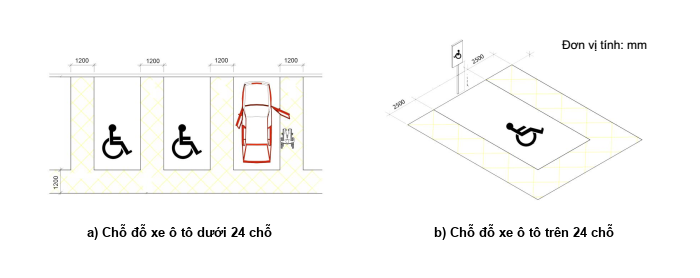

<strong>Hình 1 — Minh họa chỗ đỗ xe cho người khuyết tật</strong>

<em>Đơn vị tính: mm</em>

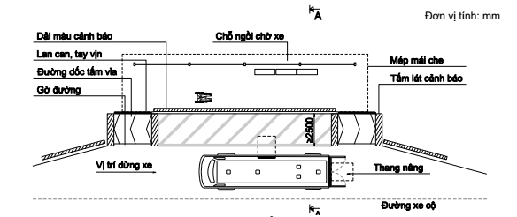

<strong>Hình 2 — Minh họa điểm dừng chờ xe</strong>

<em>Đơn vị tính: mm</em>

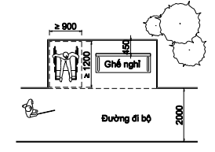

<strong>Hình 3 — Minh họa chỗ ngồi chờ cho người gặp khó khăn khi tiếp cận tại các điểm dừng chờ xe</strong>

### 2.2  Đường, lối vào công trình

### 2.2.1  Trong một khuôn viên, công trình hoặc một hạng mục công trình, ít nhất phải có một đường, lối vào công trình đảm bảo tiếp cận sử dụng. Và phải có biển báo, biển chỉ dẫn để có thể nhận biết.

### 2.2.2  Đường, lối vào công trình đảm bảo tiếp cận sử dụng phải bằng phẳng, không trơn trượt và phải bố trí đường dốc khi có sự thay đổi cao độ.

### 2.2.3  Khi thiết kế đường dốc phải tuân theo các quy định sau (xem Hình 4):

&nbsp;&nbsp;\- Độ dốc: không lớn hơn 1/12;

&nbsp;&nbsp;\- Chiều rộng thông thủy đường dốc: không nhỏ hơn 1 200 mm;

&nbsp;&nbsp;\- Chiều dài đường dốc: không lớn hơn 9 000 mm; khi lớn hơn 9 000 mm phải bố trí chiếu nghỉ;

&nbsp;&nbsp;\- Chiều dài chiếu nghỉ: không nhỏ hơn 1 400 mm;

&nbsp;&nbsp;\- Tại điểm bắt đầu và kết thúc đường dốc phải có không gian có kích thước không nhỏ hơn 1 400 mm x 1 400 mm để xe lăn có thể di chuyển được;

&nbsp;&nbsp;\- Bề mặt đường dốc phải cứng, không được ghồ ghề và không trơn trượt.

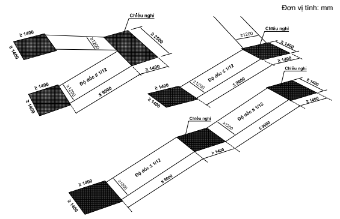

<strong>Hình 4 — Minh họa về kích thước tối thiểu của đường dốc đảm bảo tiếp cận</strong>

### 2.2.4  Hai bên đường dốc phải bố trí lan can, tay vịn liên tục. Nếu một bên đường dốc có khoảng trống thì phía chân lan can, tay vịn phải bố trí gờ an toàn hoặc bố trí rào chắn (xem Hình 5; 6).

&nbsp;&nbsp;\- Tay vịn phải được lắp đặt ở độ cao 900 mm so với mặt sàn/nền hoàn thiện. Nếu bố trí tay vịn hai tầng thì tay vịn phía dưới phải lắp đặt ở độ cao 700 mm so với mặt sàn/nền hoàn thiện.

&nbsp;&nbsp;\- Ở điểm đầu và điểm cuối đường dốc, tay vịn phải được kéo dài thêm một đoạn, chiều dài không nhỏ hơn 300 mm (xem Hình 5). Khoảng cách giữa tay vịn và bức tường gắn không nhỏ hơn 40 mm (xem Hình 7).

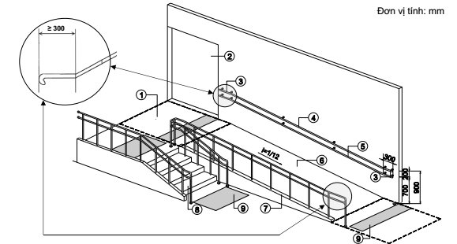

**CHÚ DẪN:**

| 1. Khoảng không gian thông thủy trước lối vào (kích thước tối thiểu 1400 x 1400 mm); 2. Lối vào công trình; 3. Tay vịn kéo dài ở điểm đầu và cuối đường dốc; 4. Tay vịn ở độ cao 900 mm; 5. Tay vịn ở độ cao 700 mm; | 6. Đường dốc có độ dốc tối đa 1/12, chiều rộng thông thủy tối thiểu 1200 mm; 7. Gờ an toàn; 8. Bậc tiếp cận lối vào công trình; 9. Tấm lát cảnh báo. |
| :--- | :--- |

<strong>Hình 5 — Minh họa về đường dốc, bậc cấp, lan can, tay vịn tiếp cận lối vào công trình</strong>

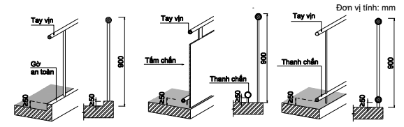

<strong>Hình 6 — Một số kiểu lan can tay vịn có gờ an toàn, rào chắn</strong>

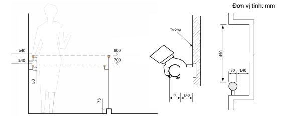

<strong>Hình 7 — Minh họa về tay vịn trợ giúp người khó khăn khi tiếp cận</strong>

### 2.2.5  Đối với lối vào có bố trí bậc tiếp cận phải tuân theo các quy định sau:

&nbsp;&nbsp;\- Chiều cao bậc: không lớn hơn 150 mm;

&nbsp;&nbsp;\- Bề rộng mặt bậc: không nhỏ hơn 300 mm;

&nbsp;&nbsp;\- Không dùng bậc thang hở; không làm mũi bậc;

&nbsp;&nbsp;\- Khi bố trí nhiều hơn 3 bậc thì phải bố trí lắp đặt tay vịn hai bên tuân theo quy định tại 2.2.4. (xem Hình 5).

### 2.2.6  Trường hợp có cửa trên lối vào cho người gặp khó khăn khi tiếp cận thì không được làm ngưỡng cửa và không sử dụng cửa quay.

### 2.2.7  Tại lối vào phải lắp đặt biển báo, có hệ thống thông báo bằng âm thanh và tấm lát có dấu hiệu chỉ hướng tiếp cận đến thang máy và các dịch vụ dành cho người gặp khó khăn khi tiếp cận.

### 2.2.8  Đối với những công trình do yêu cầu bảo tồn hoặc công trình có lối vào công trình không đảm bảo tiếp cận và không đủ điều kiện bố trí đường dốc, thì phải bố trí các thiết bị hỗ trợ di động (thang nâng hoặc đường dốc di động) (xem Hình 8).

<em>Đơn vị tính: mm</em>

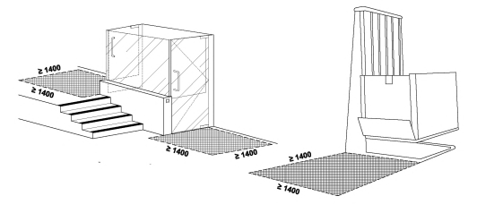

<strong>Hình 8 — Minh họa về thang nâng trợ giúp người gặp khó khăn khi di chuyển</strong>

### 2.3  Cửa

### 2.3.1  Chiều rộng thông thủy của cửa ra vào công trình không nhỏ hơn 900 mm. Đối với cửa ra vào các phòng chức năng bên trong công trình không nhỏ hơn 800 mm.

### 2.3.2  Khoảng không gian thông thủy ở phía trước và phía sau cửa đi không nhỏ hơn 1 400 mm x 1 400 mm.

### 2.4  Thang máy

### 2.4.1  Kích thước thông thủy của cửa thang máy sau khi mở không nhỏ hơn 900 mm. Kích thước thông thủy mặt bằng bên trong buồng thang máy không nhỏ hơn 1 100 mm x 1 400 mm.

### 2.4.2  Không gian đợi trước cửa thang máy có kích thước không nhỏ hơn 1 400 mm x 1 400 mm và phải đảm bảo bằng phẳng, không có các gờ bậc, không chênh lệch cao độ.

### 2.4.3  Cửa thang máy phải được lắp đặt thiết bị tự đóng mở. Thời gian đóng mở phải lớn hơn 20 s để đảm bảo an toàn cho người gặp khó khăn khi tiếp cận. Trong thang máy phải bố trí tay vịn tuân theo quy định tại 2.2.4.

### 2.4.4  Bảng điều khiển trong buồng thang máy được lắp đặt ở độ cao không lớn hơn 1 200 mm và không thấp hơn 900 mm tính từ mặt sàn thang máy đến tâm nút điều khiển cao nhất. Trên các nút điều khiển phải có các ký tự với màu sắc tương phản hoặc tín hiệu cảm nhận được và hệ thống chữ nổi Braille.

### 2.4.5  Biển báo hiển thị số tầng tương ứng với vị trí thang được bật sáng hoặc có hệ thống thông báo bằng âm thanh bên ngoài và bên trong thang máy. Cạnh cửa ra thang máy tại mỗi tầng phải bố trí chữ nổi Braille.

### 2.5  Các không gian công cộng trong công trình

### 2.5.1  Nơi đón tiếp/giao tiếp

### 2.5.1.1  Tại các khu vực như nơi ngồi chờ, chỗ xếp hàng để làm thủ tục đăng ký hay thanh toán, quầy bán hàng, nơi đổi tiền, rút tiền, trạm điện thoại công cộng, khu vực vui chơi giải trí, dịch vụ ăn uống hoặc tại các bề mặt làm việc trong các công trình công cộng phải đảm bảo tiếp cận sử dụng.

### 2.5.1.2  Phải có ít nhất một nơi đón tiếp/giao tiếp dành cho người gặp khó khăn khi tiếp cận ứng với mỗi một loại dịch vụ. Và phải bố trí các biển báo, bảng chỉ dẫn bằng các ký hiệu, biểu tượng hoặc có hệ thống thông báo bằng âm thanh theo quy ước quốc tế.

### 2.5.1.3  Khi bố trí bàn/quầy đón tiếp/giao tiếp thì phải có khoảng trống để chân phía dưới mặt bàn/quầy để người đi xe lăn có thể tiếp cận được. Kích thước bàn/quầy đón tiếp/giao tiếp phải tuân theo các quy định sau (xem Hình 9):

&nbsp;&nbsp;\- Chiều cao từ mặt sàn/nền hoàn thiện đến mặt bàn/quầy: không lớn hơn 800 mm;

&nbsp;&nbsp;\- Chiều cao thông thủy khoảng trống phía dưới mặt bàn/quầy: không nhỏ hơn 650 mm;

&nbsp;&nbsp;\- Chiều sâu khoảng trống để chân: không nhỏ hơn 450 mm.

<em>Đơn vị tính: mm</em>

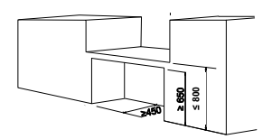

<strong>Hình 9 — Minh họa về kích thước bàn/quầy đón tiếp cho người gặp khó khăn khi tiếp cận</strong>

### 2.5.2  Chỗ ngồi

### 2.5.2.1  Trong các công trình có phòng khán giả, phòng học, phòng họp, phòng chờ, cửa hàng, sân vận động phải bố trí chỗ ngồi thuận tiện cho người đi xe lăn (xem Hình 9).

### 2.5.2.2  Vị trí chỗ ngồi dành cho người đi xe lăn phải ở gần lối ra vào, đảm bảo thuận tiện và dễ dàng thoát người khi có sự cố (xem Hình 10).

### 2.5.2.3  Kích thước thông thủy không gian tối thiểu cho một vị trí xe lăn: 900 mm x 1 200 mm. (Xem hình 10)

### 2.5.2.4  Số lượng chỗ dành tối thiểu cho người đi xe lăn phải tuân theo quy định trong Bảng 2.

### Bảng 2 - Số chỗ dành cho người đi xe lăn

<em>Đơn vị tính: Chỗ</em>

| Quy mô chỗ ngồi | Số lượng chỗ tối thiểu dành cho người đi xe lăn |
| :--- | :--- |
| 1. Dưới 30 | 1 |
| 2. Từ 31 đến 50 | 2 |
| 3. Từ 51 đến 100 | 3 |
| 4. Từ 101 đến 300 | 5 |
| 5. Từ 301 đến 600 | 6 |
| 6. Trên 600 | 6 + 1 cho mỗi một lần thêm 200 chỗ ngồi |

<em>Đơn vị tính: mm</em>

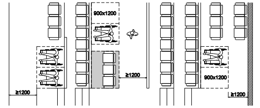

<strong>Hình 10 — Minh họa về kích thước, vị trí chỗ ngồi cho người đi xe lăn</strong>

### 2.5.3  Phòng khám và phòng chăm sóc bệnh nhân trong các cơ sở khám, chữa bệnh

### 2.5.3.1  Các phòng khám và phòng chăm sóc bệnh nhân trong các cơ sở khám, chữa bệnh phải đáp ứng có số phòng đảm bảo tiếp cận sử dụng tuân thủ theo các quy định sau:

&nbsp;&nbsp;\- Bệnh viện, trung tâm y tế, phòng khám đa khoa: 10 % tổng số phòng bệnh, phòng khám;

&nbsp;&nbsp;\- Trung tâm chỉnh hình và phục hồi chức năng: 100 % số phòng lưu, phòng khám;

&nbsp;&nbsp;\- Trung tâm điều dưỡng: 50 % số buồng phòng.

### 2.5.3.2  Trong phòng khám và phòng chăm sóc bệnh nhân phải dành khoảng không gian có kích thước tối thiểu 1 400 mm x 1 400 mm để di chuyển xe lăn.

### 2.5.3.3  Phải bố trí tay vịn dọc theo hai bên hành lang, lối đi tới phòng khám và phòng chăm sóc bệnh nhân. Chiều cao lắp đặt tay vịn tuân theo quy định tại 2.2.4.

### 2.5.4  Buồng phòng trong khách sạn, nhà nghỉ

### 2.5.4.1  Đối với khách sạn, nhà nghỉ dưới 100 phòng phải có ít nhất 5 % số phòng đảm bảo tiếp cận sử dụng. Nếu có trên 100 phòng, thì cứ có thêm 50 phòng thì phải có thêm 01 phòng đảm bảo tiếp cận sử dụng.

**CHÚ THÍCH:** Trường hợp 5% số phòng nhỏ hơn 1 thì số phòng đảm bảo tiếp cận sử dụng tối thiểu là 01 phòng.

### 2.5.4.2  Trong phòng ngủ dành cho người đi xe lăn phải dành khoảng không gian có kích thước tối thiểu 1 400 mm x 1 400 mm về một phía của giường ngủ để di chuyển xe lăn.

### 2.5.4.3  Đối với công trình không có thang máy, các phòng dành cho người gặp khó khăn khi tiếp cận phải bố trí ở dưới tầng trệt (tầng 1).

### 2.5.5  Khu vệ sinh

### 2.5.5.1  Trong các công trình công cộng, phải có tối thiểu 01 phòng vệ sinh đảm bảo tiếp cận sử dụng và không nhỏ hơn 5 % tổng số phòng vệ sinh.

**CHÚ THÍCH:** Phòng vệ sinh đảm bảo tiếp cận sử dụng dùng cho tất cả các đối tượng đã nêu tại 1.1.1 và không phân biệt giới tính.

### 2.5.5.2  Đối với khu vệ sinh chung, bố trí tối thiểu cứ 6 tiểu treo phải có 1 tiểu dành cho người gặp khó khăn khi tiếp cận. Có thể bố trí phòng/buồng vệ sinh đảm bảo tiếp cận sử dụng khi trong khu vệ sinh chung có đủ không gian diện tích đảm bảo theo quy định tại quy chuẩn này.

### 2.5.5.3  Trong các khu vệ sinh, nếu thiết kế có khu vực thay tã/bỉm cho trẻ sơ sinh, phải nghiên cứu bố trí sao cho phù hợp, tránh ảnh hưởng tới các không gian sử dụng khác.

### 2.5.5.4  Trong phòng/buồng vệ sinh đảm bảo tiếp cận sử dụng, khu vực đặt bệ xí (bồn cầu) phải có khoảng không gian thông thủy tối thiểu 1 400 mm x 1 400 mm để di chuyển xe lăn (xem Hình 11).

<em>Đơn vị tính: mm</em>

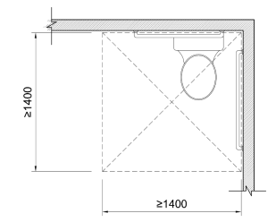

<strong>Hình 11 — Minh họa về kích thước không gian khu vực đặt bệ xí (bồn cầu) đảm bảo tiếp cận sử dụng</strong>

### 2.5.5.5  Chiều rộng thông thủy của cửa phòng vệ sinh không nhỏ hơn 800 mm và phải tuân theo các quy định sau:

&nbsp;&nbsp;\- Cửa mở ra ngoài không được cản trở lối thoát hiểm;

&nbsp;&nbsp;\- Cửa mở vào trong, không được ảnh hưởng đến khoảng không gian yêu cầu tối thiểu của khu vực đặt bệ xí (bồn cầu) (xem Hình 12).

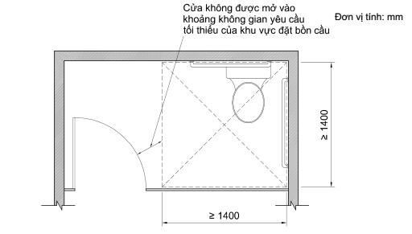

<strong>Hình 12 — Minh họa về cửa khi mở vào trong của phòng vệ sinh đảm bảo tiếp cận sử dụng</strong>

### 2.5.5.6  Chiều cao lắp đặt thiết bị vệ sinh dành cho người gặp khó khăn khi tiếp cận tính từ mặt sàn/nền hoàn thiện phải tuân theo các quy định sau:

&nbsp;&nbsp;\- Bệ xí (bồn cầu): không lớn hơn 450 mm (xem Hình 13a);

&nbsp;&nbsp;\- Tiểu treo: không lớn hơn 400 mm (xem Hình 13b);

&nbsp;&nbsp;\- Chậu rửa: không lớn hơn 750 mm (xem Hình 13c).

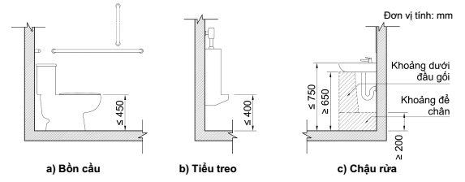

<strong>Hình 13 — Minh họa về chiều cao lắp đặt thiết bị vệ sinh cho người gặp khó khăn khi tiếp cận</strong>

### 2.5.5.7  Chiều cao lắp đặt tay vịn trong khu vực lắp đặt bệ xí (bồn cầu) tính từ mặt sàn/nền hoàn thiện không lớn hơn 900 mm đối với tay vịn nằm ngang. Trường hợp thiết kế lắp đặt tay vịn đứng thì điểm thấp nhất của tay vịn không lớn hơn 950 mm (xem Hình 14a).

&nbsp;&nbsp;\- Khu vực tiểu treo: điểm thấp nhất của tay vịn không lớn hơn 800 mm (xem Hình 14b).

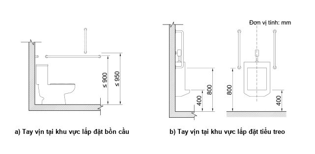

<strong>Hình 14 — Minh họa về chiều cao lắp đặt tay vịn trong phòng vệ sinh đảm bảo tiếp cận sử dụng</strong>

### 2.5.5.8  Bề mặt sàn khu vệ sinh không được trơn trượt.

### 2.5.5.9  Trong phòng vệ sinh đảm bảo tiếp cận sử dụng phải bố trí lắp đặt hệ thống chuông báo khẩn cấp, trợ giúp cho người gặp khó khăn khi tiếp cận trong trường hợp gặp sự cố. Chiều cao lắp đặt nút bấm chuông báo khẩn cấp tính từ mặt sàn/nền hoàn thiện không lớn hơn 400 mm.

### 2.5.5.10  Khu vệ sinh dành cho người gặp khó khăn khi tiếp cận phải có biển báo, biển chỉ dẫn và có hệ thống thông báo bằng âm thanh theo quy ước quốc tế.

### 2.6  Thoát nạn

### 2.6.1  Hệ thống báo động

### 2.6.1.1  Hệ thống báo động dùng để thông báo và chỉ dẫn về các khu vực chờ cứu hộ và lối thoát hiểm phải bằng cả âm thanh và hình ảnh, có đèn hiệu nhấp nháy để sử dụng trong trường hợp khẩn cấp.

### 2.6.1.2  Hệ thống báo động phải được bố trí tại các khu vực như phòng ở, phòng họp, phòng khán giả, lối đi, sảnh, hành lang và các không gian sử dụng công cộng khác.

### 2.6.1.3  Khi sử dụng thông báo bằng loa phải đảm bảo cường độ âm thanh lớn hơn độ ồn tối thiểu +5 dB. Cường độ âm thanh chuông báo khẩn cấp phải cao hơn cường độ âm thanh môi trường tối thiểu +15 dB nhưng không vượt quá 120 dB.

### 2.6.2  Lối thoát nạn

### 2.6.2.1  Phải bố trí vùng an toàn cho người gặp khó khăn khi tiếp cận tuân thủ quy định tại QCVN 06:2022/BXD. Vùng an toàn phải gắn trực tiếp với cầu thang thoát nạn và phải có biển báo, biển chỉ dẫn và hệ thống liên lạc hai chiều bằng cả hình ảnh và âm thanh.

### 2.6.2.2  Lối thoát nạn dẫn đến cầu thang thoát nạn phải tuân thủ quy định tại QCVN 06:2022/BXD.

### 2.7  Đường và hè phố

### 2.7.1  Tại các nơi giao cắt khác cao độ như các lối sang đường, lối lên xuống hè phố phải làm đường dốc, vệt dốc tuân theo quy định tại 2.2.3 (xem Hình 15).

### 2.7.2  Tại nơi giao giữa lối đi bộ và đường dành cho các phương tiện giao thông, lối sang đường dành cho người đi bộ hoặc tại lối vào công trình phải bố trí tấm lát cảnh báo giao cắt. Lối đi bộ sang đường phải đảm bảo không có sự thay đổi cao độ (xem Hình 16).

### 2.7.3  Các tiện nghi trên đường phố như: “điểm chờ xe buýt, ghế nghỉ, cột điện, đèn đường, cọc tiêu, biển báo, trạm điện thoại công cộng, hòm thư, trạm rút tiền tự động, bồn hoa, cây xanh, thùng rác công cộng” không được gây cản trở cho người gặp khó khăn khi tiếp cận và được cảnh báo bằng các tấm lát nổi và đánh dấu bằng các màu sắc tương phản để người khuyết tật nhìn có thể nhận biết.

<em>Đơn vị tính: mm</em>

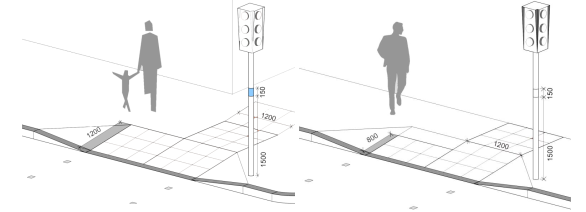

<strong>Hình 15 — Minh họa về lối lên xuống vỉa hè</strong>

### 2.7.4  Các chướng ngại vật đứng độc lập như: “biển quảng cáo, thùng thư, điện thoại công cộng” phải được bố trí bên ngoài phần đường dành cho người đi bộ. Cạnh dưới cách mặt đất không lớn hơn 600 mm, độ nhô ra tối đa là 100 mm và chiều cao thông thủy trên lối đi là 2 000 mm để người khuyết tật nhìn tránh bị va đập (xem Hình 17).

<em>Đơn vị tính: mm</em>

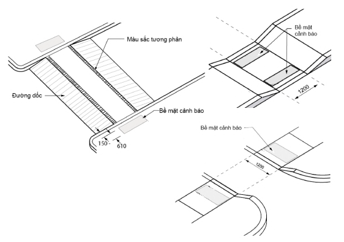

<strong>Hình 16 — Minh họa về lối đi bộ qua đường</strong>

<em>Đơn vị tính: mm</em>

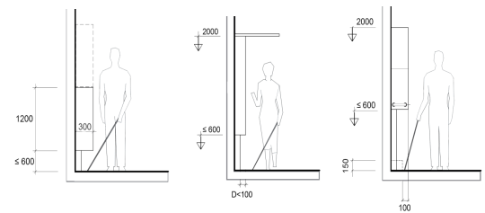

<strong>Hình 17 — Minh họa về kích thước lắp đặt các vật cản trên lối đi an toàn cho người khuyết tật nhìn</strong>

### 2.7.5  Đối với cây xanh nằm trên lối đi, phải có giải pháp cảnh báo cho người khuyết tật nhìn bằng các biện pháp thay đổi bề mặt vật liệu lát nền xung quanh khu vực trồng cây, làm gờ nổi cao tối thiểu 100 mm hoặc rào chắn xung quanh ô trồng cây. Cắt tỉa các cành cây thấp hơn 2 000 mm (xem Hình 18a).

### 2.7.6  Mép ngoài của đường đi bộ và đường đi xung quanh ao, hồ trong công viên phải có dấu hiệu cảnh báo hoặc gờ chắn cao tối thiểu 150 mm để đảm bảo an toàn cho người khuyết tật nhìn (xem Hình 18b).

<em>Đơn vị tính: mm</em>

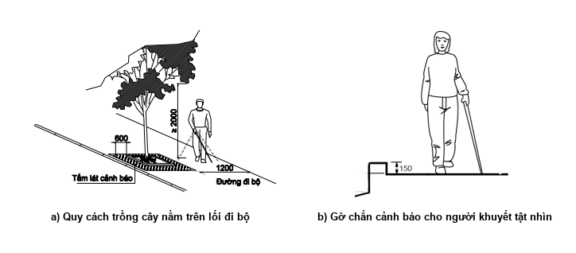

<strong>Hình 18 — Minh họa về bố trí các cảnh báo an toàn cho người khuyết tật nhìn trên đường đi bộ</strong>

### 2.7.7  Đối với công trình đang thi công xây dựng mới, cải tạo, sửa chữa nằm kề cận với đường dành cho người đi bộ phải có rào chắn bảo vệ cao từ 1 000 mm đến 1 200 mm, được dựng chắc chắn để không bị đổ khi va đập vào và phải được chiếu sáng đầy đủ vào ban đêm. Giàn giáo và các biện pháp bảo vệ phải không gây nguy hiểm cho người khuyết tật nhìn.

### 2.7.8  Đối với cầu vượt và đường hầm có phần đường dành cho người đi bộ nếu có từ 3 bậc trở lên phải tuân theo các quy định sau (xem Hình 19):

&nbsp;&nbsp;\- Chiều cao bậc không lớn hơn 150 mm, chiều rộng mặt bậc không nhỏ hơn 300 mm;

&nbsp;&nbsp;\- Mỗi đoạn có tối đa 18 bậc. Nếu có nhiều hơn 18 bậc phải bố trí chiếu nghỉ;

&nbsp;&nbsp;\- Chiều rộng mặt chiếu nghỉ không nhỏ hơn 1 400 mm;

&nbsp;&nbsp;\- Hai bên đường đi có bậc phải bố trí tay vịn tuân theo quy định tại 2.2.4.

<em>Đơn vị tính: mm</em>

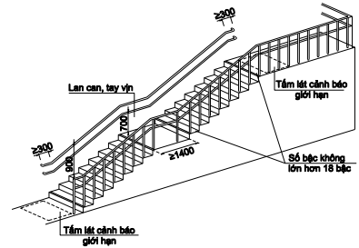

<strong>Hình 19 — Minh họa về bậc lên xuống tại cầu vượt và hầm dành cho người đi bộ</strong>

### 2.7.9  Lối ra vào cầu vượt và đường hầm có phần đường dành cho người đi bộ nếu có sự thay đổi độ cao đột ngột phải có đường dốc tuân theo quy định tại 2.2.3.

### 2.7.10  Bề mặt phần đường dành cho người đi bộ trên cầu vượt và trong đường hầm không được trơn trượt.

### 2.7.11  Tại điểm bắt đầu và kết thúc cầu vượt và đường dốc trong đường hầm phải có biện pháp để cảnh báo người khuyết tật nhìn bằng các tấm lát nổi cảnh báo giới hạn hoặc đánh dấu bằng các màu sắc tương phản.

### 2.7.12  Tại các nơi giao của đường dành cho các phương tiện giao thông, lối vào đường hầm và vị trí lên xuống cầu vượt cần phải có tín hiệu đèn giao thông, biển báo, biển chỉ dẫn và có thêm các tín hiệu bằng âm thanh hoặc chữ nổi Braille để chỉ dẫn người khuyết tật nhìn nhận biết khi qua đường.

### 2.8  Dấu hiệu cảnh báo có thể nhận biết

### 2.8.1  Dấu hiệu cảnh báo có thể nhận biết bao gồm các tấm lát nổi hoặc các vạch dấu có màu sắc tương phản.

### 2.8.2  Vị trí lắp đặt các tấm lát nổi phải tuân theo các quy định sau:

&nbsp;&nbsp;\- Tấm lát cảnh báo giao cắt được bố trí tại nơi giao cắt giữa lối đi bộ và đường dành cho các phương tiện giao thông;

&nbsp;&nbsp;\- Tấm lát cảnh báo giới hạn được bố trí tại điểm đầu và điểm cuối của cầu thang; điểm đầu và điểm cuối đường dốc, nơi có các vật cản; lối đi bộ sang đường;

&nbsp;&nbsp;\- Tấm lát dẫn hướng được dùng để hướng dẫn người khuyết tật nhìn đến các khu vực quầy lễ tân, quầy bán vé, cửa kiểm soát vé, nơi rút tiền và tránh các vật cản khi di chuyển tại những nơi không có thông tin hoặc các chỉ dẫn khác;

&nbsp;&nbsp;\- Tấm lát định vị được bố trí ở phía trước trạm điện thoại, hòm thư, quầy lễ tân, quầy bán vé, bảng thông tin (bằng chữ nổi hoặc âm thanh), máy rút tiền tự động, khu vệ sinh, phòng chờ và trước lối vào các công trình.

### 2.9  Biển báo, biển chỉ dẫn

### 2.9.1  Chữ và ký hiệu trên biểu tượng quy ước phải tương phản với màu nền. Không dùng chất liệu nền nhẵn bóng, phản quang mạnh để người đọc không bị lóa.

### 2.9.2  Biển báo, biển chỉ dẫn hoặc các dấu hiệu cảnh báo có thể nhận biết phải sử dụng các ký hiệu, biểu tượng và chữ nổi Braille phải phù hợp với quy ước quốc tế (xem Phụ lục A).

## 3  TỔ CHỨC THỰC HIỆN

### 3.1  Quy định chuyển tiếp

### 3.1.1  Dự án đầu tư xây dựng được quyết định chủ trương đầu tư; Báo cáo nghiên cứu khả thi đầu tư xây dựng trình cơ quan chuyên môn về xây dựng thẩm định kể từ thời điểm quy chuẩn này có hiệu lực thì phải tuân thủ các quy định của quy chuẩn này.

### 3.1.2  Dự án đầu tư xây dựng đã được quyết định chủ trương đầu tư; Báo cáo nghiên cứu khả thi đầu tư xây dựng đã được cơ quan chuyên môn về xây dựng thông báo kết quả thẩm định hoặc Báo cáo nghiên cứu khả thi đầu tư xây dựng đã trình cơ quan chuyên môn về xây dựng thẩm định (gồm cả trường hợp thẩm định điều chỉnh) trước ngày quy chuẩn này có hiệu lực thi hành thì được tiếp tục thực hiện theo quy định của QCVN 10:2014/BXD.

### 3.1.3  Đối với Báo cáo nghiên cứu khả thi đầu tư xây dựng đã được cơ quan chuyên môn về xây dựng thông báo kết quả thẩm định một số công trình thuộc dự án theo quy định trước ngày quy chuẩn này có hiệu lực thi hành, khi chủ đầu tư triển khai thực hiện đối với các công trình còn lại của dự án tại thời điểm quy chuẩn này có hiệu lực, chủ đầu tư được lựa chọn tiếp tục thực hiện theo quy định của QCVN 10:2014/BXD hoặc tuân thủ quy định của quy chuẩn này.

### 3.2  Bộ Xây dựng chịu trách nhiệm tổ chức phổ biến, hướng dẫn áp dụng quy chuẩn này cho các đối tượng có liên quan.

### 3.3  Các cơ quan quản lý nhà nước về xây dựng ở trung ương và địa phương có trách nhiệm tổ chức kiểm tra sự tuân thủ quy chuẩn này trong lập, thẩm định, phê duyệt và quản lý xây dựng nhà và công trình trên địa bàn theo quy định của pháp luật.

### 3.4  Trong quá trình triển khai thực hiện quy chuẩn này, nếu có vướng mắc, mọi ý kiến gửi về Vụ Khoa học công nghệ và môi trường - Bộ Xây dựng để được hướng dẫn, xử lý.

---

## 📑 DANH MỤC PHỤ LỤC KỸ THUẬT CHUYÊN ĐỀ (MODULAR ANNEXES)

Toàn bộ 2 Phụ lục kỹ thuật chuyên đề đã được module hóa thành các tệp độc lập nhằm tối ưu hóa tra cứu và thẩm tra thiết kế (ADR 0021 & ADR 0030):

| Ký hiệu | Tên Phụ Lục | Tính chất | Liên kết Tập tin |
| :---: | :--- | :---: | :---: |
| **Phụ lục A** | Một số biểu tượng quy ước hỗ trợ người gặp khó khăn khi tiếp cận | Quy định | [📑 **Xem Phụ lục**](annexes/phu_luc_a_mot_so_bieu_tuong_quy_uoc_ho_tro_nguoi_gap_kh.md#phu-luc-a) |
| **Phụ lục B** | Đặc điểm kỹ thuật của các tấm lát nổi trợ giúp cho người khiếm thị | Quy định | [📑 **Xem Phụ lục**](annexes/phu_luc_b_dac_diem_ky_thuat_cua_cac_tam_lat_noi_tro_giu.md#phu-luc-b) |

---

## 📊 HỆ THỐNG TRA CỨU BẢNG & SƠ ĐỒ KỸ THUẬT

- **Tra cứu 2 Bảng Số Liệu:** Tra cứu chi tiết dạng CSV/JSON tại [Thư mục Bảng Số Liệu](tables/README.md).
- **Tra cứu Sơ Đồ Hình Vẽ:** Tra cứu ảnh nét cao và đặc tả phân vùng tại [Danh Mục Sơ Đồ Khí Động](figures/figures_catalog.yaml).
