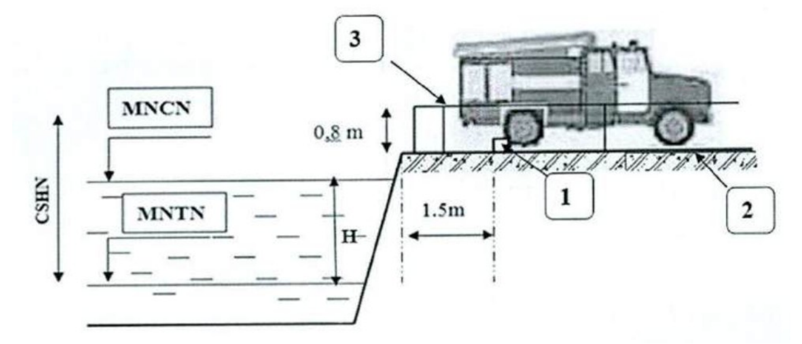
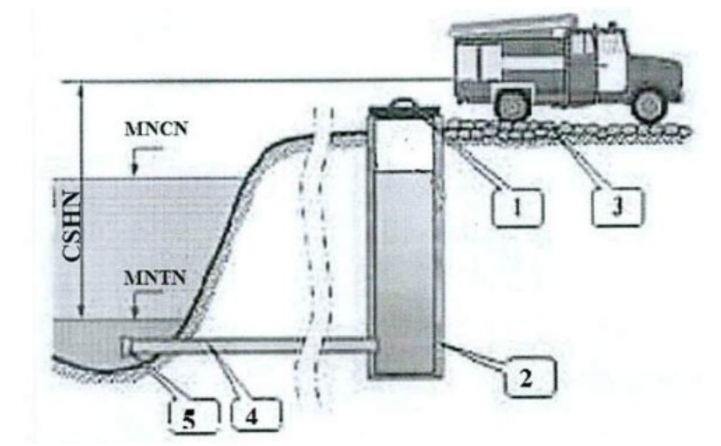

## PHỤ LỤC H (Quy định) Yêu cầu về thiết kế, lắp đặt hệ thống

## H. 1 Yêu cầu thiết kế, lắp đặt hệ thống cấp nước chữa cháy ngoài nhà

### H.1.1  Áp suất của hệ thống cấp nước chữa cháy ngoài nhà

### H.1.1.1  Hệ thống đường ống cấp nước chữa cháy có thể là đường ống áp suất cao hoặc áp suất thấp. Trong đường ống cấp nước chữa cháy có áp suất cao thì áp suất cần thiết để chữa cháy là do máy bơm chữa cháy cố định tạo nên; khi duy trì áp suất cao thì phải tính toán bảo đảm áp suất làm việc của hệ thống đường ống. Đối với đường ống áp suất cao, các máy bơm chữa cháy phải bảo đảm hoạt động không trễ hơn 5 phút sau khi có tín hiệu báo cháy.

### H.1.1.2  Áp suất tự do tối thiểu trong đường ống nước chữa cháy áp suất thấp (đo ở vị trí cao độ bằng với mặt đất) khi chữa cháy phải không nhỏ hơn 10 m cột nước. Áp suất tự do tối thiểu trong mạng đường ống chữa cháy áp suất cao phải bảo đảm độ cao tia nước đặc không nhỏ hơn 10 m cột nước khi lưu lượng yêu cầu chữa cháy tối đa và lăng chữa cháy ở điểm cao nhất của nhà. Áp suất tự do trong mạng đường ống kết hợp sinh hoạt hoặc sản xuất không nhỏ hơn 10 m cột nước và không lớn hơn 60 m cột nước. Để phù hợp với điều kiện kinh tế - kỹ thuật, được phép lựa chọn thiết kế, trang bị hệ thống áp suất thấp hoặc hệ thống áp suất cao.

### H.1.2  Lưu lượng nước cho chữa cháy ngoài nhà

**CHÚ THÍCH 1:** Khi tính toán lưu lượng nước chữa cháy cho 2 đám cháy thì lấy giá trị bằng cho 2 nhà có yêu cầu lưu lượng lớn nhất.

**CHÚ THÍCH 3:** Lưu lượng nước cho chữa cháy ngoài nhà cho nhà phục vụ nông nghiệp và phát triển nông thôn có bậc chịu lửa I, II với khối tích không lớn hơn 5 000 m[3] hạng nguy hiểm cháy D, E lấy bảng 5 L/s.

**CHÚ THÍCH 6:** Lưu lượng nước cho chữa cháy ngoài nhà cho nhà và khu vực kho lạnh bảo quản thực phẩm thì lấy giống nhà có hạng nguy hiểm cháy C.

**CHÚ THÍCH 7:** Lưu lượng nước cho chữa cháy ngoài nhà cho cơ sở lưu trữ công-ten-nơ có hàng hóa phụ thuộc vào số lượng công-ten-nơ, được lấy như sau:

&nbsp;&nbsp;\- Từ 30 đến 50 công-ten-nơ: lấy 15 L/s;

&nbsp;&nbsp;\- Từ 51 đến 100 công-ten-nơ: lấy 20 L/s;

&nbsp;&nbsp;\- Từ 101 đến 300 công-ten-nơ: lấy 25 L/s;

&nbsp;&nbsp;\- Từ 301 đến 1 000 công-ten-nơ: lấy 40 L/s;

&nbsp;&nbsp;\- Từ 1 001 đến 1 500 công-ten-nơ: lấy 60 L/s;

&nbsp;&nbsp;\- Từ 1 501 đến 2 000 công-ten-nơ: lấy 80 L/s;

&nbsp;&nbsp;\- Nhiều hơn 2 000 công-ten-nơ: lấy 100 L/s;

**CHÚ THÍCH 8:** Lưu lượng nước cho chữa cháy ngoài nhà cho nhà kho cố định chứa vật liệu nổ, tiền chất thuốc nổ công nghiệp, vũ khí, công cụ hỗ trợ; hầm giao thông đường bộ; trạm biến áp; được lấy tối thiểu 10 L/s;

### Bảng H.1 - Lưu lượng nước từ mạng đường ống cho chữa cháy ngoài nhà trong các khu dân cư

| Dân số, x 1 000 người | Số đám cháy đồng thời | Lưu lượng nước cho 1 đám cháy — Nhà không quá 2 tầng (L/s) | Lưu lượng nước cho 1 đám cháy — Nhà từ 3 tầng trở lên (L/s) |
| :--- | :--- | :--- | :--- |
| < 1 | 1 | 5 | 10 |
| > 1 và ≤ 5 | 1 | 10 | 10 |
| > 5 và ≤ 10 | 1 | 10 | 15 |
| > 10 và ≤ 25 | 2 | 10 | 15 |
| > 25 và ≤ 50 | 2 | 20 | 25 |
| > 50 và ≤ 100 | 2 | 25 | 35 |
| > 100 và ≤ 200 | 3 | 40 | 40 |
| > 200 và ≤ 300 | 3 | 55 |  |
| > 300 và ≤ 400 | 3 | 70 |  |
| > 400 và ≤ 500 | 3 | 80 |  |
| > 500 và ≤ 600 | 3 | 85 |  |
| > 600 và ≤ 700 | 3 | 90 |  |
| > 700 và ≤ 800 | 3 | 95 |  |
| > 800 và ≤ 1 000 | 3 | 100 |  |
| > 1 000 | 5 | 110 |  |

**CHÚ THÍCH 1:** Lưu lượng nước cho chữa cháy ngoài nhà trong khu dân cư phải không nhỏ hơn lưu lượng nước chữa cháy cho nhà theo Bảng H.2.

**CHÚ THÍCH 2:** Khi thực hiện cấp nước theo vùng, lưu lượng nước cho chữa cháy ngoài nhà và số đám cháy đồng thời theo từng vùng được lấy phụ thuộc vào số dân sống trong vùng.

**CHÚ THÍCH 3:** Đối với hệ thống các cụm đường ống nhóm (chung), số đám cháy đồng thời lấy phụ thuộc vào tổng số dân trong các cụm có kết nối với hệ thống đường ống. Lưu lượng nước để hồi phục lượng nước chữa cháy theo cụm đường ống nhóm được xác định bằng tổng lượng nước cho khu dân cư (tương ứng với số đám cháy đồng thời) tối đa để chữa cháy tuân theo quy định tại H.1.3.3 và H.1.3.4.

**CHÚ THÍCH 4:** Số đám cháy tính toán đồng thời trong khu dân cư phải bao gồm cả các đám cháy của nhà sản xuất và nhà kho trong khu dân cư đó. Khi đó lưu lượng nước tính toán bao gồm cả lưu lượng nước để chữa cháy tương ứng cho các nhà đó, nhưng không nhỏ hơn giá trị trong Bảng H.1.

### Bảng H.2 - Lưu lượng nước cho chữa cháy ngoài nhà của nhà thuộc nhóm nguy hiểm cháy theo công năng F1, F2, F3, F4

| Loại nhà | Khối tích ≤ 1 000 m3 (L/s) | Khối tích > 1 và ≤ 5 000 m3 (L/s) | Khối tích > 5 và ≤ 25 000 m3 (L/s) | Khối tích > 25 và ≤ 50 000 m3 (L/s) | Khối tích > 50 000 m3 (L/s) |
| :--- | :--- | :--- | :--- | :--- | :--- |
| 1. Nhà nhóm F1.3, F1.4 có một hoặc nhiều đơn nguyên với số tầng: |  |  |  |  |  |
| ≤ 3 | 10(1) | 10(1) | 15 | 15 | 20 |
| > 3 và ≤ 12 | 10 | 15 | 15 | 20 | 20 |
| > 12 và ≤ 16 | - | 20 | 20 | 25 | 25 |
| > 16 | - | 20 | 25 | 25 | 30 |
| 2. Nhà nhóm F1.1, F1.2, F2, F3 và F4 với số tầng: |  |  |  |  |  |
| ≤ 3 | 10(1) | 10(1) | 15 | 20 | 25 |
| > 3 và ≤ 12 | 10 | 15 | 20 | 25 | 30 |
| > 12 và ≤ 16 | - | 20 | 25 | 30 | 35 |
| > 16 | - | 25 | 30 | 30 | 35 |

*(1) Đối với nhà thuộc khu vực nông thôn lấy lưu lượng nước cho 1 đám cháy là 5 L/s.*

**CHÚ THÍCH:**

&nbsp;&nbsp;\- Nếu hiệu suất của mạng đường ống ngoài nhà không đủ để truyền lưu lượng nước tính toán cho chữa cháy hoặc khi liên kết ống vào với mạng đường ống cụt thì cần phải xem xét lắp đặt bồn, bể với thể tích phải bảo đảm lưu lượng nước cho chữa cháy ngoài nhà trong 3 h.

&nbsp;&nbsp;\- Trong khu dân cư không có đường ống nước chữa cháy thì phải có bồn, bể nước bảo đảm chữa cháy trong 3 h.

### Bảng H.3 - Lưu lượng nước cho chữa cháy ngoài nhà cho nhà nhóm F5 có lỗ mở trên mái không phụ thuộc vào chiều rộng của nhà, cũng như nhà không có lỗ mở trên mái có chiều rộng nhà không lớn hơn 60 m

| Bậc chịu lửa của nhà | Cấp nguy hiểm cháy kết cấu của nhà | Hạng nguy hiểm cháy và cháy nổ của nhà | < 3 000 m3 (L/s) | > 3 và ≤ 5 000 m3 (L/s) | > 5 và ≤ 20 000 m3 (L/s) | > 20 và ≤ 50 000 m3 (L/s) | > 50 và ≤ 200 000 m3 (L/s) | > 200 và ≤ 400 000 m3 (L/s) | > 400 và ≤ 600 000 m3 (L/s) | > 600 000 m3 (L/s) |
| :--- | :--- | :--- | :--- | :--- | :--- | :--- | :--- | :--- | :--- | :--- |
| I và II | S0, S1 | D, E | 10 | 10 | 10 | 10 | 15 | 20 | 25 | 35 |
| I và II | S0, S1 | A, B, C | 10 | 10 | 15 | 20 | 30 | 35 | 40 | 50 |
| III | S0, S1 | D, E | 10 | 10 | 15 | 25 | 35 | 40 | 45 | - |
| III | S0 | A,B,C | 10 | 15 | 20 | 30 | 45 | 60 | 75 | - |
| IV | S0, S1 | D, E | 10 | 15 | 20 | 30 | 40 | 50 | 60 | - |
| IV | S0, S1 | A, B, C | 15 | 20 | 25 | 40 | 60 | 80 | 100 | - |
| IV | S2, S3 | E | 10 | 15 | 20 | 30 | 45 | - | - | - |
| IV | S2, S3 | A, B, C | 15 | 20 | 25 | 40 | 65 | - | - | - |
| V | - | E | 10 | 15 | 20 | 30 | 55 | - | - | - |
| V | - | C | 15 | 20 | 25 | 40 | 70 | - | - | - |

### Bảng H.4 - Lưu lượng nước cho chữa cháy ngoài nhà cho nhà nhóm F5 không có lỗ mở trên mái có chiều rộng nhà trên 60 m

| Bậc chịu lửa của nhà | Cấp nguy hiểm cháy kết cấu của nhà | Hạng nguy hiểm cháy và cháy nổ của nhà | ≤ 50 000 m3 (L/s) | > 50 và ≤ 100 000 m3 (L/s) | > 100 và ≤ 200 000 m3 (L/s) | > 200 và ≤ 300 000 m3 (L/s) | > 300 và ≤ 400 000 m3 (L/s) | > 400 và ≤ 500 000 m3 (L/s) | > 500 và ≤ 600 000 m3 (L/s) | > 600 và ≤ 700 000 m3 (L/s) | > 700 000 m3 (L/s) |
| :--- | :--- | :--- | :--- | :--- | :--- | :--- | :--- | :--- | :--- | :--- | :--- |
| I và II | S0,S1 | A,B,C | 20 | 30 | 40 | 50 | 60 | 70 | 80 | 90 | 100 |
| I và II | S0 | D,E | 10 | 15 | 20 | 25 | 30 | 35 | 40 | 45 | 50 |
| III | S0, S1 | A, B, C | 40 | 50 | 60 | 60 | 70 | 80 | 90 | 100 | 110 |
| III | S0, S1 | D, E | 20 | 35 | 40 | 40 | 45 | 45 | 50 | 50 | 60 |
| IV | S0,S1 | A,B,C | 50 | 60 | 65 | 70 | 80 | 90 | - | - | - |
| IV | S0,S1 | D,E | 35 | 45 | 55 | 60 | 65 | 70 | 75 | 80 | 90 |
| IV | S2, S3 | E | 40 | 50 | 60 | - | - | - | - | - | - |

**CHÚ THÍCH:** Lỗ mở trên mái là các lỗ mở để thông gió hoặc lấy sáng đặt trên kết cấu mái của nhà (nóc gió, cửa trời; lỗ thường xuyên mở; lỗ mở khi có cháy; ô kính; tấm lợp lấy sáng hoặc các lỗ mở tương tự) có diện tích không nhỏ hơn 2,5 % diện tích xây dựng của nhà đó.

### H.1.2.4  Lưu lượng nước cho chữa cháy ngoài nhà cho nhà được ngăn chia bằng tường ngăn cháy thì lấy theo phần của nhà, nơi yêu cầu lưu lượng lớn nhất.

### H.1.2.5  Lưu lượng nước cho chữa cháy ngoài nhà cho nhà được ngăn cách bằng vách ngăn cháy được xác định theo khối tích chung của nhà và theo hạng cao nhất của hạng nguy hiểm cháy và cháy nổ.

### H.1.2.6  Lưu lượng nước chữa cháy phải được bảo đảm ngay cả khi lưu lượng cho các nhu cầu khác là lớn nhất, cụ thể phải tính đến:

&nbsp;&nbsp;\- Nước sinh hoạt;

&nbsp;&nbsp;\- Hộ kinh doanh cá thể;

&nbsp;&nbsp;\- Cơ sở sản xuất công nghiệp và nông nghiệp, nơi mà yêu cầu chất lượng nước uống hoặc mục đích kinh tế không phù hợp để làm đường ống riêng;

&nbsp;&nbsp;\- Trạm xử lý nước, mạng đường ống và kênh dẫn và tương tự;

&nbsp;&nbsp;\- Trong trường hợp điều kiện công nghệ cho phép, có thể sử dụng một phần nước sản xuất để chữa cháy, khi đó cần kết nối trụ nước trên mạng đường ống sản xuất với trụ nước trên mạng đường ống chữa cháy bảo đảm lưu lượng nước chữa cháy cần thiết.

### H.1.2.7  Các hệ thống cấp nước chữa cháy ngoài nhà của cơ sở (đường ống dẫn nước, trạm bơm, bồn, bể dự trữ nước chữa cháy) phải bảo đảm độ tin cậy để không bị ngừng cấp nước quá 10 min và không bị giảm lưu lượng nước quá 30 % lưu lượng nước tính toán trong 3 ngày.

### H.1.3  Số đám cháy tính toán đồng thời

H. 1.3.1 Số đám cháy tính toán đồng thời cho một cơ sở công nghiệp hoặc nông nghiệp phải được lấy theo diện tích của cơ sở đó, cụ thể như sau:

&nbsp;&nbsp;\- Nếu diện tích đến 150 ha lấy là 1 đám cháy;

&nbsp;&nbsp;\- Nếu diện tích trên 150 ha lấy là 2 đám cháy.

Số đám cháy tính toán đồng thời tại một khu vực kho dạng hở hoặc kín chứa vật liệu từ gỗ, lấy như sau: diện tích kho đến 50 ha lấy là 1 đám cháy; diện tích trên 50 ha lấy là 2 đám cháy.

**CHÚ THÍCH:** Diện tích của cơ sở để tính toán cho hệ thống cấp nước chữa cháy ngoài nhà là diện tích khu đất của cơ sở (không bao gồm khu đất rừng, khu đất công viên cây xanh, khu đất trồng cây nông nghiệp hay các khu đất tương tự mà trên đó không có công trình xây dựng).

### H.1.3.2  Khi kết hợp đường ống chữa cháy của khu dân cư và cơ sở công nghiệp nằm ngoài khu dân cư thì số đám cháy tính toán đồng thời tính như sau:

&nbsp;&nbsp;\- Khi diện tích của cơ sở công nghiệp đến 150 ha và dân số của khu dân cư đến 10 000 người, lấy là 1 đám cháy (lấy lưu lượng nước theo bên lớn hơn); tương tự với số dân từ 10 000 đến 25 000 người, lấy là 2 đám cháy (1 đám cháy cho cơ sở công nghiệp và 1 đám cháy cho khu dân cư);

&nbsp;&nbsp;\- Khi diện tích của cơ sở công nghiệp trên 150 ha và số dân đến 25 000 người, lấy là 2 đám cháy (2 đám cháy tính cho khu vực cơ sở công nghiệp hoặc 2 đám cháy tính cho khu dân cư, lấy theo lưu lượng nước yêu cầu của bên lớn hơn);

&nbsp;&nbsp;\- Khi số dân trong khu dân cư lớn hơn 25 000 người, lấy là 2 đám cháy, trong đó lưu lượng nước của 1 đám cháy được xác định bằng tổng của lưu lượng yêu cầu lớn hơn (tính cho cơ sở công nghiệp hoặc khu dân cư) và 50 % lưu lượng yêu cầu nhỏ hơn (tính cho cơ sở công nghiệp hoặc khu dân cư).

### H.1.3.3  Thời gian chữa cháy phải lấy là 3 h, ngoại trừ những quy định dưới đây:

&nbsp;&nbsp;\- Đối với nhà bậc chịu lửa I, II với kết cấu và lớp cách nhiệt làm từ vật liệu không cháy có các khu vực thuộc hạng nguy hiểm cháy D và E lấy là 2 h;

&nbsp;&nbsp;\- Đối với công trình nhà trẻ, trường mẫu giáo, mầm non và cơ sở giáo dục mầm non khác theo quy định của pháp luật về giáo dục, nhà thuộc nhóm nguy hiểm cháy theo công năng F4.1, F4.3 ở khu vực nông thôn, có bậc chịu lửa I, II với kết cấu và lớp cách nhiệt làm từ vật liệu không cháy cao không quá 3 tầng, diện tích xây dựng đến 500 m[2 ] lấy là 1 h;

&nbsp;&nbsp;\- Đối với công trình nhà trẻ, trường mẫu giáo, mầm non và cơ sở giáo dục mầm non khác theo quy định của pháp luật về giáo dục, nhà thuộc nhóm nguy hiểm cháy theo công năng F4.1, F4.3 ở khu vực nông thôn, có bậc chịu lửa I, II với kết cấu và lớp cách nhiệt làm từ vật liệu không cháy cao không quá 3 tầng, diện tích xây dựng đến 500 m[2 ] thì cho phép sử dụng hệ thống họng nước chữa cháy bên trong để thay thế cho hệ thống cấp nước chữa cháy ngoài nhà;

&nbsp;&nbsp;\- Đối với kho dạng hở chứa vật liệu từ gỗ - không nhỏ hơn 5 h;

### H.1.3.4  Thời gian lớn nhất để phục hồi nước dự trữ chữa cháy không lớn hơn:

&nbsp;&nbsp;\- 24 h - đối với khu dân cư trên 5 000 người hoặc cơ sở công nghiệp có các nhà thuộc hạng nguy hiểm cháy và cháy nổ A, B, C;

&nbsp;&nbsp;\- 36 h - đối với cơ sở công nghiệp có các nhà thuộc hạng nguy hiểm cháy D và E;

&nbsp;&nbsp;\- 72 h - đối với các khu dân cư đến 5 000 người hoặc cơ sở nông nghiệp.

**CHÚ THÍCH 1:** Đối với cơ sở công nghiệp có yêu cầu về lưu lượng nước cho chữa cháy ngoài nhà đến 20 L/s thì cho phép tăng thời gian phục hồi nước chữa cháy lên đến:

&nbsp;&nbsp;\- 48 h - đối với các nhà thuộc hạng nguy hiểm cháy D và E;

&nbsp;&nbsp;\- 36 h - đối với các nhà thuộc hạng nguy hiểm cháy C.

**CHÚ THÍCH 2:** Khi không thể bảo đảm phục hồi lượng nước dự trữ cho chữa cháy theo thời gian quy định thì cần cung cấp thêm lượng nước bổ sung dự trữ cho chữa cháy W, tính theo công thức:

**CHÚ THÍCH 2:** Khi không thể bảo đảm phục hồi lượng nước dự trữ cho chữa cháy theo thời gian quy định thì cần cung cấp thêm lượng nước bổ sung dự trữ cho chữa cháy W, tính theo công thức:

trong đó:

&nbsp;&nbsp;&nbsp;&nbsp;\- ∆W là lượng nước dự trữ bổ sung, tính bằng mét khối (m[3] );

&nbsp;&nbsp;&nbsp;&nbsp;\- w là lượng nước dự trữ cho chữa cháy, tính bằng mét khối (m[3] );

&nbsp;&nbsp;&nbsp;&nbsp;\- K là tỉ số giữa thời gian phục hồi lượng nước chữa cháy theo thực tế và thời gian phục hồi lượng nước chữa cháy theo yêu cầu quy định tại H.1.3.4.

### H.1.4  Yêu cầu an toàn cháy đối với mạng đường ống

H. 1.4.1 Khi lắp đặt từ 2 đường ống cấp trở lên phải lắp đặt van chuyển đổi giữa chúng khi đó trong trường hợp ngắt 1 đường cấp hoặc 1 phần của nó thì việc chữa cháy vẫn bảo đảm 100 %.

### H.1.4.2  Mạng đường ống dẫn nước chữa cháy phải là mạng vòng. Cho phép làm các đường ống cụt khi cấp nước cho chữa cháy hoặc sinh hoạt - chữa cháy khi chiều dài đường ống không lớn hơn 200 m mà không phụ thuộc vào lưu lượng nước chữa cháy yêu cầu.

Không cho phép nối vòng mạng đường ống ngoài nhà bằng mạng đường ống bên trong nhà và công trình.

Ở các khu dân cư đến 5 000 người và yêu cầu về lưu lượng nước cho chữa cháy ngoài nhà đến 10 L/s hoặc số họng nước chữa cháy trong nhà cho mỗi nhà đến 12 họng thì cho phép dùng mạng cụt chiều dài trên 200 m nếu có xây dựng bồn bể, tháp nước áp lực hoặc bể điều tiết dành cho mạng cụt, trong đó có chứa toàn bộ lượng nước cho chữa cháy.

### H.1.4.3  Đường ống phải được phân chia thành các đoạn bằng các van khóa bảo đảm để khi sửa chữa sẽ không ngắt nhiều hơn 05 trụ cấp nước chữa cháy.

H. 1.4.4 Các van trên các đường ống với mọi đường kính khi điều khiển từ xa hoặc tự động phải là loại van điều khiển bằng điện.

Cho phép sử dụng van khí nén, thủy lực hoặc điện từ.

Khi không điều khiển từ xa hoặc tự động thì van khóa đường kính đến 400 mm có thể là loại khóa bằng tay, với đường kính lớn hơn 400 mm là khóa điện hoặc thủy lực; trong các trường hợp luận chứng riêng cho phép lắp van đường kính trên 400 mm khóa bằng tay.

Trong mọi trường hợp đều phải cho phép mở và đóng được bằng tay.

### H.1.4.5  Đường kính của đường ống cấp và mạng sau đường ống cấp phải được tính toán trên cơ sở sau:

&nbsp;&nbsp;\- Theo yếu tố kỹ thuật, kinh tế;

&nbsp;&nbsp;\- Các điều kiện làm việc khi ngắt sự cố từng đoạn riêng.

Đường kính ống dẫn nước chữa cháy ngoài nhà cho khu dân cư và cơ sở sản xuất không được nhỏ hơn 100 mm, đối với khu vực nông thôn - không được nhỏ hơn 75 mm.

H. 1.4.6 Các trụ cấp nước chữa cháy phải được bố trí ở khoảng cách không lớn hơn 2,5 m đến mép đường, nhưng không gần hơn 1 m đến tường ngôi nhà; cho phép bố trí trụ nước (trụ ngầm) nằm ở đường giao thông.

### H.1.4.7  Các nhà, công trình được quy định tại mục 1 đến mục 9 Phụ lục C phải bố trí các trụ cấp nước chữa cháy bảo đảm bán kính phục vụ theo phương ngang không lớn hơn 400 m tính đến mọi điểm của nhà. Đối với các nhà, công trình có yêu cầu lưu lượng từ 25 L/s trở lên thì phải có tối thiểu 02 trụ bảo đảm bán kính phục vụ không lớn hơn 400 m tính đến mọi điểm của nhà.

Các công trình được quy định tại mục 10 của Phụ lục C phải bố trí trụ cấp nước chữa cháy ngoài nhà dọc theo đường giao thông bảo đảm khoảng cách tối đa giữa các trụ là 150 m.

**CHÚ THÍCH:** Trên mạng đường ống cho các điểm dân cư đến 500 người cho phép thay thế các trụ cấp nước chữa cháy loại 3 cửa bằng đoạn đường ống đứng DN 80 mm có lắp họng nước.

Đối với các công trình thiết kế hệ thống cấp nước chữa cháy ngoài nhà loại áp suất cao cho phép thay thế trụ cấp nước chữa cháy bằng họng nước chữa cháy loại 2 cửa DN65.

### H.1.5  Các yêu cầu đối với bồn, bể trữ nước cho chữa cháy ngoài nhà.

### H.1.5.1  Bồn, bể cấp nước theo công năng phải bao gồm cho điều tiết, chữa cháy, sự cố và nước mồi.

### H.1.5.2  Nếu việc lấy nước chữa cháy trực tiếp từ các nguồn cấp nước không phù hợp với điều kiện kinh tế, kỹ thuật thì trong mọi trường hợp, các bồn, bể trữ nước phải bảo đảm có đủ lượng nước chữa cháy theo tính toán.

### H.1.5.3  Thể tích nước chữa cháy trong bồn, bể phải được tính toán để bảo đảm:

&nbsp;&nbsp;\- Thực hiện việc cấp nước chữa cháy từ trụ nước ngoài nhà và các hệ thống chữa cháy khác;

&nbsp;&nbsp;\- Cung cấp cho các thiết bị chữa cháy chuyên dụng (sprinkler, drencher và tương tự) không có bể riêng;

&nbsp;&nbsp;\- Lượng nước tối đa cho sinh hoạt và sản xuất trong suốt quá trình chữa cháy.

### H.1.5.4  Các ao, hồ, sông, bể nước... để cho xe chữa cháy hút nước phải có lối tiếp cận và có bến lấy nước với bề mặt bảo đảm tải trọng dành cho xe chữa cháy.

Khi xác định thể tích nước chữa cháy trong các bồn, bể thì cho phép tính cả việc nạp thêm vào bồn, bể trong thời gian chữa cháy nếu nó có hệ thống cấp nước bảo đảm quy định tại H.1.2.7.

<!-- FIGURE: hinh_h_1 -->

<strong>Hình H.1 — Quy cách bến cho xe chữa cháy lấy nước</strong>

### CHÚ DẪN:
&nbsp;&nbsp;\- (1) Trụ chống trôi xe có chiều cao h ≥ 0,25 m. Trụ cách mép ngoài của bến tối thiểu 1,5 m.
&nbsp;&nbsp;\- (2) Bề mặt bến đỗ chịu được tải trọng của xe chữa cháy, có bề mặt bằng phẳng. Nếu bề mặt nghiêng thì độ dốc không được quá 1:15.
&nbsp;&nbsp;\- (3) Rào chắn cao 0,8 m.
&nbsp;&nbsp;\- CSHN: Chiều sâu hút nước của xe chữa cháy tại bến ≤ 7 m.
&nbsp;&nbsp;\- MNCN: Mực nước cao nhất.
&nbsp;&nbsp;\- MNTN: Mực nước thấp nhất ≤ 5 m so với bề mặt bến.
&nbsp;&nbsp;\- H: Chênh lệch mực nước giữa MNCN và MNTN tối thiểu là 0,7 m.

### H.1.5.5  Khi cấp nước theo 1 đường ống cấp thì phải dự phòng thêm lượng nước bổ sung cho chữa cháy, quy định tại H.1.5.3.

Cho phép không cần tính đến lượng nước bổ sung cho chữa cháy khi chiều dài của một đường ống cấp không lớn hơn 500 m đối với khu dân cư có số dân đến 5 000 người, cũng như cho các đối tượng với yêu cầu về lưu lượng nước cho chữa cháy ngoài nhà không lớn hơn 40 L/s.

### H.1.5.6  Tổng số bồn, bể cho chữa cháy trong một mạng ống phải không nhỏ hơn 2 (không áp dụng đối với bồn, bể dành cho cấp nước ngoài nhà của công trình độc lập). Giữa các bồn, bể trong mạng ống, mực nước thấp nhất và cao nhất của nước chữa cháy phải tương ứng như nhau.

Khi ngắt một bồn, bể thì lượng nước trữ để chữa cháy trong các bồn, bể còn lại phải không nhỏ hơn 50 % của lượng nước yêu cầu cho chữa cháy.

### H.1.5.7  Lượng nước chữa cháy của bồn, bể và hồ nước nhân tạo xác định trên cơ sở tính toán lượng nước tiêu thụ và thời gian chữa cháy theo quy định tại H. 1.2.2, H.1.2.3, H. 1.2.4, H 1.2.5, H.1.2.6 và H.1.3.3.

**CHÚ THÍCH:** Tính toán thể tích nước chữa cháy của hồ nhân tạo hở phải tính đến khả năng bốc hơi và đóng băng của nước.

### H.1.5.8  Để tăng phạm vi phục vụ, cho phép lắp đặt các đường ống cụt có chiều dài không quá 200 m từ bồn, bể và hồ nhân tạo đến các bể trung gian (hố thu nước) bảo đảm theo quy định tại H. 1.5.7.

### H.1.5.9  Khi không thể hút nước chữa cháy trực tiếp từ bồn, bể hoặc ao, hồ... bằng xe máy bơm hoặc máy bơm di động, thì phải cung cấp các hố thu với thể tích không nhỏ hơn 3 m[3] . Đường kính ống kết nối bồn, bể hoặc hồ với các hố thu lấy theo các điều kiện tính toán lưu lượng nước cho chữa cháy ngoài nhà, nhưng không nhỏ hơn 200 mm. Trên đoạn ống kết nối phải có hộp van để khóa sự lưu thông nước, việc đóng mở van phải thực hiện được từ bên ngoài hộp. Đầu đoạn ống kết nối ở phía nguồn nước phải có lưới chắn.

<!-- FIGURE: hinh_h_2 -->

<strong>Hình H.2 — Quy cách đường ống dẫn và hố thu nước cho xe chữa cháy lấy nước</strong>

### CHÚ DẪN:
&nbsp;&nbsp;\- (1) Nắp hố thu nước.
&nbsp;&nbsp;\- (2) Hố thu nước có thể tích từ 3 m3 trở lên và sâu từ 1,5 m trở lên.
&nbsp;&nbsp;\- (3) Bến lấy nước đảm bảo tải trọng cho xe chữa cháy.
&nbsp;&nbsp;\- (4) Ống dẫn nước có đường kính không nhỏ hơn 200 mm/01 xe hút và chiều dài không quá 200 m.
&nbsp;&nbsp;\- (5) Lưới chắn rác.

### H.1.5.10  Bồn, bể áp lực để chữa cháy phải được trang bị thước đo mức nước, thiết bị báo tín hiệu mức nước cho trạm bơm hoặc trạm phân phối nước.

Bồn, bể áp lực của đường ống nước chữa cháy áp lực cao phải trang bị thiết bị bảo đảm tự động ngắt nước lên bồn bể, tháp khi máy bơm chữa cháy hoạt động.

Bồn, bể áp lực sử dụng khí ép áp lực, thì ngoài máy ép vận hành phải có máy ép dự bị.

## H.2 Yêu cầu về thiết kế, lắp đặt hệ thống họng nước chữa cháy trong nhà

Căn cứ vào lưu lượng cấp nước, các họng nước chữa cháy được phân loại thành:

&nbsp;&nbsp;\- Lưu lượng thấp (từ 0,2 L/s đến 1,5 L/s). Thiết bị cho họng nước chữa cháy lưu lượng thấp có đường kính là DN 5, DN 10, DN 15, DN 20, DN 25, DN 40;

&nbsp;&nbsp;\- Lưu lượng trung bình (lớn hơn 1,5 L/s).

### Bảng H.5 - Số tia phun chữa cháy và lưu lượng nước tối thiểu đối với hệ thống họng nước chữa cháy

| Nhà ở và công trình công cộng | Số tia phun chữa cháy trên 1 tầng nhà | Lưu lượng tối thiểu cho chữa cháy trong nhà (L/s), đối với một tia phun |
| :--- | :--- | :--- |
| **1. Nhà chung cư, nhà ở tập thể** |  |  |
| ≤ 16 tầng, khi hành lang chung dài ≤ 10 m | 1 | 2,5 |
| ≤ 16 tầng, khi hành lang chung dài > 10 m | 2 | 2,5 |
| > 16 và ≤ 25 tầng, khi hành lang chung dài ≤ 10 m | 2 | 2,5 |
| > 16 và ≤ 25 tầng, khi hành lang chungdài > 10 m | 3 | 2,5 |
| **2. Nhà hành chính1)** |  |  |
| ≤ 10 tầngvà khối tích ≤ 25 000 m3 | 1 | 2,5 |
| ≤ 10 tầngvà khối tích > 25 000 m3 | 2 | 2,5 |
| > 10 tầngvà khối tích ≤ 25 000 m3 | 2 | 2,5 |
| > 10 tầngvà khối tích > 25 000 m3 | 3 | 2,5 |
| **3. Phòng câu lạc bộ có sân khấu, nhà hát, rạp chiếu phim, phòng có trang bị thiết bị nghe nhìn** |  |  |
| **(sinh hoạt, hội thảo và tương tự)** |  |  |
| ≤ 300 chỗ | 2 | 2,5 |
| > 300 chỗ | 2 | 5,0 |
| **4. Ký túc xá và nhà công cộng (ngoại trừ mục 2, 3) 2)** |  |  |
| ≤ 10 tầngvà khối tích ≤ 25 000 m3 | 1 | 2,5 |
| ≤ 10 tầngvà khối tích > 25 000 m3 | 2 | 2,5 |
| >10 tầngvà khối tích ≤ 25 000 m3 | 2 | 2,5 |
| >10 tầngvà khối tích > 25 000 m3 | 3 | 2,5 |
| **5. Nhà hành chính -phụ trợ của công trình công nghiệp có khối tích** |  |  |
| ≤ 25 000 m3 | 1 | 2,5 |
| > 25 000 m3 | 2 | 2,5 |

1) Nhà sử dụng làm trụ sở, văn phòng làm việc; nhà thuộc cơ sở nghiên cứu chuyên ngành.

2) Nhà công cộng và các công trình có công năng tương tự, như:

&nbsp;&nbsp;\- Nhà ở riêng lẻ kết hợp sản xuất, kinh doanh.

&nbsp;&nbsp;\- Nhà chung cư được xây dựng có mục đích sử dụng hỗn hợp; ký túc xá; khách sạn, nhà khách, nhà nghỉ; nhà thuộc cơ sở nghỉ dưỡng, nhà thuộc cơ sở dịch vụ lưu trú khác; nhà hỗn hợp.

&nbsp;&nbsp;\- Nhà trẻ, trường mẫu giáo, trường mầm non và cơ sở giáo dục mầm non khác theo quy định của pháp luật về giáo dục.

&nbsp;&nbsp;\- Trường tiểu học; trường trung học cơ sở; trường trung học phổ thông; trường phổ thông có nhiều cấp học; trường đại học, trường cao đẳng; trường trung học chuyên nghiệp; trường dạy nghề; trường công nhân kỹ thuật; nhà thuộc cơ sở giáo dục khác theo quy định của pháp luật về giáo dục; nhà khám, chữa bệnh, lưu trú bệnh nhân của bệnh viện, nhà hộ sinh, trạm y tế, phòng khám đa khoa, chuyên khoa, cấp cứu, nhà điều dưỡng, phục hồi chức năng, chỉnh hình, nhà dưỡng lão, nhà thuộc cơ sở phòng chống dịch bệnh, nhà thuộc cơ sở y tế khác theo quy định của Luật Khám bệnh, chữa bệnh. - Khối nhà của các công trình vui chơi giải trí, thủy cung, nhà thuộc cơ sở biểu diễn nghệ thuật, hoạt động văn hóa; bảo tàng, nhà triển lãm, nhà trưng bày; nhà cho mục đích tôn giáo, tín ngưỡng (trừ nhà thờ dòng họ), công trình di tích lịch sử - văn hóa cấp tỉnh trở lên; sân vận động, nhà thi đấu, nhà tập luyện các môn thể thao, nhà thuộc cơ sở thể thao khác được thành lập theo Luật Thể dục, thể thao; xưởng kiểm định thuộc trung tâm đăng kiểm phương tiện giao thông.

&nbsp;&nbsp;\- Nhà hát, rạp chiếu phim, rạp xiếc.

&nbsp;&nbsp;\- Thư viện; nhà văn hóa, trung tâm hội nghị, nhà đa năng; nhà thuộc cơ sở kinh doanh dịch vụ khác; cửa hàng điện máy, cửa hàng bách hóa, cửa hàng tiện ích, cửa hàng kinh doanh nội thất, quần áo, chăn nệm, sách báo, vàng mã và các cửa hàng kinh doanh hàng hóa dễ cháy khác.

&nbsp;&nbsp;\- Nhà sử dụng làm trụ sở, văn phòng làm việc; nhà thuộc cơ sở nghiên cứu chuyên ngành; Bưu điện; bưu cục, nhà thuộc cơ sở cung cấp dịch vụ bưu chính, viễn thông khác.

&nbsp;&nbsp;\- Nhà sử dụng với mục đích kinh doanh dịch vụ karaoke, vũ trường thuộc cơ sở kinh doanh dịch vụ karaoke, vũ trường.

&nbsp;&nbsp;\- Chợ, trung tâm thương mại, siêu thị; nhà hàng, cửa hàng ăn uống, nhà ăn.

&nbsp;&nbsp;\- Đài kiểm soát không lưu; nhà ga hành khách, nhà ga hàng hóa thuộc cảng hàng không; nhà ga hành khách, nhà ga hàng hóa, đề-pô (depot) đường sắt; nhà ga cáp treo; nhà ga hành khách, đề-pô (depot) đường sắt đô thị; các nhà dịch vụ thuộc cảng, bến thủy nội địa, bến cảng biển, bến xe khách, trạm dừng nghỉ.

**CHÚ THÍCH 1:** Số tia phun nước và lưu lượng nước cho chữa cháy trong hầm đường bộ phải lấy tương ứng tối thiểu là 01 tia phun chữa cháy cho 01 điểm cháy, mỗi tia 5 L/s.

**CHÚ THÍCH 2:** Số lượng lăng phun chữa cháy và lưu lượng nước tối thiểu cho một tia phun chữa cháy bên trong các nhà để xe ô-tô dạng kín phải đảm bảo như sau:

&nbsp;&nbsp;\- Khi thể tích khoang cháy từ 500 đến 5 000 m[3] : 2 lăng phun và 2,5 L/s cho một tia phun;

&nbsp;&nbsp;\- Khi thể tích khoang cháy lớn hơn 5 000 m[3] : 2 lăng phun và 5 L/s cho một tia phun.

Cho phép không đặt đường ống cấp nước chữa cháy bên trong đối với các nhà để xe ô-tô một và hai tầng dạng ngăn có lối ra ngoài trời trực tiếp từ từng ngăn.

### Bảng H.6 - Số tia phun chữa cháy và lưu lượng nước tối thiểu cho chữa cháy trong nhà đối với nhà sản xuất và nhà kho

| Bậc chịu lửa của nhà | Hạng nguy hiểm cháy và cháy nổ của nhà | Cấp nguy hiểm cháy của kết cấu | Khối tích ≤ 150 000 m3 (L/s) | Khối tích > 150 000 m3 (L/s) |
| :--- | :--- | :--- | :--- | :--- |
| I, II | A,B,C | S0,S1 | 2 x 2,5 | 3 x 2,5 |
|  | D,E | Không quyđịnh | 1 x 2,5 | 1 x 2,5 |
| III | A,B,C | S0 | 2 x 2,5 | 3 x 2,5 |
|  | D,E | S0,S1 | 1 x 2,5 | 2 x 2,5 |
| IV | A,B | S0 | 2 x 2,5 | 3 x 2,5 |
|  | C | S0,S1 | 2 x 2,5 | 2 x 5 |
|  | C | S2,S3 | 3 x 2,5 | 4 x 2,5 |
|  | D,E | S0,S1,S2,S3 | 1 x 2,5 | 2 x 2,5 |
| V | C | Không quyđịnh | 2 x 2,5 | 2 x 5 |
|  | D,E | Không quyđịnh | 1 x 2,5 | 2 x 2,5 |

### Bảng H.7 - Lưu lượng nước chữa cháy phụ thuộc theo chiều cao tia nước đặc và đường kính đầu lăng phun chữa cháy

| Loại họng nước chữa cháy | Chiều cao tia nước đặc (m) | Đầu lăng 13 mm (DN 50) — Lưu lượng (L/s) | Đầu lăng 13 mm (DN 50) — Áp suất vòi 10 m (MPa) | Đầu lăng 13 mm (DN 50) — Áp suất vòi 15 m (MPa) | Đầu lăng 13 mm (DN 50) — Áp suất vòi 20 m (MPa) | Đầu lăng 16 mm (DN 50) — Lưu lượng (L/s) | Đầu lăng 16 mm (DN 50) — Áp suất vòi 10 m (MPa) | Đầu lăng 16 mm (DN 50) — Áp suất vòi 15 m (MPa) | Đầu lăng 16 mm (DN 50) — Áp suất vòi 20 m (MPa) | Đầu lăng 19 mm (DN 65) — Lưu lượng (L/s) | Đầu lăng 19 mm (DN 65) — Áp suất vòi 10 m (MPa) | Đầu lăng 19 mm (DN 65) — Áp suất vòi 15 m (MPa) | Đầu lăng 19 mm (DN 65) — Áp suất vòi 20 m (MPa) |
| :--- | :--- | :--- | :--- | :--- | :--- | :--- | :--- | :--- | :--- | :--- | :--- | :--- | :--- |
| Họng nước chữa cháy DN 50 | 6 | - | - | - | - | 2,6 | 0,092 | 0,096 | 0,100 | 3,4 | 0,088 | 0,096 | 0,104 |
| Họng nước chữa cháy DN 50 | 8 | - | - | - | - | 2,9 | 0,120 | 0,125 | 0,130 | 4,1 | 0,129 | 0,138 | 0,148 |
| Họng nước chữa cháy DN 50 | 10 | - | - | - | - | 3,3 | 0,151 | 0,157 | 0,164 | 4,6 | 0,160 | 0,173 | 0,185 |
| Họng nước chữa cháy DN 50 | 12 | 2,6 | 0,202 | 0,206 | 0,210 | 3,7 | 0,192 | 0,196 | 0,210 | 5,2 | 0,206 | 0,223 | 0,240 |
| Họng nước chữa cháy DN 50 | 14 | 2,8 | 0,236 | 0,241 | 0,245 | 4,2 | 0,248 | 0,255 | 0,263 | - | - | - | - |
| Họng nước chữa cháy DN 50 | 16 | 3,2 | 0,316 | 0,322 | 0,328 | 4,6 | 0,293 | 0,300 | 0,318 | - | - | - | - |
| Họng nước chữa cháy DN 50 | 18 | 3,6 | 0,390 | 0,398 | 0,406 | 5,1 | 0,360 | 0,380 | 0,400 | - | - | - | - |
| Họng nước chữa cháy DN 65 | 6 | - | - | - | - | 2,6 | 0,088 | 0,089 | 0,090 | 3,4 | 0,078 | 0,080 | 0,083 |
| Họng nước chữa cháy DN 65 | 8 | - | - | - | - | 2,9 | 0,110 | 0,112 | 0,114 | 4,1 | 0,114 | 0,117 | 0,121 |
| Họng nước chữa cháy DN 65 | 10 | - | - | - | - | 3,3 | 0,140 | 0,143 | 0,146 | 4,6 | 0,143 | 0,147 | 0,151 |
| Họng nước chữa cháy DN 65 | 12 | 2,6 | 0,198 | 0,199 | 0,201 | 3,7 | 0,180 | 0,183 | 0,186 | 5,2 | 0,182 | 0,190 | 0,199 |
| Họng nước chữa cháy DN 65 | 14 | 2,8 | 0,23 | 0,231 | 0,233 | 4,2 | 0,230 | 0,233 | 0,235 | 5,7 | 0,218 | 0,224 | 0,230 |
| Họng nước chữa cháy DN 65 | 16 | 3,2 | 0,31 | 0,313 | 0,315 | 4,6 | 0,276 | 0,280 | 0,284 | 6,3 | 0,266 | 0,273 | 0,280 |
| Họng nước chữa cháy DN 65 | 18 | 3,6 | 0,38 | 0,383 | 0,385 | 5,1 | 0,338 | 0,342 | 0,346 | 7,0 | 0,329 | 0,338 | 0,348 |
| Họng nước chữa cháy DN 65 | 20 | 4,0 | 0,464 | 0,467 | 0,470 | 5,6 | 0,412 | 0,424 | 0,418 | 7,5 | 0,372 | 0,385 | 0,397 |

*(1) DN - Viết tắt của Diameter Nominal - Đường kính trong danh nghĩa, đơn vị tính bằng milimét (mm).*

### H.2.2  Để tính toán công suất máy bơm và lượng nước dự trữ cho chữa cháy, số tia phun nước và lưu lượng nước cho chữa cháy trong nhà công cộng đối với phần nhà nằm ở chiều cao PCCC trên 50 m phải lấy tương ứng là 4 tia, mỗi tia 2,5 L/s, đối với nhà nhóm F5 hạng nguy hiểm cháy nổ A, B, C có chiều cao PCCC trên 50 m lấy tương ứng là 4 tia, mỗi tia 5 L/s.

### H.2.3  Đối với nhà sản xuất và nhà kho sử dụng dạng kết cấu dễ bị hư hỏng khi chịu tác động của lửa, theo tương ứng với Bảng H.6, lưu lượng nước tối thiểu để tính toán công suất máy bơm và lượng nước dự trữ cho chữa cháy xác định theo Bảng H.6 phải được tăng thêm tùy từng trường hợp như sau:

&nbsp;&nbsp;\- Khi sử dụng kết cấu thép không được bảo vệ chống cháy trong các nhà bậc chịu lửa III, IV (nhóm S2, S3), cũng như kết cấu gỗ tự nhiên hoặc gỗ ép (trong trường hợp này là gỗ đã qua xử lý bảo vệ chống cháy), phải tăng thêm 5 L/s;

&nbsp;&nbsp;\- Khi sử dụng vật liệu là chất cháy bao quanh cấu trúc nhà bậc chịu lửa IV (nhóm S2, S3), phải tăng thêm 5 L/s với nhà có khối tích đến 10 000 m[3] . Khi nhà có khối tích lớn hơn 10 000 m[3] thì phải tăng thêm 5 L/s cho mỗi 100 000 m[3] tăng thêm hoặc phần lẻ của 100 000 m[3] tăng thêm.

### H.2.4  Số tia phun chữa cháy cho mỗi điểm cháy lấy là 2 tia đối với các công trình có yêu cầu số tia phun bằng hoặc lớn hơn 2.

### H.2.5  Đối với các phần nhà có khu vực công năng khác nhau thì lưu lượng nước cho chữa cháy phải tính toán riêng đối với từng phần theo quy định tại H.2.1 và H.2.2. Khi đó lưu lượng nước chữa cháy trong nhà tính toán theo quy định sau:

&nbsp;&nbsp;\- Đối với nhà không được ngăn chia bằng các tường ngăn cháy phải tính theo khối tích chung;

&nbsp;&nbsp;\- Đối với nhà được ngăn chia bằng các tường ngăn cháy loại 1 hoặc 2 phải tính theo khối tích của phần nhà có yêu cầu lưu lượng nước cao hơn.

Khi liên kết các nhà có bậc chịu lửa I và II bằng các lối đi làm bằng vật liệu không cháy và được lắp đặt cửa ngăn cháy thì khối tích của nhà phục vụ việc xác định lưu lượng nước chữa cháy được tính là khối tích riêng của từng nhà; khi không có cửa ngăn cháy thì tính theo khối tích tổng và theo hạng nguy hiểm cháy và cháy nổ cao hơn.

### H.2.6  Áp suất thủy tĩnh trong hệ thống nước sinh hoạt - chữa cháy đo tại các thiết bị vệ sinh - kỹ thuật đặt ở mức nước thấp nhất không được vượt quá 0,45 MPa.

Khi tính toán, nếu áp suất trong hệ thống chữa cháy vượt quá 0,45 MPa thì phải lắp đặt mạng hệ thống chữa cháy riêng.

Áp suất thủy tĩnh của hệ thống chữa cháy riêng biệt đo tại họng nước chữa cháy đặt ở mức nước thấp nhất không được vượt quá 0,6 MPa.

Khi áp suất giữa van và đầu nối của họng nước chữa cháy lớn hơn 0,45 MPa thì phải có giải pháp giảm áp lực dư.

### H.2.7  Áp suất tự do của họng nước chữa cháy phải bảo đảm cho chiều cao của tia nước đặc cần thiết để chữa cháy vào mọi thời điểm trong ngày đối với khu vực cao nhất và xa nhất. Chiều cao tối thiểu và bán kính hoạt động của tia nước đặc chữa cháy phải bằng chiều cao của khu vực, tính từ sàn đến điểm cao nhất của xà (trần), nhưng không nhỏ hơn các giá trị sau:

&nbsp;&nbsp;\- Đối với nhà ở, nhà công cộng, nhà sản xuất và nhà phụ trợ của công trình công nghiệp có chiều cao PCCC đến 50 m không nhỏ hơn 6 m;

&nbsp;&nbsp;\- Đối với nhà ở có chiều cao PCCC trên 50 m không nhỏ hơn 8 m;

&nbsp;&nbsp;\- Đối với nhà công cộng, nhà sản xuất và nhà phụ trợ của công trình công nghiệp có chiều cao PCCC trên 50 m không nhỏ hơn 16 m;

&nbsp;&nbsp;\- Đối với hầm đường bộ không nhỏ hơn 6 m.

**CHÚ THÍCH 1:** Áp suất của họng nước chữa cháy phải được tính toán tổn thất của cuộn vòi chữa cháy dài 10, 15 và 20 m.

**CHÚ THÍCH 2:** Để nhận tia nước đặc lưu lượng đến 4 L/s thì sử dụng họng nước chữa cháy DN 50, đối với lưu lượng lớn hơn phải sử dụng họng DN 65. Khi luận chứng kinh tế - kỹ thuật cho phép thì được dùng họng nước chữa cháy DN 50 cho lưu lượng trên 4 L/s.

### H.2.8  Hệ thống họng nước chữa cháy trong nhà được cấp từ máy bơm chữa cháy không có cơ cấu điều khiển tự động hoặc điều khiển từ xa thì phải thiết kế bể áp lực bảo đảm mọi thời điểm đều cung cấp được tia nước đặc cao trên 4 m tại tầng cao nhất hoặc tầng ngay dưới nơi đặt bể, và không nhỏ hơn 6 m đối với các tầng còn lại; khi đó số tia nước bảo đảm: 2 tia mỗi tia 2,5 L/s trong 10 min khi số tia tính toán là 2 hoặc nhiều hơn, 1 tia trong các trường hợp còn lại.

Khi lắp đặt hệ thống họng nước chữa cháy trong nhà được điều khiển tự động thì không cần xem xét đến bể nước áp lực.

### H.2.9  Đối với nhà, công trình chỉ trang bị hệ thống họng nước chữa cháy trong nhà thì thời gian làm việc của họng nước là 1 h.

Đối với hệ thống họng nước chữa cháy trong nhà của các nhà, công trình có trang bị hệ thống chữa cháy tự động bằng nước thì thời gian làm việc của họng nước lấy bằng thời gian làm việc của hệ thống chữa cháy tự động.

### H.2.10  Các nhà từ 6 tầng trở lên khi liên kết hệ thống nước sinh hoạt và chữa cháy thì các ống đứng phải được nối vòng ở trên. Khi đó để bảo đảm việc thay nước trong nhà phải nối vòng ống đứng với một hoặc một vài ống xà đứng có van khóa.

Trong các hệ thống chữa cháy đường ống khô lắp đặt trong các khu vực có nhiệt độ dưới 0 °C thì van khóa phải được lắp đặt tại các khu vực không có khả năng bị đóng băng.

### H.2.11  Việc xác định vị trí và số lượng đường ống đứng và họng nước chữa cháy phải bảo đảm quy định sau:

&nbsp;&nbsp;\- Cho phép lắp đặt họng kép trên các ống đứng trong nhà sản xuất và nhà công cộng khi số lượng tia nước tính toán không nhỏ hơn 3, còn trong nhà ở không nhỏ hơn 2;

&nbsp;&nbsp;\- Trong nhà ở với chiều dài hành lang đến 10 m khi số tia nước bằng 2 cho mỗi điểm thì cho phép phun 2 tia từ một ống đứng;

&nbsp;&nbsp;\- Trong nhà ở với chiều dài hành lang lớn hơn 10 m, cũng như nhà sản xuất và nhà công cộng có từ 2 tia nước tính toán trở lên cho mỗi điểm thì phải bố trí 2 tia phun từ 2 tủ chữa cháy khác nhau (2 ống đứng khác nhau).

**CHÚ THÍCH 1:** Phải lắp đặt họng nước chữa cháy trong các tầng kỹ thuật, tầng áp mái và tầng hầm kỹ thuật nếu trong đó có vật liệu và kết cấu làm từ vật liệu cháy được.

**CHÚ THÍCH 2:** số tia nước từ mỗi tủ không được lớn hơn 2.

**CHÚ THÍCH 3:** Cho phép tăng bán kính phục vụ của các họng nước chữa cháy lưu lượng trung bình và lưu lượng thấp bằng việc kết nối các vòi chữa cháy với tổng chiều dài đến 40 m. Khi đó các vòi phải treo ở dạng xếp trên giá đỡ và được kết nối sẵn với họng nước và lăng phun hoặc treo ở dạng cuộn và cấu tạo của cuộn vòi cho phép dẫn nước chữa cháy ngay cả khi vòi đang ở dạng cuộn.

H. 2.12 Các họng nước chữa cháy được lắp đặt sao cho miệng họng nằm ở độ cao 1,20 m ± 0,15 m so với mặt sàn và đặt trong các tủ chữa cháy, được dán niêm phong. Đối với họng nước chữa cháy kép, cho phép lắp đặt 1 họng nằm trên 1 họng nằm dưới, khi đó họng nằm dưới phải lắp có chiều cao không nhỏ hơn 1,0 m tính từ mặt sàn.

### H.2.13  Hệ thống họng nước chữa cháy trong nhà và công trình phải có họng chờ tiếp nước lắp đặt ở ngoài nhà, có đầu nối với kích cỡ phù hợp (đường kính tối thiểu DN65) để kết nối với phương tiện chữa cháy di động. Đối với nhà cao từ 17 tầng trở lên, họng chờ cấp nước cho hệ thống họng nước chữa cháy phải chia thành các vùng theo chiều cao mỗi vùng không quá 50 m. Các họng này phải được lắp đặt van một chiều và thể hiện trạng thái đóng/mở.

### H.2.14  Họng nước chữa cháy bên trong nhà phải được lắp đặt tại các lối vào phía trong hành lang (ở nơi không có nguy cơ nước bị đóng băng) của các buồng thang (trừ các buồng thang không nhiễm khói), tại các sảnh, hành lang, lối đi và những chỗ dễ tiếp cận khác, khi đó việc bố trí phải bảo đảm không gây cản trở các hoạt động thoát nạn.

### H.2.15  Tại các khu vực được bảo vệ bằng hệ thống chữa cháy tự động, cho phép lắp đặt họng nước chữa cháy trong nhà trên các đường ống DN 65 hoặc lớn hơn, sau cụm van điều khiển của hệ thống sprinkler bằng nước.

### H.2.16  Tại các khu vực kín có khả năng bị đóng băng, các đường ống của hệ thống họng nước chữa cháy ở sau trạm bơm cho phép là đường ống khô.

### H.2.17  Những van để khóa nước từ các đường ống nhánh cụt phải được bố trí để bảo đảm mỗi đoạn ống chỉ khóa nhiều nhất là 5 họng nước chữa cháy trên cùng một tầng.

### H.2.18  Căn cứ vào công năng của đối tượng bảo vệ có thể lựa chọn các phương án trang bị hệ thống họng nước chữa cháy sau:

&nbsp;&nbsp;\- Phương án 1: sử dụng các họng nước chữa cháy lưu lượng trung bình. Phương án này được phép áp dụng với mọi loại hình công trình;

&nbsp;&nbsp;\- Phương án 2: sử dụng các họng nước chữa cháy lưu lượng nhỏ kết hợp với trang bị đường ống họng khô. Phương án này được phép áp dụng với nhà ở, công trình công cộng;

&nbsp;&nbsp;\- Phương án 3: sử dụng các họng nước chữa cháy lưu lượng nhỏ. Phương án này được phép áp dụng với các công trình được trang bị hệ thống chữa cháy tự động cho toàn bộ công trình;

&nbsp;&nbsp;\- Phương án 4: sử dụng các họng nước chữa cháy lưu lượng nhỏ kết hợp với các họng nước chữa cháy lưu lượng trung bình. Phương án này được phép áp dụng với nhà ở, công trình công cộng.

**CHÚ THÍCH:** Trong một công trình cho phép kết hợp nhiều phương án trang bị họng nước chữa cháy khác nhau.

### H.2.19  Các công trình thuộc diện trang bị hệ thống họng nước chữa cháy và hệ thống chữa cháy sprinkler tự động phải có đường ống kết nối từ trạm bơm cấp nước chữa cháy của công trình đến tối thiểu 01 họng lấy nước hai cửa loại DN65 đặt ở vị trí mặt bên ngoài tường công trình về phía có đường giao thông.

## H.3 Trạm bơm cấp nước chữa cháy

### H.3.1  Máy bơm cấp nước chữa cháy dù thiết kế riêng biệt hay kết hợp với hệ thống nước sinh hoạt, sản xuất đều phải có máy bơm dự phòng, có thông số về lưu lượng, áp lực cấp nước không nhỏ hơn máy bơm chính, số lượng máy bơm dự phòng được quy định như sau:

&nbsp;&nbsp;\- Khi tính toán cần từ một đến ba máy bơm chữa cháy chính thì phải có ít nhất một máy bơm dự phòng;

&nbsp;&nbsp;\- Khi tính toán cần bốn máy bơm chữa cháy chính trở lên thì phải có ít nhất hai máy bơm dự

phòng;

Trạm bơm có từ 02 máy bơm chữa cháy trở lên phải có ít nhất 2 đường ống hút, mỗi đường ống hút phải được thiết kế để bảo đảm lưu lượng nước tính toán lớn nhất và khi một trong hai đường ống hút bị hỏng hoặc phải bảo trì, sửa chữa thì các máy bơm vẫn hút được nước từ đường ống hút còn lại. Trên mỗi đường ống hút và đường ống đẩy phải bố trí các van để bảo đảm khả năng thay thế hoặc sửa chữa bất kỳ máy bơm nào, van một chiều và van khóa chính cũng như kiểm tra các đặc tính của máy bơm. Không quy định số lượng ống hút khi trạm bơm sử dụng bơm tua bin trục đứng.

### H.3.2  Các máy bơm chữa cháy sử dụng động cơ điện phải được kết nối với hai nguồn điện độc lập từ nguồn điện lưới hoặc nguồn điện từ máy phát điện dự phòng. Cho phép sử dụng một nguồn điện khi máy bơm dự phòng là máy bơm sử dụng động cơ đốt trong.

Cho phép không trang bị máy bơm dự phòng khi cấp nước cho nhà sản xuất, nhà kho có bậc chịu lửa I, II với hạng nguy hiểm cháy D, E và lưu lượng cấp nước chữa cháy ngoài nhà yêu cầu nhỏ hơn 20 L/s.

### H.3.3  Khi lưu lượng cấp nước cho chữa cháy ngoài nhà yêu cầu từ 25 L/s trở lên phải có cơ cấu điều khiển máy bơm chữa cháy tự động hoặc điều khiển từ xa (tại phòng trực hoặc trụ cấp nước), ngoài ra phải có cơ cấu điều khiển bằng tay tại phòng bơm. Đồng thời, phải bảo đảm cho máy bơm được kích hoạt vận hành trong thời gian không chậm quá 3 min kể từ khi có thông tin báo cháy.

## H.4  Hệ thống loa thông báo và hướng dẫn thoát nạn

&nbsp;&nbsp;\- Hệ thống loa thông báo và hướng dẫn thoát nạn phải bảo đảm mọi người trong nhà và công trình có thể nghe rõ thông báo, hướng dẫn khi có sự cố.

&nbsp;&nbsp;\- Tín hiệu âm thanh của hệ thống loa thông báo và hướng dẫn thoát nạn phải đảm bảo mức âm thanh tổng thể (mức âm thanh của tiếng ồn thường xuyên cùng với âm thanh từ các tín hiệu cảnh báo tạo ra) không thấp hơn 75 dBA ở khoảng cách 3 m từ tín hiệu cảnh báo, nhưng không quá 120 dBA ở bất kỳ vị trí nào.

&nbsp;&nbsp;\- Tín hiệu âm thanh của hệ thống loa thông báo và hướng dẫn thoát nạn phải tạo ra mức âm thanh cao hơn ít nhất 15 dBA so với mức âm thanh của tiếng ồn thường xuyên tại gian phòng. Việc đo mức âm thanh được thực hiện ở độ cao 1,5 m tính từ sàn nhà.

&nbsp;&nbsp;\- Trong phòng ngủ, tín hiệu âm thanh của hệ thống loa thông báo và hướng dẫn thoát nạn phải có mức âm thanh cao hơn ít nhất 15 dBA so với mức âm thanh của tiếng ồn thường xuyên trong phòng, nhưng mức âm thanh tổng thể không nhỏ hơn 70 dBA và không quá 120 dBA. Việc đo mức âm thanh được thực hiện ở vị trí ngang với đầu của người đang ngủ.

&nbsp;&nbsp;\- Thiết bị loa cảnh báo cháy và điều khiển thoát nạn gắn trên tường phải được bố trí sao cho phần trên của chúng cách mặt sàn ít nhất 2,3 m và cách trần tối thiểu phải là 0,15 m.

&nbsp;&nbsp;\- Trong các phòng được bảo vệ, nơi có người ở trong các thiết bị chống ồn, cũng như trong các phòng có mức ồn trên 95 dBA, hệ thống loa thông báo và hướng dẫn thoát nạn phải kết hợp với cảnh báo bằng ánh sáng. Việc sử dụng thiết bị cảnh báo nhấp nháy bằng ánh sáng được cho phép.

&nbsp;&nbsp;\- Thiết bị loa cảnh báo và chỉ dẫn thoát nạn bằng giọng nói phải phát ra âm thanh có tần số trong dải từ 200 Hz đến 5 000 Hz.

&nbsp;&nbsp;\- Số lượng thiết bị loa cảnh báo và chỉ dẫn thoát nạn bằng giọng nói, cách bố trí và công suất của chúng phải đảm bảo mức âm thanh ở tất cả khu vực để ở phù hợp với các quy định của Quy chuẩn này.

## THƯ MỤC TÀI LIỆU THAM KHẢO

[1] SP 486.1311500.2020 Danh sách nhà, công trình, mặt bằng và thiết bị được bảo vệ bằng hệ thống báo cháy và chữa cháy tự động;

[2] SP 484.1311500. 2020 Hệ thống báo cháy và tự động hóa hệ thống phòng cháy chữa cháy;

[3] TCVN 3890:2023 Phòng cháy chữa cháy - Phương tiện chữa cháy cho nhà và công trình - Trang bị, bố trí;

[4] GB 55037-2022 Tiêu chuẩn quốc gia của Trung Quốc về thiết kế phòng cháy chữa cháy cho các nhà;

[5] GB 50229-2019 Tiêu chuẩn quốc gia của Trung Quốc về Tiêu chuẩn thiết kế phòng cháy chữa cháy cho nhà máy nhiệt điện và trạm biến áp;

[6] GB 50720-2011 Tiêu chuẩn quốc gia của Trung Quốc về phòng cháy chữa cháy tại công trường xây dựng;

[7] JTS 165-2013 Tiêu chuẩn ngành của Trung Quốc về thiết kế tổng thể cảng biển;

[8] JTJ 165-5-2021 Tiêu chuẩn ngành của Trung Quốc về thiết kế bến cảng khí thiên nhiên hóa

lỏng;

[9] Quy chuẩn thực hành phòng cháy, chữa cháy cho nhà và công trình năm 2018 của Singapore;

[10] NPPC 606 Tiêu chuẩn quốc gia của Hàn Quốc về giải pháp an toàn cháy nổ cho công trường xây dựng.
