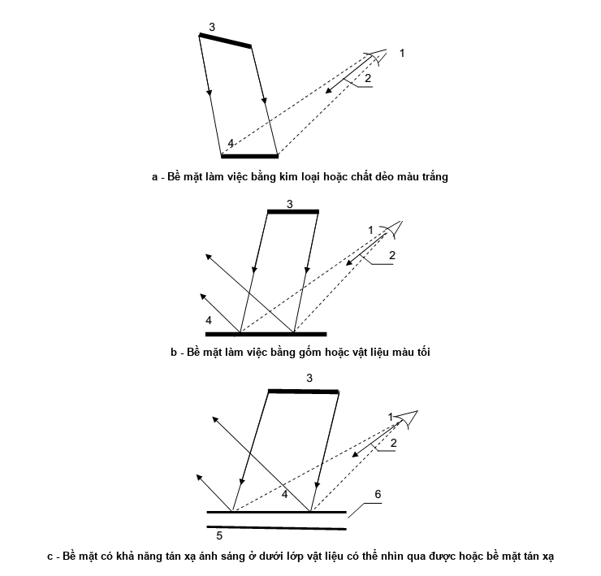

## PHỤ LỤC D (Quy định) — Những biện pháp cần thiết để hạn chế chói lóa phản xạ

### Bảng D.1 - Những biện pháp cần thiết để hạn chế chói lóa phản xạ từ bề mặt làm việc có đặc tính phản xạ gương và phản xạ hỗn hợp khi phải thực hiện những công việc cấp I, II, III

| Đặc điểm công việc | Những biện pháp cần thiết để hạn chế chói lóa phản xạ — Nguồn sáng để chiếu sáng bề mặt làm việc | Những biện pháp cần thiết để hạn chế chói lóa phản xạ — Đèn | Những biện pháp cần thiết để hạn chế chói lóa phản xạ — Độ chói của bề mặt phát sáng của đèn chiếu sáng tại chỗcd/$m^{2}$.10$^{3}$ | Những biện pháp cần thiết để hạn chế chói lóa phản xạ — Vị trí đặt đèn chiếu sáng tại chỗ so với mặt làm việc và người làm việc | Những biện pháp cần thiết để hạn chế chói lóa phản xạ — Mức nhận thấy sự tương quan giữa độ chói của vật với sàn |
| :--- | :--- | :--- | :--- | :--- | :--- |
| Công việc làm với những bề mặt kim loại, chất dẻo đục (ví dụ như phải phân biệt những vết xước, vết nứt và những khuyết tật khác trên bề mặt các vật, các chi tiết...) | Bóng đèn huỳnh quang | Đèn có bộ phận tán xạ ánh sáng | Từ 2,5 đến 4 | Bề mặt phát sáng của đèn phải được phản xạ từ mặt làm việc theo hướng nhìn của người làm việc (Hình D.1-a) | Độ chói của vật cản phân biệt nhỏ hơn độ chói của nền |
| Công việc làm với những bề mặt màu tối bằng chất dẻo, đồ gốm và các vật liệu khác (như phải phát hiện những khuyết tật trên đĩa hát hoặc những sản phẩm cao su công nghiệp .v.v...) |  | Đèn ánh sáng trực tiếp không có bộ phận tán xạ ánh sáng |  | Bề mặt phát sáng của đèn phản xạ gương từ mặt làm việc không được trùng với hướng nhìn của người làm việc (Hình D.1-b) | Độ chói của vật cần phân biệt lớn hơn độ chói của nền. |
| Công việc đòi hỏi phải phân biệt vật có tính phản xạ, tán xạ trên nền tán xạ ánh sáng, ở dưới một lớp vật liệu có thể nhìn qua được (ví dụ như đọc chỉ số của các dụng cụ đo, lắp ráp các sản phẩm trong cái chụp bằng vật liệu trong suốt, làm việc với các sản phẩm có phủ lớp véc ni hoặc sơn bóng, phân biệt các nét vẽ trên bản vẽ kĩ thuật, dưới lớp giấy can, v.v...) | Bất kì nguồn sáng nào | Bất kì đèn nào | Không quy định | Bề mặt phát sáng của đèn phản xạ gương từ lớp vật liệu có thể nhìn qua được, không được trung với hướng nhìn của người làm việc (Hình D.1- c) | Bất cứ trị số nào |
| Công việc làm với những vật cần phân biệt và mặt làm việc có đặc tính phản xạ hỗn hợp (ví dụ như vẽ, viết bằng mực can, đọc văn bản trên giấy có mặt láng bóng,v.v…) | Bất kì nguồn sáng nào | Bất kì đèn nào | Không quy định | Bề mặt phát sáng của đèn phản xạ gương từ mặt làm việc không được trùng với hướng nhìn của người làm việc (Hình D.1- c) | Bất cứ trị số nào |

> **CHÚ THÍCH:** Để chiếu sáng tại chỗ cần sử dụng các bóng đèn hoặc đèn phản xạ gương.

a - Bề mặt làm việc bằng kim loại hoặc chất dẻo màu trắng

b - Bề mặt làm việc bằng gốm hoặc vật liệu màu tối

c - Bề mặt có khả năng tán xạ ánh sáng ở dưới lớp vật liệu có thể nhìn qua được hoặc bề mặt tán xạ

**CHÚ DẪN:**

1 - Mắt người làm việc;

2 - Hướng nhìn của mắt;

3 - Bề mặt phát sáng của đèn;

4 - Bề mặt làm việc;

5 - Bề mặt làm việc có đặc tính tán xạ ánh sáng;

6 - Lớp vật liệu có thể nhìn qua được.

<strong>Hình D.1 — Sơ đồ bố trí đèn, bề mặt làm việc và mắt người làm việc</strong>

