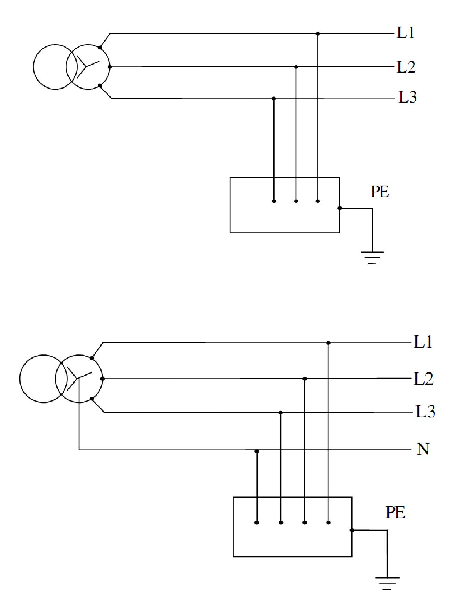
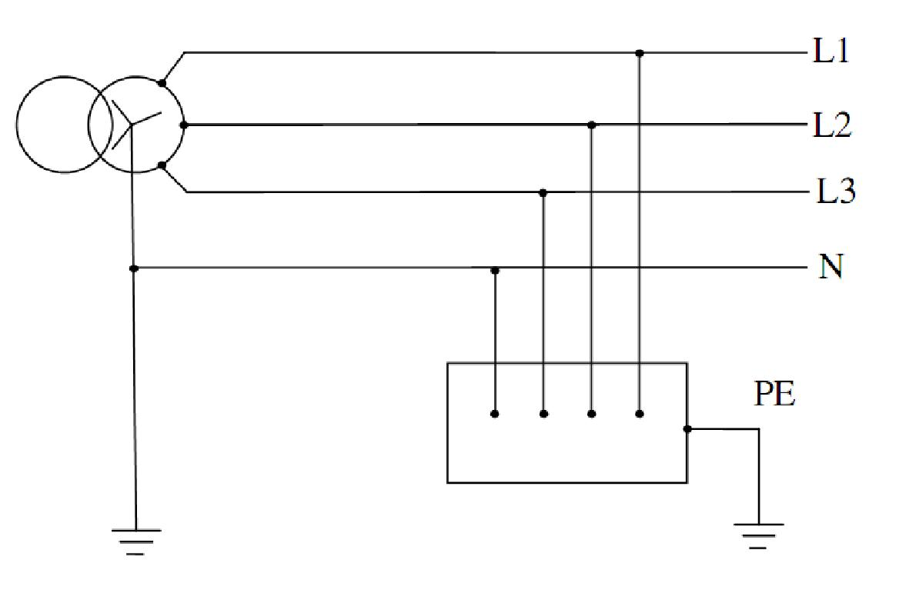
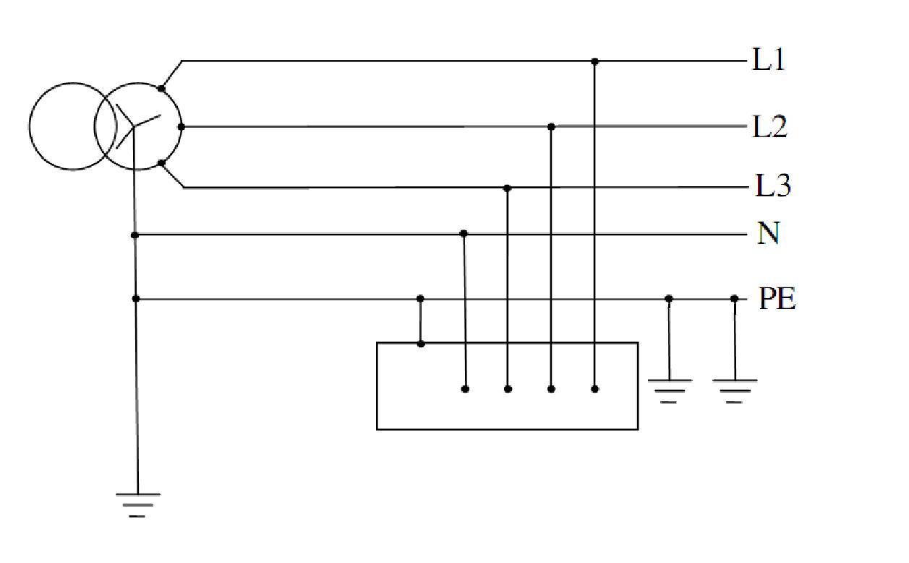

## PHỤ LỤC Đ (Quy định) — Các loại sơ đồ nối đất

Đ.1 Định nghĩa và ký hiệu sơ đồ nối đất

Đ.1.1 Định nghĩa sơ đồ nối đất

Sơ đồ nối đất là sự liên hệ với đất của hai phần tử sau đây:

&nbsp;&nbsp;\- Điểm trung tính của nguồn cung cấp điện;

&nbsp;&nbsp;\- Các vỏ kim loại của thiết bị tại nơi sử dụng điện.

Đ.1.2 Ký hiệu các loại sơ đồ nối đất

Gồm 2 hoặc 3 chữ cái:

&nbsp;&nbsp;\- Chữ thứ nhất: thể hiện sự liên hệ với đất của điểm trung tính của nguồn cấp điện bằng một trong hai chữ cái sau đây:

T (Terre-tiếng Pháp) - điểm trung tính trực tiếp nối đất;

I (Isolé-tiếng Pháp) - điểm trung tính cách ly với đất hoặc nối đất qua một trở kháng lớn (hàng ngàn ôm).

&nbsp;&nbsp;\- Chữ thứ hai: thể hiện sự liên hệ với đất của các vỏ kim loại của thiết bị tại nơi sử dụng điện bằng một trong hai chữ sau đây:

T - vỏ kim loại nối đất trực tiếp;

N - vỏ kim loại nối với điểm trung tính N của nguồn cấp điện (điểm này đã được nối đất trực tiếp).

&nbsp;&nbsp;\- Chữ thứ ba:

S (Séparé-tiếng Pháp) - dây trung tính và dây PE tách riêng nhau.

Quy chuẩn này quy định ba loại sơ đồ nối đất sau: IT; TT; TN-S.

Đ.2 Sơ đồ IT

&nbsp;&nbsp;\- Điểm trung tính của nguồn cấp điện: cách ly đối với đất hoặc nối đất qua một trở kháng lớn (hàng ngàn ôm);

&nbsp;&nbsp;\- Vỏ kim loại của thiết bị tại nơi sử dụng điện: nối đất trực tiếp.

<em>a - Không có dây trung tính &nbsp;&nbsp;&nbsp;&nbsp;&nbsp;&nbsp;&nbsp;&nbsp; b - Có dây trung tính</em>

<strong>Hình Đ.1 — Sơ đồ IT</strong>

GHI CHÚ:

1) Trên Hình Đ.1 không thể hiện trở kháng (có thể có) nối điểm trung tính của nguồn cấp điện với đất;

2) Trong sơ đồ IT không kéo dây trung tính, trừ trường hợp thiết bị sử dụng điện dùng điện áp pha, lúc đó cách điện chính của mỗi pha phải chịu được điện áp dây.

Đ.3 Sơ đồ TT

&nbsp;&nbsp;\- Điểm trung tính của nguồn cấp điện: nối đất trực tiếp;

&nbsp;&nbsp;\- Vỏ kim loại của thiết bị tại nơi sử dụng điện: nối đất trực tiếp.

<strong>Hình Đ.2 — Sơ đồ TT</strong>

Đ.4 Sơ đồ TN-S

&nbsp;&nbsp;\- Điểm trung tính của nguồn cấp điện: nối đất trực tiếp;

&nbsp;&nbsp;\- Vỏ kim loại của thiết bị tại nơi sử dụng điện: nối với điểm trung tính của nguồn bằng một dây riêng gọi là dây bảo vệ (dây PE);

&nbsp;&nbsp;\- Dây N và dây PE tách riêng;

&nbsp;&nbsp;\- Dây N không được nối đất, dây PE nối đất lặp lại càng nhiều càng tốt.

<strong>Hình Đ.3 — Sơ đồ TN-S</strong>

