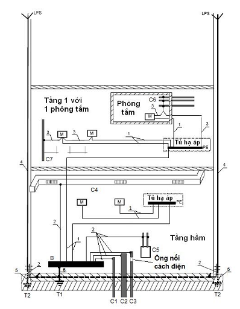

## PHỤ LỤC E (Quy định) — Hệ thống nối đất và dây dẫn bảo vệ

<strong>Hình E.1 — Hệ thống nối đất và dây dẫn bảo vệ</strong>

**CHÚ THÍCH:** 

M vỏ kim loại của thiết bị có khả năng chạm vào, bình thường không mang điện nhưng sẽ mang điện khi hư hỏng cách điện;

Các phần tử dẫn điện không thuộc hệ thống điện nhà bao gồm:

C1 ống dẫn nước bằng kim loại từ ngoài vào;

C2 ống dẫn nước thải bằng kim loại ra ngoài;

C3 ống dẫn khí đốt bằng kim loại từ ngoài vào có đoạn ống nối (măng xông) bằng vật liệu cách điện;

C4 điều hòa không khí;

C5 hệ thống sưởi;

C6 ống nước bằng kim loại, ví dụ trong phòng tắm;

C7 bộ phận dẫn không thuộc hệ thống điện nhà nằm trong tầm với tính từ bộ phận dẫn điện để trần;

B thanh nối đất chính.

Các điện cực nối đất bao gồm:

T1 nối đất móng;

T2 điện cực nối đất chống sét, nếu cần;

## 1  DÂY PE;

## 2  DÂY DẪN LIÊN KẾT BẢO VỆ;

## 3  DÂY DẪN LIÊN KẾT BẢO VỆ BỔ SUNG;

## 4  DÂY DẪN XUỐNG ĐẤT CỦA LPS;

## 5  DÂY DẪN NỐI ĐẤT.
