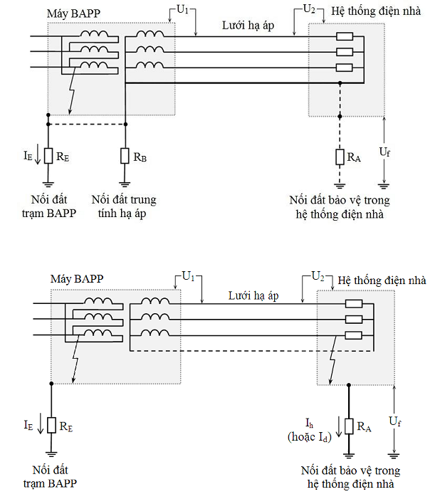

## PHỤ LỤC I (Quy định) — Quá điện áp tạm thời phía hạ áp khi có ngắn mạch chạm đất phía cao áp của máy biến áp

<em>a - Trên sơ đồ TT và TNS &nbsp;&nbsp;&nbsp;&nbsp;&nbsp;&nbsp;&nbsp;&nbsp; b - Trên sơ đồ IT</em>

<strong>Hình I.1 — Phân tích điện áp sự cố</strong>

**CHÚ DẪN:**

$I_{E}$ dòng điện ngắn mạch chạm đất trong hệ thống điện cao áp chạy qua hệ thống nối đất của trạm biến áp phân phối (BAPP);

$R_{E}$ điện trở hệ thống nối đất của trạm BAPP;

$R_{B}$ điện trở hệ thống nối đất trung tính lưới hạ áp tại trạm BAPP;

$R_{A}$ điện trở hệ thống nối đất bảo vệ của hệ thống điện nhà;

$U_{0}$ điện áp pha - trung tính danh định lưới hạ áp;

$U_{f}$ điện áp sự cố tần số công nghiệp xuất hiện giữa vỏ kim loại của thiết bị và đất của hệ thống điện nhà;

$U_{1}$ điện áp chịu đựng tần số công nghiệp xuất hiện giữa dây pha và vỏ kim loại của máy BAPP khi sự cố;

$U_{2}$ điện áp chịu đựng tần số công nghiệp xuất hiện giữa dây pha và vỏ kim loại của thiết bị trong hệ thống điện nhà khi sự cố;

$I_{h}$ dòng điện ngắn mạch chạy qua mạng nối đất bảo vệ của hệ thống điện nhà khi sự cố ngắn mạch pha - đất trong mạng cao áp và sự cố ngắn mạch pha - đất tại điểm thứ nhất trong mạng hạ áp với sơ đồ nối đất IT;

$I_{d}$ dòng điện ngắn mạch chạy qua mạng nối đất bảo vệ của hệ thống điện nhà khi sự cố trong mạng hạ áp với sơ đồ nối đất IT;

Z tổng trở giữa điểm trung tính hạ áp với mạng nối đất (có trị số lớn) trong sơ đồ nối đất IT.

Khi có sự cố ngắn mạch chạm vỏ cuộn dây cao áp của trạm BAPP, các quá điện áp tạm thời xuất hiện trong lưới hạ áp được xác định theo Bảng I.1.

### Bảng I.1 - Các quá điện áp tạm thời trong lưới hạ áp

| Sơ đồ nối đất | Các phương án nối đất | $U_{1}$ | $U_{2}$ | $U_{f}$ |
| :--- | :--- | :--- | :--- | :--- |
| TT | Nối $R_{E}$ và $R_{B}$ | $U_{0}$(a) | $U_{0}$ + $I_{E}$.$R_{E}$ | 0 (a) |
| TT | Tách biệt $R_{E}$ và $R_{B}$ | $U_{0}$ + $I_{E}$.$R_{E}$ | $U_{0}$(a) | 0 (a) |
| TN-S | Nối $R_{E}$ và $R_{B}$ | $U_{0}$(a) | $U_{0}$(a) | $I_{E}$.$R_{E}$ |
| TN-S | Tách biệt $R_{E}$ và $R_{B}$ | $U_{0}$ + $I_{E}$.$R_{E}$ | $U_{0}$(a) | 0 (a) |
| IT | Nối $R_{E}$ và Z Tách biệt $R_{E}$ và $R_{A}$ | $U_{0}$(a) | $U_{0}$ + $I_{E}$.$R_{E}$ | 0 (a) |
| IT | Nối $R_{E}$ và Z Tách biệt $R_{E}$ và $R_{A}$ | $\sqrt{3} U_{0}$(b) | $\sqrt{3} U_{0}$(b) + $I_{E}$.$R_{E}$(b) | $I_{h}$.$R_{A}$(b) |
| IT | Nối $R_{E}$ và Z Nối liên kết $R_{E}$ và $R_{A}$ | $U_{0}$(a) | $U_{0}$(a) | $I_{E}$.$R_{E}$ |
| IT | Nối $R_{E}$ và Z Nối liên kết $R_{E}$ và $R_{A}$ | $\sqrt{3} U_{0}$(b) | $\sqrt{3} U_{0}$(b) | $I_{E}$.$R_{E}$(b) |
| IT | Tách biệt $R_{E}$ và Z Tách biệt $R_{E}$ và $R_{A}$ | $U_{0}$ + $I_{E}$.$R_{E}$ | $U_{0}$(a) | 0 (a) |
| IT | Tách biệt $R_{E}$ và Z Tách biệt $R_{E}$ và $R_{A}$ | $\sqrt{3} U_{0}$ + $I_{E}$.$R_{E}$(b) | $\sqrt{3} U_{0}$(b) | $I_{d}$.$R_{A}$(b) |

> **CHÚ THÍCH:**
>
> &nbsp;&nbsp;\- (a) Không cần xem xét.
>
> &nbsp;&nbsp;\- (b) Khi tồn tại sự cố chạm đất tại thiết bị điện.
