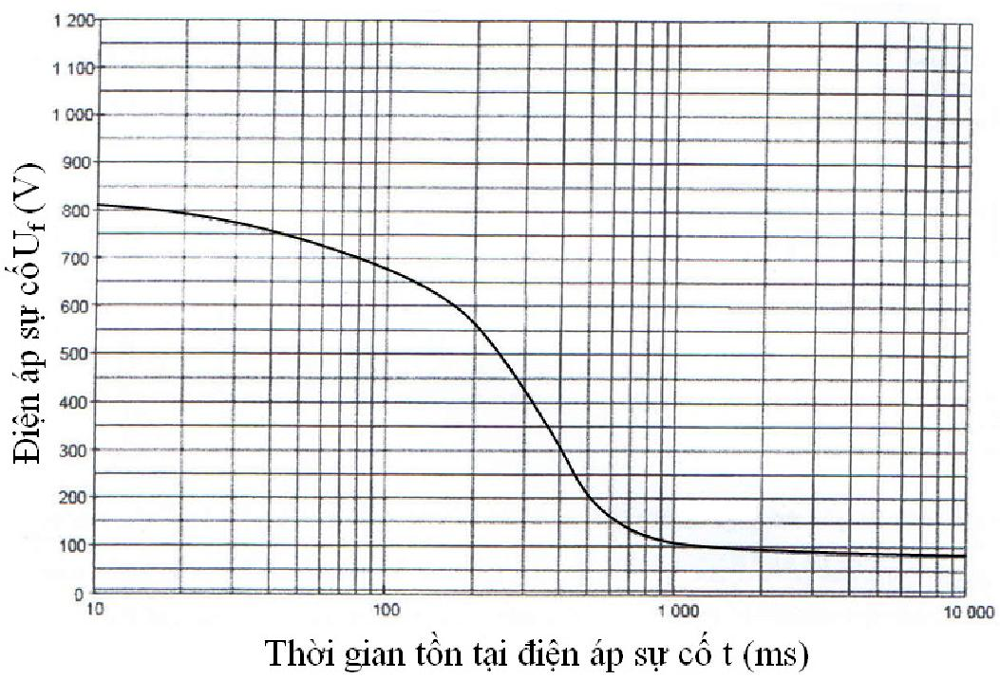

## PHỤ LỤC K (Quy định) — Yêu cầu đối với quá điện áp tạm thời

Độ lớn và thời gian của điện áp sự cố tần số công nghiệp Uf xuất hiện trong hệ thống điện nhà giữa vỏ kim loại của thiết bị và đất không được lớn hơn trị số Uf xác định bởi đường cong Uf(t) trong Hình K.1.

<strong>Hình K.1 — Điện áp sự cố cho phép Uf do ngắn mạch trong hệ thống điện cao áp</strong>

### Bảng K.1 - Điện áp chịu đựng tần số công nghiệp cho phép

| Thời gian của sự cố chạm đất mạng cao áp s | Điện áp chịu đựng cho phép trên thiết bị của hệ thống điện nhà V |
| :--- | :--- |
| > 5 s ≤ 5 s | $U_{0}$ + 250 V $U_{0}$ + 1200 V |

> **CHÚ THÍCH:**
>
> &nbsp;&nbsp;\- $U_{0}$ - Điện áp danh định pha-pha với lưới điện không có dây trung tính.
>
> &nbsp;&nbsp;\- Dòng thứ nhất của Bảng liên quan đến hệ thống có thời gian cắt dài, ví dụ hệ thống cao áp trung tính cách đất hoặc nối đất qua cuộn kháng (cuộn dập hồ quang); Dòng thứ hai của Bảng liên quan đến hệ thống có thời gian cắt ngắn, ví dụ hệ thống cao áp nối đất trực tiếp hoặc qua tổng trở nhỏ; Cả hai dòng đều liên quan đến tiêu chuẩn thiết kế cách điện của thiết bị hạ áp khi có quá áp tạm thời.

