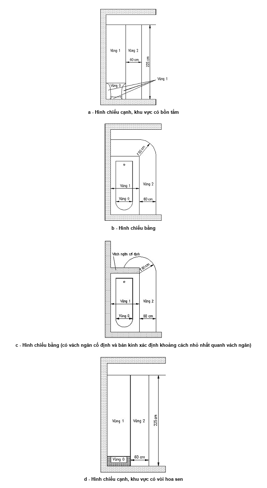
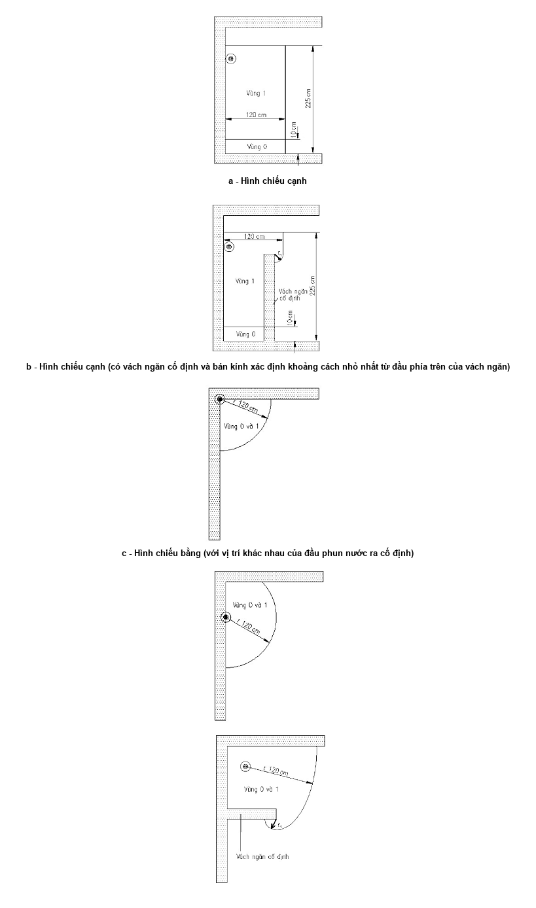
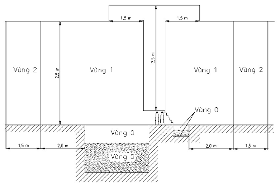
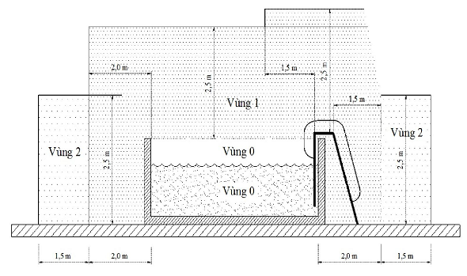
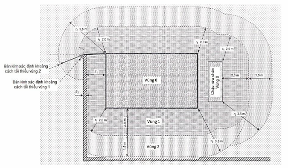
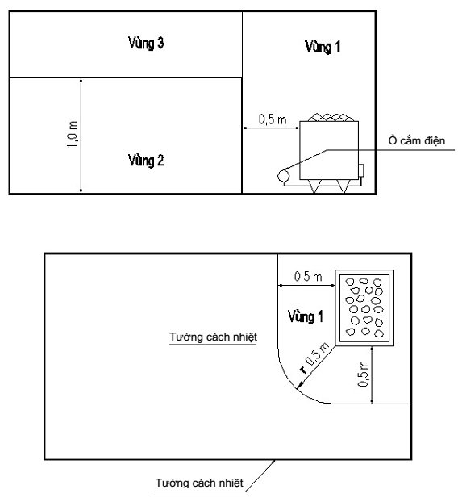

## PHỤ LỤC N (Quy định) — Phân loại các vùng theo mức độ nguy hiểm về điện

a - Hình chiếu cạnh, khu vực có bồn tắm

b - Hình chiếu bằng

c - Hình chiếu bằng (có vách ngăn cố định và bán kính xác định khoảng cách nhỏ nhất quanh vách ngăn)

d - Hình chiếu cạnh, khu vực có vòi hoa sen

<strong>Hình N.1 — Kích thước các vùng trong khu vực có bồn tắm hoặc vòi hoa sen có chậu hứng</strong>

a - Hình chiếu cạnh

b - Hình chiếu cạnh (có vách ngăn cố định và bán kính xác định khoảng cách nhỏ nhất từ đầu phía trên của vách ngăn)

c - Hình chiếu bằng (với vị trí khác nhau của đầu phun nước ra cố định)

d - Hình chiếu bằng có đầu phun nước ra cố định (có vách ngăn cố định và bán kính để xác định khoảng cách nhỏ nhất quanh vách ngăn)

**CHÚ DẪN: - Đầu phun nước**

<strong>Hình N.2 — Kích thước của vùng 0 và vùng 1 trong khu vực có vòi tắm hoa sen không có chậu hứng</strong>

<strong>Hình N.3 — Kích thước các vùng của bể bơi chìm (hình chiếu đứng)</strong>

<strong>Hình N.4 — Kích thước các vùng của bể bơi nổi (hình chiếu đứng)</strong>

<strong>Hình N.5 — Kích thước các vùng của bể bơi (hình chiếu mặt bằng)</strong>

<strong>Hình N.6 — Kích thước các vùng của khu vực lân cận phần tử gia nhiệt sinh hơi</strong>

