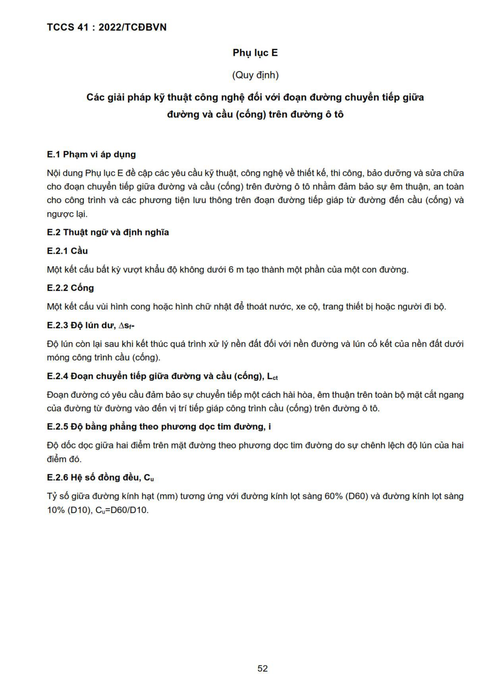
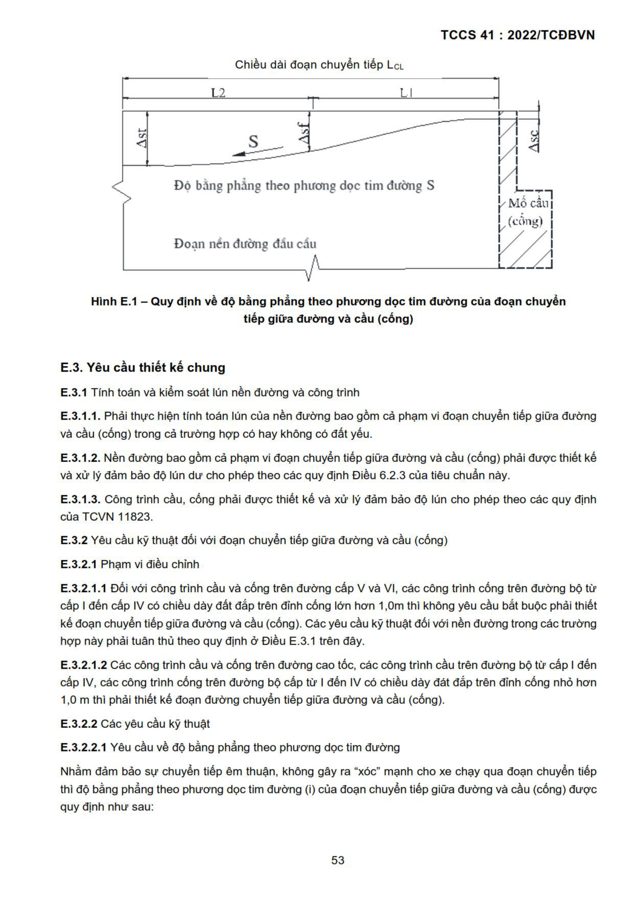
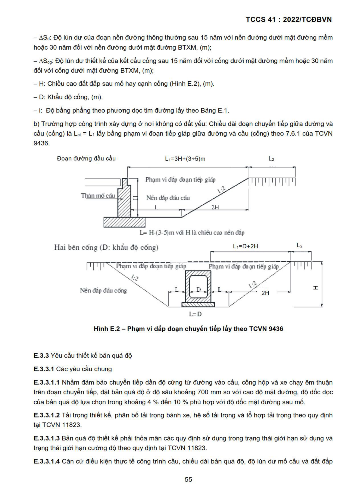
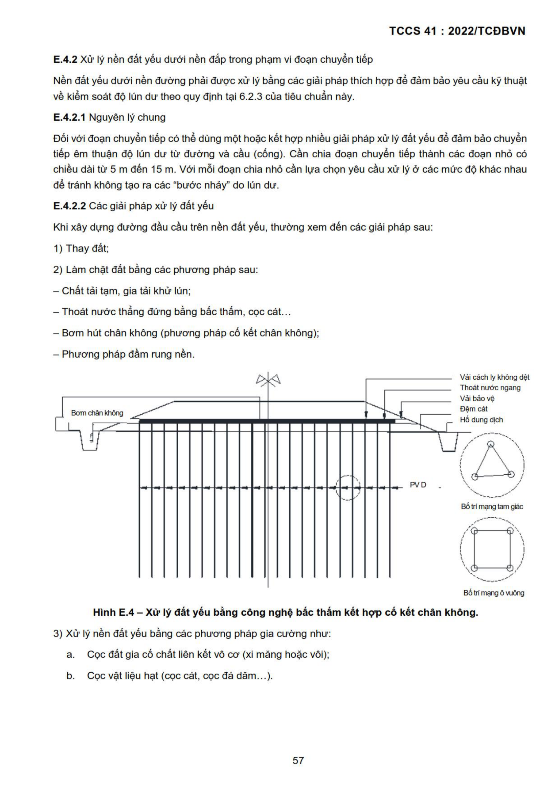
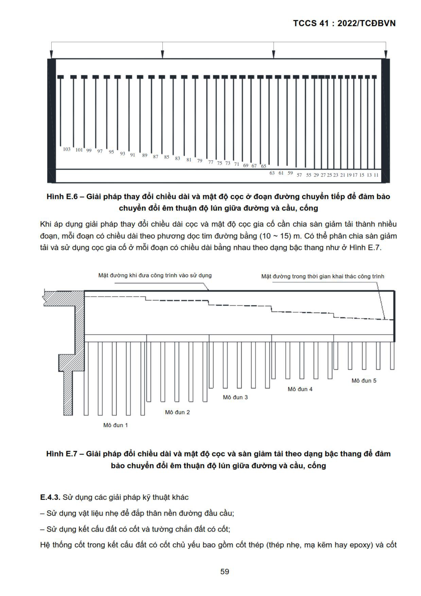
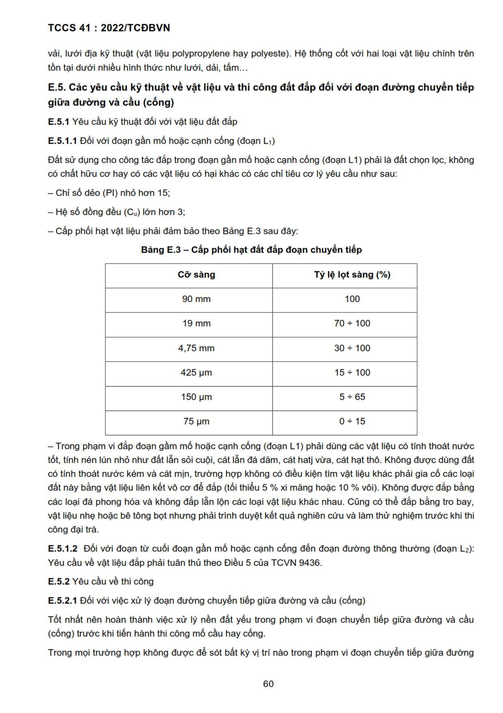
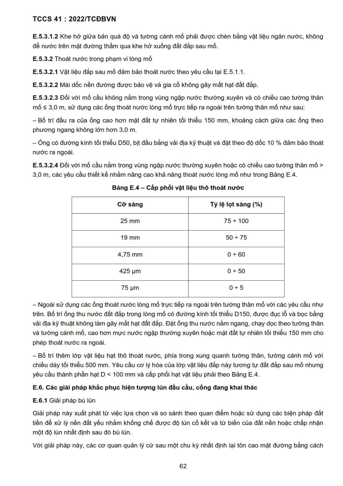
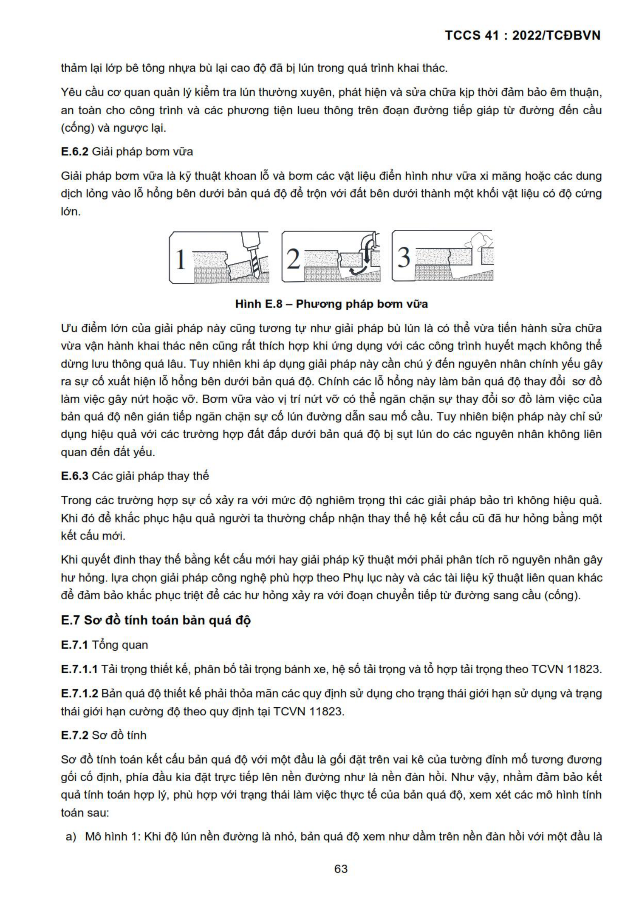
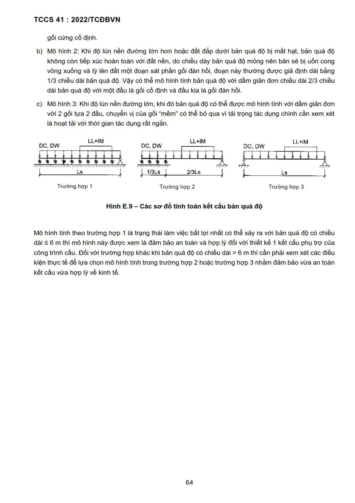

## PHỤ LỤC E (Quy định) — Các giải pháp kỹ thuật công nghệ đối với đoạn đường chuyển tiếp giữa

đường và cầu (cống) trên đường ô tô

### E.1  Phạm vi áp dụng

Nội dung Phụ lục E đề cập các yêu cầu kỹ thuật, công nghệ về thiết kế, thi công, bảo dưỡng và sửa chữa

cho đoạn chuyển tiếp giữa đường và cầu (cống) trên đường ô tô nhằm đảm bảo sự êm thuận, an toàn

cho công trình và các phương tiện lưu thông trên đoạn đường tiếp giáp từ đường đến cầu (cống) và

ngược lại.

### E.2  Thuật ngữ và định nghĩa

### E.2.1  Cầu

Một kết cấu bất kỳ vượt khẩu độ không dưới 6 m tạo thành một phần của một con đường.

### E.2.2  Cống

Một kết cấu vùi hình cong hoặc hình chữ nhật để thoát nước, xe cộ, trang thiết bị hoặc người đi bộ.

### E.2.3  Độ lún dư, As;-

Độ lún còn lại sau khi kết thúc quá trình xử lý nền dat đối với nền đường và lún cố kết của nền đất dưới

móng công trình cầu (cống).

### E.2.4  Đoạn chuyển tiếp giữa đường va cầu (cống), Let

Đoạn đường có yêu cầu đảm bảo sự chuyển tiếp một cách hài hòa, êm thuận trên toàn bộ mặt cắt ngang

của đường từ đường vào đến vị trí tiếp giáp công trình cầu (cống) trên đường ô tô.

### E.2.5  Độ bằng phẳng theo phương dọc tim đường, i

Độ dốc dọc giữa hai điểm trên mặt đường theo phương dọc tim đường do sự chênh lệch độ lún của hai

điểm đó.

### E.2.6  Hệ số đồng đều, Cu

Tỷ số giữa đường kính hạt (mm) tương ứng với đường kính lọt sàng 60% (D60) và đường kính lọt sàng

10% (D10), Cu=D60/D10.

Chiều dài đoạn chuyển tiếp LcL

L2 LI

a | F

ï = f

Độ bằng phẳng theo phương dọc tim đường S KT...

t M6 cầu I

&#124; (cống)

Đoạn nền đường đầu cầu 4

¿ Z]

<strong>Hình E.1 — Quy định về độ bằng phẳng theo phương dọc tim đường của đoạn chuyển</strong>

tiếp giữa đường và cầu (cống)

### E.3  Yêu cầu thiết kế chung

### E.3.1  Tính toán và kiểm soát lún nền đường và công trình

### E.3.1.1  Phải thực hiện tính toán lún của nền đường bao gồm cả phạm vi đoạn chuyển tiếp giữa đường

và cầu (cống) trong cả trường hợp có hay không có đất yếu.

### E.3.1.2  Nền đường bao gồm cả phạm vi đoạn chuyền tiếp giữa đường và cầu (cống) phải được thiết kế

và xử lý đảm bảo độ lún dư cho phép theo các quy định Điều 6.2.3 của tiêu chuẩn này.

### E.3.1.3  Công trình cầu, cống phải được thiết kế và xử lý đảm bảo độ lún cho phép theo các quy định

của TCVN 11823.

### E.3.2  Yêu cầu kỹ thuật đối với đoạn chuyển tiếp giữa đường và cầu (cống)

### E.3.2.1  Phạm vi điều chỉnh

### E.3.2.1.1  Đối với công trình cầu và cống trên đường cấp V và VI, các công trình cống trên đường bộ từ

cấp | đến cấp IV có chiều day dat đắp trên đỉnh cống lớn hơn 1,0m thì không yêu cầu bắt buộc phải thiết

kế đoạn chuyền tiếp giữa đường và cầu (cống). Các yêu cầu kỹ thuật đối với nền đường trong các trường

hợp này phải tuân thủ theo quy định ở Điều E.3.1 trên đây.

### E.3.2.1.2  Các công trình cầu và cống trên đường cao tốc, các công trình cầu trên đường bộ từ cấp | đến

cấp IV, các công trình cống trên đường bộ cấp từ | đến IV có chiều dày dat đắp trên đỉnh cống nhỏ hon

1,0 m thì phải thiết ké đoạn đường chuyển tiếp giữa đường và cầu (cống).

### E.3.2.2  Các yêu cầu kỹ thuật

### E.3.2.2.1  Yêu cầu về độ bằng phẳng theo phương dọc tim đường

Nhằm đảm bảo sự chuyển tiếp êm thuận, không gây ra “xóc” mạnh cho xe chạy qua đoạn chuyển tiếp

thì độ bằng phẳng theo phương dọc tim đường (i) của đoạn chuyển tiếp giữa đường và cầu (cống) được

quy định như sau:

tiếp giữa đường và cầu, cống

Đoạn chuyển tiếp đường và Ẫ Š

sieges Độ bằng phẳng (iS)

công trình trên đường

Đường cao tốc | cu | | 1/475 | 1/200 1/250

(TCVN 5729)

mm. —

Đường 6 tô, cấp I-IV 1/125 1/150 1/175 1/200

(TCVN 4054)

Trong một số trường hợp cho phép có thể tạo “vồng” trước cho đoạn đường chuyển tiếp với độ dốc dọc

lớn nhất là 1/125 nhằm dự phòng bù lún trước.

### E.3.2.2.2  Xác định chiều dài đoạn chuyển tiếp giữa đường và cầu (cống)

a) \- Trường hợp xây dựng ở nơi đất yếu, chiều dài đoạn chuyển tiếp giữa đường và cầu, cống được xác

định từ mép về phía đường của tường đỉnh mố cầu hoặc mép ngoài cùng của thân cống về mỗi phía

nền đường tính theo công thức:

Lạ 3 Lì + La (E:1)

Trong đó:

&nbsp;&nbsp;&nbsp;&nbsp;\- Le: Chiều dài đoạn chuyển tiếp giữa đường và cầu (cống), m;

&nbsp;&nbsp;&nbsp;&nbsp;\- L1: Chiều dài đoạn đường gần mé cầu hoặc cạnh cống, m;

&nbsp;&nbsp;&nbsp;&nbsp;\- Lạ: Chiều dài đoạn đường từ đoạn gần mố hoặc cạnh cống đến đoạn đường thông

&nbsp;&nbsp;&nbsp;&nbsp;\- thường, m.

&nbsp;&nbsp;&nbsp;&nbsp;\- Chiều dài L: lấy như sau (xem Hình E.2):

Đối với đoạn đường gần mố:

Li 2 (AS¡— ASc}/ S nhưng không nhỏ hơn 3H + (3+5) m (E.2)

Đối với đoạn đường cạnh cống:

Li 2 (AS — AScg)/ S nhưng không nhỏ hơn D + 2H Œä

Chiều dài Lạ tính theo công thức sau:

La 2 (AS; — AS?/ S (E.4)

Trong các công thức (E.2), (E.3) và (E.4):

&nbsp;&nbsp;\- AS‹: Độ lún dư của kết cấu mé cầu lay theo quy định của TCVN 11823 bằng 25,4 mm trong vòng 100

năm. Độ lún dư sau 15 năm là 3,8 mm, (m);

&nbsp;&nbsp;\- ASr: Độ lún dư của đoạn đường gần mé cầu hoặc cống sau 15 năm với nền đường dưới mặt đường

mềm hoặc 30 năm đối với nền đường dưới mặt đường BTXM, (m);

&nbsp;&nbsp;\- ASa: Độ lún dư của đoạn nền đường thông thường sau 15 năm với nền đường dưới mặt đường mềm

hoặc 30 năm đối với nền đường dưới mặt đường BTXM, (m);

&nbsp;&nbsp;\- AScg: Độ lún dư thiết kế của kết cấu cống sau 15 năm đối với cống dưới mặt đường mềm hoặc 30 năm

đối với cống dưới mặt đường BTXM, (m);

—H: Chiều cao đất đắp sau mé hay cạnh cống (Hình E.2), (m).

&nbsp;&nbsp;\- D: Khẩu độ cống, (m).

—i: Độ bằng phẳng theo phương dọc tim đường lấy theo Bảng E.1.

b) \- Trường hợp công trình xây dựng ở nơi không có dat yếu: Chiều dài đoạn chuyển tiếp giữa đường và

cầu (cống) là Le = L¡ lấy bằng phạm vi đoạn tiếp giáp giữa đường và cầu (cống) theo 7.6.1 của TCVN

9436.

Đoạn đường đầu cầu L:=3H+(3+5)m La

___] Pham vi dap đoạn tiếp giáp

R Sa v3 |

Than mo cau Nền dap đầu cầu

L 2H

L= H-(3-5)m với H là chiều cao nền dap

Hai bên cống (D: khẩu độ cống) L:=D+2H ba

Pham vi dip đoạn tiếp gidp Pham vi đáp đạn tiếp giáp Z

ha

.ã 5 - 7 v3 tE

Nền dap đầu cống 2H

L=D

<strong>Hình E.2 — Pham vi đắp đoạn chuyền tiếp lấy theo TCVN 9436</strong>

### E.3.3  Yêu cầu thiết kế bản quá độ

### E.3.3.1  Các yêu cầu chung

### E.3.3.1.1  Nhằm đảm bảo chuyển tiếp dần độ cứng từ đường vào cầu, cống hộp và xe chạy êm thuận

trên đoạn chuyển tiếp, đặt bản quá độ ở độ sâu khoảng 700 mm so với cao độ mặt đường, độ dốc dọc

của bản quá độ lựa chọn trong khoảng 4 % đến 10 % phù hợp với độ dốc mặt đường sau mó.

### E.3.3.1.2  Tải trọng thiết kế, phân bồ tải trọng bánh xe, hệ số tải trọng và tổ hợp tải trọng theo quy định

tại TCVN 11823.

### E.3.3.1.3  Bản quá độ thiết kế phải thỏa mãn các quy định sử dụng trong trạng thái giới hạn sử dụng và

trạng thái giới hạn cường độ theo quy định tại TCVN 11823.

### E.3.3.1.4  Căn cứ điều kiện thực tế công trình cầu, chiều dài bản quá độ, độ lún dư mé cầu và dat đắp

sau mồ để lựa chọn sơ đồ tính toán bản quá độ nhằm đảm bảo vừa an toàn kết cấu và vừa hợp lý về

kinh tế. Các sơ đồ tính toán bản quá độ xem Điều E.7 của Phụ lục này.

### E.3.3.1.5  Có thể sử dụng giải pháp nối liên tiếp nhiều bản quá độ để chuyền tiếp độ lún của đoạn đường

dẫn đầu cầu (Hình E.3).

### E.3.3.2  Kích thước và cấu tạo bản quá độ

### E.3.3.2.1  Chiều dài bản quá độ có thể được lựa chọn nhằm đáp ứng việc chuyền tiếp được êm thuận

khi xảy ra sự thay đổi độ dốc dọc do lún đất đắp sau mó. Chiều dài bản quá độ tham khảo số liệu ở Bảng

E22:

Bang E.2 — Chiều dài bản quá độ

Chiều dài bản quá độ (m) (8+ 12)m (8+12)m

### E.3.3.2.2  Chiều day ban qua độ (t) xác định theo điều kiện chịu lực của ban nhưng không nhỏ hon L/20

hoặc 300 mm. Trong bản quá độ phải bố trí cốt thép 2 lớp trên và dưới theo yêu cầu chịu lực tính toán.

Mặt đường khi đưa công trình vào sử dụng Mặt đường trong thời gian khai thác công trình

mm...

mẽ...

Ề :

lý 2

<strong>Hình E.3 — Bồ trí ban quá độ</strong>

### E.3.3.2.3  Bản quá độ phải được gối chắc chắn một đầu trên tường đỉnh mó, đầu phía đối diện phải được

kê trên nền hoặc gối đàn hồi được gia có chắc chan để đảm bảo độ lún dư ở cuối bản quá độ thỏa man

yêu cầu về độ bằng phẳng quy định ở Bảng E.1. Khi cần thiết có thể tăng cường cọc móng dưới gối kê

ở cuối bản quá độ (Hình E.3). Sơ đồ, ví dụ cấu tạo và tính toán bản quá độ xem tại E.7.

### E.3.3.2.4  Khi chiều dài bản quá độ quá lớn có thể phân chia thành nhiều đoạn, mỗi đoạn có chiều dài từ

(4 + 8) m đặt liên tiếp nhau trên các gối gia cường móng có độ cứng chống lún thay đổi phù hợp như

Hình E.3.

### E.4  Các giải pháp kỹ thuật công nghệ dé đoạn đường chuyển tiếp giữa đường và cầu

(cống) đảm bảo êm thuận

### E.4.1  Tăng chiều dài cầu hoặc khẩu độ cống dé hạ thấp chiều cao dat đắp sau mé cầu, cạnh cống.

Chiều cao dat đắp sau mé cầu, cạnh cống nên chọn nhỏ hơn 6m đối với vị trí không có đất yếu và nhỏ

hơn 4 m tại vi trí đất yếu.

### E.4.2  Xử lý nền đất yếu dưới nền đắp trong phạm vi đoạn chuyền tiếp

Nền đất yếu dưới nền đường phải được xử lý bằng các giải pháp thích hợp để đảm bảo yêu cầu kỹ thuật

về kiểm soát độ lún dư theo quy định tại 6.2.3 của tiêu chuẩn này.

### E.4.2.1  Nguyên lý chung

Đối với đoạn chuyển tiếp có thé dùng một hoặc kết hợp nhiều giải pháp xử lý đất yếu để đảm bảo chuyển

tiếp êm thuận độ lún dư từ đường và cầu (cống). Cần chia đoạn chuyển tiếp thành các đoạn nhỏ có

chiều dài từ 5 m đến 15 m. Với mỗi đoạn chia nhỏ cần lựa chọn yêu cầu xử lý ở các mức độ khác nhau

để tránh không tạo ra các “bước nhảy" do lún dư.

### E.4.2.2  Các giải pháp xử lý đất yếu

Khi xây dựng đường đầu cầu trên nền đất yếu, thường xem đến các giải pháp sau:

1) Thay đất;

2) Làm chặt đất bằng các phương pháp sau:

&nbsp;&nbsp;\- Chat tải tạm, gia tải khử lún;

&nbsp;&nbsp;\- Thoát nước thẳng đứng bang bac thấm, cọc cát...

&nbsp;&nbsp;\- Bơm hút chân không (phương pháp cố kết chân không);

&nbsp;&nbsp;\- Phương pháp dam rung nền.

ple Vải cách ly không dệt

Thoát nước ngang

Vải bảo vệ

67 aT SỐ

= ố dung dị

F—C——[ TT | || | | || 1| LÍ — ¬

3 \ | ⁄ N

{ |

N PV D - Ñ% ff

\ ial .  .É”

i Bồ trí mang tam giác

F 0.

J

as

Bố trí mang 6 vuông

<strong>Hình E.4 — Xử lý đất yếu bằng công nghệ bắc thám kết hợp cố kết chân không.</strong>

3) Xử lý nền đất yếu bằng các phương pháp gia cường như:

a. Coc đất gia cố chất liên kết vô cơ (xi măng hoặc vôi);

b. Coc vật liệu hạt (cọc cát, cọc đá dam...).

Nền dap

= = = L__j ff = = =

Nén dat yéu | | | | | | | | Coc gia cường

<strong>Hình E.5 — Xử ly đất yếu bằng công nghệ cọc gia cường</strong>

Lưu ý trước tiên cần tiến hành khảo sát dia chan đất nền kỹ lưỡng. Trong tính toán xử ly đất yếu khu

vực mồ cầu cần phải xét day đủ chỉ tiết tới thành phan lún theo theo gian, với tat cả các tải trọng, trình

tự thi công... Tính toán độ lún tương ứng với các phương pháp xử lý khác nhau, để xác định và lựa chọn

biện pháp xử lý phù hợp, đảm bảo tính kinh tế, kỹ thuật.

Trong khi thi công cần phối hợp chặt chẽ giữa các đơn vị thi công về trình tự thi công, vừa đảm bảo thời

gian chờ lún tối thiểu của phương pháp xử lý nền đất yếu và cũng không gây ảnh hưởng tới kết cấu mố

cầu như hiện tượng ma sát âm, mé chuyển vi dọc... Thông thường thì nền đường được xử lý đất yếu

đạt tối thiểu 90 % độ cố kết tính toán thi mới bắt đầu thi công mé cầu.

4) Khi biện pháp xử ly đất yếu không khả thi, thì có thể áp dụng:

Kết cau bê tông cốt thép có bệ cọc bê tông cốt thép xuyên qua nền dat yếu, có tác dụng truyền tải trọng

từ đất đắp, hoạt tải xuống lớp đất tốt hơn phía dưới, một số kết cấu thường dùng sau mồ cầu như sau:

&nbsp;&nbsp;\- Sàn giảm tải (trên hệ móng cọc) nâng đỡ trực tiếp phần dat đắp nền đường dẫn sau mố;

~ Cống hộp dọc thay thế cho phần nền đường đắp dau cầu, cho phép xe chạy trực tiếp trên nắp nap

cống, giảm áp lực tác dụng lên dat nền.

Khi sử dụng hệ cọc bê tông cốt thép gia cố cần có so sánh cụ thể với các phương án xử lý nền đất yếu

khác hoặc phương án kéo dài thêm nhịp cầu, nhằm đảm bảo các chỉ tiêu kỹ thuật và hợp lý về kinh tế

của phương án lựa chọn.

Để đảm bảo yêu cầu độ bằng phẳng ở Bảng E.1 khi áp dụng các kết cấu cọc móng gia cố cần đặc biệt

chú ý chuyển dần độ cứng chống lún giữa đường và cầu (cống) bằng các giải pháp thay đổi chiều sâu

và mật độ cọc (Hình E.6). Bước giảm chiều sâu hạ cọc và mật độ cọc tùy theo kết quả tính toán lún, có

thể tham khảo mỗi bước giảm chiều sâu hạ cọc bằng (10 + 15) % chiều dài cọc, khoảng cách các cọc

có thé tăng dan từ (1,2 + 1,5) lần khoảng cách các cọc.

AN

99 97 95 93 91 gọ 87 85 'gg sư bo

77°75 T3 1Ì 69 67 6s

<strong>Hình E.6 — Giải pháp thay đổi chiều dài và mật độ cọc ở đoạn đường chuyển tiếp dé đảm bao</strong>

chuyển đổi êm thuận độ lún giữa đường và cầu, cống

Khi áp dụng giải pháp thay đổi chiều dài cọc và mật độ cọc gia cố cần chia sàn giảm tải thành nhiều

đoạn, mỗi đoạn có chiều dài theo phương dọc tim đường bằng (10 ~ 15) m. Có thể phân chia sàn giảm

tải và sử dụng cọc gia cố ở mỗi đoạn có chiều dài bằng nhau theo dạng bậc thang như ở Hình E.7.

Mặt đường khi đưa công trình vào sử dụng Mặt đường trong thời gian khai thác công trình

Y ————

] Py

7=

i.

Y Mô đun 5

## 7  MÔ ĐUN 4

## 7  MÔ ĐUN 3

## 2  MÔ ĐUN 2

Mô đun 1

<strong>Hình E.7 — Giải pháp đổi chiều dài và mật độ cọc và sàn giảm tải theo dạng bậc thang dé dam</strong>

bảo chuyển đổi êm thuận độ lún giữa đường và cầu, cống

### E.4.3  Sử dụng các giải pháp kỹ thuật khác

&nbsp;&nbsp;\- Sử dụng vật liệu nhẹ dé đắp thân nền đường dau cau;

&nbsp;&nbsp;\- Sử dụng kết cấu đất có cốt và tường chan dat có cốt;

Hệ thống cốt trong kết cấu đất có cốt chủ yếu bao gồm cốt thép (thép nhẹ, mạ kẽm hay epoxy) và cốt

vải, lưới địa kỹ thuật (vật liệu polypropylene hay polyeste). Hệ thống cốt với hai loại vật liệu chính trên

tồn tại dưới nhiều hình thức như lưới, dải, tam...

### E.5  Các yêu cầu kỹ thuật về vật liệu và thi công đất đắp đối với đoạn đường chuyễn tiếp

giữa đường và cầu (cống)

### E.5.1  Yêu cầu kỹ thuật đối với vật liệu dat đắp

### E.5.1.1  Đối với đoạn gần mồ hoặc cạnh cống (đoạn L:)

Dat sử dụng cho công tác đắp trong đoạn gần mồ hoặc cạnh cống (đoạn L1) phải là đất chọn lọc, không

có chất hữu cơ hay có các vật liệu có hại khác có các chỉ tiêu cơ lý yêu cầu như sau:

&nbsp;&nbsp;\- Chỉ số dẻo (PI) nhỏ hơn 15;

&nbsp;&nbsp;\- Hệ số đồng đều (Cu) lớn hơn 3;

&nbsp;&nbsp;\- Cấp phối hạt vật liệu phải đảm bảo theo Bảng E.3 sau đây:

CHỢ TC HỌC

~ Trong phạm vi đắp đoạn gầm mé hoặc cạnh cống (đoạn L1) phải dùng các vật liệu có tính thoát nước

tốt, tính nén lún nhỏ như dat lẫn sỏi cuội, cát lẫn đá dam, cát hatj vừa, cát hạt thô. Không được dùng dat

có tính thoát nước kém và cát mịn, trường hợp không có điều kiện tìm vật liệu khác phải gia cố các loại

đất này bằng vật liệu liên kết vô cơ để đắp (tối thiểu 5 % xi măng hoặc 10 % vôi). Không được đắp bằng

các loại đá phong hóa và không đắp lẫn lộn các loại vật liệu khác nhau. Cũng có thể đắp bằng tro bay,

vật liệu nhẹ hoặc bê tông bọt nhưng phải trình duyệt kết quả nghiên cứu và làm thử nghiệm trước khi thi

công đại trà.

### E.5.1.2  Đối với đoạn từ cuối đoạn gần mố hoặc cạnh cống đến đoạn đường thông thường (đoạn Lz):

Yêu cầu về vật liệu đắp phải tuân thủ theo Điều 5 của TCVN 9436.

### E.5.2  Yêu cầu về thi công

### E.5.2.1  Đối với việc xử lý đoạn đường chuyển tiếp giữa đường và cầu (cống)

Tốt nhất nên hoàn thành việc xử lý nền đất yếu trong phạm vi đoạn chuyển tiếp giữa đường và cầu

(cống) trước khi tiến hành thi công mồ cầu hay cống.

Trong mọi trường hợp không được để sót bắt kỳ vị trí nào trong phạm vi đoạn chuyển tiếp giữa đường

và cầu (cống) không được xử lý đất yếu đúng yêu cầu kỹ thuật.

### E.5.2.2  Đối với đắp đoạn gần mé hoặc cạnh cống (đoạn L1)

Tuân thủ nghiêm túc quy định của TCVN 9436. Đặc biệt lưu ý các vấn đề sau đây:

~— Trước khi đắp gần mé cầu hoặc cạnh cống (đoạn L1) phải hoàn thành tốt các lớp phòng nước thắm

vào thân mó, thân tường chắn...và các lớp phòng nước thắm ra cống cùng hệ thống thoát nước dọc và

ngang sau công trình theo đúng thiết kế. Nhat thiết phải nghiêm thu các hạng mục an dấu nêu trên đạt

yêu cầu mới được đắp.

~ Trong mọi hop đắp đoạn gần mồ hoặc canh cống phải rải và đầm nén từng lớp dan từ dưới lên với bề

dày lớp đầm nén chỉ nên từ 10 cm đến 20 cm (kể cả khi dùng lu nặng). Nếu dùng dụng cụ đầm nén nhỏ,

bề dày lớp đầm nén chỉ nên dưới 10 cm.

&nbsp;&nbsp;\- Độ chặt yêu cầu trong toàn phạm vi đắp đoạn gần mé cầu hoặc cạnh cống phải đạt = 0,98 đối với

đường cao tốc, đường cấp |, cấp Il và = 0,95 đối với đường các cấp khác đồng thời phải lớn hơn hoặc

bằng độ chặt đầm nén yêu cầu đối với các bộ phận đường khác nhau.

&nbsp;&nbsp;\- Không được để lọt bat kì vùng nào không được đầm nén ké cả các vùng sát thành vách công trình.

Tại các vùng sát thành vách công trình phải dùng đầm bản nặng lớn hơn 100 kN hoặc mở rộng diện thi

công sau mé dé đủ diện thi công cho may đầm nén nặng hoạt động; với đường cao tốc có bề rộng lớn

có thé cho lu nặng lu theo hướng ngang sát thành vách mé.

&nbsp;&nbsp;\- Tại các chỗ lu hoặc đầm bản không thao tác được phải dùng đầm chan động bằng tay đạt yêu cầu quy

định.

&nbsp;&nbsp;\- Việc kiểm tra chất lượng đầm nén cũng phải thực hiện từng lớp theo quy định.

Nên đồng thời thi công phạm vi đắp đoạn gần mồ hoặc cạnh cống và phạm vi đắp các phan tư nón. Dap

trong phạm vi khu vực tác dụng cũng nên thực hiện đồng thời với đắp khu vực tác dụng trên đoạn đường

nối tiếp liền kề.

Trường hợp đắp đoạn gần mé hoặc cạnh cống bằng dat gia cố hoặc vật liệu khác thì phải tuân thủ chỉ

dẫn kỹ thuật trong hồ sơ thiết kế (kể cả các chỉ tiêu và phương pháp kiểm tra).

Thi công các kết cấu khác như bản quá độ, gối kê hoặc đóng cọc đỡ cuối bản quá độ... nằm trong phạm

vi đắp đoạn gần mé hoặc canh cống phải tuân theo các chỉ dẫn và bản vẽ thiết kế.

Dat dap chọn lọc hay dat gia cố yêu cầu phải có chất lượng cao về độ bền, góc ma sát lớn và thoát nước

tốt.

### E.5.2.3  Trong phạm vi mé cau, vật liệu đắp được đầm chặt tối thiểu đạt 98 %.

### E.5.2.4  Đối với đắp đoạn từ cuối đoạn gần mồ hoặc cạnh cống đến đoạn đường thông thường (đoạn

L2): Theo Điều 6 và Điều 7 của TCVN 9436

### E.5.2.5  Vị trí tiếp giáp đoạn L1 và L2 yêu cầu bố trí chuyển tiếp như Hình E.2.

### E.5.3  Yêu cầu kỹ thuật về thoát nước sau mố

### E.5.3.1  Thoát nước mặt cầu

### E.5.3.1.1  Thiết kế thoát nước mặt cầu đảm bảo thoát nước nhanh, nếu có bố trí ống thoát nước xuống

mặt cau thì không xả trực tiếp lên bề mặt và chân mái dốc nền đường sau mó.

### E.5.3.1.2  Khe hở giữa bản quá độ và tường cánh mồ phải được chèn bang vật liệu ngăn nước, không

để nước trên mặt đường thắm qua khe hở xuống dat đắp sau mó.

### E.5.3.2  Thoát nước trong phạm vi lòng mố

### E.5.3.2.1  Vật liệu dap sau mố đảm bảo thoát nước theo yêu cầu tại E.5.1.1.

### E.5.3.2.2  Mái dốc nền đường được bảo vệ và gia cố không gây mat hạt dat đắp.

### E.5.3.2.3  Đối với mố cầu không nằm trong vùng ngập nước thường xuyên và có chiều cao tường thân

mồ < 3,0 m, sử dụng các ống thoát nước lòng mồ trực tiếp ra ngoài trên tường thân mồ như sau:

&nbsp;&nbsp;\- Bố trí đầu ra của ống cao hơn mặt dat tự nhiên tối thiểu 150 mm, khoảng cách giữa các ống theo

phương ngang không lớn hơn 3,0 m.

&nbsp;&nbsp;\- Ong có đường kính tối thiểu D50, bịt đầu bằng vải địa kỹ thuật và đặt theo độ dốc 10 % đảm bảo thoát

nước ra ngoài.

### E.5.3.2.4  Đối với mé cầu nằm trong vùng ngập nước thường xuyên hoặc có chiều cao tường thân mồ >

3,0 m, các yêu cầu thiết kế nhằm nâng cao khả năng thoát nước lòng mé như trong Bảng E.4.

mm | ng”

em oe

&nbsp;&nbsp;\- Ngoài sử dụng các ống thoát nước lòng mồ trực tiếp ra ngoài trên tường thân mồ với các yêu cầu như

trên. Bố trí ống thu nước dat đắp trong lòng mé có đường kính tối thiểu D150, được đục lỗ và boc bằng

vải địa kỹ thuật không làm gây mát hạt đất đắp. Đặt ống thu nước nằm ngang, chạy dọc theo tường thân

và tường cánh mé, cao hơn mực nước ngập thường xuyên hoặc mặt dat tự nhiên tối thiểu 150 mm cho

phép thoát nước ra ngoài.

&nbsp;&nbsp;\- Bố trí thêm lớp vật liệu hat thô thoát nước, phía trong xung quanh tường thân, tường cánh mé với

chiều dày tối thiểu 500 mm. Yêu cầu cơ lý hóa của lớp vật liệu dap này tương tự đất đắp sau mố nhưng

yêu cầu thành phần hạt D < 100 mm và cắp phối hạt vật liệu phải theo Bảng E.4.

### E.6  Các giải pháp khắc phục hiện tượng lún đầu cầu, cống đang khai thác

### E.6.1  Giải pháp bù lún

Giải pháp này xuất phát từ việc lựa chọn và so sánh theo quan điểm hoặc sử dụng các biện pháp đắt

tiền để xử lý nền đất yếu nhằm khống chế được độ lún cố kết và từ biến của đất nền hoặc chấp nhận

một độ lún nhất định sau đó bu lún.

Với giải pháp này, các cơ quan quản lý cứ sau một chu kỳ nhất định lại tôn cao mặt đường bằng cách

thảm lại lớp bê tông nhựa bù lại cao độ đã bị lún trong quá trình khai thác.

Yêu cầu cơ quan quản lý kiểm tra lún thường xuyên, phát hiện và sửa chữa kịp thời đảm bảo êm thuận,

an toàn cho công trình và các phương tiện lueu thông trên đoạn đường tiếp giáp từ đường đến cầu

(cống) và ngược lại.

### E.6.2  Giải pháp bơm vữa

Giải pháp bơm vữa là kỹ thuật khoan lỗ và bơm các vật liệu điển hình như vữa xi măng hoặc các dung

dịch lỏng vào lỗ hồng bên dưới bản quá độ để trộn với đất bên dưới thành một khối vật liệu có độ cứng

lớn.

OWN

&#124; ng bì đo le chê Sex 3 BA  .ơH

<strong>Hình E.8 — Phương pháp bơm vữa</strong>

Ưu điểm lớn của giải pháp này cũng tương tự như giải pháp bù lún là có thể vừa tiến hành sửa chữa

vừa vận hành khai thác nên cũng rất thích hợp khi ứng dụng với các công trình huyết mạch không thể

dừng lưu thông quá lâu. Tuy nhiên khi áp dụng giải pháp này cần chú ý đến nguyên nhân chính yếu gây

ra sự cố xuất hiện lỗ hổng bên dưới bản quá độ. Chính các lỗ hổng này làm bản quá độ thay đổi sơ đồ

làm việc gây nứt hoặc vỡ. Bơm vữa vào vị trí nứt vỡ có thể ngăn chặn sự thay đổi sơ đồ làm việc của

bản quá độ nên gián tiếp ngăn chặn sự cố lún đường dẫn sau mé cau. Tuy nhiên biện pháp nay chỉ sử

dụng hiệu quả với các trường hợp đất đắp dưới bản quá độ bị sụt lún do các nguyên nhân không liên

quan đến đất yếu.

### E.6.3  Các giải pháp thay thế

Trong các trường hợp sự cố xảy ra với mức độ nghiêm trọng thì các giải pháp bảo trì không hiệu quả.

Khi đó để khắc phục hậu quả người ta thường chap nhận thay thé hệ kết cấu cũ đã hư hỏng bằng một

kết cấu mới.

Khi quyết đinh thay thế bằng kết cấu mới hay giải pháp kỹ thuật mới phải phân tích rõ nguyên nhân gây

hư hỏng. lựa chọn giải pháp công nghệ phù hợp theo Phụ lục này và các tài liệu kỹ thuật liên quan khác

để đảm bảo khắc phục triệt để các hư hỏng xảy ra với đoạn chuyển tiếp từ đường sang cầu (cống).

### E.7  Sơ đồ tính toán bản quá độ

### E.7.1  Tổng quan

### E.7.1.1  Tải trọng thiết kế, phân bé tải trọng bánh xe, hệ số tải trọng và tổ hợp tải trọng theo TCVN 11823.

### E.7.1.2  Bản quá độ thiết kế phải thỏa mãn các quy định sử dụng cho trạng thái giới hạn sử dụng và trạng

thái giới hạn cường độ theo quy định tại TCVN 11823.

### E.7.2  Sơ đồ tính

Sơ đồ tính toán kết cấu bản quá độ với một đầu là gối đặt trên vai kê của tường đỉnh mé tương đương

gối cố định, phía đầu kia đặt trực tiếp lên nền đường như là nền đàn hồi. Như vậy, nhằm đảm bảo kết

quả tính toán hợp lý, phù hợp với trạng thái làm việc thực tế của bản quá độ, xem xét các mô hình tính

toán sau:

a) \- Mô hình 1: Khi độ lún nền đường là nhỏ, bản quá độ xem như dầm trên nền đàn hồi với một dau là

gối cứng cố định.

b) \- Mô hình 2: Khi độ lún nền đường lớn hơn hoặc dat đắp dưới bản quá độ bị mat hạt, bản quá độ

không còn tiếp xúc hoàn toàn với đất nền, do chiều dày bản quá độ mỏng nên bản sẽ bị uốn cong

võng xuống và tỳ lên đất một đoạn sát phần gối đàn hồi, đoạn này thường được giả định dài bằng

1/3 chiều dài bản quá độ. Vậy có thể mô hình tính bản quá độ với dầm giản đơn chiều dài 2/3 chiều

dài bản quá độ với một dau là gối cố định và dau kia là gối đàn hồi.

c) \- _ Mô hình 3: Khi độ lún nền đường lớn, khi đó bản quá độ có thể được mô hình tính với dầm giản đơn

với 2 gối tựa 2 đầu, chuyển vị của gối “mềm” có thể bỏ qua vì tải trọng tác dụng chính cần xem xét

là hoạt tải với thời gian tác dụng rất ngắn.

LL+IM

DC, DW HH DC, DW rae DC, DW a

Ls 1/3Ls 2/3Ls | | Ls

Trường hop 1 Truong hop 2 Trường hợp 3

<strong>Hình E.9 — Các sơ đồ tính toán kết cấu bản quá độ</strong>

Mô hình tính theo trường hợp 1 là trạng thái làm việc bắt lợi nhất có thể xảy ra với bản quá độ có chiều

dài < 6 m thì mô hình này được xem là đảm bảo an toàn và hợp lý đối với thiết kế 1 kết cấu phụ trợ của

công trình cầu. Đối với trường hợp khác khi bản quá độ có chiều dài > 6 m thì cần phải xem xét các điều

kiện thực tế để lựa chọn mô hình tính trong trường hợp 2 hoặc trường hợp 3 nhằm đảm bảo vừa an toàn

kết cấu vừa hợp lý về kinh té.

Thư mục tài liệu tham khảo

[1] JTG/T D31-02:2013, Quy trình kỹ thuật thiết kế và thi công đường đắp trên nền dat yếu.