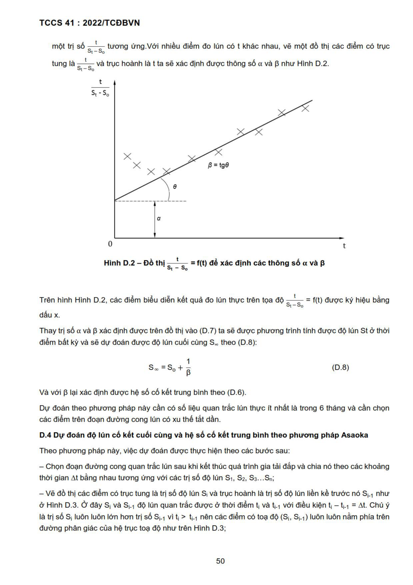

TIÊU CHUẨN CƠ SỞ

TCCS 41:2022/TCĐBVN

BỘ GIAO THÔNG VẬN TẢI — TỔNG CỤC ĐƯỜNG BỘ VIỆT NAM

TIÊU CHUẨN KHẢO SÁT, THIẾT KẾ NỀN ĐƯỜNG Ô TÔ TRÊN NỀN ĐẤT YẾU

Standard for Investigation and Design of Road Embankments on Soft Soils

HÀ NỘI — 2022

## Lời nói đầu

TCCS 41:2022/TCĐBVN do Viện Khoa học và Công nghệ Giao thông vận tải biên soạn, Tổng cục Đường bộ Việt Nam công bố theo Quyết định số 1365/QĐ-CĐBVN ngày 30/11/2022.

Tiêu chuẩn khảo sát, thiết kế nền đường ô tô trên nền đất yếu

Specification for Survey and Design Embankment on Soft Ground

1 Pham vi ap dụng

4.1 Tiêu chuẩn này quy định các yêu cầu cơ ban đối với việc khảo sát, điều tra và thử nghiệm dia ky

thuật trên vùng dat yếu có tuyến đường di qua; quy định các yêu cầu và tiêu chuẩn thiết kế cần phải đảm

bảo đạt được khi thiết kế nền đắp trên đất yếu cùng với các chỉ dẫn về cấu tao và các phương pháp tính

toán tương ứng, cũng như chỉ dẫn việc lựa chọn giải pháp và phạm vi áp dụng của một số giải pháp

thường dùng dé xây dựng nền đắp trên đất yếu.

4.2. Tiêu chuẩn này được áp dung cho công tác khảo sát thiết kế nền đường ôtô đắp trên dat yếu, bao

gồm cả nền đắp đường cao tốc và nền đắp đường ôtô các cấp. Ngoài ra cũng có thể tham khảo áp dụng

đối với nền đường lăn, đường cat hạ cánh của sân bay đắp trên vùng dat yếu.

2 Tài liệu viện dẫn

Các tài liệu viện dẫn sau rất cần thiết cho việc áp dụng tiêu chuẩn này. Đối với các tài liệu viện dẫn ghi

năm công bố thì áp dụng bản được nêu. Đối với các tài liệu viện dẫn không ghi năm công bố thì áp dụng

phiên bản mới nhất bao gồm cả các sửa đồi, bd sung (nếu có).

**TCVN 2683, Dat xây dựng — Lay mẫu, bao gói, vận chuyền và bảo quản mẫu;**

**TCVN 4054, Đường ô tô — Yêu câu thiết ké;**

**TCVN 4197, Dat xây dựng - Phương pháp xác định giới hạn dẻo và giới hạn chảy trong phòng thí nghiệm;**

**TCVN 4199, Dat xây dựng — Phương pháp xác định sức chóng cắt trong phòng thí nghiệm ở may cắt**

phẳng;

**TCVN 4200, Dat xây dựng — Phương pháp xác định tính nén lún trong phòng thí nghiệm;**

**TCVN 4202, Dat xây dựng — Phương pháp xác định khói lượng thé tích trong phòng thí nghiệm;**

**TCVN 5729, Đường cao tốc — Yêu câu thiết kế;**

**TCVN 8868, Thí nghiệm xác định sức kháng cắt không có kết — không thoát nước và cô kết — thoát nước;**

**TCVN 8871, Vải địa kỹ thuật — Phương pháp thử;**

**TCVN 9351, Dat xây dựng — Phương pháp thí nghiệm hiện trường — Thí nghiệm xuyên tiêu chuẩn;**

**TCVN 9352, Dat xây dựng — Phương pháp thí nghiệm xuyên tinh;**

**TCVN 9355, Gia có nên dat yéu bang bắc thắm — Thiết ké, thi công và nghiệm thu;**

**TCVN 9386, Thiết ké công trình chịu động đắt;**

**TCVN 9403, Gia có nên dat yéu — Phương pháp tru dat xi măng;**

**TCVN 9436, Nên đường ô tô — Thi công và nghiệm thu;**

**TCVN 9437, Khoan thăm dò địa chát công trình;**

**TCVN 9842, Xử lý nén đắt yéu bằng phương pháp có kết hút chân không có màng kín khí trong xây dựng**

các công trình giao thông — Thi công và nghiệm thu;

**TCVN 9844, Yêu câu thiết kế, thi công và nghiệm thu vải dia kỹ thuật trong xây dựng nên đắp trên dat**

yếu;

**TCVN 9846, Quy trình thí nghiệm xuyên tĩnh có đo áp lực nước lỗ rỗng (CPTU);**

**TCVN 10184, Dat xây dựng - Thí nghiệm cắt cánh hiện trường cho dat dính;**

**TCVN 11823, Tiêu chuẩn thiết ké cầu đường bộ**

ASTM D 4491, Standard Test Methods for Water Permeability of Geotextiles by Permittivity (Phuong

pháp thử xác định năng thắm nước của vai địa ky thuật bằng thiết bị Permittivity);

ASTM D 4595, Standard Test Method for Tensile Properties of Geotextiles by the Wide—Width Strip

Method (Phương pháp thử xác định chỉ tiêu chịu kéo của vải địa kỹ thuật theo bề rộng của mảnh vải);

ASTM D 4716, Standard Test Method for Determining the (In-plane) Flow Rate per Unit Width and

Hydraulic Transmissivity of a Geosynthetic Using a Constant Head (Phương pháp thử xác định khả năng

thoát nước và độ thám thủy lực của vat liệu địa kỹ thuật tổng hợp sử dụng cột nước không đổi);

ASTM D 4751, Standard Test Methods for Determining Apparent Opening Size of Geotextiles (Phương

pháp thử xác định kích thước lỗ biểu kiến của vai dia ky thuật).

3 Thuật ngữ và định nghĩa

3.1

Dat yếu (Soft soil) hoặc nền dat yếu (Soft ground)

Các loại đất hoặc nền đất có cường độ kháng cat nhỏ và tính biến dạng (nén lún) lớn, do vay nền dap

trên đất yếu, nếu không có các biện pháp xử lý thích hợp thường dễ bị mắt ổn định toàn khối hoặc lún

nhiều, lún kéo dài ảnh hưởng đến mặt đường, công trình trên đường va cả mé cau lân cận (xem thêm

tại 4.1).

3.2

Các phương tiện thoát nước thẳng đứng (Vertical drain)

Các phương tiện thoát nước thẳng đứng thường sử dụng gồm bắc thấm, giếng cát được dùng dé dẫn

nước có áp từ dưới nền đất yếu lên tầng đệm thoát nước phía trên và thoát ra ngoài, nhờ đó tăng tốc độ

cố kết, tăng nhanh sức chịu tải do thay đổi một số chỉ tiêu cơ lý cơ bản của bản thân đất yếu. Cấu tạo

và yêu cầu đối với mỗi loại phương tiện này xem 7.6.5 và 7.6.6.

3.3

Ban thoát nước ngang (Super board drain)

Một dải băng có tiết diện hình chữ nhật, có lõi được cấu tạo thành các rãnh, bên ngoài được bọc vỏ lọc

bằng vải địa kỹ thuật không dệt. Bản thoát nước ngang được dùng để dẫn nước ngang từ trong nền

đường ra ngoài.

3.4

Cọc cát hoặc cọc (trụ) vật liệu hạt rời khác (Granular material column)

Cọc (trụ) bằng cát hoặc vật liệu hạt rời được hình thành trong nền đất yếu bằng các thiết bị cơ giới

chuyên dùng (dé vật liệu rời và đầm chặt); xem 7.8.

3.5

Trụ gia cố chất liên kết (Solidified soil column)

Các trụ hình thành trong nền đất yếu bằng cách sử dụng các thiết bị chuyên dùng để gia cố đất yếu tại

chỗ bằng chat liên kết vô cơ trong phạm vi chiều sâu và đường kính trụ thiết kế; xem 7.9.

3.6

Ap lực tiền cố kết (Preconsolidation pressure)

Áp lực nén lớn nhất tại độ sâu z mà đất đã từng chịu trong quá trình hình thành và tồn tại của nó (ký hiệu

là Opz).

4 Nhận dạng đất yếu và yêu cầu chung đối với công tác khảo sát thiết kế nền đắp trên

đất yếu

4.1 Nhận dạng dat yếu theo hệ số rỗng và cường độ kháng cắt

Loại đất sét hoặc sét pha, được xem là đất yếu nếu ở trạng thái tự nhiên, độ 4m của chúng gần bằng

hoặc cao hơn giới hạn chảy, hệ số rỗng lớn (sét có e > 1,5, sét pha có e > 1,0), lực kháng cắt < 15 kPa,

góc ma sát trong @ < 10° (theo phương pháp cắt nhanh không thoát nước trong phòng) hoặc C, < 35

kPa (theo phương pháp cắt cánh hiện trường); có sức chống mũi xuyên tĩnh q, = 0,1 MPa (theo két qua

xuyên tinh); có chỉ số xuyên tiêu chuẩn SPT là N < 5 (theo kết quả thí nghiệm xuyên tiêu chuẩn SPE:

Dat yếu dưới dạng bùn cat, bùn cát mịn (hệ số rỗng e > 1,0; độ bão hòa G > 0,8) được hình thành ở các

vùng thung lũng.

Loại đất hữu cơ thường hình thành từ đầm lầy, nơi nước tích đọng thường xuyên, mực nước ngầm cao,

tại đây các loài thực vat phát triển, thối rữa và phân huỷ, tạo ra các vat lắng hữu cơ lẫn với các trầm tích

khoáng vật. Loại này thường gọi là đất đầm lầy than bùn, hàm lượng hữu cơ chiếm tới 20 + 80 %, thường

có màu đen hay nâu sam, cấu trúc không mịn. Đối với loại này thường được xem là đất yếu néu hệ số

rỗng và các đặc trưng sức kháng cắt của chúng cũng đạt các trị số như nêu tại 4.1.

Đất yếu đầm lầy than bùn còn được phân theo tỷ lệ lượng hữu cơ có trong chúng:

— Lượng hữu cơ có từ (20 + 30) %: Đất nhiễm than bùn.

— Lượng hữu cơ có từ (30 + 60) %: Dat than bùn.

— Lượng hữu cơ > 60 %: Than bùn.

4.2 Nhận dạng dat yếu theo trạng thái tự nhiên

Để đánh giá sơ bộ về tính chất công trình của đất yếu, từ đó bước đầu xem xét các giải pháp thiết kế

nền đường tương ứng, đất yếu được nhận dạng theo độ sệt (B) như sau:

~~ 1

“WLW, (1)

Trong đó: W, Wp, W, là độ ẩm ở trạng thái tự nhiên, giới hạn dẻo và giới hạn chảy của dat yéu (xác định

theo TCVN 4197), %;

Nếu B > 1: Dat yếu ở trạng thái chảy (được gọi là bùn sét);

Nếu 0,75 < B< 1: Đất yếu dẻo chảy.

Dat có nguồn gốc hữu cơ thường hình thành từ đầm lầy, có hàm lượng hữu cơ chiếm tới (20 + 80) %,

thường có màu den hay nâu sam, cấu trúc không mịn (vì lẫn các tàn dư thực vat) được gọi là đất dam

lầy than bùn. Đối với loại này thường được xem là đất yếu nếu hệ số rỗng và các đặc trưng cường độ

kháng cắt của đất cũng đạt các trị số như nêu tại 4.1.

Ở trạng thái tự nhiên, đất đầm lầy than bùn được phân thành loại |, II, III:

~ Loại |: Loại có độ sệt ổn định; thuộc loại này nếu vách đất đào thẳng đứng sâu 1 m trong chúng vẫn

duy trì được ổn định trong 1 + 2 ngày;

— Loại II: Loại có độ sệt không ổn định; loại này không đạt tiêu chuẩn loại I nhưng đất than bùn chưa ở

trạng thái chảy;

~— Loại Ill: Đất than bùn ở trạng thái chảy.

4.3 Các yêu cầu chung về khảo sát thiết kế

4.3.1. Khi tuyến đường di qua vùng đất yếu quy định tại 4.1 và 4.2 thì cần phải có biện pháp khảo sát

thiết kế tương ứng để đảm bảo nền đường ổn định về cường độ và biến dạng, kể cả trường hợp phía

trên các lớp dat yếu đó có tồn tại một lớp đất không yếu. Cụ thé là phải đảm bảo cho kích thước và các

yếu tố hình học của nền đường trên vùng dat yếu luôn duy trì được đúng thiết kế trong quá trình thi công

nền đắp cũng như trong quá trình khai thác sau đó.

4.3.2 Riêng với các công trình đường cao tốc và các công trình có ý nghĩa đặc biệt khác, nếu chiều

cao nền đắp cao từ 4 m trở lên đắp trên các loại đất sét và sét pha dẻo mềm (có độ sệt B trong phạm vi

từ 0,5 đến 0,75) cũng nên áp dụng các biện pháp khảo sát thiết kế như với đất yếu.

5_ Các yêu cầu về khảo sát phục vụ việc thiết kế nền đường qua vùng đất yếu

5.1 Các yêu cầu chung về công tác khảo sát

Phải điều tra xác định được nguồn gốc hình thành, phạm vi phân bố của các vùng đất yếu, chiều sâu

phân bó, cả các lớp đất khác nhau trong vùng đất yếu từ trên xuống dưới gồm cả lớp vỏ cứng (nếu có)

các lớp cát xen kẹp và độ dốc ngang đáy lớp đất yếu dưới cùng.

Cần điều tra xác định nguồn gây ẩm, khả năng thoát nước, cũng như vị trí và khả năng khai thác các mỏ

đất dùng để đắp nền đường.

Phải lấy mẫu thí nghiệm, tiến hành các thí nghiệm trong phòng và thực hiện các thí nghiệm hiện trường

cần thiết về địa kỹ thuật để xác định được loại đất yếu và các chỉ tiêu nêu tại 4.1, 4.2.

Ÿ

Trường hợp đắp mở rộng nền đường cũ, cần tiến hành điều tra các nội dung nêu trên trong phạm vi

phần nền đắp mở rộng và cả dưới phạm vi nền đắp cũ.

5.2 Các quy định về khảo sát địa hình

5.2.1 Khi tiến hành thiết kế cơ sở phục vụ lập dự án đầu tư, đối với vùng đất yếu phải đo đạc lập được

bình đồ tỷ lệ từ 1:500 đến 1:1000 với chênh lệch các đường đồng mức 0,50 m dọc theo các phương án

tuyến qua vùng đất yếu. Trường hợp vùng dat yếu phân bố rộng (như vùng đầm lầy...) thì cũng có thé

sử dụng phương pháp đo đạc hàng không dé khảo sát địa hình, địa mạo của cả khu vực. Trong giai

đoạn này, các mặt cắt dọc và mặt cắt ngang phục vụ cho việc thiết kế tính toán nền đắp trên đất yếu có

thể được xác định thông qua bình đồ địa hình đã lập.

5.2.2. Trong giai đoạn thiết kế kỹ thuật và thiết kế lập bản vẽ thi công phải đo đạc mặt cắt dọc và mat

cắt ngang theo tuyến đường thiết kế với các cọc chỉ tiết có cự ly tương ứng với quy định ở mỗi giai đoạn,

ngoài ra cần bổ sung các cọc tại vị trí khoan thăm dò, lầy mẫu thí nghiệm đắt yếu và tại vị trí dự kiến bố

trí các hệ thống quan trắc nêu tại 6.3.

5.3. Các quy định về khảo sát va thí nghiệm địa kỹ thuật

5.3.1 Dé đạt được các yêu cầu nêu tại 5.1 cần kết hợp thăm dò không lấy mẫu thí nghiệm (bằng các

thiết bị xuyên tĩnh (TCVN 9352), xuyên tiêu chuẩn SPT (TCVN 9351) hoặc cắt cánh tại hiện trường

(TCVN 10184)) và thăm dò có lay mẫu thí nghiệm (bằng thiết bị khoan lấy mẫu nguyên trạng đem về thi

nghiệm trong phòng) sao cho tiết kiệm nhất. Với diện thăm dò rộng trong giai đoạn lập thiết kế cơ sở,

nên tận dụng tối đa các biện pháp thăm dò không lấy mẫu thí nghiệm kết hợp với khoan lấy mẫu thí

nghiệm ở mức độ tối thiểu. Trong giai đoạn thiết kế kỹ thuật và thiết kế chi tiết lập bản vẽ thi công phải

bổ sung bằng biện pháp khoan lấy mẫu thí nghiệm, chỉ bổ sung thăm dò không lấy mẫu thí nghiệm khi

thật cần thiết (khi cần mở rộng diện thăm dò hoặc khi việc thăm dò không lấy mẫu thí nghiệm ở giai đoạn

lập dự án chưa đủ như nêu tại 5.3.2).

5.3.2 Bố trí khoan thăm dò

5.3.2.1. Bước thiết kế cơ sở phục vụ lập dự án đầu tư

Sau khi tiến hành thăm dò không lấy mẫu nguyên trạng đã phát hiện đất yếu thì tiến hành khoanh vùng

và bố trí lỗ khoan trên tim tuyến với khoảng cách từ 250 m đến 500 m (nếu cần thiết có thể bổ sung các

điểm thăm dò như cắt cánh, xuyên dé phát hiện phạm vi đất yếu).

5.3.2.2 Bước thiết kế kỹ thuật

Công tác thăm dò địa chất công trình bằng những lỗ khoan được bố trí cách nhau thông thường từ (100

+ 150) m trên tim tuyến (trong đó kể cả khối lượng đã tiến hành ở bước lập thiết kế cơ sở). Với đường

cao tốc và đường 6 tô cấp III trở lên (và tương đương) bố trí lỗ khoan cách nhau 100 m. Trong trường

hợp đặc biệt, cự ly này có thé rút ngắn hon.

Tiến hành khoan thăm dò mặt cắt địa chất công trình theo chiều ngang vuông góc tim tuyến, trên đó ít

nhất có 3 lỗ khoan. Với đường cao tốc và đường ô tô cấp III (và tương đương) trở lên, khoảng cách giữa

các mặt cắt địa chất công trình dọc theo tuyến từ (150 + 300) m. Trường hợp nền đắp mới, bố trí 1 lỗ

khoan ở tim đường và 2 lỗ còn lại ở hai bên đường. Trường hợp nền đắp mở rộng, bố trí 1 lỗ khoan ở

giữa phần đường cũ, 1 lỗ khoan ở vai ngoài phần đường mở rộng và 1 lỗ ở vai ngoài nền đường cũ

(mép tiếp xúc giữa nền đường cũ và nền đắp mở rộng). Tuy nhiên, mỗi phân đoạn đắt yếu thiết kế phải

có tối thiểu hai mặt cắt ngang địa chat đại diện. Với các đường ô tô từ cấp IV trở xuống sé lỗ khoan trên

mỗi mặt cắt không nhỏ hơn 1 lỗ khoan.

Độ sâu khoan thăm dò phải đến dưới đáy lớp đất yếu sâu vào lớp dat không yéu thêm tối thiểu 3,0 m

hoặc nếu đất yếu có chiều dày lớn thì khoan đến hết phạm vi chịu ảnh hưởng của tải trọng đắp cộng

thêm 3,0 m nữa. Phạm vi này được xác định tương ứng với độ sâu tại đó có áp lực do tải trọng đắp (do

nền dap và phan đắp gia tải trước nếu có) gây ra bằng 0,15 áp lực do trọng lượng bản thân dat yếu gây

ra.

Trong mọi trường hợp cần tiến hành thí nghiệm cắt cánh hiện trường theo TCVN 10184. Thí nghiệm này

có thể được tiến hành độc lập hoặc trong lỗ khoan.

5.3.2.3 Bước khảo sát lập bản vẽ thi công

Thường chỉ sử dụng kết quả các lỗ khoan hoặc các thí nghiệm hiện trường đã tiến hành ở bước thiết kế

kỹ thuật. Khối lượng khảo sát chỉ bổ sung cho bước thiết kế kỹ thuật chưa thực hiện hết theo quy định.

Trong trường hợp đặc biệt khi phát hiện thêm vi trí đất yếu và trường hợp thiết kế đường cao tốc hoặc

các đường cấp cao khác thì có thể đề xuất tăng khối lượng khảo sát địa chất.

5.3.3 Mặt cắt thăm dò (bao gồm: cắt cánh và có khoan lấy mẫu) phải được bố trí ở chỗ đắp cao nhát,

chiều sâu đất yếu lớn và có sự phân bố các lớp đất yếu điển hình nhát.

5.3.4 Công tác khoan thăm dò, lấy mẫu và bảo quản mẫu được thực hiện theo các tiêu chuẩn hiện

hành (TCVN 9437, TCVN 2688).

5.3.5 Việc thí nghiệm xác định các chỉ tiêu cơ lý của đất yếu phải được thực hiện với các mẫu nguyên

trạng đã lấy theo các quy định sau:

— Các chỉ tiêu phục vụ cho việc tính toán kiểm tra mức độ ổn định của nền đắp trên đất yếu: Cường độ

kháng cắt không thoát nước được xác định bằng phương pháp cắt cánh tại hiện trường (TCVN 10184)

hoặc được xác định bằng phương pháp cắt phẳng (TCVN 4199) hoặc nén ba trục trong phòng thí nghiệm

(TCVN 8868); trọng lượng thể tích tự nhiên (vy) (TCVN 4202) và mức nước ngầm. Các chỉ tiêu này phải

được xác định riêng cho mỗi lớp đất yếu khác nhau. Xác định các chỉ tiêu cường độ kháng cắt (c), góc

ma sát trong (@) và trọng lượng thé tích đối với đất dùng để đắp nền đường (ứng với trạng thái chặt và

Am của đất dap);

— Các chỉ tiêu phục vụ cho việc tính toán dự báo độ lún tổng cộng và độ lún cố kết theo thời gian như:

hệ số rỗng ban đầu eo, chỉ số nén lún C, va C„, hệ số cố kết theo phương thẳng đứng C, và áp lực tiền

cố kết ơp; được xác định thông qua thí nghiệm xác định tính nén lún trong điều kiện không nở hông

(TCVN 4200) và Phụ lục A. Các chỉ tiêu này cũng phải được xác định riêng cho mỗi lớp đất yếu khác

nhau (ý nghĩa ký hiệu các chỉ tiêu nêu trên xem tại Điều 9).

Trường hợp giải pháp thiết kế xử lý nền đất yếu bằng bac thám, giếng cát hay cố kết hút chân không

được lựa chọn, với các tuyến đường cao tốc hay các công trình có ý nghĩa đặc biệt, có thể xem xét bổ

sung một số điểm thí nghiệm xuyên tĩnh kết hợp đo áp lực nước lỗ rỗng tại các vị trí dự báo lún nhiều và

điều kiện địa kỹ thuật phức tap, làm cơ sở đánh giá độ cố kết dé xem xét dỡ tải, đánh giá hiệu quả xử lý

nền dat yếu.

5.3.6 Việc thí nghiệm xác định các chỉ tiêu cơ lý của đất hoặc cát đắp nền đường cũng được thực hiện

theo các tiêu chuẩn tương ứng nêu tại 5.3.5 với các mẫu chế bị bằng vật liệu đắp lấy từ mỏ đất hoặc cát

có độ chat và độ ẩm tương ứng như ở quy định kỹ thuật của dự án. Riêng với chỉ tiêu sức kháng cắt thì

chỉ áp dụng phương pháp cắt không cố kết không thoát nước.

5.3.7 Đối với mỗi lớp đất yếu, mỗi chỉ tiêu đưa vào tính toán cần có ít nhát 6 số liệu thí nghiệm và trị số

tính toán được xác định theo biểu thức:

At = Ath + ð (2)

Trong đó:

At là trị số tinh toán của chi tiêu;

A là trị số trung bình số học của các số liệu thí nghiệm;

õ là độ lệch chuẩn.

&#124; n 2

ö= » (Ai— Ap) (3)

n-1

Trong đó:

Ai là trị số của chỉ tiêu mỗi lần thí nghiệm xác định được;

Aw __ là trị số trung bình của các chỉ tiêu thí nghiệm xác định được;

n là số lần thí nghiệm đối với mỗi chỉ tiêu.

Khi quyết định chọn trị số tính toán của một chỉ tiêu, cần phân tích kỹ các điều kiện thực tế ảnh hưởng

đến chất lượng mẫu dat yếu trước khi đem thí nghiệm cũng như ảnh hưởng bat lợi của mỗi chỉ tiêu đó

đến kết quả tính toán, kết hợp với kinh nghiệm của các chuyên gia địa kỹ thuật.

6 Các yêu cầu và tiêu chuẩn thiết kế nền đắp trên đất yếu

6.1 Cac yêu cầu về ổn định

Nền đắp trên đất yếu phải đảm bảo ổn định, không bị phá hoại do trượt trồi trong quá trình thi công đắp

và trong suốt quá trình đưa vào khai thác sử dụng sau đó. Để đảm bảo yêu cầu này phải đảm bảo được

đồng thời các tiêu chuẩn cụ thể dưới đây:

6.1.1 Mức độ ổn định dự báo theo kết quả tính toán đối với mỗi đợt đắp (đắp nền và đắp gia tải trước)

và đối với nền đắp theo thiết kế phải bằng hoặc lớn hơn mức độ ổn định tối thiểu quy định dưới đây:

~— Hệ số ổn định nhỏ nhất trong quá trình thi công: Kmin = 1,20;

— Hệ số ổn định nhỏ nhất trong quá trình khai thác: Kmin = 1,40;

— Khi xét đến tải trọng động dat thì các hệ số ổn định Kmin nêu trên được giảm đi 0,1.

6.1.2 Số liệu quan trắc lún theo phương thẳng đứng va quan trắc chuyển vị ngang của vùng đất yếu

hai bên nền đắp trong quá trình đắp nền và đắp gia tải trước phải không được vượt quá trị số quy định

dưới đây:

— Tốc độ lún ở đáy nền đắp tại mọi vị trí quan trắc không được vượt qua (10 + 15) mm/ngày;

— Tốc độ chuyển vị ngang của các cọc quan trắc đóng hai bên nền đắp không được vượt quá 5 mm/ngày;

— Cách bố trí quan trắc lún và quan trắc chuyển vị ngang được nêu tại 6.3.1 và 6.3.3.

6.2 Các yêu cầu và tiêu chuẩn tính toán lún

6.2.1 Phải tính toán dự báo được độ lún tổng cộng S kể từ khi bat đầu đắp nền cho đến khi lún hết

hoàn toàn. Đắp phòng lún cần đắp rộng thêm bề rộng đáy nền đắp so với bề rộng thiết kế và đắp cao

hơn S (m) so với chiều cao nền đắp thiết kế như trên Hình 1.

A __ | ee

Ny + =

m.Sch a) =

> ees =

CHÚ DÃN:

1/m: Độ dốc ta luy nền đắp thiết kế; 1/n: Độ dốc ta luy nền đắp dự phòng lún;

Bu: Bề rộng đỉnh nền đắp thiết kế (m); Hx: Chiều cao nền đắp thiết kế (m);

S, S, và Sạ,: Độ lún tổng cộng tại tim, vai nền đắp và tại chân ta luy của nền đường, được tinh theo

trình tự ở Điều 9.2.3 và 9.2.4 (m).

Hình 1 — Mặt cắt nền đắp dự phòng lún (đường nét đứt)

Bề rộng phải đắp thêm mỗi bên tại đáy nền đắp được xác định theo biểu thức:

Dm = Sch .m (4)

Trong đó:

bạ _ bề rộng phải đắp thêm mỗi bên tại đáy nền đắp, (m);

Sch __ là độ lún tổng cộng tại chân ta luy của nền đường, (m);

1/m:_ Độ dốc ta luy nền đắp thiết kế.

CHÚ THÍCH: S,, luôn luôn nhỏ hơn S và độ dốc taluy đắp 1/n sẽ dốc hơn độ déc ta luy thiết kế 1/m.

6.2.2 Khi tính toán độ lún tổng cộng nêu trên thì tải trọng gây lún phải xét đến tải trọng nền mặt đường

thiết kế bao gồm cả phần đắp bù lún, phan đắp phản áp (nếu có), không bao gồm phan đắp gia tải trước

(nếu có) và không xét đến tải trọng phương tiện giao thông.

6.2.3. Sau khi hoàn thành công trình nền mặt đường xây dựng trên vùng đất yếu, phần độ lún cố kết

AS tiếp tục xảy ra sau đó tại mọi vị trí của nền đường trong thời hạn khai thác sử dụng t là 15 năm với

kết cấu mặt đường mềm và 30 năm với kết cấu mặt đường cứng được cho phép như trong Bảng 1.

Bảng 1 — Phần độ lún cố kết cho phép còn lại AS tại mọi vị trí của đoạn nén đắp trên đất yếu

trong thời hạn t năm sau khi thi công xong kết cấu mặt đường

Vị trí đoạn nền đắp trên đất yếu

Loại, cấp đường `

Đoạn gần | Đoạn hai bên cống | Các đoạn nén đắp

mé cau hoac céng chui thông thường

1. Đường cao tốc, đường ô tô các cấp

có tốc độ thiết kế > 80 km/h và có tầng < 10 cm < 20 cm < 30 cm

mặt cấp cao A1

2. Đường có tốc độ thiết kế < 60 km/h

-= mm < 20cm < 30 cm < 40 cm

và có tang mat cap cao A1

CHÚ THÍCH:

— Phần độ lún cố kết còn lại AS là phan lún cố kết chưa hết sau khi làm xong áo đường của đoạn nền đắp trên đất

yếu. Trị số AS được xác định theo công thức (36) tùy thuộc độ cố kết U đạt được vào thời điểm làm xong kết cấu

mặt đường.

— Chiều dài đoạn nền đường gần mé cầu va hai bên cống được xác định bằng chiều dài đoạn chuyển tiếp giữa

đường và cầu (cống) theo Phụ lục E nhưng không nhỏ hơn 3 lần chiều cao nền đắp sau mồ cầu cộng thêm (3 + 5)

m và không nhỏ hơn 2 lần chiều cao nền đắp hai bên cống cộng thêm bề rộng khẩu độ cống.

6.2.4 Đối với các đường xây dựng mới có tốc độ thiết kế từ 40 km/h trở xuống và đường chỉ sử dung

kết cấu mặt đường mềm cấp cao A2 trở xuống thì vấn đề độ lún còn lại khi thiết kế là do cơ quan có

thẩm quyền quyết định nhằm giảm chi phí xử lý nền dat yếu.

6.2.5 Đối với các tuyến đường có ý nghĩa, vai trò đặc biệt quan trọng, cơ quan nhà nước có thẩm

quyền có thể xem xét nâng cao yêu cầu chống biến dạng (lún) của nền đường thông qua việc hạn chế

độ lún cố kết còn lại AS cho phép sau khi làm xong kết cấu mặt đường của đoạn nền đắp trên đất yếu.

6.2.6 Yêu cầu về quan trắc dự báo lún

Ngoài việc tính toán dự báo độ lún tổng cộng nêu tại 9.2 để làm cơ sở cho việc đề xuất các giải pháp xử

lý và cấu tạo nền đắp trên đất yếu, còn phải dựa vào kết quả quan trắc lún theo các quy định tại 6.3.1 và

6.3.2 để so sánh, đối chiếu và hiệu chỉnh lại kết quả dự báo theo tính toán nhằm kiểm tra độ lún và tốc

độ lún cho phép quy định tại 6.1.2 và 6.2.3, cũng như để xác định khối lượng vật liệu đắp bù lún thực tế.

Yêu cầu cụ thể của việc quan trắc lún là:

— Xác định được khối lượng vật liệu đắp lún chìm vào trong đất yếu (so với mặt đất tự nhiên trước khi

đắp).

— Vẽ được biểu đồ quan hệ giữa độ lún tổng cộng S với thời gian (có ghi rõ thời gian từng đợt đắp nền

và đắp gia tải). Dựa vào biểu đồ này dé xử lý tách riêng một cách gần đúng các phần lún tức thời (là các

phan lún tăng đột ngột trong thời gian các đợt đắp) và lập ra biểu đồ lún cố kết S; theo thời gian t kể từ

khi kết thúc quá trình đắp nền và đắp gia tải trước.

— Dựa vào đường cong lún cố kết theo thời gian trên biểu đồ có thể dự báo phần độ lún cố kết còn lại

theo các phương pháp chỉ dẫn tại Phụ lục D.

6.3 Các yêu cầu về thiết kế và bó trí hệ thống quan trắc trong quá trình thi công nén đắp trên

đất yếu

6.3.1 Đối với công trình xây dựng nền dap trên đất yếu, trong mọi trường hợp, dù áp dụng giải pháp

xử lý nào, dù đã khảo sát, tính toán kỹ vẫn phải thiết kế hệ thống quan trắc, chỉ trừ trường hợp áp dụng

giải pháp đào vét hết đất yếu, hạ đáy nền đắp đến tận lớp đất không yếu. Hệ thống này tuân theo các

quy định tại 4.1.5.8 của TCVN 9355 (Mốc quan trắc lún và chuyển vị ngang, thiết bị đo áp lực nước lỗ

rỗng, thiết bị đo chuyển vị ngang theo chiều sâu...).

6.3.2 Phải quy định chế độ quan trắc ngay trong đồ án thiết kế:

— Ðo cao độ lúc đặt bàn lún và đo lún mỗi ngày một lần trong quá trình đắp nền và đắp gia tải trước, néu

đắp làm nhiều đợt thì mỗi đợt đều phải quan trắc hàng ngày.

— Khi ngừng đắp và trong 2 tháng sau khi đắp phải quan trắc hàng tuần; tiếp đó quan trắc hang tháng

cho đến hết thời gian bảo hành và bàn giao cho phía quản lý khai thác đường cả hệ thống quan trắc (để

họ tiếp tục quan trắc néu thay cần thiết).

— Độ chính xác yêu cầu phải đến mm.

6.3.3 Khi áp dụng các giải pháp xử lý nền đắp trên đất yếu có đòi hỏi phải khống chế tốc độ đắp, ngoài

thiết kế hệ thống quan trắc lún cần phải thiết kế hệ thống quan trắc chuyển vị ngang dé theo dõi mức độ

ổn định trong quá trình đắp như nêu tại 6.1.2. Hệ thống này được bố trí tuân theo các quy định tại

4.1.5.8.1 của TCVN 9355.

Trong quá trình đắp nền và dap gia tải trước (nếu có) hang ngày phải do được sự chuyển vị ngang (di

chuyển ngang theo hướng thẳng góc với tim nền đường) của chốt đánh dấu trên đỉnh tất cả các cọc nêu

trên đồng thời phải đo cao độ đỉnh cọc dé theo dõi bề mặt đất yếu có bị day trồi lên không. Các phương

tiện đo đạc được chỉ ra trong đồ án thiết kế, phải đảm bảo sai số về đo cự ly là + 5 mm. Sau khi đắp

xong, hàng tuần phải tiếp tục quan trắc cho đến khi thấy rõ nền đường đã ổn định.

6.3.4 Đối với các đoạn nền đắp trên đất yếu có quy mô lớn và quan trọng hoặc có điều kiện địa chat

phức tạp như đoạn có chiều cao đắp lớn, hoặc phân bố các lớp địa chất không đồng nhất (có lớp vỏ

cứng...) khiến cho thực tế có những điều kiện khác nhiều với các điều kiện dùng trong tính toán ổn định

và lún thi tư van có thé đề xuất yêu cầu bé trí thêm hệ thống quan trắc áp lực lỗ rỗng (cùng với các điểm

quan trắc mức nước dâng trong lỗ khoan), hệ thống quan trắc chuyển vị ngang, quan trắc lún ở các độ

sâu khác nhau, cùng hệ thống các thiết bị quan trắc khác (tham khảo Điều 4.1.5.8 của TCVN 9355). Nhờ

có hệ thống các thiết bị quan trắc này, dễ dàng thực hiện được các yêu cầu nêu tại 6.1 và 6.2 và nhờ đó

tạo điều kiện thuận lợi cho việc rút ngắn thời gian thi công công trình. Trong trường hợp này, việc thiết

kế bố trí lắp đặt các hệ thống thiết bị quan trắc nêu trên và thiết kế chế độ quan trắc được xem là các nội

dung thiết kế riêng (cần đưa vào hồ sơ thiết kế).

6.3.5 Phải có biện pháp chống đỡ bảo đảm không bị nghiêng, lệch, gãy cần đo lún trong quá trình thi

công đắp nền. Hàng ngày phải thường xuyên kiểm tra ống bảo vệ cần đo lún, không để cát làm tắc hoặc

nghiêng lệch chạm vào cần đo lún. Khi chuyển từ thi công nền sang thi công mặt, phải có biện pháp cắt,

chèn lắp ống, đắp một lớp đủ day trên đầu ống.

6.4 Xác định các tải trọng tính toán

6.4.1 Khi kiểm tra ổn định nền đắp trong quá trình thi công thì tải trong tính toán phải xét đến gồm tải

trọng nền đắp đã bù lún, đắp gia tải trước (nếu có) và cả tải trọng xe cộ. Khi kiểm tra ổn định nền đắp

1g

lúc áo đường đưa vào khai thác thì phải xét đến tải trọng nền đường đã bù lún, kết cấu áo đường, tải

trọng xe cộ và tải trọng động đắt.

Khi tính toán lún thì tải trọng phải xét đến như đã nêu tại 6.2.2. Vì việc tính toán đều đưa về bài toán

phẳng, do vậy các tải trọng tính toán đều được xác định tương ứng với phạm vi phân bố trên 1 m dài

nền đường.

6.4.2 Tải trọng đắp nền và đắp gia tải trước được xác định đúng theo hình dang đắp trên thực tế (hình

thang với mái dốc có độ dốc thiết kế, có thể có thêm phản áp hoặc trong trường hợp đào bớt đất yếu

trước khi đắp thì mặt đất tự nhiên ở hai bên được lấy phẳng đúng như thực tế). Phần đất lún vào đất

yếu trong quá trình đắp được tính vào tải trọng đắp (xem 9.2.3).

6.4.3 Tải trọng xe cộ được xem là tải trọng của số xe nặng tối da cùng một lúc có thể đỗ khắp bề rộng

nền đường (xem Hình 2) phân bố trên 1 m chiều dài đường; tải trọng này được quy đổi tương đương

như một lớp đất phân bố đều có chiều cao là h„ xác định theo biểu thức sau:

Bie: n.© (5)

x” y. Br.

Trong do:

G là trọng lượng một xe (chon xe nặng nhất) (KN);

n là số xe tối đa có thể xếp được trên phạm vi bề rộng nền đường (như sơ đồ xếp xe trên

Hình 2);

y_ là trọng lượng thé tích của đất đắp nền đường (kN/m$);

&#124; là phạm vi phân bố tải trong xe theo hướng dọc (m).

Có thể lấy | = 4,2 m với xe G = 130 KN, lấy | = 6,6 m khi xe có G = 300 KN, lấy | = 4,5 m với

xe xích có G = 800 kN.

B; bề rộng phân bố ngang của các xe (m). B; được xác định theo biểu thức sau:

B:=n:b#(n-1):d+e (6)

Trong đó thường lấy b = 1,8 m với các loại ô tô, b = 2,7 m với xe xích; d là khoảng cách ngang

tối thiểu giữa các xe (thường lấy d = 1,3 m); e là bề rộng lốp đôi hoặc vệt bánh xích (thường lấy

e = (0,5 + 0,8) m); còn n được chọn tối đa nhưng phải bảo đảm B, tính được theo công thức (6)

vẫn nhỏ hơn bề rộng nền đường.

; L—m

—L_—x

b)

e2|| b d b e2

&#124; Br

Hình 2 - Sơ đồ xếp xe để xác định tải trọng xe cộ tác dụng lên dat yếu

a) Theo hướng doc;  b) Trên mặt cắt ngang

6.4.4 Tải trọng động đất được kể đến khi tính toán kiểm tra mức độ ổn định của nền đắp trên đất yếu

chính là lực quán tính do động đất của bản thân khối trượt, lực này xem như tỷ lệ thuận với trọng lượng

bản thân khối trượt.

W,=K. Q, Œ)

Trong đó:

W; là tải trọng (lực) động đất tác dụng trên một mảnh trượt i (hoặc khối trượt i) (KN);

Wj co điểm đặt là trọng tâm mảnh (hoặc khối trượt) và có phương nằm ngang từ phía

trong nền đường ra phía ngoài mái ta luy nền dap (KN);

Q, __ là trọng lượng của mảnh trượt i (hoặc khối trượt i) (KN);

K là hệ số xét đến động dat, K= a / g.

Trong đó:

a là đỉnh gia tốc nền, tham khảo Phụ lục G, H của TCVN 9386 (m/s?);

g là gia tốc trọng trường (9,81 m/s?).

Chỉ những vùng có thể có động đất từ cấp 7 trở lên thì khi tính toán mới phải xét đến lực động đắt.

7 Các giải pháp thường áp dụng khi thiết kế nền đắp trên đất yếu

7.1 Yêu cầu chung đối với cấu tạo nền đắp trên đất yếu

7.1.1 Cấu tạo của nền đắp trên đất yếu phải bảo đảm hạn chế được các tác dụng bat lợi của nước

ngập và nước ngầm:

— Dat đắp phải dùng phù hợp với các yêu cầu tại TCVN 9436.

— Độ chặt, chiều cao đắp tối thiểu trên nước ngập và mức nước ngầm cùng các yêu cầu cấu tạo khác

của nền đường (như đắp bao ta luy khi thân nền đường là cát...) đều phải tuân theo các quy định tại

**TCVN 9436.**

7.1.2 Trong phạm vi 20 m từ chân ta luy nền đắp ra mỗi bên nên san lắp các chỗ trũng (ao, chuôm...)

và tuyệt đối không đào lấy dat trong phạm vi đó. Nếu không có điều kiện san lắp các chỗ trũng thì khi

kiểm toán ổn định phải xét đến sự có mặt của các chỗ trũng đó.

7.1.3 Cố gắng giảm chiều cao nền đắp dé tạo điều kiện dễ bảo đảm ổn định và giảm độ lún; tuy nhiên,

trừ trường hợp đường tạm, chiều cao nền dap tối thiểu phải từ (1,2 + 1,5) m kể từ chỗ tiếp xúc với đất

yếu, hoặc phải là (0,8 + 1,0) m kể từ bề mặt tầng đệm thoát nước (nếu có) để đảm bảo phạm vi khu vực

tác dụng của nền mặt đường không bao gồm vùng đất yếu.

7.2 Đắp trực tiếp trên đất yếu

7.2.1 Khi tính toán ổn định và lún của nền đắp trên nền đất yếu đều thoả mãn được các yêu cầu va

tiêu chuẩn nêu tại 6.1 và 6.2 thì có thể áp dụng giải pháp đắp trực tiếp (không dùng một biện pháp xử lý

nào khác).

Trong mọi trường hợp đắp trực tiếp trên đất yếu đều nên có tang đệm day tối thiểu 50 cm và rộng thêm

so với chân ta luy nền đắp mỗi bên (0,5 + 1,0) m, có độ chặt K = 0,95 hoặc thay thế tầng đệm này bằng

các kết cấu đường tạm có dùng vải địa kỹ thuật (trong trường hợp cần phải làm đường tạm ngay trên

nền đất yếu để phục vụ thi công) như trong Bảng 2, tầng đệm có thể đắp bằng cát (kể cả cát hạt mịn

hoặc hỗn hợp cát sỏi thiên nhiên), xỉ lò cao hoặc đá dăm có cỡ hạt lớn nhất nhỏ hơn 50 mm.

7.2.2 Các trường hợp sau đây có thể xét tới việc áp dụng giải pháp đắp trực tiếp:

— Trên vùng dat yếu có lớp dat không thuộc các loại dat yếu nêu tại 4.2 (thực tế thường gọi là lớp vỏ trên

bề mặt đất yếu). Nếu lớp vỏ dày (1 + 2) m thì chiều cao nền đắp trực tiếp có thể tới (2 + 3) m, nếu lớp vỏ

dày trên 2 m thì chiều cao đắp trực tiếp có thể tới (3 + 4) m.

— Trên vùng than bùn loại | hoặc đất yếu dẻo mềm có bề dày than bùn dưới (1 + 2) m.

— Trên vùng bùn cát, bùn cát mịn (loại này có hệ số cố kết thường lớn nên lún nhanh).

Ngoài ra, đối với các trường hợp nền đắp được dự báo lún ít và lún nhanh nhưng nếu đắp ngay đến đủ

cao độ thiết kế sẽ không bảo đảm ổn định theo yêu cầu nêu tại 6.1.1 thì vẫn có thể áp dụng giải pháp

đắp trực tiếp kèm với biện pháp khống ché tốc độ đắp (đắp từng dot; giữa các đợt đắp có thời gian chờ

cố kết) để bảo đảm yêu cau ổn định (xem 6.1.2) chỉ trừ khi việc khống ché tốc độ đắp dẫn tới quá kéo

dài thời gian, không bảo đảm được yêu cầu về tiến độ thi công đối với toàn bộ công trình đường thì mới

cần nghĩ đến các giải pháp xử lý khác.

7.2.3 Khi thực hiện công nghệ đắp cần bảo đảm được các điều kiện sau:

— Dap bờ, hút khô nước trên bề mặt đất yếu.

— Vật liệu đắp phải là loại ổn định nước tốt như cát các loại, cấp phối sỏi cuội, đá hoặc các phế liệu công

nghiệp, ...

— Phần được dap lấn chỉ là phần nằm dưới mặt dat yếu tự nhiên và việc lu lèn vẫn phải thực hiện từ nhẹ

(máy ủi...) đến nặng (lu nặng) cho đến khi vật liệu đắp không tiếp tục lún vào đất yếu nữa, tức là đến khi

tạo được mặt bằng thi công vững chắc trên đất yếu.

— Phần nền đắp kể từ mặt đất tự nhiên trở lên phải được dap từng lớp va bảo đảm đạt được yêu cầu

đầm nén quy định.

7.2.4 Để tạo điều kiện thi công đắp trực tiếp trên đất yếu được thuận lợi (tạo điều kiện cho xe máy di

lại trên vùng đất yếu và tạo điều kiện để đầm chặt các lớp đất đắp đầu tiên) có thể sử dụng vải địa kỹ

thuật làm đường tạm trên mặt dat yếu trước khi đắp như chỉ dẫn trong Bảng 2.

Bảng 2 — Chon vải và kết cấu đường tạm phục vụ cho xe cộ di lại trên vùng dat yếu

Các chỉ tiêu yêu cầu đối với vải địa kỹ thuật

Cường độ | Độ dãn | Cường độ Hé số Kích cỡ lỗ

L i { ẩ ry Š ẩ R if >:

NUnd "¬ chịu kéo | daikhi | chiuxé | thám đơn | vải O95

liệu đắp | Kêtcâu đường | giật(xác | đứt (xác | rách (xác | ms se (xác định

vị — (xác

đường tạm định theo | định theo | định theo | _m theo

tạm TCVN | TCVN | TCVN | đnhtheo | TCVN

8871-1) | 8871-1) | 8871-2) ASTM 8871-6)

(KN/m) (%) (kN) Tên (um)

1. Một lớp vai trên

đắp 50 212 <25 >0,8 >0,1 <125

I. Cát, hỗn | “SP 9” em

hợp cát 2. Hai lớp vải trên

ng sơn — „ >8 15 + 80 >0,3 >0,1 <125

soi thién moi lớp dap 25 cm

In 3. Hai lớp vải trên

Ấy 1x Ề >16 15 + 80 >0,5 >0,1 80 + 200

môi lớp dap 15 cm

1. Một lop vải trên

Fs 225 < 25 2 >0,1 < 200

dap 30 cm

II. Cấp 2. Một lớp vải trên

Ki 2 242 <25 >0,8 >5.102 < 200

phôi tot dap 50 cm

3. Hai lớp vải trên

as a 2 >20 15 + 80 >1,2 >5.102 < 200

môi lớp dap 15 cm

CHÚ THÍCH:

— Hệ số thấm có đơn vị tính như trên vì là m/s trên một đơn vị bề day mẫu vải địa kỹ thuật đem thử;

— Kích cỡ lỗ của vải là tương ứng với đường kính của hat vật liệu lớn nhất có thể theo nước thám qua vải; cỡ hạt

lớn nhất này được lấy bằng O95 (là đường kính hạt mà lượng chứa các cỡ nhỏ hơn nó chiếm 95 %);

— Vải phải rải ngang (thẳng góc với hướng tuyến) và phủ chồng lên nhau ít nhất là 0,5 m hoặc khâu chồng nhau

10 cm;

Để đầm nén đạt hiệu quả cao ngay lớp đắp đầu tiên thì phải chọn vải có cường độ chịu kéo đứt tối thiểu

từ 25 kN/m trở lên.

7.3. Đào một phần hoặc đào toàn bộ dat yếu

7.3.1 Giải pháp này thường rất có lợi về mặt tăng ổn định, giảm độ lún và thời gian lún; do vậy trừ

trường hợp trên đất yếu có tồn tại lớp vỏ không yếu ra, trong mọi trường hợp khác người thiết kế đều

nên ưu tiên xem xét áp dụng hoặc kết hợp việc đào một phan dat yếu với các giải pháp khác. Đặc biệt

thích hợp là trường hợp lớp đất yếu có bề dày nhỏ hơn vùng ảnh hưởng của tải trọng đắp. Dùng sơ đồ

công nghệ dao đất yếu bằng máy xúc gầu dây, đào đến đâu đắp lắn đến đó thì chiều sâu đào có thé

thực hiện được là (2 + 4) m. Điều chủ yếu là phải thiết kế bố trí mặt bằng thi công hợp lý, thuận lợi cho

việc day dat đắp lần nhanh chóng sau khi luống đào hình thành; dat yếu đào ra có thé đổ về phía 2 bên

đoạn đã đắp lắn xong để tạo nên bệ phản áp. Ngoài ra, cũng có thể dùng cọc ván thép cừ tạm trong quá

trình đào đất yếu và đắp lại bằng đất thích hợp. Chiều sâu đào đất yếu cần thiết có thể xác định được

thông qua tính toán hướng dẫn tại 8.2.1 trên cơ sở thoả mãn được các yêu cầu nêu tại 6.1 và 6.2.

7.3.2 Mặt cắt ngang phần đất yếu phải đào chỉ cần thiết ké dạng hình thang với đáy nhỏ ở phía dưới

sâu có bề rộng bằng phạm vi bề rộng mặt nền đường, còn đáy lớn ở trên vừa bằng phạm vi tiếp xúc của

nền đắp với mặt đất yếu khi chưa đào (phạm vi giữa hai bên chân ta luy nền đắp). Điều này có nghĩa là,

chiều sâu đào đất yếu chỉ cần bảo đảm đạt được trong phạm vi bề rộng nền đường, còn hai bên ta luy

chiều sâu đào có thể giảm dần.

7.3.3. Các trường hợp dưới đây đặc biệt thích hợp đối với giải pháp đào một phần hoặc đào toàn bộ

đất yếu:

— Bề day lớp dat yếu từ 4 m trở xuống (trường hợp này thường đào toàn bộ đất yéu để đáy nền đường

tiếp xúc hẳn với tầng đất không yếu).

— Dat yếu là than bùn loại | hoặc loại sét, sét pha dẻo mềm, dẻo chảy; trường hợp này, nếu chiều dày

đất yếu vượt quá (4 + 5) m thì có thể đào một phần đất yếu sao cho khi kiểm toán đạt được các yêu cầu

về ổn định và lún nêu tại Điều 6.

7.3.4. Trường hợp đất yếu có bề dày dưới 5 m và có cường độ quá thấp đào ra không kịp đắp thì có

thể áp dụng giải pháp bỏ đá chìm đến đáy lớp đất yếu hoặc bỏ đá kết hợp với đắp quá tải để nền tự lún

đến đáy lớp đất yếu. Giải pháp này đặc biệt thích hợp đối với trường hợp thiết ké mở rộng nền đắp cũ

khi cải tạo, nâng cắp đường trên vùng dat yếu.

Đá phải dùng loại kích cỡ 0,3 m trở lên (hoặc đá cỡ nhỏ hơn 0,3 m không được quá 20 %) và được dé

từ phía trong dé day dat yếu ra phía ngoài hoặc dé từ giữa tim nền đường ra hai bên, sau khi da nhô lên

khỏi mặt đất yếu thì rải cát, đá nhỏ hoặc cấp phối lên và lu lèn nhẹ đến nặng dần. Nếu đá nhỏ thì có thể

dùng lồng, rọ đan thép hay lồng bằng chất dẻo tổng hợp trong đựng đá để đắp.

7.3.5 Dùng cọc tre đóng với mật độ (16 + 25) coc/m? cũng là một biện pháp cho phép thay thế việc đào

bớt đất yếu trong phạm vi bằng chiều sâu cọc đóng (thường có thể đóng sâu (2 + 3) m). Cọc tre nên

dùng loại có đường kính đầu lớn trên 7 cm, đường kính đầu nhỏ trên 4 cm bằng loại tre khi đóng không

bị dập, gãy. Khi tính toán được phép xem vùng đóng cọc tre như trên là nền đường đã đắp. Trên đỉnh

cọc tre sau khi đã đắp một lớp 30 cm nên rải vải địa kỹ thuật (hoặc các loại geogrids có chức năng tương

tự) như nêu tại 7.2.4 dé tạo điều kiện phân bố đều tải trọng nền đắp trên các cọc tre. Thường sử dung

cọc tre khi nền đường ẩm ướt hoặc có nước ngầm.

Tương tự, có thể dùng các cọc tràm loại có đường kính đầu lớn nên trên 12 cm, đầu nhỏ nên trên 5 cm

với mật độ 16 coc/m?.

7.4 Dap bệ phản áp

7.4.1 Giải pháp này chỉ dùng khi đắp nền đường trực tiếp trên đất yếu với tác dụng tăng mức ổn định

chống trượt trồi cho nền đường để đạt các yêu cầu nêu tại 6.1.1, cả trong quá trình đắp và quá trình đưa

vào khai thác lâu dài. Tuy nhiên giải pháp này không giảm được thời gian lún cố kết và khi tính lún phải

kể đến cả tải trọng của bệ phản áp hai bên. Ngoài ra, nó còn có nhược điểm là khối lượng đắp lớn và

diện tích chiếm dụng đất lớn. Giải pháp này cũng không thích hợp với các loại đất yếu là than bùn loại

Ill và bùn sét.

7.4.2 Cấu tạo của bệ phản áp

Vật liệu đắp bệ phản áp là các loại đất hoặc cát thông thường; trường hợp khó khăn có thể dùng cả đất

lẫn hữu co.

Bề rộng của bệ phản áp được xác định từ điều kiện ổn định của cả nền đường và bệ phản áp, mỗi bên

nên vượt quá phạm vi cung trượt nguy hiểm ít nhất từ (1 + 3) m (xác định cung trượt nguy hiểm nhất

theo phương pháp nêu tại 8.1 và 8.2). Mặt trên bề phản áp phải tạo dốc ngang 2 % ra phía ngoài.

Chiều cao bệ phản áp không quá lớn để có thể gây trượt trồi (mất ổn định) đối với chính phần đắp phản

áp; khi thiết kế thường giả thiết chiều cao bệ phản áp bang (1/3 + 1/2) chiều cao nền dap, rồi tính toán

ổn định theo phương pháp mặt trượt tròn nêu tại Điều 8 đối với bản thân bệ phản áp và đối với nền đắp

có bệ phản áp, nếu kết quả nghiệm toán đạt các yêu cầu nêu tại 6.1.1 là được.

Độ chặt đất đắp bệ phản áp nên đạt K > 0,9 (đầm nén tiêu chuẩn).

7.5 _ Tầng đệm thoát nước

7.5.1 Tang đệm được bố trí giữa đất yếu và nền đắp dé tăng nhanh kha năng thoát nước cố kết từ

phía dưới đất yếu lên mặt đất tự nhiên dưới tác dụng của tải trọng nền đắp. Tầng đệm thoát nước bắt

buộc phải bồ trí khi áp dụng các giải pháp thoát nước cố kết theo phương thẳng đứng.

7.5.2 Thường sử dung cát làm tang đệm khi có áp dụng các giải pháp thoát nước cố kết theo phương

thẳng đứng. Trong trường hợp này cần phải bảo đảm được các yêu cầu sau: Cát phải là loại cát không

lẫn các tan dư thực vật, có tỷ lệ bùn sét < 5 %, cỡ hạt lớn hơn 0,5 mm chiếm trên 50 %, cỡ hạt nhỏ hơn

0,14 mm chiếm ít hơn 10 %. Cát có thể lẫn sỏi cuội, đá dăm có kích cỡ lớn nhát đến 50 mm và nên có

hệ số thắm không nhỏ hơn 1x10 cm/s.

7.5.3 Chiều dày tang đệm không được nhỏ hơn 50 cm. Tang đệm được bố trí để cao độ đỉnh và độ

dốc từ tim ra ngoài, đảm bảo khả năng thoát nước trong quá trình chờ lún và khai thác. Độ chặt đầm nén

của tang đệm phải dat độ chặt đầm nén yêu cầu như đối với nền đắp thông thường tai vị trí tương ứng.

7.5.4 Bề rộng mat tang đệm nên rộng hơn nền đắp mỗi bên tối thiểu là (0,5 + 1) m; mái dốc va phan

mở rộng hai bên của tang đệm phải cấu tạo tang lọc ngược dé nước cố kết thoát ra không lôi theo cát,

nhất là khi lún chìm vào đất yếu nước cố kết vẫn có thể thoát ra và khi cần thiết dùng bơm hút bớt nước

sẽ không gây phá hoại tang cát đệm.

Tang lọc ngược có thể được cấu tạo theo cách thông thường (xếp các bao đổ day cát trong phần mở

rộng đáy nền đắp nêu tại 7.5.4) hoặc bằng vải địa kỹ thuật có yêu cầu nêu tại 7.5.5. Trường hợp sử dụng

vải địa kỹ thuật thì nên rải vải trên đất yéu, sau đó đắp tang đệm, rồi lật vải bọc cả mái dốc và phần mở

rộng của nó để làm chức năng lọc ngược. Lớp vải làm chức năng lọc ngược này phải chờm vào phạm

vi đáy nền ít nhất là 2 m. Lúc này, cũng nên lợi dụng vải địa kỹ thuật rải trực tiếp trên đất yéu để kiêm

thêm các chức năng khác như tăng cường thêm mức ổn định trong quá trình đắp (xem 7.7) hoặc các

chức năng nêu tại 7.2.4.

7.5.5 Trong trường hợp sử dung vải địa kỹ thuật làm tầng lọc ngược như nêu tại 7.5.4 thì kích cỡ lỗ

của vải phải đảm bảo điều kiện sau:

O;< C. Des (8)

Trong đó:

O; là kích cỡ lỗ của vai cần chọn (tim);

Dgs là kích cỡ đường kính hat của vật liệu tầng đệm thoát nước mà lượng chứa các cỡ nhỏ

hơn nó chiếm 85 % (um);

c là hệ số lấy bang 0,64.

Vải địa kỹ thuật kiêm thêm chức năng nào thì chỉ tiêu kỹ thuật của vải cũng đồng thời phải thỏa mãn các

yêu cầu tương ứng (TCVN 9844).

7.5.6 Nước cố kết từ tang đệm qua tầng lọc ngược thoát ra cần phải được thoát nhanh khỏi phạm vi

lân cận nền đường để không thắm vào nền đường gây 4m nền đường đã dap. Cần thiết kế sẵn các

đường thoát nước và khi cần thiết có thể bố trí bom hút tháo nước.

7.5.7 Có thể dùng kết cấu tang đệm bằng bản thoát nước ngang thay thé cho tang đệm nêu tại 7.5.2.

Khi sử dụng phải tuân thủ các chỉ dẫn nêu tại 4.1.5.5 và 4.6 của TCVN 9355 nhưng nên tổ chức làm thử

nghiệm dé đánh giá hiệu quả thực tế cả về kỹ thuật và kinh té.

Trong quá trình làm thử cần chú ý các nội dung sau:

— Cách bố trí kết cấu tầng đệm có dùng bản thoát nước ngang (bề day cát rải phía dưới bản và bề dày

đất hoặc cát rải phía trên bản) phải bảo đảm khi thi công đắp nền, bản không bị phá hỏng và bảo đảm

khả năng thoát nước của tầng đệm ngay cả khi bản thoát nước ngang lún chìm vào đất yếu.

— Công nghệ nối tiếp giữa phương tiện thoát nước thẳng đứng phía dưới (bắc thám thẳng đứng hoặc

giếng cát...) với bản thoát nước ngang của tang đệm dé bảo đảm nước có kết từ dưới đất yếu có thể

thoát ra qua bản thoát nước ngang một cách liên tục.

7.6 Thoát nước có kết theo phương thẳng đứng (sử dụng giếng cát hoặc bắc thám)

7.6.1 Nhờ có bố trí các phương tiện thoát nước theo phương thẳng đứng (giếng cát, túi cát hoặc bắc

thắm) nên nước có kết ở các lớp sâu trong đất yếu dưới tác dụng tải trọng đắp sẽ có điều kiện dé thoát

nhanh (thoát theo phương nằm ngang ra giếng cát, bắc thám rồi theo chúng thoát lên mặt đất tự nhiên).

Tuy nhiên, để đảm bảo phát huy được hiệu quả thoát nước này thì chiều cao nền đắp tối thiểu cần thoả

mãn các điều kiện (9) và (11) dưới đây:

Oyz + Oz 2 (1,2 + 1,5) Øpz (9)

Trong đó:

Oyz là áp lực thẳng đứng do trọng lượng bản thân các lớp đất yếu gây ra ở độ sâu z, (kPa);

ow > yeh (10)

Với y; là trọng lượng thé tích của lớp dat i nằm trong phạm vi từ mặt tiếp xúc của dat yếu với

đáy nền đắp (z = 0) đến độ sâu z trong dat yếu; chú ý rằng đối với các lớp đất yếu nằm dưới

mức nước ngầm thì trị số y; phải dùng trọng lượng thé tích day ndi (kN/m));

hi là chiều dày của lớp đất thứ | nêu trên (m);

oz __ là áp lực thẳng đứng do tải trong đắp (phần nền đắp va phan đắp gia tải trước nếu có, nhưng

không kể phần chiều cao đắp h„ quy đổi từ tải trọng xe cộ) gây ra ở độ sâu z trong đất yếu kể

từ đáy nền đắp; ơ; được tính theo toán đồ Osterberg hoặc biểu thức như quy định ở Phụ lục

B (kPa);

øpz _ là áp lực tiền cố kết ở độ sâu z trong đất yếu (kPa);

Ig(oyz + ø;) — Ig opz

" Ig(oyz + ø;) — lgøw

Trong đó các đại lượng đã được giải thích ở biểu thức (9) bên trên.

Điều kiện (9) và (11) phải được thoả mãn đối với mọi độ sâu z trong phạm vi từ đáy nền đắp đến hết

chiều sâu đóng giếng cát hoặc cắm bắc thám.

Nếu không thoả mãn các điều kiện nêu trên thì có thể kết hợp với biện pháp gia tải trước như đề cập tại

7.6.9 để tăng ơ;.

7.6.2 Các giải pháp dùng phương tiện thoát nước cố kết thẳng đứng được áp dụng dé rút ngắn thời

gian đắp và chờ tắt lún đạt yêu cầu quy định tại 6.2.3 nhằm bảo đảm tiến độ thực hiện dự án.

7.6.3. Khi sử dụng các giải pháp thoát nước cố kết thẳng đứng nhất thiết phải bố trí tầng đệm thoát

nước với các yêu cầu quy định tại 7.5.2, 7.5.3, 7.5.4, 7.5.5 và 7.5.6. Nếu dùng giếng cát thì đỉnh giếng

cát phải tiếp xúc trực tiếp với tầng đệm. Nếu dùng bắc thấm thi bắc thắm phải cắm xuyên qua tang đệm.

7.6.4 Cát dùng cho giếng cát phải có lượng cỡ hạt lớn hơn 0,5 mm chiếm trên 50 %, lượng bùn sét (có

hạt < 0,075 mm) không quá 3 % và hệ số thắm không nhỏ hơn 5.103 m/s (tương ứng với độ chặt thi

công theo quy định của dự án).

7.6.5 Bac thấm dùng làm phương tiện thoát nước cố kết thang đứng phải dat được các yêu cầu sau:

— Kích cỡ lỗ vỏ lọc của bắc (ASTM D4751): Ogs < 75 um

~ Hệ số thấm của vỏ lọc (ASTM D4491): > 1.10 mis

— Khả năng thoát nước của bắc thám với áp lực 350 kN/m? (ASTM D4716): q„ 2 60 . 10° m3/s;

- Cường độ chịu kéo ứng với độ dan dài dưới 10% (ASTM D4595) nhằm chống đứt khi thi công:

> 1 kN/bắc;

— Bề rộng của bac thắm: phù hợp với thiết bị cắm bắc đã tiêu chuẩn hoá (thường 100 mm + 0,05 mm).

Bắc thám nên bố trí kiểu tam giác hoặc ô vuông với cự ly không nên dưới 1,2 m và không nên quá 2,2

m.

7.6.6 Giếng cát nên dùng loại có đường kính từ (35 + 45) cm, bố trí kiểu tam giác hoặc ô vuông với

khoảng cách tùy yêu cầu thiết kế.

7.6.7 _ Việc quyết định chiều sâu giếng cát hoặc bắc thắm là một van dé kinh tế — kỹ thuật đòi hỏi người

thiết kế cần phải cân nhắc dựa vào sự phân bố độ lún của các lớp đất yếu theo chiều sâu dưới tác dụng

của tải trọng đắp đối với mỗi trường hợp thiết kế cụ thể. Không nhát thiết phải bó trí đến hết phạm vi chịu

ảnh hưởng của tải trọng đắp (phạm vi gây lún) như nêu tại 5.3.2 mà chỉ cần bố trí đến một độ sâu có tri

số lún cố kết của các lớp đất yếu từ đó trở lên chiếm một tỷ lệ đủ lớn so với trị số lún cố kết S¿ dự báo

được sao cho nếu tăng nhanh tốc độ cố kết trong phạm vi bố trí giếng hoặc bắc này là đủ đạt được tiêu

chuẩn về độ lún cố kết cho phép còn lại nêu tại 6.2.3 trong thời hạn thi công quy định.

Do vậy, người thiết kế phải đưa ra các phương án bố trí giếng hoặc bac thắm khác nhau (về độ sâu và

về khoảng cách). Trong mỗi phương án bố trí về chiều sâu đều phải đảm bảo thỏa mãn điều kiện (9) và

(11).

7.6.8 Khi sử dụng các giải pháp thoát nước cố kết thẳng đứng nên kết hợp với biện pháp gia tải trước.

Thời gian lưu tải của toàn bộ tải trọng gia tải phải đảm bảo cho quá trình cố kết hoàn thành, nền đất lún

đến ổn định. Có thể dùng bat kỳ loại đất nào (kể cả đất lẫn hữu cơ) dé đắp gia tải trước. Ta luy đắp gia

tải trước được phép đắp dốc tới 1:0,75 và độ chặt đầm nén chỉ cần đạt K = 0,9 (đầm nén tiêu chuẩn).

Nếu sử dụng vật liệu gia tải khác đất đắp (như đất hữu cơ, đất tận dụng) thì cần có biện pháp ngăn cách

không để lẫn lộn ảnh hưởng đến chat lượng nền đắp.

7.6.9. Khi sử dụng các giải pháp xử lý nền đất yếu bằng các giải pháp thoát nước cố kết thẳng đứng

kết hợp với gia tải trước cũng có thể thay thế việc gia tải trước bằng biện pháp hút chân không. Trong

trường hợp này việc thiết kế và thi công phải tuân thủ theo TCVN 9842.

Chú ý rằng giải pháp hút chân không có thể rút ngắn thời gian chờ lún nhưng tốn kém hơn, do vậy không

nên áp dụng đồng thời với các đoạn xử lý nền đất yếu lân cận khác có thời gian chờ lún dài hơn.

7.7 Str dụng vải địa kỹ thuật để tăng cường mức độ ổn định của nền đắp trên đất yếu

7.7.1 Khi bố trí vải địa kỹ thuật giữa đất yếu và nền đắp như trên Hình 3, ma sát giữa đất đắp và mặt

trên của vải địa kỹ thuật sẽ tạo được một lực giữ khối trượt F (bỏ qua ma sát giữa đất yếu và mặt dưới

của vải) và nhờ đó mức độ ổn định của nền đắp trên đất yếu sẽ tăng lên.

—— }__—— (Tâm trượt nguy hiểm nhất)

R N

R

kỹ thuật > _ X

h le —

CHU DAN:

&#124; Vùng hoạt động (khối trượt);

Il Vùng bi động (vùng vải địa kỹ thuật đóng vai trò neo giữ);

F Lực kéo mà vải phải chịu (tính cho khổ tính toán rộng 1 m, tương ứng 1m dài nền đường) (kN/m);

¥ Cánh tay đòn của lực F đối với tâm trượt nguy hiểm nhát.

l:, lạ Chiều dài vải trong phạm vi vùng hoạt động và vùng bị động (m).

Hình 3 — Bố tri vải địa kỹ thuật giữa dat yếu và nền đắp

Sử dụng giải pháp này, khi tính toán thiết kế phải bảo đảm điều kiện sau:

F< Feo (12)

Trong đó:

r lực kéo mà vải phải chịu (tính cho khổ tính toán rộng 1 m, tương ứng 1m dài nền

đường), (kN/m);

Fcp _ lực kéo cho phép của vải (tính cho khổ vải rộng 1 m), (kN/m).

7.7.2 Lực kéo cho phép của vải Fcp được xác định theo các điều kiện sau:

— Điều kiện bền của vải:

Fmax

Fp = (13)

Trong do:

Finax là cường độ chịu kéo giật của vai khổ 1m tương ứng với độ dan dài 10 % (kN/m);

k là hệ số an toàn; lấy k =2 khi vải làm bằng polieste và k = 5 nếu vải làm bằng polipropilen

hoặc poliethilen.

— Điều kiện về lực ma sát cho phép đối với lớp vải rải trực tiếp trên đất yếu (tính cho 1 m dài nền đường):

lị

Fop = 3 ya..h..f (14)

lạ

Fep=  yạ.h,.f I8)

f=k' = tgp (16)

Trong do:

Yq_ là trọng lượng thé tích của đất đắp (kN/m3);

f'_ là hệ số ma sát giữa đất đắp và vải cho phép dùng dé tính toán;

h, là chiều cao đắp trên vải (thay đổi trong phạm vi |, và lo, từ h, = h đến h, = 0) (m);

© _ là góc ma sát trong của đất đắp xác định tương ứng với độ chặt thực tế của nền đắp hoặc

của tang đệm thoát nước nếu có (độ);

k' là hệ số dự trữ về ma sát, lấy bằng 0,66.

Biểu thức (14) và (15) là tổng lực ma sát trên vải trong phạm vi vùng hoạt động và vùng bị động;

Việc xác định trị số I, và lạ, được tiến hành đồng thời với việc kiểm toán mức độ ổn định nêu tại 8.1: giả

thiết lực F để đảm bảo hệ số ổn định nhỏ nhất đạt được yêu cầu nêu tại 6.1.1 rồi nghiệm lại điều kiện

(13) sao cho thoả mãn đồng thời cả (13), (14) va (15); nếu thoả mãn thì căn cứ vào trị số Fcp nhỏ nhất

theo các quan hệ nêu trên để chọn vải có Fmax tương ứng.

7.7.3 Vải địa kỹ thuật dùng dé tăng cường ổn định cho nền đắp trên đất yếu có thể được bố tri một

hoặc nhiều lớp (từ 1 lớp đến 4 lớp), mỗi lớp vải xen kẽ cát đắp dày (15 + 30) cm tùy theo khả năng lu

lèn. Tổng cường độ chịu kéo đứt của các lớp vải phải chọn bằng trị số Fma„ được xác định tại 7.7.2.

CHÚ THICH: Các lớp vải phía trên nằm trong cát dap (mặt trên và mặt dưới đều tiếp xúc với cát) thì trị số Fp tính

theo (14) và (15) được nhân 2, từ đó tính ra tổng lực ma sát cho phép của các lớp vải.

7.7.4 Trong trường hợp sử dụng giải pháp này nên chọn vải địa kỹ thuật bằng loại sợi dệt (woven) và

có cường độ chịu kéo giật tối thiểu là 25 kN/m như nêu tại 7.2.4 để đảm bảo hiệu quả đầm nén đất trên

vải nhằm tạo hệ số ma sát cao giữa đất và vải. Đối với các chỉ tiêu khác của vải cũng nên tham khảo

Bảng 2 và TCVN 9844.

Nếu kết hợp sử dụng vải làm tầng lọc thì cũng phải đảm bảo cả về kích cỡ lỗ của vải nêu tại 7.5.5.

7.8 Coc cat va cac coc (tru) bang vat liéu hat roi khac

7.8.1 Coc cát hay cọc (trụ) da dam, cọc (tru) cát sỏi khác với giếng cát ở chỗ khi thi công vật liệu làm

cọc được đầm chặt, do vậy ngoài tác dụng tạo phương tiện thoát nước cố kết theo phương thẳng đứng

như với giếng cát ra, cọc (trụ) loại nay còn có tác dụng thay thế một phan dat yếu tạo ra một nền móng

tổ hợp có sức kháng cat tổ hợp cao hơn của bản thân đất yếu vốn có, nhờ đó tăng thêm mức độ 6n định

và giảm được độ lún của nền đường đắp phía trên.

Sử dụng giải pháp này buộc phải có thiết bị thi công chuyên dùng vừa đổ cát hoặc đá dăm hay cát sỏi

vào ống dẫn vừa đầm (chắn động hoặc xung kích) và phải bảo đảm đầm chat, thi công liên tục. Để bảo

đảm đầm chặt, đất yếu xung quanh cọc cần có sức kháng cắt xác định bằng phương pháp cắt cánh hiện

trường không nhỏ hơn 10 kPa, nếu sử dụng đầm chấn động thì không được nhỏ hơn 20 kPa.

Phải thông qua thi công thử để kiểm tra khả năng hình thành cọc (trụ) và xác định độ chặt yêu cầu đối

với vật liệu làm cọc tương ứng với góc ma sát trong của vật liệu cọc đạt được để điều chỉnh tính toán

thiết kế (xem 7.8.4) và để đưa ra tiêu chuẩn kiểm tra nghiệm thu cụ thể cho mỗi khu vực xử lý.

7.8.2 Đường kính cọc (trụ) sử dụng tuỳ thuộc thiết bị thi công (thông thường đường kính hay dùng

(20 + 60) cm hoặc hơn). Chiều sâu và cự ly bố trí cọc (trụ) được tính toán xác định theo các yêu cầu về

ổn định và lún nêu tại 6.1 và 6.2. Tuy nhiên, khoảng cách giữa vách các cọc (trụ) liền kề không được

quá 4 lần đường kính của chúng.

7.8.3 Cát dùng làm cọc cát cũng phải đạt yêu cầu tại 7.6.4; cũng có thể dùng hỗn hợp cát đá dam, cát

sỏi. Độ ẩm của cát khi thi công nên từ (7 + 9) %.

Nếu dùng da dam hoặc sỏi nghiền thì nên dùng kích cỡ hạt (20 + 50) mm có hàm lượng hạt < 0,075 mm

dưới 5 %.

7.8.4 Việc tính toán ổn định nền đắp trên dat yếu có cọc (trụ) vẫn theo 8.1 nhưng cường độ kháng cắt

trên mặt trượt của nền yếu có cọc (trụ) được sử dụng trị số cường độ kháng cắt tổ hợp ở mỗi vị trí ¡ của

nền tổ hợp rị, xác định theo biểu thức (17):

th =n. tụ # (1 — TỊ) . tạ (17)

Trong đó:

th là cường độ kháng cắt của vật liệu hạt dùng làm cọc (trụ) tại vị trí ¡ (với cọc cát là sức

kháng cắt của cát), (kPa); th được xác định theo (18):

Ty = Ơi . COSA; . tgp, (18)

Với ơi là áp lực thẳng đứng do tải trọng nền đắp gây ra và a; là góc nghiêng của mặt trượt tại

chỗ mặt trượt cắt qua cọc (trụ) (thay đổi theo từng mảnh trượt i) (kPa); 6, được xác định gần

đúng theo Phụ lục B như với nền đất yếu khi không có cọc.

ọ, là góc ma sát trong của vật liệu cọc hoặc trụ (độ);

(Với cát, cát sỏi có thể lấy p= 35°, đá dam có thể lấy @,= 38°);

tị. là cường độ kháng cắt của dat yếu tại mảnh trượt i; tốt nhất là xác định bằng thí nghiệm

cắt cánh hiện trường (kPa);

n__ là tỷ số diện tích thay thé đất yếu bằng vật liệu cọc (trụ) được xác định theo (19).

A

ata 19

i" S (19)

Trong do:

A __ là diện tích đất yếu trong phạm vi đường nối các tim cọc (trụ) liền kề (m?);

A, là tổng diện tích mặt cắt ngang các cọc (trụ) trong phạm vi đó (m2).

Trường hợp bố trí cọc (hoặc trụ) kiểu tam giác đều thì rị được xác định theo (20) và khi bố trí

chúng kiểu hình vuông thì được tính theo (21):

D2

1 = 0,907 ( (20)

-

n =0,785(=) (21)

B

Trong do: D, B là đường kính và khoảng cach giữa các coc (hoặc trụ) (m).

7.8.5 Độ lún cố kết của nền đắp trên nền tổ hợp (có cọc cát hoặc trụ bằng các vật liệu khác) được xác

định gồm phan lún có kết trong phạm vi chiều sâu có gia cố cọc (trụ) Sạc và phần lún cố kết trong phạm

vi của đất yếu phía dưới vùng có gia cố Sq.

Phần lún cố kết trong phạm vi chiều sâu có gia cố cọc (trụ) có thể được xác định theo biểu thức:

Sạc = Kay - Str (22)

Trong do:

Sạc _ là cố kết trong phạm vi chiều sâu có gia cố cọc (trụ), m;

S, __ là độ lún cố kết của phan đất yếu trong phạm vi có cọc (hoặc trụ) dưới tải trọng nền dap

khi chưa đóng cọc, m;

kạy _ là hệ số xét đến sự giảm áp lực dưới tải trọng nền dap dẫn đến giảm độ lún gây ra trong

vùng đất yếu giữa các cọc (trụ). Hệ số này có thể được xác định theo biểu thức (23):

= : 23

.... re

Với n là ty số phân bố áp lực giữa coc (trụ) va đất yếu. Ty số này nên được xác định từ công

trình thử nghiệm hiện trường; nếu không có điều kiện thử nghiệm thì khi tính toán thiết kế có

thể lấy n = (2 + 5). Nếu điều kiện địa chất ở đáy coc (trụ) càng tốt và đất yếu vùng giữa các

cọc càng yếu thì có thể lấy n càng lớn và ngược lại thì n càng nhỏ.

— Phần lún cố kết trong phạm vi của đất yéu phía dưới vùng có gia cố Sq có thé tính theo các phương

pháp nêu tại 9.1 tương ứng với các lớp đất yếu từ mặt đáy cọc (trụ) trở xuống cho đến hết vùng chịu

ảnh hưởng của tải trọng nền đắp.

7.8.6 Độ cố kết trung bình theo thời gian trong phạm vi có bố trí cọc cát được tính toán như với trường

hợp sử dụng giếng cát cùng đường kính D như tại 9.4. Đối với các trường hợp dùng trụ đá dăm hoặc trụ

cát sỏi thì độ lún cố kết trung bình này cũng được tính như cọc cát nhưng đường kính cọc D lúc này phải

& sk 2 > T 1 £ & 2 = 2k tn : . > .. >

nhân với một hệ sô triét giảm là ( = i Fi ) dé xét dén kha nang (tiét diện) thoát nước thang đứng của trụ

đá dăm hay cát sỏi là kém hơn so với cọc cát;

7.8.7 _ Trên đỉnh cọc cát (hoặc cọc (trụ) da dam, cát sỏi) vẫn phải bồ trí tầng đệm nêu tại 7.6.3.

7.9 — Trụ gia cố chất liên kết vô cơ

7.9.1 Giải pháp này sử dụng các thiết bị khoan, phay sâu chuyên dùng kết hợp phun khô (phun chat

liên kết ở dạng bột) hoặc phun ướt (phun chất liên kết dưới dạng vữa) và trộn chúng với đất yếu ở trạng

thái tự nhiên tại chỗ (trộn sâu).

Giải pháp xử lý này chỉ nên áp dụng khi nền đất yếu có sức kháng cắt xác định bằng phương pháp cắt

cánh hiện trường từ (10 + 45) kPa vì đất quá yếu khó bảo đảm duy trì vách lỗ trong quá trình thi công và

nếu quá cứng thì khó phay trộn đều. Cũng không nên sử dụng giải pháp này khi đất yếu chứa hàm lượng

hữu cơ quá 10 %.

Nếu dùng phương pháp trộn phun ướt thì độ ẩm tự nhiên của đất yếu nên trong phạm vi (30+60)%. Còn

nếu phun trộn khô thì độ ẩm tự nhiên này có thể tới (70 + 85) %.

7.9.2 Giải pháp xử lý đất yếu bằng trụ gia cố này có nhược điểm là giá thành đắt (đặc biệt nền đất yếu

có hàm lượng hữu cơ lớn hoặc độ pH lớn thì đòi hỏi nhiều chat liên kết) quá trình thi công thường khó

kiểm soát chất lượng và thiết kế ban đầu dễ bị thay đổi theo thực tế thi công. Do vậy chỉ nên sử dụng

chúng sau khi đã tiến hành phân tích so sánh kinh tế kỹ thuật với các phương án xử lý khác. Thường chỉ

nên xem xét sử dụng giải pháp này trong trường hợp nền đắp cao (10 + 12) m trên một đoạn ngắn ở khu

vực đường nối tiếp với cầu và khi đó có thể thay đổi chiều sâu cọc dé tạo ra sự chuyền tiếp về độ lún

phù hợp với yêu cầu ở Phụ lục E. Ngoài ra, hiện chủ yếu thường chỉ sử dụng trụ gia cố xi măng (trụ gia

cố vôi hoặc gia cố tro bay còn ít được sử dụng).

Giống như nguyên lý sử dụng cọc cát, cọc (trụ) đá dam, cát sỏi, trụ gia cố cũng có tác dụng thay thế một

phần đất yếu và cùng với đất yếu quanh nó tạo ra một nền móng tổ hợp có khả năng chịu lực (nén và

cắt trượt) cao hơn đất yếu không gia cố, đồng thời giảm được độ lún của nền đắp xây dựng trên nó. Với

trụ gia cố thường không xét đến khả năng thắm thoát nước theo phương thẳng đứng như với cọc cát.

Việc thiết kế, thi công trụ gia cố chát liên kết vô cơ xem chỉ tiết tại TCVN 9403.

7.10 Các nguyên tắc và trình tự lựa chọn giải pháp thiết kế

7.10.1 Trình tự tiến hành

Để làm cơ sở đề xuất các giải pháp thiết kế, trước tiên phía tư van thiết kế cần phải tính toán đánh giá

mức độ ổn định và diễn biến độ lún đối với trường hợp nền đắp trực tiếp trên dat yếu (không áp dụng

một biện pháp xử lý nào khác) theo các phương pháp nêu tại Điều 8, Điều 9.

Việc tính toán đánh giá phải được tiến hành riêng đối với từng đoạn có kích thước nền đắp và có các

điều kiện cấu tạo tầng lớp đất yếu cũng như đặc trưng kỹ thuật của đất yếu khác nhau. Nếu kết quả tính

toán cho thấy không đảm bảo được các yêu cầu và tiêu chuẩn thiết kế nêu tại Điều 6 và 7.1 thì mới đề

xuất các phương pháp xử lý cho mỗi đoạn đó, trước hết là các phương án đơn giản nhất (kể cả phương

án thay đổi kích thước nền đắp về chiều cao và độ dốc mái ta luy), hoặc cũng có thể đưa ra các phương

án kết hợp đồng thời một số giải pháp trong các giải pháp nêu tại Điều 7 và cả các giải pháp khác chưa

đề cập đến trong tiêu chuẩn này (ví dụ giải pháp kéo dài cầu dẫn qua vùng đất yếu...). Đối với mỗi

phương án đề xuất lại phải tính toán đánh giá về ổn định và lún rồi thông qua tính toán, phân tích so

sánh về kinh tế — kỹ thuật một cách toàn diện để lựa chọn giải pháp áp dụng. Khi phân tích nên xét đến

cả ảnh hưởng gây lún của nền đắp đối với các công trình nhân tạo lân cận hiện có.

7.10.2 Trong mọi trường hợp cần phải tận dụng hết thời gian thi công cho phép: Đắp trên đất yếu phải

khởi công sớm nhất và nếu cần thiết có thể cho phép kéo dài tối đa tới kỳ hạn cuối cùng trong tiến độ

chung hoặc chia làm nhiều đợt đắp, vừa đắp vừa chờ cố kết. Tận dụng thời gian tối đa như vậy là một

biện pháp đem lại hiệu quả kinh tế — kỹ thuật đáng kể, do đó nên kết hợp áp dụng cùng với các giải pháp

xử lý khác.

7.10.3 Trong quá trình thi công trên thực tế, phải luôn xem xét kết quả theo dõi hệ thống quan trắc (Điều

6.3) so sánh nó với các yêu cầu khống chế về ổn định và biến dạng nêu tại 6.1.2 và 6.2 để kịp thời điều

chỉnh lại tốc độ đắp nếu cần thiết, đồng thời có thể điều chỉnh cả các giải pháp thiết kế theo hướng có

lợi hơn về kinh tế — kỹ thuật so với thiết ké ban đầu. Đặc biệt là phải dựa vào quan trắc lún thực nêu tai

6.2.6 để dự báo lún cố kết còn lại khi quyết định thời điểm có thể thi công các hạng mục công trình có

liên quan đến yêu cầu khống chế lún của nền đắp trên đất yếu (các dự báo lún theo tính toán chỉ dùng

để đưa ra các giải pháp thiết kế).

7.10.4 Đối với trường hợp chiều dài tuyến đường qua vùng đất yếu có các đặc trưng địa kỹ thuật tương

đối đồng nhất từ 500 m trở lên thì nên tổ chức thi công làm thử trên thực địa một đoạn nền đắp dài (30

+ 50) m (không nên ngắn hơn 2 lần bề rộng đáy nền đắp) có bố trí các thiết bị quan trắc nêu tại 6.3 để

từ đó chính xác hoá các giải pháp thiết kế trước khi thi công đồng loạt. Việc làm thử này nên được thực

hiện sớm và việc điều chỉnh sau làm thử sẽ được thực hiện trong giai đoạn thiết kế lập bản vẽ thi công

chỉ tiết. Đối với trường hợp chiều cao nền đắp thấp càng nên làm thử.

8 Tính toán ôn định nền đắp trên đất yếu

8.1 Phương pháp tính toán

Tiêu chuẩn nay sử dụng phương pháp Bishop với mặt trượt tròn cắt sâu xuống vùng dat yéu làm phương

pháp cơ bản để tính toán đánh giá mức độ ổn định của nền đắp trên đất yếu (xem Phụ lục C).

8.2 Những chú ý khi van dụng phương pháp tính toán Bishop (xem Phụ lục C)

8.2.1 Khi đánh giá mức ổn định của nền đắp trên đất yếu có dùng các giải pháp xử lý khác nhau nêu

tại 7.2, 7.3, 7.4, 7.6, 7.7, 7.8 và 7.9 thì vẫn áp dụng phương pháp tính toán nêu tại 8.1 và những yêu cầu

vận dụng nêu tại Điều C.2 (đặc biệt là tại C.2.1 và C.2.2) của Phụ lục C. Điều này đòi hỏi trước khi giả

thiết các mặt trượt và tiến hành tính toán phải vẽ mặt cắt ngang nền đắp với đầy đủ các lớp nền thiên

nhiên phía dưới và các cấu tạo theo yêu cầu của giải pháp xử lý tương ứng (chiều sâu đào đắt yếu, tầng

đệm thoát nước, bệ phản áp, hình dạng khối dat đắp gia tải trước, bố trí các lớp vải địa kỹ thuật bố tri

cọc cát, cọc gia cé...).

8.2.2 Nếu áp dụng các giải pháp đắp thành nhiều dot thì việc xác định chiều cao đắp cho phép đối với

mỗi đoạn được làm như sau:

— Giả thiết một chiều cao đắp nền.

— Tính toán mức độ ổn định của nền ở chiều cao đắp này theo phương pháp nêu tại 8.1, 8.2 tương ứng

với cường độ kháng cắt của đất yếu được xác định khác nhau cho mỗi đợt đắp (xem 8.3). Nếu kết quả

nghiệm toán thoả mãn điều kiện nêu tại 6.1.1 thì chap nhận chiều cao giả thiết nêu trên là chiều cao thiết

kế cho mỗi đợt đắp, nếu không thì giả thiết lại cho đến khi kết quả nghiệm toán đạt yêu cầu tại 6.1.1.

Cho phép sử dụng công thức tinh tải trọng giới hạn Pg, tuỳ thuộc các đặc trưng sức kháng cắt của đất

yếu để đưa ra trị số chiều cao đắp nền giả thiết nêu trên một cách nhanh chóng nhưng sau đó vẫn phải

nghiệm toán lại theo phương pháp mặt trượt tròn nêu tại 8.1 và 8.2 (chú ý rằng Pgh = Ya-Hgh với Yq là

trong lượng thé tích của đất đắp nền đường hoặc dap gia tải trước).

Nếu sử dụng các phần mềm tính toán trên máy tính có sẵn thì có thể giả thiết (3 + 4) trị số chiều cao dap

rồi cho chạy máy để xác định trị số K„¡a tương ứng với mỗi chiều cao đó và thông qua quan hệ

Kmin = f(Hạ¿p) để xác định chiều cao đắp cho phép tương ứng với các yêu cầu tại 6.1.1.

8.3 Đặc trưng kháng cắt của các lớp đất khi tính toán ổn định (xem Phụ luc C)

8.4 Việc tính toán ổn định với các cách xác định cường độ kháng cắt tính toán nêu trên chỉ để phục vụ

cho những dự kiến thiết kế. Để đảm bảo nền luôn ổn định trong quá trình đắp phải thực hiện đầy đủ các

yêu cầu về quan trắc lún và chuyển vị ngang nêu tại 6.3.

9 Tính toán lún nền đắp trên đất yếu

9.1 Tính độ lún cố kết S,

9.1.1 Độ lún cố kết S„ được dự tinh theo phương pháp phân tầng lấy tổng với các biểu thức sau:

Dựa vào đường cong nén lún dưới dạng e = f(lg(p)) với p là cấp áp lực nén:

vs) — el

S.= ye H, (24)

— 1+e©)

E1

Trong đó:

H, là bề dày lớp đất tính lún thứ ¡ (phân thành n lớp có các đặc trưng biến dạng khác

nhau), i từ 1 đến n lớp, H, < 2,0 m (m);

eL la hệ số rỗng của lớp đất i ở trạng thái tự nhiên ban đầu (chưa đắp nền bên trên);

e, là hệ số rỗng của lớp đất khi chịu nén với áp lực nén p = ơi, + ơi„;

“OH, Pa (0 , of +ơi

S.= ye Ig E8) +Cc gốc | (25)

= thêu Ove pz

Trong đó:

cl là chỉ số nén lún hay độ dốc của đoạn đường cong nén lún (biểu diễn dưới dạng

e ~ Igo) trong phạm vi ơ =o}, +o}, > ob, của lớp đất i;

ron là chi số nén lún hay độ dốc của đoạn đường cong nén lún nêu trên trong phạm vi

øơ =ơ) +0), < a}, (còn gọi là chỉ số nén lún hồi phục ứng với quá trình dỡ tai);

ol, Áp lực thẳng đứng do trọng lượng bản thân các lớp dat tự nhiên nằm trên lớp i (kPa);

Obz, Ap lực tiền cố kết ở lớp đất i (kPa);

ơi Áp lực do tải trọng đắp gây ra ở lớp i (xác định các trị số áp lực này tương ứng với

độ sâu z ở chính giữa lớp dat yếu i) (kPa).

CHÚ THÍCH:

a) Khi ơÌ> o},, (đất ở trang thái chưa cố kết xong dưới tác dụng của trọng lượng bản thân) và khi ơi;= ơi; (đất ở

trạng thái cố kết bình thường) thì áp dụng biểu thức (26) dưới đây:

4 He e202? Oye

HT. Ig" 2 (26)

= 1+© dù

b) Khi ơi„< ơi; (dat ở trạng thái quá có kết) thi tính độ lún cố kết S, theo Điều 9.1 sẽ có 2 trường hợp:

~ Nếu ơi > 1, — oj, thì áp dụng đúng biểu thức (25) với cả hai số hạng;

~ Nếu ơ) < ơj„ - ơi„ thì áp dụng biểu thức (27) dưới day.

OH, ơ} +ơi

Sg= Ye Ig———” (27)

= 1+e@% Qe

Ngoài cách dự tính theo (24), (25) ra, độ lún cố kết còn có thể được xác định theo mô đun tổng biến

dạng Ely của các lớp đất yếu thứ i:

n dì

S.= » a (28)

Tˆ Eay

Trong đó: ol, và H; cũng có ý nghĩa như ở các biểu thức (25);

Eày là môđun tổng biến dang (kPa).

9.1.2 Xác định các thông số và trị số tính toán

— Các thông số re 6L, Ely va ae được xác định thông qua thí nghiệm nén lún không nở hông (nén cố

kết) đối với các mẫu nguyên trạng đại diện cho lớp dat yếu i theo hướng dẫn ở TCVN 4200 và các hướng

dẫn bổ sung ở Phụ lục A và tại 5.3.5, 5.3.7.

~ Trị số áp lực ol, được xác định tại 7.6.1 (biểu thức (11)).

— Các trị số áp lực ơi được tính theo toán đồ Osterberg (đặc biệt là khi tính độ lún ở chân taluy nền đắp)

hoặc biểu thức (B.1) ở Phụ lục B nhưng chỉ ứng với tải trọng nền đắp thiết kế (6.2.2) và có xét đến dự

phòng lún như nêu tại 9.2.3, hoặc có thể tham khảo sử dụng các biểu thức khác có trong sách vở hoặc

sổ tay thiết ké.

9.1.3. Chiều sâu vùng đất yếu bị lún dưới tac dụng của tải trọng gây lún (xem 6.2.2) hay phạm vi chịu

ảnh hưởng của tải trọng đắp Z, được xác định theo điều kiện:

Ơ;a = 0,15. Ơự;a (29)

Trong đó:

Oz, _ là áp lực do tải trong gây lún gây ra ở độ sâu Z, (nếu phục vụ cho việc tính độ lún tổng

cộng S thì tải trọng đắp cũng chỉ gồm tải trọng đề cập tại 6.2.2), (kPa);

Ovza là áp lực do trọng lượng ban thân các lớp phía trên gây ra ở độ sâu Z, (có xét đến áp lực

day nổi nếu các lớp này nằm dưới mức nước ngầm), (kPa).

Như vậy việc phân tang lấy tổng dé tính độ lún tổng cộng theo (24, 25, 26, 27 và 28) chi thực hiện đến

độ sâu Z, nêu trên và đó cũng là độ sâu cần thăm dò khi tiến hành khảo sát địa kỹ thuật vùng đất yếu

như nêu tại 5.3.2.

9.2 Dự tính độ lún tổng cộng S

9.2.1 Độ lún tổng cộng S (gồm độ lún tức thời S;, độ lún cố kết S„ và độ lún cố kết thứ cấp (độ lún từ

biến) S, ) được dự đoán theo quan hệ kinh nghiệm sau:

S=S¡+S.+S, =m. S„ (30)

Trong đó, Sẹ được xác định tại 9.1, với m = (1,1 + 1,7); nếu có các biện pháp hạn ché dat yếu bị day trồi

ngang dưới tải trọng đắp (như có đắp phản áp hoặc rải vải địa kỹ thuật hoặc có sử dụng cọc cát, trụ đá

dăm, trụ gia cố...) thì sử dụng trị số m nhỏ; ngoài ra chiều cao đắp càng lớn và đất càng yếu thì sử dụng

trị số m càng lớn.

Hệ số m cũng có thể xác định theo một quan hệ kinh nghiệm thể hiện qua biểu thức (31):

m =0,123. y7. (9. HỆ” +V.. Hạ) + Y (31)

Trong đó:

y _ là trọng lượng thể tích vật liệu đắp nền đắp, (KN/m3);

Hg la chiều cao nền dap tại tim đường (có thể lấy bằng H'„ ở biểu thức (37)), (m);

9. làhệ số xét đến loại giải pháp xử lý nền đất yếu:

— Nếu sử dung bắc thắm thì @ = (0,95 + 1,1);

— Nếu dùng trụ gia cố chat liên kết vô cơ thì 8 = 0,85 ;

— Dap thông thường và đắp gia tải trước 9 = 0,90;

Y _ là hệ số xét đến điều kiện địa chất; khi thỏa mãn đồng thời 3 điều kiện: cường độ kháng cắt

của đất yếu nhỏ hơn 25 kPa, bề dày tang đất yếu lớn hơn 5,0 m và bề day lớp vỏ cứng dưới

2,5 m thì lấy Y = 0; còn các trường hợp khác lấy Y = — 0,1.

V. làhệ số xét đến tốc độ đắp: V = 0,025 khi tốc độ đắp nam trong phạm vi (0,02 + 0,07) m/d.

Nếu tính theo (36) ra trị số m > 1,7 thì chỉ lấy m = 1,7.

9.2.2 Độ lún tổng cộng S cũng có thể tính theo (30) bằng cách tính riêng S;, S., S; rồi cộng lại. Theo

cách này S, vẫn được tính theo các biểu thức (24) hoặc (28) còn độ lún tức thời S; và độ lún cố kết thứ

cấp (độ lún từ biến) S, được tính theo chỉ dẫn tại 4.5.1 và 4.5.4 của TCVN 9355.

CHÚ THÍCH:

~— Khi tinh độ lún tức thời S;: trị số mô đun đàn hồi E„¡ của mỗi lớp đất yếu khác nhau nên được xác định bang thí

nghiệm nén không hạn chế nở hông (do vậy khó thực hiện được với các mẫu đất quá yếu).

— Khi tinh độ lún từ biến S, theo 4.5.4 của TCVN 9355 thì e, là tỷ số rỗng của đất yếu ở thời điểm kết thúc quá

trình cố kết (tức là khi độ cố kết U = 100 %) và t là thời gian hoàn thành quá trình cố kết đó.

9.2.3. Trình tự tính toán lún của nền đắp trên dat yếu

Để tính độ lún tổng cộng S theo công thức (30) thì phải tính được độ lún cố kết S, theo (24) hoặc (28),

tức là phải xác định được các thông số và trị số tính toán nêu tại 9.1.2, trong đó trị số ơi phụ thuộc vào

tải trọng dap, tải trọng này bao gồm cả phan đắp lún vào trong dat yếu S. Vì lúc đầu chưa biết S, do vậy

quá trình tính lún là quá trình lặp thử dần theo trình tự sau:

~ Giả thiết độ lún tổng cộng Sg (thường giả thiết Sy. = (5 + 10) % bề dày dat yếu hoặc chiều sâu vùng

đất yếu chịu lún z,; nếu là than bùn lún nhiều thì có thé giả thiết Sg. = (20 + 30) % bề day nêu trên);

~ Tính toán phân bồ áp lực ơj với chiều cao nền đắp thiết kế có dự phòng lún H'y = Hy + Sgt

Trong đó Hạ, là chiều cao nền đắp thiết ké.

— Với tải trong đắp cao H',, tính toán độ lún cố kết S, theo biểu thức (24) hoặc (28):

+ Nếu S, tính được thoả mãn điều kiện (30) tức là S„ = “a hoặc S, = Sạ:— S — S.. thi chấp

nhận kết quả và như vậy đồng thời xác định được S, và S = Sg;

+ Nếu không thoả mãn điều kiện nêu trên thì phải giả thiết lại S và lặp lại quá trình tính toán.

9.2.4. Chiều cao nền đắp thiết kế có dự phòng lún H được xác định là:

H'x = Hy + S (32)

Trong đó:

H’'x là chiều cao nền đắp thiết kế có dự phòng lún (m);

Hx là chiều cao nền đắp thiết kế (m);

S __ là độ lún tổng cộng (m).

Như vậy, cao độ nền đắp trên dat yếu phải thiết ké cao thêm một trị số S dé dự phòng lún. Bề rộng nền

đắp tại cao độ ứng với chiều cao H' phải bằng bề rộng nền đắp thiết kế.

9.3. Dự tính độ lún cố kết theo thời gian trong trường hợp thoát nước một chiều theo phương

thẳng đứng

9.3.1. Trong trường hợp này độ có kết trung bình theo phương thẳng đứng U, của đất yếu đạt được

sau thời gian t kể từ lúc đắp xong nền đường thiết kế hoặc đắp xong phần đắp gia tải trước (nếu có)

được xác định tuỳ thuộc vào nhân tố thời gian T, theo Bảng 3.

cP

1,= F2 t (33)

Trong do:

Ty là nhân tế thời gian;

cP là hệ số cố kết trung bình theo phương thẳng đứng của các lớp đất yếu trong phạm vi

chiều sâu chịu lún Z, (Za xác định tại 9.1.3);

b_ 2

CG = oo

bà) Š

Cụ

h, la bề dày các lớp đất yếu nằm trong phạm vi Za (Za = hi) có hệ số cố kết khác nhau Cụ;

Cj; xác định thông qua thí nghiệm nén lún không nở hông đối với các mẫu nguyên trạng

đại diện cho lớp đất yếu ¡ theo TCVN 4200 tương ứng với áp lực trung bình tats mà lớp

đất yếu i phải chịu trong quá trình cố kết (m);

H_. là chiều sâu thoát nước cố kết theo phương thẳng đứng, nếu chỉ có một mặt thoát nước

ở trên thì H=Z, còn nếu hai mặt thoát nước cả trên và dưới (dưới lớp có đất cát hoặc

thầu kính cát) thì H =2 Za (m).

Bảng 5 - Độ cố kết đạt được tuỳ thuộc vào nhân tố Ty; Uy = f (T)

CHU THICH:

Nếu C, tinh bang cm2/s thì h, va H phải tính bang cm và t phải tính bang s (giây). Bên cạnh việc sử dung Bang 3,

có thể xác định độ có kết của đất yếu theo công thức sau:

— Nếu U < 60 % và Tv < 0,28 thì :

(U%2

T, = (TS) (34B)

~ Nếu U > 60% và va Tv > 0,28 thi Tv = 1.781-0.933.Ig(100-U%) (34C)

9.3.2 Độ lún cố kết của nền đắp trên đất yếu sau thời gian t nêu trên được xác định như sau:

St = Se . Uy (35)

Trong đó:

S, là độ lún cố kết, xác định tại 9.1, (m);

S; là độ lún cố kết sau khoảng thời gian t, (m);

U, là độ cố kết đạt được sau khoảng thời gian t, xác định tại 9.3.1.

Phan độ lún cố kết còn lại sau thời gian t, AS sé là:

AS=(1—Uv). S, (36)

9.3.3. Dựa vào các quan hệ (33, 34) va Bảng 3 người thiết kế có thể xác định được thời gian cần thiết

phải chờ sau khi đắp nền (bao gồm cả thời gian thi công kết cấu áo đường) để phần độ lún cố kết còn

lại sau khi làm xong mặt đường nằm trong phạm vi cho phép nêu tại 6.2.3, từ đó xem có cần áp dụng

các giải pháp tăng nhanh lún hay không.

9.4 Dự tính lún cố kết theo thời gian trong trường hợp có sử dụng phương tiện thoát nước

thẳng đứng

9.4.1. Trong trường hợp này độ cố kết trung bình của khu vực đất yếu có bé trí phương tiện thoát nước

thẳng đứng U đạt được sau thời gian t kể từ lúc đắp xong được xác định theo công thức sau:

U=1—(1—Uy).(1—Un) (37)

Trong đó:

Uy __ là độ cố kết theo phương thẳng đứng vẫn được xác định tại 9.3.1;

Ủn là độ cố kết theo phương ngang do tác dụng của các phương tiện thoát nước thẳng đứng,

hoặc bắc thắm,... (xác định tại 9.4.2).

9.4.2 Độ cố kết trung bình theo phương ngang Uh được xác định như sau:

Ủg=i SN ¡ 2: 38

dã ~®P|Em) a E) (6)

Trong đó:

Th là nhân tố thời gian theo phương ngang:

cb

T= ra uit (39)

&#124; là khoảng cach tinh toán giữa các phương tiện thoát nước thẳng đứng:

+ Nếu bố trí phương tiện thoát nước thẳng đứng theo kiểu 6 vuông

I='1/3.D (40)

+ Nếu bố trí theo kiểu tam giác

I=1,05.D (41)

Trong đó D là khoảng cách giữa các tim giếng hoặc bắc thắm.

Nếu vùng dat yếu cố kết gồm nhiều lớp dat có Cp; khác nhau thì trị số dùng để tính toán là trị số C}? trung

bình gia quyền theo bề dày các lớp khác nhau đó.

Hệ số cố kết trung bình theo phương ngang Cl? được tính theo (42):

c= b2 os hj (42)

Trong do:

Chi — là hệ số cố kết ngang của lớp đất yếu i;

h, là bề dày lớp đất yếu i nằm trong phạm vi bố trí các phương tiện thoát nước thẳng

đứng (m).

Hệ số cố kết ngang Cj (và cả hệ số thám ngang kạ¡) của lớp đất yếu i có thể được xác định bằng thí

nghiệm xuyên tĩnh có đo áp lực nước lô rông tại hiện trường CPTu theo Điêu E.3 của TCVN 9846.

Ở giai đoạn thiết kế cơ sở có thé tạm sử dụng quan hệ Cy; = (2 + 5). Cy; ở (47) để xác định Cl theo (42).

F(n) là nhân tố xét đến ảnh hưởng của khoảng cách bố trí phương tiện thoát nước thẳng đứng, được

xác định tuỳ thuộc vào n = "4 (với d là đường kính của giếng cát hoặc đường kính tương đương của

một bâc thâm) theo công thức:

F(n)= sa In(n) — a (43)

F, la nhân tố xét đến anh hưởng của vùng dat bị xáo động xung quanh bắc thấm (làm hệ số

thắm trong vùng đó bị giảm đi);

F,_ là nhân tố xét đến ảnh hưởng về sức cản của bắc thấm.

Khi dùng giếng cát thì không xét đến 2 nhân tố này (tức là xem F, = 0 và F, = 0). Khi dùng bắc thắm thì

chúng được xác định theo 9.4.3.

9.4.3. Trường hợp sử dung bắc thắm làm phương tiện thoát nước thẳng đứng thì các nhân tó F(n), Fs

và F, trong biểu thức (43) được xác định như sau:

— Nhân tố F(n) van theo công thức (43), đường kính tương đương của một bac thắm d (nếu dùng bac

thám) tính như sau:

a+b

d= (44)

Trong đó:

a __ là chiều rộng bac thám, (m);

bla bề dày của tiết diện bắc thắm, (m).

Vì d nhỏ nên tỷ số n thường lớn và n2 >> 1, do vậy nếu dùng bắc thấm có thể tính F(n) theo công thức

đơn giản sau:

F(n) = In(n) - 3/, (45)

— Nhân tố xét đến ảnh hưởng xáo động:

Kh d,

=(—- = 46

Fs (c 1)n(S) (46)

Trong đó:

kn vaks là hệ số thấm theo phương nằm ngang của dat yếu khi chưa đóng bac thắm hoặc túi cát

(đất yếu không bị xáo động) va sau khi đóng bắc thắm hoặc túi cát; k, < kạ và thường có thé lấy

ks = ky với ky là hệ số thắm của dat theo phương thẳng đứng. Trên thực tế tính toán thường có thé

lấy:

“in th

Khi _ Kni _ Chi og (47)

ky kụ Cự

C¡¡ và Cụ; : là hệ số cố kết của đất yếu theo phương nằm ngang và phương thẳng đứng.

a - là tỷ số giữa đường kính tương đương của vùng dat bị xáo động xung quanh bắc thắm hoặc

túi cát với đường kính tương đương của chính bac thắm. Thực tế tính toán cho phép áp dụng:

q;

U8 oe 48

4 72 *8 (48)

— Nhân tố xét đến sức can của bac thắm:

Đi Ép

El==w—"

r“a1 a, (49)

Trong đó:

L là chiều dài tính toán của bac thắm; nếu chỉ có một mặt thoát nước phía trên thì L bằng chiều

sâu đóng bac thám, néu có 2 mặt thoát nước (cả trên và dưới) thì lấy L bằng 1/2 chiều sâu đóng

bắc thắm (m);

kạ¡ là hệ số thắm ngang (theo phương nằm ngang) của dat yéu, có thể xác định gần đúng theo (55)

từ hệ số thám theo phương thẳng đứng ky; của mỗi lớp đất yếu; k”? gia quyền theo bề dày các lớp

hị¡ tương tự như tính Gr ở (42) (m/s);

q,, (m°/s) là kha năng thoát nước của bac thấm tương ứng với gradien thuỷ lực bang 1; lấy theo

chứng chỉ xuất xưởng của bắc thám. Thực tế tính toán có thé lay tỷ số Kh/q = (0,00001 = 0,001)

W

m2 đối với đất yếu loại sét hoặc sét pha; a = (0,001 + 0,01) đối với than bùn va (0,01 + 0,1) đối

với bùn cát.

9.4.4. Trong trường hợp sử dụng bac thám (phải xét đến ảnh hưởng xáo động F, và ảnh hưởng sức

cản của bắc thám) cũng có thể áp dụng cách xét đến các yếu tố ảnh hưởng này bằng một hệ số chiết

giảm a = (0,85 + 0,95) nhân với độ cố kết Uạ tính theo (38) nhưng cho F, = 0 và F; = 0; tức là không cần

tính F, theo (46) và F, theo (49) nữa.

Trường hợp dùng bắc thắm thì biểu thức tính toán độ cố kết trung bình U ở (34) sẽ trở thành:

Ủ=1-—(1—U,). (1—œ.Un) (50)

Trong đó Uy vẫn tinh theo 9.3.1 và Uạ tính theo (51) nhưng cho F, = 0 và F, = 0.

9.4.5 Độ lún cố kết đạt được S; và phan độ lún còn lại AS sau thời gian t trong trường hợp thoát nước

cố kết 2 chiều cũng vẫn được xác định như ở công thức (35) và (36) nhưng thay U, bằng U tinh được

theo (37) hoặc (50).

9.5 Những chú ý khi dự tính lún

9.5.1 Để xét đến ảnh hưởng của thời gian thi công đắp (kéo dài trong một thời hạn nhất định chứ không

phải đắp đột ngột xong ngay) đối với diễn biến lún của nền đắp trên đất yếu tức là để dự báo đường

cong lún có xét đến thời gian đắp kéo dài, có thể dùng cách suy diễn đơn giản như Hình 4 với giả thiết

tải trọng đắp tăng tuyến tính.

— Trước hết vẽ đường cong lún cố kết theo thời gian S; = S„. U theo kết quả tính toán lý thuyết với

trường hợp tải trọng đắp tác dụng ngay một lúc (đường cong nét đứt, đường 2 Hình 4).

— Độ lún ở cuối thời kỳ thi công (ở thời điểm t, lúc đắp xong) được giả định bằng độ lún của đường 2 ở

thời điểm đắp được một nửa 1/2 tc; trên hình vẽ từ điểm 1/2 tc dong xuống gặp đường cong 2 ở H, từ H

dóng ngang gặp đường dóng thẳng đứng từ 1,0rE.

— Tương tự, độ lún ở thời điểm t được giả định xuất phát từ điểm K (lún ở thời điểm t/2 của đường cong

2) dóng ngang được N, nối ON cắt đường dóng thẳng đứng từ t ở M. Kết quả là vẽ được đường cong

dự báo lún có xét đến thời gian thi công đắp nền, tức là đường cong 1 qua OME trên Hình 4.

H đắp Thời gian đắt |

i B

0 te Thời gian t

0 Yat 7⁄2tc t t

\ ị

` M H

Độ lún| `x, - N 1

H TR TTT Ss

Sc 2

Hình 4 - Diễn biến lún theo thời gian có xét đến thời gian thi công đắp nền

9.5.2 Do mang nhiều giả thiết gần đúng về lý thuyết và về thông số đưa vào tính toán nên kết quả dự

báo lún và độ cố kết chỉ được sử dụng như nêu tại 6.2.6. Trong quá trình thi công làm thử (7.10.4) hoặc

thi công thực tế, phải thông qua kết quả quan trắc lún thực để đánh giá, điều chỉnh các giải pháp và các

bước xử lý như nêu tại 6.2.6 và 7.10.3.

Phụ lục A

(Quy định)

Xác định trị số áp lực tiền cố kết op, và các chỉ số nén lún của đất yếu

A.1. Thực hiện thí nghiệm xác định tính nén lún không nở hông của các mẫu đắt yếu nguyên trạng lấy ở

độ sâu z theo TCVN 4200 bao gồm cả việc thí nghiệm dỡ tải sau cấp tải cuối cùng như nêu tại 4.3.8 của

**TCVN 4200. Không được dùng phương pháp nén nhanh.**

A.2. Dựa vào kết quả thí nghiệm vẽ đường cong nén lún e — lgp (Hình A.1) trong đó e là hệ số rỗng

tương ứng với các cấp áp lực p. Cũng có thể vẽ đường cong nén lún này dưới dạng Ige — Igp.

A.3. Xác định trị số áp lực tiền cố kết op,

A.3.1. Trên đường cong e — lgp xác định điểm A ở chỗ tại đó có độ cong lớn nhất (bán kính cong nhỏ

nhất). Từ A kẻ đường nằm ngang và đường tiếp tuyến với đường cong nén lún. Kẻ đường phân giác

của góc tạo bởi đường nằm ngang và đường tiếp tuyến qua A nêu trên. Giao điểm của đường phân giác

này với đường tiếp tuyến kẻ từ cuối đường cong nén lún (đoạn tiếp tuyến kéo dài) sẽ xác định điểm P,

từ P dóng xuống sẽ được trị số áp lực tiền cố kết op, (xem Hình A.1).

A.3.2. Trên đường cong Ige — Igp nếu hình thành một điểm gãy (giao điểm của hai nhánh thang có độ

dốc khác nhau) thì đó chính là điểm tương ứng với trị số áp lực tiền cố kết (xem Hình A.2).

A.3.3. Chọn trị số nào lớn hơn trong hai cách xác định nêu trên làm trị số sử dụng.

A.4. Xác định các chỉ số nén lún

Trị số áp lực tiền cố kết chia đường cong nén lún e — lgp thành hai phần tương ứng với đoạn ơ < o, (bên

trái) và đoạn o > o, (bên phải). Từ đó xác định được các chỉ số nén lún như sau:

A.4.1. Chỉ số nén lún C, ở đoạn ơ < o,,:

-_ 217%

Cy oo (A.1)

Trong do:

ep: Hệ số rỗng tương ứng với áp lực tiền cố kết.

e;: Hệ số rỗng tương ứng với áp lực nén ơ;. Việc chọn trị số ơ; tuỳ thuộc vào thực tế chịu tải của

lớp đất ¡ cần tính lún. Thường nên lấy bằng hoặc nhỏ hơn áp lực bản thân tác dụng lên mẫu đất như

nêu tại 3.5 của TCVN 4200 đối với đất yếu; cũng có thể tính C, theo nhánh dỡ tải trên Hình A.1 (chi

số nén lún hồi phục).

A.4.2. Chỉ số nén lún Cẹ ở đoạn ơ > op:

_ ©p—®92

Cc= lgơa — Igo, a2)

€p, Op có ý nghĩa như trên, còn e là hệ số rỗng ứng với áp lực Op. Việc chọn trị số a tuỳ thuộc vào

thực tế chịu tải của lớp đất i cần tính lún và nên chọn sao cho trị số ol, + ơi, trong biểu thức (37)

nằm giữa khoảng op và 2.

Nếu khi thí nghiệm nén chọn cấp áp lực lớn nhất đúng như nêu tại 3.7 của TCVN 4200 thì có thể lấy ơ;

bằng trị số cấp áp lực lớn nhất đó.

A.5. Từ kết quả thí nghiệm xác định áp lực tiền có kết ở các lớp dat i khác nhau có thể vẽ biểu đồ ơ„ — Z

(độ sâu). Trên đó có thể vẽ đường ơ; —Z (áp lực do tải trọng dap) để kiểm tra điều kiện (9) và (10) như

đã đề cập tại 7.6.1.

Hình A.1 — Đường cong nén lún e — lgp

Hình A.2 — Xác định áp lực tiền cố kết trên đồ thị lge — lgp

Phụ lục B

(Tham khảo)

Tính toán áp lực theo phương pháp thẳng đứng do tải trọng nền đắp và tải trọng phản áp gây ra trong đất theo toán đồ Osterberg

B.1. Toán đồ Osterberg

Hình B.1 — Toán đồ Osterberg

= == a = = N

M2 M MS

< b .

Hình B.1 - Toán đồ Osterberg

Trong đó:

(a) là toán đồ để xác định áp lực thẳng đứng do nền đắp gây ra trong dat,

(b) là sơ đồ tải trọng và ví dụ sử dụng toán đồ Osterberg (trường hợp tải trọng chữ nhật

sẽ được xem là hình thang có tỷ số a/z = (0 + 0,01).

Các số trên hình vẽ là kích thước tính bằng m:

b"=a=2m; b'=b"+a+bit+b2=8m

B.2. Vi dụ sử dung toán đồ Osterberg

B.2.1. Xác định áp lực o,, của điểm M1:

B.2.1.1. Với các tải trọng tác dụng bên trái:

eBay va Bi) ces

z 2 z 2 `”

Theo toán đồ được: |; = 0,397

B.2.1.2. Với tải trọng tác dụng bên phải:

as oo va i sp |, = 0,478

Vay: O22 = (0,397 + 0,478) .q=0,875.q

B.2.2. Xác định áp lực tai điểm Mạ (tải trọng chữ nhật):

Øa = (hth).

Xác định |, khi a/z = 0 và b/z = 0,5 và |; khi a/z = 0 và b/z = 1 được:

0,3 = (0,278 + 0,410) . q= 0,688 .. q

B.2.3. Xác định áp lực tại điểm Mạ (ứng dụng dé tính áp lực do khối phan áp gây ra tại điểm tim nền đắp

ở độ sâu Z):

Ø;¿ = (limnk — lirsk) - 9

limnk: Tải trọng hình thang bên phải điểm Mạ;

lIrsk: Tải trọng hình chữ nhật bên phải điểm Mo.

B.2.3.1. Tính limnk

- Bg wh TU.

z 2 z 2 2

Tra toán đồ được: limnk = 0,5

B.2.3.2. Tính lisk

a Bút

Š =0 (tiết diện hình chữ nhật) 2 = OF 82 _ 241 |,

z z 2 2

Tra toán đồ được |), = 0,46

Vậy: Øz¿ = (0,5 - 0,46) .q=0,04. q

B.3. Trường hợp xác định áp lực ơ;;¡ tại độ sâu z trên trục tim của nền đắp hình thang

(điểm M ở sơ đồ 1/2 nền đắp trên hình vẽ toán đò) thì có thể sử dụng biểu thức giải tích

dưới đây:

2qra+b a+b b b

= So Su x B.1

Ơi” 5 | = arctg = = arctg | (B.1)

Trong đó các ký hiệu q, a, b có ý nghĩa như trên sơ đồ ở hình vẽ của toán đồ với q là tải trọng đắp.

B.4. Dé tinh áp lực ơ; ở các điểm bat kỳ trong nền đất yếu dưới tải trọng đắp cũng có thé

tham khảo sử dụng các biểu thức giải tích khác có trong sách vở hoặc số tay thiết kế

Ngoài cách tra toán đồ Osterberg như trình bầy ở phần trên, có thể sử dụng phương pháp cộng tác dụng

về ứng suất để tính ứng suất cho 1 điểm như sau:

B2 BI

+]

`

5 ©

SIN :

MR

Hình B.2 — Sơ đồ cộng tac dụng ứng suat tại 1 điểm

Ứng suất do tải trọng thẳng gy ra tại điểm có độ sau được tinh theo công thức sau:

B1+B2 Bị

ơ;=2|(“z- ) (a + #;) — 2 (@)| (B.2)

Trong đó :

qo = y.H, kPa;

y : trọng lượng riêng của dat đắp, kKN/m*;

H: chiều cao đất đắp, m.

Phụ lục C

(Quy định)

Tính toán kiểm tra ổn định nền đường đắp trên nền đất yếu

C.1 Phương pháp tính toán

C.1.1 Phương pháp phân mảnh cổ điển

Phương pháp phân mảnh cổ điển được tính theo sơ đồ Hình C.1:

©,

Ị

R

dj |

hx —— | :

Néndép J[Z#ZfTTTTTTTT] i Yi\R

` Mảnh |

trượt i ' |

Lớp | (Đất không yếu ~~ —

hoặc yếu) h

"NHI

Lớp II (Bat yếu) i

Cung truot tron

Qi

Hình C.1 — Sơ đồ tính ổn định theo phương pháp phân mảnh với mặt trượt tròn

Trong Hình C.1, mảnh trượt i rộng d; chịu tác dụng của trọng lượng bản thân Q,, lực động đất W;; (h, là

chiều cao quy đổi tải trọng xe cộ xác định theo biểu thức (5). Ngoài ra, nếu có rải vải địa kỹ thuật để tăng

cường ổn định thì toàn khối trượt còn chịu tác dụng của lực giữ F (xem Hình 3 và 7.7.1). Tải trọng động

đất Wj được xác định tại 6.4.4, còn F được xác định tại 7.7.1 và 7.7.2. Các lực tác dụng này có cánh tay

đòn so với tâm trượt O; là Yj (lực W;) và Y (lực F). Đối với một mặt trượt tròn có tâm Oj thì Y¡ sẽ thay đổi

theo vị trí trọng tâm của mảnh trượt, còn Y sẽ là không đổi.

Hệ số ổn định K; ứng với một mặt trượt tròn có tâm O; được xác định theo biểu thức (C.1):

n Y

31c, lị + Q¡ cosa; tgọ,) + F(R)

5} [Q; sing, + W, (EU

j

Trong đó:

Q._ là trọng lượng bản thân mảnh trượt I, (KN);

Wi là trọng lượng ban thân mảnh trượt |, (KN);

lj là chiều dài cung trượt trong phạm vi mảnh |, (m);

n là tổng số mảnh trượt được phân mảnh trong phạm vi khối trượt;

q; là góc giữa pháp tuyến của cung |, với phương của lực Q;, (độ);

Rị __ là bán kính đường cong của cung trượt, (m);

Gị là lực dính đơn vị của lớp đất chứa cung trượt |; của mảnh trượt i (nếu cung |; nằm trong

vùng nền dap thì dùng trị số lực dính đơn vị của đất đắp). Đối với vùng dat yếu, khi dùng

kết quả thí nghiệm cắt cánh hiện trường, c¡ được lấy bằng cường độ kháng cắt tính toán

cl, (xem C.4.2), (kPa);

Ọ, là góc ma sát trong của lớp đất chứa cung trượt |, của mảnh trượt i (nếu cung | nằm trong

vùng nền đắp thì dùng trị số góc ma sát trong của đất đắp). Đối với vùng đất yếu, khi dùng

kết quả thí nghiệm cắt cánh hiện trường thì áp dụng ọ, = 0), (độ).

Chú ý rằng trị số c¡ và @, ở (C.1) có thể dùng thông số tương ứng khác nhau tùy trường hợp

như nêu tại Điều C.4.

C.1.2 Phương pháp Bishop

Tính toán theo phương pháp Bishop thì hệ số ổn định Kj ứng với một mặt trượt tròn có tâm O, (Hình C.1)

được xác định theo biểu thức sau:

Qj tag; Y

DI cản +) i} mj + F(R)

34], sing, + wig]

j

với 1 M

mị -(1 ba tgọ, toa) (C.3)

j

Các ký hiệu trong (C.2) và (C.3) đều có ý nghĩa như trong (C.1) ở trên Hình C.1. Cách xác định chúng

cũng hoàn toàn giống như khi tính toán theo phương pháp phân mảnh cổ điển. Chỉ khác là quá trình tính

toán theo (C.2) và (C.3) là quá trình tính lặp mò dần vì mị ở (C.3) lại phụ thuộc vào Kj; do vậy, nếu sử

dụng phương pháp Bishop thì buộc phải sử dụng các chương trình tính trên máy tính.

C.2. Những chú ý khi vận dụng phương pháp tính toán phân mảnh cổ điển và Bishop

C.2.1. Bề rộng mảnh trượt di không được quá 2 m và phải phân mảnh sao cho chiều dài cung trượt trong

phạm vi mỗi mảnh 1; phải nằm trong cùng một lớp dat. Mỗi mảnh trượt bao gồm tat cả các lớp dat kể từ

mặt trượt trở lên (có thể gồm cả tang đệm, phần đắp chim trong dat yếu, phần lớp đất không yếu, phan

đắp phản áp, phan đắp gia tải trước và phan tải trọng xe cộ quy đỏi).

C.2.2. Xác định trọng lượng bản thân mỗi mảnh trượt Q; theo biểu thức (C.4) sau:

N

Q,= đồ, Yk - Ny. (C.4)

Trong đó:

h, la chiều cao của mảnh i trong phạm vi mỗi lớp dat, (m);

Yx là trọng lượng thé tích khô y„ của mỗi lớp đất, (kKN/m*);

N . là số các lớp đất khác nhau trong phạm vi mảnh i.

Đối với các lớp đất yếu nằm dưới mức nước ngầm thì trị số y„ phải dùng trọng lượng thé tích day nổi.

Chú ý rằng, đối với các mảnh trượt nằm trong phạm vi bề rộng của nền đường thì khi tính Q; phải kể đến

thêm chiều cao quy đổi tải trọng xe cộ h, xác định theo biểu thức (5) như Hình C.1 và chiều cao đắp gia

tải trước (nếu có).

C.2.3. Phải tính toán với nhiều mặt trượt tròn (O;, Rj) khác nhau để xác định được mặt trượt nguy hiểm

nhất và hệ số ổn định nhỏ nhất K; min (viết tắt là Kmin). Trị số Kmin này được dùng dé đánh giá đối với các

yêu cầu về ổn định trượt trồi nêu ở Điều 6.1. Chú ý rằng phải vẽ được (xác định được) vị trí mặt trượt

nguy hiểm nhất dự báo theo tính toán dé làm cơ sở cho việc thiết kế bố trí các giải pháp xử lý như bề

rộng bệ phản áp (ở Điều 7.2.4), chiều sâu bố trí phương tiện thoát nước thẳng đứng (ở Điều 7.6) hoặc

để xác định vùng hoạt động khi tăng cường ổn định bằng vải địa kỹ thuật (Hình 3). Trong trường hợp lớp

đất yếu mỏng, mặt trượt có thể gồm các đoạn cung tròn kết hợp với một đoạn thẳng ở đáy lớp đất yếu

(đặc biệt là khi đáy có độ dốc trên 10 °).

C.2.4. Nếu không sử dụng máy tính thì có thể mò tìm mặt trượt nguy hiểm nhất bằng cách cho vị trí tâm

O; của chúng thay đổi trong vùng "tâm trượt nguy hiểm nhát" như thể hiện trên Hình C.2.

N

uM 4

ya Vùng tâm trượt

TƯ DO nguy hiếm MNPQ

A B 436° |

Q) -

D Cc

CHU DAN: | là điểm giữa mái ta luy nền dap; C là chân ta luy nền dap)

Hình C.2 — Sơ đồ xác định vùng tâm trượt nguy hiểm

Nếu nền đắp bằng cát (lực dính đơn vị c = 0) thì giao điểm giữa mặt trượt nguy hiểm nhát với bề rộng

nền đường có thé thay đổi trên cả phạm vi AB, còn néu đắp dat có lực dính đơn vị lớn thì giao điểm này

thường qua điểm A hoặc lân cận A (từ A đến giữa tim nền đắp). Trường hợp nền đắp cao có thềm thì

thay thế bằng một mái taluy qua đỉnh và chân taluy để xác định điểm I.

C.2.5. Các chương trình tính trên máy tính để xác định hệ số ổn định K; và mò tìm hệ số ổn định nhỏ

nhất Kin phải có khả năng bảo đảm được các yêu cầu tính toán nêu tại Điều 1, và 2.1, 2.3.

C.3. Các trường hợp tính toán ổn định và thông số tính toán tương ứng

C.3.1. Có 2 trường hợp tính toán ổn định đòi hỏi phải sử dụng sức kháng cắt tính toán ở trạng thái ứng

suất khác nhau như dưới đây:

~ Trường hop |: Nền đắp được xây dung trong điều kiện đất yếu phía dưới chưa kịp cố kết hoặc có cố

kết nhưng ở mức độ không đáng kể như các trường hợp cụ thể dưới đây:

+ Trường hợp tính toán đánh giá mức độ ổn định phục vụ đề xuất các giải pháp thiết kế nêu tại

ï7:10:1;

+ Trường hợp áp dụng các giải pháp đắp trực tiếp, đắp có rải vải địa kỹ thuật (Điều 7.2 và 7.7), đào

một phan dat yếu (Điều 7.3) dùng bệ phan áp (Điều 7.4);

+ Trường hợp đắp nền dot đầu tiên khi áp dụng giải pháp đắp thành nhiều dot (Điều 3.7), khi áp

dụng giải pháp tang đệm thoát nước (Điều 7.5), thoát nước thẳng đứng (Điều 7.6), (Điều 7.8) và

khi sử dụng trụ gia cố (Điều 7.9).

— Trường hợp II: Nền đắp trong quá trình xây dựng với giải pháp đắp làm nhiều đợt, vừa đắp vừa chờ

cố kết, mức độ cố kết của dat yếu tăng dan trong những dot dap thứ hai, thứ ba và cả trường hợp nền

đắp cùng với mặt đường đã hoàn thành, đã đưa vào khai thác nhưng vẫn chưa hết lún.

C.3.2. Đối với trường hợp |, các đặc trưng về sức kháng cắt đưa vào tính toán được xác định như sau:

- Đối với đất nền đắp va tang đệm: Trị số lực dính đơn vị c và góc ma sát được xác định bằng mau

chế bị ở độ chặt và độ ẩm đúng như thực tế thông qua thí nghiệm cắt không cố kết không thoát nước

trong phòng thí nghiệm. Nếu nền đắp bị ngập nước hai bên thì mẫu cắt cần chế bị ở độ Am bat lợi nhát

tương ứng.

— Đối với các lớp đất tự nhiên yếu hoặc không yếu nằm dưới nền dap: sử dụng kết quả thí nghiệm cắt

cánh hiện trường và trị số cường độ kháng cắt tính toán dc, được xác định theo công thức sau (xem như

góc ma sát » = 0):

od eee (C.5)

Trong do:

S, là cường độ kháng cắt nguyên trạng không thoát nước từ thi nghiệm cat cánh hiện trường

của lớp I, (kPa);

ụ — là hệ số hiệu chỉnh (theo Bjerum) xét đến ảnh hưởng bat đẳng hướng của dat, tốc độ cắt và

tính phá hoại liên tiếp của nền đất yếu tuỳ thuộc vào chỉ số dẻo của đất như trong Bảng C.1.

Bang C.1 - Trị số p tuỳ thuộc vào chỉ số dẻo |,

mm...

(Nội suy bậc nhất giữa các khoảng trong bảng)

— Hoặc cũng có thể dùng đặc trưng sức khang cắt theo kết quả thí nghiệm cắt không cố kết không thoát

nước ở trong phòng thí nghiệm (c;, 9) dé đưa vào tính toán theo công thức (C.1) hoặc (C.2).

C.3.3. Đối với trường hợp Il:

— Các đặc trưng về sức kháng cắt của nền đắp và tang đệm van được xác định như trường hop I.

— Cường độ kháng cắt tính toán của các lớp đất dưới nền đắp được xác định như ở (C.6):

Che = Cụ + ACh (C.6)

Trong đó:

cl la cường độ kháng cắt tính toán khi nền dat yếu đạt độ cố kết U, (kPa);

cl, là sức kháng cắt tính toán của lớp đất yếu i xác định từ thí nghiệm cắt cánh hiện

trường theo (C.5), (kPa);

Acl, là cường độ kháng cắt tăng thêm khi đất yếu i dat được cố kết U, (kPa);

Aci, được xác định theo biểu thức (C.7);

Aci, = 0}. Uj. mị (C.7)

Trong đó:

ơi, là áp lực do tải trong đắp gây ra ở lớp i, (kPa);

U; là độ cố kết đạt được của lớp đất yếu i;

m, la hệ số tăng sức kháng cắt của lớp dat yếu i trong quá trình có kết;

Hệ số mj; được xác định tùy thuộc loại đất yếu: với dat yếu gốc sét có chỉ số dẻo > 17, m; = 0,30; đất yếu

gốc sét pha có chỉ số dẻo (10 + 17), m; = 0,25; đất yếu có thành phan hữu cơ < 10 %, mj; = 0,25; đất than

bun m, = 0,20 và than bùn m, = 0,35.

Trường hợp sử dụng kết quả cắt không cố kết không thoát nước ở trong phòng thí nghiệm để tính toán

thì tương ứng với mức độ cố kết đạt được U, cường độ kháng cat của đất yếu lớp i được xem là tăng

thêm một trị số Ac.

Ac, = ơ; . Uj . tag, (C.8)

và trị số lực dính đưa vào tính toán theo các công thức (C.1) hoặc (C.2) sẽ là Gi = Gị + Ac

Trường hợp mức độ cố kết của nền đất yếu đã đạt được kha cao như với nền đường da đưa vào khai

thác thì cũng có thể dùng kết quả cắt cố kết không thoát nước ở trong phòng thí nghiệm để kiểm toán

ổn định.

C.3.4. Việc tính toán ổn định với các cách xác định cường độ kháng cắt tính toán nêu trên chỉ để phục

vụ cho những dự kiến thiết kế. Trong trường hợp | và II, để đảm bảo nền luôn ổn định trong quá trình

đắp phải thực hiện đầy đủ các yêu cầu về quan trắc lún và chuyền vị ngang nêu tại 6.3.

Phụ lục D

(Tham khảo)

Các phương pháp dự đoán độ lún cố kết cuối cùng và xác định thông số cố

kết theo đường quan trắc lún thực tế

D.1 Biểu diễn kết quả quan trắc lún trên đồ thị

Theo các quy định đề cập ở Điều 6.3.1 và 6.3.2, kết quả quan trắc lún được biểu diễn đồng thời với diễn

biến tình hình gia tải đắp dưới dạng đồ thị như ở Hình D.1

H (m)

Thực tế gia tải đắp

17 | i |

0 S(m) Sím) t (thoi gian)

ie

ee Độ lún theo t

S=f@)

t (thời gian)

S(m

Hình D.1 — Đồ thi quan trắc lún và diễn biến thực tế gia tải đắp theo thời gian

(Từ đường cong lún S = f(t) có thế suy ra tốc độ lún thay đổi theo t)

D.2. Phuong pháp dự đoán độ lún cố kết cuối cùng theo ba điểm có số liệu đo lún thực (phương

pháp ba điểm)

Chọn đoạn đường cong lún đã ổn định (không tiếp tục gia tải) và có xu thế tắt dần. Trên đoạn đó xác

định 3 điểm thực do lún có hoành độ là: tị, tạ, ts (tương ứng tai đó có độ lún thực do là S+, Sa, S3) nhưng

thỏa mãn điều kiện (D.1):

ta—fạ =ta—ti = At; (D.1)

Trong đó: ti, te, tạ là thời gian cố kết của nền đất yéu đến thời điểm quan trắc lún (ngày).

Tiếp đó sử dụng quan hệ lý thuyết sẵn có trong cơ học đất về độ cố kết trung bình U; (với S.. là độ lún

cuối cùng ở t= ®) như ở (D.2) để tính Si, S; và Sa theo S.,

S

—=U,=1-a. e#t (D.2)

Sa

Cu thé là:

S;=Su.(1—œ. et)

S.=S...(1-a. eFt) (D.3)

S,=S..(1-a.e*t)

Trong đó: Si, S2, S3_ là độ lún nền đất yếu ở thời điểm quan trac lún (m).

Lấy lốc hai về đối với mỗi biểu thức của (D.3) sẽ tính ngược ra được ti theo S: và S.., , được tz theo Sz

và S.., t„ theo Sa và S.. rồi thay vào (D.1) sẽ tìm được:

s.- S2*81-Ss__ Ss (Sz —S¡)~ $2 (Sạ—2) (D4)

7 28,-S2-Ss (Sa- S¡)- (Sa— Sa)

và _1, S;ạ-S¡

Pas oe, ia

Với B đã biết theo (D.5) có thể dự đoán được hệ số cố kết trung bình theo phương thẳng đứng C}P trong

phạm vi bề dày đất yếu H của vùng có hoạt động có kết dưới tải trọng đắp theo quan hệ (D.6):

2 at

B= HỘ (D.6)

4.H?

Trong đó

cl hệ sé cố kết trung bình theo phương thẳng đứng;

H_ bề dày đất yếu của vùng có hoạt động cố kết dưới tải trong dap.

D.3. Phương pháp dự đoán độ lún cố kết cuối cùng với giả thiết đường cong lún là đường cong

Hyperbol

Với giả thiết này trị số độ lún cố kết S; ở thời điểm t sau khi đường cong lún da đi vào ổn định được xác

định theo biểu thức dưới đây:

S:=So+ : (D.7)

+ O a+ Bt _

Trong đó:

So: độ lún đo được ở thời điểm kết thúc đắp nền (Hình D.1); (xem như So tương ứng với t = 0);

t: Quang thời gian duy trì tải trọng đắp kể từ khi đắp xong (Hình D.1);

a, B: là hai thông số xác định được theo đường cong quan trắc lún thực bằng cách sau day:

Từ đường cong quan trắc lún thực (đoạn đã ổn định) cứ với 1 trị số t bất ky ta xác định được

một trị số — tương ứng.Với nhiều điểm đo lún có t khác nhau, vẽ một đồ thị các điểm có trục

t—o

tung la ze và trục hoành là t ta sẽ xác định được thông số œ va B như Hình D.2.

t~So

t

Št ° So

x

x 8=tg9

x

Na

0 t

Hình D.2 — Đồ thi == = f(t) để xác định các thông số a và B

t - So

Trén hinh Hinh D.2, cac diém biéu dién két qua do lún thực trên tọa độ == = f(t) được ký hiệu bằng

t~%o

dấu x.

Thay trị SỐ œ và B xác định được trên đồ thị vào (D.7) ta sẽ được phương trình tính được độ lún St ở thời

điểm bat kỳ và sẽ dự đoán được độ lún cuối cùng S.. theo (D.8):

S„=Ss+ ` (D.8)

o ° B °

Và với B lại xác định được hệ số cố kết trung bình theo (D.6).

Dự đoán theo phương pháp này cần có số liệu quan trắc lún thực ít nhất là trong 6 tháng và cần chọn

các điểm trên đoạn đường cong lún có xu thế tắt dần.

D.4 Dự đoán độ lún cố kết cuối cùng và hệ số có kết trung bình theo phương pháp Asaoka

Theo phương pháp này, việc dự đoán được thực hiện theo các bước sau:

— Chọn đoạn đường cong quan trắc lún sau khi kết thúc quá trình gia tải dap và chia nó theo các khoảng

thời gian At bằng nhau tương ứng với các trị số độ lún Si, Sa, S3...Sn;

~— Vẽ đồ thị các điểm có trục tung là trị số độ lún S¡ và trục hoành là trị số độ lún liền kề trước nó S,.; như

ở Hình D.3. Ở đây S; va S¡.4 độ lún quan trắc được ở thời điểm tị và t.4 với điều kiện t¡ — t.4 = At. Chú ý

là trị số S| luôn luôn lớn hon trị số S¡. vì tị > t.+ nên các điểm có toạ độ (Sj, S¡.+) luôn luôn nằm phía trên

đường phân giác của hệ trục toạ độ như trên Hình D.3;

— Nối các điểm có toa độ (Sj, S;.) bằng một đường thẳng sao cho đường thẳng gần đúng này di sát các

điểm đó nhất. Đường thẳng gần đúng này sẽ cắt đường phân giác của hệ trục toạ độ tại điểm M (Hình

D.3) và tại điểm M ta có S,., = S¡ = S.. tức là xác định được độ lún cuối cùng S.. bằng tung độ của điểm

M.

a) S b) Ss ee

i z7 M

I | I I | | | | 1 I s

We it D1111 11 |

œ x |

lel T to to tot oto

Oro ior orotate Soho Ị

IỔI | 1Ð 1 1 T1 1 S

---

## 1  I I | | ES 1 1 EE

1 | 1 (PYF, qơii Ị

L1 Í AT i Ị

ttt ot oto ppp m

t At At At At At At At At At

Ss & Sis =S„ S.,

<strong>Hình D.3 — Dự đoán độ lún cuối cùng theo phương pháp Asaoka</strong>

a/ Đoạn đường cong quan trắc lún S= f(t) sau khi kết thúc đắp nền đắp;

b/ Đồ thị Sỉ = f(S,4)

Biết trị số độ lún cuối cùng S.. và độ lún thực đo ở một thời điểm bat kỳ S, ta có thé tinh được độ có kết

trung bình U; đạt được ở thời điểm t và từ đó van dụng Bảng 3 của tiêu chuẩn này dé tra ngược ra trị số

Tv và từ đó tính ra được hệ số cố kết trung bình của nền dat yếu trong khoảng thời gian t khi nó chịu tải

trọng đắp.

### D.5  Một số lưu ý

Các phương pháp dự đoán độ lún cố kết cuối cùng và hệ số cố kết nêu trên đều mang nhiều giả thiết và

mức độ dự đoán đúng phụ thuộc rất nhiều vào số lượng,chất lượng và thời gian quan trắc lún thực tế

(nên có số liệu quan trắc lún thực tế ít nhất là trong 6 tháng).

B1

---

## 📑 DANH MỤC PHỤ LỤC KỸ THUẬT CHUYÊN ĐỀ (MODULAR ANNEXES)

Toàn bộ 1 Phụ lục kỹ thuật chuyên đề đã được module hóa thành các tệp độc lập nhằm tối ưu hóa tra cứu và thẩm tra thiết kế (ADR 0021 & ADR 0030):

| Ký hiệu | Tên Phụ Lục | Tính chất | Liên kết Tập tin |
| :---: | :--- | :---: | :---: |
| **Phụ lục E** | Các giải pháp kỹ thuật công nghệ đối với đoạn đường chuyển tiếp giữa | Quy định | [📑 **Xem Phụ lục**](annexes/phu_luc_e_cac_giai_phap_ky_thuat_cong_nghe_doi_voi_doan.md#phu-luc-e) |

---

## 📊 HỆ THỐNG TRA CỨU BẢNG & SƠ ĐỒ KỸ THUẬT

- **Tra cứu 0 Bảng Số Liệu:** Tra cứu chi tiết dạng CSV/JSON tại [Thư mục Bảng Số Liệu](tables/README.md).
- **Tra cứu Sơ Đồ Hình Vẽ:** Tra cứu ảnh nét cao và đặc tả phân vùng tại [Danh Mục Sơ Đồ Khí Động](figures/figures_catalog.yaml).