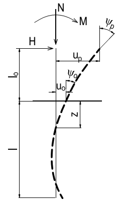

## PHỤ LỤC A (Tham khảo) — Tính toán cọc chịu tác dụng đồng thời lực thẳng đứng, lực ngang và mômen

### A.1  Khi tính cọc độc lập chịu tác dụng đồng thời lực đứng, lực ngang và mômen uốn theo sơ đồ trên Hình A.1 phải phân biệt hai giai đoạn về trạng thái ứng suất và biến dạng của hệ “cọc - nền”.

<strong>Hình A.1 — Sơ đồ tải trọng tác dụng lên cọc</strong>

### A.2  Cho phép dùng các chương trình máy tính mô tả tác dụng cơ học tương hỗ giữa dầm và nền (dầm trên nền đàn hồi). Trong đó, đất bao quanh cọc được xem như môi trường đàn hồi biến dạng tuyến tính đặc trưng bằng hệ số nền $C_{Z}$, tính bằng kN/$m^{3}$, tăng dần theo chiều sâu.

Hệ số nền tính toán của đất trên thân cọc, $C_{Z}$, được xác định theo công thức:

$$C_{Z} = \frac{k.Z}{\gamma _{c}} \qquad (A.1)$$
<!-- formula_id: "F_TCVN_10304_2014_FORMULA_A_1" -->

trong đó :

k là hệ số tỷ lệ, tính bằng kN/$m^{4}$, được lấy phụ thuộc vào loại đất bao quanh cọc theo Bảng A.1;

z là độ sâu của tiết diện cọc trong đất, nơi xác định hệ số nền, kể từ mặt đất trong trường hợp móng cọc đài cao, hoặc kể từ đáy đài trong trường hợp móng cọc đài thấp;

$_{c}$ là hệ số điều kiện làm việc (đối với cọc độc lập $_{c}$ = 3).

### A.3  Việc tính toán cọc dưới tác dụng đồng thời của lực thẳng đứng, lực ngang và mô men bao gồm:

a) \- Kiểm tra ổn định của đất theo A.7;

b) \- Tính toán cọc theo biến dạng , gồm cả việc kiểm tra việc đảm bảo điều kiện cho phép giá trị tính toán của chuyển vị ngang đầu cọc $u_{p}$ và góc quay của nó $Ψ_{h}$:

$$u_{p} \le u_{u} \qquad (A.2)$$
<!-- formula_id: "F_TCVN_10304_2014_FORMULA_A_2" -->

$$Ψ_{p} \le Ψ_{u} \qquad (A.3)$$
<!-- formula_id: "F_TCVN_10304_2014_FORMULA_A_3" -->

Trong đó:

&nbsp;&nbsp;&nbsp;&nbsp;\- $u_{p}$ và $Ψ_{p}$ là trị tính toán tương ứng của chuyển vị ngang đầu cọc và góc quay của nó;

&nbsp;&nbsp;&nbsp;&nbsp;\- $u_{u}$ và $Ψ_{u}$ là trị giới hạn tương ứng của chuyển vị ngang đầu cọc và góc quay của nó.

&nbsp;&nbsp;&nbsp;&nbsp;\- Trị $u_{u}$ và $Ψ_{u}$ cần được cho trước trong đồ án thiết kế từ điều kiện đảm bảo sử dụng công trình bình thường;

c) \- Kiểm tra tiết diện cọc về cường độ vật liệu theo trạng thái giới hạn thứ nhất và trạng thái giới hạn thứ hai (về cường độ, hình thành và mở rộng vết nứt), chịu tác dụng đồng thời lực đứng, lực ngang và momen uốn.

### A.4  Việc tính toán cường độ của các loại cọc cần theo công thức (1) của tiêu chuẩn này với việc dùng hệ số biến dạng  , tính bằng 1/m, xác định theo công thức:

$$\alpha _{\epsilon} = 5\frac{kb_{p}}{\gamma _{c}EI} \qquad (A.4)$$
<!-- formula_id: "F_TCVN_10304_2014_FORMULA_A_4" -->

trong đó:

&nbsp;&nbsp;&nbsp;&nbsp;\- k là giống như trong công thức (A1) ;

&nbsp;&nbsp;&nbsp;&nbsp;\- E là môđun đàn hồi của vật liệu làm cọc, tính bằng kPa;

&nbsp;&nbsp;&nbsp;&nbsp;\- I là mômen quán tính của tiết diện ngang cọc, tính bằng $m^{4}$;

&nbsp;&nbsp;&nbsp;&nbsp;\- $b_{p}$ là chiều rộng quy ước của cọc, tính bằng m: đối với cọc có đường kính thân cọc tối thiểu 0,8 m lấy $b_{p}$ = d+1; đối với các trường hợp còn lại: $b_{p}$ = 1,5 d + 0,5, m;

&nbsp;&nbsp;&nbsp;&nbsp;\- $_{c}$ là hệ số điều kiện làm việc lấy theo A.2;

&nbsp;&nbsp;&nbsp;&nbsp;\- d là đường kính ngoài của cọc tiết diện tròn hay cạnh của cọc tiết diện vuông hoặc cạnh của cọc tiết diện chữ nhật trong mặt phẳng vuông góc với hướng tác dụng của lực.

### A.5  Khi tính cọc trong nhóm bằng phương pháp tĩnh học, phải xét đến sự tương tác giữa các cọc. Trong trường hợp này việc tính toán được thực hiện như đối với cọc đơn nhưng hệ số tỷ lệ k phải nhân với hệ số chiết giảm $_{i}$ , xác định theo công thức:

$$\alpha _{i} =  \gamma _{c} \Pi _{i \ne j}\left[1−\frac{d}{r_{ij}}1,17 + 0,36\frac{x_{i}−x_{j}}{r_{ij}}−0,15\left(\frac{x_{j}−x_{i}}{r_{ij}}\right)^{2}\{\}\right] \qquad (A.5)$$
<!-- formula_id: "F_TCVN_10304_2014_FORMULA_A_5" -->

trong đó:

&nbsp;&nbsp;&nbsp;&nbsp;\- $_{c}$ là hệ số xét đến sự làm chặt đất khi hạ cọc và lấy như sau:

&nbsp;&nbsp;&nbsp;&nbsp;\- $_{c}$ = 1,2 đối với cọc đóng tiết diện đặc;

&nbsp;&nbsp;&nbsp;&nbsp;\- $_{c}$ = 1,0 đối với những loại cọc còn lại;

&nbsp;&nbsp;&nbsp;&nbsp;\- d là đường kính hay cạnh của tiết diện ngang cọc;

$$r_{ij} = \left(x_{i}−x_{j}\right)^{2 + \left(y_{i}−y_{j}\right)}^{2} \qquad (A.6)$$
<!-- formula_id: "F_TCVN_10304_2014_FORMULA_A_6" -->

&nbsp;&nbsp;&nbsp;&nbsp;\- $x_{i}$ , $y_{i}$ là tọa độ tim cọc thứ “i” trên mặt bằng, ở đây lực ngang đặt theo hướng trục x;

&nbsp;&nbsp;&nbsp;&nbsp;\- $x_{j}$ , $y_{j}$ là tọa độ tim cọc thứ “j” trên mặt bằng, ở đây lực ngang đặt theo hướng trục x.

&nbsp;&nbsp;&nbsp;&nbsp;\- Trong công thức (A.5) tích  $_{ij}$ chỉ xảy ra với những cọc kề sát cọc thứ “i”.

### A.6  Để xác định phản lực ở đầu các cọc, được nối với nhau bằng đài chung, cần thực hiện các phép tính đặc thù, trong đó các cọc được mô hình hóa như dầm tương tác với nền đàn hồi, còn các đầu cọc được nối với nhau bằng các phần tử mô hình hóa kết cấu móng.

### A.7  Tính toán ổn định nền đất bao quanh cọc cần được tiến hành theo điều kiện hạn chế áp lực tính toán $_{z}$ truyền qua thân cọc lên đất:

$$s_{z} \le  \eta _{1} \eta _{2}\frac{4}{cos \varphi _{l}}\left(\gamma _{l}z.tg \varphi _{l} +  \xi c_{l}\right) \qquad (A.7)$$
<!-- formula_id: "F_TCVN_10304_2014_FORMULA_A_7" -->

trong đó :

$_{z}$ là áp lực tính toán trên thân cọc lên đất xung quanh được xác định ở độ sâu Z kể từ mặt đất khi móng đài cao và từ đáy đài cọc khi móng đài thấp (khi  l ≤ 2,5 - tại hai độ sâu, tương ứng  $Z = \frac{l}{3}$ và Z=l; khi  l > 2,5 - tại độ sâu $Z = \frac{0,85}{\alpha _{\epsilon}}$, ở đây  được xác định theo công thức (A.5).

$_{I}$ là dung trọng tính toán của đất nguyên cấu trúc, được xác định trong đất bão hòa nước có xét đến lực đẩy nổi;

$_{I}$, $c_{I}$ là các trị số tính toán tương ứng góc ma sát trong và lực dính của đất;

là hệ số lấy bằng 0,6 đối với cọc đóng và cọc ống; bằng 0,3 đối với các loại cọc còn lại;

$_{1}$ là hệ số bằng 1, trừ trường hợp tính móng công trình chắn đất lấy $_{1}$ = 0,7;

$_{2}$ là hệ số kể đến tỷ lệ giữa tĩnh tải và tổng tải trọng và được xác định theo công thức:

$$\eta _{2} = \frac{M_{c} + M_{t}}{nM_{c} + M_{t}} \qquad (A.8)$$
<!-- formula_id: "F_TCVN_10304_2014_FORMULA_A_8" -->

trong đó:

&nbsp;&nbsp;&nbsp;&nbsp;\- $M_{c}$& $M_{t}$ là mômen do tĩnh tải và hoạt tải gây ra tại tiết diện mũi cọc của móng;

&nbsp;&nbsp;&nbsp;&nbsp;\- $n$ là hệ số bằng 2,5 trừ các trường hợp sau:

a) \- Các công trình đặc biệt quan trọng, khi  l ≤ 2,6 lấy $n$ = 4 và khi  l ≥ 5 lấy $n$ = 2,5; đối với các trị số $\frac{s_{w,\max}}{h_0}$ trung gian $n$ xác định theo nội suy.

b) \- Móng gồm một hàng cọc chịu lực nén thẳng đứng, lệch tâm lấy $n$= 4, không phụ thuộc vào chỉ số  l.

**CHÚ THÍCH:** Nếu áp lực ngang tính toán $_{z}$ không thỏa mãn điều kiện (A.7), nhưng vẫn chưa tận dụng hết sức chịu tải của cọc theo vật liệu và chuyển vị của cọc vẫn nhỏ hơn giá trị giới hạn cho phép thì lúc đó, với chiều sâu tính đổi  l > 2,5 phải tính toán lại với giá trị hệ số k nhỏ hơn. Ứng với giá trị K mới phải kiểm tra cường độ của cọc theo vật liệu và chuyển vị của cọc đồng thời phải thỏa mãn điều kiện (A.7).

### Bảng A - Hệ số tỷ lệ k theo công thức (A.1)

| Đất bao quanh cọc và các đặc trưng của đất | Hệ số tỷ lệ k kN/$m^{4}$ |
| :--- | :--- |
| Cát to (0,55 ≤ e ≤ 0,7 ); Sét và sét pha cứng ($I_{L}$ <0). | Từ 18000 đến 30000 |
| Cát hạt nhỏ (0,6 ≤ e ≤ 0,75); cát hạt vừa (0,55 ≤ e ≤ 0,7); Cát pha cứng ($I_{L}$ <0); sét, sét pha dẻo cứng và nửa cứng (0 ≤ $I_{L}$ ≤ 0,5) | Từ 12 000 đến 18 000 |
| Cát bụi (0,6 ≤ e ≤ 0,8); cát pha dẻo (0 ≤ $I_{L}$ ≤ 1) và Sét và sét pha dẻo mềm (0,5 ≤ $I_{L}$ ≤ 0,75) | Từ 7 000 đến 12 000 |
| Sét và sét pha dẻo chảy (0,75 ≤ $I_{L}$ ≤ 1) | Từ 4 000 đến 7 000 |
| Cát sạn (0,55 ≤ e ≤ 0,7) ; đất hạt lớn lẫn cát | Từ 50 000 đến 100 000 |