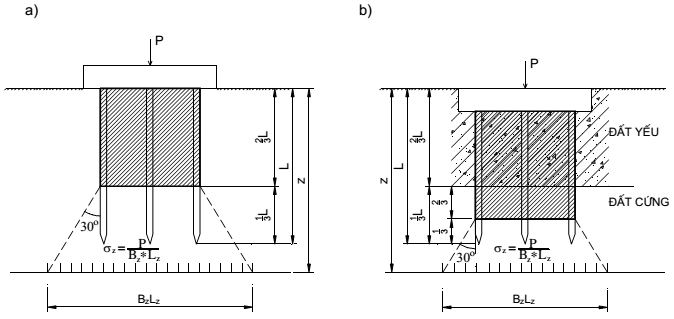

## PHỤ LỤC C (Tham khảo) — Một số mô hình móng khối quy ước

Ngoài mô hình móng khối quy ước trong 7.4.7 còn có thể dùng các mô hình móng khối quy ước đã được công nhận dưới đây:

### C.1  Mô hình móng khối quy ước trong trường hợp nền đồng nhất (Hình C.1a)

Trong trường hợp cọc nằm trong nền đồng nhất kích thước móng khối quy ước giới hạn bởi:

&nbsp;&nbsp;\- Mặt xung quanh của móng quy ước trùng với mặt bao quanh mép ngoài nhóm cọc;

&nbsp;&nbsp;\- Đáy móng khối quy ước nằm ở độ sâu bằng 2/3 chiều dài cọc kể từ đáy đài.

Ứng suất phụ thêm (gây lún) trong nền xác định một cách gần đúng theo giả thiết phân bố đều trên mỗi mặt phằng nằm ngang trong phạm vi góc mở bằng 300 từ mép đáy móng khối quy ước.

### C.2  Mô hình móng khối quy ước trong trường hợp nền không đồng nhất (Hình C.1b)

Trong trường hợp cọc nằm trong nền không đồng nhất, khi cọc xuyên qua các lớp đất yếu, cắm vào tầng đất tốt. Kích thước móng khối quy ước giới hạn bởi:

&nbsp;&nbsp;\- Mặt xung quanh của móng quy ước trùng với mặt bao quanh mép ngoài nhóm cọc;

&nbsp;&nbsp;\- Đáy móng khối quy ước nằm ở độ sâu bằng 2/3 chiều dài đoạn cọc nằm trong lớp đất tốt kể từ bề mặt lớp đất tốt này.

Ứng suất phụ thêm (gây lún) trong nền xác định một cách gần đúng theo giả thiết phân bố đều trên mỗi mặt phẳng nằm ngang trong phạm vi góc mở bằng 30° từ mép đáy móng khối quy ước.

$$\sigma_z = \frac{P}{B_z \cdot L_z}$$
<!-- formula_id: "F_TCVN_10304_2014_RID116" -->

### Bảng Phụ lục C

| Mô hình móng khối quy ước cho trường hợp nền đồng nhất | Mô hình móng khối quy ước cho trường hợp nền không đồng nhất |
| :--- | :--- |

<strong>Hình C.1 — Các mô hình móng khối quy ước</strong>
