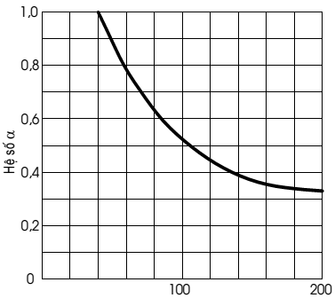
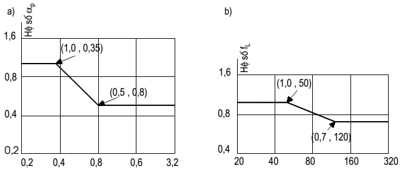

## PHỤ LỤC G (Tham khảo) — Các phương pháp khác xác định sức chịu tải của cọc

### G.1  Công thức chung xác định sức chịu tải của cọc: các phương pháp cho trong phụ lục này dựa trên các cơ sở và phương pháp luận khác nhau, dùng để xác định sức chịu tải cực hạn của cọc theo đất $R_{c,u}$ . Khi tính toán theo trạng thái giới hạn với các hệ số riêng cần tuân theo điều 7.2 của tiêu chuẩn này. Lưu ý rằng, phương pháp tính toán sức chịu tải nào của cọc cũng đều mang tính dự báo, cần có thí nghiệm thử tải tĩnh để kiểm chứng giá trị $R_{c,u}$. Việc tính toán xử lý kết quả thí nghiệm thử tải tĩnh tuân theo chỉ dẫn 7.3.3. của Tiêu chuẩn này.

Công thức chung xác định sức chịu tải cực hạn $R_{c,u}$, tính bằng kN, của cọc theo đất là:

$$R_{c,u} = q_{b} A_{b} + u f_{i} l_{i} \qquad (G.1)$$
<!-- formula_id: "F_TCVN_10304_2014_FORMULA_G_1" -->

trong đó:

&nbsp;&nbsp;&nbsp;&nbsp;\- $q_{b}$ là cường độ sức kháng của đất dưới mũi cọc;

&nbsp;&nbsp;&nbsp;&nbsp;\- $A_{b}$ là diện tích tiết diện ngang mũi cọc;

&nbsp;&nbsp;&nbsp;&nbsp;\- u là chu vi tiết diện ngang cọc;

&nbsp;&nbsp;&nbsp;&nbsp;\- $f_{i}$ là cường độ sức kháng trung bình (ma sát đơn vị) của lớp đất thứ “i” trên thân cọc.

&nbsp;&nbsp;&nbsp;&nbsp;\- $l_{i}$ là chiều dài đoạn cọc nằm trong lớp đất thứ “i”.

&nbsp;&nbsp;&nbsp;&nbsp;\- Cách xác định cường độ sức kháng của đất dưới mũi cọc qb và cường độ sức kháng trung bình của lớp đất thứ “i” trên thân cọc fi theo một số phương pháp được trình bày dưới đây.

### G.2  Xác định sức chịu tải của cọc theo các chỉ tiêu cường độ của đất nền

### G.2.1  Sức chịu tải cực hạn của cọc theo đất xác định theo công thức G.1. Cường độ sức kháng của đất dưới mũi cọc được xác định theo công thức:

$q_{b}$ = (c N’$_{c}$ + q’$_{,p}$ N’$_{q}$ ) $A_{b}$ , (G.2)

trong đó:

&nbsp;&nbsp;&nbsp;&nbsp;\- N’$_{c}$, N’$_{q}$ là các hệ số sức chịu tải của đất dưới mũi cọc;

&nbsp;&nbsp;&nbsp;&nbsp;\- q’$_{,p}$ là áp lực hiệu quả lớp phủ tại cao trình mũi cọc (có trị số bằng ứng suất pháp hiệu quả theo phương đứng do đất gây ra tại cao trình mũi cọc).

&nbsp;&nbsp;&nbsp;&nbsp;\- Cường độ sức kháng của đất dính thuần tuý không thoát nước dưới mũi cọc:

$$q_{b} = c_{u} N’ _{c} \qquad (G.3)$$
<!-- formula_id: "F_TCVN_10304_2014_FORMULA_G_3" -->

&nbsp;&nbsp;&nbsp;&nbsp;\- Thông thường lấy N’$_{c}$= 9 cho cọc đóng, đối với cọc khoan nhồi đường kính lớn lấy N’$_{c}$=6.

&nbsp;&nbsp;&nbsp;&nbsp;\- Cường độ sức kháng của đất rời (c = 0) dưới mũi cọc:

$$q_{b} = q’ _{,p} N’ _{q} A_{b} , \qquad (G.4)$$
<!-- formula_id: "F_TCVN_10304_2014_FORMULA_G_4" -->

Nếu chiều sâu mũi cọc nhỏ hơn $Z_{L}$ thì q’$_{,p}$ lấy theo giá trị bằng áp lực lớp phủ tại độ sâu mũi cọc;

Nếu chiều sâu mũi cọc lớn hơn $Z_{L}$ thì lấy giá trị q’$_{,p}$ bằng áp lực lớp phủ tại độ sâu $Z_{L}$. Có thể xác định các giá trị $Z_{L}$ và hệ số k và N’$_{q}$ trong Bảng G.1, được trích dẫn từ tiêu chuẩn AS 2159-1978.

### G.2.2  Cường độ sức kháng trung bình trên thân cọc $f_{i}$ có thể xác định như sau:

Đối với đất dính cường độ sức kháng trung bình trên thân cọc trong lớp đất thứ i có thể xác định theo phương pháp ỏ, theo đó $f_{i}$ được xác định theo công thức:

$$f_{i} = c_{u,i} \qquad (G.5)$$
<!-- formula_id: "F_TCVN_10304_2014_FORMULA_G_5" -->

trong đó:

&nbsp;&nbsp;&nbsp;&nbsp;\- $c_{u,i}$ là cường độ sức kháng không thoát nước của lớp đất dính thứ “i”;

&nbsp;&nbsp;&nbsp;&nbsp;\- là hệ số phụ thuộc vào đặc điểm lớp đất nằm trên lớp dính, loại cọc và phương pháp hạ cọc, cố kết của đất trong quá trình thi công và phương pháp xác định $c_{u}$. Khi không đầy đủ những thông tin này có thể tra  trên biểu đồ Hình G.1 (theo Phụ lục A của tiêu chuẩn AS 2159 -1978).

<!-- DIAGRAM: word/media/image59.png -->

Sức kháng cắt không thoát nước $C_{u}$, kPa

<strong>Hình G.1 — Biểu đồ xác định hệ số</strong>

Đối với đất rời, cường độ sức kháng trung bình trên thân cọc trong lớp đất cát thứ “i”:

$$\sigma _{v,z} \qquad (G.6)$$
<!-- formula_id: "F_TCVN_10304_2014_FORMULA_G_6" -->

trong đó:

&nbsp;&nbsp;&nbsp;&nbsp;\- $k_{i}$ là hệ số áp lực ngang của đất lên cọc, phụ thuộc vào loại cọc: cọc chuyển vị (đóng, ép) hay cọc thay thế (khoan nhồi hoặc barrette);

&nbsp;&nbsp;&nbsp;&nbsp;\- $\frac{q_{sw,1} Z_1}{R_s A_{s,1}}$ là ứng suất pháp hiệu quả theo phương đứng trung bình trong lớp đất thứ “i”;

&nbsp;&nbsp;&nbsp;&nbsp;\- $_{i}$ là góc ma sát giữa đất và cọc, thông thường đối với cọc bê tông $_{i}$ lấy bằng góc ma sát trong của đất $_{i}$, đối với cọc thép $_{i}$ lấy bằng 2$_{i}$/3.

&nbsp;&nbsp;&nbsp;&nbsp;\- Theo công thức (G.6) thì càng xuống sâu, cường độ sức kháng trên thân cọc càng tăng. Tuy nhiên nó chỉ tăng đến độ sâu giới hạn $Z_{L}$ nào đó bằng khoảng 15 lần đến 20 lần đường kính cọc, d, rồi thôi không tăng nữa. Vì vậy cường độ sức kháng trên thân cọc trong đất rời có thể tính như sau:

&nbsp;&nbsp;&nbsp;&nbsp;\- Trên đoạn cọc có độ sâu nhỏ hơn $Z_{L}$ , fi = k $\frac{q_{sw,1} Z_1}{R_s A_{s,1}}$

&nbsp;&nbsp;&nbsp;&nbsp;\- Trên đoạn cọc có độ sâu bằng và lớn hơn $Z_{L}$ , fi = k $\sigma '_{V,ZL}_{.}$

### Bảng G.1 - Giá trị các hệ số k, $Z_{L}$ và N’$_{q}$ cho cọc trong đất cát

| Trạng thái đất | Độ chặt tương đối D | $Z_{L}$ /d | k — Cọc đóng | k — Cọc khoan nhồi và Barrette | N’$_{q}$ — Cọc đóng | N’$_{q}$ — Cọc khoan nhồi và Barrette |
| :--- | :--- | :---: | :---: | :---: | :---: | :---: |
| Rời | Từ 0,2 đến 0,4 | 6 | 0,8 | 0,3 | 60 | 25 |
| Chặt vừa | Từ 0,4 đến 0,75 | 8 | 1,0 | 0,5 | 100 | 60 |
| Chặt | Từ 0,75 đến 0,90 | 15 | 1,5 | 0,8 | 180 | 100 |

**CHÚ THÍCH:** Đối với cọc Barrette, d là đường kính quy đổi từ tiết diện chữ nhật của barrette sang tiết diện tròn có cùng diện tích.

### G.3  Xác định sức chịu tải của cọc theo kết quả thí nghiệm xuyên tiêu chuẩn SPT

### G.3.1  Công thức của Meyerhof:

Sức chịu tải cực hạn của cọc xác định theo đất theo công thức (G.1)

Đối với trường hợp nền đất rời Meyerhof (1976) kiến nghị công thức xác định cường độ sức kháng của đất dưới mũi cọc $q_{b}$ và cường độ sức kháng của đất ở trên thân cọc $f_{i}$ trực tiếp từ kết quả thí nghiệm xuyên tiêu chuẩn như sau:

$q_{b}$ = $k_{1}$ $N_{P}$ (G.7)

$$fi = k_{2} N_{s,i} (G.8) \qquad (G.8)$$
<!-- formula_id: "F_TCVN_10304_2014_FORMULA_G_8" -->

trong đó:

&nbsp;&nbsp;&nbsp;&nbsp;\- $k_{1}$ là hệ số, lấy $k_{1}$ = 40 h/d ≤ 400 đối với cọc đóng và $k_{1}$ = 120 đối với cọc khoan nhồi;

&nbsp;&nbsp;&nbsp;&nbsp;\- $N_{P}$ là chỉ số SPT trung bình trong khoảng 4d phía dưới và 1d phía trên mũi cọc;

&nbsp;&nbsp;&nbsp;&nbsp;\- $k_{2}$ là hệ số lấy bằng 2,0 cho cọc đóng và 1,0 cho cọc khoan nhồi;

&nbsp;&nbsp;&nbsp;&nbsp;\- u là chu vi tiết diện ngang cọc;

&nbsp;&nbsp;&nbsp;&nbsp;\- h là chiều sâu hạ cọc;

&nbsp;&nbsp;&nbsp;&nbsp;\- $N_{s,i}$ là chỉ số SPT trung bình của lớp đất thứ “i” trên thân cọc.

**CHÚ THÍCH:** Trường hợp mũi cọc được hạ vào lớp đất rời còn trên phạm vi chiều dài cọc có cả đất rời và đất dính thì $f_{i}$ trong lớp đất rời tính theo công thức G.8, còn $f_{i}$ trong lớp đất dính tính theo phương pháp  theo công thức G.5, hoặc theo công thức G.11.

### G.3.2  Công thức của Viện kiến trúc Nhật Bản (1988)

Sức chịu tải cực hạn của cọc xác định theo công thức G.1 được viết lại dưới dạng:

$$u\sum \left(f_{c,i}1_{c,i} + f_{s,i}1_{s,i}\right) \qquad (G.9)$$
<!-- formula_id: "F_TCVN_10304_2014_FORMULA_G_9" -->

trong đó:

&nbsp;&nbsp;&nbsp;&nbsp;\- $q_{b}$ là cường độ sức kháng của đất dưới mũi cọc xác định như sau:

Khi mũi cọc nằm trong đất rời $q_{b}$ = 300 $N_{p}$ cho cọc đóng (ép) và $q_{b}$ = 150 $N_{p}$ cho cọc khoan nhồi.

Khi mũi cọc nằm trong đất dính $q_{b}$ = 9 $c_{u}$ cho cọc đóng và $q_{b}$ = 6 $c_{u}$ cho cọc khoan nhồi.

Đối với cọc đóng, cường độ sức kháng trung bình trên đoạn cọc nằm trong lớp đất rời thứ “i”:

$$f_{s,i} = \frac{10N_{s,i}}{3} \qquad (G.10)$$
<!-- formula_id: "F_TCVN_10304_2014_FORMULA_G_10" -->

và cường độ sức kháng trên đoạn cọc nằm trong lớp đất dính thứ “i”:

$f_{c,i}$ = $_{p}f_{L}c_{u,i}$(G.11)

trong đó:

&nbsp;&nbsp;&nbsp;&nbsp;\- $_{p}$ là hệ số điều chỉnh cho cọc đóng, phụ thuộc vào tỷ lệ giữa sức kháng cắt không thoát nước của đất dính $c_{u}$ và trị số trung bình của ứng suất pháp hiệu quả thẳng đứng, xác định theo biểu đồ trên Hình G.2a;

&nbsp;&nbsp;&nbsp;&nbsp;\- $f_{L}$ là hệ số điều chỉnh theo độ mảnh h/d của cọc đóng, xác định theo biểu đồ trên Hình G.2b;

&nbsp;&nbsp;&nbsp;&nbsp;\- Biểu đồ xác định các hệ số $f_{L}$ và $_{p}$ trên hình G2 là do Semple và Rigden xác lập (1984).

Đối với cọc khoan nhồi, cường độ sức kháng trên đoạn cọc nằm trong lớp đất rời thứ i tính theo công thức (G.10) ), còn cường độ sức kháng trên đoạn cọc nằm trong lớp đất dính thứ i tính theo công thức (G.11) với $f_{L}$ = 1;

$N_{P}$ là chỉ số SPT trung bình trong khoảng 1d dưới và 4d trên mũi cọc;

$c_{u}$ là cường độ sức kháng cắt không thoát nước của đất dính, khi không có số liệu sức kháng cắt không thoát nước $c_{u}$ xác định trên các thiết bị thí nghiệm cắt đất trực tiếp hay thí nghiệm nén ba trục có thể xác định từ thí nghiệm nén một trục nở ngang tự do ($c_{u}$ = $q_{u}$ /2), hoặc từ chỉ số SPT trong đất dính: $c_{u,i}$ = 6,25 $N_{c,i}$, tính bằng kPa, trong đó $N_{c,i}$ là chỉ số SPT trong đất dính.

$N_{s,i}$ là chỉ số SPT trung bình trong lớp đất rời “i”;

$l_{s,i}$ là chiều dài đoạn cọc nằm trong lớp đất rời thứ “i”

$l_{c,i}$ là chiều dài đoạn cọc nằm trong lớp đất dính thứ “i”;

u là chu vi tiết diện ngang cọc;

d là đường kính tiết diện cọc tròn, hoặc cạnh tiết diện cọc vuông.

**CHÚ THÍCH:** 

1) Đối với các loại đất cát, nếu trị số $N_{P}$ > 50 thì chỉ lấy $N_{P}$ = 50; nếu trị số $N_{S,i}$ lớn hơn 50 thì lấy $N_{S,i}$ = 50.

2) Đối với nền đá và nền ít bị nén như sỏi cuội ở trạng thái chặt, khi trị số $N_{P}$ > 100 có thể lấy $q_{b}$ = 20 Mpa cho trường hợp cọc đóng. Riêng đối với cọc khoan nhồi và barrette thì sức kháng mũi phụ thuộc chủ yếu vào chất lượng thi công cọc, nếu có biện pháp tin cậy làm sạch mũi cọc và bơm vữa xi măng gia cường đất dưới mũi cọc thì có thể lấy giá trị $q_{b}$ như trường hợp cọc đóng.

$$\begin{aligned}
\text{a) Hệ số } \alpha_p: \quad & (1,0 \text{ , } 0,35) \text{ và } (0,5 \text{ , } 0,8) \\
\text{b) Hệ số } f_L: \quad & (1,0 \text{ , } 50) \text{ và } (0,7 \text{ , } 120)
\end{aligned}$$
<!-- formula_id: "F_TCVN_10304_2014_RID134" -->

### Bảng Phụ lục G

| Sức kháng cắt/ áp lực hiệu quả thẳng đứng: $c_{u}$/’$_{v}$ | Chiều sâu cọc/ đường kính cọc: L/d |
| :--- | :--- |

<strong>Hình G.2 — Biểu đồ xác định hệ số p và fL</strong>

### G.4  Xác định sức chịu tải của cọc theo sức kháng mũi xuyên tĩnh $q_{c}$

Ngoài phương pháp xác định sức chịu tải của cọc theo kết quả thí nghiệm xuyên tĩnh trong các điều 7.3.6 - 7.3.9, có thể xác định sức chịu tải của cọc công thức G.1:

$$u\sum f_{i}l_{i} \qquad (G.12)$$
<!-- formula_id: "F_TCVN_10304_2014_FORMULA_G_12" -->

trong đó:

&nbsp;&nbsp;&nbsp;&nbsp;\- $q_{b}$ là cường độ sức kháng của đất dưới mũi cọc xác định theo công thức:

$$q_{b} = k q_{c} \qquad (G.13)$$
<!-- formula_id: "F_TCVN_10304_2014_FORMULA_G_13" -->

&nbsp;&nbsp;&nbsp;&nbsp;\- $q_{c}$ là cường độ sức kháng mũi xuyên trung bình của đất trong khoảng 3d phía trên và 3d phía dưới mũi cọc, d là đường kính, hoặc cạnh tiết diện ngang cọc;

&nbsp;&nbsp;&nbsp;&nbsp;\- $l_{i}$ như trong công thức (G.1);

&nbsp;&nbsp;&nbsp;&nbsp;\- $k_{c}$ là hệ số chuyển đổi sức kháng mũi xuyên thành sức kháng mũi cọc, tra Bảng G2;

&nbsp;&nbsp;&nbsp;&nbsp;\- $f_{i}$ là cường độ sức kháng trung bình trên thân cọc trong lớp đất thứ “i”, xác định theo công thức:

$$f_{i} = \frac{q_{c,i}}{\alpha _{i}} \qquad (G.14)$$
<!-- formula_id: "F_TCVN_10304_2014_FORMULA_G_14" -->

&nbsp;&nbsp;&nbsp;&nbsp;\- $q_{c,i}$ là cường độ sức kháng mũi xuyên trung bình trong lớp đất thứ “i”;

&nbsp;&nbsp;&nbsp;&nbsp;\- $_{i}$ là hệ số chuyển đổi từ sức kháng mũi xuyên sang sức kháng trên thân cọc, tra Bảng G2.

### Bảng G2 - Hệ số Kc và

| Loại đất | Sức kháng ở mũi xuyên qC kPa | Hệ số Kc — Cọc nhồi | Hệ số Kc — Cọc đóng | Hệ số — Cọc nhồi — Thành bê tông | Hệ số — Cọc nhồi — Thành ống thép | Hệ số — Cọc đóng — Thành bê tông | Hệ số — Cọc đóng — Thành ống thép | Cường độ sức kháng lớn nhất trên thân cọc $f_{max}$ kPa — Cọc nhồi — Thành bê tông | Cường độ sức kháng lớn nhất trên thân cọc $f_{max}$ kPa — Cọc nhồi — Thành ống thép | Cường độ sức kháng lớn nhất trên thân cọc $f_{max}$ kPa — Cọc đóng — Thành bê tông | Cường độ sức kháng lớn nhất trên thân cọc $f_{max}$ kPa — Cọc đóng — Thành ống thép |
| :--- | :--- | :---: | :---: | :--- | :--- | :--- | :--- | :--- | :--- | :--- | :---: |
| Đất dính chảy, Bùn (*) | < 2000 | 0,4 | 0,5 | 30 | 30 | 30 | 30 | 15 | 15 | 15 |  |
| Đất dính dẻo mềm - dẻo cứng | Từ 2000 đến 5000 | 0,35 | 0,45 | 40 | 80 | 40 | 80 | (80) 35 | (80) 35 | (80) 35 | 35 |
| Đất dính nửa cứng đến cứng | > 5000 | 0,45 | 0,55 | 60 | 120 | 60 | 120 | (80) 35 | (80) 35 | (80) 35 | 35 |
| Cát chảy | Từ 0 đến 2500 | 0,4 | 0,5 | (60) 120 | 150 | (60) 80 | (120) 60 | 35 | 35 | 35 | 35 |
| Cát chặt vừa | Từ 2500 đến 10000 | 0,4 | 0,5 | (100) 180 | (200) 250 | 100 | (200) 250 | (120) 80 | (80) 35 | (120) 80 | 80 |
| Cát chặt đến rất chặt | >10000 | 0,3 | 0,4 | 150 | (300) 200 | 150 | (300) 200 | (150) 120 | (120) 80 | (150) 120 | 120 |
| Đá phấn mềm | > 5000 | 0,2 | 0,3 | 100 | 120 | 100 | 120 | 35 | 35 | 35 | 35 |
| Đá phấn phong hóa, mảnh vụn | > 5000 | 0,2 | 0,4 | 60 | 80 | 60 | 80 | (150) 120 | (120) 80 | (150) 120 | 120 |

> **CHÚ THÍCH 1:** Cần hết sức thận trọng khi lấy giá trị sức kháng trên thân cọc trong đất sét yếu và bùn vì có thể xuất hiện ma sát âm khi bị lún do tải trọng tác dụng lên nó hoặc do trọng lượng bản thân đất.
>
> **CHÚ THÍCH 2:** Các giá trị trong ngoặc đơn có thể sử dụng khi: &nbsp;&nbsp;\- Đối với cọc nhồi, thành hố được giữ tốt, khi thi công thành hố không bị phá hoại và bê tông cọc đạt chất lượng cao;
>
> **CHÚ THÍCH 3:** &nbsp;&nbsp;\- Đối với cọc đóng có tác dụng làm chặt đất.
>
> **CHÚ THÍCH 3:** Giá trị sức kháng của đất ở mũi xuyên trong bảng ứng với mũi côn đơn giản.

THƯ MỤC TÀI LIỆU THAM KHẢO

Tài liệu tham khảo bằng tiếng Nga:

&nbsp;&nbsp;\- SP 14.1330.2011 SNiP II-7-8* Xây dựng trong vùng động đất;

&nbsp;&nbsp;\- SP 16.13330.2011 SNiP II-23-81* Kết cấu thép;

&nbsp;&nbsp;\- SP 20.1330.2011 SNiP 2.01.07-85 Tải trọng và tác động;

&nbsp;&nbsp;\- SP 21.13330.2010 SNiP 2.01.09-91 Nhà và công trình trong vùng khai thác mỏ và lún sụt;

&nbsp;&nbsp;\- SP 22.13330.2011 SNiP 2.02.01-83* Nền nhà và công trình;

&nbsp;&nbsp;\- SP 28.13330.2010 SNiP 2.03.11-85 Bảo vệ công trình xây dựng chống xâm thực;

&nbsp;&nbsp;\- SP 35.13330.2011 SNiP 2.05.03-84 Cầu và ống’;

&nbsp;&nbsp;\- SP 38.13330.2010 SNiP 2.06.04-82* Tải trọng và tác động lên công trình thủy (sóng, băng và từ tàu thuyền);

&nbsp;&nbsp;\- SP 40.13330.2010 SNiP 2.06.06-85 Đập bê tông và bê tông cốt thép;

&nbsp;&nbsp;\- SP 41.13330.1010 SNiP 2.06.08-87 Kết cấu bê tông và bê tông cốt thép công trình thủy;

&nbsp;&nbsp;\- SP 47.13330.2010 SNiP 11-02-96 Khảo sát công trình để xây dựng. Những nguyên tắc cơ bản;

&nbsp;&nbsp;\- SP 58.13330.1010 SNiP 33-01-2003 Công trình Thủy. Những vấn đề cơ bản;

&nbsp;&nbsp;\- SP 63.13330.2010 SNiP 52.01-2003 Kết cấu bê tông và bê tông cốt thép. Những vấn đề cơ bản;

&nbsp;&nbsp;\- GOST 5686-94 Đất. Phương pháp thí nghiệm cọc tại hiện trường;

&nbsp;&nbsp;\- GOST 12248-96 Đất. Phương pháp xác định các đặc trưng cường độ và biến dạng trong phòng thí nghiệm;

&nbsp;&nbsp;\- GOST P 53231-2008 Bê tông. Nguyên tắc kiểm tra và đánh giá cường độ;

&nbsp;&nbsp;\- GOST 19804-91 Cọc bê tông cốt thép - các điều kiện kỹ thuật;

&nbsp;&nbsp;\- GOST 19804.6-83 Cọc đặc tiết diện tròn và cọc - ống bê tông cốt thép không ứng lực trước. Cấu tạo và kích thước;

&nbsp;&nbsp;\- GOST 19912-2001 Đất. Phương pháp thí nghiệm xuyên tĩnh và xuyên động tại hiện trường;

&nbsp;&nbsp;\- GOST 20276-99 Đất. Phương pháp thí nghiệm hiện trường xác định các đặc trưng cường độ và biến dạng;

&nbsp;&nbsp;\- GOST 20522-96 Đất. Phương pháp phân tích thống kê kết quả thí nghiệm;

&nbsp;&nbsp;\- GOST 25100-95 Đất. Phân loại;

&nbsp;&nbsp;\- GOST 26633-91 Bê tông nặng và bê tông hạt nhỏ;

&nbsp;&nbsp;\- GOST 27751-88 Độ tin cậy của kết cấu công trình và nền móng. Các nguyên tắc tính toán cơ bản;

&nbsp;&nbsp;\- GOST P 53778-2010 Nhà và công trình. Nguyên tắc khảo sát và quan trắc trạng thái kỹ thuật.

Tài liệu tham khảo bằng tiếng Anh:

&nbsp;&nbsp;\- AS 2159-1978 Rules for the Design and Installation of Piling - Australian Standard;

&nbsp;&nbsp;\- Recommendations for Design of Building Foundation (Architectural Institut of Japan 1988).

MỤC LỤC

Lời nói đầu

## 1  PHẠM VI ÁP DỤNG

## 2  TÀI LIỆU VIỆN DẪN

## 3  THUẬT NGỮ VÀ ĐỊNH NGHĨA

## 4  NGUYÊN TẮC CHUNG

## 5  YÊU CẦU VỀ KHẢO SÁT ĐỊA CHẤT CÔNG TRÌNH

## 6  PHÂN LOẠI CỌC

## 7  THIẾT KẾ MÓNG CỌC

### 7.1  Những chỉ dẫn cơ bản về tính toán

### 7.2  Xác định sức chịu tải của cọc theo các chỉ tiêu cơ lý đất đá

### 7.3  Xác định sức chịu tải của cọc theo kết quả thí nghiệm hiện trường

### 7.4  Tính toán cọc và móng cọc theo biến dạng

### 7.5  Đặc điểm thiết kế nhóm cọc kích thước lớn và đài dạng tấm

### 7.6  Đặc điểm thiết kế móng cọc khi cải tạo xây dựng lại nhà và công trình

## 8  YÊU CẦU VỀ CẤU TẠO MÓNG CỌC

## 9  ĐẶC ĐIỂM THIẾT KẾ MÓNG CỌC TRONG NỀN ĐẤT LÚN SỤT

## 10  ĐẶC ĐIỂM THIẾT KẾ MÓNG CỌC TRONG NỀN ĐẤT TRƯƠNG NỞ

## 11  ĐẶC ĐIỂM THIẾT KẾ MÓNG CỌC TRONG VÙNG ĐẤT KHAI THÁC MỎ

## 12  ĐẶC ĐIỂM THIẾT KẾ MÓNG CỌC TRONG VÙNG CÓ ĐỘNG ĐẤT

## 13  ĐẶC ĐIỂM THIẾT KẾ MÓNG CỌC TRONG VÙNG CÓ HANG ĐỘNG CAS TƠ

## 14  ĐẶC ĐIỂM THIẾT KẾ MÓNG CỌC CHO ĐƯỜNG DÂY TẢI ĐIỆN TRÊN KHÔNG

## 15  ĐẶC ĐIỂM THIẾT KẾ MÓNG CỌC CỦA NHÀ ÍT TẦNG