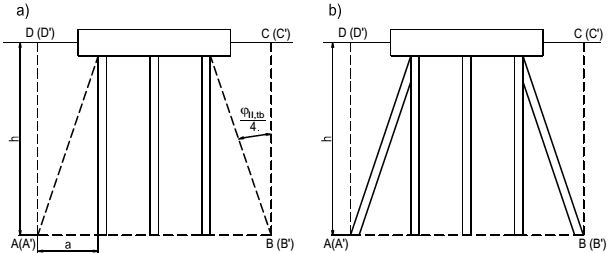

# TIÊU CHUẨN QUỐC GIA

**TCVN 10304:2014**

MÓNG CỌC - TIÊU CHUẨN THIẾT KẾ

Pile Foundation - Design Standard

## Lời nói đầu

**TCVN 10304:2014 “Móng cọc - Tiêu chuẩn thiết kế” được xây dựng trên cơ sở tham khảo “SP 24.13330.2011 (SNiP 2.02.03-85) Móng cọc”.**

**TCVN 10304:2014 do trường Đại học Xây dựng biên soạn, Bộ Xây dựng đề nghị, Tổng cục Tiêu chuẩn Đo lường Chất lượng thẩm định, Bộ Khoa học và Công nghệ công bố.**

MÓNG CỌC - TIÊU CHUẨN THIẾT KẾ

Pile Foundation - Design Standard

---

## 1  PHẠM VI ÁP DỤNG

Tiêu chuẩn này được áp dụng để thiết kế móng cọc của nhà và công trình (sau đây gọi chung là công trình) xây dựng mới hoặc công trình cải tạo xây dựng lại.

Tiêu chuẩn này không áp dụng để thiết kế móng cọc của công trình xây dựng trên đất đóng băng vĩnh cửu, móng máy chịu tải trọng động cũng như trụ của các công trình khai thác dầu trên biển và các công trình khác trên thềm lục địa.

## 2  TÀI LIỆU VIỆN DẪN

Các tài liệu viện dẫn sau rất cần thiết cho việc áp dụng tiêu chuẩn này.

TCVN 2737:1995 Tải trọng và tác động - Tiêu chuẩn thiết kế;

TCVN 3118:1993 Bê tông nặng - Phương pháp xác định cường độ nén;

TCVN 4200:2012 Đất xây dựng - Phương pháp xác định tính nén lún trong phòng thí nghiệm;

TCVN 4116:1985 Kết cấu bê tông và bê tông cốt thép thủy công - Tiêu chuẩn thiết kế;

TCVN 4419:1987 Khảo sát cho xây dựng - Nguyên tắc cơ bản;

TCVN 5574:2012 Kết cấu bê tông và bê tông cốt thép - Tiêu chuẩn thiết kế;

TCVN 5575:2012 Kết cấu thép - Tiêu chuẩn thiết kế;

TCVN 5746:1993 Đất xây dựng - Phân loại;

TCVN 6170-3:1998 Công trình biển cố định - Tải trọng thiết kế;

TCVN 9346:2012 Kết cấu bê tông và bê tông cốt thép - Yêu cầu bảo vệ chống ăn mòn trong môi trường biển;

TCVN 9351:2012 Đất xây dựng - Phương pháp thí nghiệm hiện trường - Thí nghiệm xuyên tiêu chuẩn;

TCVN 9352:2012 Đất xây dựng - Phương pháp thí nghiệm xuyên tĩnh;

TCVN 9362:2012 Tiêu chuẩn thiết kế nền nhà và công trình;

TCVN 9363:2012 Khảo sát cho xây dựng - Khảo sát địa kỹ thuật cho nhà cao tầng;

TCVN 9379:2012 Kết cấu xây dựng và nền - Nguyên tắc cơ bản về tính toán;

TCVN 9386-1:2012 Thiết kế công trình chịu động đất - Phần 1: Quy định chung, tác động động đất và quy định đối với kết cấu nhà;

TCVN 9386-2:2012 Thiết kế công trình chịu động đất - Phần 2: Nền móng, tường chắn và các vấn đề địa kỹ thuật.

TCVN 9393:2012 Cọc - Phương pháp thử nghiệm tại hiện trường bằng tải ép tĩnh dọc trục;

TCVN 9402:2012 Hướng dẫn kỹ thuật công tác địa chất công trình cho xây dựng trong vùng castơ.

## 3  THUẬT NGỮ VÀ ĐỊNH NGHĨA

Trong tiêu chuẩn này sử dụng các thuật ngữ và định nghĩa sau:

### 3.1  Cọc (Pile):

Cấu kiện thẳng đứng hoặc xiên, được hạ vào đất hoặc thi công tại chỗ trong đất, để truyền tải trọng vào nền.

### 3.2  Cọc treo (Friction pile):

Cọc, truyền tải trọng vào nền qua ma sát trên thân cọc và qua mũi cọc.

### 3.3  Cọc chống (End bearing pile):

Cọc, truyền tải trọng vào nền chủ yếu qua mũi cọc.

### 3.4  Cọc đơn (Single pile):

Cọc, truyền tải trọng vào nền trong điều kiện không có ảnh hưởng của các cọc khác tới nó.

### 3.5  Nền cọc (Pile ground base):

Một phần của nền đất tiếp nhận tải trọng do cọc truyền vào và tác dụng tương hỗ với cọc.

### 3.6  Nhóm cọc (Pile group):

Nhóm một số cọc được liên kết với nhau bằng đài cọc, theo nguyên tắc, truyền tải từ cột hoặc trụ độc lập xuống nền.

### 3.7  Bãi cọc (Large pile group):

Rất nhiều cọc, nối với nhau bằng đài cọc lớn, truyền tải trọng từ công trình xuống nền đất.

### 3.8  Móng cọc (Pile foundation):

Hệ thống cọc được nối lại với nhau trong một cấu trúc thống nhất truyền tải trọng lên nền.

### 3.9  Móng cọc - bè hỗn hợp (Piled raft foundation):

Móng cấu tạo từ đài cọc dạng tấm (bè) bê tông cốt thép và cọc, cùng truyền tải xuống nền.

### 3.10  Đài cọc (Pile cap):

Là dầm hoặc tấm nối các đầu cọc và phân phối tải trọng từ kết cấu bên trên lên cọc. Phân biệt đài cọc thành: đài cao, nếu đáy đài nằm cao hơn mặt đất và đài thấp, nếu đáy đài nằm ngay trên mặt đất hoặc trong nền đất.

### 3.11  Sức chịu tải của cọc (Bearing resistance of a single pile):

Sức kháng cực hạn của nền đối với cọc đơn theo điều kiện giới hạn sự phát triển quá mức của biến dạng trượt trong nền.

### 3.12  Lực ma sát âm (Negative skin friction):

Lực xuất hiện trên bề mặt thân cọc khi độ lún của đất xung quanh cọc lớn hơn độ lún của cọc và hướng xuống dưới.

### 3.13  Tải trọng tác dụng lên cọc (Load acting on a pile):

Giá trị tải trọng, bằng giá trị lực xuất hiện trong cọc dưới tác dụng của các tác động từ công trình lên móng trong những tổ hợp bất lợi nhất của chúng.

## 4  NGUYÊN TẮC CHUNG

### 4.1  Móng cọc cần được tính toán thiết kế trên cơ sở:

&nbsp;&nbsp;\- Các kết quả khảo sát công trình xây dựng;

&nbsp;&nbsp;\- Tài liệu về động đất tại khu vực xây dựng;

&nbsp;&nbsp;\- Các số liệu đặc trưng về chức năng, cấu trúc công nghệ đặc biệt của công trình và các điều kiện sử dụng công trình;

&nbsp;&nbsp;\- Tải trọng tác dụng lên móng;

&nbsp;&nbsp;\- Hiện trạng các công trình có sẵn và ảnh hưởng của việc xây dựng mới đến chúng;

&nbsp;&nbsp;\- Các yêu cầu sinh thái;

&nbsp;&nbsp;\- So sánh kinh tế - kỹ thuật các phương án thiết kế khả thi.

### 4.2  Trong đồ án thiết kế phải xem xét, đáp ứng cho công trình an toàn, ổn định lâu dài và hiệu quả kinh tế trong cả giai đoạn thi công và sử dụng công trình.

### 4.3  Trong đồ án thiết kế cần xét đến điều kiện xây dựng địa phương, cũng như kinh nghiệm thiết kế, xây dựng và sử dụng công trình trong những điều kiện địa chất công trình, địa chất thủy văn và điều kiện sinh thái tương tự.

### 4.4  Cần thiết kế móng cọc trong mối tương quan với nhiệm vụ thiết kế và các số liệu ban đầu.

### 4.5  Khi thiết kế cần xét đến tầm quan trọng của công trình theo Phụ lục F trong tiêu chuẩn này.

### 4.6  Móng cọc cần được thiết kế trên cơ sở các kết quả khảo sát công trình thực hiện theo các yêu cầu trong tiêu chuẩn TCVN 4419:1987, TCVN 9363:2012 và trong Điều 5 của tiêu chuẩn này.

Việc thực hiện công tác khảo sát công trình không những để cung cấp cho công tác nghiên cứu các điều kiện địa chất công trình của công trình xây dựng mới mà còn cung cấp các số liệu để kiểm tra ảnh hưởng của việc xây dựng móng cọc đến các công trình xung quanh và cũng để thiết kế gia cường nền và móng cho các công trình hiện có, nếu cần thiết.

Không cho phép thiết kế móng cọc khi chưa có đầy đủ cơ sở dữ liệu cần thiết về địa chất công trình.

### 4.7  Khi thi công cọc gần các công trình có sẵn cần phải đánh giá ảnh hưởng của tác động động đến kết cấu của các công trình này và các máy móc thiết bị đặt bên trong. Trong những trường hợp cần thiết, với kinh nghiệm thi công cọc, có thể phải dự định trước việc đo các thông số dao động của nền đất, của các công trình kể cả công trình ngầm đã có.

### 4.8  Trong các đồ án móng cọc cần dự tính công tác quan trắc hiện trường. Thành phần, khối lượng và phương pháp quan trắc hiện trường được quy định phụ thuộc vào tầm quan trọng của công trình và mức độ phức tạp của điều kiện địa chất công trình.

Công tác quan trắc biến dạng của nền và móng tại hiện trường cần được dự tính khi sử dụng loại kết cấu và móng mới hoặc chưa được nghiên cứu kỹ lưỡng, cũng như trong trường hợp trong nhiệm vụ thiết kế đã có yêu cầu đặc biệt cho công tác quan trắc hiện trường.

### 4.9  Móng cọc làm việc trong môi trường xâm thực cần được thiết kế theo yêu cầu của TCVN 5337:1991, TCVN 5338:1991 và TCVN 9346:2012.

### 4.10  Khi thiết kế và thi công móng cọc từ bê tông toàn khối và bê tông lắp ghép, hoặc bê tông cốt thép cần tuân thủ theo TCVN 5574:2012, cũng như tuân thủ các yêu cầu của quy phạm thi công nền và móng, các công tác trắc địa, kỹ thuật an toàn, an toàn chống cháy trong quá trình thi công và bảo vệ môi trường xung quanh.

## 5  YÊU CẦU VỀ KHẢO SÁT ĐỊA CHẤT CÔNG TRÌNH

### 5.1  Các kết quả khảo sát công trình cần bao gồm các thông tin về địa hình, địa mạo, động đất cũng như các số liệu cần thiết để chọn loại móng, xác định loại cọc và kích thước cọc, tải trọng tính toán cho phép tác dụng lên cọc và tính toán theo các trạng thái giới hạn và dự báo những biến đổi có thể (trong quá trình xây dựng và sử dụng công trình) của các điều kiện địa chất công trình, địa chất thủy văn và sinh thái của công trường xây dựng cũng như loại và khối lượng các biện pháp kỹ thuật để chế ngự chúng.

### 5.2  Công tác khảo sát cho móng cọc nói chung bao gồm các công việc tổng hợp sau:

&nbsp;&nbsp;\- Khoan lấy mẫu và mô tả đất;

&nbsp;&nbsp;\- Nghiên cứu các tính chất cơ lý của đất và của nước dưới đất trong phòng thí nghiệm;

&nbsp;&nbsp;\- Thí nghiệm xuyên đất: xuyên tĩnh (CPT) và xuyên tiêu chuẩn (SPT);

&nbsp;&nbsp;\- Thí nghiệm nén ngang đất;

&nbsp;&nbsp;\- Thí nghiệm tấm nén (bằng tải trọng tĩnh);

&nbsp;&nbsp;\- Thí nghiệm thử cọc ngoài hiện trường;

&nbsp;&nbsp;\- Các thí nghiệm nghiên cứu ảnh hưởng của công tác thi công móng cọc đến môi trường xung quanh, trong đó có các công trình lân cận (theo đề xuất chuyên môn của đơn vị thiết kế).

### 5.3  Khoan lấy mẫu kết hợp xuyên tiêu chuẩn, thí nghiệm trong phòng, thí nghiệm xuyên tĩnh, là những công tác khảo sát chính, không phụ thuộc vào tầm quan trọng của công trình và loại móng cọc.

### 5.4  Đối với các công trình thuộc tầm quan trọng cao và trung bình thì ngoài các yêu cầu trong 5.3 nên bổ sung các thí nghiệm đất như thí nghiệm nén ngang, thí nghiệm kháng chấn và thí nghiệm cọc ngoài hiện trường theo chỉ dẫn trong Phụ lục D, trong đó cần xét đến tính phức tạp theo sự phân bố và tính chất của đất.

Đối với công trình xây dựng là các nhà cao tầng thuộc tầm quan trọng cao và các công trình có phần ngầm sâu, nếu cần thiết có thể bổ sung công tác thăm dò địa vật lý để làm chính xác hơn cấu tạo nền đất giữa các hố khoan, xác định chiều dày của các lớp đất yếu, chiều sâu mực nước, hướng và vận tốc chuyển động của nước ngầm, còn trong những vùng có castơ - độ sâu phân bố tầng đá và đất castơ, mức độ nứt nẻ và castơ hóa.

### 5.5  Khi áp dụng cọc kết cấu mới, theo đề xuất chuyên môn của đơn vị thiết kế, cần tiến hành thí nghiệm hạ cọc với mục đích làm chính xác thêm kích thước thiết kế và phương pháp hạ cọc đã được ấn định, cũng như công tác thử cọc bằng tải trọng tĩnh ở hiện trường.

Khi áp dụng móng cọc - bè hỗn hợp cần đưa vào thành phần công tác thí nghiệm đất bằng bàn nén và thí nghiệm thử cọc tại hiện trường.

### 5.6  Trong trường hợp cọc làm việc chịu kéo, chịu tải ngang hoặc chịu tải trọng đổi dấu, cần phải thực hiện các công tác thí nghiệm cho mỗi trường hợp cụ thể với khối lượng được quy định có xét đến tác động nào có ưu thế hơn.

### 5.7  Xác định sức chịu tải của cọc theo kết quả thí nghiệm hiện trường tuân theo 7.3.

### 5.8  Thí nghiệm thử cọc, tấm nén và nén ngang, theo nguyên tắc, tiến hành ở khu vực được chọn lựa trên cơ sở kết quả khoan (xuyên) khảo sát ở vị trí mà điều kiện đất đặc trưng nhất, móng chịu tải lớn nhất và cả ở nơi mà việc hạ cọc theo điều kiện đất còn chưa rõ ràng.

Việc thử đất bằng tải trọng tĩnh một cách hợp lý là thực hiện bằng tấm nén hình xoắn ốc với diện tích 600 $cm^{2}$ trong hố khoan với mục đích xác định mô đun biến dạng và làm chính xác thêm hệ số chuyển đổi trong các tài liệu tiêu chuẩn hướng dẫn hiện hành giữa mô đun biến dạng của đất và số liệu thí nghiệm xuyên và nén ngang lỗ khoan.

### 5.9  Khối lượng khảo sát cho móng cọc kiến nghị lấy theo Phụ lục D, phụ thuộc vào tầm quan trọng của công trình và mức độ phức tạp của nền đất.

Khi nghiên cứu tính đa dạng của các loại đất gặp ở công trường trong phạm vi chiều sâu khảo sát, cần chú ý đặc biệt tới sự có mặt, chiều sâu và chiều dày của các lớp đất yếu (cát rời, đất dính yếu, các loại đất hữu cơ). Sự có mặt của những loại đất này có ảnh hưởng tới việc xác định loại cọc và chiều dài cọc, vị trí mối nối của cọc tổ hợp, liên kết cọc vào đài và việc chọn thiết bị thi công cọc. Sự bất lợi của những loại đất này cũng cần phải tính đến khi có tác động của động đất và tải trọng động.

### 5.10  Các vị trí khảo sát địa chất công trình (hố khoan, hố xuyên, vị trí thí nghiệm đất) cần bố trí sao cho chúng nằm trong khuôn viên công trình thiết kế xây dựng hoặc là trong những điều kiện nền đất như nhau, không xa công trình quá 5 m, còn trong trường hợp sử dụng các cọc làm kết cấu bảo vệ hố đào thì không quá 2 m từ trục của chúng.

### 5.11  Chiều sâu khảo sát, theo nguyên tắc, phải lớn hơn chiều sâu nén lún của nền. Thông thường chiều sâu các hố khảo sát không được nhỏ hơn 5 m kể từ mũi cọc thiết kế trong trường hợp bố trí cọc thành hàng và nhóm cọc chịu tải trọng dưới 3 MN; không được nhỏ hơn 10 m trong trường hợp bố trí cọc thành bãi kích thước đến (10 m x 10 m) và nhóm cọc chịu tải trọng lớn hơn 3 MN. Trong trường hợp bãi cọc rộng hơn (10 m x 10 m) và trường hợp dùng móng cọc - bè hỗn hợp chiều sâu các hố khảo sát cần phải lớn hơn chiều sâu cọc một khoảng không nhỏ hơn chiều dày tầng nén lún và không nhỏ hơn một nửa chiều rộng bãi cọc hay đài dạng tấm và không nhỏ hơn 15 m.

Khi trong nền có mặt các lớp đất với những tính chất đặc biệt (đất lún sụt, đất trương nở, đất dính yếu, đất hữu cơ, đất cát rời xốp và đất nhân tạo) các hố khảo sát phải xuyên qua những lớp đất này, vào sâu trong các tầng đất tốt phía dưới và xác định các đặc trưng của chúng.

### 5.12  Khi khảo sát cho móng cọc cần xác định các đặc trưng vật lý, cường độ và biến dạng cần thiết để tính toán thiết kế móng cọc theo các trạng thái giới hạn (xem Điều 7).

Số lần xác định các đặc trưng đất cho mỗi yếu tố địa chất công trình cần phải đủ để phân tích thống kê.

### 5.13  Đối với đất cát, do khó lấy mẫu nguyên dạng, do đó phương pháp chính để xác định độ chặt và các đặc trưng về cường độ nên là thí nghiệm xuyên tĩnh hoặc xuyên tiêu chuẩn cho mọi loại công trình không kể ở mức độ quan trọng nào.

Thí nghiệm xuyên là phương pháp chính để xác định mô đun biến dạng vừa cho đất cát vừa cho đất sét của nền công trình thuộc tầm quan trọng cấp III và là một trong những phương pháp xác định mô đun biến dạng (kết hợp với thí nghiệm nén ngang và thí nghiệm tấm nén) cho nền thuộc tầm quan trọng cấp I và cấp II.

### 5.14  Khi khảo sát địa chất công trình để thiết kế móng cọc gia cường cho nhà và công trình cải tạo xây dựng lại, cần bổ sung công tác khảo sát nền móng và đo đạc chuyển vị của công trình. Ngoài ra, cần phải lập tương quan giữa số liệu khảo sát mới với hồ sơ lưu trữ (nếu có) để có nhận xét về sự thay đổi các điều kiện địa chất công trình và địa chất thủy văn do việc xây dựng và sử dụng công trình gây nên.

**CHÚ THÍCH:** 

1) Việc khảo sát trạng thái kỹ thuật kết cấu móng và nhà cần được thực hiện theo nhiệm vụ khảo sát do một tổ chức chuyên môn lập.

2) Kiểm tra đánh giá chiều dài của cọc trong móng nhà cải tạo xây dựng lại một cách hợp lý là dùng thiết bị ra đa.

### 5.15  Việc nghiên cứu khảo sát nền móng cần phải:

&nbsp;&nbsp;\- Đánh giá bằng mắt thường kết cấu phần trên của nhà, trong đó có việc định vị các vết nứt (nếu có), xác định kích thước và đặc tính các vết nứt và đặt các mốc lên chúng;

&nbsp;&nbsp;\- Tìm hiểu chế độ sử dụng nhà với mục đích xác định các yếu tố gây ảnh hưởng tiêu cực lên nền;

&nbsp;&nbsp;\- Xác định sự có mặt của thiết bị chôn ngầm và hệ thống thoát nước và trạng thái của chúng;

&nbsp;&nbsp;\- Tìm hiểu các số liệu về khảo sát địa chất công trình khu vực xây dựng cải tạo trong hồ sơ lưu trữ;

&nbsp;&nbsp;\- Chụp ảnh hiện trạng kết cấu công trình cần xây dựng cải tạo lại để đánh giá khả năng có thể xuất hiện lún không đều (nghiêng, uốn, chuyển dịch tương đối).

Khi nghiên cứu khảo sát nhà cần xây dựng cải tạo lại phải khảo sát cả trạng thái của các công trình lân cận.

### 5.16  Nghiên cứu khảo sát nền móng và trạng thái của các kết cấu móng thực hiện bằng cách đào hố lấy các khối đất nguyên dạng ngay dưới đáy móng và trên thành hố. Khảo sát đất sâu hơn dưới đáy hố để xác định cấu tạo địa chất công trình và điều kiện địa chất thủy văn và tính chất của đất phải bằng phương pháp khoan và xuyên, trong đó vị trí các hố khoan và điểm xuyên bố trí nằm dọc theo chu vi nhà và công trình và cách chúng một khoảng không quá 5 m.

### 5.17  Khi gia cường nền công trình xây dựng cải tạo lại bằng cọc đóng, cọc ép, cọc khoan nhồi hay khoan phun dưới nước, chiều sâu các hố khoan và xuyên khảo sát lấy theo 5.11.

### 5.18  Báo cáo kết quả khảo sát địa chất công trình để thiết kế móng cọc cần phải lập theo TCVN 4419:1987 và TCVN 9363:2012.

Tất cả các đặc trưng của đất cần phải đưa vào báo cáo có kể đến dự báo khả năng biến đổi của các điều kiện địa chất công trình và địa chất thủy văn trong khu vực (trong quá trình thi công và sử dụng công trình).

Nếu có thí nghiệm thử tải tĩnh hay thử tải động cọc thì phải đưa kết quả vào báo cáo. Báo cáo kết quả xuyên tĩnh và xuyên tiêu chuẩn cần bao gồm cả số liệu về sức chịu tải của cọc.

Khi nước dưới đất có tính xâm thực cần có kiến nghị về biện pháp bảo vệ cọc chống xâm thực.

Trong trường hợp phát hiện được các lớp đất đặc thù hay quá trình địa chất nguy hiểm (castơ, trượt ..) ở khu vực xây dựng cần phải cho số liệu về sự phân bố và mức độ của chúng.

### 5.19  Trong quá trình khảo sát địa chất công trình và nghiên cứu tính chất đất để thiết kế và thi công móng cọc cần xét đến những yêu cầu bổ sung, nêu trong Điều 9 đến Điều 15 của tiêu chuẩn này.

## 6  PHÂN LOẠI CỌC

### 6.1  Theo phương pháp hạ cọc xuống đất phân biệt các loại cọc chính như sau:

a) \- Cọc bê tông cốt thép đúc sẵn và cọc thép, khi hạ không đào đất mà dùng búa đóng, máy rung, máy rung ép hay máy ép, kể cả cọc ống vỏ bê tông cốt thép đường kính đến 0,8 m hạ bằng máy rung mà không đào moi đất hoặc có moi đất một phần nhưng không nhồi bê tông vào lòng cọc;

b) \- Cọc ống bê tông cốt thép hạ bằng máy rung kết hợp đào moi đất, dùng vữa bê tông nhồi một phần hoặc toàn bộ lòng cọc;

c) \- Cọc đóng (ép) nhồi bê tông cốt thép, được thi công bằng cách ép cưỡng bức đất nền (lèn đất) để tạo lỗ rồi đổ bê tông vào;

d) \- Cọc khoan (đào) nhồi bê tông cốt thép được thi công bằng cách đổ bê tông hoặc hạ cọc bê tông cốt thép xuống hố khoan (đào) sẵn;

e) \- Cọc vít, cấu tạo từ mũi cọc dạng vít bằng thép và thân cọc là ống thép có tiết diện ngang nhỏ hơn nhiều so với mũi, hạ cọc bằng cách vừa xoay vừa ấn.

### 6.2  Tùy theo điều kiện tương tác với đất nền mà phân loại cọc thành cọc chống và cọc treo (cọc ma sát).

### 6.3  Cọc chống bao gồm tất cả các loại cọc tựa vào nền đá, riêng đối với cọc đóng, kể cả cọc đóng vào nền đất ít bị nén. Khi tính sức chịu tải của cọc chống theo đất nền, có thể không cần xét tới sức kháng của đất (trừ ma sát âm) trên thân cọc.

Cọc treo bao gồm tất cả các loại cọc tựa trên nền bị nén và truyền tải trọng xuống đất nền qua thân và mũi cọc.

**CHÚ THÍCH:** Nền được gọi là ít bị nén khi đất nền ở dạng mảnh vụn thô lẫn cát ở trạng thái chặt vừa và chặt, đất dính ở trạng thái cứng, bão hòa nước, có mô đun biến dạng $E_{0}$ ≥ 50 Mpa.

### 6.4  Cọc đóng (ép) bê tông cốt thép có tiết diện đặc và cọc ống rỗng lòng được phân loại như sau:

a) \- Theo cách cấu tạo cốt thép phân loại thành: cọc đặc, cọc ống có cốt thép dọc không căng trước, có cốt đai và cọc có cốt thép dọc là thép thanh hoặc thép sợi (chế tạo từ sợi thép cường độ cao và thép cáp) được ứng lực trước, có hoặc không có thép đai;

b) \- Theo hình dạng tiết diện ngang phân loại thành: cọc đặc tiết diện vuông, tiết diện chữ nhật, tiết diện chữ T và chữ H; cọc vuông có lõi tròn rỗng và cọc tròn rỗng (cọc ống);

c) \- Theo hình dạng mặt cắt dọc phân loại thành: cọc hình lăng trụ, hình trụ và cọc vát thành (cọc hình tháp, hình thang);

d) \- Theo đặc điểm cấu tạo phân loại thành: cọc đúc liền khối và cọc tổ hợp (ghép nối từ các đoạn cọc);

e) \- Theo kết cấu phần mũi cọc phân loại thành: cọc có mũi nhọn hoặc mũi phẳng, cọc mở rộng mũi dạng phẳng hoặc mở rộng mũi dạng khối (hình đinh găm), cọc rỗng lòng có mũi kín, mũi hở hoặc nổ mũi.

**CHÚ THÍCH:** Cọc đóng nổ mũi là cọc có đáy mở rộng bằng nổ mìn được thi công bằng cách đóng cọc tròn rỗng lòng, ở phần mũi có lắp mũi thép rỗng bịt kín, tạo bầu bằng phương pháp nổ, sau đó nhồi vữa bê tông vào trong cọc. Trong đồ án móng phải có chỉ dẫn thực hiện các nguyên tắc thi công khoan nổ, trong đó cần xác định khoảng cách cho phép kể từ nhà hoặc công trình hiện có tại vị trí gây nổ.

### 6.5  Cọc đóng (ép) nhồi được phân loại theo biện pháp thi công gồm:

a) \- Cọc đóng hoặc ép nhồi được thi công bằng phương pháp hạ (đóng, ép hoặc quay ép) ống vách tạo lỗ, đáy ống được bịt bằng tấm đế hoặc nút bê tông. Tấm đế được để lại trong đất, rút dần ống vách lên theo mức nhồi vữa bê tông xuống hố;

b) \- Cọc nhồi ép rung thi công bằng cách nhồi vữa bê tông ở thể cứng vào hố tạo sẵn, dùng đầm dưới dạng ống mũi nhọn đế có gắn đầm rung để đầm bê tông;

c) \- Cọc nhồi trong hố ép lún, thi công bằng cách ép lún đất tạo lỗ hình tháp hoặc hình chóp và nhồi vữa bê tông xuống.

### 6.6  Cọc khoan hoặc đào nhồi được phân loại theo biện pháp thi công gồm:

a) \- Cọc khoan nhồi tiết diện đặc có hoặc không mở rộng mũi, có hoặc không xử lý gia cường mũi cọc bằng vữa xi măng. Khi đổ bê tông vào các hố khoan trong nền đất sét trên mực nước ngầm thì không gia cố thành hố, còn trong nền đất bất kỳ dưới mực nước ngầm nào thì phải dùng dung dịch khoan hoặc ống vách chuyên dụng để giữ thành;

b) \- Cọc khoan nhồi, thi công bằng công nghệ dùng guồng xoắn liên tục, lòng cần khoan rỗng;

c) \- Cọc barrette thi công tạo lỗ bằng công nghệ đào bằng gàu ngoạm hoặc lưỡi phay đất;

d) \- Cọc khoan nhồi, mở rộng mũi bằng thiết bị chuyên dụng hoặc gây nổ mở rộng mũi và nhồi vữa bê tông vào hố;

e) \- Cọc khoan phun đường kính từ 0,15 m đến 0,35 m, thi công bằng cách phun (bơm) vữa bê tông cấp phối hạt nhỏ hoặc vữa xi măng cát vào hố khoan sẵn, cũng có thể thi công bằng khoan guồng xoắn liên tục;

f) \- Cọc - trụ thi công bằng cách khoan tạo lỗ kết hợp mở rộng mũi hoặc không mở rộng mũi, đổ tại chỗ lớp vữa xi măng cát và hạ các đoạn cọc xuống hố khoan. Các đoạn cọc đặc có dạng hình lăng trụ hoặc hình có cạnh hoặc đường kính 0,8 m và lớn hơn;

g) \- Cọc bê tông cốt thép đúc sẵn hạ xuống hố khoan sẵn có hoặc không đóng vỗ đầu cọc.

### 6.7  Sử dụng cọc với ống vách để lại trong đất với các trường hợp khi không thể áp dụng giải pháp kết cấu móng nào khác (khi thi công cọc khoan nhồi trong nền với lưu tốc dòng thấm lớn hơn 200 m/ngày đêm, khi ứng dụng cọc khoan nhồi để gia cố chống trượt mái dốc và trong các trường hợp khác đã có đủ cơ sở).

### 6.8  Cọc bê tông và bê tông cốt thép phải được thiết kế dùng bê tông nặng theo TCVN 5574:2012 và TCVN 3118:1993. Cọc bê tông cốt thép đúc sẵn không tiêu chuẩn, cọc đóng nhồi và cọc khoan nhồi, phải được đúc từ bê tông cấp độ bền tối thiểu là B15. Đối với cọc đóng bê tông cốt thép ứng lực trước dùng bê tông cấp độ bền tối thiểu là B30.

### 6.9  Đài cọc bê tông cốt thép dùng cho mọi loại nhà và công trình phải được thiết kế từ bê tông nặng theo TCVN 5574:2012, với cấp độ bền tối thiểu B15 đối với đài toàn khối và B 20 đối với đài lắp ghép.

### 6.10  Bê tông đổ tại chỗ vào hốc nối cột bê tông cốt thép với đài cọc dạng cốc, cũng như để nối đầu cọc với đài cọc dạng băng lắp ghép phải tuân theo yêu cầu của TCVN 5574:2012, nhưng cấp độ bền bê tông không thấp hơn B15.

**CHÚ THÍCH:** Đối với mố trụ cầu và công trình thủy, bê tông đổ tại chỗ chèn các mối nối cho các cấu kiện lắp ghép của móng cọc phải có cấp cao hơn so với cấp bê tông của các cấu kiện cần nối ghép.

## 7  THIẾT KẾ MÓNG CỌC

### 7.1  Những chỉ dẫn cơ bản về tính toán

### 7.1.1  Nền và móng cọc phải được tính toán theo các trạng thái giới hạn:

a) \- Nhóm trạng thái giới hạn thứ nhất gồm:

&nbsp;&nbsp;&nbsp;&nbsp;\- Theo cường độ vật liệu cọc và đài cọc;

&nbsp;&nbsp;&nbsp;&nbsp;\- Theo sức kháng của đất đối với cọc (sức chịu tải của cọc theo đất);

&nbsp;&nbsp;&nbsp;&nbsp;\- Theo sức chịu tải của đất nền tựa cọc;

&nbsp;&nbsp;&nbsp;&nbsp;\- Theo trạng thái mất ổn định của nền chứa cọc, nếu lực ngang truyền vào nó đủ lớn (tường chắn, móng của các kết cấu có lực đẩy ngang …), trong đó có tải động đất, nếu công trình nằm trên sườn dốc hay gần đó, hoặc nếu các lớp đất của nền ở thế dốc đứng. Việc tính toán cần kể đến các biện pháp kết cấu để có thể lường trước và ngăn ngừa chuyển dịch của móng.

b) \- Nhóm trạng thái giới hạn thứ hai gồm:

&nbsp;&nbsp;&nbsp;&nbsp;\- Theo độ lún nền tựa cọc và móng cọc chịu tải trọng thẳng đứng (xem 7.4);

&nbsp;&nbsp;&nbsp;&nbsp;\- Theo chuyển vị đồng thời của cọc với đất nền chịu tác dụng của tải trọng ngang và momen (xem Phụ lục A);

&nbsp;&nbsp;&nbsp;&nbsp;\- Theo sự hình thành hoặc mở rộng các vết nứt cho các cấu kiện bê tông cốt thép móng cọc.

### 7.1.2  Trong các phép tính nền móng cọc cần kể đến tác dụng đồng thời của các thành phần lực và các ảnh hưởng bất lợi của môi trường bên ngoài (thí dụ, ảnh hưởng của nước dưới đất và tình trạng của nó đến các chỉ tiêu cơ - lý đất …).

Công trình và nền cần được xem xét đồng thời, nghĩa là phải tính tác dụng tương hỗ giữa công trình và nền bị nén.

Sơ đồ tính toán hệ “công trình - nền” hoặc “móng - nền” cần được chọn lựa có kể đến những yếu tố cơ bản nhất xác định trạng thái ứng suất và biến dạng của nền và kết cấu công trình (các sơ đồ tĩnh định của công trình, đặc tính xây dựng, đặc điểm thế nằm của các lớp đất, các tính chất đất nền và khả năng thay đổi chúng trong quá trình xây dựng và sử dụng công trình …). Nên kể đến sự làm việc không gian của kết cấu công trình, tính phi tuyến về hình học và vật lý, tính dị hướng, các tính dẻo, từ biến của vật liệu xây dựng và đất, sự phát triển của các vùng biến dạng dẻo dưới móng.

Việc tính toán móng cọc cần được tiến hành với việc xây dựng các mô hình toán mô tả ứng xử cơ học của móng cọc ở trạng thái giới hạn thứ nhất hoặc trạng thái giới hạn thứ hai. Mô hình tính toán có thể thể hiện dưới dạng giải tích hay phương pháp số. Việc tính toán các móng cọc kích thước lớn hoặc tính móng cọc và bè cùng làm việc nên thực hiện bằng phương pháp số.

Khi tính toán móng cọc cần kể đến độ cứng của kết cấu nối các đầu cọc, phải đưa nó vào mô hình tính toán. Cần đưa vào sơ đồ tính toán cả những yếu tố sau:

&nbsp;&nbsp;\- Các điều kiện đất nền khu vực xây dựng;

&nbsp;&nbsp;\- Chế độ địa chất thủy văn;

&nbsp;&nbsp;\- Đặc điểm thi công cọc;

&nbsp;&nbsp;\- Sự có mặt của cặn lắng dưới mũi cọc (đối với cọc khoan nhồi và barrette).

Khi thực hiện tính toán bằng phương pháp số, sơ đồ tính toán hệ “đài - cọc - đất nền” cần được chọn, kể được các thành phần cơ bản nhất quyết định sức kháng của hệ này. Cần kể đến yếu tố thời gian và sự thay đổi tải trọng lên cọc và móng cọc theo thời gian.

Sơ đồ tính toán của móng cọc phải được xây dựng theo cách, sao cho sai số sẽ nghiêng về phía dự trữ an toàn cho kết cấu công trình bên trên, nếu sai số này không thể xác định trước thì cần xây dựng các phương án tính toán và xác định những tác động bất lợi nhất cho kết cấu công trình bên trên.

Khi sử dụng máy tính để tính móng cọc cần lường đến khả năng không xác định, liên quan tới chức năng của mô hình tính toán và việc chọn các thông số biến dạng và cường độ của đất nền. Để làm điều này, khi thực hiện các phép tính số để xác định sức kháng có thể của cọc đơn, của nhóm cọc và móng cọc - bè nên so sánh kết quả tính toán của từng phần tử của sơ đồ tính với kết quả theo phương pháp giải tích, cũng như so sánh các kết quả tính toán theo những chương trình địa kỹ thuật khác nhau.

### 7.1.3  Tải trọng và tác động đưa vào tính toán, các hệ số tin cậy của tải trọng cũng như các tổ hợp tải trọng phải lấy theo yêu cầu của TCVN 2737:1995.

### 7.1.4  Khi tính cọc, móng cọc và nền theo trạng thái giới hạn thứ nhất phải tính với các tổ hợp cơ bản và tổ hợp đặc biệt của tải trọng tính toán, khi tính theo trạng thái giới hạn thứ hai thì tính với các tổ hợp cơ bản của tải trọng tiêu chuẩn.

### 7.1.5  Các tải trọng và tác động, các tổ hợp tải trọng và hệ số tin cậy của tải trọng khi tính móng cọc của cầu và công trình thủy được lấy theo yêu cầu của các tiêu chuẩn ngành.

### 7.1.6  Tất cả các phép tính toán cọc, móng cọc và nền móng phải dùng các đặc trưng tính toán của vật liệu và đất nền.

Trị số tính toán về đặc trưng vật liệu làm cọc và đài cọc cần lấy theo yêu cầu của TCVN 5574:2012.

Trị số tính toán về đặc trưng đất nền phải xác định theo chỉ dẫn của TCVN 9362:2012, TCVN 9351:2012 và TCVN 9352:2012, còn trị số tính toán của hệ số nền bao quanh cọc $C_{z}$ lấy theo chỉ dẫn của Phụ lục A.

Cường độ sức kháng của đất nền dưới mũi cọc $q_{b}$ và trên thành cọc $f_{i}$ xác định theo chỉ dẫn trong 7.2, 7.3 và Phụ lục G.

Khi có kết quả khảo sát hiện trường được tiến hành đúng theo yêu cầu trong 7.3, việc xác định sức chịu tải của cọc theo đất nền cần kể đến số liệu xuyên tĩnh, xuyên tiêu chuẩn, hoặc theo số liệu thử cọc chịu tải trọng động. Trong trường hợp có kết quả thử cọc chịu tải trọng tĩnh thì sức chịu tải theo đất nền của cọc phải lấy theo kết quả thử này, có xét đến các chỉ dẫn trong 7.3.

Đối với những công trình, không thực hiện được việc thử tải tĩnh cọc ngoài hiện trường, thì nên xác định sức chịu tải của cọc theo một số trong những phương pháp trình bày trong 7.2, 7.3 và Phụ lục G có kể đến tầm quan trọng của công trình.

### 7.1.7  Tính toán cọc và đài cọc theo cường độ vật liệu cần tuân theo các yêu cầu của các tiêu chuẩn hiện hành về kết cấu bê tông, bê tông cốt thép và thép.

Tính toán các cấu kiện bê tông cốt thép của móng cọc theo sự hình thành và mở rộng vết nứt theo các yêu cầu trong TCVN 5574:2012; đối với cầu và công trình thủy theo các tiêu chuẩn ngành tương ứng.

### 7.1.8  Đối với mọi loại cọc, khi tính toán theo cường độ vật liệu, cho phép xem cọc như một thanh ngàm cứng trong đất tại tiết diện nằm cách đáy đài một khoảng $l_{1}$ xác định theo công thức:

$$l_{1} = l_{o} + \frac{2}{\alpha _{\epsilon}} \qquad (1)$$
<!-- formula_id: "F_TCVN_10304_2014_FORMULA_1" -->

trong đó:

&nbsp;&nbsp;&nbsp;&nbsp;\- $l_{o}$ là chiều dài đoạn cọc kể từ đáy đài cao tới cao độ san nền;

&nbsp;&nbsp;&nbsp;&nbsp;\- là hệ số biến dạng xác định theo chỉ dẫn ở Phụ lục A.

Nếu hạ cọc khoan nhồi và cọc ống xuyên qua tầng đất và ngàm vào nền đá với tỷ số:

$\frac{2}{\alpha _{\epsilon}} > h$ thì lấy: $l_{1}$ = $l_{o}$ + h

trong đó:

&nbsp;&nbsp;&nbsp;&nbsp;\- h là chiều sâu hạ cọc, tính từ mũi cọc tới mặt đất thiết kế đối với móng cọc đài cao (đài có đáy nằm cao hơn mặt đất) và tới đáy đài đối với móng cọc đài thấp (đài có đáy tựa trên mặt đất hay nằm dưới mặt đất, trừ trường hợp đất thuộc loại biến dạng nhiều).

Khi tính toán theo cường độ vật liệu cọc khoan phun, xuyên qua tầng đất biến dạng nhiều, với mô đun biến dạng của đất $E_{0}$ ≤ 5 Mpa, chiều dài tính toán cọc chịu uốn dọc $l_{d}$ phụ thuộc vào đường kính cọc d và phải lấy như sau:

khi $E_{0}$ ≤ 2 Mpa lấy $l_{d}$ = 25 d;

khi 2 < $E_{0}$ ≤ 5 Mpa lấy $l_{d}$ = 15 d.

Trường hợp $l_{d}$ lớn hơn chiều dày tầng đất nén mạnh $h_{g}$ thì phải lấy chiều dài tính toán bằng 2$h_{g}$.

### 7.1.9  Khi tính cọc đóng hoặc ép nhồi, cọc khoan nhồi và barrette (trừ cọc - trụ và cọc khoan - thả) theo cường độ vật liệu, cường độ tính toán của bê tông phải nhân với hệ số điều kiện làm việc $_{cb}$ = 0,85, kể đến việc đổ bê tông trong khoảng không gian chật hẹp của hố và ống vách và nhân với hệ số ‘cb kể đến phương pháp thi công cọc như sau:

a) \- Trong nền đất dính, nếu có thể khoan và đổ bê tông khô, không phải gia cố thành, khi mực nước ngầm trong giai đoạn thi công thấp hơn mũi cọc thì ‘cb = 1,0;

b) \- Trong các loại đất, việc khoan và đổ bê tông trong điều kiện khô, có dùng tới ống vách chuyên dụng, hoặc guồng xoắn rỗng ruột ‘cb = 0,9;

c) \- Trong các nền, việc khoan và đổ bê tông vào lòng hố khoan dưới dưới nước có dùng ống vách giữ thành, ‘cb = 0,8;

d) \- Trong các nền, việc khoan và đổ bê tông vào lòng hố khoan dưới dung dịch khoan hoặc dưới nước chịu áp lực dư (không dùng ống vách), ‘cb = 0,7.

**CHÚ THÍCH:** Đổ bê tông dưới nước hay dưới dung dịch khoan phải làm theo phương pháp ống đổ di chuyển thẳng đứng, hoặc dùng bơm bê tông.

### 7.1.10  Kết cấu của mọi loại cọc phải được tính toán chịu tải trọng từ nhà hoặc công trình truyền vào. Riêng đối với cọc đúc sẵn còn phải tính cọc chịu lực do trọng lượng bản thân khi chế tạo, lắp đặt và vận chuyển, cũng như khi nâng cọc lên giá búa tại điểm móc cẩu cách đầu cọc 0,3l (trong đó l là chiều dài đoạn cọc). Nội lực do trọng lượng bản thân cọc (giống nội lực dầm) phải nhân với hệ số xung kích lấy bằng:

1,50 - khi tính theo cường độ;

1,25 - khi tính hình thành và mở rộng vết nứt.

Trong những trường hợp này hệ số tin cậy của trọng lượng bản thân cọc lấy bằng 1.

### 7.1.11  Cọc nằm trong móng hoặc cọc đơn chịu tải trọng dọc trục đều phải tính theo sức chịu tải của đất nền với điều kiện:

Đối với cọc chịu nén:

$$N_{c,d} \le \frac{\gamma _{0}}{\gamma _{n}}R_{cd};R_{c,d} = \frac{R_{c,k}}{\gamma _{k}} \qquad (2)$$
<!-- formula_id: "F_TCVN_10304_2014_FORMULA_2" -->

Đối với cọc chịu kéo:

$$N_{t,d} \le \frac{\gamma _{0}}{\gamma _{n}}R_{t,d};R_{t,d} = \frac{R_{t,k}}{\gamma _{k}} \qquad (3)$$
<!-- formula_id: "F_TCVN_10304_2014_FORMULA_3" -->

trong đó:

&nbsp;&nbsp;&nbsp;&nbsp;\- $N_{c,d}$ và $N_{t,d}$ tương ứng là trị tính toán tải trọng nén và tải trọng kéo tác dụng lên cọc (lực dọc phát sinh do tải trọng tính toán tác dụng vào móng tính với tổ hợp tải trọng bất lợi nhất) xác định theo 7.1.13;

&nbsp;&nbsp;&nbsp;&nbsp;\- $R_{c,d}$ và $R_{t,d}$ tương ứng là trị tính toán sức chịu tải trọng nén và sức chịu tải trọng kéo của cọc;

&nbsp;&nbsp;&nbsp;&nbsp;\- $R_{c,k}$ và $R_{t,k}$ tương ứng là trị tiêu chuẩn sức chịu tải trọng nén và sức chịu tải trọng kéo của cọc, được xác định từ các trị riêng sức chịu tải trọng nén cực hạn $R_{c,u}$ và sức chịu tải trọng kéo cực hạn $R_{t,u}$ (xem 7.1.12);

$_{0}$ là hệ số điều kiện làm việc, kể đến yếu tố tăng mức độ đồng nhất của nền đất khi sử dụng móng cọc, lấy bằng 1 đối với cọc đơn và lấy bằng 1,15 trong móng nhiều cọc;

$_{n}$ là hệ số tin cậy về tầm quan trọng của công trình, lấy bằng 1,2; 1,15 và 1,1 tương ứng với tầm quan trọng của công trình cấp I, II và III (xem Phụ lục F)

$_{k}$ là hệ số tin cậy theo đất lấy như sau:

a) \- Trường hợp cọc treo chịu tải trọng nén trong móng cọc đài thấp có đáy đài nằm trên lớp đất tốt, cọc chống chịu nén không kể đài thấp hay đài cao lấy $_{k}$ = 1,4 (1,2). Riêng trường hợp móng một cọc chịu nén dưới cột, nếu là cọc đóng hoặc ép chịu tải trên 600 kN, hoặc cọc khoan nhồi chịu tải trên 2500 kN thì lấy $_{k}$ = 1,6 (1,4);

b) \- Trường hợp cọc treo chịu tải trọng nén trong móng cọc đài cao, hoặc đài thấp có đáy đài nằm trên lớp đất biến dạng lớn, cũng như cọc treo hay cọc chống chịu tải trọng kéo trong bất cứ trường hợp móng cọc đài cao hay đài thấp, trị số $_{k}$ lấy phụ thuộc vào số lượng cọc trong móng như sau:

móng có ít nhất 21 cọc ………………….. $_{k}$ = 1,40 (1,25);

móng có 11 đến 20 cọc …………………..$_{k}$ = 1,55 (1,4);

móng có 06 đến 10 cọc …………………..$_{k}$ = 1,65 (1,5);

móng có 01 đến 05 cọc …………………..$_{k}$ = 1,75 (1,6).

c) \- Trường hợp bãi cọc có trên 100 cọc, nằm dưới công trình có độ cứng lớn, độ lún giới hạn không nhỏ hơn 30 cm thì lấy $_{k}$ = 1, nếu sức chịu tải của cọc xác định bằng thí nghiệm thử tải tĩnh.

Giá trị của $_{k}$ trong (…) dùng cho trường hợp sức chịu tải của cọc xác định bằng thí nghiệm thử tải tĩnh tại hiện trường; giá trị ngoài (…) dùng cho trường hợp sức chịu tải của cọc xác định bằng các phương pháp khác.

**CHÚ THÍCH:** 

1) Khi tính toán các loại cọc, lực dọc phát sinh trong cọc do tải trọng tính toán N phải tính cả trọng lượng riêng của cọc có kể đến hệ số tin cậy để làm tăng nội lực tính toán. Tuy nhiên, trong các phép tính sơ bộ, trọng lượng riêng của cọc có thể bỏ qua.

2) Nếu tính toán móng cọc cho tổ hợp tải trọng có kể đến tải trọng gió hoặc cầu trục, thì cho phép tăng 20 % tải trọng tính toán lên cọc (trừ móng trụ đường dây tải điện).

3) Nếu theo hướng tác dụng của ngoại lực, móng cọc trụ cầu cấu tạo từ một hoặc vài hàng thì tải trọng (đồng thời hoặc riêng lẻ) do hãm phanh, do áp lực gió và va đập tàu vào cọc chịu tải lớn nhất, cho phép tăng lên 10 % khi một hàng có 4 cọc và tăng lên 20 % khi một hàng có 8 cọc trở lên. Khi số lượng cọc nằm ở khoảng giữa, mức tăng tải tính toán xác định bằng nội suy.

### 7.1.12  Trị riêng sức chịu tải cực hạn của cọc $R_{c,u}$ và $R_{t,u}$ có thể xác định theo các phương pháp dựa vào các chỉ tiêu cơ lý đất theo các bảng biểu trong 7.2, hoặc theo các phương pháp tính toán dùng kết quả thí nghiệm hiện trường trong 7.3 và Phụ lục G. Để đơn giản từ đây về sau gọi $R_{c,u}$ là “sức chịu tải trọng nén” và $R_{t,u}$ là “sức chịu tải trọng kéo” của cọc.

Trong trường hợp những điều kiện nền giống nhau, nếu số trị riêng của sức chịu tải cực hạn ít hơn 6, trị tiêu chuẩn sức chịu tải trọng nén và chịu tải trọng kéo của cọc ghi trong công thức (2) và (3) phải lấy bằng giá trị nhỏ nhất trong số các trị riêng: $R_{c,k}$ = $R_{c,u min}$ và $R_{t,k}$ = $R_{t,u min}$.

Trường hợp, nếu số trị riêng của sức chịu tải cực hạn trong những điều kiện như nhau bằng hoặc lớn hơn 6, trị tiêu chuẩn sức chịu tải của cọc $R_{c,k}$ và $R_{t,k}$ là trị trung bình được xác định từ kết quả xử lý thống kê các trị riêng sức chịu tải cực hạn.

### 7.1.13  Khi xác định giá trị tải trọng truyền lên cọc, cần xem móng cọc như kết cấu khung tiếp nhận tải trọng thẳng đứng, tải trọng ngang và mômen uốn.

Đối với móng dưới cột gồm các cọc thẳng đứng, có cùng tiết diện và độ sâu, liên kết với nhau bằng đài cứng, cho phép xác định giá trị tải trọng $N_{j}$ truyền lên cọc thứ j trong móng theo công thức:

$$N_{j} = \frac{N}{n} + \frac{M_{x}y_{j}}{\sum_{i = 1}^{n} y_{i}^{2} + \frac{M_{y}x_{j}}{\sum_{i = 1}^{n} x_{i}^{2}}} \qquad (4)$$
<!-- formula_id: "F_TCVN_10304_2014_FORMULA_4" -->

trong đó:

&nbsp;&nbsp;&nbsp;&nbsp;\- N là lực tập trung;

&nbsp;&nbsp;&nbsp;&nbsp;\- $M_{x}$, $M_{y}$ là mô men uốn, tương ứng với trục trọng tâm chính x, y mặt bằng cọc tại cao trình đáy đài;

&nbsp;&nbsp;&nbsp;&nbsp;\- n là số lượng cọc trong móng;

&nbsp;&nbsp;&nbsp;&nbsp;\- $x_{i}$, $y_{i}$ là tọa độ tim cọc thứ i tại cao trình đáy đài;

&nbsp;&nbsp;&nbsp;&nbsp;\- $x_{j}$, $y_{j}$ là tọa độ tim cọc thứ j cần tính toán tại cao trình đáy đài.

### 7.1.14  Đối với cọc chịu tải trọng ngang, yêu cầu tính toán sức chịu tải của đất như đối với cọc chịu tải dọc trục trong 7.1.11. Tải trọng ngang tác dụng vào móng có đài cứng gồm các cọc thẳng đứng có cùng tiết diện ngang được phân bố đều cho toàn bộ các cọc.

### 7.1.15  Kiểm tra ổn định móng cọc và nền phải tuân theo yêu cầu của TCVN 9362:2012 có kể đến tác dụng của phản lực phụ thêm theo phương ngang từ cọc vào khối đất trượt.

### 7.1.16  Tính toán cọc và móng cọc theo biến dạng từ yêu cầu thỏa mãn điều kiện:

$$S \le S_{gh} \qquad (5)$$
<!-- formula_id: "F_TCVN_10304_2014_FORMULA_5" -->

trong đó:

&nbsp;&nbsp;&nbsp;&nbsp;\- S là trị biến dạng đồng thời của cọc, móng cọc và công trình (độ lún, chuyển vị, hiệu độ lún tương đối của cọc, móng cọc ...) có kể đến 7.1.4, 7.1.5, 7.4 và Phụ lục A;

&nbsp;&nbsp;&nbsp;&nbsp;\- $S_{gh}$ là trị biến dạng giới hạn đồng thời của nền, móng cọc và công trình, quy định theo chỉ dẫn của TCVN 9362:2012, hoặc tham khảo Phụ lục E trong tiêu chuẩn này.

### 7.2  Xác định sức chịu tải của cọc theo các chỉ tiêu cơ lý đất, đá

### 7.2.1  Sức chịu tải của cọc chống

Sức chịu tải trọng nén $R_{c,u}$, tính bằng kN, của cọc tiết diện đặc, cọc ống đóng hoặc ép nhồi, và cọc khoan (đào) nhồi khi chúng tựa trên nền đá kể cả cọc đóng tựa trên nền ít bị nén (xem 6.2) được các định theo công thức:

$$R_{c,u} = _{c} q_{b} A_{b} \qquad (6)$$
<!-- formula_id: "F_TCVN_10304_2014_FORMULA_6" -->

trong đó:

&nbsp;&nbsp;&nbsp;&nbsp;\- $_{c}$ là hệ số điều kiện làm việc của cọc trong nền, $_{c}$ =1;

&nbsp;&nbsp;&nbsp;&nbsp;\- $q_{b}$ là cường độ sức kháng của đất nền dưới mũi cọc chống;

&nbsp;&nbsp;&nbsp;&nbsp;\- $A_{b}$ là diện tích tựa cọc trên nền, lấy bằng diện tích mặt cắt ngang đối với cọc đặc, cọc ống có bịt mũi; lấy bằng diện tích tiết diện ngang thành cọc đối với cọc ống khi không độn bê tông vào lòng cọc và lấy bằng diện tích tiết diện ngang toàn cọc khi độn bê tông lòng đến chiều cao không bé hơn 3 lần đường kính cọc.

Đối với mọi loại cọc đóng hoặc ép, tựa trên nền đá và nền ít bị nén, $q_{b}$ = 20 Mpa.

Đối với cọc đóng hoặc ép nhồi, khoan nhồi và cọc ống nhồi bê tông tựa lên nền đá không phong hóa, hoặc nền ít bị nén (không có các lớp đất yếu xen kẹp) và ngàm vào đó ít hơn 0,5 m, $q_{b}$ xác định theo công thức:

$$q_{b} = R_{m} = \frac{R_{c,m,n}}{\gamma _{g}} \qquad (7)$$
<!-- formula_id: "F_TCVN_10304_2014_FORMULA_7" -->

trong đó:

&nbsp;&nbsp;&nbsp;&nbsp;\- $R_{m}$ là cường độ sức kháng tính toán của khối đá dưới mũi cọc chống, xác định theo $R_{c,m,n}$ - trị tiêu chuẩn của giới hạn bền chịu nén một trục của khối đá trong trạng thái no nước, theo nguyên tắc, xác định ngoài hiện trường;

&nbsp;&nbsp;&nbsp;&nbsp;\- $_{g}$ là hệ số tin cậy của đất, $_{g}$ =1,4.

Đối với các phép tính sơ bộ của nền công trình thuộc tất cả các cấp của quan trọng, cho phép lấy:

$$R_{c,m,n} = R_{c,n} K_{s} \qquad (8)$$
<!-- formula_id: "F_TCVN_10304_2014_FORMULA_8" -->

trong đó:

&nbsp;&nbsp;&nbsp;&nbsp;\- $R_{c,n}$ là trị tiêu chuẩn giới hạn bền chịu nén một trục của đá ở trạng thái bão hòa nước, được xác định theo kết quả thử mẫu (nguyên khối) trong phòng thí nghiệm;

&nbsp;&nbsp;&nbsp;&nbsp;\- $K_{s}$ là hệ số, kể đến giảm cường độ do vết nứt trong nền đá, xác định theo Bảng 1.

&nbsp;&nbsp;&nbsp;&nbsp;\- Trong mọi trường hợp giá trị qb không lấy quá 20 MPa.

Đối với cọc đóng hoặc ép nhồi, khoan nhồi và cọc ống nhồi bê tông tựa lên nền đá không phong hóa, hoặc nền ít bị nén (không có các lớp đất yếu xen kẹp) và ngàm vào đó ít nhất 0,5 m, $q_{b}$ xác định theo công thức:

$$q_{b} = R_{m}(1 + 0,4\frac{l_{d}}{d_{f}}) \qquad (9)$$
<!-- formula_id: "F_TCVN_10304_2014_FORMULA_9" -->

trong đó:

&nbsp;&nbsp;&nbsp;&nbsp;\- $R_{m}$ xác định theo công thức (7);

&nbsp;&nbsp;&nbsp;&nbsp;\- $l_{d}$ là chiều sâu ngàm cọc vào đá;

&nbsp;&nbsp;&nbsp;&nbsp;\- $d_{f}$ là đường kính ngoài của phần cọc ngàm vào đá.

Giá trị của $\ell$ lấy không quá 3.

Đối với cọc ống tựa đều lên mặt nền đá không phong hóa, phủ trên nền đá là lớp đất không bị xói có chiều dày tối thiểu bằng ba lần đường kính cọc, giá trị $(1 + 0,4\frac{l_{d}}{d_{f}})$ trong công thức (9) lấy bằng 1.

**CHÚ THÍCH:** Khi cọc đóng (ép) nhồi, cọc khoan nhồi hay cọc ống tựa trên nền đá phong hóa hoặc đá hoá mềm, cường độ chịu nén một trục giới hạn của đá phải lấy theo kết quả thử mẫu đá bằng bàn nén hoặc theo kết quả thử cọc chịu tải trọng tĩnh.

### Bảng 1 - Hệ số giảm cường độ $K_{s}$ trong nền đá,

| Mức độ nứt | Chỉ số chất lượng đá, RQD % | Hệ số giảm cường độ $K_{s}$ |
| :--- | :--- | :--- |
| Nứt rất ít Nứt ít Nứt trung bình Nứt mạnh Nứt rất mạnh | Từ 90 đến 100 Từ 75 đến 90 Từ 50 đến 75 Từ 25 đến 50 Từ 0 đến 25 | 1,00 Từ 0,60 đến 1,00 Từ 0,32 đến 0,60 Từ 0,15 đến 0,32 Từ 0,05 đến 0,15 |

> **CHÚ THÍCH 1:** Giá trị RQD càng lớn thì giá trị $K_{s}$ càng lớn;
>
> **CHÚ THÍCH 2:** Với những giá trị trung gian của RQD hệ số $K_{s}$ xác định bằng cách nội suy;
>
> **CHÚ THÍCH 3:** Khi thiếu các số liệu về RQD thì $K_{s}$ lấy giá trị nhỏ nhất trong các khoảng biến đổi đã cho.

### 7.2.2  Sức chịu tải của cọc treo các loại, kể cả cọc ống có lõi đất hạ bằng phương pháp đóng hoặc ép

### 7.2.2.1  Sức chịu tải trọng nén $R_{c,u}$, tính bằng kN, của cọc treo, kể cả cọc ống có lõi đất, hạ bằng phương pháp đóng hoặc ép, được xác định bằng tổng sức kháng của đất dưới mũi cọc và trên thân cọc:

$$R_{c,u} = _{c} ( _{cq} q_{b} A_{b} + u_{cf} f_{i} l_{i} ) \qquad (10)$$
<!-- formula_id: "F_TCVN_10304_2014_FORMULA_10" -->

trong đó:

&nbsp;&nbsp;&nbsp;&nbsp;\- $_{c}$ là hệ số điều kiện làm việc của cọc trong đất, $_{c}$ =1;

&nbsp;&nbsp;&nbsp;&nbsp;\- $q_{b}$ là cường độ sức kháng của đất dưới mũi cọc, lấy theo Bảng 2;

&nbsp;&nbsp;&nbsp;&nbsp;\- u là chu vi tiết diện ngang thân cọc;

&nbsp;&nbsp;&nbsp;&nbsp;\- $f_{i}$ là cường độ sức kháng trung bình của lớp đất thứ “i” trên thân cọc, lấy theo Bảng 3;

&nbsp;&nbsp;&nbsp;&nbsp;\- $A_{b}$ là diện tích cọc tựa lên đất, lấy bằng diện tích tiết diện ngang mũi cọc đặc, cọc ống có bịt mũi; bằng diện tích tiết diện ngang lớn nhất của phần cọc được mở rộng và bằng diện tích tiết diện ngang không kể lõi của cọc ống không bịt mũi;

&nbsp;&nbsp;&nbsp;&nbsp;\- $l_{i}$ là chiều dài đoạn cọc nằm trong lớp đất thứ “i”;

&nbsp;&nbsp;&nbsp;&nbsp;\- $_{cq}$ và $_{cf}$ tương ứng là các hệ số điều kiện làm việc của đất dưới mũi và trên thân cọc có xét đến ảnh hưởng của phương pháp hạ cọc đến sức kháng của đất (xem Bảng 4).

&nbsp;&nbsp;&nbsp;&nbsp;\- Trong công thức (10) phải tính tổng sức kháng của tất cả các lớp đất mà cọc xuyên qua, trừ phần đất nằm trong dự kiến sẽ bị đào bỏ hoặc có thể bị xói. Trong các trường hợp đó phải tính tổng sức kháng của tất cả các lớp đất nằm dưới cao độ dự kiến (mức đào bỏ) và cao độ đáy hố sau xói cục bộ ứng với mực nước lũ tính toán.

**CHÚ THÍCH:** 

1) Đối với cọc đóng có mở rộng mũi hình đinh găm, do diện tiếp xúc giữa mũi cọc và đất tăng nên thành phần sức kháng của đất dưới mũi cọc được tăng đáng kể. Tuy nhiên sức kháng trên thân cọc đoạn mở rộng sẽ bị suy giảm. Khi xác định sức chịu tải của cọc theo công thức (10), giá trị cường độ sức kháng $f_{i}$ của đất trên đoạn mở rộng nên lấy bằng không.

2) Khi hạ cọc vào đất dính dạng hoàng thổ sâu hơn 5 m, giá trị của $q_{b}$ và $f_{i}$ trong công thức (10) phải lấy theo Bảng 2 và Bảng 3 tính với chiều sâu 5 m.

Ngoài ra đối với dạng đất này trong trường hợp có thể bị thấm nước, sức kháng tính toán $q_{b}$ và $f_{i}$ trong Bảng 2 và Bảng 3 phải lấy theo chỉ số sệt tương ứng với đất bị bão hòa nước hoàn toàn.

### Bảng 2 - Cường độ sức kháng của đất dưới mũi cọc đóng hoặc ép $q_{b}$

| Chiều sâu mũi cọc m | Cường độ sức kháng của đất dưới mũi cọc đặc và cọc ống có lõi đất hạ bằng phương pháp đóng hoặc ép $q_{b}$ kPa — Cát chặt vừa — chứa sỏi cuội — Đất dính ứng với chỉ số sệt IL — 0,0 | Cường độ sức kháng của đất dưới mũi cọc đặc và cọc ống có lõi đất hạ bằng phương pháp đóng hoặc ép $q_{b}$ kPa — Cát chặt vừa — hạt to — Đất dính ứng với chỉ số sệt IL — 0,1 | Cường độ sức kháng của đất dưới mũi cọc đặc và cọc ống có lõi đất hạ bằng phương pháp đóng hoặc ép $q_{b}$ kPa — Cát chặt vừa — Đất dính ứng với chỉ số sệt IL — 0,2 | Cường độ sức kháng của đất dưới mũi cọc đặc và cọc ống có lõi đất hạ bằng phương pháp đóng hoặc ép $q_{b}$ kPa — Cát chặt vừa — Đất dính ứng với chỉ số sệt IL — 0,3 | Cường độ sức kháng của đất dưới mũi cọc đặc và cọc ống có lõi đất hạ bằng phương pháp đóng hoặc ép $q_{b}$ kPa — Cát chặt vừa — hạt vừa — Đất dính ứng với chỉ số sệt IL — 0,3 | Cường độ sức kháng của đất dưới mũi cọc đặc và cọc ống có lõi đất hạ bằng phương pháp đóng hoặc ép $q_{b}$ kPa — Cát chặt vừa — hạt nhỏ — Đất dính ứng với chỉ số sệt IL — 0,4 | Cường độ sức kháng của đất dưới mũi cọc đặc và cọc ống có lõi đất hạ bằng phương pháp đóng hoặc ép $q_{b}$ kPa — Cát chặt vừa — cát bụi — Đất dính ứng với chỉ số sệt IL — 0,5 | Cường độ sức kháng của đất dưới mũi cọc đặc và cọc ống có lõi đất hạ bằng phương pháp đóng hoặc ép $q_{b}$ kPa — Cát chặt vừa — cát bụi — Đất dính ứng với chỉ số sệt IL — 0,6 | Cường độ sức kháng của đất dưới mũi cọc đặc và cọc ống có lõi đất hạ bằng phương pháp đóng hoặc ép $q_{b}$ kPa — Cát chặt vừa — Đất dính ứng với chỉ số sệt IL — 0,6 |
| :--- | :---: | :---: | :---: | :---: | :---: | :---: | :---: | :---: | :---: |
| 3 | 7 500 |  | 3 000 |  |  |  | 1 100 | 600 | 600 |
| 4 | 8 300 |  | 3 800 |  |  |  | 1 250 | 700 | 700 |
| 5 | 8 800 |  | 4 000 |  |  |  | 1 300 | 800 | 800 |
| 7 | 9 700 |  | 4 300 |  |  |  | 1 400 | 850 | 850 |
| 10 | 10 500 |  | 5 000 |  |  |  | 1 500 | 900 | 900 |
| 15 | 11 700 |  | 5 600 |  |  | 2 900 | 1 650 | 1 000 | 1 000 |
| 20 | 12 600 | 8 500 | 6 200 |  |  | 3 200 | 1 800 | 1 100 | 1 100 |
| 25 | 13 400 | 9 000 | 6 800 | 5 200 | 5 200 | 3 500 | 1 950 | 1 200 | 1 200 |
| 30 | 14 200 | 9 500 | 7 400 | 5 600 | 5 600 | 3 800 | 2 100 | 1 300 | 1 300 |
| ≥ 35 | 15 000 | 10 000 | 8 000 | 6 000 | 6 000 | 4 100 | 2 250 | 1 400 | 1 400 |

> **CHÚ THÍCH 1:** Trị số $q_{b}$ trên gạch ngang dùng cho đất cát, dưới ngạch ngang dùng cho đất dính.
>
> **CHÚ THÍCH 2:** Giá trị chiều sâu mũi cọc và chiều sâu trung bình lớp đất trên mặt bằng san nền bằng phương pháp đào xén đất, lấp đất, hay bồi đắp chiều cao tới 3 m, phải tính từ độ cao địa hình tự nhiên. Nếu đào xén đất, lấp đất, hay bồi đắp từ 3 m đến 10 m, phải tính từ cao độ quy ước nằm cao hơn 3 m so với mức đào xén hoặc thấp hơn 3 m so với mức lấp đất. Chiều sâu mũi cọc và chiều sâu trung bình lớp đất ở các vũng nước được tính từ đáy vũng sau xói do mức lũ tính toán, tại chỗ đầm lầy kể từ đáy đầm lầy.
>
> **CHÚ THÍCH 3:** Đối với những trường hợp chiều sâu mũi cọc và chỉ số sệt $I_{L}$ của đất dính có giá trị trung gian, $q_{b}$ trong Bảng 2 được xác định bằng nội suy.
>
> **CHÚ THÍCH 4:** Đối với cát chặt, khi độ chặt được xác định bằng xuyên tĩnh, còn cọc hạ không dùng phương pháp xói nước hoặc khoan dẫn trị số $q_{b}$ ghi trong Bảng 2 được phép tăng lên 100 %. Khi độ chặt của đất được xác định qua số liệu khảo sát công trình bằng những phương pháp khác mà không xuyên tĩnh, trị số $q_{b}$ đối với cát chặt ghi trong Bảng 2 đựơc phép tăng lên 60 %, nhưng không vượt quá 20 Mpa.
>
> **CHÚ THÍCH 5:** Cường độ sức kháng $q_{b}$ trong Bảng 2 được phép sử dụng với điều kiện nếu chiều sâu hạ cọc tối thiểu xuống nền đất không bị xói và không bị đào xén nhỏ hơn: 4 m - đối với cầu và công trình thủy; 3 m - đối với nhà và công trình khác.
>
> **CHÚ THÍCH 6:** Đối với những cọc đóng có tiết diện ngang 150 mm x 150 mm và nhỏ hơn, dùng làm móng dưới tường ngăn bên trong của những ngôi nhà sản xuất một tầng, trị số $q_{b}$ được phép tăng lên 20 %.
>
> **CHÚ THÍCH 7:** Đối với đất cát pha ứng với chỉ số dẻo $I_{P}$ ≤ 4 và hệ số rỗng e < 0,8 sức kháng tính toán $q_{b}$ và $f_{i}$ được xác định như đối với cát bụi chặt vừa.
>
> **CHÚ THÍCH 8:** Trong tính toán, chỉ số sệt của đất lấy theo giá trị dự báo ở giai đoạn sử dụng của công trình.

### 7.2.2.2  Đối với các cọc đóng hoặc ép, mũi cọc tựa vào các lớp cát rời xốp hay đất dính có chỉ số sệt $I_{L}$ > 0,6 sức chịu tải của cọc nên được xác định theo kết quả thí nghiệm xuyên tĩnh.

### 7.2.2.3  Sức chịu tải trọng kéo $R_{t,u}$, tính bằng kN, của cọc treo, kể cả cọc ống có lõi đất, hạ bằng phương pháp đóng hoặc ép, được xác định theo công thức:

$$R_{t,u} = _{c}u_{cf} f_{i} l_{i} \qquad (11)$$
<!-- formula_id: "F_TCVN_10304_2014_FORMULA_11" -->

trong đó:

&nbsp;&nbsp;&nbsp;&nbsp;\- $u_{i}$, $_{cf}$ lấy theo công thức (10);

&nbsp;&nbsp;&nbsp;&nbsp;\- $_{c}$ là hệ số điều kiện làm việc của cọc, lấy cho mọi loại nhà và công trình: khi chiều sâu hạ cọc nhỏ hơn 4 m, $_{c}$= 0,6; khi chiều sâu hạ cọc lớn hơn hoặc bằng 4 m, $_{c}$= 0,8. Riêng đối với trụ đường dây tải điện, hệ số $_{c}$ lấy theo chỉ dẫn của Điều 14.

### Bảng 3 - Cường độ sức kháng trên thân cọc đóng hoặc ép $f_{i}$

| Chiều sâu trung bình của lớp đất m | Cường độ sức kháng trên thân cọc đặc và cọc ống có lõi đất hạ bằng phương pháp đóng hoặc ép $f_{i}$ kPa — Cát chặt vừa — hạt to và vừa — Đất dính ứng với chỉ số sệt $I_{L}$ — ≤ 0,2 | Cường độ sức kháng trên thân cọc đặc và cọc ống có lõi đất hạ bằng phương pháp đóng hoặc ép $f_{i}$ kPa — Cát chặt vừa — hạt nhỏ — Đất dính ứng với chỉ số sệt $I_{L}$ — 0,3 | Cường độ sức kháng trên thân cọc đặc và cọc ống có lõi đất hạ bằng phương pháp đóng hoặc ép $f_{i}$ kPa — Cát chặt vừa — cát bụi — Đất dính ứng với chỉ số sệt $I_{L}$ — 0,4 | Cường độ sức kháng trên thân cọc đặc và cọc ống có lõi đất hạ bằng phương pháp đóng hoặc ép $f_{i}$ kPa — Cát chặt vừa — cát bụi — Đất dính ứng với chỉ số sệt $I_{L}$ — 0,5 | Cường độ sức kháng trên thân cọc đặc và cọc ống có lõi đất hạ bằng phương pháp đóng hoặc ép $f_{i}$ kPa — Cát chặt vừa — Đất dính ứng với chỉ số sệt $I_{L}$ — 0,5 | Cường độ sức kháng trên thân cọc đặc và cọc ống có lõi đất hạ bằng phương pháp đóng hoặc ép $f_{i}$ kPa — Cát chặt vừa — Đất dính ứng với chỉ số sệt $I_{L}$ — 0,6 | Cường độ sức kháng trên thân cọc đặc và cọc ống có lõi đất hạ bằng phương pháp đóng hoặc ép $f_{i}$ kPa — Cát chặt vừa — Đất dính ứng với chỉ số sệt $I_{L}$ — 0,7 | Cường độ sức kháng trên thân cọc đặc và cọc ống có lõi đất hạ bằng phương pháp đóng hoặc ép $f_{i}$ kPa — Cát chặt vừa — Đất dính ứng với chỉ số sệt $I_{L}$ — 0,8 | Cường độ sức kháng trên thân cọc đặc và cọc ống có lõi đất hạ bằng phương pháp đóng hoặc ép $f_{i}$ kPa — Cát chặt vừa — Đất dính ứng với chỉ số sệt $I_{L}$ — 0,8 | Cường độ sức kháng trên thân cọc đặc và cọc ống có lõi đất hạ bằng phương pháp đóng hoặc ép $f_{i}$ kPa — Cát chặt vừa — Đất dính ứng với chỉ số sệt $I_{L}$ — 0,9 | Cường độ sức kháng trên thân cọc đặc và cọc ống có lõi đất hạ bằng phương pháp đóng hoặc ép $f_{i}$ kPa — Cát chặt vừa — Đất dính ứng với chỉ số sệt $I_{L}$ — 1,0 |
| :--- | :---: | :---: | :---: | :---: | :---: | :---: | :---: | :---: | :---: | :---: | :---: |
| 1 | 35 | 23 | 15 | 12 | 12 | 8 | 4 | 4 | 4 | 3 | 2 |
| 2 | 42 | 30 | 21 | 17 | 17 | 12 | 7 | 5 | 5 | 4 | 4 |
| 3 | 48 | 35 | 25 | 20 | 20 | 14 | 8 | 7 | 7 | 6 | 5 |
| 4 | 53 | 38 | 27 | 22 | 22 | 16 | 9 | 8 | 8 | 7 | 5 |
| 5 | 56 | 40 | 29 | 24 | 24 | 17 | 10 | 8 | 8 | 7 | 6 |
| 6 | 58 | 42 | 31 | 25 | 25 | 18 | 10 | 8 | 8 | 7 | 6 |
| 8 | 62 | 44 | 33 | 26 | 26 | 19 | 10 | 8 | 8 | 7 | 6 |
| 10 | 65 | 46 | 34 | 27 | 27 | 19 | 10 | 8 | 8 | 7 | 6 |
| 15 | 72 | 51 | 38 | 28 | 28 | 20 | 11 | 8 | 8 | 7 | 6 |
| 20 | 79 | 56 | 41 | 30 | 30 | 20 | 12 | 8 | 8 | 7 | 6 |
| 25 | 86 | 61 | 44 | 32 | 32 | 20 | 12 | 8 | 8 | 7 | 6 |
| 30 | 93 | 66 | 47 | 34 | 34 | 21 | 12 | 9 | 9 | 8 | 6 |
| ≥ 35 | 100 | 70 | 50 | 36 | 36 | 22 | 13 | 9 | 9 | 8 |  |

> **CHÚ THÍCH 1:** Khi xác định trị số cường độ sức kháng $f_{i}$ trên thân cọc phải chia từng lớp đất thành các lớp phân tố đất đồng nhất dày tối đa 2 m, chiều sâu trung bình của các lớp phân tố tính theo cách như ở chú thích Bảng 2. Đối với các phép tính sơ bộ có thể lấy cả chiều dày mỗi lớp đất trong phạm vi chiều dài cọc.
>
> **CHÚ THÍCH 2:** Đối với những trường hợp chiều sâu lớp đất và chỉ số sệt $I_{L}$ của đất dính có giá trị trung gian, trị số cường độ sức kháng $f_{i}$ được xác định bằng nội suy.
>
> **CHÚ THÍCH 3:** Cường độ sức kháng $f_{i}$ đối với cát chặt lấy tăng thêm 30 % so với trị số ghi trong bảng này.
>
> **CHÚ THÍCH 4:** Cường độ sức kháng $f_{i}$ của cát pha và sét pha có hệ số rỗng e < 0,5 và của sét có hệ số rỗng e < 0,6 đều lấy tăng 15 % so với trị số trong Bảng 3 cho chỉ số sệt bất kỳ.
>
> **CHÚ THÍCH 5:** Đối với đất cát pha ứng với chỉ số dẻo $I_{P}$ ≤ 4 và hệ số rỗng e < 0,8 sức kháng tính toán $q_{b}$ và $f_{i}$ được xác định như đối với cát bụi chặt vừa.
>
> **CHÚ THÍCH 6:** Trong tính toán, chỉ số sệt của đất lấy theo giá trị dự báo ở giai đoạn sử dụng của công trình.

### Bảng 4 - Các hệ số điều kiện làm việc của đất $_{cq}$ và $_{cf}$ cho cọc đóng hoặc ép

| Phương pháp hạ cọc đặc và cọc ống không moi đất ra ngoài bằng phương pháp đóng hoặc ép và các loại đất. | Hệ số điều kiện làm việc của đất khi tính toán sức kháng của đất — dưới mũi cọc $_{cq}$ | Hệ số điều kiện làm việc của đất khi tính toán sức kháng của đất — trên thân cọc $_{cf}$ |
| :--- | :--- | :--- |
| (1) | (2) | (3) |
| 1. Đóng hạ cọc đặc và cọc rỗng bịt kín mũi dùng búa cơ  (dạng treo), búa hơi và búa dầu. | 1,0 | 1,0 |
| &nbsp;&nbsp;\- 2. Đóng và ép cọc vào lỗ định hướng khoan sẵn đảm bảo chiều sâu mũi cọc sâu hơn đáy lỗ tối thiểu 1 m ứng với đường kính lỗ: |  |  |
| a) Bằng cạnh cọc vuông. b) Nhỏ hơn cạnh cọc vuông 0,05 m c) Nhỏ hơn cạnh cọc vuông hoặc đường kính cọc tròn 0,15 m (đối với trụ đường dây tải điện). | 1,0 1,0 1,0 | 0,5 0,6 1,0 |
| 3. Hạ cọc vào nền cát kết hợp xói nước với điều kiện ở giai đoạn sau cùng không dùng xói, đóng vỗ để hạ cọc đạt chiều sâu từ 1 m trở lên. | 1,0 | 0,9 |
| 4. Hạ cọc ống bằng phương pháp rung, hạ cọc (đặc) bằng phương pháp rung và rung - ép: |  |  |
| a) Cát chặt vừa: cát hạt to và vừa cát hạt nhỏ cát bụi b) Đất dính có chỉ số sệt $I_{L}$ = 0,5: cát pha sét pha sét c) Đất dính có chỉ số sệt $I_{L}$ ≤ 0 5. Dùng búa bất kì để đóng hạ cọc bê tông cốt thép rỗng hở mũi: | 1,2 1,1 1,0 0,9 0,8 0,7 1,0 | 1,0 1,0 1,0 0,9 0,9 0,9 1,0 |
| a) Khi đường kính lõi cọc tối đa 0,4 m b) Khi đường kính lõi cọc từ 0,4 đến 0,8 m | 1,0 0,7 | 1,0 1,0 |
| 6. Dùng phương pháp bất kỳ để hạ cọc tròn rỗng kín mũi xuống chiều sâu tối thiểu 10 m, lần lượt cho mở rộng mũi cọc ở nền cát chặt vừa và trong đất dính có chỉ số sệt $I_{L}$ ≤ 0,5 ứng với đường kính phần mở rộng bằng: |  |  |
| a) 1,0 m mà không phụ thuộc vào loại đất nêu trên b) 1,5 m trong cát và cát pha c) 1,5 m trong sét và sét pha 7. Hạ cọc bằng phương pháp ép: a) Trong cát chặt vừa hạt to, hạt vừa và nhỏ. b) Trong cát bụi c) Trong đất dính có chỉ số sệt $I_{L}$ < 0,5 d) Trong đất dính có chỉ số sệt $I_{L}$ ≥ 0,5 | 0,9 0,8 0,7 1,1 1,1 1,1 1,0 | 1,0 1,0 1,0 1,0 0,8 1,0 1,0 |

> **CHÚ THÍCH:** Ở điểm 4 đối với đất dính khi chỉ số sệt 0 < $I_{L}$< 0,5 , hệ số $_{cq}$, $_{cf}$ được xác định bằng nội suy.

### 7.2.3  Sức chịu tải của cọc treo đóng hoặc ép nhồi, cọc khoan nhồi và cọc ống nhồi bê tông

### 7.2.3.1  Sức chịu tải trọng nén $R_{c,u}$, tính bằng kN, của cọc đóng hoặc ép nhồi và cọc khoan nhồi mở hoặc không mở rộng mũi và cọc ống moi đất và nhồi bê tông vào bên trong, được xác định theo công thức:

$$R_{c,u} = _{c} ( _{cq} q_{b} A_{b} + u_{cf} f_{i} l_{i} ) \qquad (12)$$
<!-- formula_id: "F_TCVN_10304_2014_FORMULA_12" -->

trong đó:

&nbsp;&nbsp;&nbsp;&nbsp;\- $_{c}$ là hệ số điều kiện làm việc của cọc, khi cọc tựa trên nền đất dính với độ bão hòa $S_{r}$ < 0,9 và trên đất hoàng thổ lấy $_{c}$ = 0,8; với các trường hợp khác $_{c}$ = 1;

&nbsp;&nbsp;&nbsp;&nbsp;\- $_{cq}$ là hệ số điều kiện làm việc của đất dưới mũi cọc, lấy như sau:

&nbsp;&nbsp;&nbsp;&nbsp;\- $_{cq}$ = 0,9 cho trường hợp dùng phương pháp đổ bê tông dưới nước;

&nbsp;&nbsp;&nbsp;&nbsp;\- đối với trụ đường dây tải điện trên không hệ số $_{cq}$ lấy theo chỉ dẫn trong Điều 14;

&nbsp;&nbsp;&nbsp;&nbsp;\- đối với các trường hợp khác $_{cq}$ = 1;

&nbsp;&nbsp;&nbsp;&nbsp;\- $q_{b}$ là cường độ sức kháng của đất dưới mũi cọc, lấy theo chỉ dẫn 7.2.3.2, còn đối với cọc đóng (ép) nhồi thi công theo công nghệ ghi ở 6.4a, 6.4b; cọc chế tạo sẵn thi công theo công nghệ ghi ở 6.5g có đóng vỗ đầu cọc và cọc khoan nhồi có xử lý làm sạch mùn khoan và bơm phun vữa xi măng dưới mũi cọc lấy theo Bảng 2;

&nbsp;&nbsp;&nbsp;&nbsp;\- $A_{b}$ là diện tích tiết diện ngang mũi cọc, lấy như sau:

&nbsp;&nbsp;&nbsp;&nbsp;\- đối với cọc đóng hoặc ép nhồi và cọc khoan nhồi:

&nbsp;&nbsp;&nbsp;&nbsp;\- không mở rộng mũi: lấy bằng diện tích tiết diện ngang của cọc;

&nbsp;&nbsp;&nbsp;&nbsp;\- có mở rộng mũi: lấy bằng diện tích tiết diện ngang lớn nhất của phần mở rộng;

&nbsp;&nbsp;&nbsp;&nbsp;\- đối với cọc ống độn bê tông lòng và cọc ống có bịt mũi: lấy bằng diện tích mặt cắt ngang toàn bộ của ống;

&nbsp;&nbsp;&nbsp;&nbsp;\- u là chu vi tiết diện ngang thân cọc;

&nbsp;&nbsp;&nbsp;&nbsp;\- $_{cf}$ là hệ số điều kiện làm việc của đất trên thân cọc, phụ thuộc vào phương pháp tạo lỗ và điều kiện đổ bê tông - xem Bảng 5;

&nbsp;&nbsp;&nbsp;&nbsp;\- $f_{i}$ là cường độ sức kháng trung bình của lớp đất thứ “i” trên thân cọc, lấy theo Bảng 3;

&nbsp;&nbsp;&nbsp;&nbsp;\- $l_{i}$ là chiều dài đoạn cọc nằm trong lớp đất thứ “i”.

**CHÚ THÍCH:** 

1) Đối với cọc mở rộng mũi, sức kháng của đất trên thân cọc được tính trong phạm vi chiều sâu kể từ cao độ mặt đất thiết kế tới cao trình mặt cắt giữa thân cọc với mặt nón tạo bởi các đường tiếp tuyến với mặt bầu mở rộng một góc bằng $_{l}$ /2 với trục cọc, ở đây $_{l}$ là trị số trung bình góc ma sát trong tính toán của các lớp của đất thuộc phạm vi mặt nón kể trên.

2) Chu vi tiết tiện ngang thân cọc của cọc khoan nhồi lấy bằng chu vi hố khoan.

### 7.2.3.2  Cường độ sức kháng của đất dưới mũi cọc qb được xác định như sau:

a) \- Đối với đất hòn vụn thô lẫn cát và đất cát ở nền cọc đóng hoặc ép nhồi và cọc khoan nhồi có hoặc không mở rộng mũi, cọc ống khi hạ moi hết lõi đất bên trong, qb được tính theo công thức (13), còn ở nền cọc ống khi hạ có giữ lại lõi đất, là những loại đất kể trên, với chiều cao lõi tối thiểu 0,5 m, $q_{b}$ tính theo công thức (14):

$$qb = 0,75 _{4} ( _{1} ’ _{I} d + _{2} _{3} _{I} h) \qquad (13)$$
<!-- formula_id: "F_TCVN_10304_2014_FORMULA_13" -->

qb = $_{4}$ ($_{1}$ ’$_{I}$ d + $_{2}$ $_{3}$ $_{I}$ h) (14)

trong đó:

&nbsp;&nbsp;&nbsp;&nbsp;\- 1, $_{2}$, $_{3}$, và $_{4}$ là các hệ số không thứ nguyên phụ thuộc vào trị số góc ma sát trong tính toán $_{I}$ của nền đất và được lấy theo Bảng 6, nhân với hệ số chiết giảm 0,9;

&nbsp;&nbsp;&nbsp;&nbsp;\- ’$_{I}$ là dung trọng tính toán của nền đất dưới mũi cọc (có xét đến tác dụng đẩy nổi trong đất bão hòa nước);

&nbsp;&nbsp;&nbsp;&nbsp;\- $_{I}$ là dung trọng tính toán trung bình (tính theo các lớp) của đất nằm trên mũi cọc (có xét đến tác động đẩy nổi trong đất bão hòa nước);

&nbsp;&nbsp;&nbsp;&nbsp;\- d là đường kính cọc đóng hoặc ép nhồi, cọc khoan nhồi và cọc ống, đường kính phần mở rộng (cho cọc có mở rộng mũi) hay đường kính hố khoan dùng cho cọc - trụ, liên kết với đất bằng vữa xi măng - cát;

&nbsp;&nbsp;&nbsp;&nbsp;\- h là chiều sâu hạ cọc, kể từ mặt đất tự nhiên hoặc mặt đất thiết kế (khi có thiết kế đào đất) tới mũi cọc hoặc tới đáy phần mở rộng mũi; đối với trụ cầu h được kể từ cao độ đáy hố sau xói có kể đến mực nước lũ tính toán.

b) \- Đối với đất dính $q_{b}$ được lấy theo Bảng 7.

**CHÚ THÍCH:** 

1) Chỉ dẫn trong 7.2.3.2 dành cho các trường hợp, khi đảm bảo chiều sâu hạ cọc vào lớp đất được dùng làm nền tối thiểu bằng đường kính cọc (hay đường kính phần mở rộng mũi), nhưng không nhỏ hơn 2 m.

2) Các giá trị của $q_{b}$, tính theo các công thức (13) và (14) không nên lấy lớn hơn các giá trị cho trong Bảng 2 dùng cho cọc đóng hoặc ép có cùng chiều dài và trong cùng loại đất.

### 7.2.3.3  Đối với cọc ống khi hạ không đào moi lõi đất hoặc chừa lại lõi đất sau khi hạ với chiều cao lõi tối thiểu bằng ba lần đường kính ống và không độn bê tông (lõi đất có nguyên đặc trưng giống đất nền dưới mũi cọc ống), sức kháng tính toán của đất dưới mũi cọc ống $q_{b}$ được lấy theo Bảng 2 nhân với hệ số điều kiện làm việc xét đến phương pháp hạ cọc ghi trong Bảng 4. Trong trường hợp nêu trên trị số $q_{b}$ chỉ tính với diện tích tiết diện ngang thành cọc ống.

### Bảng 5 - Hệ số điều kiện làm việc của cọc trong đất $_{cf}$

| Cọc và phương pháp thi công cọc | Hệ số điều kiện làm việc $_{cf}$ trong đất — cát | Hệ số điều kiện làm việc $_{cf}$ trong đất — cát pha | Hệ số điều kiện làm việc $_{cf}$ trong đất — sét pha | Hệ số điều kiện làm việc $_{cf}$ trong đất — sét |
| :--- | :---: | :---: | :---: | :---: |
| 1. Cọc đóng hoặc ép nhồi theo điểm 6.4a, hạ ống vách có tấm đế, hoặc nút bê tông | 0,8 | 0,8 | 0,8 | 0,7 |
| 2. Cọc nhồi dạng ép chấn động | 0,9 | 0,9 | 0,9 | 0,9 |
| 3. Cọc khoan nhồi trong đó có mở rộng mũi, đổ bê tông trong trường hợp: |  |  |  |  |
| a) Không có nước (phương pháp khô), cũng như khi dùng ống vách chuyên dụng | 0,7 | 0,7 | 0,7 | 0,7 |
| b) Dưới nước hay trong vữa sét | 0,6 | 0,6 | 0,6 | 0,6 |
| c) Dùng vữa bê tông cứng (độ sụt nhỏ) kết hợp dùng đầm sâu (phương pháp khô) | 0,8 | 0,8 | 0,8 | 0,7 |
| 4. Cọc barrette theo 6.5 c | 0,5 | 0,5 | 0,5 | 0,5 |
| 5. Cọc ống hạ bằng phương pháp rung, kết hợp đào moi đất | 1,0 | 0,9 | 0,7 | 0,6 |
| 6. Cọc - trụ | 0,7 | 0,7 | 0,7 | 0,6 |
| 7. Cọc khoan phun nhồi dùng ống vách hoặc dùng vữa bê tông chịu áp lực ép từ 200 kPa đến 400 kPa (từ 2 atm đến 4 atm) hoặc phun vữa bê tông qua cần khoan guồng xoắn rỗng lòng | 0,9 | 0,8 | 0,8 | 0,8 |

> **CHÚ THÍCH:** Đối với cọc khoan nhồi đường kính lớn và barette sức chịu tải của cọc phụ thuộc nhiều vào loại đất, chất lượng thi công. Hệ số điều kiện làm việc $_{cf}$ trong Bảng 5 có thể không phù hợp cho mọi trường hợp. Khi có đủ cơ sở kinh nghiệm thực tế có thể tăng hệ số này lên 0,8 đến 1,0. Giá trị sức chịu tải của cọc phải được kiểm chứng bằng thí nghiệm thử tải tĩnh cọc tại hiện trường.

### Bảng 6 - Các hệ số 1, 2 , 3 và 4 trong công thức (13) & (14)

| Hệ số | Góc ma sát trong tính toán $_{I}$ của đất dưới mũi cọc độ — 23 | Góc ma sát trong tính toán $_{I}$ của đất dưới mũi cọc độ — 25 | Góc ma sát trong tính toán $_{I}$ của đất dưới mũi cọc độ — 27 | Góc ma sát trong tính toán $_{I}$ của đất dưới mũi cọc độ — 29 | Góc ma sát trong tính toán $_{I}$ của đất dưới mũi cọc độ — 31 | Góc ma sát trong tính toán $_{I}$ của đất dưới mũi cọc độ — 33 | Góc ma sát trong tính toán $_{I}$ của đất dưới mũi cọc độ — 35 | Góc ma sát trong tính toán $_{I}$ của đất dưới mũi cọc độ — 37 | Góc ma sát trong tính toán $_{I}$ của đất dưới mũi cọc độ — 39 |
| :--- | :---: | :---: | :---: | :---: | :---: | :---: | :---: | :---: | :---: |
| $_{1}$ $_{2}$ | 9,5 18,6 | 12,6 24,8 | 17,3 32,8 | 24,4 45,5 | 34,6 64 | 48,6 78,6 | 71,3 127,0 | 108,0 185,0 | 163,0 260,0 |
| $_{3}$ ứng với h/d 4,0 5,0 7,5 10,0 12,5 15,0 17,5 20,0 22,5 ≥ 25,0 | 0,78 0,75 0,68 0,62 0,58 0,55 0,51 0,49 0,46 0,44 | 0,79 0,76 0,70 0,65 0,61 0,58 0,55 0,53 0,51 0,49 | 0,8 0,77 0,71 0,67 0,68 0,61 0,58 0,57 0,55 0,54 | 0,82 0,79 0,74 0,70 0,67 0,65 0,62 0,61 0,6 0,59 | 0,84 0,81 0,76 0,73 0,70 0,68 0,66 0,65 0,64 0,63 | 0,85 0,82 0,78 0,75 0,73 0,71 0,69 0,68 0,67 0,67 | 0,85 0,83 0,8 0,77 0,75 0,73 0,72 0,72 0,71 0,7 | 0,85 0,84 0,82 0,79 0,78 0,76 0,75 0,75 0,74 0,74 | 0,87 0,85 0,84 0,81 0,80 0,79 0,78 0,78 0,77 0,77 |
| $_{4}$ ứng với d ≤ 0,8 m 4,0 | 0,34 0,25 | 0,31 0,24 | 0,29 0,23 | 0,27 0,22 | 0,26 0,21 | 0,25 0,20 | 0,24 0,19 | 0,23 0,18 | 0,22 0,17 |

> **CHÚ THÍCH:** Giá trị tính toán của góc ma sát trong cần lấy  = $_{I}$; đối với các giá trị trung gian $_{I}$, h/d và d, giá trị các hệ số $_{1}$, $_{2}$ , $_{3}$ và $_{4}$ xác định bằng phương pháp nội suy.

### 7.2.3.4  Sức chịu tải trọng kéo $R_{t,u}$, tính bằng kN, của cọc đóng hoặc ép nhồi, cọc khoan nhồi và cọc ống được xác định theo công thức:

$$R_{t,u} = _{c} u _{cf} f_{i} l_{i} \qquad (15)$$
<!-- formula_id: "F_TCVN_10304_2014_FORMULA_15" -->

trong đó:

&nbsp;&nbsp;&nbsp;&nbsp;\- $_{c}$ lấy theo công thức (11);

&nbsp;&nbsp;&nbsp;&nbsp;\- u, $_{cf}$ , $f_{i}$, $l_{i}$ lấy theo công thức (12).

### Bảng 7 - Cường độ sức kháng $q_{b}$, của đất dính dưới mũi cọc nhồi

| Chiều sâu hạ cọc h, m | Cường độ sức kháng $q_{b}$ của đất dính, trừ đất lún sụt, dưới mũi cọc đóng hoặc ép nhồi và cọc khoan nhồi có hoặc không mở rộng mũi, cọc ống hạ bằng phương pháp moi đất và đổ bê tông lõi theo chỉ số sệt $I_{l}$ kPa — 0,0 | Cường độ sức kháng $q_{b}$ của đất dính, trừ đất lún sụt, dưới mũi cọc đóng hoặc ép nhồi và cọc khoan nhồi có hoặc không mở rộng mũi, cọc ống hạ bằng phương pháp moi đất và đổ bê tông lõi theo chỉ số sệt $I_{l}$ kPa — 0,1 | Cường độ sức kháng $q_{b}$ của đất dính, trừ đất lún sụt, dưới mũi cọc đóng hoặc ép nhồi và cọc khoan nhồi có hoặc không mở rộng mũi, cọc ống hạ bằng phương pháp moi đất và đổ bê tông lõi theo chỉ số sệt $I_{l}$ kPa — 0,2 | Cường độ sức kháng $q_{b}$ của đất dính, trừ đất lún sụt, dưới mũi cọc đóng hoặc ép nhồi và cọc khoan nhồi có hoặc không mở rộng mũi, cọc ống hạ bằng phương pháp moi đất và đổ bê tông lõi theo chỉ số sệt $I_{l}$ kPa — 0,3 | Cường độ sức kháng $q_{b}$ của đất dính, trừ đất lún sụt, dưới mũi cọc đóng hoặc ép nhồi và cọc khoan nhồi có hoặc không mở rộng mũi, cọc ống hạ bằng phương pháp moi đất và đổ bê tông lõi theo chỉ số sệt $I_{l}$ kPa — 0,4 | Cường độ sức kháng $q_{b}$ của đất dính, trừ đất lún sụt, dưới mũi cọc đóng hoặc ép nhồi và cọc khoan nhồi có hoặc không mở rộng mũi, cọc ống hạ bằng phương pháp moi đất và đổ bê tông lõi theo chỉ số sệt $I_{l}$ kPa — 0,5 | Cường độ sức kháng $q_{b}$ của đất dính, trừ đất lún sụt, dưới mũi cọc đóng hoặc ép nhồi và cọc khoan nhồi có hoặc không mở rộng mũi, cọc ống hạ bằng phương pháp moi đất và đổ bê tông lõi theo chỉ số sệt $I_{l}$ kPa — 0,6 |
| :--- | :---: | :---: | :---: | :---: | :---: | :---: | :---: |
| 3 | 850 | 750 | 650 | 500 | 400 | 300 | 250 |
| 5 | 1 000 | 850 | 750 | 650 | 500 | 400 | 350 |
| 7 | 1 150 | 1 000 | 850 | 750 | 600 | 500 | 450 |
| 10 | 1 350 | 1 200 | 1 050 | 950 | 800 | 700 | 600 |
| 12 | 1 550 | 1 400 | 1 250 | 1 100 | 950 | 800 | 700 |
| 15 | 1 800 | 1 650 | 1 500 | 1 300 | 1 100 | 1 000 | 800 |
| 18 | 2 100 | 1 900 | 1 700 | 1 500 | 1 300 | 1 150 | 950 |
| 20 | 2 300 | 2 100 | 1 900 | 1 650 | 1 450 | 1 250 | 1 050 |
| 30 | 3 300 | 3 000 | 2 600 | 2 300 | 2 000 | - | - |
| ≥ 40 | 4 500 | 4 000 | 3 500 | 3 000 | 2 500 | - | - |

> **CHÚ THÍCH 1:** Giá trị chiều sâu mũi cọc và chiều sâu trung bình lớp đất trên mặt bằng san nền bằng phương pháp đào xén đất, lấp đất, hay bồi đắp chiều cao tới 3 m, phải tính từ độ cao địa hình tự nhiên, còn nếu đào xén đất, lấp đất, hay bồi đắp từ 3 m đến 10 m, phải tính từ cao độ quy ước nằm cao hơn 3 m so với mức đào xén hoặc thấp hơn 3 m so với mức đắp đất. Chiều sâu mũi cọc và chiều sâu trung bình lớp đất ở các vũng nước được tính từ đáy vũng sau xói do mức lũ tính toán, tại chỗ đầm lầy kể từ đáy đầm lầy.
>
> **CHÚ THÍCH 2:** Đối với những trường hợp chiều sâu mũi cọc và chỉ số sệt $I_{L}$ của đất dính có giá trị trung gian, $q_{b}$ được xác định bằng nội suy.
>
> **CHÚ THÍCH 3:** Trong tính toán, chỉ số sệt của đất lấy theo giá trị dự báo ở giai đoạn sử dụng của công trình.

### 7.2.4  Sức chịu tải của cọc xoắn vít

### 7.2.4.1  Sức chịu tải trọng nén và sức chịu tải trọng kéo của cọc xoắn vít được xác định theo công thức:

$R_{c,u}$ ($R_{t,u}$ ) = $_{c}$[$R_{q}$ + $R_{f}$] (16)

trong đó:

&nbsp;&nbsp;&nbsp;&nbsp;\- $_{c}$ là hệ số điều kiện làm việc, phụ thuộc vào loại tải trọng tác dụng lên cọc và điều kiện đất nền, lấy theo Bảng 8;

&nbsp;&nbsp;&nbsp;&nbsp;\- $R_{q}$ là sức kháng của đất dưới mũi vít;

&nbsp;&nbsp;&nbsp;&nbsp;\- $R_{f}$ là sức kháng của đất trên thân cọc.

&nbsp;&nbsp;&nbsp;&nbsp;\- Sức kháng của đất dưới mũi vít, tính bằng kN, xác định theo công thức:

$$R_{q} = ( _{1} c_{I} + _{2} _{I} h_{I} ) A \qquad (17)$$
<!-- formula_id: "F_TCVN_10304_2014_FORMULA_17" -->

trong đó:

&nbsp;&nbsp;&nbsp;&nbsp;\- $_{1}$, $_{2}$ là hệ số không thứ nguyên, lấy theo Bảng 9, phụ thuộc vào trị số góc ma sát trong tính toán $_{I}$ của đất ở vùng làm việc (vùng đất làm việc là vùng đất xung quanh mũi vít có chiều dày bằng d).

&nbsp;&nbsp;&nbsp;&nbsp;\- $c_{I}$ là lực dính đơn vị của đất dính hoặc thông số tuyến tính của đất cát ở vùng đất làm việc;

&nbsp;&nbsp;&nbsp;&nbsp;\- $_{I}$ là dung trọng hiệu quả trung bình của đất nằm trên mũi vít (có xét đến tác dụng đẩy nổi, nếu có);

&nbsp;&nbsp;&nbsp;&nbsp;\- $h_{l}$ là chiều sâu mũi vít tính từ mặt đất tự nhiên hay từ mặt đất thiết kế (khi có thiết kế đào đất);

&nbsp;&nbsp;&nbsp;&nbsp;\- A là diện tích tiết diện ngang mũi vít, tính theo đường kính ngoài khi cọc chịu nén. Khi cọc chịu kéo A là hiệu của diện tích ngang của mũi vít trừ đi diện tích tiết diện ngang thân cọc.

**CHÚ THÍCH:** 

1) Khi xác định sức chịu tải trọng nén của cọc xoắn vít đặc trưng $j_{I}$ của đất ghi trong Bảng 9 tương ứng với phần đất nằm dưới mũi vít, khi cọc chịu kéo đặc trưng $j_{I}$ của đất tương ứng với lớp đất nằm trên mũi vít.

2) Chiều sâu hạ mũi vít tính từ mặt đất thiết kế tối thiểu phải bằng 5d trong đất dính và 6d trong đất cát (d- đường kính mũi vít).

### 7.2.4.2  Sức kháng trên thân cọc vít, tính bằng kN, xác định theo công thức:

$$R_{f} = u\sum_{0}^{h−d} f_{i}l_{i} \qquad (18)$$
<!-- formula_id: "F_TCVN_10304_2014_FORMULA_18" -->

trong đó:

&nbsp;&nbsp;&nbsp;&nbsp;\- $f_{i}$ là cường độ sức kháng trung bình của lớp đất thứ “i” trên thân cọc được lấy theo Bảng 3;

&nbsp;&nbsp;&nbsp;&nbsp;\- u là chu vi thân cọc;

&nbsp;&nbsp;&nbsp;&nbsp;\- $l_{i}$ là chiều dài đoạn cọc trong lớp đất thứ “i”;

&nbsp;&nbsp;&nbsp;&nbsp;\- h là chiều dài thân cọc ngập trong đất;

&nbsp;&nbsp;&nbsp;&nbsp;\- d là đường kính mũi vít.

**CHÚ THÍCH:** Sức kháng $f_{i}$ trên đoạn cọc có chiều dài d nằm ngay trên mũi vít lấy bằng không.

### Bảng 8 - Hệ số điều kiện làm việc $_{c}$ của đất nền đối với cọc xoắn vít

| Loại đất | Hệ số điều kiện làm việc $_{c}$ khi tải trọng — nén | Hệ số điều kiện làm việc $_{c}$ khi tải trọng — kéo | Hệ số điều kiện làm việc $_{c}$ khi tải trọng — đổi dấu |
| :--- | :---: | :---: | :---: |
| 1. Sét và sét pha cứng, nửa cứng và dẻo cứng dẻo mềm dẻo chảy 2. Cát và cát pha cát ít ẩm và cát pha cứng cát ẩm và cát pha dẻo cát no nước và cát pha chảy | 0,8 0,8 0,7 0,8 0,7 0,6 | 0,7 0,7 0,6 0,7 0,6 0,5 | 0,7 0,6 0,4 0,5 0,4 0,3 |

### Bảng 9 - Các hệ số không thứ nguyên $_{1}$, $_{2}$ trong công thức (17)

| Trị tính toán góc ma sát trong của đất trong vùng làm việc $_{I}$ độ | Hệ số — $_{1}$ | Hệ số — $_{2}$ | Trị tính toán góc ma sát trong của đất trong vùng làm việc $_{I}$ độ | Hệ số — $_{1}$ | Hệ số — $_{2}$ |
| :---: | :---: | :---: | :---: | :---: | :---: |
| 13 15 16 18 20 22 | 7,8 8,4 9,4 10,1 12,1 15,0 | 2,8 3,3 3,8 4,5 5,5 7,0 | 24 26 28 30 32 34 | 18,0 23,1 29,5 38,0 48,4 64,9 | 9,2 12,3 16,5 22,5 31,0 44,4 |

### 7.2.5  Xét ảnh hưởng của lực ma sát âm trên thân cọc

### 7.2.5.1  Nền đất, mà cọc nằm trong đó, có thể bị biến dạng do cố kết, trương nở, do bị gia tải… Lực ma sát âm (đối lực ma sát) phát sinh trên thân cọc do lún của khối đất bao quanh cọc, hướng thẳng đứng từ trên xuống và được xét trong các trường hợp:

&nbsp;&nbsp;\- Lớp đất đắp san nền dày hơn 1,0 m;

&nbsp;&nbsp;\- Chất tải hữu ích lên sàn nhà kho vượt quá 20 KN/$m^{2}$;

&nbsp;&nbsp;\- Đặt thiết bị có tải trọng hữu ích từ thiết bị trên 100 kN/$m^{2}$ lên sàn kề bên móng;

&nbsp;&nbsp;\- Tăng ứng suất hiệu quả, loại bỏ tác dụng đẩy nổi của nước do hạ mực nước ngầm trong đất;

&nbsp;&nbsp;\- Cố kết đất thuộc trầm tích cận đại và trầm tích nhân tạo chưa kết thúc;

&nbsp;&nbsp;\- Làm chặt các loại đất rời bằng tải trọng động;

&nbsp;&nbsp;\- Lún sụt đất do ngập nước;

&nbsp;&nbsp;\- Khi xây dựng công trình mới gần công trình có sẵn.

**CHÚ THÍCH:** Việc xét lực ma sát âm phát sinh trong nền đất lún sụt tuân theo yêu cầu của Điều 9.

### 7.2.5.2  Lực ma sát âm được tính đến độ sâu, tại đó độ lún của đất xung quanh cọc sau khi thi công và chất tải lên móng cọc, lớn hơn một nửa trị số độ lún giới hạn của móng. Sức kháng tính toán của đất lấy theo Bảng 3 mang dấu “âm”, riêng với than bùn, bùn và bùn loãng lấy bằng âm 5 kPa.

Nếu trong phạm vi chiều sâu hạ cọc có các vỉa than bùn với bề dày mỗi vỉa lớn hơn 30 cm và có thể đắp đất để tạo mặt bằng hoặc bằng một hình thức chất tải tương đương với đắp đất, sức kháng tính toán $f_{i}$ của đất nằm trên đáy lớp than bùn dưới cùng (trong phạm vi chiều sâu hạ cọc) được lấy như sau:

a) \- Trường hợp đắp đất với chiều cao nhỏ hơn 2 m - đối với đất đắp và các lớp than bùn $f_{i}$ = 0, đối với đất nguyên thổ, không phải là đất đắp, $f_{i}$ lấy bằng trị số dương theo Bảng 3;

b) \- Trường hợp đắp đất cao từ 2 m đến 5 m - đối với các loại đất, kể cả đất đắp $f_{i}$ lấy bằng 40 % trị số ghi trong Bảng 3 kèm theo dấu “âm”, còn đối với than bùn, lấy bằng âm 5 kPa;

c) \- Trường hợp đắp đất cao hơn 5 m - đối với các loại đất, kể cả đất đắp $f_{i}$ lấy bằng trị số ghi trong Bảng 3 kèm theo dấu “âm”, còn đối với than bùn, lấy bằng âm 5 kPa.

Trong phạm vi phần dưới của cọc, ở đó sau khi thi công và chất tải lên móng, độ lún của khối đất bao quanh cọc nhỏ hơn một nửa trị số độ lún giới hạn của móng cọc, sức kháng tính toán $f_{i}$ của đất được lấy bằng giá trị dương ghi trong Bảng 3, còn đối với than bùn, bùn và bùn loãng: $f_{i}$ = 5 kPa.

### 7.2.5.3  Trong trường hợp vào lúc bắt đầu thi công kết cấu phần trên của nhà hoặc công trình kể cả đài cọc, cố kết của đất nền do đất đắp hoặc do bị chất tải cũng vừa được kết thúc, hoặc sau thời điểm kể trên, độ lún khả dĩ của đất bao quanh cọc do còn cố kết dư sẽ không lớn hơn một nửa trị số lún giới hạn của nhà và công trình cần thiết kế, khi đó sức kháng của đất trên thân cọc cho phép được lấy giá trị dương mặc dù có hay không có các vỉa than bùn. Đối với các vỉa than bùn trị số $f_{i}$ lấy bằng 5 kPa.

### 7.2.5.4  Nếu đã biết hệ số cố kết và mô đun biến dạng của than bùn nằm trong phạm vi chiều sâu hạ cọc và có thể xác định độ lún của từng lớp đất dưới tác dụng của chất tải thì khi xác định sức chịu tải của cọc cho phép lấy giá trị sức kháng của đất với dấu âm (lực ma sát âm), và không tính từ đáy lớp than bùn dưới cùng mà tính từ đỉnh lớp đất có độ lún phụ thêm do bị chất tải (tính từ thời điểm truyền tải trọng vào cọc) chiếm 50 % trị số lún giới hạn của nhà hoặc công trình cần thiết kế.

### 7.3  Xác định sức chịu tải của cọc theo kết quả thí nghiệm hiện trường

### 7.3.1  Sức chịu tải của cọc có thể xác định ngoài hiện trường theo các phương pháp thí nghiệm thử cọc bằng tải tĩnh, thí nghiệm thử cọc bằng tải động và thí nghiệm xuyên đất. Trong đó thí nghiệm thử tải tĩnh đánh giá chính xác nhất khả năng chịu tải của cọc và dùng để kiểm chứng giá trị sức chịu tải của cọc xác định bằng các phương pháp khác. Khối lượng các thí nghiệm hiện trường xem trong Phụ lục D.

### 7.3.2  Quy trình thí nghiệm thử tải tĩnh cọc chịu nén thẳng đứng dọc trục tuân theo yêu cầu của TCVN 9393:2012 Cọc - Phương pháp thử nghiệm tại hiện trường bằng tải ép tĩnh dọc trục.

Nếu tải trọng khi thử tải tĩnh cọc chịu nén đạt tới trị số làm cho độ lún “S” của cọc tăng lên liên tục mà không tăng thêm tải (với S ≤ 20 mm) thì cọc rơi vào trạng thái bị phá hoại và giá trị tải trọng cấp trước đó được lấy làm trị riêng của sức chịu tải $R_{c,u}$ của cọc thử.

Trong tất cả các trường hợp còn lại đối với móng nhà và công trình (trừ cầu và công trình thủy), trị riêng về sức chịu tải trọng nén của cọc $R_{c,u}$, lấy bằng tải trọng thử cọc ứng với độ lún S được xác định theo công thức sau:

$$S = S_{gh} \qquad (19)$$
<!-- formula_id: "F_TCVN_10304_2014_FORMULA_19" -->

trong đó:

&nbsp;&nbsp;&nbsp;&nbsp;\- $S_{gh}$ là độ lún giới hạn trung bình của móng nhà hoặc công trình cần thiết kế và được quy định trong TCVN 9362:2012 Tiêu chuẩn thiết kế nền nhà và công trình, hoặc trong Phụ lục E của tiêu chuẩn này;

&nbsp;&nbsp;&nbsp;&nbsp;\- là hệ số chuyển tiếp từ độ lún giới hạn trung bình sang độ lún cọc thử tải tĩnh với độ lún ổn định quy ước (lún tắt dần).

&nbsp;&nbsp;&nbsp;&nbsp;\- Hệ số  lấy bằng 0,2 khi thử cọc với độ lún ổn định quy ước theo quy định trong TCVN 9393:2012.

Nếu độ lún xác định theo công thức (19) lớn hơn 40 mm thì trị riêng của sức chịu tải của cọc $R_{c,u}$ lấy bằng tải trọng tương ứng với độ lún S = 40 mm.

Đối với cầu và công trình thủy, sức chịu tải trọng nén của cọc $R_{c,u}$ lấy thấp hơn một cấp tải trọng so với cấp tải trọng mà ở đó gây ra:

a) \- Chênh lệch độ lún sau một lần chất tải (với tổng độ lún đã đạt trên 40 mm) lớn hơn chênh lệch độ lún sau lần chất tải kề trước tối thiểu 5 lần.

b) \- Lún không tắt dần trong suốt một ngày đêm và lâu hơn (với tổng độ lún đạt trên 40 mm).

Nếu thử cọc với tải trọng tối đa bằng hoặc lớn hơn 1,5 $R_{c,u}$ (trong đó $R_{c,u}$ - sức chịu tải của cọc tính theo công thức (6), (10), (12) và (16), còn độ lún của cọc S thấp hơn trị số xác định theo công thức (19), riêng đối với cầu và công trình thủy S < 40 mm, thì trị riêng sức chịu tải của cọc $R_{c,u}$ được phép lấy bằng giá trị tải trọng tối đa khi khử.

**CHÚ THÍCH:** 

1) Thông thường, phải thí nghiệm thử tải tĩnh cọc đến trạng thái phá hoại, khi có đầy đủ luận cứ cho phép lấy tải trọng thử cọc tối đa bằng giá trị $R_{c,u}$ đã dự tính.

2) Khi thí nghiệm thử tĩnh cọc chịu nén, quy định cấp chất tải từ $\frac{1}{10}$ đến $\frac{1}{15}$ sức chịu tải cực hạn $R_{c,u}$ dự tính của cọc.

3) Đối với cọc có chiều dài lớn, nhất là khi mũi cọc cắm vào tầng đất ít bị nén, biến dạng bản thân cọc là đáng kể, sức chịu tải trọng nén của cọc có thể lấy bằng tải trọng thử cọc ứng với độ lún S, có giá trị bằng độ lún xác định theo công thức (19) cộng thêm phần biến dạng đàn hồi của cọc:

$$S = S_{gh} + S_{e} , \qquad (20)$$
<!-- formula_id: "F_TCVN_10304_2014_FORMULA_20" -->

trong đó:

&nbsp;&nbsp;&nbsp;&nbsp;\- $S_{e}$ là biến dạng đàn hồi thực tế của cọc, xác định theo công thức:

$$S_{e} =  \beta \frac{NI}{EA} \qquad (21)$$
<!-- formula_id: "F_TCVN_10304_2014_FORMULA_21" -->

trong đó:

&nbsp;&nbsp;&nbsp;&nbsp;\- N là trị tiêu chuẩn tải trọng nén tác dụng lên cọc;

&nbsp;&nbsp;&nbsp;&nbsp;\- E là mô đun đàn hồi vật liệu cọc;

&nbsp;&nbsp;&nbsp;&nbsp;\- l là chiều dài cọc;

&nbsp;&nbsp;&nbsp;&nbsp;\- A là diện tích tiết diện ngang cọc.

&nbsp;&nbsp;&nbsp;&nbsp;\- là hệ số phụ thuộc vào ứng suất nén phân bố dọc theo chiều dài cọc, có thể lấy  trong khoảng từ 0,3 đến 0,7 - giá trị lớn lấy cho trường hợp cọc xuyên qua các tầng đất yếu cắm xuống tầng ít bị nén, giá trị nhỏ lấy cho trường hợp mũi cọc tựa trên nền đất biến dạng nhiều.

Nếu có thí nghiệm đo biến dạng cọc thì nên lấy giá trị biến dạng đàn hồi của cọc $S_{e}$ từ số liệu thực tế đo được.

4) Trong mọi trường hợp biến dạng của móng cọc phải thỏa mãn điều kiện (5).

### 7.3.3  Thí nghiệm thử tải tĩnh cọc chịu kéo hoặc chịu tải ngang tiến hành theo từng cấp như thử tải tĩnh cọc chịu nén dọc trục. Sức chịu tải trọng kéo và chịu tải trọng ngang cực hạn được lấy thấp hơn một cấp so với cấp tải trọng mà ở đó chuyển vị của cọc không ngừng tăng lên mặc dù đã dừng chất tải.

**CHÚ THÍCH:** Kết quả thử tĩnh cọc chịu tải trọng ngang có thể dùng để xác định trực tiếp các thông số tính toán của hệ “cọc- nền” cần cho tính toán theo Phụ lục A.

### 7.3.4  Sức chịu tải $R_{c,u}$ của cọc, tính bằng kN, theo các số liệu thử động cọc bằng búa đóng với độ chối dư thực tế (đo được) $S_{a}$ ≥ 0,002 m, được xác định theo công thức:

$$R_{c,u} = \frac{\eta AM}{2}\left(1 + \frac{4E_{d}}{\eta AS_{a}} \times \frac{m_{1} +  \epsilon ^{2\left(m_{2} + m_{3}\right)}}{m_{1} + m_{2} + m_{3}}−1\right) \qquad (22)$$
<!-- formula_id: "F_TCVN_10304_2014_FORMULA_22" -->

Nếu $S_{a}$< 0,002 m thì trong đồ án thiết kế móng phải đề xuất dùng búa đủ năng lượng xung kích để đóng đạt độ chối dư $S_{a}$ ≥ 0,002 m, còn trong trường hợp không thể thay búa và có thiết bị đo độ chối, thì sức chịu tải của cọc $R_{c,u}$ được xác định theo công thức:

$$R_{c,u} = \frac{1}{20}\frac{2S_{a} + S_{el}}{S_{a} + S_{el}}\left(1 + \frac{8E_{d}\left(S_{a} + S_{e1}\right)}{\left(2S_{a} + S_{e1}\right)}^{2} \times \frac{m_{1}}{m_{1} + m_{2}} \times  \theta −1\right) \qquad (23)$$
<!-- formula_id: "F_TCVN_10304_2014_FORMULA_23" -->

trong công thức (22) và (23):

à hệ số phụ thuộc vào vật liệu làm cọc lấy theo Bảng 10;

A là diện tích tiết diện ngang thân cọc (không tính tại mũi cọc);

M là hệ số lấy bằng 1 khi dùng búa đóng. Khi dùng búa rung M được lấy theo Bảng 11, phụ thuộc vào loại đất dưới mũi cọc;

$E_{d}$ là năng lượng xung kích tính toán, kJ của búa đóng lấy theo Bảng 12, hoặc năng lượng búa rung theo Bảng 13;

$S_{a}$ là độ chối dư thực tế, lấy bằng chuyển vị của cọc do một nhát búa đập hoặc sau một phút rung;

$S_{el}$ là độ chối đàn hồi của cọc (chuyển vị đàn hồi của đất và của cọc) xác định bằng máy đo chuyển vị;

$m_{1}$ là khối lượng của búa máy hay búa rung;

$m_{2}$ là khối lượng cọc và đệm đầu cọc;

$m_{3}$ là trọng lượng cọc dẫn (khi dùng búa rung $m_{3}$= 0);

$m_{4}$ là khối lượng quả búa;

à hệ số phục hồi xung kích, khi đóng cọc bê tông cốt thép có dùng đệm đầu cọc bằng gỗ $e^{2}$= 0,2 , còn khi dùng búa rung $e^{2}$ = 0;

à hệ số phục hồi xung kích, 1/kN, xác định theo công thức:

$$\theta  = \frac{1}{4}\left(\frac{n_{P}}{A} + \frac{n_{f}}{A_{f}}\right)\frac{m_{4}}{m_{4} + m_{2}}2g\left(H−h\right) \qquad (24)$$
<!-- formula_id: "F_TCVN_10304_2014_FORMULA_24" -->

trong đó:

&nbsp;&nbsp;&nbsp;&nbsp;\- A, $m_{4}$, $m_{2}$ lấy như trong công thức (22) và (23);

&nbsp;&nbsp;&nbsp;&nbsp;\- $n_{p}$, $n_{f}$ là các hệ số chuyển đổi từ sức kháng động của đất sang sức kháng tĩnh của đất và được lấy: đối với đất dưới mũi cọc $n_{p}$= 0,00025 s.m/kN; đối với đất trên thân cọc $n_{f}$ = 0,025 s.m/kN;

&nbsp;&nbsp;&nbsp;&nbsp;\- $A_{f}$ là diện tích tiếp xúc giữa thân cọc với đất;

&nbsp;&nbsp;&nbsp;&nbsp;\- g là gia tốc trọng trường bằng 9,81 m/$s^{2}$;

&nbsp;&nbsp;&nbsp;&nbsp;\- H là chiều cao rơi thực tế của quả búa;

&nbsp;&nbsp;&nbsp;&nbsp;\- h là chiều cao bật lần thứ nhất của quả búa điêzen được lấy theo Điểm 2, chú thích Bảng 12, đối với các loại búa khác lấy h = 0.

&nbsp;&nbsp;&nbsp;&nbsp;\- Ngoài công thức (22) và (23) cho phép dùng các công thức đóng cọc khác đã được kiểm chứng để xác định sức chịu tải của cọc.

Đối với cọc bê tông cốt thép có chiều dài lớn hơn 20 m, cũng như cọc thép có chiều dài bất kỳ theo độ chối đàn hồi và độ chối dư khi thử cọc bằng búa cần được xác định với sự trợ giúp của chương trình máy tính, theo phương pháp tính toán dựa vào lý thuyết sóng va đập (phương pháp PDA). Các chương trình máy tính này cho phép sử dụng thử tải cọc khoan nhồi bằng những loại búa có khối lượng lớn.

### Bảng 10 - Hệ số h của vật liệu làm cọc

| Trường hợp tính toán | Hệ số kN/$m^{2}$ |
| :--- | :---: |
| Thử bằng đóng và vỗ cọc bê tông cốt thép có đệm lót đầu cọc (kể cả trường hợp xác định độ chối) | 1500 |

### Bảng 11 - Hệ số M trong công thức (20)

| Đất dưới mũi cọc | Hệ số M |
| :--- | :---: |
| 1. Hòn vụn thô lẫn cát 2. Cát hạt vừa và cát to chặt vừa và cát pha cứng 3. Cát hạt nhỏ chặt vừa 4. Cát bụi chặt vừa 5. Cát pha dẻo, sét pha và sét cứng 6. Sét pha và sét nửa cứng 7. Sét pha và sét dẻo cứng | 1,3 1,2 1,1 1,0 0,9 0,8 0,7 |

> **CHÚ THÍCH:** Trong nền cát chặt, hệ số M ở các điểm 2, 3 và 4 trong Bảng 11 được tăng lên 60 %.

### Bảng 12 - Năng lượng xung kích tính toán của một nhát búa đóng $E_{d}$

| Búa | Năng lượng toán của một nhát búa $E_{d}$ kJ |
| :--- | :--- |
| 1. Búa treo hay búa tác dụng đơn 2. Búa điezen dạng ống 3. Búa diêzen dạng cân 4. Búa điêzen khi đóng vỗ kiểm tra cho quả búa rơi tự do không tiếp liệu. | GH 0,9 GH 0,4 GH G (H - h) |

> **CHÚ THÍCH 1:** G là trọng lượng quả búa.
>
> **CHÚ THÍCH 2:** h là chiều cao bật lần thứ nhất của quả búa diêzen từ đệm khí xác định theo thước đo, m. Đối với các phép tính gần đúng có thể lấy: h = 0,6 m đối với búa dạng cân;
>
> **CHÚ THÍCH 3:** h = 0,4 m đối với búa dạng ống.

### Bảng 13 - Năng lượng tính toán tương đương một nhát búa của máy rung

| Lực xung kích của máy rung kN | Năng lượng tính toán tương đương một nhát búa của máy rung kJ |
| :---: | :---: |
| 100 | 45 |
| 200 | 90 |
| 300 | 130 |
| 400 | 175 |
| 500 | 220 |
| 600 | 265 |
| 700 | 310 |
| 800 | 350 |

> **CHÚ THÍCH:** Khi đóng cọc qua tầng đất sẽ bị đào đi để tạo hố móng hay đóng qua lớp đất có thể bị xói dưới đáy hố nước, độ chối tính toán phải được xác định theo sức chịu tải của cọc đã trừ đi các lớp đất đó, còn những nơi có thể xuất hiện lực ma sát âm - phải kể đến ma sát âm này.

### 7.3.5  Sức chịu tải $R_{c,u}$ của cọc đóng, hoặc ép, tính bằng kN, tại điểm xuyên tĩnh được xác định theo công thức:

$$R_{c,u} = q_{b}A_{b} uf_{i}l_{i} \qquad (25)$$
<!-- formula_id: "F_TCVN_10304_2014_FORMULA_25" -->

trong đó:

&nbsp;&nbsp;&nbsp;&nbsp;\- $q_{b}$ là cường độ sức kháng của đất dưới mũi cọc lấy theo kết quả xuyên tại điểm thí nghiệm;

&nbsp;&nbsp;&nbsp;&nbsp;\- $f_{i}$ là trị trung bình cường độ sức kháng của lớp đất thứ “i” đất trên thân cọc lấy theo kết quả xuyên;

&nbsp;&nbsp;&nbsp;&nbsp;\- $l_{i}$ là chiều dài đoạn cọc nằm trong lớp đất thứ “i”;

&nbsp;&nbsp;&nbsp;&nbsp;\- u là chu vi tiết diện ngang thân cọc.

Giá trị $q_{b}$ được xác định theo công thức:

$q_{b}$ = $_{1}$ $q_{C}$ (26)

trong đó:

$_{1}$ là hệ số chuyển đổi từ $q_{c}$ sang $q_{b}$, không phụ thuộc vào loại hình mũi xuyên, lấy theo Bảng 14;

$q_{C}$ là trị trung bình sức kháng của đất dưới mũi xuyên, lấy theo kết quả thí nghiệm. Giá trị $q_{C}$ được lấy trong phạm vi bề dày 1d trở lên và 4d trở xuống kể từ cao trình mũi cọc thiết kế (d bằng đường kính cọc tròn hay cạnh cọc vuông hoặc bằng cạnh dài của cọc có mặt cắt ngang hình chữ nhật).

Trị trung bình sức kháng trên thân cọc f được xác định:

a) \- Khi dùng xuyên loại I:

$$f = _{2} f_{s} \qquad (27)$$
<!-- formula_id: "F_TCVN_10304_2014_FORMULA_27" -->

b) \- Khi dùng xuyên loại II:

$$f = \frac{\sum_{\sum l_{i}} \beta _{i}f_{si}l_{i}}{} \qquad (28)$$
<!-- formula_id: "F_TCVN_10304_2014_FORMULA_28" -->

trong đó:

&nbsp;&nbsp;&nbsp;&nbsp;\- $_{2}$, $_{i}$ là các hệ số lấy theo Bảng 14;

&nbsp;&nbsp;&nbsp;&nbsp;\- $f_{s}$ là giá trị trung bình cường độ sức kháng của đất trên ống ma sát của mũi xuyên. Giá trị $f_{s}$ xác định bằng thương số giữa tổng sức kháng của đất trên thân xuyên với diện tích bề mặt trong phạm vi chiều sâu kể từ mặt đất tại điểm xuyên tới cao độ mũi cọc nằm trong lớp đất thiết kế chịu lực;

&nbsp;&nbsp;&nbsp;&nbsp;\- $f_{si}$ là cường độ sức kháng trung bình của lớp đất thứ “i” trên thân xuyên;

&nbsp;&nbsp;&nbsp;&nbsp;\- $l_{i}$ là chiều dài đoạn cọc nằm trong lớp đất thứ “i”;

### 7.3.6  Sức chịu tải trọng nén và tải trọng kéo của cọc vít theo kết quả thí nghiệm xuyên tĩnh được xác định theo công thức (25) với chiều sâu hạ cọc đã trừ bớt một phần bằng đường kính cạnh vít như chú thích trong 7.2.4.3. Sức kháng của đất nằm dưới (hoặc nằm trên) cạnh vít của cọc được xác định theo công thức (26), trong đó $_{I}$ - hệ số lấy theo Bảng 14 phụ thuộc vào trị trung bình sức kháng của đất dưới mũi xuyên trong vùng làm việc tính bằng đường kính cạnh vít. Trị trung bình sức kháng của đất trên thân cọc vít, theo kết quả xuyên đất tại vị trí xuyên, được xác định theo công thức (27) hoặc (28).

### 7.3.7  Đối với cọc khoan nhồi làm việc chịu nén, được thi công theo 6.5a, cho phép xác định sức chịu tải của cọc ở điểm xuyên tĩnh $R_{c,u}$, mà không sử dụng số liệu về sức kháng của đất trên ống ma sát của mũi xuyên tĩnh, theo công thức:

$$R_{c,u} = q_{b} A_{b} + u_{cf} f_{i} l_{i} \qquad (29)$$
<!-- formula_id: "F_TCVN_10304_2014_FORMULA_29" -->

trong đó:

&nbsp;&nbsp;&nbsp;&nbsp;\- $q_{b}$ là cường độ sức kháng của đất dưới mũi cọc, lấy theo Bảng 15, phụ thuộc vào trị trung bình sức kháng mũi xuyên $q_{c}$, trên đoạn 1d lên phía trên và 2d xuống phía dưới cao trình mũi cọc, d - đường kính cọc;

&nbsp;&nbsp;&nbsp;&nbsp;\- $A_{b}$ là diện tích tiết diện ngang mũi cọc;

&nbsp;&nbsp;&nbsp;&nbsp;\- u là chu vi tiết diện ngang thân cọc;

&nbsp;&nbsp;&nbsp;&nbsp;\- $f_{i}$ là cường độ sức kháng trung bình của lớp đất thứ “i”, lấy theo Bảng 15;

&nbsp;&nbsp;&nbsp;&nbsp;\- $l_{i}$ là chiều dài đoạn cọc nằm trong lớp đất thứ “i”;

&nbsp;&nbsp;&nbsp;&nbsp;\- $_{cf}$ là hệ số phụ thuộc vào công nghệ thi công cọc, lấy như sau:

a) \- đối với cọc đổ bê tông trong hố khoan khô $_{cf}$ = 1;

b) \- đối với cọc đổ bê tông dưới nước hay dung dịch sét, cũng như trong trường hợp có dùng ống vách

$_{cf}$ = 0,7.

**CHÚ THÍCH:** Khi xác định ma sát trên thân cọc không dùng giá trị ma sát $f_{s}$ đo trực tiếp trên ống ma sát của mũi xuyên tĩnh mà xác định ma sát trên thân cọc thông qua giá trị $q_{c}$ còn có thể theo phương pháp cho trong Phụ lục G.4

### 7.3.8  Sức chịu tải của cọc xác định theo kết quả thí nghiệm xuyên tiêu chuẩn (SPT) xem trong phần Phụ lục G.3.

### Bảng 14 - Các hệ số chuyển đổi $_{1}$, $_{2}$ và $_{i}$

| Trị trung bình sức kháng của đất ở mũi xuyên $q_{C}$ kPa | $_{1}$ - hệ số chuyển đổi từ $q_{C}$ sang $q_{b}$ — Cọc đóng | $_{1}$ - hệ số chuyển đổi từ $q_{C}$ sang $q_{b}$ — Cọc vít — chịu nén | $_{1}$ - hệ số chuyển đổi từ $q_{C}$ sang $q_{b}$ — Cọc vít — chịu kéo | $f_{s}$, $f_{si}$ kPa | $_{2}$ - hệ số chuyển đổi từ $f_{s}$ sang f dùng cho xuyên loại I — đất cát | $_{2}$ - hệ số chuyển đổi từ $f_{s}$ sang f dùng cho xuyên loại I — đất dính | $_{i}$ - hệ số chuyển đổi từ $f_{si}$ sang f dùng cho xuyên loại II — đất cát | $_{i}$ - hệ số chuyển đổi từ $f_{si}$ sang f dùng cho xuyên loại II — đất dính |
| :--- | :---: | :---: | :---: | :--- | :---: | :---: | :---: | :---: |
| ≤ 1000 2500 5000 7500 10000 15000 20000 ≥ 30000 | 0,90 0,80 0,65 0,55 0,45 0,35 0,30 0,20 | 0,50 0,45 0,32 0,26 0,23 - - - | 0,40 0,38 0,27 0,22 0,19 - - - | ≤ 20 40 60 80 100 ≥ 120 - - | 2,40 1,65 1,20 1,00 0,85 0,75 - - | 1,50 1,00 0,75 0,60 0,50 0,40 - - | 0,75 0,60 0,55 0,50 0,45 0,40 - - | 1,00 0,75 0,60 0,45 0,40 0,30 - - |

> **CHÚ THÍCH 1:** Xuyên loại I là loại xuyên cơ, mũi xuyên cấu tạo từ chóp nón đường kính 35,7 mm với góc ở đỉnh 60° và vỏ xuyên phía trên để đo ma sát dài 74 mm. Xuyên loại II là xuyên điện có mũi xuyên cấu tạo từ chóp nón đường kính 35,7 mm với góc ở đỉnh 60° và ống ma sát phía trên dài từ 90 mm đến 210 mm.
>
> **CHÚ THÍCH 2:** Khi dùng cọc vít trong nền cát bão hòa nước, hệ số $b_{1}$ phải giảm 2 lần.

### Bảng 15 - Cường độ sức kháng $q_{b}$ và $f_{i}$, của đất đối với cọc khoan nhồi theo $q_{C}$

| Cường độ sức kháng của đất ở mũi xuyên $q_{C}$ kPa | Cường độ sức kháng của đất dưới mũi cọc $q_{b}$ kPa — đất cát | Cường độ sức kháng của đất dưới mũi cọc $q_{b}$ kPa — đất dính | Cường độ sức kháng trung bình của đất trên thân cọc $f_{i}$ kPa — đất cát | Cường độ sức kháng trung bình của đất trên thân cọc $f_{i}$ kPa — đất dính |
| :---: | :---: | :---: | :---: | :---: |
| 1 000 2 500 5 000 7 500 10 000 12 000 15 000 20 000 | - - 900 1100 1300 1400 1500 2000 | 200 580 900 1200 1400 - - - | - - 30 40 50 60 70 70 | 15 25 35 45 60 - - - |

> **CHÚ THÍCH 1:** Giá trị $q_{b}$ và $f_{i}$ cho các giá trị trung gian $q_{c}$ xác định bằng nội suy.
>
> **CHÚ THÍCH 2:** Giá trị $q_{b}$ và $f_{i}$ cho trong bảng dùng cho cọc khoan nhồi đường kính từ 600 mm đến 1200 mm, hạ vào đất tối thiểu 5 m. Khi có khả năng xuất hiện ma sát âm trên thân cọc, giá trị $f_{i}$ cho các lớp đất bị lún lấy dấu “âm“.
>
> **CHÚ THÍCH 3:** Với các giá trị của $q_{b}$ và $f_{i}$ trong bảng, độ lún của cọc tương ứng với giá trị $R_{c,u}$ không vượt quá 0,03d.

### 7.4  Tính toán cọc và móng cọc theo biến dạng

### 7.4.1  Việc tính toán độ lún của móng cọc (theo trạng thái giới hạn thứ hai) cho phép thực hiện với các sơ đồ tính toán dựa trên mô hình nền biến dạng tuyến tính, nhưng phải thỏa mãn điều kiện (2) trong 7.1.11.

Độ lún của cọc đơn có thể tính toán theo 7.4.2. Độ lún của từng cọc trong móng và độ lún của móng có thể tính toán theo phương pháp có kể đến tác dụng tương hỗ giữa các cọc tiến hành theo 7.4.3. Độ lún của nhóm lớn các cọc có thể được xác định với mô hình móng quy ước trên nền tự nhiên theo 7.4.4. Độ lún của móng hỗn hợp cọc - bè nên tiến hành theo 7.4.5.

Độ lún của nhóm cọc còn có thể xác định theo phương pháp kinh nghiệm của Vesic trong Phụ lục B. Tính toán cọc theo biến dạng dưới tác dụng đồng thời của tải trọng thẳng đứng, tải ngang và mô men có thể thực hiện theo Phụ lục A.

Ngoài các phương pháp và mô hình tính toán trong tiêu chuẩn này, cho phép tính toán biến dạng của móng cọc theo trạng thái phi tuyến với các mô hình nền đã được công nhận và phương pháp số.

Độ lún tính toán của móng cọc không được vượt quá giới hạn theo điều kiện (5).

### 7.4.2  Tính toán độ lún của cọc đơn

Việc tính toán độ lún cọc đơn, xuyên qua lớp đất với mô đun trượt $G_{1}$, hệ số poatxong $u_{1}$ và tựa trên đất được xem như nửa không gian biến dạng tuyến tính, đặc trưng bởi mô đun trượt $G_{2}$ và hệ số poatxong $u_{2}$, có thể thực hiện với điều kiện l/d > $G_{1}$ l/$G_{2}$ d >1, trong đó l là chiều dài cọc, và d là đường kính cọc, theo các công thức:

a) \- Đối với cọc treo đơn không mở rộng mũi:

$$s =  \beta \frac{N}{G_{1}l} \qquad (30)$$
<!-- formula_id: "F_TCVN_10304_2014_FORMULA_30" -->

trong đó:

&nbsp;&nbsp;&nbsp;&nbsp;\- N là tải trọng thẳng đứng tác dụng lên cọc, tính bằng MN;

&nbsp;&nbsp;&nbsp;&nbsp;\- là hệ số xác định theo công thức:

$$\beta  = \frac{\beta '}{\lambda _{1}} + \frac{1−\left(\frac{\beta '}{\alpha '}\right)}{\chi} \qquad (31)$$
<!-- formula_id: "F_TCVN_10304_2014_FORMULA_31" -->

trong đó:

&nbsp;&nbsp;&nbsp;&nbsp;\- ’= 0,17 ln ($k_{n}$ $G_{1}$ l/$G_{2}$ d) là hệ số tương ứng cọc cứng tuyệt đối (EA=);

&nbsp;&nbsp;&nbsp;&nbsp;\- ’= 0.17 ln ($k_{n}$ l/d) giống như ’ nhưng đối với trường hợp nền đồng nhất có đặc trưng $G_{1}$ và $_{1}$;

&nbsp;&nbsp;&nbsp;&nbsp;\- = EA/$G_{1}l^{2}$ là độ cứng tương đối của cọc;

&nbsp;&nbsp;&nbsp;&nbsp;\- EA là độ cứng thân cọc chịu nén, tính bằng MN;

$$\lambda _{1} = \frac{2,12 \chi ^{3/4}}{1 + 2,12 \chi ^{3/4}} \qquad (32)$$
<!-- formula_id: "F_TCVN_10304_2014_FORMULA_32" -->

&nbsp;&nbsp;&nbsp;&nbsp;\- $k_{n}$, $k_{n1}$ là các hệ số được xác định theo công thức:

$$k_{n} = 2,82 - 3,78 + 2,18 ^{2} \qquad (33)$$
<!-- formula_id: "F_TCVN_10304_2014_FORMULA_33" -->

&nbsp;&nbsp;&nbsp;&nbsp;\- ứng với  = ($_{1}$ + $_{2}$)/2 và khi  = $_{1}$.

b) \- Đối với cọc đơn mở rộng mũi:

$$S = \frac{0,22.N}{G_{2}d_{b}} + \frac{NI}{EA} \qquad (34)$$
<!-- formula_id: "F_TCVN_10304_2014_FORMULA_34" -->

trong đó:

&nbsp;&nbsp;&nbsp;&nbsp;\- $d_{b}$ là đường kính mũi cọc mở rộng;

&nbsp;&nbsp;&nbsp;&nbsp;\- $G_{1}$ và $_{1}$ là các đặc trưng được lấy trung bình đối với toàn bộ các lớp đất thuộc phạm vi chiều sâu hạ cọc;

&nbsp;&nbsp;&nbsp;&nbsp;\- $G_{2}$ và $_{2}$ được lấy trong phạm vi bằng 0,5l, từ độ sâu l đến độ sâu 1,5l kể từ đỉnh cọc với điều kiện đất dưới mũi cọc không phải là than bùn, bùn hay đất ở trạng thái chảy.

Cho phép lấy mô đun trượt G = E0/2(1+n) bằng 0,4$E_{0}$, còn hệ số $k_{n}$ bằng 2,0 (trong đó $E_{0}$ là mô đun biến dạng của đất).

Trị tính toán của đường kính cọc d cho loại cọc có tiết diện không phải tròn, trong đó có cọc đóng sản xuất tại nhà máy, xác định theo công thức:

$$d = 4A/ \pi \qquad (35)$$
<!-- formula_id: "F_TCVN_10304_2014_FORMULA_35" -->

trong đó A là diện tích tiết diện ngang cọc.

**CHÚ THÍCH:** Khi có kết quả thử tải tĩnh cọc tại hiện trường nên lấy giá trị độ lún của cọc đơn theo kết quả thí nghiệm thử tải.

### 7.4.3  Tính toán độ lún của nhóm cọc từ độ lún của cọc đơn

Độ lún của nhóm cọc có thể tính toán từ độ lún của các cọc trong nhóm, có kể đến tác dụng tương hỗ giữa chúng. Độ lún phụ thêm của cọc thứ “i” do cọc thứ “j” cách cọc “i” một khoảng là a, chịu tải trọng $N_{j}$, bằng:

$$s_{i,j} =  \delta _{i,j}\frac{N_{j}}{G_{1}l} \qquad (36)$$
<!-- formula_id: "F_TCVN_10304_2014_FORMULA_36" -->

trong đó

$$\delta _{i,j} = 0.17ln\frac{k_{\nu}G_{1}l}{2G_{2}a} \qquad (37)$$
<!-- formula_id: "F_TCVN_10304_2014_FORMULA_37" -->

$$\delta _{i,j} = 0 \qquad (37)$$
<!-- formula_id: "F_TCVN_10304_2014_FORMULA_37" -->

&nbsp;&nbsp;&nbsp;&nbsp;\- Độ lún của cọc thứ “i” trong nhóm n cọc khi biết rõ tải trọng tác dụng lên từng cọc thứ “j” xác định theo công thức:

$$s_{i} = s(N_{i}) + \sum_{j = 1}^{n} \delta _{ij}\frac{N_{j}}{G_{1}l} \qquad (39)$$
<!-- formula_id: "F_TCVN_10304_2014_FORMULA_39" -->

trong đó:

&nbsp;&nbsp;&nbsp;&nbsp;\- s($N_{i}$) là độ lún của cọc thứ “i”, xác định theo công thức (30);

&nbsp;&nbsp;&nbsp;&nbsp;\- $_{i,j}$ là hệ số, tính theo công thức (37) và (38), phụ thuộc vào khoảng cách giữa cọc thứ “i” và các cọc thứ “j”;

&nbsp;&nbsp;&nbsp;&nbsp;\- $N_{j}$ là tải trọng thẳng đứng tác dụng lên cọc thứ “j”.

Trường hợp sự phân bố tải trọng giữa các cọc chưa được xác định, công thức (39) có thể sử dụng để tính sự làm việc đồng thời giữa móng cọc và kết cấu phần thân, theo đó phương pháp lực của cơ học kết cấu dùng một cách thuận lợi.

Độ lún của nhóm cọc lấy bằng giá trị trung bình độ lún của các cọc trong nhóm.

### 7.4.4  Tính toán độ lún của móng cọc theo mô hình móng khối quy ước:

Thông thường việc tính toán móng cọc treo và nền của nó theo biến dạng được tiến hành như đối với một móng khối quy ước trên nền thiên nhiên theo yêu cầu của TCVN 9362:2012. Độ lún của móng cọc bao gồm phần biến dạng đàn hồi của bản thân cọc và lún của móng khối quy ước.

Đường bao của khối móng quy ước được xác định như sau (xem Hình 1a):

Dưới đáy là một mặt phẳng ABA’B’ đi qua chân cọc. Các mặt bên là các mặt phẳng thẳng đứng ABCD, A’B’C’D’, ADA’D’ và BCB’C’ cách mặt biên của hàng cọc thẳng đứng ngoài cùng một khoảng:

$$a = h \times tg\frac{\varphi _{ll,mt}}{4} \qquad (40)$$
<!-- formula_id: "F_TCVN_10304_2014_FORMULA_40" -->

nhưng lấy không quá 2d trong trường hợp dưới mũi cọc là nền đất dính có chỉ số dẻo $I_{L}$ > 0,6 (d là đường kính mặt cắt ngang cọc), còn khi móng có cọc xiên, các mặt phẳng ABCD, A’B’C’D’, ADA’D’ và BCB’C’ đi qua chân các cọc đó (xem Hình 1b). Trên đỉnh là mặt đất san nền CDD’C’.

<strong>Hình 1 — Ranh giới móng khối quy ước khi tính độ lún móng cọc</strong>

Góc ma sát trong tính toán trung bình của đất $_{ll,mt}$ được xác định theo công thức:

$$ϕ_{ll,mt} = \frac{\sum_{\sum l_{i}} ϕ_{ll,j}l_{i}}{} \qquad (41)$$
<!-- formula_id: "F_TCVN_10304_2014_FORMULA_41" -->

trong đó:

&nbsp;&nbsp;&nbsp;&nbsp;\- $_{II,i}$ là góc ma sát trong tính toán của từng lớp đất có chiều dày $l_{i}$ mà cọc xuyên qua;

&nbsp;&nbsp;&nbsp;&nbsp;\- $l_{i}$ là chiều dài đoạn cọc trong lớp đất thứ “i”.

Khi xác định độ lún của toàn khối móng, trọng lượng riêng của khối móng quy ước bao gồm trọng lượng cọc và bệ cọc kể cả đất nằm trong khối đó.

Độ lún của móng cọc không được vượt quá trị số giới hạn theo điều kiện (5).

### 7.4.5  Ngoài mô hình móng khối quy ước trong 7.4.4, cho phép dùng các mô hình móng khối quy ước khác đã được công nhận (xem Phụ lục C) để tính lún cho móng cọc.

### 7.4.6  Tính toán móng hỗn hợp cọc - bè. Móng hỗn hợp cọc - bè (gọi tắt là MHH) là móng phối hợp cọc và tấm (bè) cùng làm việc để giảm độ lún tổng thể và lún lệch của móng. Cho phép bố trí cọc cách đều hoặc không cách đều trong móng.

Trong trường hợp móng có nhiều cọc, nếu nền tựa cọc là cát chặt vừa, hoặc đất dính với chỉ số sệt $I_{L}$ < 0,5 thì có thể thiết kế móng cọc - bè hỗn hợp. Khi cọc tựa trên nền đá hay nửa đá được liên kết với nhau bởi đài cọc thì chỉ có thể coi đó là móng cọc đơn thuần, không thể truyền tải xuống nền qua đài cọc.

Việc tính toán móng hỗn hợp cọc - bè bao gồm:

&nbsp;&nbsp;\- Xác định nội lực trong các cấu kiện của hệ kết cấu (trong các cọc và cả trong đài cọc dạng tấm);

&nbsp;&nbsp;\- Xác định chuyển vị của hệ kết cấu tổng thể và của các cấu kiện riêng biệt;

&nbsp;&nbsp;\- Xác định phần tải trọng tác dụng lên các cọc và phần tải trọng do đài cọc dạng tấm (bè) tiếp nhận.

Việc chọn chiều dài và khoảng cách giữa các cọc trong MHH dựa trên cơ sở tính toán biến dạng bảo đảm sao cho độ lún, độ nghiêng và lún lệch nằm trong phạm vi cho phép theo Phụ lục E.

Chiều dày tầng chịu nén khi xác định độ lún của MHH cần được xác định theo TCVN 9362:2012.

Việc tính toán MHH có thể thực hiện như tấm trên nền đàn hồi với hệ số nền biến đổi. Trị trung bình của hệ số nền có thể ấn định trực tiếp từ tính toán không gian phi tuyến hoặc bằng cách giải bài toán đối xứng trục cho phần tử trụ, gồm cọc và đất bao quanh. Khi ấn định giá trị hệ số nền trong các vùng biên và những vị trí tập trung ứng suất khác cần kể đến yếu tố làm việc không gian của móng. Sự phân bố các đặc trưng độ cứng trên mặt bằng trong trường hợp này được xác định trên cơ sở mô hình số hóa với việc sử dụng các chương trình địa kỹ thuật hoặc các lời giải khác.

### 7.4.7  Khi tính toán sơ bộ độ lún của nền $S_{MHH}$ của MHH cần lưu ý rằng giá trị của nó không được vượt quá độ lún của móng bè (tấm) và nhỏ hơn độ lún của móng cọc tính theo sơ đồ móng khối quy ước.

### 7.5  Đặc điểm tính toán thiết kế nhóm cọc kích thước lớn và đài cọc dạng tấm

### 7.5.1  Việc tính toán hệ kết cấu “nền cọc - tấm chịu uốn - kết cấu bên trên” nói chung cần thực hiện cho bài toán không gian có kể đến sự tương tác của kết cấu phần thân và phần ngầm, móng cọc và nền. Việc xác định nội lực trong các cọc và trong đài cọc dạng tấm cần được thực hiện bằng phương pháp số trên máy tính với các chương trình đã được thẩm định mô tả được sự tương tác này.

### 7.5.2  Khi tính toán móng cọc kích thước lớn (móng có nhiều cọc), cho phép dùng các đặc trưng biến dạng đàn hồi của vật liệu cọc, đài và kết cấu bên trên, hạn chế nội lực trong giới hạn biến dạng tuyến tính. Đối với ứng xử cơ học của đất, tốt nhất là dùng mô hình phi tuyến.

### 7.5.3  Khi xác định nội lực trong cọc của móng cọc kích thước lớn, cơ cấu làm việc của đất tốt nhất là được mô tả bằng các mô hình, trong đó các đặc trưng của đất được xác định theo các quy chuẩn. Để làm sáng tỏ đặc điểm cơ cấu làm việc của móng và kết cấu bên trên, trong những trường hợp riêng có thể sử dụng những mô hình đàn - dẻo phức tạp (đàn - dẻo nhiều thông số) kể đến sự tăng hoặc giảm độ bền của đất và các yếu tố khác. Có thể sự chọn lựa mô hình này phải được xác định bởi quy mô khảo sát địa chất công trình và mức độ quan trọng của công trình. Khi tính toán theo các mô hình đàn - dẻo nhiều thông số, cần có sự so sánh kết quả tính toán theo những mô hình khác nhau và tính tới khả năng tăng nội lực trong tất cả các cấu kiện của kết cấu công trình.

### 7.5.4  Khi xây dựng các mô hình tính toán của nền cần ấn định phạm vi tính toán và hình thái phần tử hữu hạn hay sai phân hữu hạn. Kích thước của phạm vi nền tiếp xúc với móng cọc, được đưa vào tính toán nền móng cọc phải đảm bảo sao cho loại trừ được ảnh hưởng của các điều kiện biên tới kết quả tính toán.

### 7.5.5  Khi tính toán móng cần kể đến ảnh hưởng của việc thi công mở hố đào, các kết cấu bảo vệ, trình tự thi công các khối, các phần của công trình và mức độ không đồng nhất của địa tầng.

### 7.5.6  Mô hình tính toán của móng nhiều cọc cần được xây dựng sao cho sai số sẽ thiên về phía an toàn cho kết cấu móng và kết cấu bên trên của công trình. Nếu không thể dự báo được các sai lệch này thì phải thực hiện thêm một số tính toán và xác định những tác động bất lợi nhất cho công trình. Cũng cần phải kể đến tính không xác định có thể liên quan đến việc chọn mô hình tính toán và các đặc trưng biến dạng, đặc trưng cường độ của nền đất. Để làm điều này, khi thực hiện tính toán móng cọc kích thước lớn, MHH trên máy tính nên so sánh các kết quả tính toán của các phần tử trong sơ đồ tính toán với kết quả giải tích. Việc so sánh này cần thực hiện theo những chương trình địa kỹ thuật khác nhau.

### 7.5.7  Đối với mỗi lớp đất thứ i, trong tính toán chỉ dùng các trị tiêu chuẩn của các đặc trưng biến dạng ($E_{0,i}$ - mô đun biến dạng lớp i theo nhánh gia tải lần thứ nhất, $E_{0,e,I}$ - mô đun biến dạng của lớp i theo nhánh lần nén thứ hai và $u_{i}$ - hệ số poatxong của lớp i). Cho phép ấn định chiều sâu tính toán của nền như trong trường hợp tính lún theo sơ đồ móng khối quy ước trong 7.4. Khi tính toán theo mô hình nhiều thông số, chiều sâu tầng chịu nén cần được xác định trên cơ sở tính toán.

### 7.5.8  Theo kết quả tính toán cần làm rõ về chất và lượng của các ảnh hưởng nhóm và biên, nghĩa là đặc điểm sự làm việc của cọc ở những vị trí khác nhau trong đám cọc. Cần xét đến sự tăng độ mềm của các cọc làm việc trong nhóm cọc so với cọc làm việc độc lập cũng như sự biến đổi sức kháng của cọc và của đất phụ thuộc vào vị trí của chúng (cọc ở góc hay ở cạnh; ở chính giữa hay lưng chừng …) trong nhóm.

### 7.5.9  Khi tính toán kết cấu phần trên và móng công trình cho phép mô tả nền cọc với các phần tử tiếp xúc là tuyến tính hoặc phi tuyến. Các phần tử này đặc trưng cho quan hệ “tải trọng - độ lún” cho đầu cọc và đáy đài dạng tấm giữa các cọc nên được xác định bằng tính toán biến dạng của nền theo sơ đồ không gian. Bằng cách này có thể xác định được khả năng phân bố lại phản lực trên đầu cọc và đất giữa các cọc. Cho phép mô tả sự làm việc của các phần tử tiếp xúc phi tuyến bằng cách tính lặp vài lần với biến đổi độ cứng của các phần tử tiếp xúc phi tuyến.

### 7.5.10  Để xác định các đặc trưng độ cứng của nền cho phép thay phép tính không gian toàn bộ nền cọc bằng phép tính từng phần đặc trưng của nó. Khi thực hiện những phép tính này có thể dùng giả thiết xem đài mềm là tuyệt đối cứng.

### 7.5.11  Cho phép mô tả biến dạng trượt và chảy dẻo của đất trên biên “cọc - đất” theo cách dùng các phần tử tiếp xúc, hoặc các phần tử - hữu hạn hoặc sai phân - hữu hạn.

### 7.5.12  Đối với móng cọc kích thước lớn dưới các công trình thuộc tầm quan trọng cấp I cần tính toán đài theo trạng thái phi tuyến. Đối với những công trình thuộc tầm quan trọng cấp II và III cho phép tính toán đài mềm với mô hình nền đàn hồi, đặc trưng bởi hệ số nền biến đổi. Các hệ số nền này được ấn định theo kết quả tính toán móng cọc theo biến dạng theo 7.4. Theo đó khi thiết kế kết cấu đài cọc dạng tấm cần chọn những trường hợp bất lợi nhất cho sức kháng của các cọc trong móng. Chọn chiều dày của đài cọc theo điều kiện bền chống ép thủng.

### 7.5.13  Bố trí cốt thép trong đài thành lưới hoặc từng thanh riêng biệt theo TCVN 5574:2012. Số lượng cốt thép làm việc trong đài được xác định theo nội lực tác dụng trong các tiết diện theo yêu cầu nêu trong chương này.

### 7.5.14  Việc tính toán theo cường độ vật liệu thân cọc trong móng cọc - bè của các nhóm cọc có kích thước lớn cần được thực hiện có kể đến sự phân bố lại tải trọng giữa các cọc. Để làm điều này việc tính toán cọc theo vật liệu cần thực hiện cho tải trọng lớn hơn 1,5 lần so với trị tính toán của nội lực trong cọc. Khi tính toán theo chỉ dẫn này cần kể đến vị trí cọc trong móng.

### 7.5.15  Nhóm cọc kích thước lớn cần được thiết kế có xét đến khả năng truyền tải trực tiếp lên đất qua đáy đài dạng tấm, liên quan đến điều này, trong đồ án thiết kế cần nêu biện pháp chuẩn bị cho nền.

### 7.5.16  Trong đồ án thiết kế móng cọc và móng cọc - bè của công trình thuộc tầm quan trọng cấp I cần dự tính đặt các đầu đo chuyên dụng để đo nội lực trong các cọc chịu tải lớn nhất. Các đầu đo phải đặt trong ít nhất 2 cọc bên trong, 2 cọc ở góc và 2 cọc ở cạnh móng và ở những vùng chịu tải lớn nhất của công trình.

### 7.5.17  Khi thi công cọc khoan nhồi đường kính lớn, phải đặt các ống chuyên dụng cùng với lồng thép, để phục vụ cho việc kiểm tra mức độ đồng nhất và cường độ của bê tông thân cọc bằng phương pháp không phá hoại. Số lượng tối thiểu các cọc phải đặt các ống chuyên dụng tuân theo quy định đảm bảo chất lượng trong tiêu chuẩn thi công và nghiệm thu cọc hiện hành.

### 7.6  Đặc điểm thiết kế móng cọc khi cải tạo xây dựng lại nhà và công trình

### 7.6.1  Móng cọc được sử dụng để cải tạo xây dựng lại nhà và công trình phần lớn là khi tải trọng tăng lên đáng kể và trong nền có mặt các lớp đất yếu.

Có thể dùng các loại cọc đóng, cọc ép, khoan phun và các loại cọc khác tùy theo tình hình cụ thể.

### 7.6.2  Cần thiết kế móng cọc cho nhà và công trình cải tạo xây dựng lại theo các yêu cầu của Điều 7.6 này và Điều 7.1 đến Điều 7.4. Các số liệu ban đầu dùng để thiết kế nêu trong 4.1 cần chứa các kết quả khảo sát nền, móng và kết cấu của công trình cần cải tạo; các yêu cầu từ 5.14 đến 5.17 còn dùng cho cả các nhà và công trình có sẵn nằm trong vùng ảnh hưởng của các công trình cải tạo xây dựng lại.

### 7.6.3  Công tác khảo sát địa chất công trình để thiết kế cải tạo cần được thực hiện theo các yêu cầu của Điều 5 và các chỉ dẫn trong Điều 9 đến Điều 13 của tiêu chuẩn này.

### 7.6.4  Khi thiết kế cải tạo xây dựng lại công trình cần áp dụng những cách giải quyết, theo đó tận dụng tối đa các kết cấu móng sẵn có và sức chịu tải của nền.

### 7.6.5  Đồ án thiết kế móng cọc đóng cho công trình cải tạo xây dựng lại nằm gần các công trình khác cần được kiểm tra theo điều kiện an toàn cho các công trình này dưới tác dụng của tải trọng động theo các yêu cầu trong 4.8 và cả an toàn theo điều kiện chuyển dịch của đất xung quanh cọc.

Để đảm bảo an toàn theo điều kiện tác động động, khoảng cách r từ cọc đóng tới công trình, theo nguyên tắc, không được nhỏ hơn 25 m.

### 7.6.6  Nếu khoảng cách từ cọc đóng gần nhất tới công trình nhỏ hơn 25 m, khoảng cách an toàn cho phép cần được xác lập từ điều kiện sao cho dao động dọc của móng v, cm/s, nằm cách cọc một đoạn r không được vượt quá giới hạn cho phép của nhà và công trình. Giới hạn dao động cho phép của nhà và công trình được xác lập phụ thuộc vào đặc điểm kết cấu và hiện trạng của chúng. Vận tốc dao động cho phép $V_{a}$ để cho công trình không bị ảnh hưởng trong trường hợp đóng cọc bằng búa cho trong Bảng 16. Trong những trường hợp cần thiết, trong đó có cọc hạ bằng búa rung, khoảng cách an toàn cần được xác định chính xác theo các thông số dao động của đất và móng nhờ các thiết bị quan trắc khi hạ cọc.

Vận tốc dao động V, tính bằng cm/s, của nhà và công trình xác định theo công thức:

$$V = 2pd \qquad (42)$$
<!-- formula_id: "F_TCVN_10304_2014_FORMULA_42" -->

trong đó:  và d tương ứng là biên độ và tần số dao động, xác định bằng thực nghiệm khi đóng cọc.

**CHÚ THÍCH:** Có thể làm giảm tác động động bất lợi do đóng cọc gây ra đến các công trình có sẵn bằng cách khoan dẫn, dùng búa thủy lực có khối lượng lớn, chiều cao búa rơi nhỏ, hạ cọc bằng máy rung v.v.

### 7.6.7  Trong trường hợp không thể dùng cọc đóng gần các công trình có sẵn do điều kiện tác động động, có thể dùng cọc ép, hạ cọc bằng thiết bị ép cọc chuyên dụng nhờ các kích thủy lực.

Lực ép tối thiểu F, để hạ cọc phải xác định từ thí nghiệm ép cọc thử tại hiện trường, sơ bộ có thể xác định theo công thức:

$$F = _{c}R_{c,u} \qquad (43)$$
<!-- formula_id: "F_TCVN_10304_2014_FORMULA_43" -->

trong đó:

&nbsp;&nbsp;&nbsp;&nbsp;\- $_{c}$ là hệ số điều kiện làm việc, khi ép cọc với tốc độ 3 m/ phút, $_{c}$ ≥1,0;

&nbsp;&nbsp;&nbsp;&nbsp;\- $R_{c,u}$ là sức chịu tải cực hạn dự tính của cọc.

Khi dùng cọc ép để gia cố nền công trình cải tạo xây dựng mới cần kiểm tra móng và kết cấu ngầm về khả năng chịu lực ép và nếu cần thiết thì gia cường chúng.

### Bảng 16 - Vận tốc dao động cho phép $V_{a}$ trong đất

| Kết cấu nhà và công trình | Vận tốc dao động cho phép $V_{a}$ trong đất cm/s — Cát — chặt — Đất dính với chỉ số sệt — $I_{L}$ < 0.5 | Vận tốc dao động cho phép $V_{a}$ trong đất cm/s — Cát — chặt vừa — Đất dính với chỉ số sệt — 0,5 ≤ $I_{L}$ ≤ 0,75 | Vận tốc dao động cho phép $V_{a}$ trong đất cm/s — Cát — rời xốp — Đất dính với chỉ số sệt — $I_{L}$ > 0,75 |
| :--- | :---: | :---: | :---: |
| Bê tông cốt thép toàn khối và khung thép | 4,5 | 3,0 | 1,0 |
| Kết cấu khung bê tông cốt thép toàn khối | 3,0 | 1,5 | 0,5 |
| Nhà gạch xây và panel | 2,0 | 1,5 | 0,4 |

### 7.6.8  Trong trường hợp dùng cọc khoan nhồi cho công trình cải tạo xây dựng lại cần kiểm tra độ lún có thể xuất hiện trong quá trình thi công cọc, do máy móc thiết bị gây ra làm các móng gần đó lún theo.

### 7.6.9  Khi gia cường móng công trình cải tạo xây dựng lại bằng cách thêm các cọc vào dưới đài cọc có sẵn, lúc đó phải kiểm tra đài cọc theo cường độ trong mối liên quan đến sự thay đổi tải trọng và điểm tác dụng. Trong trường hợp đài cọc không đủ khả năng chịu lực thì phải thiết kế gia cường đài

### 7.6.10  Độ lún phụ thêm của nền công trình cải tạo xây dựng lại, không được lớn hơn độ lún cho phép thêm, được quy định theo các yêu cầu của các điều kiện kỹ thuật riêng phụ thuộc vào mức độ quan trọng của công trình cải tạo và các công trình lân cận.

### 7.6.11  Việc chọn loại cọc, vật liệu và phương pháp thi công cần kể đến:

&nbsp;&nbsp;\- Điều kiện nền đất và thủy văn khu vực xây dựng, gồm cả khả năng có hoặc không có dị vật trong nền;

&nbsp;&nbsp;\- Ứng suất trong cọc trong quá trình hạ;

&nbsp;&nbsp;\- Khả năng bảo vệ và kiểm tra độ toàn vẹn của cọc khi thi công;

&nbsp;&nbsp;\- Ảnh hưởng của phương pháp và trình tự thi công cọc đối với các cọc đã thi công và đối với các công trình và đường giao thông liền kề;

&nbsp;&nbsp;\- Dung sai cho phép thi công cọc, có kể đến độ lún do quá trình thi công gây ra;

&nbsp;&nbsp;\- Các tác động hóa học phá hoại trong nền;

&nbsp;&nbsp;\- Liên quan của các mạch nước ngang dưới đất;

&nbsp;&nbsp;\- Công tác bốc dỡ, vận chuyển cọc;

&nbsp;&nbsp;\- Ảnh hưởng của việc thi công cọc đến các công trình xung quanh.

### 7.6.12  Khi xem xét các chỉ dẫn từ 7.6.5 đến 7.6.11 cần chú ý đặc biệt đến các yếu tố:

&nbsp;&nbsp;\- Các công trình lân cận bị chuyển dịch và dao động khi thi công cọc;

&nbsp;&nbsp;\- Loại búa đóng và máy rung được sử dụng;

&nbsp;&nbsp;\- Ứng suất động trong cọc khi đóng;

&nbsp;&nbsp;\- Khi thi công cọc khoan nhồi, người ta dùng dung dịch lỏng trong hố khoan, cần giữ áp lực chất lỏng ở mức bảo đảm ổn định thành hố khoan và loại trừ khả năng xuất hiện hiện tượng lở thành;

&nbsp;&nbsp;\- Việc làm sạch đáy hố và cả thành hố (nếu có) khỏi mùn khoan, đặc biệt là khi đổ vữa bê tông tại chỗ;

&nbsp;&nbsp;\- Mất ổn định cục bộ thành hố khoan khi đổ bê tông, có thể làm đất rơi lẫn vào thân cọc;

&nbsp;&nbsp;\- Đất và nước rơi vào thân cọc đóng (ép) nhồi có thể làm hỏng bê tông bởi dòng nước;

&nbsp;&nbsp;\- Ảnh hưởng của các lớp đất không bão hòa xung quanh cọc, nước trong bê tông có thể bị đất các lớp này hút vào;

&nbsp;&nbsp;\- Tác động của các chất hóa học chứa trong đất và nước;

&nbsp;&nbsp;\- Hiện tượng làm chặt đất và xuất hiện áp lực nước lỗ rỗng khi thi công cọc có lèn ép đất;

&nbsp;&nbsp;\- Phá hoại đất khi khoan tạo lỗ cọc.

## 8  CÁC YÊU CẦU VỀ CẤU TẠO MÓNG CỌC

### 8.1  Móng cọc được thiết kế, phụ thuộc vào tải trọng tác dụng dưới dạng:

a) \- Cọc đơn dưới cột hoặc trụ độc lập;

b) \- Băng cọc dưới tường hay nhà công trình chịu tải trọng phân bố dọc theo chiều dài tường, cọc được bố trí thành một, hai hay nhiều hàng;

c) \- Nhóm cọc nằm dưới chân cột, trên mặt bằng bố trí thành hình vuông, hình chữ nhật, hình thang hay một hình dạng khác;

d) \- Đám cọc phân bố dưới toàn bộ công trình nặng được kết nối bằng bè liền khối, đáy bè tựa trên đất;

e) \- Móng cọc - bè.

### 8.2  Đài cọc dạng băng, đài cọc dạng cốc và đài cọc dạng tấm được sử dụng, phụ thuộc vào kết cấu của công trình. Đài cọc dạng băng, theo nguyên tắc, được sử dụng cho công trình có tường chịu lực, hoặc hàng cột chịu lực.

### 8.3  Chiều rộng của đài phụ thuộc vào số lượng cọc và chiều rộng tường, cột. Độ vươn của đài cọc ra phía ngoài mép cọc cần đươc chọn có kể đến độ lệch cho phép của cọc, thông thường độ vươn tối thiểu của đài cọc khoảng 25 cm.

Đài cọc được tính như dầm bê tông cốt thép. Chiều cao của đài và cốt thép trong đài xác định bằng tính toán theo TCVN 5574:2012. Bê tông dùng cho đài, theo nguyên tắc, là bê tông B15 trở lên. Bê tông lót B7.5.

### 8.4  Đài cọc dạng cốc cấu tạo từ phần tấm và phần kheo - phần cốc, được sử dụng ở công trình dùng khung bê tông cốt thép lắp ghép. Chiều cao đài quy định cao hơn chiều sâu đáy cốc 40 cm. Tính toán đài chịu uốn (phần tấm, phần cốc) và chống đâm thủng (do cột và cọc ở góc) theo yêu cầu của TCVN 5574:2012. Đặt cốt thép dạng lưới phẳng cho phần tấm và dạng khung không gian cho thành cốc.

### 8.5  Đối với công trình nặng, theo nguyên tắc, dùng đài dạng tấm kích thước lớn. Xác định chiều cao của đài theo khả năng chịu lực cắt (theo tính toán chống ép thủng).

Cốt thép trong đài dạng tấm đặt dưới dạng lưới thép trên và lưới thép dưới, có khung đỡ. Bê tông đài cọc dạng tấm kích thước lớn được đổ trên nền bê tông lót.

### 8.6  Khi lập đồ án thiết kế móng cọc phải xét đến những yếu tố: sơ đồ kết cấu của tòa nhà hoặc công trình thiết kế, kích thước của các kết cấu chịu lực và vật liệu dùng để thiết kế; khoảng cách của các công trình ngầm tới tim nhà hoặc công trình cần xây dựng và tới móng của chúng, kết cấu sàn và tải trọng sử dụng trên sàn, tải trọng do các kết cấu xây dựng truyền lên móng, sự phân bố của thiết bị và tải trọng truyền vào kết cấu xây dựng, đồng thời xét đến các yêu cầu về độ lún giới hạn và độ nghiêng của kết cấu xây dựng và của móng.

### 8.7  Số lượng cọc trong móng phải được xác định theo điều kiện tận dụng tối đa các đặc trưng về cường độ vật liệu làm cọc ứng với tải trọng tính toán cho phép truyền vào cọc, xét cả mức vượt tải cho phép đối với cọc khi chịu tải trọng tức thời theo yêu cầu của 7.1.11.

Việc lựa chọn kết cấu và kích thước của cọc phải xét đến giá trị và hướng của tải trọng tác dụng lên móng (trong đó có tải trọng công nghệ) cũng như công nghệ thi công nhà và công trình.

Khi bố trí cọc trên mặt bằng cố gắng sao cho số cọc trong nhóm là tối thiểu, khoảng cách trong băng cọc là lớn nhất, tận dụng tối đa sức chịu tải của cọc.

### 8.8  Liên kết cọc với đài cọc có thể là tựa tự do họăc là liên kết cứng.

Liên kết tựa tự do của đài lên đầu cọc trong tính toán được quy ước như liên kết khớp và trong trường hợp đài cọc toàn khối, cấu tạo bằng cách ngàm đầu cọc vào đài một đoạn từ 5 cm đến10 cm.

Liên kết cứng giữa đài cọc với cọc được thiết kế trong trường hợp khi:

a) \- Cọc nằm trong đất yếu (như trong cát rời, trong đất dính trạng thái chảy, trong bùn, than bùn)

b) \- Tại chỗ liên kết tải trọng nén truyền lên cọc đặt lệch tâm ngoài phạm vi lõi tiết diện cọc.

c) \- Trong trường hợp có tải trọng ngang tác dụng, nếu dùng liên kết tựa tự do, trị số chuyển vị lớn hơn trị số giới hạn đối với nhà hoặc công trình cần thiết kế.

d) \- Trong móng có cọc xiên hoặc cọc tổ hợp nối từng đoạn thẳng đứng.

e) \- Cọc làm việc chịu kéo.

### 8.9  Liên kết cứng giữa cọc bê tông cốt thép và đài bê tông cốt thép đúc toàn khối được thiết kế với chiều sâu ngàm đầu cọc vào đài tương ứng chiều dài cốt thép neo hoặc với chiều dài neo các cốt thép chờ ngàm sâu vào đài theo yêu cầu của TCVN 5574:2012. Đối với liên kết cứng trong đầu cọc ứng lực trước, phải cấu tạo cốt thép không căng trước để dùng tiếp làm cốt thép neo.

Ngoài ra còn cho phép tạo liên kết cứng bằng cách hàn các chi tiết thép chôn sẵn với điều kiện đảm bảo yêu cầu về cường độ.

**CHÚ THÍCH:** 

1) Neo các cọc chịu kéo (xem 8.8e) vào đài cọc bằng cách ngàm cốt thép của cọc vào đài với chiều sâu được xác định bằng tính toán đủ sức chịu kéo.

2) Khi gia cố nền của các móng hiện có bằng các cọc khoan phun, chiều dài ngàm cọc vào móng phải được lấy theo tính toán hoặc được lấy theo cấu tạo bằng năm lần đường kính cọc (khi không thực hiện được điều kiện này phải có dự kiến mở rộng thân cọc tại vị trí tiếp nối với đài cọc).

3) Trường hợp liên kết cứng cọc bằng cách ngàm thân cọc vào đài cần phảI tính toán đài chống ép thủng và có cấu tạo phù hợp.

### 8.10  Liên kết cứng giữa cọc với đài lắp ghép phải được đảm bảo bằng đầu nối hình chuông. Đối với đài lắp ghép còn cho phép đúc tại chỗ mối nối cọc trong các lỗ có thiết kế đặc biệt nằm trong đài.

### 8.11  Đối với móng chịu tải lệch tâm, các cọc nằm trong nhóm cọc được phân bố sao cho tổng tải trọng tĩnh tác dụng lên móng có thể tiếp cận tới trọng tâm mặt bằng cọc.

### 8.12  Để cọc chịu tải trọng thẳng đứng, mômen và lực ngang (tùy theo giá trị và hướng của chúng) cho phép thiết kế cọc đứng, cọc xiên và cọc chéo.

### 8.13  Khoảng cách giữa tim các cọc treo đóng không mở rộng mũi tại mặt phẳng mũi cọc không được bé hơn 3d (trong đó d là đường kính cọc tròn hay cạnh cọc vuông hoặc cạnh dài của cọc có mặt cắt chữ nhật). Đối với cọc chống khoảng cách này tối thiểu là 1,5d.

Khoảng tĩnh không giữa thân cọc khoan nhồi, cọc đóng (ép) nhồi và cọc ống cũng như giữa thành hố khoan của các cọc trụ tối thiểu bằng 1 m.

Khoảng tĩnh không giữa các phần mở rộng mũi khi thi công trong đất dính trạng thái cứng và nửa cứng lấy bằng 0,5 m , trong các loại đất khác (trừ đá)... lấy bằng 1,0 m.

Khoảng cách giữa các cọc xiên hoặc giữa cọc xiên với cọc đứng tại đáy đài phải lấy dựa vào đặc điểm cấu tạo móng và đảm bảo được tính tin cậy khi hạ cọc xuống đất cũng như bố trí cốt thép và đổ bê tông đài cọc.

### 8.14  Lựa chọn chiều dài cọc phải dựa vào điều kiện địa chất tại vị trí xây dựng, vào cao độ đáy đài có xét đến khả năng thực tế của thiết bị thi công móng cọc. Theo nguyên tắc, mũi cọc phải được xuyên qua các lớp đất yếu xuống tầng đất rắn chắc với chiều sâu hạ cọc vào tối thiểu bằng 0,5 m khi đóng vào đất hòn vụn thô, sỏi, đất cát to và cát trung, đất dính với chỉ số sệt $I_{L}$ ≤ 0,1; còn khi đóng vào tầng đất khác, trừ đá, thì lấy tối thiểu bằng 1,0 m. Không cho phép tựa mũi cọc trên cát rời xốp và các loại đất dính trạng thái chảy.

### 8.15  Chiều sâu đặt đài cọc phải được quy định dựa vào các giải pháp kết cấu phần ngầm của nhà hoặc công trình, (có tầng ngầm, hầm kỹ thuật) và thiết kế san nền (đào hoặc đắp đất) và chiều cao thiết kế của đài.

Đối với móng cầu, đáy đài phải nằm cao hơn hoặc thấp hơn mặt nước, đáy sông hồ, hoặc mặt đất với điều kiện thỏa mãn sức chịu tải và độ bền theo thời gian xuất phát từ các điều kiện khí hậu địa phương, các đặc trưng kết cấu của móng, đảm bảo yêu cầu thông thuyền và cây trôi, đủ độ tin cậy khi dùng cỏc biện pháp phòng chống hữu hiệu cho cọc khi chịu tác dụng bất lợi do nhiệt độ môi trường đổi dấu, do băng trôi, tác dụng mài mòn hoặc cuốn trôi các trầm tích đáy sông và các yếu tố khác.

### 8.16  Khi lập đồ án móng cọc phải xét khả năng khi đóng cọc mặt đất bị nâng dần (nhô lên). Hiện tượng này thường có thể xẩy ra trong các trường hợp khi:

a) \- Tại vị trí xây dựng có cấu trúc đất dính trạng thái dẻo mềm và dẻo chảy hoặc cát bụi và cát nhỏ bão hòa nước;

b) \- Hạ cọc bắt đầu từ đáy hố móng;

c) \- Kết cấu móng cọc có dạng đám cọc hoặc nhóm cọc với khoảng cách giữa các cọc biên của hai đám hoặc hai nhóm cọc đó nhỏ hơn 9 m.

Trị số trung bình mặt đất bị nâng lên h được xác định theo công thức:

$$h = k\frac{V_{P}}{A_{c}} \qquad (44)$$
<!-- formula_id: "F_TCVN_10304_2014_FORMULA_44" -->

trong đó:

&nbsp;&nbsp;&nbsp;&nbsp;\- k là hệ số, lấy bằng 0,6 khi độ ẩm của đất lớn hơn 90%;

&nbsp;&nbsp;&nbsp;&nbsp;\- $V_{P}$ là thể tích tất cả các cọc trong đất;

&nbsp;&nbsp;&nbsp;&nbsp;\- $A_{c}$ là diện tích khu vực hạ cọc hoặc diện tích đáy hố đào.

### 8.17  Cần bố trí cốt thép trong cọc khoan nhồi, khoan phun dưới dạng lồng để tạo nên độ cứng cho chúng. Các cốt thép dọc phải nối với nhau không những bằng các cốt đai mà còn các vòng nhẫn được lắp dựng bằng hàn trên suốt chiều dài lồng thép theo bước không lớn hơn 5 lần đường kính (nhưng không nhỏ hơn 2 m). Để bảo đảm được chiều dày của lớp bê tông bảo vệ giữa nền đất và lồng cốt thép, lồng thép phải được định vị bởi các con kê và cả neo chữ thập đặt dưới đáy lồng thép để loại trừ khả năng lồng bị đẩy lên khi rút ống vách.

### 8.18  Đối với móng một cọc dưới cột hoặc trụ cần có giằng theo hai phương, đối với móng cọc bố trí thành một hàng cần bố trí giằng theo hướng vuông góc với hàng cọc đó. Khi thiết kế công trình chịu động đất phải bố trí giằng móng theo hai phương, thiết kế chi tiết giằng tuân thủ theo yêu cầu của TCVN 4386:2012. Trường hợp nhà có tầng hầm, do yêu cầu cấu tạo hoặc yêu cầu chịu lực phải thiết kế bản sàn tầng hầm có chiều dày lớn, có thể không cần bố trí giằng móng nữa.

### 8.19  Khi thi công móng cọc cần xét đến những yêu cầu bổ sung trong Điều 7 và Điều 9 đến Điều 14.

## 9  ĐẶC ĐIỂM THIẾT KẾ MÓNG CỌC TRONG NỀN ĐẤT LÚN SỤT (LÚN ƯỚT)

### 9.1  Khi khảo sát địa chất công trình tại vị trí xây dựng có đất lún sụt, phải xác định loại đất với các trị số riêng và trị số tối đa khả dĩ về độ lún sụt của đất do trọng lượng bản thân (nếu có đất đắp phải tính cả trọng lượng đất đắp).

Cùng với việc khảo sát đất bằng cách khoan cần tiến hành đào thêm các hố khảo sát để lấy đất nguyên khối.

Khi nghiên cứu quy luật địa chất thủy văn về mực nước ngầm ở hiện trường đất ngậm nước và đưa ra dự báo về sự biến động khả dĩ của nó khi thi công và sử dụng công trình, cần dự báo khả năng làm ướt đất dưới tác dụng của các yếu tố khác nhau.

Các đặc trưng cơ lý, trong đó có các đặc trưng về cường độ và biến dạng của cả đất lún sụt cần được xác định ở trạng thái ẩm tự nhiên và bão hòa hoàn toàn. Cần xác định độ lún sụt tương đối của đất trong điều kiện ngấm nước. Loại nước này lưu thông tuần hoàn theo nhiệt độ và các hợp chất hóa học trong phạm vi các công trình xây dựng và công trình liền kề.

### 9.2  Khi thiết kế móng cọc trong điều kiện đất lún sụt loại II với độ lún của đất do trọng lượng bản thân lớn hơn 30 cm, theo nguyên tắc cần phải có dự kiến dùng các biện pháp chuyển đổi đất loại II thành loại I bằng cách đào hoặc lèn đất như làm ướt đất từ trước, làm ẩm đất bằng gây nổ, đầm sâu bằng cọc đất hay những biện pháp khác. Các biện pháp kể trên phải đảm bảo khử lún tầng đất do trọng lượng bản thân của nó trong phạm vi diện tích nhà hoặc công trình sẽ chiếm dụng với khoảng cách bằng một nửa chiều dày tầng đất lún bao quanh nhà hoặc công trình.

**CHÚ THÍCH:** Định nghĩa đất lún sụt (ướt) loại I và loại II xem Điều 5.3 TCVN 9362:2012.

### 9.3  Cần sử dụng móng cọc trong vùng đất lún sụt khi có khả năng đất bị ướt, trong trường hợp có thể hạ cọc xuyên qua toàn bộ tầng đất lún sụt và qua những loại đất mà các đặc trưng về cường độ và biến dạng có thể bị suy giảm do bị ẩm.

Theo nguyên tắc, mũi cọc cần được hạ vào nền đá, nền cát chặt và chặt vừa, nền đất dính với chỉ số sệt ở trạng thái bão hòa:

a) \- $I_{L}$ < 0,6 đối với mọi loại cọc trong nền đất lún loại I;

b) \- $I_{L}$ < 0,4 đối với cọc đóng và $I_{L}$ < 0,2 đối với cọc khoan nhồi khi $S_{sl,g}$ ≤ $S_{gh}$ trong nền đất lún loại II;

c) \- $I_{L}$ < 0,2 đối với cọc đóng và $I_{L}$ ≤ 0,0 đối với cọc khoan nhồi khi $S_{sl,g}$ ≤ $S_{gh}$ trong nền đất lún loại II (trong đó $S_{sl,g}$ là độ lún sụt do trọng lượng bản thân đất có xét đến đất đắp hoặc chất tải trên mặt đất).

Việc hạ cọc vào nền đất kể trên phải được quy định theo tính toán với yêu cầu độ lún lớn nhất của cọc không vượt quá độ lún giới hạn $S_{gh}$ và đảm bảo yêu cầu về sức chịu tải của cọc.

**CHÚ THÍCH:** 

1) Nếu trong các trường hợp cụ thể xuyên cọc qua nền đất kể trên không kinh tế thì đối với nhà và công trình thuộc tầm quan trọng cấp II và III xây dựng trên nền đất lún loại I cho phép thi công cọc (loại trừ cọc ống) sao cho mũi cọc hạ sâu tối thiểu 1 m vào lớp đất có độ lún sụt tương đối $e_{s1}$ < 0,02 (với áp lực tối thiểu 300 kPa và không nhỏ hơn áp lực do trọng lượng bản thân của đất và tải chất trên bề mặt đất gây ra) với điều kiện đảm bảo sức chịu tải của cọc. Còn tổng độ lún có thể xảy ra gồm cả lún sụt của nền không được vượt quá độ lún giới hạn của nhà và công trình khi đất bị ẩm không đều.

2) Cọc - trụ của nhà một tầng cấp III hạ trong nền đất lún loại I được phép tựa chân cọc lên đất có $e_{s1}$ ≥ 0,02 nếu sức chịu tải của cọc được kiểm chứng bằng thực nghiệm.

### 9.4  Trong trường hợp nếu theo kết quả khảo sát công trình đã kết luận rằng khó có thể đóng cọc vào nền đất lún sụt, thì trong đồ án thiết kế phải xem xét biện pháp khoan dẫn, trong nền đất lún loại I đường kính lỗ khoan dẫn phải nhỏ hơn kích thước mặt cắt ngang cọc (đến 50 mm), còn trong nền đất lún loại II đường kính lỗ khoan dẫn bằng hoặc nhỏ hơn (tối đa 50 mm) kích thước mặt cắt cọc. Trong trường hợp sau lỗ khoan dẫn không được vượt ra ngoài phạm vi tầng đất lún sụt.

### 9.5  Các cọc dùng trong nền đất lún loại I được tính theo chỉ dẫn ở 7.2 với các trị số về sức kháng của đất dưới mũi $q_{b}$ và trên thành cọc $f_{i}$ (xem Bảng 2, Bảng 3 và Bảng 7), hệ số tỷ lệ K (xem Phụ lục A), mô đun biến dạng $E_{0}$, góc ma sát trong , và lực dính kết c phải được xác định trong điều kiện:

a) \- Nếu có thể làm ẩm đất thì khi đất đã bão hòa nước hoàn toàn các đặc trưng tính toán trong bảng phải lấy với chỉ số sệt tính theo công thức:

$$I_{L} = \frac{\frac{0,9e \gamma _{\omega}}{\gamma _{s}}−W_{P}}{W_{I}−W_{P}} \qquad (45)$$
<!-- formula_id: "F_TCVN_10304_2014_FORMULA_45" -->

trong đó:

&nbsp;&nbsp;&nbsp;&nbsp;\- e là hệ số rỗng ở độ chặt tự nhiên của đất;

&nbsp;&nbsp;&nbsp;&nbsp;\- là dung trọng của nước  =10 kN/$m^{3}$;

&nbsp;&nbsp;&nbsp;&nbsp;\- $\varepsilon_{s}$ là dung trọng hạt;

&nbsp;&nbsp;&nbsp;&nbsp;\- $W_{P}$, $W_{L}$ là giới hạn dẻo và giới hạn chảy của đất tính theo phần trăm đơn vị.

Nếu trong công thức (45) $I_{L}$ < 0.4 thì lấy $I_{L}$ = 0,4.

b) \- Nếu không thể làm ẩm đất thì giá trị độ ẩm W và chỉ số sệt $I_{L}$ của đất ở trạng thái tự nhiên (khi W < $W_{P}$ thì lấy theo $W_{P}$).

### 9.6  Khi có đủ khối lượng số liệu thí nghiệm hiện trường của các đặc trưng cường độ và biến dạng của đất cho công tác thống kê, sức chịu tải của cọc trong các điều kiện đất lún sụt loại I và II nên được xác định theo các số liệu này.

### 9.7  Sức chịu tải của cọc trong điều kiện đất lún loại I, có làm ẩm đất cục bộ trong phạm vi toàn bộ chiều dài cọc, xác định theo phương pháp thử tĩnh theo yêu cầu của trong 7.3.

Trong điều kiện đất lún loại I, nếu tại khu vực sẽ xây dựng đã có kinh nghiệm thi công và kết quả thử tĩnh cọc trong các điều kiện tương tự thì cho phép không tiến hành thử cọc.

Không cho phép xác định sức chịu tải của cọc và cọc ống theo kết quả thử động trong các loại đất lún sụt, cũng không cho phép xác định sức kháng tính toán của đất dưới chân cọc qb và trên thân cọc fi theo kết quả xuyên động.

Cho phép áp dụng phương pháp xuyên tĩnh xuống dưới đáy tầng đất lún sụt để chọn lớp đất tựa cọc và: xác định sức kháng tính toán của đất dưới mũi cọc $q_{b}$ và sức kháng của đất trên thân cọc $f_{i}$ trong điều kiện đất lún loại I; xác định lực ma sát âm trên thân cọc trong đất lún loại II theo 9.10.

### 9.8  Ngoài cọc đã nói trong Điều 6, có thể còn đưa vào áp dụng cọc nhồi bằng bê tông và bê tông cốt thép đúc trong lỗ khoan sẵn, đáy lỗ được đầm nén một lớp đá dăm ở độ sâu tối thiểu 3d (d là đường kính lỗ khoan), hoặc đóng mũi cọc có dạng hình nón.

### 9.9  Việc tính toán theo sức chịu tải của đất nền trong điều kiện đất lún loại II cần tuân thủ theo điều kiện:

$$N_{c,d} \le \frac{\gamma _{0}R_{c,d}}{\gamma _{n}}− \gamma _{c}P_{n} \qquad (46)$$
<!-- formula_id: "F_TCVN_10304_2014_FORMULA_46" -->

trong đó:

&nbsp;&nbsp;&nbsp;&nbsp;\- $N_{c,d}$ là tải trọng tính toán truyền lên cọc;

&nbsp;&nbsp;&nbsp;&nbsp;\- $R_{c,d}$ là sức chịu tải tính toán của cọc xác định theo 7.1.11 từ các trị riêng theo 9.11;

&nbsp;&nbsp;&nbsp;&nbsp;\- $_{0}$, $_{n}$ là các hệ số, lấy theo chỉ dẫn 7.1.11;

&nbsp;&nbsp;&nbsp;&nbsp;\- $_{c}$ là hệ số điều kiện làm việc phụ thuộc vào trị số lún khả dĩ của $S_{sl}$:

&nbsp;&nbsp;&nbsp;&nbsp;\- với $S_{sl}$ = 5 cm $_{c}$ = 0;

&nbsp;&nbsp;&nbsp;&nbsp;\- với $S_{sl}$ ≥ 2 $S_{gh}$ $_{c}$ = 0,8;

&nbsp;&nbsp;&nbsp;&nbsp;\- với các giá trị $S_{sl}$ trung gian, $g_{c}$ được xác định theo phương pháp nội suy;

&nbsp;&nbsp;&nbsp;&nbsp;\- $P_{n}$ là lực ma sát âm xác định theo 9.10.

**CHÚ THÍCH:** 

1) Theo nguyên tắc, trị số $P_{n}$ cần xác định cho đất bị bão hòa nước hoàn toàn (khi có thể làm ẩm đất từ phía trên).

2) Cường độ vật liệu làm cọc được tính toán với tải trọng N+$P_{n}$.

### 9.10  Lực ma sát âm tác dụng lên thân cọc, ký hiệu $P_{n}$ trong đất bão hòa nước và P’$_{n}$ trong đất ẩm tự nhiên, được lấy bằng giá trị lớn nhất sức kháng cực hạn của cọc có chiều dài $h_{s1}$ khi thử cọc chịu kéo trong đất bão hòa nước và đất ẩm tự nhiên tương ứng.

Trước khi thử cọc chịu kéo cho phép xác định $P_{n}$:

a) \- Theo công thức:

$$P_{n} = u\sum_{0}^{h_{s}} f_{i}l_{i} \qquad (47)$$
<!-- formula_id: "F_TCVN_10304_2014_FORMULA_47" -->

trong đó:

&nbsp;&nbsp;&nbsp;&nbsp;\- u là chu vi tiết diện ngang thân cọc;

&nbsp;&nbsp;&nbsp;&nbsp;\- $l_{i}$ là chiều dài đoạn cọc nằm trong tầng đất lún sụt thứ “i” khi bị thấm nước;

&nbsp;&nbsp;&nbsp;&nbsp;\- $h_{s}$ là độ sâu tính toán, mà trên đó xác định tổng lực ma sát, lấy bằng chiều sâu mà độ lún ướt của đất do trọng lượng riêng đất gây ra, lấy bằng trị số độ lún sụt của nền dưới tác dụng của trọng lượng bản thân, xác định theo yêu cầu của TCVN 9362:2012, bằng trị bé nhất của biến dạng cho phép của nền;

&nbsp;&nbsp;&nbsp;&nbsp;\- $f_{i}$ là cường độ sức kháng trên thân cọc, được xác định theo công thức:

$$= _{I} + _{1} \qquad (48)$$
<!-- formula_id: "F_TCVN_10304_2014_FORMULA_48" -->

trong đó:

&nbsp;&nbsp;&nbsp;&nbsp;\- là giá trị thực nghiệm hệ số áp lực ngang và được xác định từ:

$$ς = \left(\frac{n_{max}}{n_{i}}\right)\left(1 + \frac{H_{1i}}{H_{0}}\right)^{−0.5} \qquad (49)$$
<!-- formula_id: "F_TCVN_10304_2014_FORMULA_49" -->

trong đó:

&nbsp;&nbsp;&nbsp;&nbsp;\- $n_{max}$ là trị lớn nhất độ rỗng của đất lún sụt, lấy bằng 0,55;

&nbsp;&nbsp;&nbsp;&nbsp;\- $n_{i}$ là độ rỗng của lớp đất thứ “i”;

&nbsp;&nbsp;&nbsp;&nbsp;\- $H_{i}$ là chiều sâu trung bình của lớp thứ “i”; $H_{0}$ =1,0 m;

&nbsp;&nbsp;&nbsp;&nbsp;\- là ứng suất theo phương thẳng đứng do trọng lượng riêng của đất bão hòa nước;

&nbsp;&nbsp;&nbsp;&nbsp;\- $_{I}$, $c_{I}$ là trị số tính toán góc ma sát trong và lực dính kết lớp đất thứ “i”, được xác định theo phương pháp cắt đất cố kết;

b) \- Theo kết quả thí nghiệm xuyên tĩnh đất no nước và đất ẩm tự nhiên tại chiều sâu tính toán $h_{s1}$ theo 7.3.

### 9.11  Sức chịu tải của cọc chịu nén $R_{c,u}$ trong điều kiện đất lún sụt loại II được xác định:

a) \- Theo kết quả thử tĩnh cọc kết hợp làm ẩm đất cục bộ, $R_{c,u}$ lấy bằng hiệu giữa sức chịu tải trọng nén của cọc có chiều dài l và sức chịu tải trọng kéo của cọc có chiều dài $h_{s1}$. Trong những trường hợp cần thiết có thể thử cọc có gắn các đầu đo (để xác định nội lực và biến dạng tại các tiết diện);

b) \- Bằng tính toán theo chỉ dẫn của 9.5 với điều kiện đất thuộc các tầng nằm dưới chiều sâu $h_{s1}$ đều bão hòa nước hoàn toàn.

### 9.12  Cần phải thử tĩnh cọc trong nền đất lún sụt loại II khi thiếu các dữ liệu nói trên.

### 9.13  Đối với những công trình đặc biệt quan trọng và khi xây dựng đồng loạt tại các vùng địa chất chưa được nghiên cứu phải thí nghiệm với điều kiện nền ẩm liên tục cho tới khi hết lún sụt và tiến hành theo đề cương được lập với điều kiện cụ thể có sự tham gia của cơ quan nghiên cứu khoa học chuyên ngành.

### 9.14  Nếu trên thân cọc có thể xuất hiện lực ma sát âm thì độ lún của móng gồm các cọc treo phải được xác định như khối móng quy ước theo 7.4.

Khi tính toán tải trọng, phải bổ sung vào trọng lượng riêng của khối móng quy ước lực ma sát âm (đối lực ma sát) xác định theo công thức (47), lấy giá trị u bằng chu vi đài cọc trong phạm vi chiều cao đài của nó và bằng chu vi nhóm cọc tính theo mặt ngoài của các cọc.

### 9.15  Xác định độ lún lệch của móng cọc trong nền đất lún sụt để tính kết cấu của nhà và công trình phải xét đến những dự báo về biến động cấu trúc địa chất thủy văn tại công trường và những khả năng gây bất lợi nhất do hình thái và sự phân bố các nguồn gây ẩm đất liên quan tới móng cần tính toán cũng như tới toàn bộ công trình.

### 9.16  Việc sử dụng móng cọc không loại trừ được sự cần thiết phải có những biện pháp giữ nước. Trong trường hợp này, trong nền đất lún sụt loại II, phải dự kiến tách những tòa nhà bằng khe lún thành những khối hình đơn giản. Ngoài ra trong những nhà xưởng sản xuất thuộc các xí nghiệp công nghiệp có trang bị cần cẩu, phải dự kiến các biện pháp cấu tạo nhằm đảm bảo khả năng nắn đường cẩu với giá trị gấp đôi độ lún tính toán của móng cọc nhưng không nhỏ hơn một nửa độ lún của đất do trọng lượng bản thân đất gây ra. Trong những trường hợp, khi móng cọc không ngăn được biến dạng của kết cấu và nghiêng của công trình vượt quá giới hạn cho phép, thì cho phép thiết kế các biện pháp nhằm giảm độ lún lệch và độ nghiêng của công trình.

### 9.17  Khi độ lún của đất do trọng lượng bản thân gây ra lớn hơn 30 cm phải xét đến khả năng chuyển vị ngang móng cọc lấn vào phạm vi mặt cong của phễu lún.

### 9.18  Trong điều kiện đất lún loại II, khi xác định tải trọng tác dụng lên móng cọc phải xét đến lực ma sát âm phát sinh trên bề mặt thành bên của phần kết cấu ngập đất cao hơn đáy đài cọc của nhà hoặc công trình.

### 9.19  Khi dùng móng cọc tại vùng có đất lún sụt, chỉ cho phép đắp đất tạo mặt bằng cao hơn 1 m khi có căn cứ riêng.

### 9.20  Khi thiết kế móng cọc trong điều kiện đất loại II, hệ số độ tin cậy quy định theo 7.1.3 không đưa vào tính toán.

## 10  ĐẶC ĐIỂM THIẾT KẾ MÓNG CỌC TRONG NỀN ĐẤT TRƯƠNG NỞ

### 10.1  Khi thiết kế móng cọc trong nền đất trương nở cho phép cọc xuyên qua toàn bộ tầng đất trương nở (chân cọc tựa vào tầng đất không bị trương nở) hoặc xuyên qua một phần (mũi cọc trực tiếp tựa trong nền đất trương nở).

### 10.2  Khi tính sức chịu tải của cọc, sức kháng của đất trương nở dưới mũi $q_{b}$ và trên thân cọc $f_{i}$ phải dựa vào kết quả thử tĩnh cọc trong nền đất trương nở có kết hợp làm ướt tại khu vực xây dựng hoặc ở vùng lân cận có kiến trúc đất tương tự. Khi chưa có những kết quả thí nghiệm tĩnh kể trên, sức kháng tính toán $q_{b}$ và $f_{i}$ của cọc đường kính nhỏ hơn 1 m cho phép lấy theo Bảng 2, Bảng 3 và Bảng 7 như đối với các loại đất không bị trương nở, nhưng phải nhân với hệ số điều kiện làm việc của đất $_{c}$ = 0,5 không phụ thuộc vào các hệ số ghi trong Bảng 4 và Bảng 5.

### 10.3  Khi tính toán cọc trong nền đất trương nở theo trạng thái giới hạn về biến dạng theo 7.4, cần phải tính bổ sung độ trồi của cọc do nở đất tương ứng với những yêu cầu từ 10.4 đến 10.6.

### 10.4  Đối với những cọc đóng vào những lỗ dẫn hướng được khoan sẵn, cọc nhồi không mở rộng mũi và cả cọc ống không xuyên qua hết vùng đất trương nở, độ trồi của cọc $h_{sw,p}$, được xác định theo công thức:

$$\frac{0,0001 \omega}{u}N_{c,d} \qquad (50)$$
<!-- formula_id: "F_TCVN_10304_2014_FORMULA_50" -->

trong đó:

&nbsp;&nbsp;&nbsp;&nbsp;\- $h_{sw}$ là độ trồi của mặt đất trương nở;

&nbsp;&nbsp;&nbsp;&nbsp;\- h’$_{sw,p}$ là độ trồi của lớp đất ở cao trình mũi cọc (trong trường hợp cọc xuyên qua nền đất trương nở h’$_{sw,p}$= 0);

&nbsp;&nbsp;&nbsp;&nbsp;\- ,  là các hệ số được lấy theo Bảng 17, trong đó  phụ thuộc và chỉ số , đặc trưng cho việc giảm biến dạng theo chiều sâu khối đất khi nở,  thay đổi trong khoảng từ 0,31 $m^{-1}$ đến 0.42 $m^{-1}$;

&nbsp;&nbsp;&nbsp;&nbsp;\- u là chu vi tiết diện ngang cọc;

&nbsp;&nbsp;&nbsp;&nbsp;\- $N_{c,d}$ là tải trọng tác dụng lên cọc, có kể đến hệ số tin cậy của tải trọng $_{f}$ =1.

&nbsp;&nbsp;&nbsp;&nbsp;\- Trị giới hạn độ trồi của công trình, cũng như độ trồi của bề mặt đất trương nở $h_{sw}$ và độ trồi của lớp đất tại cao trình mũi cọc h’$_{sw,p}$ cần xác định theo TCVN 9362:2012.

### Bảng 17 - Hệ số  trong công thức (50)

| Chiều sâu hạ cọc m | Hệ số ứng với trị số $m^{-1}$ — 0,2 | Hệ số ứng với trị số $m^{-1}$ — 0,3 | Hệ số ứng với trị số $m^{-1}$ — 0,4 | Hệ số ứng với trị số $m^{-1}$ — 0,5 | Hệ số ứng với trị số $m^{-1}$ — 0,6 | Hệ số $m^{2}$/kN |
| :---: | :---: | :---: | :---: | :---: | :---: | :---: |
| 3 | 0,72 | 0,62 | 0,53 | 0,46 | 0,40 | - |
| 4 | 0,64 | 0,53 | 0,44 | 0,31 | 0,31 | 1,5 |
| 5 | 0,59 | 0,46 | 0,36 | 0,29 | 0,24 | 1,1 |
| 6 | 0,53 | 0,40 | 0,31 | 0,24 | 0,19 | 0,7 |
| 7 | 0,48 | 0,35 | 0,26 | 0,20 | 0,15 | 0,5 |
| 8 | 0,44 | 0,31 | 0,22 | 0,17 | 0,13 | 0,4 |
| 9 | 0,40 | 0,27 | 0,19 | 0,14 | 0,11 | 0,3 |
| 10 | 0,37 | 0,24 | 0,17 | 0,12 | 0,09 | 0,2 |
| 11 | 0,34 | 0,21 | 0,15 | 0,10 | 0,08 | 0,2 |
| 12 | 0,31 | 0,19 | 0,13 | 0,09 | 0,07 | 0,15 |

### 10.5  Khi hạ cọc xuyên qua tầng đất trương nở xuống nền không trương nở, hiện tượng trồi móng cọc thực tế sẽ được bỏ qua khi thỏa mãn điều kiện:

$$\frac{\gamma _{0}R_{t,d}}{\gamma _{n}} \qquad (51)$$
<!-- formula_id: "F_TCVN_10304_2014_FORMULA_51" -->

trong đó:

&nbsp;&nbsp;&nbsp;&nbsp;\- $N_{c,d}$ như trong công thức (50);

&nbsp;&nbsp;&nbsp;&nbsp;\- $F_{sw}$ là tổng lực trồi tác dụng trên thân cọc, $F_{sw}$ được xác định theo kết quả thử cọc tại hiện trường trong đất trương nở hoặc lấy bằng giá trị ghi trong Bảng 3, nhân với hệ số độ tin cậy về lực trương nở đất $_{f}$ =1,2;

&nbsp;&nbsp;&nbsp;&nbsp;\- $R_{t,d}$ là sức chịu tải của đoạn cọc nằm trong đất không trương nở chịu tác dụng của lực kéo tính theo 7.1.11;

&nbsp;&nbsp;&nbsp;&nbsp;\- $_{0}$, $_{n}$ lấy như ở công thức (3).

### 10.6  Đối với cọc có đường kính lớn hơn 1 m hạ không xuyên qua tầng đất trương nở, độ trồi cọc phải được xác định như đối với móng trên nền thiên nhiên theo yêu cầu của TCVN 9362:2012. Khi đó độ trồi của cọc có mở rộng mũi phải được xác định với tải trọng tác dụng $F_{u}$ bằng:

$$F_{u} = N_{c,d} + _{II} Vg - F_{sw} \qquad (52)$$
<!-- formula_id: "F_TCVN_10304_2014_FORMULA_52" -->

trong đó:

&nbsp;&nbsp;&nbsp;&nbsp;\- $N_{c,d}$, $F_{sw}$ lấy như trong công thức (51);

&nbsp;&nbsp;&nbsp;&nbsp;\- $_{II}$ là dung trọng tính toán của đất;

&nbsp;&nbsp;&nbsp;&nbsp;\- $V_{g}$ là Thể tích đất cản trồi cọc và được lấy bằng khối lượng đất của hình nón cụt khai triển chiều cao h, đường kính dưới (đường kính bé) lấy bằng đường kính mở rộng d, còn đường kính trên d’ = h+d (ở đây h là khoảng cách kể từ mặt đất tự nhiên tới đoạn giữa phần mở rộng mũi cọc).

### 10.7  Khi thiết kế móng cọc trong đất trương nở, giữa mặt đất và mặt đáy đài cọc phải bố trí khe rộng bằng hoặc lớn hơn độ trồi tối đa của đất khi nó bị trương nở.

Khi bề dày tầng đất trương nở bé hơn 12 m, đài cọc được phép tựa trực tiếp trên đất nếu thỏa mãn điều kiện (51).

Khi cọc được bố trí thành nhóm hoặc thành bãi cọc, độ trồi của móng cọc cần được tính toán có kể đến tác dụng tương hỗ giữa các cọc.

## 11  ĐẶC ĐIỂM THIẾT KẾ MÓNG CỌC TRONG VÙNG ĐẤT KHAI THÁC MỎ

### 11.1  Khi thiết kế móng cọc tại vùng khai thác mỏ, cùng với các số liệu khảo sát công trình dùng cho thiết kế móng còn phải sử dụng các tài liệu khảo sát địa chất mỏ và dự báo về biến dạng khả dĩ của vỏ trái đất.

Trong nhiệm vụ thiết kế móng cọc tại vùng đất khai thác mỏ cần có các số liệu tính toán về biến dạng khả dĩ tối đa của vỏ trái đất có thể xảy ra tại khu vực xây dựng, trong đó có lún, nghiêng lệch, các biến dạng ngang tương đối khi co hoặc dãn, bán kính cong của vỏ trái đất, độ nhấp nhô của mặt đất.

### 11.2  Móng cọc của nhà và công trình được tính theo các trạng thái giới hạn với tổ hợp tải trọng đặc biệt có xét đến các tác động do biến dạng nền khi khai thác.

### 11.3  Dựa theo vào đặc trưng liên kết đầu cọc vào đài và sự tương tác giữa móng với đất nền trong quá trình phát triển các biến dạng ngang dưới nền do khai thác, có thể phân loại các sơ đồ móng cọc như sau:

a) \- Mô hình liên kêt cứng: có đầu cọc ngàm cứng vào đài bằng cách neo cốt thép chờ hoặc ngàm đầu cọc trực tiếp vào đài theo yêu cầu của 8.9;

b) \- Mô hình liên kết mềm: đầu cọc liên kết khớp quy ước với đài bằng cách ngàm vào đài một khoảng từ 5 cm đến10 cm hoặc liên kết qua khe trượt.

### 11.4  Khi tính toán nền và móng cọc trong vùng khai tác mỏ phải xét đến các yếu tố sau:

a) \- Những biến đổi về tính chất cơ lý của đất do khai thác gây ra theo yêu cầu của 11.6.

b) \- Sự phân bố lại tải trọng thẳng đứng trên mỗi cọc do mặt đất bị nghiêng, cong và do hình thái nhấp nhô, tuân theo yêu cầu của 11.7.

c) \- Các tải trọng phụ thêm trên mặt phẳng ngang do các biến dạng ngang tương đối của đất nền gây ra theo yêu cầu của 11.8.

### 11.5  Trong vùng khai phá đất, sức chịu tải trọng nén của mỗi loại cọc được xác định theo công thức:

$$R_{cr} = _{cr} R_{c,u} \qquad (53)$$
<!-- formula_id: "F_TCVN_10304_2014_FORMULA_53" -->

trong đó:

&nbsp;&nbsp;&nbsp;&nbsp;\- $_{cr}$ là hệ số điều kiện làm việc xét đến sự biến đổi về tính chất cơ lý của đất và sự phân bố lại tải trọng đứng do khai phá đất và được lấy như sau:

&nbsp;&nbsp;&nbsp;&nbsp;\- đối với cọc chống trong móng của mọi loại nhà và công trình $_{cr}$ = 1;

&nbsp;&nbsp;&nbsp;&nbsp;\- đối với cọc treo của nhà và công trình kết cấu mềm (chẳng hạn như khung một tầng tựa trên các gối khớp) $_{cr}$ = 0,9;

&nbsp;&nbsp;&nbsp;&nbsp;\- đối với móng cọc treo của nhà và công trình kết cấu cứng (chẳng hạn nhà nhiều tầng không thuộc dạng khung nút cứng, đơn nguyên vững chắc) $_{cr}$ = 1,1;

&nbsp;&nbsp;&nbsp;&nbsp;\- $R_{c,u}$ là sức chịu tải của cọc, được tính theo 7.2 hoặc xác định theo kết quả khảo sát hiện trường như thử cọc chịu tải trọng tĩnh và tải trọng động hay xuyên đất theo yêu cầu của 7.3.

**CHÚ THÍCH:** Trong trường hợp có các vỉa dốc đứng, phải nhân vế phải của công thức (53) với hệ số bổ sung xét đến trị số biến dạng ngang tương đối $e_{h}$ (mm/m): $_{cr}$ = 1/(1+100 $e_{h}$)

### 11.6  Tải trọng phụ thêm thẳng đứng ± N truyền lên cọc hay cọc ống của nhà và công trình có sơ đồ kết cấu cứng cần được xác định dựa vào trị số tính toán chuyển vị thẳng đứng của cọc gây ra bởi sự nghiêng lệch, uốn cong và hình thái nhấp nhô của vỏ trái đất, cũng như bởi biến dạng ngang của đất nền trong các điều kiện:

a) \- Móng cọc treo và nền của chúng thay bằng khối móng quy ước trên nền tự nhiên theo 7.4;

b) \- Nền của khối móng quy ước được coi là biến dạng tuyến tính với mô đun biến dạng và hệ số nền ổn định theo chiều dài tòa nhà (công trình) hoặc theo từng đơn nguyên riêng.

Tải trọng thẳng đứng phụ thêm được xác định tương ứng với các trục dọc và ngang của công trình.

### 11.7  Tại các vùng đất khai thác, việc tính toán móng cọc phải xét đến các lực phụ thêm phát sinh trong cọc do hệ quả làm việc chịu uốn của chúng dưới ảnh hưởng cuả chuyển vị ngang của đất khi khai phá.

### 11.8  Khi khai phá đất, chuyển vị ngang tính toán của đất $u_{cr}$, tính bằng mm, được xác định theo công thức:

$$u_{cr} = _{f’} . _{c’} . e_{h} .x \qquad (54)$$
<!-- formula_id: "F_TCVN_10304_2014_FORMULA_54" -->

trong đó:

&nbsp;&nbsp;&nbsp;&nbsp;\- $_{f’}$. $_{c’}$ tương ứng là hệ số tin cậy của tải trọng và hệ số điều kiện làm việc cho biến dạng ngang tương đối (tham khảo tiêu chuẩn TCVN 9362:2012).

&nbsp;&nbsp;&nbsp;&nbsp;\- $e_{h}$ là trị khả dĩ về biến dạng ngang tương đối được xác định theo kết quả đo đạc mỏ, tính bằng mm/m;

&nbsp;&nbsp;&nbsp;&nbsp;\- x là khoảng cách từ tim cọc đang xét tới trục trọng tâm của nhà (công trình) có đài cọc trải suốt chiều dài nhà (đơn nguyên), hoặc tới tâm cứng của nhà khung (đơn nguyên) có đài cọc đỡ riêng từng cột, tính bằng m.

### 11.9  Thiết kế móng cọc của nhà và công trình xây dựng trong vùng đất khai thác mỏ phải xuất phát từ điều kiện cọc truyền lực do kết quả biến dạng của mặt đất vào đài là nhỏ nhất.

Để đạt được yêu câu trên, trong đồ án phải xem xét:

a) \- Tách tòa nhà hoặc công trình thành những đơn nguyên để giảm bớt ảnh hưởng do chuyển vị ngang của đất nền.

b) \- Tính ưu việt dùng liên kết cứng cho cọc treo làm móng cho nhà và công trình để giảm bớt lực phát sinh thêm trong mặt phẳng đứng do nền bị uốn cong.

c) \- Dùng cọc có độ cứng nhỏ, thí dụ cọc hình lăng trụ có tiết diện ngang là hình vuông hoặc hình chữ nhật, trong đó loại sau cần bố trí cạnh nhỏ theo hướng dọc của từng đơn nguyên nhà.

d) \- Tính ưu việt dùng liên kết mềm giữa cọc với đài như đã chỉ dẫn trong 11.4;

e) \- Dùng kích hoặc thiết bị thăng bằng khác để làm cân đối nhà.

Khi tách nhà hoặc công trình thành những đơn nguyên ở đài cọc phải thiết kế khe (khe biến dạng). Kích thước khe được xác định theo yêu cầu của TCVN 9362:2012 như đối với công trình thấp tầng.

### 11.10  Theo nguyên tắc, cần dùng móng cọc tại các vùng khai thác đất thuộc nhóm I đến nhóm IV, trong đó:

a) \- Dùng cọc treo trong vùng đất thuộc nhóm I đến nhóm IV đối với mọi loại hình kết cấu của nhà và công trình.

b) \- Dùng cọc chống trong vùng thuộc nhóm III và IV đối với nhà và công trình thiết kế theo sơ đồ kết cấu mềm khi nền bị uốn cong, còn đối với nhóm IV - dùng cọc chống cho nhà và công trình thiết kế theo sơ đồ kết cấu cứng.

**CHÚ THÍCH:** 

1) Sự phân chia vùng đất khai phá thành nhóm lấy theo TCVN 9362:2012.

2) Cọc ống, cọc đặc đóng (ép) nhồi và cọc khoan nhồi đường kính lớn hơn 600 mm và các loại cọc cứng khác, theo nguyên tắc, chỉ được dùng trong móng có liên kết mềm giữa cọc và đài bằng khe trượt (xem 11.4).

3) Chiều sâu của cọc trong đất khai phá tối thiểu bằng 4 m loại trừ trường hợp tựa cọc trên nền đá.

### 11.11  Tại những vùng khai phá thuộc nhóm Ik-IVk có kiến tạo nhấp nhô, cũng như khu vực địa tầng bị phá hoại chỉ được phép dùng móng cọc khi đã có đủ luận cứ riêng.

### 11.12  Kết cấu nối cọc với đài phải được quy định tùy theo giá trị chuyển vị ngang của cọc, không được vượt quá trị số dưới đây khi liên kết cọc với đài (xem 11.4) là:

liên kết cứng 2 cm;

liên kết mềm, khớp quy ước 5 cm;

liên kết mềm, bằng khe trượt 8 cm.

**CHÚ THÍCH:** Để giảm bớt lực phát sinh trong cọc và đài cọc do tác dụng chuyển vị ngang của đất nền đồng thời để đảm bảo ổn định tổng thể của móng cọc của nhà (công trình), những cọc thuộc nhóm cọc chịu tác dụng của chuyển vị đất không lớn (tối đa bằng 2 cm) phải được nối cứng với đài, những cọc còn lại dùng mối nối mềm (dạng khớp hoặc bằng khe trượt).

### 11.13  Đài cọc phải được kiểm tra chịu kéo và nén lệch tâm đồng thời chịu xoắn dưới tác dụng của các phản lực ngang đầu cọc (lực cắt và mô men uốn) phát sinh do áp lực do biến dạng ngang của đất nền trong khi khai phá.

### 11.14  Khi dùng móng cọc đài cao đúc toàn khối bê tông trên cả nhóm cọc hoặc những kết cấu cứng khác nằm trên mặt đất, phải thiết kế khe hở theo toàn bộ chu vi cọc, bề rộng khe không nhỏ hơn 8 cm trên suốt chiều dày của kết cấu cứng. Phải nhồi khe bằng các vật liệu dẻo hoặc đàn hồi để không tạo thành trụ cứng đối với mỗi cọc khi chịu tác dụng chuyển vị ngang của đất nền.

## 12  ĐẶC ĐIỂM THIẾT KẾ MÓNG CỌC TRONG VÙNG ĐỘNG ĐẤT

### 12.1  Khi thiết kế móng cọc trọng vùng động đất ngoài những yêu cầu thuộc tiêu chuẩn này còn phải tuân theo những yêu cầu của TCVN 9386-1:2012 và TCVN 9386-2:2012, trong đó cần bổ sung vào hồ sơ khảo sát thiết kế móng cọc những tài liệu vi phân vùng địa chấn của khu vực xây dựng.

### 12.2  Khi xét đến tác dụng động đất, móng cọc của nhà và công trình phải được tính với tổ hợp tải trọng đặc biệt theo trạng thái giới hạn thuộc nhóm một, khi đó phải:

a) \- Xác định sức chịu tải trọng nén và chịu tải trọng kéo của cọc theo yêu cầu trong 7.2.

b) \- Kiểm tra ổn định của nền đất theo điều kiện khống chế áp lực truyền lên đất qua mặt bên cọc theo chỉ dẫn Phụ lục A.

c) \- Tính cọc theo cường độ vật liệu chịu tác dụng đồng thời của những lực tính toán (như lực dọc, mômen uốn và lực ngang), giá trị của chúng được xác định theo chỉ dẫn Phụ lục A, phụ thuộc vào trị tính toán của tải trọng động đất.

Việc tính toán theo chỉ dẫn trong các điểm từ a đến c phải thực hiện đồng thời với những yêu cầu ghi trong 12.3 đến 12.8.

**CHÚ THÍCH:** Khi xác định các giá trị tính toán của tải trọng động đất tác dụng lên nhà hoặc công trình, đài cọc cao được xem như tầng dưới của khung nhà.

### 12.3  Khi tính sức chịu tải của cọc chịu động đất $R_{c,u, eq}$ hoặc sức chịu tải trọng kéo của cọc $R_{t,u, eq}$, giá trị $q_{b}$ và $f_{i}$ theo 7.2 cần nhân với những hệ số giảm yếu điều kiện làm việc của đất nền $_{eq1}$ và $_{eq2}$ ghi trong Bảng 18, hoặc xác định chúng bằng thí nghiệm thử cọc và móng cọc chịu tác động mô phỏng động đất. Ngoài ra trong phạm vi chiều sâu tính toán $h_{d}$ (xem 12.4) lấy cường độ sức kháng của đất trên thân cọc $f_{i}$ = 0.

### 12.4  Không xét đến sức kháng của đất trên thân cọc đến độ sâu $h_{d}$, được xác định theo công thức (55), nhưng không lớn hơn 3/

$$h_{d} = \frac{a_{1}\left(H +  \alpha _{\in}a_{3}M\right)}{b_{p}(\frac{a_{2}}{\alpha _{\in}} \gamma _{I}tg \varphi _{I} + c_{I})} \qquad (55)$$
<!-- formula_id: "F_TCVN_10304_2014_FORMULA_55" -->

trong đó:

&nbsp;&nbsp;&nbsp;&nbsp;\- $a_{1}$, $a_{2}$, $a_{3}$ là hệ số không thứ nguyên lấy tương ứng bằng 1,5; 0,8; và 0,6 khi đài cao và khi cọc đứng độc lập và tương ứng bằng 1,2; 1,2 và 0,0 khi ngàm cứng đầu cọc vào đài thấp;

&nbsp;&nbsp;&nbsp;&nbsp;\- H , M là giá trị tính toán tương ứng của lực ngang và mômen uốn, tác dụng lên cọc tại cao trình mặt đất tính với tổ hợp tải trọng đặc biệt có xét đến tác động của động đất;

&nbsp;&nbsp;&nbsp;&nbsp;\- là hệ số biến dạng, tính bằng 1/m, được xác định theo chỉ dẫn Phụ lục A;

&nbsp;&nbsp;&nbsp;&nbsp;\- $b_{p}$ là chiều rộng tính đổi của cọc, xác định theo chỉ dẫn Phụ lục A;

&nbsp;&nbsp;&nbsp;&nbsp;\- $_{I}$ là dung trọng tính toán của đất, xác định trong đất bão hòa nước, có kể đến lực đẩy nổi của nước;

&nbsp;&nbsp;&nbsp;&nbsp;\- $_{l}$ là góc ma sát trong của đất;

&nbsp;&nbsp;&nbsp;&nbsp;\- $c_{I}$ là lực dính đơn vị của đất.

&nbsp;&nbsp;&nbsp;&nbsp;\- Trong đồ án nên dự kiến công tác kiểm tra thử cọc chịu tải trọng ngang.

### 12.5  Việc xác định chiều sâu tính toán $h_{d}$, dưới tác động của tải trọng động đất, cần được tiến hành với trị số góc ma sát trong tính toán $_{I}$ giảm bớt: 2° đối với động đất cấp 7; 4° đối với động đất cấp 8 và 7° đối với động đất cấp 9.

### 12.6  Khi tính toán móng cọc của cầu phải xét đến ảnh hưởng tác dụng động đất vào điều kiện ngàm cọc trong các loại đất cát bụi bão hòa nước, đất dính có chỉ số sệt $I_{L}$ > 0,5 bằng cách giảm 30 % giá trị hệ số tỷ lệ k dùng cho chúng ghi trong Phụ lục A.

### 12.7  Sức chịu tải trọng nén $R_{c,u,eq}$ và chịu kéo của cọc $R_{t,u,eq}$ theo kết quả thử cọc tại hiện trường phải được xác định có xét đến tác dụng động đất theo công thức:

$$R_{c,u, eq} = k_{eq} . R_{c,u} \qquad (56)$$
<!-- formula_id: "F_TCVN_10304_2014_FORMULA_56" -->

$$\text{và } R_{t,u, eq} = k_{eq} . R_{t,u} \qquad (57)$$
<!-- formula_id: "F_TCVN_10304_2014_FORMULA_57" -->

trong đó:

&nbsp;&nbsp;&nbsp;&nbsp;\- $k_{eq}$ là hệ số giảm yếu sức chịu tải của cọc khi có tác dụng động đất, được tính bằng tỷ số giữa sức chịu tải của cọc có xét đến tác dụng động đất tính theo các chỉ dẫn từ 12.2 đến 12.4 và sức chịu tải của cọc không xét đến tác dụng động đất xác định theo yêu cầu của 7.2;

&nbsp;&nbsp;&nbsp;&nbsp;\- $R_{c,u}$ và $R_{t,u}$ tương ứng là sức chịu tải trọng nén hoặc tải trọng kéo của cọc xác định theo tính toán hoặc theo kết quả thử tĩnh hay thử động cọc (không xét đến tác động của động đất).

### 12.8  Việc tính toán cọc trong nền đất lún sụt và đất trương nở theo tổ hợp tải trọng đặc biệt có xét đến tác động của động đất phải được thực hiện trong điều kiện đất ẩm tự nhiên, nếu không thể làm ướt đất và trong đất bão hòa hoàn toàn có chỉ số sệt xác định theo công thức (45), nếu có thể làm ướt đất; khi đó việc xác định sức chịu tải của cọc trong nền đất lún sụt loại II không cần xét đến khả năng phát triển lực ma sát âm của đất.

**CHÚ THÍCH:** Khi tính cọc chịu tác động của động đất vẫn yêu cầu phải tính toán cọc theo Điều 9 đến Điều 11.

### 12.9  Đối với móng cọc trong vùng động đất, cho phép áp dụng mọi loại cọc, trừ cọc không cấu tạo cốt thép ngang và cọc hình găm.

Không cho phép dùng cọc không có cốt thép dọc theo suốt chiều dài cọc.

Trong vùng có động đất, nghiêm cấm thi công cọc khoan nhồi trong điều kiện có áp lực nước dư mà không có ống vách giữ thành.

### 12.10  Khi thiết kế móng cọc trong vùng động đất mũi cọc phải tựa trên nền đá, đất hòn vụn thô, nền cát chặt và chặt vừa, đất dính với chỉ số sệt $I_{L}$ ≤ 0,5. Không cho phép mũi cọc tựa trên cát xốp bão hòa nước và đất dính với chỉ số sệt $I_{L}$ > 0,5.

### 12.11  Chiều sâu hạ cọc vào nền có động đất không được nhỏ hơn 4 m, còn khi dưới mũi cọc là đất cát bão hòa nước ở trạng thái chặt vừa thì chiều sâu hạ cọc không được nhỏ hơn 8 m. Chỉ cho phép giảm bớt chiều sâu hạ cọc khi đã có luận cứ tương ứng được lập dựa vào kết quả thử cọc tại hiện trường chịu tác dụng mô phỏng động.Đối với nhà nông nghiệp một tầng không đặt các thiết bị đáng giá và trong trường hợp mũi cọc tựa trên nền đá, chiều sâu hạ cọc vào đất lấy giống như tại vùng không bị động đất.

### 12.12  Đài cọc đỡ các tường chịu lực của tòa nhà trong phạm vi từng đơn nguyên phải liền khối và nằm trên cùng một cao độ. Đầu cọc phải được ngàm vào đài với chiều sâu tính toán có xét đến tác động của lực động đất. Đối với nhà và công trình không được phép sử dụng móng cọc không có cấu tạo đài cọc.

### Bảng 18 - Các hệ số điều kiện làm $_{eq1}$ và $_{eq2}$

| Cấp động đất tính toán của nhà và công trình | Hệ số điều kiện làm việc $_{eq1}$ để hiệu chỉnh trị số $q_{b}$ ứng với đất — cát chặt — ẩm ít và bị ẩm | Hệ số điều kiện làm việc $_{eq1}$ để hiệu chỉnh trị số $q_{b}$ ứng với đất — cát chặt — bão hòa nước | Hệ số điều kiện làm việc $_{eq1}$ để hiệu chỉnh trị số $q_{b}$ ứng với đất — cát chặt vừa — ẩm ít và ẩm | Hệ số điều kiện làm việc $_{eq1}$ để hiệu chỉnh trị số $q_{b}$ ứng với đất — cát chặt vừa — bão hòa nước | Hệ số điều kiện làm việc $_{eq1}$ để hiệu chỉnh trị số $q_{b}$ ứng với đất — đất dính ứng với chỉ số sệt — $I_{L}$<0 | Hệ số điều kiện làm việc $_{eq1}$ để hiệu chỉnh trị số $q_{b}$ ứng với đất — đất dính ứng với chỉ số sệt — 0 ≤ $I_{L}$ ≤ 0,5 | Hệ số điều kiện làm việc $_{eq2}$ để hiệu chỉnh trị số $f_{i}$ ứng với đất — cát chặt và chặt vừa — ẩm ít và ẩm | Hệ số điều kiện làm việc $_{eq2}$ để hiệu chỉnh trị số $f_{i}$ ứng với đất — cát chặt và chặt vừa — bão hòa nước | Hệ số điều kiện làm việc $_{eq2}$ để hiệu chỉnh trị số $f_{i}$ ứng với đất — đất dính ứng với chỉ số sệt — $I_{L}$< 0 | Hệ số điều kiện làm việc $_{eq2}$ để hiệu chỉnh trị số $f_{i}$ ứng với đất — đất dính ứng với chỉ số sệt — 0 ≤ $I_{L}$ < 0,75 | Hệ số điều kiện làm việc $_{eq2}$ để hiệu chỉnh trị số $f_{i}$ ứng với đất — đất dính ứng với chỉ số sệt — 0,75 ≤ $I_{L}$ < 1,0 |
| :---: | :---: | :---: | :---: | :---: | :---: | :---: | :---: | :---: | :---: | :---: | :---: |
| 7 | 1 | 0,9 | 0,95 | 0,8 | 1 | 0,95 | 0,95 | 0,9 | 0,95 | 0,85 | 0,75 |
| 7 | 0,9 | 0,5 | 0,85 | 0,4 | 1 | 0,9 | 0,85 | 0,5 | 0,9 | 0,8 | 0,75 |
| 8 | 0,9 | 0,8 | 0,85 | 0,7 | 0,95 | 0,9 | 0,85 | 0,8 | 0,9 | 0,8 | 0,7 |
| 8 | 0,8 | 0,4 | 0,75 | 0,35 | 0,95 | 0,8 | 0,75 | 0,4 | 0,8 | 0,7 | 0,65 |
| 9 | 0,8 | 0,7 | 0,75 | - | 0,90 | 0,85 | 0,75 | 0,7 | 0,85 | 0,7 | 0,6 |
| 9 | 0,7 | 0,35 | 0,60 | - | 0,85 | 0,7 | 0,65 | 0,35 | 0,65 | 0,6 | - |

> **CHÚ THÍCH 1:** Trị số $_{eq1}$,  và $_{eq2}$ phía trên dùng cho cọc đóng, trị số $_{eq1}$,  và $_{eq2}$ phía dưới dùng cho cọc nhồi.
>
> **CHÚ THÍCH 2:** Các hệ số $_{eq1}$,  và $_{eq2}$ phải nhân với 0,85 ; 1,0 hoặc 1,15 đối với nhà và công trình, xây dựng tại những vùng có số lần lặp động đất tương ứng bằng 1; 2 hoặc 3 (loại trừ công trình giao thông và công trình thủy).
>
> **CHÚ THÍCH 3:** Khi xác định sức chịu tải của cọc chống trên nền đá và đất hòn vụn thô không tính các hệ số $_{eq1}$,  và $_{eq2}$.

### 12.13  Khi đã có luận chứng kinh tế kỹ thuật được phép dùng móng cọc có đệm ở giữa bằng vật liệu rời (như đá dăm, sỏi cát to và cát hạt trung). Những loại móng này không được dùng trong nền đất hữu cơ, nền đất lún sụt loại II, tại các vùng khai thác mỏ, tại khu vực mất ổn định địa tầng (có thể xẩy ra trượt, có dòng bùn đá, cas tơ…) và tại các khu vực kiến trúc đất chưa ổn định. Đối với móng cọc có đệm ở giữa được dùng mọi loại cọc như dùng chúng trong vùng không bị động đất (trừ cọc hình đinh găm).

### 12.14  Không tính toán cọc chịu tải ngang cho trường hợp có đệm trung gian nằm trong móng. Sức chịu tải trọng nén của những cọc đó có xét đến tác động của động đất được xác định theo 12.3, ở đây sức kháng của đất dọc theo toàn bộ thân cọc phải được tính toán, có nghĩa là $h_{d}$ = 0 còn hệ số điều kiện làm việc của mũi cọc chịu tác động của động đất $_{eq1}$ = 1,2.

### 12.15  Khi tính theo biến dạng các móng cọc có đệm ở giữa, độ lún của móng được tính bằng tổng độ lún của khối móng quy ước như hướng dẫn tính trong 7.4 và độ lún của phần đệm ở giữa.

## 13  ĐẶC ĐIỂM THIẾT KẾ MÓNG CỌC TRONG VÙNG CÓ CASTƠ

### 13.1  Móng cọc của nhà và công trình xây dựng trong vùng có castơ cần phải được thiết kế có xét đến khả năng hình thành biến dạng bề mặt - lún, sụt cũng như đặc điểm phát triển của quá trình castơ.

### 13.2  Các thông số dự báo của biến dạng castơ và biểu hiện bề mặt xác định bằng tính toán trên cơ sở phân tích các điều kiện địa chất công trình và địa chất thủy văn và khả năng biến đổi của chúng suốt thời gian sử dụng công trình với sự tham gia của các tổ chức chuyên ngành.

### 13.3  Khối lượng khảo sát địa chất công trình trong vùng có castơ cần được quy định phù hợp với các yêu cầu trong TCVN 9362:2012 và TCVN 9402:2012 trên cơ sở đánh giá sơ bộ theo số liệu lưu trữ mức độ nguy hiểm của castơ. Cần dự kiến thực hiện ít nhất hai hố khoan khảo sát đất castơ đến độ sâu quy định phụ thuộc vào mức độ castơ hóa, điều kiện địa chất công trình và địa chất tủy văn, nhưng không ít hơn 5 m.

### 13.4  Khi khảo sát cần thu thập được các thông tin về biểu hiện bề mặt của quá trình castơ hóa (sụt, lún mặt đất) ở cả thời điểm khảo sát và ở số liệu trong hồ sơ lưu trữ cũng như thông tin thu thập được trong quá trình khoan các hang động, đất lấp trong các hang tại khu vực xây dựng và phân loại mức độ nguy hiểm của chúng.

### 13.5  Cần mô tả các dạng và biểu hiện của castơ trong kết quả khảo sát địa chất công trình, xác lập mức độ nguy hiểm của hoạt động castơ đến công trình xây dựng mới hoặc xây dựng cải tạo lại và dự báo sự phát triển của castơ trong thời gian xây dựng và sử dụng công trình trong tương lai.

### 13.6  Trong vùng castơ, chỉ được sử dụng cọc treo khi cần phải xuyên qua lớp đất phía trên của nền gồm đất lấp, đất chứa hữu cơ và các loại đất yếu khác. Trong trường hợp này cần dùng đài cọc dạng tấm, hoặc dầm giao nhau để liên kết các cọc lại với nhau. Phải lưu ý vị trí mối nối cọc và đài, cần dự phòng khả năng cọc bị tuột khỏi đài để loại trừ khả năng nền và kết cấu công trình phụ thuộc vào liên kết nằm trên vị trí các phễu lún bị chịu tải thêm.

### 13.7  Khi lớp đất phủ castơ không dày, có thể dùng cọc xuyên qua lớp đất này. Trong trường hợp này khi tính toán cọc và đài toàn khối cần phải kể đến nội lực bất lợi phụ thêm xuất hiện trên mặt bên của cọc do chuyển dịch của đất trên tầng castơ.

### 13.8  Thông số chính trong tính toán thiết kế móng cọc trong vùng vùng sụt lún castơ là đường kính của phễu lún. Việc xác định nó được thực hiện theo số liệu các đặc trưng cơ - lý của đất và tải trọng truyền từ công trình xuống nền.

### 13.9  Khi xác định vị trí khả dĩ của các phễu lún castơ dưới công trình, chấp thuận điều kiện ảnh hưởng bất lợi nhất đến sự làm việc của công trình. Trong đó phải có các trường hợp phễu lún nằm dưới các lột, dưới vị trí giao cắt các tường, dưới các góc nhà, giữa cạnh ngắn và cạnh dài của công trình.

### 13.10  Khi tính toán biến dạng castơ dưới dạng lún bề mặt, cho phép dùng phương pháp tính toán như công trình nằm trong vùng khai thác mỏ theo Điều 11, có kể đến sự phát triển của biến dạng castơ.

### 13.11  Việc tính toán móng cọc trong vùng có castơ cần tuân theo Điều 7. Khi tồn tại ở khu vực xây dựng các loại đất có tính chất đặc biệt (đất lún sụt, đất trương nở …) phải tuân theo Điều 9 và Điều 10, còn trong vùng có động đất thì theo Điều 12.

### 13.12  Khi thiết kế công trình trong vùng castơ cần phải dự kiến công tác quan trắc địa kỹ thuật trong quá trình xây dựng, còn trong những trường hợp cần thiết, cả trong quá trình sử dụng công trình.

## 14  ĐẶC ĐIỂM THIẾT KẾ MÓNG CỌC CHO TRỤ ĐƯỜNG TẢI ĐIỆN TRÊN KHÔNG

### 14.1  Đối với móng cọc cho trụ đường tải điện trên không (LEP) và trạm phân phối điện (ORU) cho phép dùng các loại cọc khác nhau (Điều 6), trừ cọc hình đinh găm, cọc hình tháp và hình thoi.

### 14.2  Chiều sâu hạ cọc chịu kéo hoặc tải trọng ngang vào đất tối thiểu 4,0 m.

### 14.3  Sức chịu tải trọng nén của cọc treo đóng, đóng nhồi và cọc khoan nhồi chịu nén được xác định tương ứng theo các công thức (10) và (12) có xét đến những chỉ dẫn trong 14.5 và 14.6, trong đó hệ số điều kiện làm việc $\gamma_c$ trong công thức (10) và (12) được lấy như sau:

Đối với các trụ trung gian thông thường: $\gamma_c$ = 1,2;

Đối với các trụ khác: $\gamma_c$ = 1,0.

### 14.4  Sức chịu tải trọng kéo của các cọc đóng và cọc đóng (ép) nhồi được xác định theo công thức (11) và công thức (15) có xét đến những chỉ dẫn từ 14.5 đến 14.7, trong đó hệ số điều kiện làm việc $_{c}$ trong những công thức (11) và (15) được lấy như sau:

&nbsp;&nbsp;\- Đối với những trụ thông thường và trụ trung gian ………………….... $_{c}$ = 1,2

&nbsp;&nbsp;\- Đối với những trụ neo và trụ truyền tải góc có khẩu độ lớn ……….… $_{c}$ = 1,0

&nbsp;&nbsp;\- Nếu lực giữ do trọng lượng cọc và đài cọc bằng lực kéo tính toán … $_{c}$ = 1,0

&nbsp;&nbsp;\- Nếu lực giữ chiếm 65 % và nhỏ hơn lực kéo tính toán …................... $_{c}$ = 0,6

Trong những trường hợp khác tính trên cơ sở nội suy.

### 14.5  Đối với những cọc đóng làm móng trụ đường tải điện trên không, cường độ sức kháng của đất dưới mũi $q_{p}$ và trên thân cọc $f_{i}$ được lấy theo Bảng 2 và Bảng 3, trong đó đối với móng của các trụ thông thường đặt trong đất dính với chỉ số sệt $I_{L}$ ≥ 0,3 trị số sức kháng tính toán fi được tăng lên 25 %.

### 14.6  Cường độ sức kháng của đất trên thân cọc đóng fi tính theo chỉ dẫn 14.5 được nhân với hệ số điều kiên làm việc $_{c}$ bổ sung ghi trong Bảng 19.

### Bảng 19 - Hệ số bổ sung điều kiện làm việc $_{c}$

| Loại móng, các đặc trưng của đất và tải trọng | Hệ số bổ sung điều kiện làm việc $_{c}$ ứng với chiều dài cọc — L ≥ 25 | Hệ số bổ sung điều kiện làm việc $_{c}$ ứng với chiều dài cọc — L < 25d và tỷ số — $\frac{H}{N}$< 0,1 | Hệ số bổ sung điều kiện làm việc $_{c}$ ứng với chiều dài cọc — L < 25d và tỷ số — $\frac{H}{N}$= 0,4 | Hệ số bổ sung điều kiện làm việc $_{c}$ ứng với chiều dài cọc — L < 25d và tỷ số — $\frac{H}{N}$= 0,6 |
| :--- | :---: | :---: | :---: | :---: |
| 1. Móng trụ giữa thông thường khi tính a) Các cọc đơn chịu kéo trong cát và cát pha trong sét và sét pha khi $I_{L}$ ≤ 0,6 khi $I_{L}$ > 0,6 b) Các cọc đơn chịu nén và các cọc trong nhóm cọc chịu kéo trong nền cát và cát pha trong nền sét và sét pha khi $I_{L}$ ≤ 0,6 khi $I_{L}$ > 0,6 | 0,9 1,15 1,5 0,9 1,15 1,5 | 0,9 1,15 1,5 0,9 1,15 1,5 | 0,8 1,05 1,35 0,9 1,15 1,5 | 0,55 0,7 0,9 0,9 1,15 1,5 |
| 2. Móng dưới trụ neo, trụ góc chuyển tải vượt khẩu độ lớn khi tính: a) Các cọc đơn chịu kéo trong nền cát và cát pha trong nền sét và sét pha b) Các cọc trong nhóm cọc chịu kéo trong nền cát và cát pha trong nền sét và sét pha c) Chịu nén ở mọi loại hình đất | 0,8 1,0 0,8 1,0 1,0 | 0,8 1,0 0,8 1,0 1,0 | 0,7 0,9 0,8 1,0 1,0 | 0,6 0,6 0,8 1,0 1,0 |

> **CHÚ THÍCH:**
>
> &nbsp;&nbsp;\- d là đường kính cọc tròn, cạnh cọc vuông hay cạnh dài của cọc có tiết diện chữ nhật;
>
> &nbsp;&nbsp;\- H là lực ngang tính toán; N là lực đứng tính toán.
>
> &nbsp;&nbsp;\- Khi hạ cọc đơn nghiêng về phía tác dụng lực ngang, góc nghiêng so với phương thẳng đứng lớn hơn 10° hệ số bổ sung điều kiện làm việc phải lấy như đối với cọc đứng chịu tải trọng trong nhóm cọc (theo điểm 1b hoặc 2b).

### 14.7  Khi tính toán cọc chịu kéo trong nhóm ít hơn hoặc bằng 4 cọc, sức chịu tải tính toán của cọc phải giảm bớt 20 %.

### 14.8  Đối với những cọc chịu kéo, cho phép hạ chúng trong các lỗ khoan dẫn, ở đây chênh lệch giữa kích thước tiết diện ngang của cọc và đường kính lỗ khoan dẫn không được nhỏ hơn 0,15 m.

## 15  ĐẶC ĐIỂM THIẾT KẾ MÓNG CỌC NHÀ ÍT TẦNG

### 15.1  Đặc điểm thiết kế móng cọc cho các loại nhà ít tầng là: nhà ở ít tầng, nhà tập thể và nhà sản xuất nông nghiệp.

### 15.2  Đề xuất dùng các loại cọc sau:

&nbsp;&nbsp;\- Cọc BTCT đúc sẵn, đường kính (hoặc cạnh tiết diện ngang) 200 mm và lớn hơn hạ bằng phương pháp đóng hoặc ép;

&nbsp;&nbsp;\- Cọc khoan nhồi đường kính từ 300 mm đến 600 mm;

&nbsp;&nbsp;\- Cọc đóng nhồi đường kính từ 300 mm đến 600 mm;

&nbsp;&nbsp;\- Cọc khoan phun đường kính từ 150 mm đến 350 mm;

&nbsp;&nbsp;\- Cọc ống thép đường kính từ 159 mm đến 325 mm;

&nbsp;&nbsp;\- Cọc - cột.

**CHÚ THÍCH:** 

1) Đối với các nhà ít tầng nằm trong vùng động đất, được phép dùng cọc- cột khi chiều sâu hạ chúng vào nền đất tối thiểu 2 m.

2) Đối với móng cọc của nhà ít tầng đặt trong nền đất lún sụt, khi độ lún do trọng lượng bản thân của móng tối đa bằng 15 cm, cho phép thiết kế cọc không xuyên qua toàn bộ tầng đất lún nếu kết cấu phần trên mặt đất của nhà được thiết kế có áp dụng những giải pháp kết cấu đảm bảo khả năng khai thác nhà bình thường khi đã tính được độ lún không đều và độ lún sụt của móng.

G1 - Công thức chung xác định sức chịu tải của cọc

G2 - Xác định sức chịu tải của cọc theo các chỉ tiêu cường độ của đất nền

G3 - Xác định sức chịu tải của cọc theo kết quả thí nghiệm xuyên tiêu chuẩn

G4 - Xác định sức chịu tải của cọc theo sức kháng mũi xuyên $q_{c}$

Thư mục tài liệu tham khảo

---

## 📑 DANH MỤC PHỤ LỤC KỸ THUẬT CHUYÊN ĐỀ (MODULAR ANNEXES)

Toàn bộ 7 Phụ lục kỹ thuật chuyên đề đã được module hóa thành các tệp độc lập nhằm tối ưu hóa tra cứu và thẩm tra thiết kế (ADR 0021 & ADR 0030):

| Ký hiệu | Tên Phụ Lục | Tính chất | Liên kết Tập tin |
| :---: | :--- | :---: | :---: |
| **Phụ lục A** | Tính toán cọc chịu tác dụng đồng thời lực thẳng đứng, lực ngang và mômen | Tham khảo | [📑 **Xem Phụ lục**](annexes/phu_luc_a_tinh_toan_coc_chiu_tac_dung_dong_thoi_luc_tha.md#phu-luc-a) |
| **Phụ lục B** | Phương pháp xác định độ lún của móng cọc theo kinh nghiệm | Tham khảo | [📑 **Xem Phụ lục**](annexes/phu_luc_b_phuong_phap_xac_dinh_do_lun_cua_mong_coc_theo.md#phu-luc-b) |
| **Phụ lục C** | Một số mô hình móng khối quy ước | Tham khảo | [📑 **Xem Phụ lục**](annexes/phu_luc_c_mot_so_mo_hinh_mong_khoi_quy_uoc.md#phu-luc-c) |
| **Phụ lục D** | Xác định khối lượng khảo sát địa chất công trình để thiết kế móng cọc | Tham khảo | [📑 **Xem Phụ lục**](annexes/phu_luc_d_xac_dinh_khoi_luong_khao_sat_dia_chat_cong_tr.md#phu-luc-d) |
| **Phụ lục E** | Biến dạng giới hạn của nền móng công trình | Tham khảo | [📑 **Xem Phụ lục**](annexes/phu_luc_e_bien_dang_gioi_han_cua_nen_mong_cong_trinh.md#phu-luc-e) |
| **Phụ lục F** | Tầm quan trọng của nhà và công trình | Tham khảo | [📑 **Xem Phụ lục**](annexes/phu_luc_f_tam_quan_trong_cua_nha_va_cong_trinh.md#phu-luc-f) |
| **Phụ lục G** | Các phương pháp khác xác định sức chịu tải của cọc | Tham khảo | [📑 **Xem Phụ lục**](annexes/phu_luc_g_cac_phuong_phap_khac_xac_dinh_suc_chiu_tai_cu.md#phu-luc-g) |

---

## 📊 HỆ THỐNG TRA CỨU BẢNG & SƠ ĐỒ KỸ THUẬT

- **Tra cứu 26 Bảng Số Liệu:** Tra cứu chi tiết dạng CSV/JSON tại [Thư mục Bảng Số Liệu](tables/README.md).
- **Tra cứu Sơ Đồ Hình Vẽ:** Tra cứu ảnh nét cao và đặc tả phân vùng tại [Danh Mục Sơ Đồ Khí Động](figures/figures_catalog.yaml).