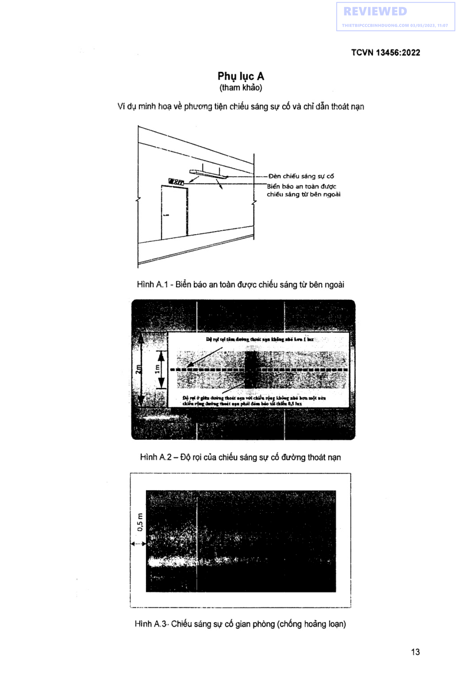
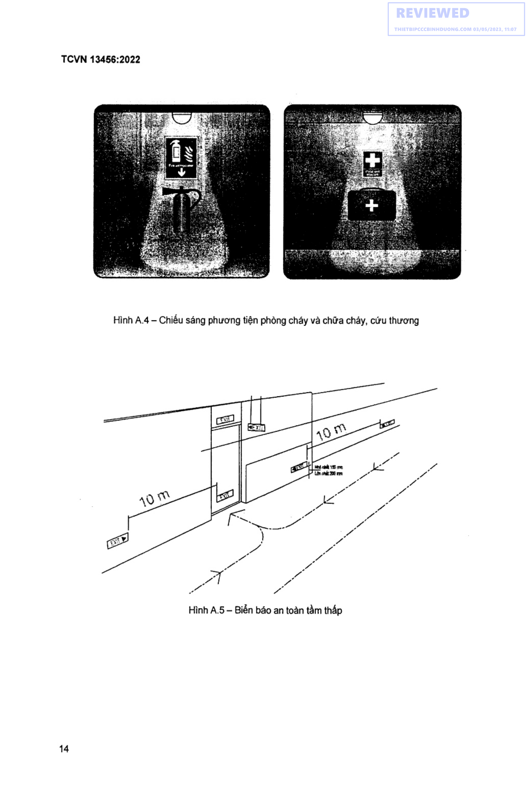
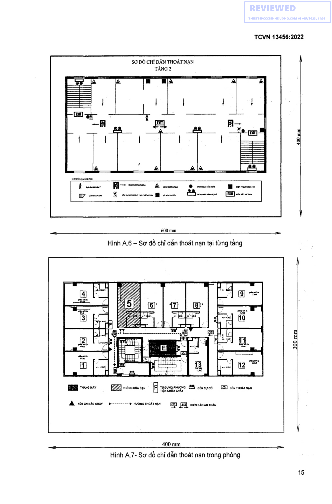
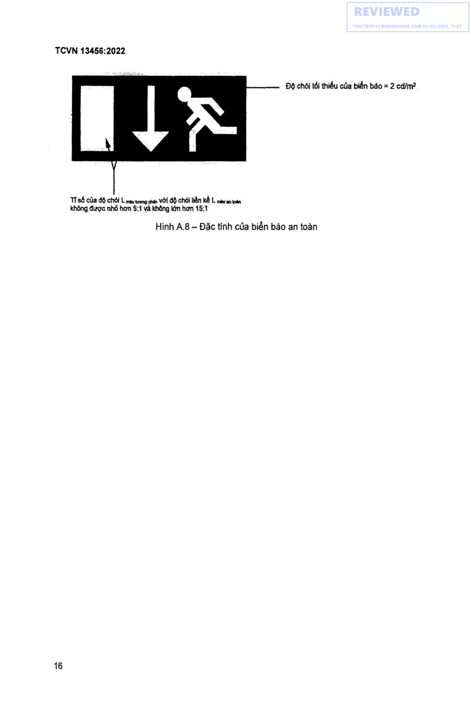

## PHỤ LỤC A (tham khảo) — Ví dụ minh hoạ về phương tiện chiếu sáng sự cố và chi dẫn thoát nạn

———}—-— Đèn chiếu sáng sự cố

Biển báo an toàn được I chiếu sang từ bên ngoài

Ce eee lá. 2ề4%5c° oi avis anna La bác

DDG rợi cợi tâm đường choác nign không nhé here Í bax’

<strong>Hình A.3 — Chiếu sáng sự cố gian phòng (chống hoảng loạn)</strong>

TCVN 13486:2022

<strong>Hình A.4 — Chiếu sáng phương tiện phòng cháy và chữa chảy, cứu thương</strong>

<strong>Hình A.5 — Biển báo an toàn tầm thấp</strong>

SƠ ĐỒ CHÍ DAN THOÁT NAN TÀNG2

a RÀ

mm THANG MÁY Z2 Fi To oyna PHUCNG 2S otusựco ED ew THoAT Nan

Á  HữrAns(ocuYV = p-------- } HƯỚNGTHOÁTMẠN — [GTT [TH] wien mAo AN TOAN

400 mm

<strong>Hình A.7 — Sơ đồ chỉ dẫn thoát nạn trong phòng</strong>

400 mm

300 mm

Độ chói tối thiểu của biển báo = 2 cd/m?

TÏ số của độ chói L màu wong phan Với độ chói liên KA L màu an toán không được nhỏ hơn 5:1 và không lớn hơn 15:1

<strong>Hình A.8 — Đặc tính của biển báo an toàn</strong>

THƯ MỤC TÀI LIỆU THAM KHẢO

[1] SO 30061:2007 Emergency lighting (Chiếu sáng sự cố); [2] QCVN 06:2021/BXD Quy chuẩn kỹ thuật quốc gia về an toàn cháy cho nhà và công trình;

[3] QCVN 22:2016/BYT Quy chuẩn kỹ thuật quốc gia về chiếu sáng - Mức cho phép chiếu sáng nơi làm việc;

[4] TCVN 3890:2009 Phương tiện phòng cháy và chữa cháy cho nhà và công trình - trang bị, bé trí, kiểm tra, bảo dưỡng;

[5] ISO 16069 Graphical symbols — Safety signs — Safety way guidance systems (SWGS) ( Ký hiệu đồ họa - Dau hiệu an toàn - Hệ thống hướng dẫn cách an toàn (SWGS);

[6] Code of Practice for Fire Precautions in Buildings 2018. -