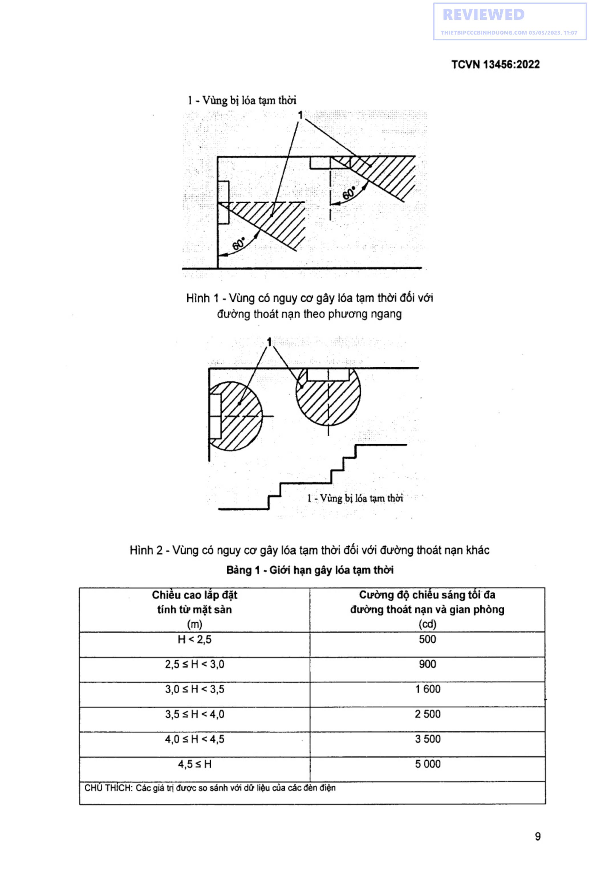
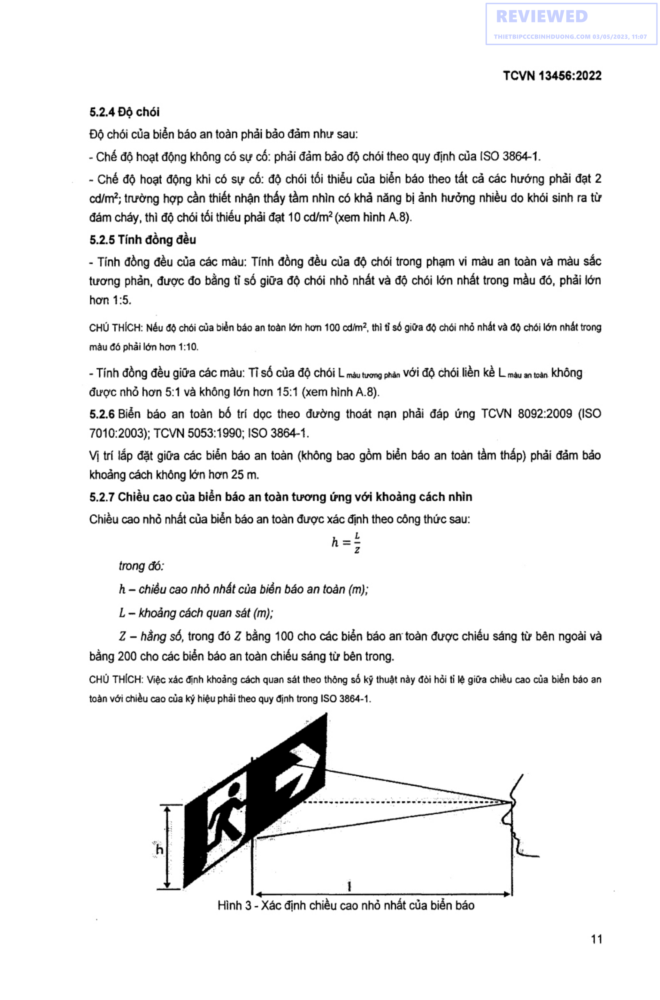

TCVN TIEU CHUAN QUOC GIA

Xuất bản lần 1

PHONG CHÁY CHỮA CHAY - PHƯƠNG TIEN

CHIEU SÁNG SỰ CÓ VÀ CHỈ DAN THOÁT NAN -

YEU CÀU THIET KE, LAP ĐẶT

Fire protection - Emergency lighting and Exit sign —

Design, installation requirements

HA NOI - 2022

Lời nói đầu

TCVN 13456:2022 được xây dựng trên cơ sở tham khảo |ISO 30061:2007.

TCVN 13456:2022 do Cục Cảnh sát Phòng cháy, chữa cháy và cứu nạn, cứu hộ chủ trì biên soạn, Bộ Công an đề nghị, Tổng cục Tiêu chuẩn Đo lường chat lượng thẩm định, Bộ Khoa học và Công nghệ công bó.

TIEU CHUAN QUOC GIA TCVN 13456:2022

Phòng cháy chữa cháy - Phương tiện chiếu sáng sự cố và chi dẫn thoát nạn - Yêu cau thiết ké, lắp đặt

Fire protection - Emergency lighting and Exit sign - Design, installation requirements

## 1  PHAM VI AP DUNG

Tiêu chuẩn này áp dụng để thiết kế, lắp đặt phương tiện chiếu sáng sự có và chi dan thoát nạn được trang bị cho gian phòng, nhà và các công trình xây dựng trong tất cả các giai đoạn xây dựng mới, cải tạo, sửa chữa hay thay đỗi công năng.

## 2  TÀI LIỆU VIỆN DẪN

Các tài liệu viện dẫn sau đây là cần thiết cho việc áp dụng tiêu chuẩn. Đối với các tài liệu ghi năm công bé thì áp dụng các bản được nêu. Đối với các tài liệu không ghi năm công bố thì áp dụng bản mới nhất (bao gồm cả các sửa đổi).

TCVN 7722-2-22:2013 (IEC 60598-2-22:2008) Đèn điện- Part 2-22: Yêu cầu cụ thé — Đèn điện cho chiếu sáng khan cap;

ISO 3864-1 Graphical symbols — Safety colours and safety signs — Part 1: Design principles for safety signs in workplaces and public areas (Ký hiệu đồ hoa - Màu sắc an toàn và dấu hiệu an toàn - Phan 1: Nguyên tắc thiết kế biển báo an toàn nơi làm việc và khu vực công cộng);

TCVN 4879:1989 (ISO 6309:1987) Phòng cháy — Dấu hiệu an toàn;

TCVN 8092:2009 (ISO 7010:2003) Ký hiệu đồ họa - mau sắc an toàn và biển báo an toàn — biển báo an toàn sử dụng ở nơi làm việc và nơi công cộng;

TCVN 5053:1990 Màu sắc tín hiệu và dấu hiệu an toàn;

## 3  THUẬT NGỮ VÀ ĐỊNH NGHĨA

3.1

Đường thoát nạn (escape route )

Đường di chuyén liên tục và không bị chặn từ một điểm bat kỳ trong nhà hoặc công trình đến lối ra bên ngoài.

3.2

Lối ra thoát nạn (exit access)

Lối ra trên đường thoát nạn dẫn ra khu vực an toàn từ khu vực bị cháy, nỗ .

3.3

Chiếu sáng sự cố (emergency lighting)

Cung cấp ánh sáng để đảm bảo an toàn cho người sơ tán khỏi khu vực nguy hiểm hoặc phục vụ giải quyết tình huống nguy hiểm trước khi sơ tản khỏi khu vực đó khi nguồn cung cấp cho chiếu sáng thông thường bị sự có. Chiếu sáng sy cố bao gồm chiếu sáng đường thoát nạn, chiếu sáng gian phòng vả chiếu sang cho cac phương tiện phòng cháy và chữa cháy hoạt động.

### 3.4  Chiếu sáng đường thoát nạn (escape route lighting)

Cung cap ánh sáng dé đảm bảo dễ dàng nhận biết các đường thoát nạn trong nhà và công trình, đồng thời giúp phát hiện các vật cản trong quá trình thoát nạn.

3.5

Chiếu sáng sự có gian phòng (open area lighting)

Cung cắp ánh sáng dé tránh hoảng sợ khi xảy ra sự cố và đảm bảo cho người tiếp cận đến vị trí có thể phát hiện ra đường thoát nạn (hay còn gọi là chiếu sáng khoảng trống hoặc chiếu sáng chống hoảng loạn).

3.6

Chiếu sáng cho các phương tiện phòng cháy và chữa cháy (emergency lighting for firefighting facilities)

Cung cấp ánh sáng dé đảm bảo cho người vận hành, cũng như người sử dụng có thé thao tác đúng các quy trình hoạt động của phương tiện phòng cháy và chữa cháy bên trong nhà khi xảy ra sự cố.

3.7

Biển báo an toàn (safety sign)

Các biển báo (biển báo chỉ hướng thoát nan và biển báo chỉ dẫn lối ra thoát nạn) cung cấp các chi dẫn thoát nạn thông qua sự kết hợp của màu sắc, hình dạng và một số ký hiệu hình học hoặc chữ (ISO 3864-1 /TCVN 4879:1989 / TCVN 8092:2009). Biển báo an toàn gồm 2 loại: biển báo an toàn được chiếu sáng từ bên ngoài và biển báo an toàn được chiếu sáng từ bên trong.

3.8

Biển báo an toàn được chiếu sáng từ bên ngoài (externally illuminated safety sign)

Biển báo được chiếu sáng bởi một nguồn sáng từ bên ngoài (xem hình A.1).

3.9

Biển báo an toàn được chiếu sáng từ bên trong (internally illuminated safety sign)

Biển báo được chiếu sáng bởi một nguồn sáng từ bên trong.

3.10

Biển báo chỉ hướng thoát nan (direction escape route sign)

Biển báo dé đánh dấu hướng của một đường thoát nạn.

3.11

Biển báo chỉ dẫn lối ra thoát nạn (exit sign)

Biển báo dé đánh dau lối ra thoát nạn.

3.12

Độ roi (illuminance)

Độ sáng của một vat được một chùm sáng chiếu vào, đơn vị là Lux. 1 Lux là độ sang của một vat được một nguồn sáng ở cách xa 1 m có quang thông bằng 1 Lumen chiếu trên diện tích bang 1 m2 [3].

### 3.13  Độ chói (luminance)

Đại lượng dẫn xuất trong quang học, đặc trưng cho khả năng bức xa ánh sáng của nguồn sáng gây nên cảm giác chói sáng đối với mắt. Đơn vị là cd/m?.

3.14

Gian lánh nạn (safe refuge space)

Khu vực bố trí trong tang lánh nạn dùng dé sơ tán tạm thời khi xảy ra sự có cháy [2].

### 3.15  |

Sơ đồ chỉ dẫn thoát nan (evacuation plan)

Sơ đồ chỉ dẫn lối ra, đường thoát nạn khi xảy ra cháy, nd, sự cố.

## 4  QUY ĐỊNH CHUNG

### 4.1  Việc thiết kế, lắp đặt phương tiện chiếu sáng và chỉ dẫn thoát nạn phải tuân thủ các yêu cầu, quy định của các quy chuẩn, tiêu chuẩn, quy phạm hiện hành có liên quan.

### 4.2  Phương tiện chiếu sang sự cố và chỉ dẫn thoát nạn bao gồm: đèn chiếu sáng sự có; biển báo an toàn; sơ đồ chỉ dẫn thoát nạn..

### 4.3  Phương tiện chiếu sáng sự cố và chỉ dẫn thoát nạn phải được lựa chọn, trang bị phù hợp để đảm bảo tầm nhìn thoát nạn, chỉ thị rõ ràng đường thoát nạn, cảnh báo những vị trí có nguy cơ gây nguy hiểm trong quá trình thoát nạn và nhận biết các vị trí trang bị các thiết bị phòng cháy và chữa cháy.

### 4.4  Lắp đặt đèn chiếu sáng sự cố và biển báo an toàn phải phù hợp theo quy định của TCVN 7722-

2-22:2013. Khi lắp đặt đèn chiếu sáng sự cố và biển báo an toàn trong nhà, công trình, hạng mục công trình có nguy hiểm về nổ hoặc độ Am cao phải sử dụng các đèn, biển báo có khả năng chống nỗ hoặc chống ẩm.

### 4.5  Đèn chiếu sáng sự cố và biển báo an toàn có nguồn điện dự phòng phải đảm bảo thời gian hoạt động 6n định liên tục tối thiểu là 120 min khi có sự cố cháy, nỗ.

### 4.6  Biển báo an toàn phải được nhìn thấy rõ ràng các chữ “LOI RA” hoặc chữ "EXIT”, ký hiệu hình học khác thích hợp. Màu sắc của bién báo an toàn: màu nền là màu xanh lá cây; màu chữ và ký hiệu hình học là mau trắng.

## 5  YÊU CẦU THIẾT KẾ, LẮP ĐẶT

### 5.1  Chiếu sáng sự có

### 5.1.1  Đèn chiếu sáng sự cố phải được lắp đặt cho các khu vực của nhà va công trình tại các vị trí sau:

a) \- Cầu thang bộ thoát nạn; b) Đường thoát nạn và vị trí chuyển hướng thoát nạn, nút giao của hành lang;

c) \- Vị trí trên đường thoát nạn có thay đổi về cao độ;

d) \- Cửa, li ra thoát nạn;

e) \- Gara để xe;

f) \- Trong gian phòng có người làm việc và khoảng cách từ điểm xa nhất của gian phòng đến lối ra thoát nạn gần nhất lớn hơn 13 m. Trường hợp các gian phòng này có bố trí đường thoát nạn thì có thé chỉ lắp đặt đèn chiếu sáng sự có tại đường thoát nạn đó;

g) \- Trong phòng đặt trạm biến áp, phòng máy phát điện, phòng kỹ thuật thang máy, gian lánh nạn;

h) \- Trong phòng trực điều khiển chống cháy, phòng bơm chữa cháy và tại các vị trí trang bị phương tiện phòng cháy và chữa cháy khác.

Có thể không cần bé trí trong các trường hợp sau:

&nbsp;&nbsp;\- Sân vườn, khu vực sân thượng không có mái che;

&nbsp;&nbsp;\- Toa nhà cao 01 tang có diện tích san không quá 200 m? và diện tích lỗ hở trên tường ngoài nhà đạt tối thiểu 80%.

### 5.1.2  Chiếu sáng sự cố đường thoát nan

Đối với những đường thoát nạn có chiều rộng đến 2 m, thì độ rọi trung bình theo phương nằm ngang trên mặt sàn dọc theo tâm của đường thoát nạn phải lớn hơn hoặc bằng 1 lux và dải ở giữa với chiều rộng lớn hơn hoặc bằng một nửa chiều rộng của đường thoát nạn phải có được chiếu sáng tối thiểu 50 % giá trị đó (xem hình A.2).

**CHÚ THÍCH:** Các đường thoát nạn rộng hơn có thé được xem là một số dải rộng 2m hoặc được xử lý như chiếu sáng

khoảng trống (chống hoảng loạn).

### 5.1.3  Chiếu sáng sự có gian phòng

Độ rọi trung bình theo phương nằm ngang không được nhỏ hơn 0,5 lux tại mặt sàn tại mọi điểm lõi của khoảng trống, không bao gồm đường viền 0,5 m theo chu vi khu vực (xem hình A.3).

### 5.1.4  Tỉ lệ giữa độ rọi lớn nhát và độ rọi nhỏ nhát dọc theo đường tâm của đường thoát nạn và chiếu sáng khoảng trống (chống hoảng loạn) không được lớn hơn 40:1.

CHÚ THICH : Để chứng minh tỉ lệ một hệ thống mạng lưới điện nên được sử dụng theo CIE S 015, chương 4.3.3.

### 5.1.5  Phải đảm bảo giảm thiểu nguy cơ gây lóa tạm thời bằng cách hạn chế cường độ sáng ở giai đoạn phát sáng cực đại trong chế độ hoạt động khi có sự cố của mỗi đèn thuộc phạm vi quan sát. Cụ thẻ:

&nbsp;&nbsp;\- Đối với việc chiếu sáng đường thoát nạn theo phương ngang so với mặt sàn, chiếu sáng gian phòng và chiếu sáng cho các phương tiện phòng cháy và chữa cháy, cường độ chiếu sáng của các đèn trong phạm vi góc chiếu từ 60° đến 90° không được vượt quá giá trị quy định tại Bảng 1 (xem Hình 1).

&nbsp;&nbsp;\- Đối với đường thoát nạn khác, cường độ chiếu sáng của các đèn không được vượt quá giá trị tại Bảng 1 ở bất kỳ góc chiếu nào (xem Hình 2).

**CHÚ THÍCH:** Việc bó trí đèn chiếu sáng sự cố không phù hợp có thé làm lóa mắt và ngăn cản tầm nhìn của người trong quá trình di chuyển đến nơi an toàn.

1 - Vùng bị lóa tạm thời

`.

<strong>Hình 1 — Vùng có nguy cơ gây lóa tạm thời đối với đường thoát nạn theo phương ngang</strong>

IS

1 - Vùng bị lóa tạm thời

<strong>Hình 2 — Vùng có nguy cơ gây lóa tạm thời đối với đường thoát nạn khác</strong>

### Bảng 1 - Giới hạn gây lóa tạm thời

| Chiều cao lắp đặt tính từ mặt sàn đường thoát nạn và gian phòng (m) | Cường độ chiếu sáng tối đa (cd) |
| :--- | :---: |
| H < 2,5 | 500 |
| 2,5 ≤ H < 3,0 | 900 |
| 3,0 ≤ H < 3,5 | 1600 |
| 3,5 ≤ H < 4,0 | 2500 |
| 4,0 ≤ H < 4,5 | 3500 |
| 4,5 ≤ H | 5000 |

CHỦ THÍCH: Các giá trị được so sánh với dữ liệu của các đèn điện

### 5.1.6  Các tủ trung tâm báo cháy, nút án báo cháy va các phương tiện chữa cháy phải luôn được chiếu sáng day đủ dé có thé dễ dàng xác định vi tri và néu không nằm trên đường thoát nạn hoặc không nằm trong một phạm vi khoảng trống thì phải được chiếu sáng tối thiểu 5 lux tại mặt sàn (xem hình A.4).

### 5.2  Chỉ dẫn thoát nạn

### 5.2.1  Biển báo chỉ dẫn lối ra thoát nạn

Lắp đặt biển báo chỉ dẫn lối ra thoát nạn ở tat cả các lối ra vào của cầu thang bộ thoát nạn, các đường thoát nạn trên tang nhà và tat cả các lối ra của gian phòng có từ 02 lối ra thoát nạn trở lên;

Có thé không cần bó tri trong các trường hợp sau: - Đối với gian phòng có trang bị chiếu sáng sự có phải đảm bảo một trong các điều kiện sau: + Chỉ có 01 lối ra vào hoặc; + Có lối ra trực tiếp ra hành lang bên hoặc không gian ngoài nha. - Đối với gian phòng không trang bị chiếu sáng sự cố phải đảm bảo một trong các điều kiện sau: + Chỉ có 01 lối ra vào và khoảng cách từ điểm bat kỳ của gian phòng đến lối ra thoát nạn gần nhất không lớn hơn 7 m; + Khoảng cách từ điểm bắt kỳ của gian phòng đến cửa ra vào không lớn hơn 13 m và diện tích tối thiểu phần tường tiếp giáp hành lang đạt 50 % là kính đồng thời đảm bảo một trong các điều kiện sau: e _ Cửa mở vào hành lang có bố trí chiếu sáng sự cố; e Ctra mở hành lang bên hoặc mở trực tiếp ra ngoài nhà. - Đối với nhà 1 tầng có diện tích sàn không quá 200 m và diện tích lỗ hở trên tường ngoài nhà đạt tối thiểu 80%.

### 5.2.2  Biển báo chỉ hướng thoát nạn Lắp đặt biển báo chỉ hướng thoát nạn trên đường thoát nạn, ở trong gian phòng và tất cả các vị trí mà tầm nhìn bị che khuất không thé phát hiện được các lối ra thoát nạn. Có thể không cần bố trí biển chỉ hướng thoát nạn, trong các trường hợp sau: - Sân vườn, khu vực sân thượng không có mái che.

&nbsp;&nbsp;\- Nhà 1 tầng chỉ có mái che (không có tường bao quanh), với diện tích sàn không quá 200 m? và diện tích lỗ hở chiếm tdi thiểu 80% diện tích tường ngoài của nha.

### 5.2.3  Biển báo an toàn tam thấp

Lắp đặt các biển báo chỉ dẫn lối ra thoát nạn và biển báo chỉ hướng thoát nạn tầm thấp ở các tang nhà có bố trí phòng nghỉ của khách sạn cao từ 07 tang hoặc tổng khói tích 5.000 m? trở lên có hành lang thoát nạn lớn hơn 10 m.

Đáy của biển báo tầm thấp phải lắp cách sàn một khoảng từ 150 mm đến 200 mm. Khoảng cách giữa các biển báo phải được đặt cách nhau không quá 10 m. Đối với cửa thoát hiểm, bién báo phải ở trên cửa hoặc giáp cửa với mép gần nhát của biển báo trong phạm vi 100 mm tính từ khung cửa (xem hình A.5).

Các biển báo an toàn ở tầm thấp được thiết kế để hỗ trợ người sinh sống, làm việc trong tòa nhà đến các lối ra thoát nạn khi khói che khuất các lối ra hoặc các biển báo chỉ dẫn lối ra thoát nạn được gắn ở phía trên cửa và không thay thé biển báo an toàn tiêu chuẩn.

### 5.2.4  Độ chói

Độ chói của biển báo an toàn phải bảo đảm như sau:

&nbsp;&nbsp;\- Chế độ hoạt động không có sự cố: phải đảm bảo độ chói theo quy định của ISO 3864-1.

&nbsp;&nbsp;\- Chế độ hoạt động khi có sự cố: độ chói tối thiểu của biễn báo theo tất cả các hướng phải đạt 2 cd/m?; trường hợp cần thiết nhận thấy tầm nhìn có khả năng bị ảnh hưởng nhiều do khói sinh ra từ đám cháy, thì độ chói tối thiếu phải đạt 10 cd/m? (xem hình A.8).

### 5.2.5  Tính đồng đều

&nbsp;&nbsp;\- Tính đồng đều của các màu: Tính đồng đều của độ chói trong phạm vi màu an toàn và màu sắc tương phản, được đo bằng tỉ số giữa độ chói nhỏ nhát và độ chói lớn nhất trong màu đó, phải lớn hơn 1:5.

**CHÚ THÍCH:** Nếu độ chói của biển báo an toàn lớn hơn 100 cd/m2, thì tỉ số giữa độ chói nhỏ nhát và độ chói lớn nhất trong màu đó phải lớn hơn 1:10.

&nbsp;&nbsp;\- Tính đồng đều giữa các màu: Tỉ số của độ chói L màu tương phan với độ chói liền kề L màu antoan không được nhỏ hơn 5:1 và không lớn hơn 15:1 (xem hình A.8).

### 5.2.6  Biển báo an toàn bố tri dọc theo đường thoát nạn phải đáp ứng TCVN 8092:2009 (ISO

7010:2003); TCVN 5053:1990; ISO 3864-1.

Vị trí lắp đặt giữa các biển báo an toàn (không bao gồm biển báo an toàn tam thấp) phải đảm bảo khoảng cách không lớn hơn 25 m.

### 5.2.7  Chiều cao của biển báo an toàn tương ứng với khoảng cách nhìn Chiều cao nhỏ nhất của biển báo an toàn được xác định theo công thức sau: n=!

trong đó:

&nbsp;&nbsp;&nbsp;&nbsp;\- h — chiêu cao nhỏ nhất của biển báo an toàn (m);

&nbsp;&nbsp;&nbsp;&nbsp;\- L ~ khoảng cách quan sát (m);

&nbsp;&nbsp;&nbsp;&nbsp;\- Z - hằng sé, trong đó Z bằng 100 cho các biển báo an toàn được chiếu sáng từ bên ngoài và bằng 200 cho các biển báo an toàn chiếu sáng từ bên trong.

&nbsp;&nbsp;&nbsp;&nbsp;\- CHỦ THÍCH: Việc xác định khoảng cách quan sát theo thông số kỹ thuật này đòi hỏi tỉ lệ giữa chiều cao của biển báo an toàn với chiều cao của ký hiệu phải theo quy định trong ISO 3864-1.

<strong>Hình 3 — Xác định chiều cao nhỏ nhất của biển báo</strong>

### 5.2.8  Chiều cao lắp đặt biển báo an toàn

Biển báo an toàn (không bao gồm biển báo an toàn tam tháp) phải lắp đặt ở độ cao từ 2 m đến 2,7 m so với mặt sàn, hoặc ngay trên cửa néu cửa có chiều cao lớn hơn 2,7 m. Các khu vực không được bảo vệ chống khói khiến khói tích tu có thé che khuất thì biển báo an toàn nên được gắn thấp hon trần nhà tối thiểu 0,5 m để tránh bị ngập khói và không được lắp đặt biển báo an toàn được chiếu sáng từ bên ngoài.

### 5.2.9  Sơ đồ chỉ dẫn thoát nạn

&nbsp;&nbsp;\- Tại các tầng có diện tích lớn hơn 1000 m? hoặc có từ hai lối ra thoát nạn trở lên phải có sơ đồ chi dẫn thoát nạn (xem hình A.6).

&nbsp;&nbsp;\- Trong các phòng nghỉ của của khách sạn và các cơ sở lưu trú, cho thuê phòng ở phải có sơ đồ chỉ dẫn thoát nạn (xem hình A.7).

&nbsp;&nbsp;\- Sơ đồ chỉ dẫn thoát nạn gồm hai phần: phần chỉ dẫn bằng chữ và phần ký hiệu hình học. Sơ đồ chỉ dẫn thoát nạn phải được niêm yét ở các vị trí dễ nhận biết, dễ thấy và vị trí có người thường xuyên qua lại (xem hình A.6).

+ Phần ký hiệu hình học bao gồm mặt bằng của tầng; lối ra và chỉ hướng đường thoát nạn; cầu thang bộ; vị trí của sơ đồ tại tầng; vị trí đặt phương tiện, thiết bị chữa cháy và cứu nạn, cứu hộ (ký hiệu phù hợp với quy định tại TCVN 4879:1989 và TCVN 5053 : 1990).

+ Phần chỉ dẫn bằng chữ gồm nội dung và trình tự xử lý khi có cháy.

&nbsp;&nbsp;\- Kích thước của sơ đồ chỉ dẫn thoát nạn phụ thuộc vào đặc tính, tính chất hoạt động; diện tích của tầng, phòng; phương án thoát nạn nhưng không được nhỏ hơn:

&nbsp;&nbsp;&nbsp;&nbsp;\- 600x400 mm - đối với sơ đồ chỉ dẫn tại tang;

&nbsp;&nbsp;&nbsp;&nbsp;\- 400x300 mm - đối với sơ đồ chỉ dẫn tại phòng.

&nbsp;&nbsp;\- Sơ đồ chỉ dẫn thoát nạn được gắn sao cho mép dưới của sơ đồ chỉ dẫn thoát nạn nằm ở độ cao

1,5 m ‡ 0,2 m so với mặt san.

---

## 📑 DANH MỤC PHỤ LỤC KỸ THUẬT CHUYÊN ĐỀ (MODULAR ANNEXES)

Toàn bộ 1 Phụ lục kỹ thuật chuyên đề đã được module hóa thành các tệp độc lập nhằm tối ưu hóa tra cứu và thẩm tra thiết kế (ADR 0021 & ADR 0030):

| Ký hiệu | Tên Phụ Lục | Tính chất | Liên kết Tập tin |
| :---: | :--- | :---: | :---: |
| **Phụ lục A** | Ví dụ minh hoạ về phương tiện chiếu sáng sự cố và chi dẫn thoát nạn | tham khảo | [📑 **Xem Phụ lục**](annexes/phu_luc_a_vi_du_minh_hoa_ve_phuong_tien_chieu_sang_su_c.md#phu-luc-a) |

---

## 📊 HỆ THỐNG TRA CỨU BẢNG & SƠ ĐỒ KỸ THUẬT

- **Tra cứu 1 Bảng Số Liệu:** Tra cứu chi tiết dạng CSV/JSON tại [Thư mục Bảng Số Liệu](tables/README.md).
- **Tra cứu Sơ Đồ Hình Vẽ:** Tra cứu ảnh nét cao và đặc tả phân vùng tại [Danh Mục Sơ Đồ Khí Động](figures/figures_catalog.yaml).