
## PHỤ LỤC A (Tham khảo) — Các hình minh họa

**CHÚ THÍCH:** Các hình trong Phụ lục này chỉ mang tính chất minh họa.

<!-- DIAGRAM: word/media/image2.png -->

**CHÚ DẪN**

### Bảng Phụ lục A

| A1, A2 | Mặt đường cho xe chữa cháy |
| :--- | :--- |
| B | Một nửa khoảng cách từ sàn đến trần của tầng trên cùng |
| H1, H2 | Chiều cao PCCC |

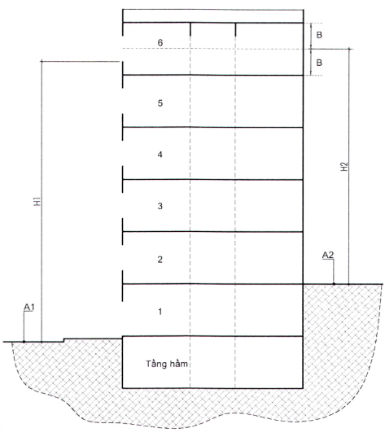

**CHÚ THÍCH:** Trường hợp các mặt đường tiếp cận nhà có cao độ khác nhau thì nhà có thể có các chiều cao PCCC khác nhau tùy thuộc vào phương án thiết kế an toàn cháy cụ thể.

<strong>Hình A.1 — Ví dụ minh họa cách xác định chiều cao PCCC cho nhà có mặt đường cho xe chữa cháy tiếp cận ở các cao độ khác nhau</strong>

<!-- DIAGRAM: word/media/image3.png -->

**CHÚ DẪN:**

### Bảng Phụ lục A (Phần 2)

| A | Mặt đường cho xe chữa cháy |
| :--- | :--- |
| B | Một nửa khoảng cách từ sàn đến trần của tầng trên cùng |
| H1, H2 | Chiều cao PCCC |

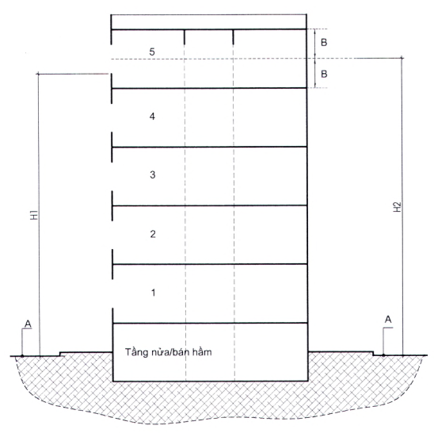

**CHÚ THÍCH:** Lựa chọn giá trị lớn hơn giữa H1 và H2 làm chiều cao PCCC của nhà.

<strong>Hình A.2 — Ví dụ minh họa cách xác định chiều cao PCCC cho nhà có tầng nửa/bán hầm</strong>

<!-- DIAGRAM: word/media/image4.png -->

**CHÚ DẪN:**

### Bảng Phụ lục A (Phần 3)

| A | Mặt đường cho xe chữa cháy |
| :--- | :--- |
| B | Một nửa khoảng cách từ sàn đến trần của tầng trên cùng |
| H1, H2 | Chiều cao PCCC |

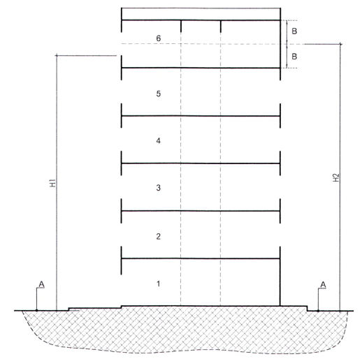

**CHÚ THÍCH:** Lựa chọn giá trị lớn hơn giữa H1 và H2 làm chiều cao PCCC của nhà.

<strong>Hình A.3 — Ví dụ minh họa cách xác định chiều cao PCCC cho nhà không có tầng nửa/bán hầm</strong>

<!-- DIAGRAM: word/media/image5.png -->

**CHÚ DẪN:**

### Bảng Phụ lục A (Phần 4)

| A | Mặt đường cho xe chữa cháy |
| :--- | :--- |
| B | Một nửa khoảng cách từ sàn đến trần của tầng trên cùng |
| H | Chiều cao PCCC |

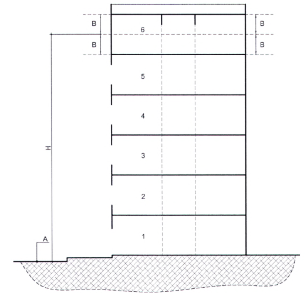

<strong>Hình A.4 — Ví dụ minh họa cách xác định chiều cao PCCC cho nhà không có lỗ mở (cửa sổ) ở tầng trên cùng</strong>

<!-- DIAGRAM: word/media/image6.png -->

**CHÚ DẪN:**

### Bảng Phụ lục A (Phần 5)

| A | Mặt đường cho xe chữa cháy |
| :--- | :--- |
| H | Chiều cao PCCC |

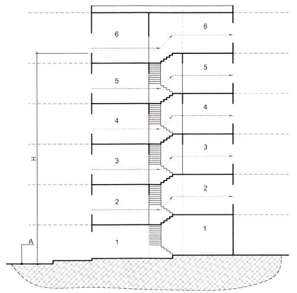

<strong>Hình A.5 — Ví dụ minh họa cách xác định chiều cao PCCC cho nhà lệch tầng chỉ có đường cho xe chữa cháy tiếp cận ở một phía</strong>

<!-- DIAGRAM: word/media/image7.png -->

**CHÚ DẪN:**

### Bảng Phụ lục A (Phần 6)

| A | Mặt đường cho xe chữa cháy |
| :--- | :--- |
| B | Một nửa khoảng cách từ sàn đến trần của tầng trên cùng |
| H1, H2 | Chiều cao PCCC |

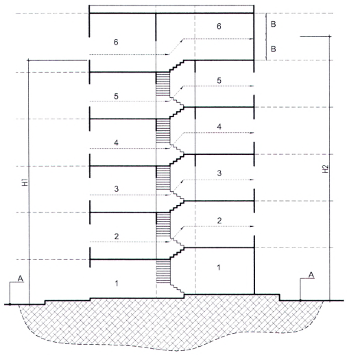

**CHÚ THÍCH:** Lựa chọn giá trị lớn hơn giữa H1 và H2 làm chiều cao PCCC của nhà.

<strong>Hình A.6 — Ví dụ minh họa cách xác định chiều cao PCCC cho nhà lệch tầng có đường cho xe chữa cháy tiếp cận ở hai phía (một mặt ngoài không có lỗ mở, cửa sổ ở tầng trên cùng)</strong>

<!-- DIAGRAM: word/media/image8.png -->

**CHÚ DẪN:**

### Bảng Phụ lục A (Phần 7)

| A | Mặt đường cho xe chữa cháy |
| :--- | :--- |
| H1, H2 | Chiều cao PCCC |

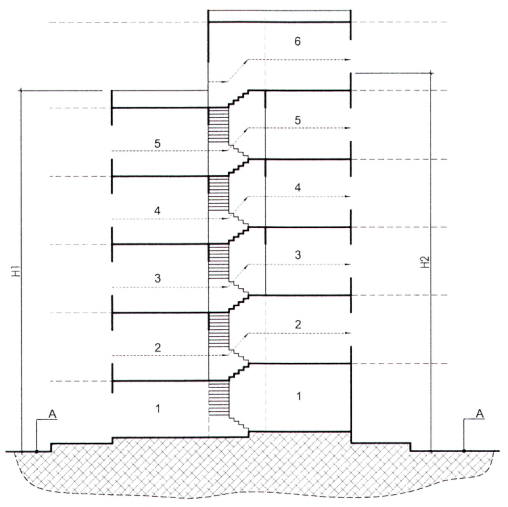

**CHÚ THÍCH:** Lựa chọn giá trị lớn hơn giữa H1 và H2 làm chiều cao PCCC của nhà.

<strong>Hình A.7 — Ví dụ minh họa cách xác định chiều cao PCCC cho nhà lệch tầng có đường cho xe chữa cháy tiếp cận ở hai phía (hai phía đều có lỗ mở, cửa sổ ở mặt ngoài tầng trên cùng)</strong>

<!-- DIAGRAM: word/media/image9.png -->

**CHÚ DẪN:**

### Bảng Phụ lục A (Phần 8)

| A | Mặt đường cho xe chữa cháy |
| :--- | :--- |
| H | Chiều cao PCCC |

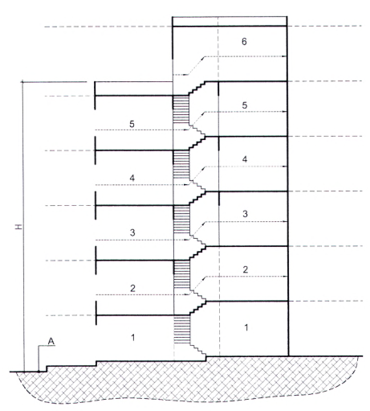

<strong>Hình A.8 — Ví dụ minh họa cách xác định chiều cao PCCC cho nhà lệch tầng chỉ có đường cho xe chữa cháy tiếp cận ở một phía và có sân thượng có người sử dụng</strong>

<!-- DIAGRAM: word/media/image10.png -->

**CHÚ DẪN:**

### Bảng Phụ lục A (Phần 9)

| Ht | Chiều cao thông thủy cầu thang bộ |
| :--- | :--- |
| H | Chiều cao bậc thang |
| B | Chiều rộng bậc thang |

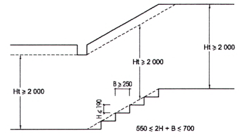

<strong>Hình A.9 — Ví dụ minh họa chiều cao thông thủy cầu thang bộ; chiều cao bậc thang và chiều rộng mặt bậc thang</strong>

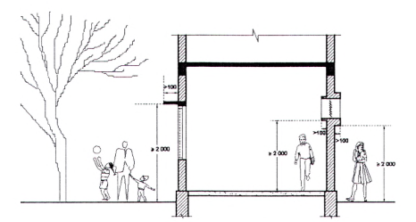

<strong>Hình A.10 — Ví dụ minh họa chiều cao thông thủy các bộ phận nhô ra</strong>

<!-- DIAGRAM: word/media/image12.png -->

a) \- Bố trí các ô cửa lấy sáng theo từng tầng

<!-- DIAGRAM: word/media/image13.png -->

b) \- Chiếu sáng tự nhiên đường thoát nạn, lấy sáng từ trên mái

**CHÚ DẪN:**

A  Ô cửa lấy sáng ở từng tầng

B  Ô lấy sáng trên mái

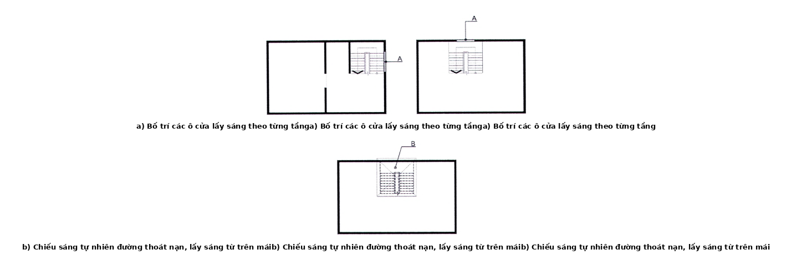

<strong>Hình A.11 — Ví dụ minh họa giải pháp chiếu sáng tự nhiên cho đường thoát nạn</strong>

<!-- DIAGRAM: word/media/image14.png -->

**CHÚ DẪN:**

A  Vùng mặt bậc an toàn cho di chuyển

B  Dải đánh dấu mép bậc

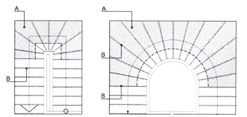

<strong>Hình A.12 — Ví dụ minh họa tăng cường nhận biết đối với cầu thang có bậc thang chéo (rẻ quạt)</strong>

<!-- DIAGRAM: word/media/image15.png -->

**CHÚ DẪN:**

### Bảng Phụ lục A (Phần 10)

| A | Thang dùng cho thoát nạn khẩn cấp | D | Chỉ giới xây dựng |
| :--- | :--- | :--- | :--- |
| B | Lối ra khẩn cấp qua lỗ mở trên sàn | E | Chỉ giới đường đỏ |
| C | Thang cơ động dẫn xuống đất |  |  |

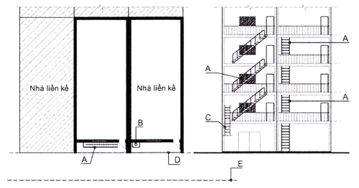

<strong>Hình A.13 — Ví dụ minh họa giải pháp bố trí thang thoát nạn ngoài nhà lắp đặt cố định và lối ra khẩn cấp qua lỗ mở trên sàn ban công, lô gia</strong>

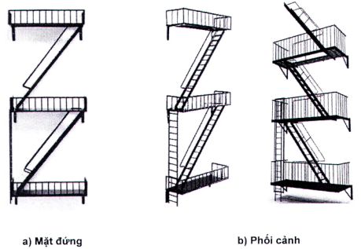

<strong>Hình A.14 — Ví dụ minh họa thang thoát nạn ngoài nhà cố định</strong>

<!-- DIAGRAM: word/media/image17.png -->

### Bảng Phụ lục A (Phần 11)

| a) Nhà có không gian trống ở mặt sau (mặt bằng) | b) Nhà có không gian trống ở bên cạnh (mặt bằng) |
| :--- | :--- |

<!-- DIAGRAM: word/media/image18.png -->

c) \- Nhà có khoảng lùi ở mặt tiền (mặt bằng)

**CHÚ DẪN:**

### Bảng Phụ lục A (Phần 12)

| A | Thang dùng cho thoát nạn khẩn cấp | D | Chỉ giới xây dựng |
| :--- | :--- | :--- | :--- |
| B | Lối ra khẩn cấp qua lỗ mở trên sàn | E | Chỉ giới đường đỏ |
| C | Lối thoát ra ngoài |  |  |

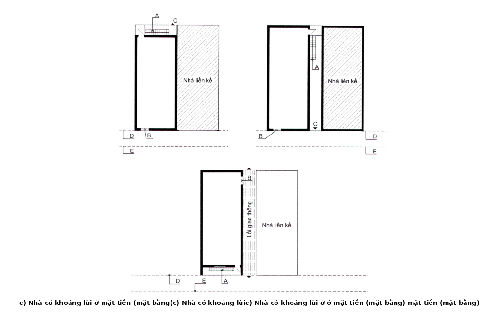

<strong>Hình A.15 — Ví dụ minh họa một số giải pháp bố trí lối ra khẩn cấp và thang thoát nạn ngoài nhà</strong>

<!-- DIAGRAM: word/media/image19.png -->

**CHÚ DẪN:**

### Bảng Phụ lục A (Phần 13)

| A | Khu vực lánh nạn tạm thời | L2 | Chiều rộng thông thủy của ban công (L2 ≥ 600) |
| :--- | :--- | :--- | :--- |
| L1 | Chiều dài của mảng tường đặc (L1 ≥ 1 200) | L3 | Chiều rộng thông thủy của lô gia (L3 ≥ 600) |

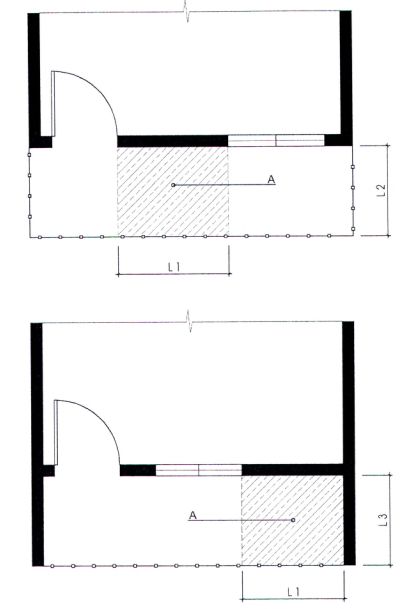

<strong>Hình A.16 — Ví dụ minh họa bố trí khu vực lánh nạn tạm thời tại ban công, lô gia</strong>

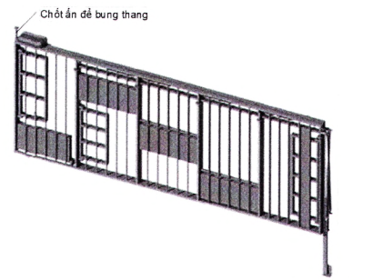

<strong>Hình A.17 — Ví dụ minh họa thang thoát nạn khẩn cấp tích hợp lan can tự hạ ở mặt ngoài nhà (trạng thái đóng của một phân đoạn thang trong phạm vi 1 tầng)</strong>

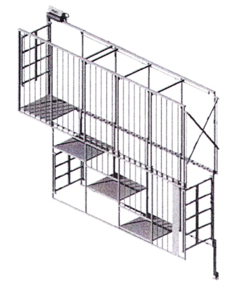

<strong>Hình A.18 — Ví dụ minh họa thang thoát nạn khẩn cấp tích hợp lan can tự hạ ở mặt ngoài nhà (trạng thái mở để thoát nạn của một phân đoạn thang trong phạm vi 1 tầng)</strong>

<!-- DIAGRAM: word/media/image22.png -->

**CHÚ DẪN:**

### Bảng Phụ lục A (Phần 14)

| 1 | Cầu thang bộ loại 1 (cầu thang kín, trong nhà): cầu thang bên trong nhà, được bao che kín bởi kết cấu buồng thang và cửa ra vào có khả năng chịu lửa (ngăn cháy). Tường phía ngoài có thể có lỗ mở |
| :---: | :--- |
| 2 | Cầu thang bộ loại 2 (cầu thang bộ hở, trong nhà): cầu thang bên trong nhà, không được bao kín bởi kết cấu buồng thang, không gian cầu thang thông với các không gian khác của nhà |
| 3 | Cầu thang bộ loại 3 (cầu thang bộ hở, ngoài nhà); cầu thang nằm phía ngoài nhà và không có buồng thang |
| 4 | Buồng thang bộ loại L1: kết cấu bao che cầu thang bộ trong nhà, có khả năng chịu lửa (ngăn cháy), có lỗ mở lấy ánh sáng ở tường ngoài trên mỗi tầng |
| 5 | Buồng thang bộ loại L2: kết cấu bao che cầu thang bộ trong nhà, có khả năng chịu lửa (ngăn cháy), có lỗ mở lấy ánh sáng từ trên mái của buồng thang |

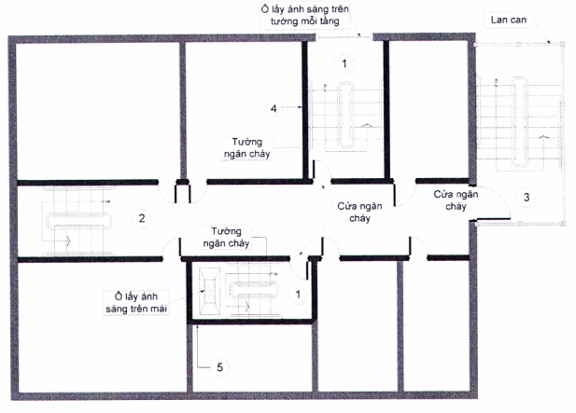

<strong>Hình A.19 — Ví dụ minh họa các dạng cầu thang và buồng thang bộ thông thường</strong>

<!-- DIAGRAM: word/media/image23.png -->

**CHÚ DẪN:**

A  Mặt đất

T  Số tầng nhà

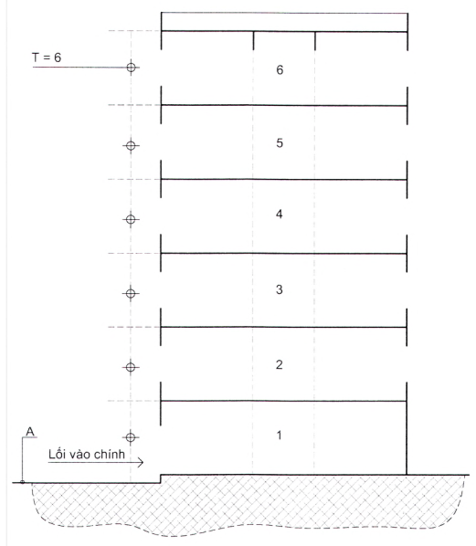

<strong>Hình A.20 — Ví dụ minh họa xác định số tầng nhà cho trường hợp nhà không có tầng hầm hoặc tầng nửa/bán hầm</strong>

<!-- DIAGRAM: word/media/image24.png -->

**CHÚ DẪN:**

A  Mặt đất

T  Số tầng nhà

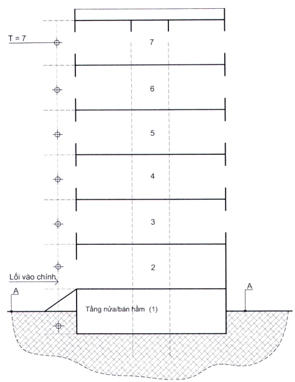

<strong>Hình A.21 — Ví dụ minh họa xác định số tầng nhà cho trường hợp nhà có tầng nửa/bán hầm</strong>

<!-- DIAGRAM: word/media/image25.png -->

**CHÚ DẪN:**

### Bảng Phụ lục A (Phần 15)

| A1, A2 | Mặt đất |
| :--- | :--- |
| T | Số tầng nhà |

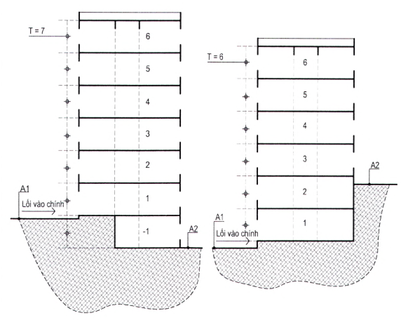

<strong>Hình A.22 — Ví dụ minh họa xác định số tầng nhà cho trường hợp nhà có các cao độ mặt đất khác nhau</strong>

<!-- DIAGRAM: word/media/image26.png -->

**CHÚ DẪN:**

A  Mặt đất

T  Số tầng nhà

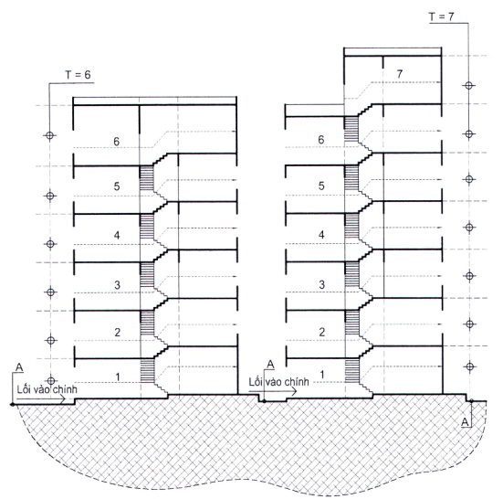

<strong>Hình A.23 — Ví dụ minh họa xác định số tầng nhà cho trường hợp nhà lệch tầng</strong>

Kích thước tính bằng milimét

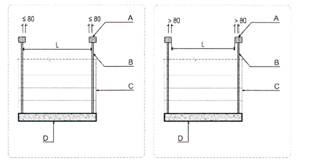

<strong>Hình A.24 — Cách xác định chiều rộng tính toán thoát nạn của vế thang (trường hợp trống cả hai bên vế thang)</strong>

Kích thước tính bằng milimét

<!-- DIAGRAM: word/media/image28.png -->

**CHÚ DẪN:**

### Bảng Phụ lục A (Phần 16)

| A | Tay vịn lan can | D | Bản thang |
| :--- | :--- | :--- | :--- |
| B | Thanh lan can | E | Chiều rộng tính toán thoát nạn của vế thang |
| C | Vế thang |  |  |

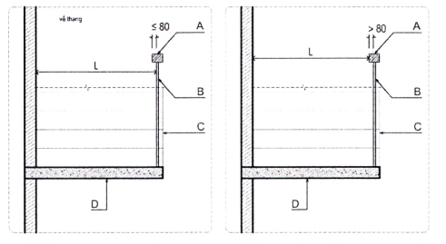

<strong>Hình A.25 — Ví dụ minh họa cách xác định chiều rộng tính toán thoát nạn của vế thang (trường hợp có tường ở một bên vế thang)</strong>

Kích thước tính bằng milimét

<!-- DIAGRAM: word/media/image29.png -->

**CHÚ DẪN:**

### Bảng Phụ lục A (Phần 17)

| A | Tay vịn lan can |
| :--- | :--- |
| B | Thanh lan can |
| H | Chiều cao tay vịn lan can |
| L | Chiều rộng khe hở giữa hai thanh lan can |

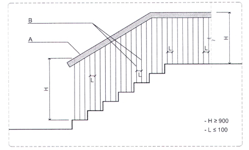

<strong>Hình A.26 — Ví dụ minh họa lan can bảo vệ ở các cạnh hở của vế thang, chiếu tới, chiếu nghỉ</strong>

<!-- DIAGRAM: word/media/image30.png -->

**CHÚ DẪN:**

### Bảng Phụ lục A (Phần 18)

| A | Mặt đất | C | Sàn mái tum |
| :--- | :--- | :--- | :--- |
| $A_{m}$ | Diện tích sàn mái | D | Tầng tum |
| $A_{t}$ | Diện tích sàn mái tum | M1 | Mặt bằng tầng |
| B | Sàn mái | M2 | Mặt bằng mái |

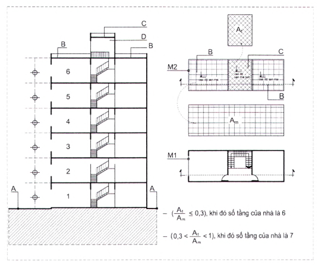

<strong>Hình A.27 — Ví dụ minh họa cách xác định số tầng nhà trường hợp có tầng tum</strong>

<!-- DIAGRAM: word/media/image31.png -->

**CHÚ DẪN:**

### Bảng Phụ lục A (Phần 19)

| 1 | Vách ngăn cháy hoặc màn ngăn cháy bảo đảm El 45 |
| :--- | :--- |
| 2 | Đường thoát nạn đi qua cầu thang bộ |
| 3 | Đường thoát nạn đi qua đường dốc |
| CĐMĐ | Cao độ mặt đất |
| CĐSH | Cao độ sàn tầng hầm hoặc tầng nửa/bán hầm |

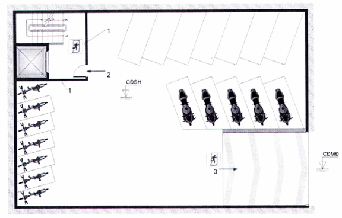

<strong>Hình A.28 — Ví dụ minh họa ngăn cách khu vực để xe ở tầng hầm hoặc nửa hầm theo 9.3.3.5.4</strong>

<!-- DIAGRAM: word/media/image32.png -->

**CHÚ DẪN:**

## 1  BAN CÔNG

## 2  LÔ GIA

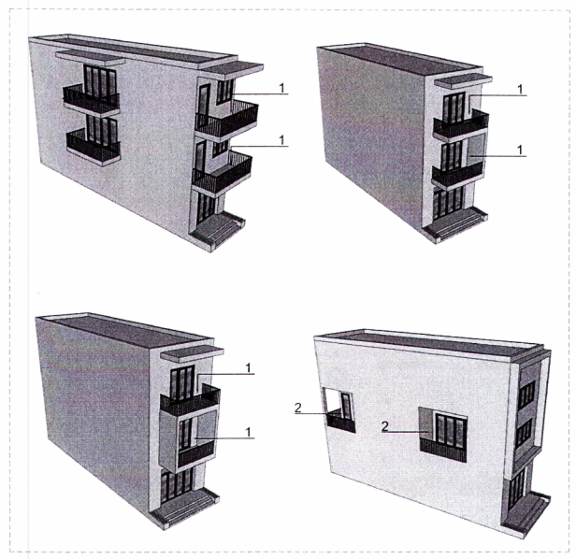

<strong>Hình A.29 — Ví dụ minh họa ban công, lô gia</strong>

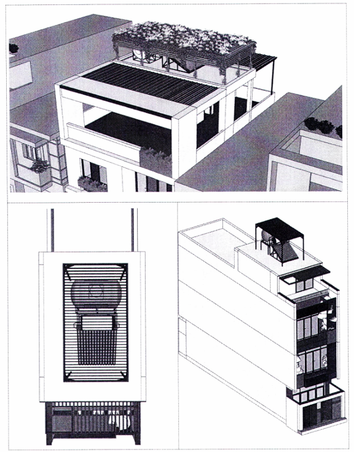

<strong>Hình A.30 — Ví dụ minh họa giải pháp che chắn bồn nước lắp đặt trên mái</strong>

<!-- DIAGRAM: word/media/image34.jpeg -->

a) \- Thang ở trạng thái xếp dọc, ép sát bề mặt tường (vị trí lối ra khẩn cấp trên cùng)

<!-- DIAGRAM: word/media/image35.jpeg -->

b) \- Thang ở trạng thái mở ra để sử dụng (vị trí lối ra khẩn cấp trên cùng)

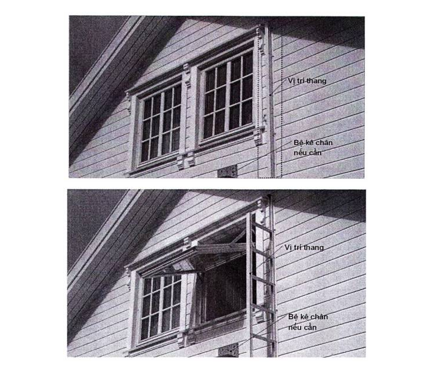

**CHÚ THÍCH 1:** Loại thang này chỉ nên sử dụng ở các nhà có chiều cao của lối ra khẩn cấp (mép dưới cửa sổ, lỗ mở trên tường ngoài; hoặc mép trên lan can của ban công, lô gia, v.v.) không lớn hơn 4,5 m so với mặt đất phía dưới;

**CHÚ THÍCH 2:** Việc lắp đặt, sử dụng và bảo trì thang phải thực hiện theo đúng hướng dẫn của nhà sản xuất.

<strong>Hình A.31 — Ví dụ minh họa bố trí thang xếp dọc gắn tường</strong>

Thư mục tài liệu tham khảo

[1 ] QCVN 01:2021/BXD, Quy chuẩn kỹ thuật quốc gia về Quy hoạch xây dựng;

[2] QCVN 01-1:2018/BYT, Quy chuẩn kỹ thuật quốc gia về Chất lượng nước sạch sử dụng cho mục đích sinh hoạt;

[3] QCVN 02:2022/BXD, Quy chuẩn kỹ thuật quốc gia về số liệu điều kiện tự nhiên dùng trong xây dựng;

[4] QCVN 03:2022/BXD, Quy chuẩn kỹ thuật quốc gia về Phân cấp công trình phục vụ thiết kế xây dựng;

[5] QCXDVN 05:2008/BXD, Quy chuẩn xây dựng Việt Nam - Nhà ở và công trình công cộng - An toàn sinh mạng và sức khỏe;

[6] QCVN 06:2022/BXD, Quy chuẩn kỹ thuật quốc gia về An toàn cháy cho nhà và công trình và Sửa đổi 1:2023 QCVN 06:2022/BXD;

[7] QCVN 09:2017/BXD, Quy chuẩn kỹ thuật quốc gia về Các công trình xây dựng sử dụng năng lượng hiệu quả;

[8] QCVN 10:2024/BXD, Quy chuẩn kỹ thuật quốc gia về Xây dựng công trình đảm bảo tiếp cận sử dụng;

[9] QCVN 12:2014/BXD, Quy chuẩn kỹ thuật quốc gia về Hệ thống điện của tòa nhà và công trình;

[10] QCVN 14:2008/BTNMT, Quy chuẩn kỹ thuật quốc gia về Nước thải sinh hoạt;

[11] QCVN 17:2018/BXD, Quy chuẩn kỹ thuật quốc gia về Xây dựng và lắp đặt phương tiện quảng cáo ngoài trời;

[12] QCVN 26:2010/BTNMT, Quy chuẩn kỹ thuật quốc gia về Tiếng ồn;

[13] TCVN 7336, Phòng cháy chữa cháy - Hệ thống chữa cháy tự động bằng nước, bọt - Yêu cầu thiết kế và lắp đặt;

[14] TCVN 9254-1, Nhà và công trình dân dụng - Từ vựng - Phần 1: Thuật ngữ chung;

[15] TCVN 13456, Phòng cháy chữa cháy - Phương tiện chiếu sáng sự cố và chì dẫn thoát nạn - Yêu cầu thiết kế, lắp đặt;

<!-- FORMULA_IMAGE_PLACEHOLDER: 4ad1597d -->

Mục lục

## 1  PHẠM VI ÁP DỤNG

## 2  TÀI LIỆU VIỆN DẪN

## 3  THUẬT NGỮ VÀ ĐỊNH NGHĨA

## 4  YÊU CẦU CHUNG

## 5  YÊU CẦU VỀ QUY HOẠCH VÀ THIẾT KẾ KIẾN TRÚC

## 6  YÊU CẦU VỀ KẾT CẤU VÀ VẬT LIỆU

## 7  YÊU CẦU VỀ HỆ THỐNG KỸ THUẬT BÊN TRONG CÔNG TRÌNH

## 8  YÊU CẦU VỀ CÔNG TÁC HOÀN THIỆN

## 9  YÊU CẦU VỀ AN TOÀN CHÁY