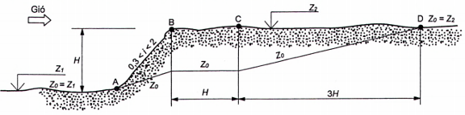
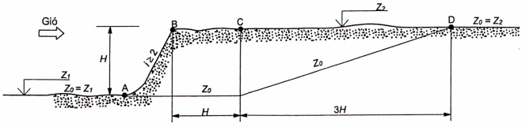

## PHỤ LỤC C  (Quy định)  PHƯƠNG PHÁP XÁC ĐỊNH MỐC CHUẨN

### C.1  Khi xác định hệ số $k(z_e)$ theo công thức (12), nếu mặt đất xung quanh nhà và công trình không bằng phẳng thì độ cao tương đương $z_e$ được xác định thông qua độ cao $z$ (xem [10.2.4](#muc-10-2-4)) và $z$ được xác định như sau:

\- a) Trường hợp mặt đất có độ dốc nhỏ so với phương nằm ngang $i \le 0,3$, độ cao $z$ được tính từ mặt đất (mốc chuẩn) đặt nhà và công trình tới điểm cần xét.

\- b) Trường hợp mặt đất có độ dốc $0,3 < i < 2$, độ cao $z$ được tính từ mặt cao độ công trình quy ước $z_0$ (mốc chuẩn) (xem [Hình C.1a](#hinh-c_1a)) thấp hơn so với mặt đất thực tới điểm cần xét.

\- c) Trường hợp mặt đất có độ dốc lớn $i \ge 2$, mặt cao độ công trình quy ước $z_0$ (mốc chuẩn) để tính độ cao $z$ thấp hơn mặt đất thực được xác định theo [Hình C.1b](#hinh-c_1b).

**CHÚ THÍCH:** Bên trái điểm A: $z_0 = z_1$; Trên đoạn BC: $z_0 = \frac{H(2 - i)}{1,7}$; Bên phải điểm D: $z_0 = z_2$; Trên đoạn AB và CD: $z_0$ được xác định bằng nội suy tuyến tính.

<strong>a) Khi mặt đất có độ dốc $0,3 < i < 2$</strong>

**CHÚ THÍCH:** Bên trái điểm C: $z_0 = z_1$; Bên phải điểm D: $z_0 = z_2$; Trên đoạn CD: $z_0$ được xác định bằng nội suy tuyến tính.

<strong>b) Khi mặt đất có độ dốc $i \ge 2$</strong>

<strong>Hình C.1 — Mặt cao độ công trình quy ước $z_0$ (mốc chuẩn)</strong>

> [!NOTE]
> **Đặc tả Hình học & Phương pháp Xác định Mốc chuẩn Khí động ($z_0$):**
> \- **Phạm vi áp dụng:** Xác định mặt cao độ công trình quy ước $z_0$ (mốc chuẩn) khi địa hình xung quanh nhà/công trình không bằng phẳng (đồi, dốc, vách đứng) để tính độ cao tương đương $z_e$ theo công thức (12).
> \- **Phân loại 3 trường hợp độ dốc địa hình $i$:**
> &nbsp;&nbsp;+ **Trường hợp 1 ($i \le 0,3$ - Độ dốc nhỏ):** Mặt đất coi như bằng phẳng, lấy $z_0 = 0$ (tính trực tiếp từ mặt đất thực đặt công trình).
> &nbsp;&nbsp;+ **Trường hợp 2 ($0,3 < i < 2$ - Sườn dốc vừa, [Hình C.1a](#hinh-c_1a)):**
> &nbsp;&nbsp;&nbsp;&nbsp;* Bên trái điểm A: $z_0 = z_1$
> &nbsp;&nbsp;&nbsp;&nbsp;* Trên đoạn BC (chiều rộng $H$): $z_0 = \frac{H(2 - i)}{1,7}$
> &nbsp;&nbsp;&nbsp;&nbsp;* Bên phải điểm D (cách C khoảng $3H$): $z_0 = z_2$
> &nbsp;&nbsp;&nbsp;&nbsp;* Trên đoạn AB và CD: $z_0$ xác định bằng nội suy tuyến tính.
> &nbsp;&nbsp;+ **Trường hợp 3 ($i \ge 2$ - Vách dốc đứng, [Hình C.1b](#hinh-c_1b)):**
> &nbsp;&nbsp;&nbsp;&nbsp;* Bên trái điểm C (đỉnh vách): $z_0 = z_1$
> &nbsp;&nbsp;&nbsp;&nbsp;* Bên phải điểm D (cách C khoảng $3H$): $z_0 = z_2$
> &nbsp;&nbsp;&nbsp;&nbsp;* Trên đoạn CD: $z_0$ xác định bằng nội suy tuyến tính.
