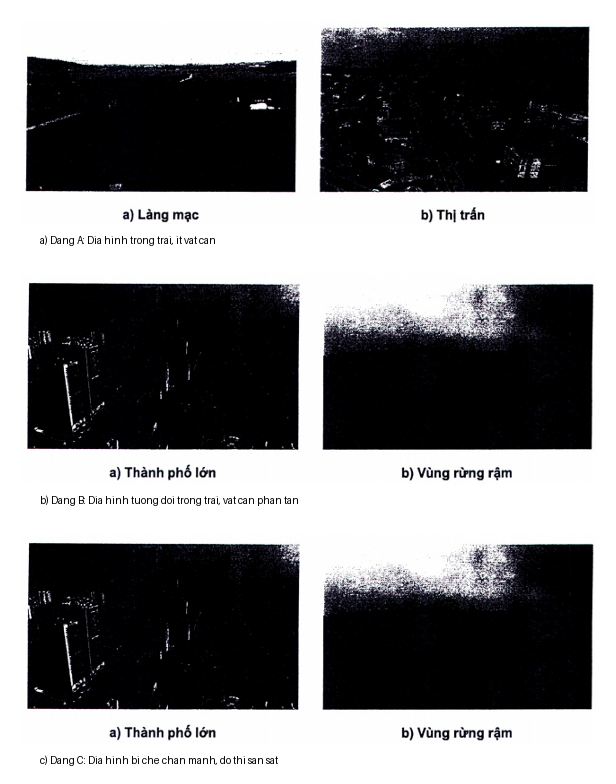
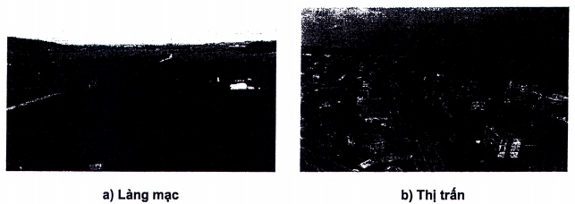
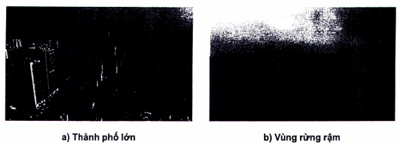

## PHỤ LỤC D  (Tham khảo)  MINH HỌA CÁC DẠNG ĐỊA HÌNH

<strong>Hình D.1 — Hình ảnh minh họa địa hình dạng A</strong>

<strong>Hình D.2 — Hình ảnh minh họa địa hình dạng B</strong>

<strong>Hình D.3 — Hình ảnh minh họa địa hình dạng C</strong>

> [!NOTE]
> **Đặc tả Phân loại 3 Dạng Địa hình Khí động (TCVN 2737:2023 Điều 10.2.4):**
> \- **Địa hình Dạng A (Hình D.1):** Địa hình trống trải, không có hoặc có rất ít vật cản (vùng bờ biển mở, mặt nước sông hồ lớn, đồng trống không có cây cối hay công trình cao quá 1,5 m).
> \- **Địa hình Dạng B (Hình D.2):** Địa hình tương đối trống trải có một số vật cản phân tán (vùng ngoại ô, thị trấn nhỏ, vùng đồng ruộng có làng mạc, rừng thưa, công trình cao từ 1,5 m đến 10 m).
> \- **Địa hình Dạng C (Hình D.3):** Địa hình bị che chắn mạnh (khu vực nội thành đô thị lớn có nhiều nhà cao tầng san sát, rừng cây rậm rạp có chiều cao cây trung bình trên 10 m).
