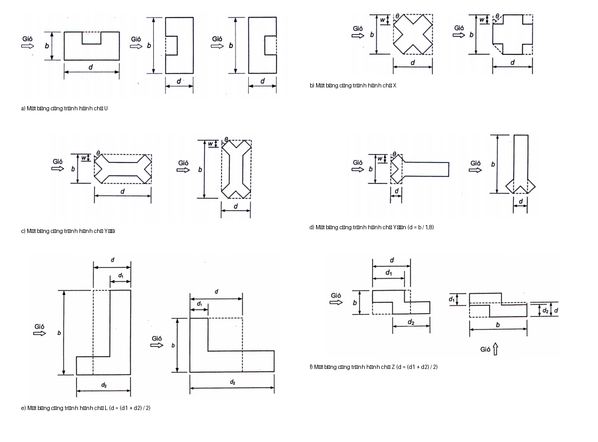

## PHỤ LỤC E  (Tham khảo)  MỘT SỐ CÔNG THỨC ĐƠN GIẢN TÍNH HỆ SỐ HIỆU ỨNG GIẬT GF VÀ KÍCH THƯỚC TƯƠNG ĐƯƠNG CHO MỘT SỐ MẶT BẰNG PHỨC TẠP CỦA CÔNG TRÌNH

### E.1  Một số công thức đơn giản tính hệ số hiệu ứng giật $G_{f}$

Đối với nhà cao tầng có hình dạng đều đặn theo chiều cao và có chu kỳ dao động riêng cơ bản thứ nhất $T_{1}$ > 1 s và chiều cao không quá 150 m, có thể xác định hệ số hiệu ứng giật $G_{f}$ theo các công thức sau để tính toán sơ bộ:

- Đối với nhà bê tông cốt thép:

$$k_n = 1 - 0,1 \cdot \dots 	ag{E.1}$$
<!-- formula_id: "F_TCVN2737_HE_SO_AP_LUC_KHONG_KHI_E1" -->

- Đối với nhà thép:

$$\dots 	ag{E.2}$$
<!-- formula_id: "F_TCVN2737_HE_SO_DO_CAO_E2" -->

trong đó:

&nbsp;&nbsp;&nbsp;&nbsp;\- h là chiều cao công trình, tính bằng mét (m).

### E.2  Kích thước tương đương cho một số mặt bằng phức tạp của công trình

Đối với một số công trình có mặt bằng phức tạp dạng chữ U, X, Y, Z, L thì kích thước tương đương của mặt bằng công trình có thể được xác định như đối với công trình có mặt bằng hình chữ nhật trên cơ sở kích thước của hình chữ nhật tương đương:

a) Đối với công trình có mặt bằng hình chữ U và X: xem các hình E.1a và E.1b;

b) Đối với công trình có mặt bằng hình chữ Y: xem các hình E.1c và E.1d;

c) Đối với công trình có mặt bằng hình chữ L và chữ Z: xem các hình E.1e và E.1f.

a) Mặt bằng công trình hình chữ U

b) Mặt bằng công trình hình chữ X

c) Mặt bằng công trình hình chữ Y đôi

**CHÚ THÍCH:** $<!-- FORMULA_PLACEHOLDER: 5749edab -->$.

d) Mặt bằng công trình hình chữ Y đơn

<strong>Hình E.1 — Kích thước tương đương cho một số mặt bằng phức tạp của công trình</strong>

> [!NOTE]
> **Đặc tả Hình học & Tham chiếu Khí động:**
> \- **Phạm vi:** Kích thước tương đương cho các mặt bằng phức tạp (chữ L, U, T, chữ thập, thắt eo)
> \- **Thông số cơ sở:** b (chiều rộng tương đương), d (chiều sâu tương đương), e = min(b, 2h)

**CHÚ THÍCH:** $<!-- FORMULA_PLACEHOLDER: 178b7ec0 -->$

e) Mặt bằng công trình hình chữ L

**CHÚ THÍCH:** $<!-- FORMULA_PLACEHOLDER: 841f9c85 -->$

f) Mặt bằng công trình hình chữ Z

Hình E.1 (kết thúc)

