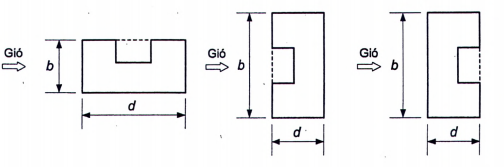
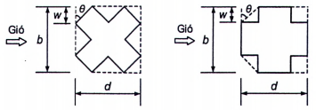
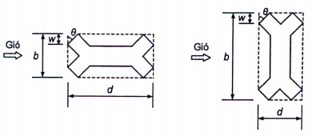
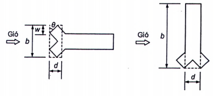
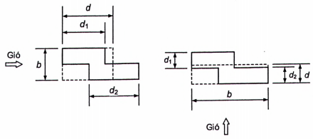

## PHỤ LỤC E  (Tham khảo)  MỘT SỐ CÔNG THỨC ĐƠN GIẢN TÍNH HỆ SỐ HIỆU ỨNG GIẬT $G_f$ VÀ KÍCH THƯỚC TƯƠNG ĐƯƠNG CHO MỘT SỐ MẶT BẰNG PHỨC TẠP CỦA CÔNG TRÌNH

### E.1  Một số công thức đơn giản tính hệ số hiệu ứng giật $G_f$

Đối với nhà cao tầng có hình dạng đều đặn theo chiều cao và có chu kỳ dao động riêng cơ bản thứ nhất $T_1 > 1\text{ s}$ và chiều cao không quá $150\text{ m}$, có thể xác định hệ số hiệu ứng giật $G_f$ theo các công thức sau để tính toán sơ bộ:

\- Đối với nhà bê tông cốt thép:

$$
G_f = 0{,}8 + \frac{h}{1\,200} \tag{E.1}
$$
<!-- formula_id: "F_TCVN2737_HE_SO_AP_LUC_KHONG_KHI_E1" -->

\- Đối với nhà thép:

$$
G_f = 0{,}85 + \frac{h}{800} \tag{E.2}
$$
<!-- formula_id: "F_TCVN2737_HE_SO_DO_CAO_E2" -->

trong đó:
\- $h$ là chiều cao công trình, tính bằng mét (m).

### E.2  Kích thước tương đương cho một số mặt bằng phức tạp của công trình

Đối với một số công trình có mặt bằng phức tạp dạng chữ U, X, Y, Z, L thì kích thước tương đương của mặt bằng công trình có thể được xác định như đối với công trình có mặt bằng hình chữ nhật trên cơ sở kích thước của hình chữ nhật tương đương:

a) Đối với công trình có mặt bằng hình chữ U và X: xem [Hình E.1a](#hinh-e_1a) và [Hình E.1b](#hinh-e_1b);

b) Đối với công trình có mặt bằng hình chữ Y: xem [Hình E.1c](#hinh-e_1c) và [Hình E.1d](#hinh-e_1d);

c) Đối với công trình có mặt bằng hình chữ L và chữ Z: xem [Hình E.1e](#hinh-e_1e) và [Hình E.1f](#hinh-e_1f).

<em>a) Mặt bằng công trình hình chữ U</em>

<em>b) Mặt bằng công trình hình chữ X</em>

<em>c) Mặt bằng công trình hình chữ Y đôi</em>

_CHÚ THÍCH:_ $d = \frac{b}{1{,}8}$.

<strong>d) Mặt bằng công trình hình chữ Y đơn</strong>

<strong>Hình E.1 — Kích thước tương đương cho một số mặt bằng phức tạp của công trình</strong>

_CHÚ THÍCH:_ $d = \frac{d_1 + d_2}{2}$.

<strong>e) Mặt bằng công trình hình chữ L</strong>

_CHÚ THÍCH:_ $d = \frac{d_1 + d_2}{2}$.

<strong>f) Mặt bằng công trình hình chữ Z</strong>

<strong>Hình E.1 (kết thúc)</strong>

> [!NOTE]
> **Đặc tả Hình học Quy đổi Mặt bằng Phức tạp (Hình E.1):**
> \- **Mục đích:** Quy đổi mặt bằng phi chữ nhật (chữ U, X, Y đôi, Y đơn, L, Z) về kích thước tương đương $(d, b)$ của hình chữ nhật ngoại tiếp để tính diện tích đón gió và hệ số khí động.
> \- **Tham chiếu Visual Card:** [`fig_e_1_equivalent_footprint.json`](../figures/cards/fig_e_1_equivalent_footprint.json)
> \- **Bộ giải tính toán (Python Solver):** `calc_equivalent_building_dimensions` và `calc_gust_factor_gf` trong `formulas/wind_load_tcvn2737.py`.

