
## PHỤ LỤC F  (Quy định)  HỆ SỐ KHÍ ĐỘNG

### F.1  Kết cấu phẳng đứng độc lập

### F.1.1  Tường phẳng (kể cả tường chắn mái), hàng rào và kết cấu tương tự

### F.1.1.1  Hệ số $c_x$ cho các vùng khác nhau của kết cấu (Hình F.1) lấy theo Bảng F.1.

### F.1.1.2  Độ cao tương đương $z_e$ = h.

### F.1.1.3  Hệ số đặc của kết cấu $\varphi$ là tỉ số giữa diện tích phần đặc và diện tích bao của kết cấu.

Khi L > 4h

Khi L ≤ 4h

Khi L ≤ 2h

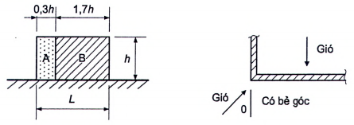

**Hình F.1 — Các vùng trên tường phẳng, hàng rào và kết cấu tương tự**

> [!NOTE]
> **Đặc tả Hình học & Tham chiếu Khí động:**
> \- **Phạm vi:** Phân vùng khí động trên tường phẳng, hàng rào và kết cấu tương tự
> \- **Thông số cơ sở:** e = min(b, 2h), h (chiều cao), l (chiều dài)
> \- **Phân vùng khí động:**
> &nbsp;&nbsp;+ Vùng A (biên mép đón gió)
> &nbsp;&nbsp;+ Vùng B (dải tiếp theo)
> &nbsp;&nbsp;+ Vùng C (phần giữa)
> &nbsp;&nbsp;+ Vùng D (mặt đón gió)
> &nbsp;&nbsp;+ Vùng E (mặt hút gió)
> \- **Bảng tra liên kết:** [F.1](#bang-bang-f-1)

### Bảng F.1 - Hệ số $c_x$ cho các vùng trên tường phẳng, hàng rào và kết cấu tương tự (xem Hình F.1)

| Hệ số đặc | Tường | Vùng |  |  |  |  |
| :--- | :--- | :--- | :---: | :---: | :---: | :---: |
| Hệ số đặc | Tường | A | B | C | D |  |
| $\varphi$ = 1,0 | Thẳng | L/h ≤ 3 | 2,3 | 1,4 | 1,2 |  |
| $\varphi$ = 1,0 | Thẳng | L/h = 5 | 2,9 | 1,8 | 1,4 | 1,2 |
| $\varphi$ = 1,0 | Thẳng | L/h ≥ 10 | 3,4 | 2,1 | 1,7 | 1,2 |
| $\varphi$ = 1,0 | Có bẻ góc với chiều dài phần bẻ góc không nhỏ hơn h $^{1)}$ | 2,1 | 1,8 | 1,4 | 1,2 |  |
| $\varphi$ = 0,8 |  | 1,2 |  |  |  |  |
| $^{1)}$ Đối với chiều dài phần bẻ góc trong khoảng từ 0 đến h, có thể xác định $c_x$ bằng nội suy tuyến tính. |  |  |  |  |  |  |

**CHÚ THÍCH:** Với các giá trị trung gian của hệ số đặc $\varphi$, có thể xác định $c_x$ bằng nội suy tuyến tính.

### F.1.2  Bảng quảng cáo

Đối với bảng quảng cáo nằm cách mặt đất một khoảng $z_g$ ≥ d/4 (Hình F.2): $c_x$ = 2,5 $k_{\lambda}$, trong đó $k_{\lambda}$ được xác định theo F.18.

Khi $z_g$ < d/4 và b/d ≤ 1 thì cũng có thể lấy $c_x$ = 2,5$k_{\lambda}$.

Hợp lực của các tải trọng hướng vuông góc với mặt phẳng bảng quảng cáo cần được đặt ở độ cao tâm hình học của bảng quảng cáo với độ lệch tâm theo phương ngang e = ±0,25b. Độ cao tương đương $z_e$ lấy bằng $z_e = z_g + \frac{d}{2}.$

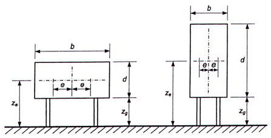

**Hình F.2 — Bảng quảng cáo**

> [!NOTE]
> **Đặc tả Hình học & Tham chiếu Khí động:**
> \- **Phạm vi:** Sơ đồ khí động cho bảng quảng cáo trên mặt đất và trên cao
> \- **Thông số cơ sở:** b (chiều rộng), h (chiều cao), zg (khoảng hở đáy)
> \- **Bảng tra liên kết:** [F.2](#bang-bang-f-2)

### F.2  Mái bằng

### F.2.1  Mái được coi là mái bằng khi có góc dốc $\alpha$ trong khoảng - 5° < $\alpha$ < 5°.

### F.2.2  Mái được chia thành các vùng như trên Hình F.3.

### F.2.3  Đối với mái bằng và mái có các cạnh bo tròn hoặc vát góc (Hình F.3b), độ cao tương đương lấy bằng $z_e$ = h. Đối với mái bằng có tường chắn mái (xem Hình F.3a), độ cao tương đương lấy bằng $z_e$ = h + $h_p$.

### F.2.4  Hệ số khí động áp lực $c_e$ cho từng vùng lấy theo Bảng F.2.

**CHÚ THÍCH:** Hệ số khí động áp lực $c_e$ cho tường chắn mái được xác định theo F.1.1.

|  | e = min (b; 2h) b là cạnh vuông góc hướng gió |
| :--- | :--- |

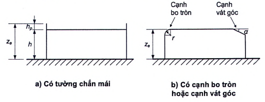

**Hình F.3 — Mái bằng**

> [!NOTE]
> **Đặc tả Hình học & Tham chiếu Khí động:**
> \- **Phạm vi:** Phân vùng khí động mái bằng (góc dốc alpha <= 5 độ)
> \- **Thông số cơ sở:** e = min(b, 2h), hp (chiều cao tường chắn mái parapet)
> \- **Phân vùng khí động:**
> &nbsp;&nbsp;+ Vùng F (góc mái e/4 x e/10)
> &nbsp;&nbsp;+ Vùng G (dải mép đón gió e/10)
> &nbsp;&nbsp;+ Vùng H (dải giữa mái)
> &nbsp;&nbsp;+ Vùng I (phần diện tích còn lại)
> \- **Bảng tra liên kết:** [F.3a](#bang-bang-f-3a), [F.3b](#bang-bang-f-3b)

### Bảng F.2 - Hệ số $c_e$ cho mái bằng

| Loại mái | Vùng |  |  |  |  |
| :--- | :--- | :--- | :--- | :--- | :--- |
| Loại mái | F | G | H | I |  |
| Có cạnh sắc | &nbsp;&nbsp;\- 1,8 | &nbsp;&nbsp;\- 1,2 | &nbsp;&nbsp;\- 0,7 | ± 0,2 |  |
| Có tường chắn mái | $h_p$/h = 0,025 | &nbsp;&nbsp;\- 1,6 | &nbsp;&nbsp;\- 1,1 | &nbsp;&nbsp;\- 0,7 | ± 0,2 |
| Có tường chắn mái | $h_p$/h = 0,05 | &nbsp;&nbsp;\- 1,4 | &nbsp;&nbsp;\- 0,9 | &nbsp;&nbsp;\- 0,7 | ± 0,2 |
| Có tường chắn mái | $h_p$/h = 0,10 | &nbsp;&nbsp;\- 1,2 | &nbsp;&nbsp;\- 0,8 | &nbsp;&nbsp;\- 0,7 | ± 0,2 |
| Có cạnh bo tròn | r/h = 0,05 | &nbsp;&nbsp;\- 1,0 | &nbsp;&nbsp;\- 1,2 | &nbsp;&nbsp;\- 0,4 | ± 0,2 |
| Có cạnh bo tròn | r/h = 0,10 | &nbsp;&nbsp;\- 0,7 | &nbsp;&nbsp;\- 0,8 | &nbsp;&nbsp;\- 0,3 | ± 0,2 |
| Có cạnh bo tròn | r/h = 0,20 | &nbsp;&nbsp;\- 0,5 | &nbsp;&nbsp;\- 0,3 | ± 0,2 |  |
| Có cạnh vát góc | $\alpha$ = 30° | &nbsp;&nbsp;\- 1,0 | &nbsp;&nbsp;\- 0,3 | ± 0,2 |  |
| Có cạnh vát góc | $\alpha$ = 45° | &nbsp;&nbsp;\- 1,2 | &nbsp;&nbsp;\- 1,3 | &nbsp;&nbsp;\- 0,4 | ± 0,2 |
| Có cạnh vát góc | $\alpha$ = 60° | &nbsp;&nbsp;\- 1,3 | &nbsp;&nbsp;\- 0,5 | ± 0,2 |  |

**CHÚ THÍCH 1:** Đối với mái có tường chắn mái hoặc mái có cạnh bo tròn, có thể sử dụng nội suy tuyến tính cho các giá trị trung gian của $h_p$/h và r/h. CHÚ THÍCH 2: Đối với mái có cạnh vát góc, có thể sử dụng nội suy tuyến tính giữa $\alpha$ = 30°, $\alpha$ = 45° và $\alpha$ = 60°. Khi $\alpha$ > 60°, sử dụng nội suy tuyến tính giữa giá trị $\alpha$ = 60° và giá trị cho mái bằng có cạnh sắc. CHÚ THÍCH 3: Trong vùng I, nơi có các giá trị dương và âm, thì cần xét cả hai giá trị này. CHÚ THÍCH 4: Đối với mái có cạnh vát góc, hệ số khí động áp lực ngoài $c_e$ lấy theo Bảng F.5a, vùng F và G, phụ thuộc vào góc dốc của mái có cạnh vát góc. CHÚ THÍCH 5: Đối với mái có cạnh bo tròn, hệ số khí động áp lực ngoài $c_e$ được xác định bằng nội suy tuyến tính (dọc theo đường bo tròn) giữa các giá trị cho tường và cho mái. CHÚ THÍCH 6: Đối với mái có cạnh vát góc với kích thước nằm ngang nhỏ hơn e/10 thì sử dụng giá trị $c_e$ cho mái có cạnh sắc. e được xác định như trên Hình F.3.

### F.3  Mái dốc một phía

### F.3.1  Mái dốc một phía, bao gồm cả các phần nhô ra, được chia thành các vùng như trên Hình F.4.

### F.3.2  Độ cao tương đương lấy bằng $z_e$ = h.

### F.3.3  Hệ số khí động áp lực $c_e$ được xác định cho từng vùng theo các bảng F3a và F.3b.

a) Sơ đồ chung

|  | e = min (b; 2h) b là cạnh vuông góc hướng gió |
| :--- | :--- |

b) Góc hướng gió $\theta$ = 0° và $\theta$ = 180°

c) Góc hướng gió $\theta$ = 90°

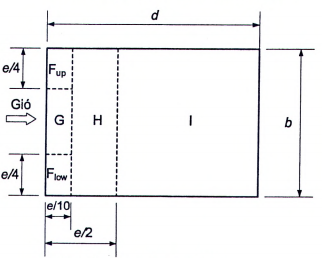

**Hình F.4 — Mái dốc một phía**

> [!NOTE]
> **Đặc tả Hình học & Tham chiếu Khí động:**
> \- **Phạm vi:** Phân vùng khí động mái dốc một phía (alpha từ 5 đến 75 độ)
> \- **Thông số cơ sở:** e = min(b, 2h), b (cạnh vuông góc hướng gió), alpha (góc dốc)
> \- **Phân vùng khí động:**
> &nbsp;&nbsp;+ Vùng F (góc đón gió)
> &nbsp;&nbsp;+ Vùng G (mép đón gió)
> &nbsp;&nbsp;+ Vùng H (diện tích giữa)
> &nbsp;&nbsp;+ Vùng I (mép nóc/khuất gió)
> \- **Bảng tra liên kết:** [F.3a](#bang-bang-f-3a), [F.3b](#bang-bang-f-3b)

### Bảng F.3a - Hệ số khí động áp lực ngoài $c_e$ cho mái dốc một phía khi góc hướng gió $\theta$ = 0° và $\theta$ = 180°

| Góc dốc $\alpha$, ° | Góc hướng gió $\theta$ = 0° | Góc hướng gió $\theta$ = 180° |  |  |  |  |
| :---: | :--- | :--- | :--- | :--- | :--- | :--- |
| Góc dốc $\alpha$, ° | Vùng |  |  |  |  |  |
| Góc dốc $\alpha$, ° | F | G | H | F | G | H |
| 5 | &nbsp;&nbsp;\- 1,7 | &nbsp;&nbsp;\- 1,2 | &nbsp;&nbsp;\- 0,6 | &nbsp;&nbsp;\- 2,3 | &nbsp;&nbsp;\- 1,3 | &nbsp;&nbsp;\- 0,8 |
| 5 | &nbsp;&nbsp;&nbsp;&nbsp;\+ 0,0 | &nbsp;&nbsp;\- 2,3 | &nbsp;&nbsp;\- 1,3 | &nbsp;&nbsp;\- 0,8 |  |  |
| 15 | &nbsp;&nbsp;\- 0,9 | &nbsp;&nbsp;\- 0,8 | &nbsp;&nbsp;\- 0,3 | &nbsp;&nbsp;\- 2,5 | &nbsp;&nbsp;\- 1,3 | &nbsp;&nbsp;\- 0,9 |
| 15 | &nbsp;&nbsp;&nbsp;&nbsp;\+ 0,2 | &nbsp;&nbsp;\- 2,5 | &nbsp;&nbsp;\- 1,3 | &nbsp;&nbsp;\- 0,9 |  |  |
| 30 | &nbsp;&nbsp;\- 0,5 | &nbsp;&nbsp;\- 0,2 | -1,1 | -0,8 |  |  |
| 30 | &nbsp;&nbsp;&nbsp;&nbsp;\+ 0,7 | &nbsp;&nbsp;&nbsp;&nbsp;\+ 0,4 | -1,1 | -0,8 |  |  |
| 45 | &nbsp;&nbsp;\- 0,0 | &nbsp;&nbsp;\- 0,6 | &nbsp;&nbsp;\- 0,5 | &nbsp;&nbsp;\- 0,7 |  |  |
| 45 | &nbsp;&nbsp;&nbsp;&nbsp;\+ 0,7 | &nbsp;&nbsp;&nbsp;&nbsp;\+ 0,6 | &nbsp;&nbsp;\- 0,6 | &nbsp;&nbsp;\- 0,5 | &nbsp;&nbsp;\- 0,7 |  |
| 60 | &nbsp;&nbsp;&nbsp;&nbsp;\+ 0,7 | &nbsp;&nbsp;\- 0,5 |  |  |  |  |
| 75 | &nbsp;&nbsp;&nbsp;&nbsp;\+ 0,8 | &nbsp;&nbsp;\- 0,5 |  |  |  |  |

**CHÚ THÍCH 1:** Khi $\theta$ = 0°, áp lực thay đổi nhanh giữa các giá trị âm và dương khi góc dốc + 5° ≤ $\alpha$ ≤ + 45°, do đó cả hai giá trị âm và dương đều được nêu trong bảng này. Đối với mái này, cần xét hai trường hợp: một là với tất cả các giá trị dương và hai là với tất cả các giá trị âm. Không được xét đồng thời giá trị âm và dương trên cùng một mặt. CHÚ THÍCH 2: Sử dụng phương pháp nội suy tuyến tính cho các góc dốc trung gian nằm giữa các giá trị cùng dấu. Các giá trị bằng 0,0 dùng để nội suy tuyến tính.

### Bảng F.3b - Hệ số khí động áp lực ngoài $c_e$ cho mái dốc một phía khi góc hướng gió $\theta$ = 90°

| Góc dốc $\alpha$, ° | Vùng |  |  |  |  |
| :---: | :--- | :--- | :--- | :--- | :--- |
| Góc dốc $\alpha$, ° | $F_{up}$ | $F_{low}$ | G | H | I |
| 5 | &nbsp;&nbsp;\- 2,1 | &nbsp;&nbsp;\- 1,8 | &nbsp;&nbsp;\- 0,6 | &nbsp;&nbsp;\- 0,5 |  |
| 15 | &nbsp;&nbsp;\- 2,4 | &nbsp;&nbsp;\- 1,6 | &nbsp;&nbsp;\- 1,9 | &nbsp;&nbsp;\- 0,8 | &nbsp;&nbsp;\- 0,7 |
| 30 | &nbsp;&nbsp;\- 2,1 | &nbsp;&nbsp;\- 1,3 | &nbsp;&nbsp;\- 1.5 | &nbsp;&nbsp;\- 1,0 | &nbsp;&nbsp;\- 0,8 |
| 45 | &nbsp;&nbsp;\- 1,5 | &nbsp;&nbsp;\- 1,3 | &nbsp;&nbsp;\- 1,4 | &nbsp;&nbsp;\- 1,0 | &nbsp;&nbsp;\- 0,9 |
| 60 | &nbsp;&nbsp;\- 1,2 | &nbsp;&nbsp;\- 1,0 | &nbsp;&nbsp;\- 0,7 |  |  |
| 75 | &nbsp;&nbsp;\- 1,2 | &nbsp;&nbsp;\- 1,0 | &nbsp;&nbsp;\- 0,5 |  |  |

### F.4  Nhà mái dốc hai phía có mặt bằng hình chữ nhật

### F.4.1  Tường thẳng đứng

### F.4.1.1  Hệ số khí động $c_e$ cho các vùng trên các tường của nhà có mặt bằng chữ nhật (Hình F.5a) lấy theo Bảng F.4.

Đối với tường nghiêng (Hình F.5b) với góc nghiêng trong khoảng 45° < $\omega$ < 90°, các hệ số khí động được xác định tương tự như đối với tường thẳng đứng.

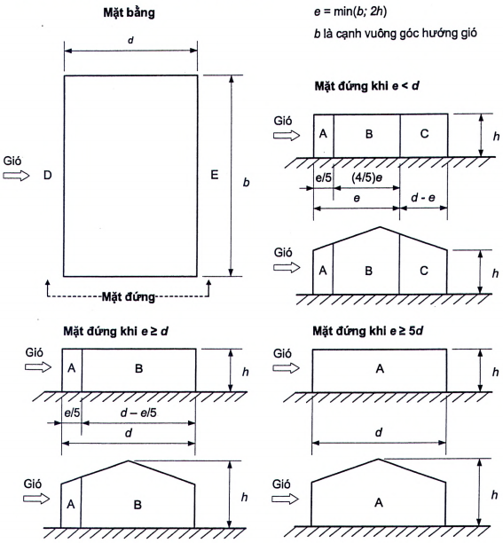

**Hình F.5a — Tường thẳng đứng của nhà có mặt bằng chữ nhật**

> [!NOTE]
> **Đặc tả Hình học & Tham chiếu Khí động:**
> \- **Phạm vi:** Phân vùng khí động tường thẳng đứng của nhà có mặt bằng chữ nhật
> \- **Thông số cơ sở:** e = min(b, 2h), d (chiều sâu dọc hướng gió), b (bề rộng đón gió)
> \- **Phân vùng khí động:**
> &nbsp;&nbsp;+ Vùng A (dải mép biên e/5)
> &nbsp;&nbsp;+ Vùng B (dải giữa 4e/5)
> &nbsp;&nbsp;+ Vùng C (dải cuối tường)
> &nbsp;&nbsp;+ Vùng D (toàn bộ tường đón gió)
> &nbsp;&nbsp;+ Vùng E (toàn bộ tường hút gió)
> \- **Bảng tra liên kết:** [F.4a](#bang-bang-f-4a), [F.4b](#bang-bang-f-4b)

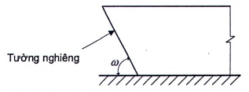

**Hình F.5b — Tường nghiêng của nhà có mặt bằng chữ nhật**

> [!NOTE]
> **Đặc tả Hình học & Tham chiếu Khí động:**
> \- **Phạm vi:** Phân vùng khí động tường nghiêng của nhà có mặt bằng chữ nhật
> \- **Thông số cơ sở:** alpha (góc nghiêng của tường so với phương thẳng đứng)
> \- **Bảng tra liên kết:** [F.4a](#bang-bang-f-4a), [F.4b](#bang-bang-f-4b)

### Bảng F.4 - Hệ số $c_e$ cho tường thẳng đứng của nhà có mặt bằng chữ nhật

| h/d | Vùng |  |  |  |  |
| :---: | :--- | :--- | :--- | :--- | :--- |
| h/d | A | B | C | D | E |
| 5 | &nbsp;&nbsp;\- 1,2 | &nbsp;&nbsp;\- 0,8 | &nbsp;&nbsp;\- 0,5 | &nbsp;&nbsp;&nbsp;&nbsp;\+ 0,8 | &nbsp;&nbsp;\- 0,7 |
| 1 | &nbsp;&nbsp;\- 1,2 | &nbsp;&nbsp;\- 0,8 | &nbsp;&nbsp;\- 0,5 | &nbsp;&nbsp;&nbsp;&nbsp;\+ 0,8 | &nbsp;&nbsp;\- 0,5 |
| ≤ 0,25 | &nbsp;&nbsp;\- 1,2 | &nbsp;&nbsp;\- 0,8 | &nbsp;&nbsp;\- 0,5 | &nbsp;&nbsp;&nbsp;&nbsp;\+ 0,7 | &nbsp;&nbsp;\- 0,3 |

### F.4.1.2  Đối với các tường bên có lô gia nhô ra, hệ số khí động ma sát lấy bằng $c_f$ = 0,1.

### F.4.2  Mái dốc hai phía

### F.4.2.1  Mái dốc hai phía được chia thành các vùng như trên Hình F.6.

### F.4.2.2  Hệ số khí động áp lực $c_e$ cho các vùng của mái được xác định theo các bảng F.5a và F.5b phụ thuộc vào hướng gió.

### F.4.2.3  Đối với mái trơn dài khi góc hướng gió $\theta$ = 90° (Hình F.6c) thì hệ số khí động ma sát $c_f$ = 0,02.

a) Sơ đồ chung

<!-- FORMULA_PLACEHOLDER: ff9ae93f -->
b) Góc hướng gió $\theta$ = 0°          e = min (b; 2h)

<!-- FORMULA_PLACEHOLDER: ff9ae93f -->
c) Góc hướng gió $\theta$ = 90°

CHÚ DẪN:

1 - Phía đón gió;

2 - Phía hút gió.

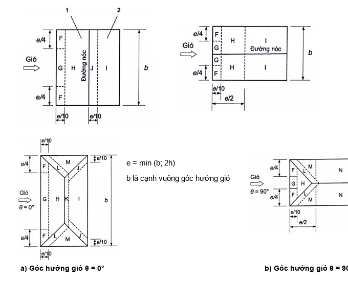

**Hình F.6 — Mái dốc hai phía của nhà có mặt bằng chữ nhật**

> [!NOTE]
> **Đặc tả Hình học & Tham chiếu Khí động:**
> \- **Phạm vi:** Phân vùng khí động mái dốc hai phía của nhà có mặt bằng chữ nhật
> \- **Thông số cơ sở:** e = min(b, 2h), alpha (góc dốc mái), theta (góc hướng gió 0, 90, 180 độ)
> \- **Phân vùng khí động:**
> &nbsp;&nbsp;+ Vùng F: Góc mép đón gió (kích thước e/4 x e/10)
> &nbsp;&nbsp;+ Vùng G: Dải mép đón gió giữa hai vùng F (chiều rộng e/10)
> &nbsp;&nbsp;+ Vùng H: Phần diện tích còn lại của nửa mái đón gió
> &nbsp;&nbsp;+ Vùng I: Phần diện tích chính của nửa mái khuất gió
> &nbsp;&nbsp;+ Vùng J: Dải mép nóc nửa mái khuất gió (chiều rộng e/10)
> \- **Bảng tra liên kết:** [F.5a](#bang-bang-f-5a), [F.5b](#bang-bang-f-5b)

### Bảng F.5a - Hệ số $c_e$ khi góc hướng gió $\theta$ = 0°

| Gốc dốc $\alpha$, ° | Vùng |  |  |  |  |
| :---: | :--- | :--- | :--- | :--- | :---: |
| Gốc dốc $\alpha$, ° | F | G | H | I | J |
| &nbsp;&nbsp;\- 45 | -0,6 | -0,8 | -0,7 | -1,0 |  |
| &nbsp;&nbsp;\- 30 | -1,1 | -2,0 | -0,8 | -0,6 | -0,8 |
| &nbsp;&nbsp;\- 15 | -2,5 | -1,3 | -0,9 | -0,5 | -0,7 |
| &nbsp;&nbsp;\- 5 | &nbsp;&nbsp;\- 2,3 | &nbsp;&nbsp;\- 1,2 | &nbsp;&nbsp;\- 0,8 | &nbsp;&nbsp;&nbsp;&nbsp;\+ 0,2 |  |
| &nbsp;&nbsp;\- 5 | &nbsp;&nbsp;\- 2,3 | &nbsp;&nbsp;\- 1,2 | &nbsp;&nbsp;\- 0,8 | &nbsp;&nbsp;\- 0,6 |  |
| 5 | &nbsp;&nbsp;\- 1.7 | &nbsp;&nbsp;\- 1,2 | &nbsp;&nbsp;\- 0,6 | &nbsp;&nbsp;&nbsp;&nbsp;\+ 0,2 |  |
| 5 | &nbsp;&nbsp;&nbsp;&nbsp;\+ 0,0 | &nbsp;&nbsp;\- 0,6 |  |  |  |
| 15 | &nbsp;&nbsp;\- 0,9 | &nbsp;&nbsp;\- 0,8 | &nbsp;&nbsp;\- 0,3 | &nbsp;&nbsp;\- 0,4 | &nbsp;&nbsp;\- 1,0 |
| 15 | &nbsp;&nbsp;&nbsp;&nbsp;\+ 0,2 | &nbsp;&nbsp;\- 0,4 | &nbsp;&nbsp;\- 1,0 |  |  |
| 30 | &nbsp;&nbsp;\- 0,5 | &nbsp;&nbsp;\- 0,2 | &nbsp;&nbsp;\- 0,4 | &nbsp;&nbsp;\- 0,5 |  |
| 30 | &nbsp;&nbsp;&nbsp;&nbsp;\+ 0,7 | &nbsp;&nbsp;&nbsp;&nbsp;\+ 0,4 | &nbsp;&nbsp;\- 0,4 | &nbsp;&nbsp;\- 0,5 |  |
| 45 | &nbsp;&nbsp;\- 0,0 | &nbsp;&nbsp;\- 0,2 | &nbsp;&nbsp;\- 0,3 |  |  |
| 45 | &nbsp;&nbsp;&nbsp;&nbsp;\+ 0,7 | &nbsp;&nbsp;&nbsp;&nbsp;\+ 0,6 | &nbsp;&nbsp;&nbsp;&nbsp;\+ 0,0 |  |  |
| 60 | &nbsp;&nbsp;&nbsp;&nbsp;\+ 0,7 | &nbsp;&nbsp;\- 0,2 | &nbsp;&nbsp;\- 0,3 |  |  |
| 75 | &nbsp;&nbsp;&nbsp;&nbsp;\+ 0,8 | &nbsp;&nbsp;\- 0,2 | &nbsp;&nbsp;\- 0,3 |  |  |

**CHÚ THÍCH 1:** Khi $\theta$ = 0°, áp lực thay đổi nhanh giữa các giá trị âm và dương khi góc dốc - 5° ≤ $\alpha$ ≤ + 45°, do đó cả hai giá trị âm và dương đều được nêu trong bảng này. Đối với mái này, cần xét hai trường hợp: một là với tất cả các giá trị dương và hai là với tất cả các giá trị âm. Không được xét đồng thời giá trị âm và dương trên cùng một mặt. CHÚ THÍCH 2: Sử dụng nội suy tuyến tính cho các góc dốc nằm trong khoảng giữa các giá trị cùng dấu (không nội suy giữa $\alpha$ = + 5° và $\alpha$ = - 5° mà dùng số liệu cho mái bằng trong F.2). Các giá trị bằng 0,0 dùng để nội suy tuyến tính.

### Bảng F.5b - Hệ số $c_e$ khi góc hướng gió $\theta$ = 90°

| Góc dốc $\alpha$, ° | Vùng |  |  |  |
| :--- | :--- | :--- | :--- | :--- |
| Góc dốc $\alpha$, ° | F | G | H | I |
| &nbsp;&nbsp;\- 45 | &nbsp;&nbsp;\- 1,4 | &nbsp;&nbsp;\- 1,2 | &nbsp;&nbsp;\- 1,0 | &nbsp;&nbsp;\- 0,9 |
| &nbsp;&nbsp;\- 30 | &nbsp;&nbsp;\- 1,5 | &nbsp;&nbsp;\- 1,2 | &nbsp;&nbsp;\- 1,0 | &nbsp;&nbsp;\- 0,9 |
| &nbsp;&nbsp;\- 15 | &nbsp;&nbsp;\- 1,9 | &nbsp;&nbsp;\- 1,2 | &nbsp;&nbsp;\- 0,8 |  |
| &nbsp;&nbsp;\- 5 | &nbsp;&nbsp;\- 1,8 | &nbsp;&nbsp;\- 1,2 | &nbsp;&nbsp;\- 0,7 | &nbsp;&nbsp;\- 0,6 |
| &nbsp;&nbsp;&nbsp;&nbsp;\+ 5 | &nbsp;&nbsp;\- 1,6 | &nbsp;&nbsp;\- 1,3 | &nbsp;&nbsp;\- 0,7 | &nbsp;&nbsp;\- 0,6 |
| 15 | &nbsp;&nbsp;\- 1,3 | &nbsp;&nbsp;\- 0,6 | &nbsp;&nbsp;\- 0,5 |  |
| 30 | &nbsp;&nbsp;\- 1,1 | &nbsp;&nbsp;\- 1,4 | &nbsp;&nbsp;\- 0,8 | &nbsp;&nbsp;\- 0,5 |
| 45 | &nbsp;&nbsp;\- 1,1 | &nbsp;&nbsp;\- 1,4 | &nbsp;&nbsp;\- 0,9 | &nbsp;&nbsp;\- 0,5 |
| 60 | &nbsp;&nbsp;\- 1,1 | &nbsp;&nbsp;\- 1,2 | &nbsp;&nbsp;\- 0,8 | &nbsp;&nbsp;\- 0,5 |
| 75 | &nbsp;&nbsp;\- 1,1 | &nbsp;&nbsp;\- 1,2 | &nbsp;&nbsp;\- 0,8 | &nbsp;&nbsp;\- 0,5 |

### F.5  Mái dốc bốn phía

### F.5.1  Mái dốc bốn phía, bao gồm cả các phần nhô ra, được chia thành các vùng như trên Hình F.7.

### F.5.2  Độ cao tương đương lấy bằng $z_e$ = h.

### F.5.3  Hệ số khí động áp lực $c_e$ cho từng vùng lấy theo Bảng F.6.

<!-- FORMULA_PLACEHOLDER: ff9ae93f -->
| a) Góc hướng gió $\theta$ = 0° | e = min (b; 2h) b là cạnh vuông góc hướng gió |
| :--- | :--- |
| a) Góc hướng gió $\theta$ = 0° | b) Góc hướng gió $\theta$ = 90° |

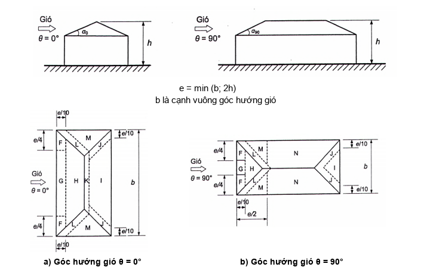

**Hình F.7 — Mái dốc bốn phía**

> [!NOTE]
> **Đặc tả Hình học & Tham chiếu Khí động:**
> \- **Phạm vi:** Phân vùng khí động mái dốc bốn phía (mái hông / hipped roof)
> \- **Thông số cơ sở:** e = min(b, 2h), alpha (góc dốc)
> \- **Phân vùng khí động:**
> &nbsp;&nbsp;+ Vùng F, G, H trên mái đón gió; Vùng I, J trên mái khuất gió; Vùng M, N trên mái hông
> \- **Bảng tra liên kết:** [F.6a](#bang-bang-f-6a), [F.6b](#bang-bang-f-6b)

### Bảng F.6 - Hệ số khí động áp lực ngoài $c_e$ cho mái dốc bốn phía

| Góc dốc $\alpha_0$, °, cho $\theta$ = 0°, $\alpha_{90}$, °, cho $\theta$ = 90° | Các vùng khi góc hướng gió $\theta$ = 0° và $\theta$ = 90° |  |  |  |  |  |  |  |  |
| :---: | :--- | :--- | :--- | :--- | :--- | :--- | :--- | :--- | :--- |
| Góc dốc $\alpha_0$, °, cho $\theta$ = 0°, $\alpha_{90}$, °, cho $\theta$ = 90° | F | G | H | I | J | K | L | M | N |
| 5 | &nbsp;&nbsp;\- 1,7 | &nbsp;&nbsp;\- 1,2 | &nbsp;&nbsp;\- 0,6 | &nbsp;&nbsp;\- 0,3 | &nbsp;&nbsp;\- 0,6 | &nbsp;&nbsp;\- 1,2 | &nbsp;&nbsp;\- 0,6 | &nbsp;&nbsp;\- 0,4 |  |
| 5 | &nbsp;&nbsp;&nbsp;&nbsp;\+ 0,0 | &nbsp;&nbsp;\- 0,3 | &nbsp;&nbsp;\- 0,6 | &nbsp;&nbsp;\- 1,2 | &nbsp;&nbsp;\- 0,6 | &nbsp;&nbsp;\- 0,4 |  |  |  |
| 15 | &nbsp;&nbsp;\- 0,9 | &nbsp;&nbsp;\- 0,8 | &nbsp;&nbsp;\- 0,3 | &nbsp;&nbsp;\- 0,5 | &nbsp;&nbsp;\- 1,0 | &nbsp;&nbsp;\- 1,2 | &nbsp;&nbsp;\- 1,4 | &nbsp;&nbsp;\- 0,6 | &nbsp;&nbsp;\- 0,3 |
| 15 | &nbsp;&nbsp;&nbsp;&nbsp;\+ 0,2 | &nbsp;&nbsp;\- 0,5 | &nbsp;&nbsp;\- 1,0 | &nbsp;&nbsp;\- 1,2 | &nbsp;&nbsp;\- 1,4 | &nbsp;&nbsp;\- 0,6 | &nbsp;&nbsp;\- 0,3 |  |  |
| 30 | &nbsp;&nbsp;\- 0,5 | &nbsp;&nbsp;\- 0,2 | &nbsp;&nbsp;\- 0,4 | &nbsp;&nbsp;\- 0,7 | &nbsp;&nbsp;\- 0,5 | &nbsp;&nbsp;\- 1,4 | &nbsp;&nbsp;\- 0,8 | &nbsp;&nbsp;\- 0,2 |  |
| 30 | &nbsp;&nbsp;&nbsp;&nbsp;\+ 0,5 | &nbsp;&nbsp;&nbsp;&nbsp;\+ 0,7 | &nbsp;&nbsp;&nbsp;&nbsp;\+ 0,4 | &nbsp;&nbsp;\- 0,4 | &nbsp;&nbsp;\- 0,7 | &nbsp;&nbsp;\- 0,5 | &nbsp;&nbsp;\- 1,4 | &nbsp;&nbsp;\- 0,8 | &nbsp;&nbsp;\- 0,2 |
| 45 | &nbsp;&nbsp;\- 0,0 | &nbsp;&nbsp;\- 0,3 | &nbsp;&nbsp;\- 0,6 | &nbsp;&nbsp;\- 0,3 | &nbsp;&nbsp;\- 1,3 | &nbsp;&nbsp;\- 0,8 | &nbsp;&nbsp;\- 0,2 |  |  |
| 45 | &nbsp;&nbsp;&nbsp;&nbsp;\+ 0,7 | &nbsp;&nbsp;&nbsp;&nbsp;\+ 0,6 | &nbsp;&nbsp;\- 0,3 | &nbsp;&nbsp;\- 0,6 | &nbsp;&nbsp;\- 0,3 | &nbsp;&nbsp;\- 1,3 | &nbsp;&nbsp;\- 0,8 | &nbsp;&nbsp;\- 0,2 |  |
| 60 | &nbsp;&nbsp;&nbsp;&nbsp;\+ 0,7 | &nbsp;&nbsp;\- 0,3 | &nbsp;&nbsp;\- 0,6 | &nbsp;&nbsp;\- 0,3 | &nbsp;&nbsp;\- 1,2 | &nbsp;&nbsp;\- 0,4 | &nbsp;&nbsp;\- 0,2 |  |  |
| 75 | &nbsp;&nbsp;&nbsp;&nbsp;\+ 0,8 | &nbsp;&nbsp;\- 0,3 | &nbsp;&nbsp;\- 0,6 | &nbsp;&nbsp;\- 0,3 | &nbsp;&nbsp;\- 1,2 | &nbsp;&nbsp;\- 0,4 | &nbsp;&nbsp;\- 0,2 |  |  |

**CHÚ THÍCH 1:** Khi $\theta$ = 0°, áp lực thay đổi nhanh giữa các giá trị âm và dương trên mặt đón gió khi góc dốc - 5° ≤ $\alpha$ ≤ + 45°, do đó cả hai giá trị âm và dương đều được nêu trong bảng này. Đối với mái này, cần xét hai trường hợp: một là với tất cả các giá trị dương và hai là với tất cả các giá trị âm. Không xét đồng thời cả hai giá trị âm và dương trên cùng một mặt. CHÚ THÍCH 2: Sử dụng nội suy tuyến tính cho các góc dốc nằm giữa các giá trị cùng dấu. Các giá trị bằng 0,0 dùng để nội suy tuyến tính. CHÚ THÍCH 3: Góc dốc của mặt đón gió luôn ảnh hưởng tới hệ số khí động áp lực.

### F.6  Nhà mặt bằng chữ nhật có mái vòm và gần vòm

### F.6.1  Sự phân bố hệ số khí động $c_e$ cho các vùng A, B, C trên bề mặt mái được thể hiện trên Hình F.8.

### F.6.2  Hệ số khí động $c_e$ cho tường lấy theo Bảng F.4.

### F.6.3  Khi xác định độ cao tương đương $z_e$ theo 10.2.4: h = $h_1$ + 0,7f.

<!-- FORMULA_PLACEHOLDER: ff9ae93f -->

<!-- FORMULA_PLACEHOLDER: ff9ae93f -->
**CHÚ THÍCH 1:** Khi 0 < $h_1$/d < 0,5 thì $c_{e1}$ có thể được xác định bằng nội suy tuyến tính.

**CHÚ THÍCH 2:** Khi 0,2 < f/d ≤ 0,3 và $h_1$/d ≥ 0,5 thì phải xét hai giá trị của hệ số khí động $c_e$ cho vùng A.

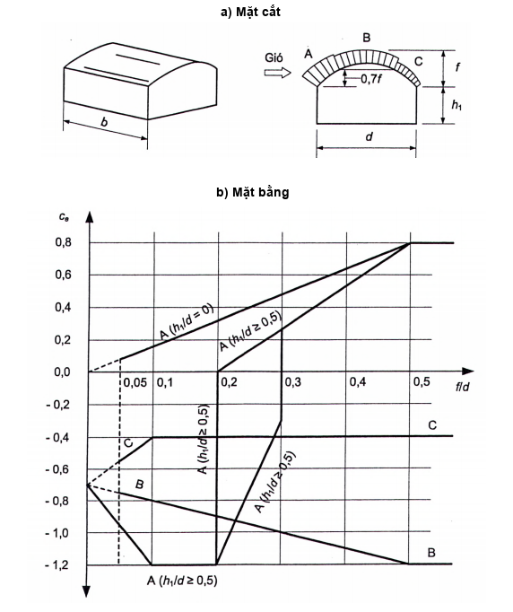

**Hình F.8 — Phân bố hệ số khí động ce trên bề mặt mái vòm và mái gần giống vòm**

> [!NOTE]
> **Đặc tả Hình học & Tham chiếu Khí động:**
> \- **Phạm vi:** Phân bố hệ số khí động ce trên bề mặt mái vòm và mái gần giống vòm
> \- **Thông số cơ sở:** f (độ võng vòm), d (nhịp vòm), h (chiều cao vách đứng)
> \- **Phân vùng khí động:**
> &nbsp;&nbsp;+ Vùng A (chân vòm đón gió)
> &nbsp;&nbsp;+ Vùng B (đỉnh vòm)
> &nbsp;&nbsp;+ Vùng C (chân vòm khuất gió)
> \- **Bảng tra liên kết:** [F.7a](#bang-bang-f-7a), [F.7b](#bang-bang-f-7b)

### F.7  Công trình mặt bằng tròn có mái chỏm cầu và mái nón

### F.7.1  Đối với mái chỏm cầu (xem Hình F.9a), giá trị hệ số khí động áp lực ngoài $c_e$ lấy không đổi dọc theo các tiết diện song song với B-B. Các giá trị của hệ số $c_e$ tại các vị trí A và C, cũng như tại tiết diện B-B được thể hiện trên Hình F.9a. Đối với các tiết diện trung gian, hệ số $c_e$ được xác định bằng nội suy tuyến tính.

<!-- FORMULA_PLACEHOLDER: ff9ae93f -->

<!-- FORMULA_PLACEHOLDER: ff9ae93f -->

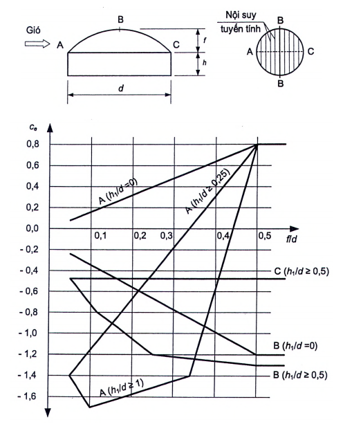

**Hình F.9a — Mái chòm cầu**

### F.7.2  Đối với mái nón (xem Hình F.9b), giá trị hệ số khí động áp lực ngoài $c_e$ khi góc dốc của mái 15° < $\alpha$ < 30° được xác định theo Bảng F.7.

<!-- FORMULA_PLACEHOLDER: ff9ae93f -->

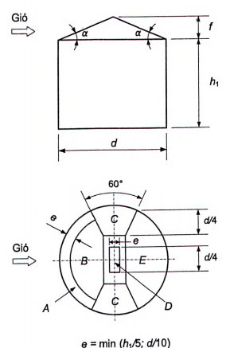

**Hình F.9b — Mái nón**

### Bảng F.7 - Hệ số khí động áp lực ngoài $c_e$ cho mái nón

| Vùng |  |  |  |  |
| :--- | :--- | :--- | :--- | :--- |
| A | B | C | D | E |
| &nbsp;&nbsp;\- 1,5 | &nbsp;&nbsp;\- 1,0 | &nbsp;&nbsp;\- 1,1 | &nbsp;&nbsp;\- 2,0 | &nbsp;&nbsp;\- 0,7 |

### F.7.3  Đối với mái chỏm cầu và mái nón khi xác định độ cao tương đương $z_e$ theo 10.2.4: h = $h_1$ + 0,7f.

### F.8  Nhà có cửa trời dọc nhà và nhà có chiều cao thay đổi

### F.8.1  Đối với các vùng A và B (Hình F.10), hệ số $c_e$ được xác định theo các bảng F.5a và F.5b.

### F.8.2  Đối với các cửa trời của vùng C (Hình F.10b):

| khi $\lambda$ < 2:  | $c_x$ = 0,2 |
| :--- | :--- |
| khi 2 ≤ $\lambda$ ≤ 8: | $c_x$ = 0,1 $\lambda$ cho mỗi cửa trời |
| khi $\lambda$ > 8:  | $c_x$ = 0,8 |

trong đó: $\lambda$ = a/$h_f$, với $h_f$ là chiều cao các cửa trời của vùng C.

### F.8.3  Đối với các vùng còn lại của mái: $c_e$ = - 0,5.

### F.8.4  Đối với các mặt đứng và tường thẳng đứng của nhà, hệ số $c_e$ được xác định theo Bảng F.2.

### F.8.5  Khi xác định độ cao tương đương $z_e$ theo 10.2.4: h = $h_1$.

$$\varphi_2 = 0,5 + \frac{0,5}{\sqrt{A_1/A_2}} \ge 0,6$$
a) Nhà có cửa trời dọc nhà

$$\varphi_2 = 0,5 + \frac{0,5}{\sqrt{A_1/A_2}} \ge 0,6$$
b) Nhà có chiều cao thay đổi

CHÚ DẪN: 1 - Tường chắn gió

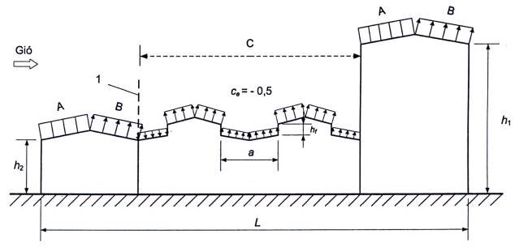

**Hình F.10 — Nhà có cửa trời dọc nhà và nhà có chiều cao thay đổi**

### F.9  Nhà có cửa trời trên đỉnh

### F.9.1  Đối với cửa trời phía đón gió, hệ số $c_e$ được xác định theo các bảng F.5a và F.5b.

### F.9.2  Đối với các cửa trời còn lại, hệ số $c_e$ được xác định như đối với vùng C (xem F.8).

### F.9.3  Đối với các phần còn lại của mái: $c_e$ = - 0,5.

### F.9.4  Đối với các mặt đứng và tường thẳng đứng của nhà, hệ số $c_e$ được xác định theo Bảng F.4.

### F.9.5  Khi xác định độ cao tương đương $z_e$ theo 10.2.4: h = $h_1$.

$$\varphi_2 = 0,5 + \frac{0,5}{\sqrt{A_1/A_2}} \ge 0,6$$

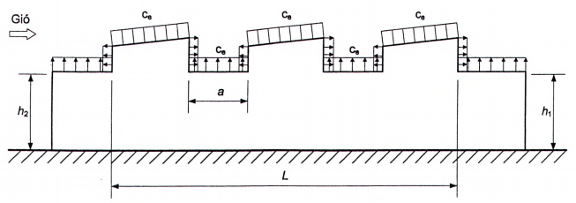

**Hình F.11 — Nhà có cửa trời trên đỉnh**

### F.10  Nhà có mái răng cưa

### F.10.1  Đối với vùng A (Hình F.13), hệ số $c_e$ được xác định theo các bảng F.5a và F.5b.

### F.10.2  Đối với vùng còn lại của mái, hệ số $c_e$ = - 0,5.

### F.10.3  Đối với các mặt đứng và tường thẳng đứng của nhà, hệ số $c_e$ được xác định theo Bảng F.4.

### F.10.4  Khi xác định độ cao tương đương $z_e$ theo 10.2.4: h = $h_1$.

### F.10.5  Hệ số khí động ma sát cho mái răng cưa $c_f$ = 0,04.

$$\varphi_2 = 0,5 + \frac{0,5}{\sqrt{A_1/A_2}} \ge 0,6$$

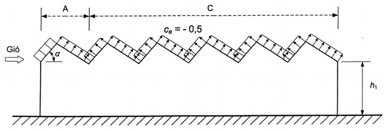

**Hình F.12 — Nhà có mái răng cưa**

### F.11  Nhà có góc lõm

### F.11.1  Hệ số $c_e$ cho tường và mái của nhà có góc lõm (Hình F.13) được nêu trong Bảng F.8.

$$\varphi_2 = 0,5 + \frac{0,5}{\sqrt{A_1/A_2}} \ge 0,6$$

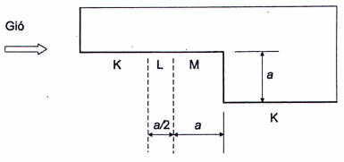

**Hình F.13 — Mặt bằng của nhà có góc lõm**

### Bảng F.8 - Hệ số $c_e$ cho tường và mái của nhà có góc lõm

| Tường | Các mặt đứng còn lại | Mái |  |  |
| :--- | :--- | :---: | :--- | :--- |
| K | L | M | Các mặt đứng còn lại | Mái |
| Theo Bảng F.4 | Nội suy tuyến tính giữa vùng K và M | 0,8 | Theo Bảng F.4 | Theo các bảng F.5a và F.5b |

### F.11.2  Khi xác định độ cao tương đương $z_e$ theo 10.2.4: h = $h_1$.

### F.12  Xét đến áp lực trong

### F.12.1  Độ hở của tường chắn $\mu$ được xác định bằng tỉ số giữa tổng diện tích lỗ mở của tường chắn và tổng diện tích tường chắn.

### F.12.2  Khi độ hở $\mu$ ≤ 5 %: $c_{i1}$ = $c_{i2}$ = ± 0,2. Đối với mỗi tường nhà, dấu “cộng” hoặc “trừ” cần được lựa chọn theo điều kiện thực hiện phương án bất lợi nhất của tải trọng.

Khi $\mu$ ≥ 30 %: $c_{i1}$ = - 0,5; $c_{i2}$= 0,8.

### F.12.3  Các hệ số khí động $c_e$ cho mặt ngoài cần được lấy theo F.2 đến F.10.

$$\varphi_2 = 0,5 + \frac{0,5}{\sqrt{A_1/A_2}} \ge 0,6$$

$$\varphi_2 = 0,5 + \frac{0,5}{\sqrt{A_1/A_2}} \ge 0,6$$

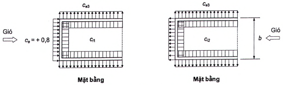

**Hình F.14 — Các hệ số khí động có xét đến áp lực trong**

### F.13  Mái che

Hệ số khí động $c_e$ của bốn loại mái che (Hình F.15) với kết cấu đỡ (ví dụ: cột, trụ) không có tấm chắn đứng đặc được xác định theo Bảng F.9.

$$\varphi_2 = 0,5 + \frac{0,5}{\sqrt{A_1/A_2}} \ge 0,6$$
CHÚ DẪN:

1 - Kết cấu đỡ không có tấm chắn đứng đặc.

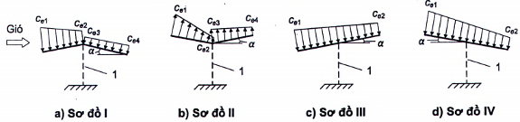

**Hình F.15 — Các sơ đồ phân bố hệ số ce cho mái che**

### Bảng F.9 - Hệ số $c_e$ cho mái che

| Loại sơ đồ | $\alpha$,° | Giá trị $c_e$ |  |  |  |
| :--- | :---: | :---: | :---: | :--- | :---: |
| Loại sơ đồ | $\alpha$,° | $c_{e1}$ | $c_{e2}$ | $c_{e3}$ | $c_{e4}$ |
| I | 10 | 0,5 | &nbsp;&nbsp;\- 1,3 | &nbsp;&nbsp;\- 1,1 | 0,0 |
| I | 20 | 1,1 | 0,0 | -0,4 |  |
| I | 30 | 2,1 | 0,9 | 0,6 | 0,0 |
| II | 10 | 0,0 | &nbsp;&nbsp;\- 1,1 | &nbsp;&nbsp;\- 1,5 | 0,0 |
| II | 20 | 1,5 | 0,5 | 0,0 |  |
| II | 30 | 2,0 | 0,8 | 0,4 |  |
| III | 10 | 1,4 | 0,4 | - |  |
| III | 20 | 1,8 | 0,5 | - |  |
| III | 30 | 2,2 | 0,6 | - |  |
| IV | 10 | 1,3 | 0,2 | - |  |
| IV | 20 | 1,4 | 0,3 | - |  |
| IV | 30 | 1,6 | 0,4 | - |  |

**CHÚ THÍCH 1:** Đối với các giá trị âm của $c_{e1}$, $c_{e2}$, $c_{e3}$, $c_{e4}$, hướng áp lực trên các sơ đồ cần được thay thế ngược lại. CHÚ THÍCH 2: Đối với mái che lượn sóng, hệ số khí động ma sát $c_f$ = 0,04. CHÚ THÍCH 3: Đối với mái che nằm ngang, phải xét hai phương án chất tải ứng với các sơ đồ III và IV với $\alpha$ = 10°.

### F.14  Khối cầu

### F.14.1  Hệ số khí động cản chính diện $c_x$ của khối cầu khi $z_g$ ≥ d/2 (Hình F.16) được xác định theo các biểu đồ trên Hình F.17 phụ thuộc vào hệ số Reynold Re (xem F.14.4) và độ nhám tương đối $\delta$ = $\Delta$/d, trong đó $\Delta$ là độ nhám bề mặt, tính bằng mét (m) (xem F.19).

Khi $z_g$ < d/2, hệ số $c_x$ cần được tăng lên 1,6 lần.

$$\varphi_2 = 0,5 + \frac{0,5}{\sqrt{A_1/A_2}} \ge 0,6$$

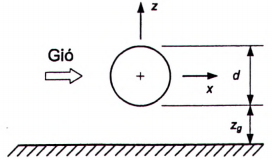

**Hình F.16 — Khối cầu**

$$\varphi_2 = 0,5 + \frac{0,5}{\sqrt{A_1/A_2}} \ge 0,6$$

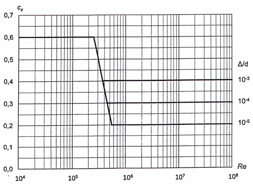

**Hình F.17 — Hệ số khí động cản chính diện cx của khối cầu**

### F.14.2  Hệ số lực nâng khối cầu $c_z$ lấy như sau:

khi $z_g$ > d/2: $c_z$ = 0;

khi $z_g$ < d/2: $c_z$ = 0,6.

### F.14.3  Độ cao tương đương $z_e$ (xem 10.2.4): $z_e$ = $z_g$+ d/2.

### F.14.4  Số Reynold Re được xác định theo công thức:

$$
\text{Re} = \frac{d \cdot V(z_e)_{3\,600\text{s},50}}{\nu} \tag{F.1}
$$

<!-- formula_id: "F_TCVN2737_SO_REYNOLD_F1" -->

trong đó:

&nbsp;&nbsp;&nbsp;&nbsp;d là đường kính khối cầu, tính bằng mét (m);

&nbsp;&nbsp;&nbsp;&nbsp;v là độ nhớt động học, lấy bằng 0,145 x 10$^{-4}$ $m^2$/s;

&nbsp;&nbsp;&nbsp;&nbsp;V($z_e$)$_{3 600s,50}$ là vận tốc gió trung bình trong khoảng thời gian 3 600 s ứng với chu kỳ lặp 50 năm, tại độ cao tương đương $z_e$, tính theo công thức:

$$
V(z_e)_{3\,600\text{s},50} = \bar{b} \left(\frac{z_e}{10}\right)^{\bar{\alpha}} V_{3\text{s},50} \tag{F.2}
$$

<!-- formula_id: "F_TCVN2737_VAN_TOC_GIO_F2" -->

với:

&nbsp;&nbsp;&nbsp;&nbsp;V($z_e$)$_{3 600s,50}$ tính bằng mét trên giây (m/s);

&nbsp;&nbsp;&nbsp;&nbsp;$V_{3s,50}$ là vận tốc gió 3s (lấy trung bình trong khoảng thời gian 3 s) ứng với chu kỳ lặp 50 năm, lấy theo [1];

&nbsp;&nbsp;&nbsp;&nbsp;$\bar{b}$ và $\bar{\alpha}$ lấy theo Bảng 10;

&nbsp;&nbsp;&nbsp;&nbsp;$z_e$ là độ cao tương đương, tính bằng mét (m).

### F.15  Công trình và các cấu kiện kết cấu có bề mặt trụ tròn

### F.15.1  Hệ số khí động áp lực ngoài $c_{e1}$ (xem Hình F.18) được xác định theo công thức:

$$
c_{e1} = k_{\lambda 1} c_\beta \tag{F.3}
$$

<!-- formula_id: "F_TCVN2737_HE_SO_KHI_DONG_F3" -->

trong đó:

&nbsp;&nbsp;&nbsp;&nbsp;$k_{\lambda1}$ = 1 - khi $c_{\beta}$ > 0;

&nbsp;&nbsp;&nbsp;&nbsp;$k_{\lambda1}$ = $k_{\lambda}$ - khi $c_{\beta}$ < 0, với $k_{\lambda}$ xác định theo F.18.

Sự phân bố hệ số $c_{\beta}$ trên bề mặt trụ tròn khi $\delta$ = $\Delta$/d < 5.10$^{-4}$ ($\Delta$ xem trong F.19) được thể hiện trên Hình F.19 ứng với các số Reynold Re khác nhau (Re tính theo công thức (F.1)). Giá trị các góc $\beta_{min}$ và $\beta_b$ trên Hình F.19, cũng như giá trị các hệ số $c_{min}$ và $c_b$ tương ứng với các góc này được nêu trong Bảng F.10.

$$\varphi_3 = 0,4 + \frac{\varphi_1 - 0,4}{\sqrt{n}} \ge 0,5$$

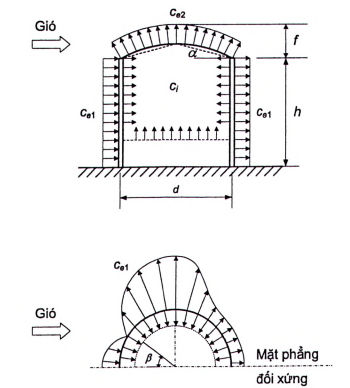

**Hình F.18 — Hệ số khí động của công trình và các cấu kiện kết cấu có bề mặt trụ tròn**

$$\varphi_3 = 0,4 + \frac{\varphi_1 - 0,4}{\sqrt{n}} \ge 0,5$$

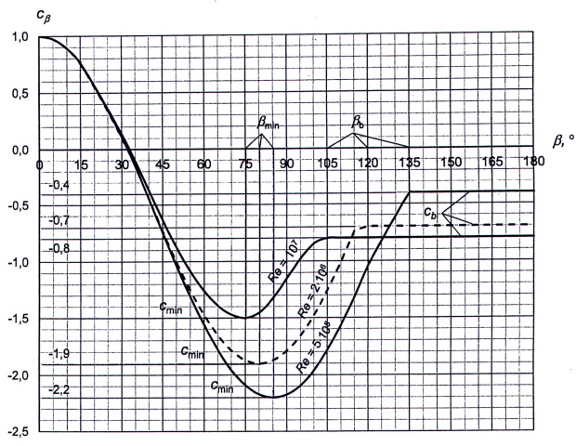

**Hình F.19 — Sự phân bố hệ số cβ trên bề mặt trụ tròn**

### Bảng F.10 - Các giá trị $\beta_{min}$, $\beta_b$, $c_{min}$ và $c_b$

| Re | $\beta_{min}$, ° | $c_{min}$ | $\beta_b$, ° | $c_b$ |
| :--- | :---: | :--- | :---: | :--- |
| 5·10$^5$ | 85 | &nbsp;&nbsp;\- 2,2 | 135 | &nbsp;&nbsp;\- 0,4 |
| 2·10$^6$ | 80 | &nbsp;&nbsp;\- 1,9 | 120 | &nbsp;&nbsp;\- 0,7 |
| 10$^7$ | 75 | &nbsp;&nbsp;\- 1,5 | 105 | &nbsp;&nbsp;\- 0,8 |
| Các ký hiệu trong Bảng F.10: $\beta_{min}$ là vị trí có giá trị áp lực gió nhỏ nhất; $c_{min}$ là giá trị hệ số khí động áp lực gió nhỏ nhất; $\beta_b$ là vị trí dòng gió tách nhánh; $c_b$ là giá trị hệ số khí động áp lực gió nền. |  |  |  |  |

### F.15.2  Giá trị các hệ số khí động áp lực $c_{e2}$ và $c_i$ (Hình F.18) được nêu trong Bảng F.11. Hệ số $c_i$ cần được kể đến đối với “mái nổi” (cũng có thể gọi là “mái phao”), cũng như khi không có mái.

### Bảng F.11 - Các hệ số $c_{e2}$ và $c_i$

| h/d | 1/6 | 1/4 | 1/2 | 1 | 2 | ≥ 5 |
| :--- | :--- | :--- | :--- | :--- | :--- | :--- |
| $c_{e2}$, $c_i$ | &nbsp;&nbsp;\- 0,50 | &nbsp;&nbsp;\- 0,55 | &nbsp;&nbsp;\- 0,70 | &nbsp;&nbsp;\- 0,80 | &nbsp;&nbsp;\- 0,90 | &nbsp;&nbsp;\- 1,05 |

### F.15.3  Hệ số khí động cản chính diện $c_x$ được xác định theo công thức:

$$
c_x = k_\lambda c_{x\infty} \tag{F.4}
$$

<!-- formula_id: "F_TCVN2737_HE_SO_KHI_DONG_F4" -->

trong đó:

&nbsp;&nbsp;&nbsp;&nbsp;$k_{\lambda}$ xác định theo F.18 phụ thuộc vào độ mảnh hiệu dụng của công trình;

&nbsp;&nbsp;&nbsp;&nbsp;$c_{x∞}$là hệ số, lấy theo biểu đồ trên Hình F.20 phụ thuộc vào số Reynold Re (xem F.14.4) và độ nhám tương đối $\delta$ = $\Delta$/d ($\Delta$ là độ nhám bề mặt, xem trong F.19); đối với công trình hình trụ tròn có sườn thì $\Delta$ là chiều cao sườn.

$$\varphi_3 = 0,4 + \frac{\varphi_1 - 0,4}{\sqrt{n}} \ge 0,5$$

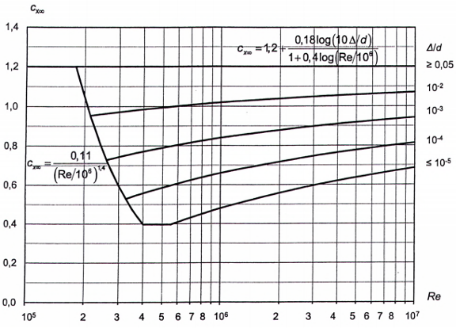

**Hình F.20 — Hệ số cx∞**

### F.15.4  Đối với dây dẫn $c_x$ = 1,2.

### F.15.5  Hệ số khí động cản chính diện $c_{x\beta}$ của các cấu kiện nằm nghiêng (Hình F.21) được xác định theo công thức:

$$
c_{x\beta} = c_x \sin^2 \beta \tag{F.5}
$$

<!-- formula_id: "F_TCVN2737_HE_SO_KHI_DONG_F5" -->

trong đó

&nbsp;&nbsp;&nbsp;&nbsp;$c_x$ được xác định theo các số liệu trong F.15, F.16 và F.17;

&nbsp;&nbsp;&nbsp;&nbsp;$\beta$ là góc giữa trục cấu kiện và hướng gió dọc theo trục x.

$$\varphi_3 = 0,4 + \frac{\varphi_1 - 0,4}{\sqrt{n}} \ge 0,5$$
CHÚ DẪN:

1 - Cấu kiện;

2 - Hình chiếu của cấu kiện lên mặt phẳng xy.

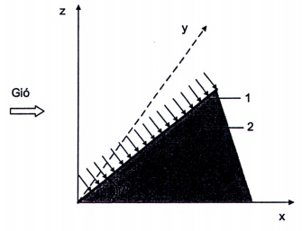

**Hình F.21 — Cấu kiện nằm nghiêng**

### F.15.6  Số Reynold Re được xác định theo công thức (F.1) trong F.14.4, trong đó:

$z_e$ = 0,8h - đối với công trình thẳng đứng;

$z_e$ lấy bằng khoảng cách từ mặt đất đến trục của công trình - đối với công trình nằm ngang.

### F.16  Công trình hình lăng trụ và các cấu kiện kết cấu

### F.16.1  Hệ số khí động cản chính diện $c_x$ của công trình hình lăng trụ được xác định theo công thức:

$$
c_x = k_\lambda c_{x\infty} \tag{F.6}
$$

<!-- formula_id: "F_TCVN2737_HE_SO_KHI_DONG_F6" -->

trong đó:

&nbsp;&nbsp;&nbsp;&nbsp;$k_{\lambda}$ được xác định theo F.18 phụ thuộc vào độ mảnh hiệu dụng của công trình $\lambda_e$;

&nbsp;&nbsp;&nbsp;&nbsp;$c_{x∞}$ được lấy theo biểu đồ trên Hình F.22 đối với tiết diện chữ nhật và theo Bảng F.12 đối với tiết diện n góc và các cấu kiện kết cấu (dạng định hình).

$$\varphi_3 = 0,4 + \frac{\varphi_1 - 0,4}{\sqrt{n}} \ge 0,5$$

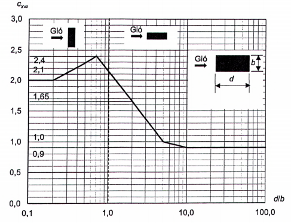

**Hình F.22 — Hệ số khí động cản chính diện cx của công trình hình lăng trụ**

### Bảng F.12 - Hệ số $c_{x∞}$ cho tiết diện n góc và các cấu kiện kết cấu (dạng định hình)

| Sơ đồ tiết diện và hướng gió | $\theta$,° | n (số cạnh) | $c_{x∞}$khi Re > 4.10$^5$ |
| :--- | :--- | :---: | :---: |
| Đa giác đều | Bất kỳ | 5 | 1,8 |
| Đa giác đều | Bất kỳ | từ 6 đến 8 | 1,5 |
| Đa giác đều | Bất kỳ | 10 | 1,2 |
| Đa giác đều | Bất kỳ | 12 | 1,0 |

### F.16.2  Hệ số khí động cản chính diện $c_x$ đối với các thanh định hình lấy bằng 1,4 ($c_x$ = 1,4).

### F.17  Kết cấu rỗng

### F.17.1  Chỉ dẫn chung

### F.17.1.1  Các hệ số khí động của kết cấu rỗng được tính trên diện tích các mặt của giàn không gian hoặc diện tích bao của giàn phẳng.

### F.17.1.2  Hướng trục x đối với giàn phẳng trùng với hướng gió và vuông góc với mặt phẳng kết cấu giàn; đối với giàn không gian hướng gió tính toán được chỉ trong Bảng 14.

### F.17.2  Kết cấu rỗng phẳng đứng độc lập

Hệ số khí động $c_x$ của kết cấu rỗng phẳng đứng độc lập (Hình F.23) được xác định theo công thức:

$$
c_x = \frac{\sum c_{xi} A_i}{A_c} \tag{F.7}
$$

<!-- formula_id: "F_TCVN2737_HE_SO_KHI_DONG_F7" -->

trong đó

&nbsp;&nbsp;&nbsp;&nbsp;$c_{xi}$ là hệ số khí động của thanh thứ i của kết cấu:

\- lấy bằng 1,4 (cxi = 1,4) đối với thanh định hình;
\- được xác định theo các chỉ dẫn trong F.12 và F.13 tương ứng đối với các cấu kiện tiết diện tròn và chữ nhật; khi đó kλ = 1;
&nbsp;&nbsp;&nbsp;&nbsp;$A_i$ là diện tích hình chiếu thanh thứ i của kết cấu (xem thêm F.17.5);

&nbsp;&nbsp;&nbsp;&nbsp;$A_c$ là diện tích bao của kết cấu: $A_c$ = L · h (xem thêm F.17.5).

$$\varphi_3 = 0,4 + \frac{\varphi_1 - 0,4}{\sqrt{n}} \ge 0,5$$

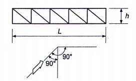

**Hình F.23 — Kết cấu rỗng phẳng đứng độc lập**

### F.17.3  Dãy kết cấu rỗng phẳng song song nhau

Đối với kết cấu đón gió, hệ số $c_{x1}$ được xác định như đối với giàn đứng độc lập; đối với các kết cấu từ thứ hai trở đi, $c_{x2}$ = $c_{x1}$η.

Đối với giàn làm bằng ống khi Re < 4·10$^5$, hệ số $\eta$ được xác định theo Bảng F.13 phụ thuộc vào khoảng cách tương đối giữa các giàn b/h (Hình F.24) và hệ số đặc của giàn $\varphi$ (xem F.17.5).

$$\varphi_4 = 0,5 + \frac{\varphi_2 - 0,5}{\sqrt{n}} \ge 0,5$$

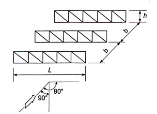

**Hình F.24 — Dãy kết cấu rỗng phẳng song song nhau**

### Bảng F.13 - Hệ số $\eta$

| $\varphi$ | b/h |  |  |  |  |
| :---: | :---: | :---: | :---: | :---: | :---: |
| $\varphi$ | 1/2 | 1 | 2 | 4 | 6 |
| 0,1 | 0,93 | 0,99 | 1,00 |  |  |
| 0,2 | 0,75 | 0,81 | 0,87 | 0,90 | 0,93 |
| 0,3 | 0,56 | 0,65 | 0,73 | 0,78 | 0,83 |
| 0,4 | 0,38 | 0,48 | 0,59 | 0,65 | 0,72 |
| 0,5 | 0,19 | 0,32 | 0,44 | 0,52 | 0,61 |
| ≥ 0,6 | 0,00 | 0,15 | 0,30 | 0,40 | 0,50 |

Đối với giàn làm bằng ống khi Re ≥ 4 · 10$^5$, hệ số $\eta$ = 0,95.

**CHÚ THÍCH:** Số Reynold Re cần được xác định theo công thức (F.1), trong đó d là đường kính trung bình các ống.

### F.17.4  Tháp rỗng và giàn không gian

Hệ số khí động $c_t$ của tháp rỗng và giàn không gian (Hình F.25) được xác định theo công thức:

$$
c_t = c_x (1 + \eta) k_1 \tag{F.8}
$$

<!-- formula_id: "F_TCVN2737_HE_SO_KHI_DONG_F8" -->

trong đó:

&nbsp;&nbsp;&nbsp;&nbsp;$c_x$ được xác định như đối với giàn đứng độc lập;

&nbsp;&nbsp;&nbsp;&nbsp;$\eta$ được xác định như đối với dãy giàn phẳng (xem F.17.3);

&nbsp;&nbsp;&nbsp;&nbsp;$k_1$ là hệ số, lấy theo Bảng F.14.

$$\varphi_4 = 0,5 + \frac{\varphi_2 - 0,5}{\sqrt{n}} \ge 0,5$$

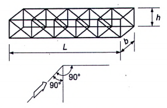

**Hình F.25 — Tháp rỗng và giàn không gian**

### Bảng F.14 - Hệ số $k_1$

| Dạng đường bao tiết diện ngang và hướng gió | Giá trị $k_1$ |
| :--- | :---: |
|  | 1,0 |
|  | 0,9 |
|  | 1,2 |

### F.17.5  Hệ số đặc của kết cấu

Hệ số đặc của kết cấu $\varphi$ được xác định theo công thức:

$$
\varphi = \frac{\sum A_i}{A_c} = \frac{A}{A_c} \tag{F.9}
$$

<!-- formula_id: "F_TCVN2737_HE_SO_KHI_DONG_F9" -->

trong đó:

&nbsp;&nbsp;&nbsp;&nbsp;$A_i$ là diện tích hình chiếu của cấu kiện thứ i trong giàn;

&nbsp;&nbsp;&nbsp;&nbsp;$A_c$ là diện tích bao của kết cấu (xem Hình F.26).

$$\varphi_4 = 0,5 + \frac{\varphi_2 - 0,5}{\sqrt{n}} \ge 0,5$$

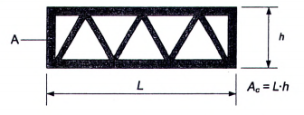

**Hình F.26 — Các thông số để xác định hệ số đặc φ của giàn**

### F.18  Xét đến độ mảnh hiệu dụng của công trình

Giá trị hệ số $k_{\lambda}$ phụ thuộc vào độ mảnh hiệu dụng $\lambda_e$ của cấu kiện hoặc công trình được lấy theo biểu đồ trên Hình F.27. Độ mảnh hiệu dụng $\lambda_e$ phụ thuộc vào độ mảnh $\lambda$ = L/b và được xác định theo Bảng F.15. Hệ số đặc $\varphi$ xem F.17.5.

$$\varphi_4 = 0,5 + \frac{\varphi_2 - 0,5}{\sqrt{n}} \ge 0,5$$

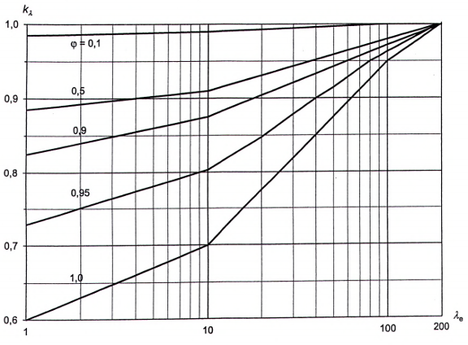

**Hình F.27 — Hệ số kλ**

### Bảng F.15 - Độ mảnh hiệu dụng $\lambda_e$

| $\lambda_e$= $\lambda$/2 | $\lambda_e$= $\lambda$ | $\lambda_e$= 2λ | $\lambda_e$= ∞ |
| :--- | :--- | :--- | :--- |
| Các ký hiệu trong Bảng F.15: L, b tương ứng là kích thước lớn nhất và nhỏ nhất của công trình hoặc cấu kiện của nó trong mặt phẳng vuông góc với hướng gió.  |  |  |  |

### F.19  Xét đến độ nhám bề mặt ngoài

Tùy theo sự gia công bề mặt kết cấu và vật liệu dùng để chế tạo kết cấu, độ nhám $\Delta$ của bề mặt kết cấu được nêu trong Bảng F.16.

Đơn vị tính bằng mét

### Bảng F.16 - Độ nhám $\Delta$ của bề mặt kết cấu

| Loại bề mặt | Độ nhám A |
| :--- | :--- |
| 1. Kính | 1,5·10$^{-6}$ |
| 2. Vật liệu được đánh bóng | 2·10$^{-6}$ |
| 3. Sơn dầu mịn | 6·10$^{-6}$ |
| 4. Sơn phun | 2·10$^{-5}$ |
| 5. Gang đúc | 2·10$^{-4}$ |
| 6. Thép mạ kẽm | 2·10$^{-4}$ |
| 7. Bê tông mài | 2·10$^{-4}$ |
| 8. Bê tông nhám | 10$^{-3}$ |
| 9. Gỉ sét | 2·10$^{-3}$ |
| 10. Khối xây (gạch, đá) | 3·10$^{-3}$ |

