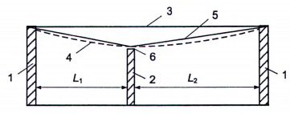
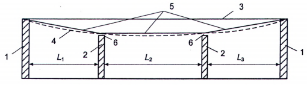
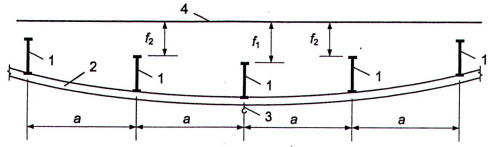
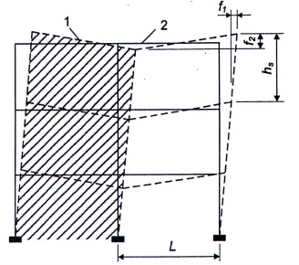

## PHỤ LỤC G  (Quy định)  ĐỘ VÕNG VÀ CHUYỂN VỊ

### G.1  Xác định độ võng và chuyển vị

**G.1.1**  Khi xác định độ võng và chuyển vị cần phải kể đến tất cả các yếu tố chính ảnh hưởng đến giá trị của chúng (biến dạng không đàn hồi của vật liệu, sự hình thành vết nứt, việc xét đến sơ đồ biến dạng, việc xét đến các kết cấu liền kề, độ mềm dẻo của các nút liên kết và nền). Khi có đủ cơ sở, có thể không cần tính đến một số yếu tố nào đó hoặc tính đến bằng phương pháp gần đúng.

**G.1.2**  Đối với kết cấu dùng loại vật liệu có tính từ biến thì phải kể đến sự tăng độ võng theo thời gian. Khi khống chế độ võng theo yêu cầu tâm sinh lý thì chỉ kể đến từ biến ngắn hạn xuất hiện ngay sau khi đặt tải, còn theo yêu cầu công nghệ và cấu tạo (trừ khi tính toán kể đến tải trọng gió), thẩm mỹ - tâm lý thì kể đến từ biến toàn phần.

**G.1.3**  Khi xác định độ võng ngang của cột nhà một tầng và của trụ cầu cạn do tải trọng ngang của cần trục cần chọn sơ đồ tính của cột (trụ) có kể đến điều kiện liên kết với giả thiết:

- Cột nhà và trụ các cầu cạn trong nhà không có dịch chuyển ngang ở cao độ gối tựa trên cùng (nếu sàn mái không tạo thành tấm cứng trong mặt phẳng ngang, cần kể đến độ mềm dẻo theo phương ngang của gối tựa này);

- Trụ các cầu cạn ngoài trời được coi như công xôn.

**G.1.4**  Khi kết cấu xây dựng dao động thì việc phân loại dao động, các thông số quy định, các giá trị giới hạn cho phép của chúng đối với nhà ở, nhà công cộng và nhà công nghiệp phải được quy định theo yêu cầu của các tiêu chuẩn có liên quan.

Khi có các thiết bị và dụng cụ độ chính xác cao nhạy với dao động của kết cấu mà chúng đặt trên đó thì giá trị giới hạn của chuyển vị rung, vận tốc rung và gia tốc rung cần được xác định theo nhiệm vụ thiết kế.

**G.1.5**  Tình huống tính toán, mà trong đó phải xác định độ võng, chuyển vị và các tải trọng tương ứng với chúng, phải được lựa chọn tùy thuộc vào việc tính toán được thực hiện theo các yêu cầu nào.

Tình huống tính toán được đặc trưng bởi sơ đồ tính toán kết cấu, loại tải trọng, giá trị các hệ số điều kiện làm việc và các hệ số độ tin cậy, số lượng các trạng thái giới hạn được xét đến trong tình huống tính toán đó.

Nếu việc tính toán được thực hiện theo yêu cầu công nghệ thì tình huống tính toán cần phải phù hợp với tác dụng của các tải trọng gây ảnh hưởng đến sự làm việc của các thiết bị công nghệ.

Nếu việc tính toán được thực hiện theo yêu cầu cấu tạo thì tình huống tính toán cần phải phù hợp với tác dụng của các tải trọng gây ra các hư hỏng của các cấu kiện liền kề do độ võng và chuyển vị quá lớn.

Nếu việc tính toán được thực hiện theo yêu cầu tâm sinh lý thì tình huống tính toán cần phải phù hợp với trạng thái có liên quan đến dao động của kết cấu và khi đó phải kể đến các tải trọng gây ảnh hưởng đến dao động của kết cấu quy định trong tiêu chuẩn này và các tiêu chuẩn khác có liên quan.

Nếu việc tính toán được thực hiện theo yêu cầu thẩm mỹ - tâm lý thì tình huống tính toán cần phải phù hợp với tác dụng của các tải trọng thường xuyên và tạm thời dài hạn.

Đối với kết cấu mái và sàn tầng được thiết kế với độ vồng thi công thì khi khống chế độ võng theo yêu cầu thẩm mỹ - tâm lý, độ võng đứng xác định được cần phải giảm đi một đại lượng bằng giá trị độ vồng thi công đó.

**G.1.6**  Độ võng của các cấu kiện của sàn tầng và mái theo yêu cầu cấu tạo không được vượt quá khoảng cách (khe hở) giữa mặt dưới của các cấu kiện đó và mặt trên (đỉnh) của tường ngăn, vách kính, khuôn cửa sổ, khuôn cửa đi và các cấu kiện cấu tạo khác nằm dưới các cấu kiện chịu lực.

**G.1.7**  Trong trường hợp giữa các tường có tường ngăn chịu lực (với chiều cao gần bằng chiều cao tường) thì giá trị L trong mục 2a Bảng G.1 lấy bằng khoảng cách giữa mặt trong của các tường chịu lực (hoặc các cột) và các tường ngăn (hoặc giữa mặt trong của các tường ngăn như trên Hình G.1).

a) Có một tường ngăn

b) Có hai tường ngăn

CHÚ DẪN:

| 1 - Tường chịu lực (hoặc cột); | 4 - Sàn tàng (hoặc mái) khi chịu tải trọng; |
| :--- | :--- |
| 2 - Tường ngăn; | 5 - Các đoạn thẳng mốc để tính độ võng; |
| 3 - Sàn tầng (hoặc mái) trước khi chịu tải trọng; | 6 - Khe hở. |

<strong>a) Có một tường ngăn</strong>

<strong>b) Có hai tường ngăn</strong>

<strong>Hình G.1 — Sơ đồ xác định các giá trị L ($L_1, L_2, L_3$) khi có tường ngăn nằm giữa các tường chịu lực</strong>

**G.1.8**  Độ võng của kết cấu vì kèo khi có đường ray của cần trục treo (Bảng G.1, mục 2c) lấy bằng hiệu các độ võng $f_{1}$ và $f_{2}$ của các kết cấu vì kèo liền kề nhau (Hình G.2).

CHÚ DẪN:

| 1 - Kết cấu vì kèo; | 3 - Cần trục treo; |
| :--- | :--- |
| 2 - Dầm đỡ đường ray cần trục treo; | 4 - Vị trí ban đầu của kết cấu vì kèo. |

**CHÚ THÍCH:** 

$f_{1}$ - Độ võng của kết cấu vì kèo chịu lực nhiều nhất;

$f_{2}$ - Độ võng của kết cấu vì kèo gần kết cấu vì kèo chịu lực nhiều nhất.

<strong>Hình G.2 — Sơ đồ tính độ võng của kết cấu vì kèo khi có đường ray của cần trục treo</strong>

**G.1.9**  Chuyển vị ngang của khung cần được xác định trong mặt phẳng tường và tường ngăn mà tính toàn vẹn của chúng cần được đảm bảo.

### G.2  Độ võng giới hạn

**G.2.1**  Độ võng đứng giới hạn của cấu kiện kết cấu

**G.2.2.1**  Độ võng đứng giới hạn $f_{u}$ của các cấu kiện kết cấu và tải trọng tương ứng dùng để xác định độ võng f được nêu trong Bảng G.1.

**Bảng G.1 — Độ võng đứng giới hạn $f_{u}$ và tải trọng tương ứng để xác định độ võng đứng f**

| Cấu kiện kết cấu | Yêu cầu | Giá trị $f_{u}$ | Tải trọng để xác định độ võng đứng f |
| :--- | :--- | :--- | :--- |
| 1. Dầm đỡ cần trục kiểu cầu (cầu trục) và cần trục treo được điều khiển từ cabin ứng với chế độ làm việc (theo TCVN 8590-1:2010 (ISO 4301-1:1986)): |  |  |  |
| nhóm A1 đến A6 | Tâm sinh lý | L/400 | Tải trọng do một cần trục |
| nhóm A7 | Tâm sinh lý | L/500 | Tải trọng do một cần trục |
| nhóm A8 | Tâm sinh lý | L/600 | Tải trọng do một cần trục |
| 2. Dầm, giàn, xà, bản, xà gồ, tấm, bản (bao gồm cả sườn của tấm và bản) đỡ: |  |  |  |
| a) Mái và sàn tầng nhìn thấy được, có nhịp L, m: L ≤ 1 L = 3 L = 3 | Thẩm mỹ - tâm lý | L/120 L/150 L/150 | Tải trọng thường xuyên và tạm thời dài hạn (trong đó có tải trọng tạm thời ngắn hạn nêu tại Bảng 4 với hệ số giảm η nêu tại 8.3.3) |
| L = 6 L = 24 (12) L ≥ 36 (24) | Thẩm mỹ - tâm lý | L/200 L/250 L/300 | Tải trọng thường xuyên và tạm thời dài hạn (trong đó có tải trọng tạm thời ngắn hạn nêu tại Bảng 4 với hệ số giảm η nêu tại 8.3.3) |
| b) Mái và sàn tầng khi sử dụng pa lăng, cần trục treo được điều khiển từ cabin | Tâm sinh lý | L/400 hoặc a/200 (lấy giá trị nhỏ hơn) | Tải trọng do một cần trục hoặc pa lăng trên một đường ray |
| c) Sàn tầng chịu tác dụng của: | Tâm sinh lý | L/350 | Giá trị bất lợi hơn trong hai giá trị: &nbsp;&nbsp;\- 0,7 lần giá trị tiêu chuẩn của tải trọng tạm thời ngắn hạn lên sàn tầng; &nbsp;&nbsp;\- tải trọng do một xe xếp tải. |
| &nbsp;&nbsp;\- các tải trọng di chuyển, vật liệu, chi tiết máy móc và các tải trọng di động khác (trong đó có tải trọng di chuyển trên nền không ray) | Tâm sinh lý | L/350 | Giá trị bất lợi hơn trong hai giá trị: &nbsp;&nbsp;\- 0,7 lần giá trị tiêu chuẩn của tải trọng tạm thời ngắn hạn lên sàn tầng; &nbsp;&nbsp;\- tải trọng do một xe xếp tải. |
| &nbsp;&nbsp;\- tải trọng di chuyển trên ray: &nbsp;&nbsp;&nbsp;&nbsp;\+ khổ hẹp | Tâm sinh lý | L/400 | Tải trọng do một toa (hoặc một xe) chạy trên một đường ray |
| &nbsp;&nbsp;&nbsp;&nbsp;\+ khổ rộng | Tâm sinh lý | L/500 | Tải trọng do một toa (hoặc một xe) chạy trên một đường ray |
| d) mái và sàn tầng bãi đỗ xe trong nhà với nhịp L, m: L = 6 L = 12 L ≥ 24 | Tâm sinh lý | L/200 L/250 L/300 | Tải trọng thường xuyên và tạm thời dài hạn (trong đó có tải trọng tạm thời ngắn hạn nêu tại Bảng 4 với hệ số giảm η nêu tại 8.3.3) |
| 3. Các bộ phận của cầu thang bộ (bản thang, chiếu nghỉ, chiếu tới, cốn), của ban công, của lôgia | Thẩm mỹ - tâm lý | Như trong mục 2a |  |
| 3. Các bộ phận của cầu thang bộ (bản thang, chiếu nghỉ, chiếu tới, cốn), của ban công, của lôgia | Tâm sinh lý | Xác định theo G.2.2 |  |
| 4. Lanh tô, tấm tường treo phía trên lỗ cửa sổ và cửa đi (xà và xà gồ vách kính) | Thẩm mỹ - tâm lý | Như trong mục 2a |  |
| Các ký hiệu trong Bảng G.1: L là nhịp tính toán của cấu kiện. a là bước dầm hoặc giàn mà đường đi của cần trục treo liên kết vào. |  |  |  |

**CHÚ THÍCH:** Đối với công xôn L được lấy bằng hai lần chiều dài vươn công xôn. CHÚ THÍCH 2: Đối với các giá trị trung gian của L trong mục 2a, độ võng giới hạn xác định bằng nội suy tuyến tính có kể đến các yêu cầu trong G.1.7. CHÚ THÍCH 3: Trong mục 2a lấy số trong ngoặc đơn khi chiều cao phòng đến nhỏ hơn hoặc bằng 6 m. CHÚ THÍCH 4: Cách tính độ võng theo mục 2b được nêu trong G.1.8. CHÚ THÍCH 5: Khi khống chế độ võng giới hạn theo yêu cầu thẩm mỹ - tâm lý thì cho phép chiều dài nhịp L lấy bằng khoảng cách giữa mặt trong của các tường chịu lực (hoặc các cột). CHÚ THÍCH 6: Nhóm chế độ làm việc của cần trục kiểu cầu (cầu trục) và cần trục treo lấy theo Bảng B.1, Phụ lục B.

**G.2.2**  Yêu cầu tâm sinh lý

Độ võng giới hạn theo yêu cầu tâm sinh lý của các cấu kiện của sàn tầng (dầm, xà, bản), cầu thang, ban công, lôgia, các phòng trong nhà ở và nhà công cộng, cũng như các phòng sinh hoạt của nhà sản xuất cần được xác định theo công thức:

$$
f_u = \frac{g(p + p_1 + q)}{30n^2 (bp + p_1 + q)} \tag{G.1}
$$
<!-- formula_id: "F_TCVN2737_DO_VONG_GIOI_HAN_G1" -->

trong đó:

&nbsp;&nbsp;&nbsp;&nbsp;\- g là gia tốc trọng trường;

&nbsp;&nbsp;&nbsp;&nbsp;\- p là giá trị tiêu chuẩn của tải trọng do trọng lượng con người gây ra dao động, lấy theo Bảng G.2;

&nbsp;&nbsp;&nbsp;&nbsp;\- $p_{1}$ là giá trị tiêu chuẩn giảm của tải trọng lên sàn, lấy theo Bảng G.2;

&nbsp;&nbsp;&nbsp;&nbsp;\- q là giá trị tiêu chuẩn của tải trọng do trọng lượng của cấu kiện đang tính và các kết cấu tựa lên nó;

&nbsp;&nbsp;&nbsp;&nbsp;\- n là tần số gia tải khi người đi lại, lấy theo Bảng G.2;

&nbsp;&nbsp;&nbsp;&nbsp;\- b là hệ số, lấy theo Bảng G.2.

Độ võng f cần được xác định do tổng các tải trọng $\varphi_{1}$ p + $p_{1}$ + q, trong đó là hệ số xác định theo công thức (3).

**Bảng G.2 — Các hệ số p, $p_{1}$, n, b**

| Các khu vực (theo Bảng 4) | p, kN/$m^{2}$ | $p_{1}$, kN/$m^{2}$ | n, Hz | b |
| :--- | :---: | :--- | :---: | :--- |
| 1. Các khu vực A, B (trừ phòng sinh hoạt ở khu B1); những chỗ nghỉ ngơi thuộc khu vực I2) | 0,25 | Lấy bằng $q_{k,qper}$ theo 8.3.3 | 1,5 |  |
| 2. Phòng học thuộc khu vực C1.1 và phòng sinh hoạt thuộc khu vực B1; Các khu vực C (trừ phòng khiêu vũ thuộc khu vực C4) và D; Những chỗ tập trung đông người thuộc khu vực I1 | 0,50 | Lấy bằng $q_{k,qper}$ theo 8.3.3 | 1,5 |  |
| Các ký hiệu trong bảng: Q là trọng lượng của một người, lấy bằng 0,8 kN. α là hệ số, lấy bằng: 1,0 - đối với cấu kiện tính theo sơ đồ dầm; 0,6 - đối với các cấu kiện còn lại (ví dụ, khi bản sàn kê ba hoặc bốn cạnh). a là bước dầm, xà; chiều rộng bản sàn (tấm), tính bằng mét (m). L là nhịp tính toán của cấu kiện kết cấu, tính bằng mét (m). |  |  |  |  |

**G.2.3**  Độ võng ngang giới hạn của cột và kết cấu hãm do tải trọng cần trục

Độ võng ngang giới hạn của cột nhà có cần trục kiểu cầu (cầu trục), của trụ cầu cạn, cũng như của dầm đỡ cầu trục và của kết cấu hãm (dầm và giàn) lấy theo Bảng G.3 nhưng không nhỏ hơn 6 mm.

Độ võng cần được kiểm tra tại cao độ mặt trên của đường ray cầu trục theo lực hãm xe con của một cầu trục tác dụng theo hướng cắt ngang đường đi của cầu trục, không kể đến độ nghiêng của móng.

**Bảng G.3 — Độ võng ngang giới hạn $f_{\mu}$ của cột nhà có cầu trục, trụ cầu cạn, dầm đỡ cầu trục và kết cấu hãm**

| Nhóm chế độ làm việc của cần trục kiểu cầu (cầu trục) | Giá trị $f_{u}$ của |  |  |
| :--- | :--- | :--- | :--- |
| Nhóm chế độ làm việc của cần trục kiểu cầu (cầu trục) | Cột nhà và trụ cầu cạn trong nhà | Trụ cầu cạn ngoài trời | Dầm đỡ cầu trục và kết cấu hãm, nhà và cầu cạn (cả trong nhà và ngoài trời) |
| A1 đến A3 | h/500 | h/1 500 | L/500 |
| A4 đến A6 | h/1 000 | h/2000 | L/1 000 |
| A7 đến A8 | h/2000 | h/2500 | L/2 000 |
| Các ký hiệu trong Bảng G.3: h là chiều cao từ mặt trên của móng đến đỉnh của đường ray cầu trục (đối với nhà 1 tầng và cầu cạn ngoài trời hoặc trong nhà) hoặc khoảng cách từ trục dầm sàn đến đỉnh của đường ray cầu trục (đối với các tầng trên của nhà nhiều tầng); L là nhịp tính toán của cấu kiện (dầm). |  |  |  |

**CHÚ THÍCH:** Nhóm chế độ làm việc của cầu trục lấy theo Bảng B.1, Phụ lục B.

**G.2.4**  Độ võng ngang giới hạn của nhà, cấu kiện riêng lẻ và trụ đỡ băng tải do tải trọng gió, độ nghiêng của móng và tác động nhiệt khí hậu

**G.2.4.1**  Đối với trạng thái giới hạn thứ hai, chuyển vị ngang của nhà không khung do tải trọng gió không cần khống chế giới hạn.

**G.2.4.2**  Độ võng ngang giới hạn của cột (trụ) nhà khung do tác động của nhiệt khí hậu và lún lấy bằng:

$h_{s}$/150 - khi tường và tường ngăn bằng gạch, bê tông thạch cao, bê tông cốt thép hay panen treo;

$h_{s}$/200 - khi tường được ốp bằng đá tự nhiên, tường bằng gạch đất sét nung hoặc bằng kính (vách kính), trong đó $h_{s}$ là chiều cao một tầng, còn đối với nhà một tầng có cầu trục thì $h_{s}$ là chiều cao từ mặt móng đến mặt dưới của dầm đỡ cầu trục.

Khi đó tác động của nhiệt độ cần được lấy không kể đến sự thay đổi nhiệt độ không khí bên ngoài ngày đêm và chênh lệch nhiệt độ do bức xạ mặt trời.

Khi xác định độ võng ngang do tác động của nhiệt khí hậu và lún, giá trị của nó không được cộng với độ võng do tải trọng gió và do độ nghiêng của móng.

**G.2.4.3**  Độ võng ngang giới hạn của các bộ phận cấu tạo của vách kính và tương tự được quy định theo tiêu chuẩn chuyên ngành có liên quan hoặc theo nhiệm vụ thiết kế.

**G.2.5**  Độ võng giới hạn và chuyển vị giới hạn của nhà và các cấu kiện riêng lẻ của nhà theo các yêu cầu công nghệ và cấu tạo

**G.2.5.1**  Độ võng đứng giới hạn của các cấu kiện kết cấu theo các yêu cầu công nghệ và cấu tạo

**G.2.5.1.1**  Độ võng đứng giới hạn của cấu kiện kết cấu theo yêu cầu công nghệ và cấu tạo được nêu trong Bảng G.4. Yêu cầu về khe hở giữa các cấu kiện liền kề được nêu trong G.2.5.1.2.

**Bảng G.4 — Độ võng đứng giới hạn $f_{u}$ và tải trọng tương ứng để xác định độ võng đứng f**

| Cấu kiện kết cấu | Yêu cầu | Giá trị $f_{u}$ | Tải trọng để xác định độ võng đứng f |
| :--- | :--- | :--- | :--- |
| 1. Dầm đỡ cần trục kiểu cầu (cầu trục) và cần trục treo được điều khiển: |  |  |  |
| a) từ dưới nền, kể cả pa lăng | Công nghệ | L/250 | Tải trọng do một cần trục |
| b) từ cabin ứng với chế độ làm việc (theo TCVN 8590-1:2010 (ISO 4301-1:1986)): | Công nghệ |  |  |
| nhóm A1 đến A6 |  | L/400 | Tải trọng do một cần trục |
| nhóm A7 |  | L/500 | Tải trọng do một cần trục |
| nhóm A8 |  | L/600 | Tải trọng do một cần trục |
| 2. Dầm, giàn, xà, bản, xà gồ, bản, tấm (bao gồm cả sườn của bản và tấm) của: |  |  |  |
| a) Mái và sàn tầng có tường ngăn ngay dưới chúng | Cấu tạo | Lấy theo G.2.5.1.2 | Tải trọng làm giảm khe hở giữa cấu kiện chịu lực của kết cấu và tường ngăn nằm ngay dưới chúng |
| b) Mái và sàn tầng khi sử dụng pa lăng, cần trục treo được điều khiển từ dưới nền | Công nghệ | L/300 hoặc a/150 (lấy giá trị nhỏ hơn) | Tải trọng tạm thời ngắn hạn có kể đến tải trọng do một cần trục hoặc pa lăng trên một đường ray |
| c) Sàn tầng mà chịu tác dụng của: | Công nghệ |  |  |
| &nbsp;&nbsp;\- các tải trọng di chuyển, vật liệu, chi tiết máy móc và các tải trọng di động khác (trong đó có tải trọng di chuyển trên nền không ray) | Công nghệ | L/350 | Giá trị bất lợi hơn trong hai giá trị: &nbsp;&nbsp;\- 0,7 lần giá trị tiêu chuẩn của tải trọng tạm thời ngắn hạn lên sàn tầng; &nbsp;&nbsp;\- tải trọng do một xe xếp tải |
| &nbsp;&nbsp;\- tải trọng di chuyển trên ray: | Công nghệ | L/350 | Giá trị bất lợi hơn trong hai giá trị: &nbsp;&nbsp;\- 0,7 lần giá trị tiêu chuẩn của tải trọng tạm thời ngắn hạn lên sàn tầng; &nbsp;&nbsp;\- tải trọng do một xe xếp tải |
| &nbsp;&nbsp;&nbsp;&nbsp;\+ khổ hẹp | Công nghệ | L/400 | Tải trọng do một toa (hoặc xe) chạy trên một đường ray |
| &nbsp;&nbsp;&nbsp;&nbsp;\+ khổ rộng | Công nghệ | L/500 | Tải trọng do một toa (hoặc xe) chạy trên một đường ray |
| d) Mái và sàn tầng của bãi đỗ xe trong nhà, có nhịp L, m: L = 6 L = 12 L ≥ 24 | Công nghệ | L/200 L/250 L/300 | Tải trọng thường xuyên và tạm thời dài hạn (trong đó có tải trọng tạm thời ngắn hạn nêu tại Bảng 4 với hệ số giảm η nêu tại 8.3.3 và tải trọng tạm thời ngắn hạn nêu tại Bảng 5 với hệ số giảm η nêu tại 8.5.4) |
| 3. Lanh tô, tấm tường treo phía trên lỗ cửa sổ và cửa đi (xà và xà gồ vách kính) | Cấu tạo | L/200 | Tải trọng làm giảm khe hở giữa cấu kiện chịu lực và phần chèn các cửa sổ, cửa đi dưới cấu kiện chịu lực đó. |
| Các ký hiệu trong Bảng G.4: L là nhịp tính toán của cấu kiện kết cấu. a là bước dầm hoặc giàn mà đường đi của cần trục treo liên kết vào. |  |  |  |

**CHÚ THÍCH:** Đối với công xôn L được lấy bằng hai lần chiều dài vươn công xôn. CHÚ THÍCH 2: Cách tính độ võng theo mục 2b được nêu trong G.1.8. CHÚ THÍCH 3: Nhóm chế độ làm việc của cần trục kiểu cầu (cầu trục) và cần trục treo lấy theo Phụ lục B.

**G.2.5.1.2**  Khe hở giữa mặt dưới của các cấu kiện của mái, sàn tầng và đỉnh tường ngăn nằm dưới các cấu kiện đó, thông thường, không được vượt quá 40 mm. Trong các trường hợp, khi việc thực hiện các yêu cầu vừa nêu liên quan đến sự tăng độ cứng của sàn tầng và mái thì phải sử dụng các biện pháp cấu tạo để tránh sự tăng độ cứng đó (ví dụ: không bố trí các tường ngăn ngay dưới dầm chịu uốn mà bố trí ở bên cạnh nó).

**G.2.5.2**  Độ dịch ngang (dịch vào) giới hạn của đường cẩu, cầu cạn ngoài trời theo yêu cầu công nghệ

Độ dịch ngang (dịch vào) giới hạn của đường cẩu, cầu cạn ngoài trời do tải trọng theo phương ngang và tải trọng lệch tâm theo phương đứng do một cầu trục gây ra (không kể đến độ nghiêng của móng) theo yêu cầu công nghệ lấy bằng 20 mm.

**G.2.5.3**  Độ võng ngang (chuyển vị ngang) giới hạn của nhà, cấu kiện kết cấu riêng lẻ và trụ đỡ băng tải do tải trọng gió và độ nghiêng của móng

**G.2.5.3.1**  Chuyển vị ngang giới hạn của nhà theo yêu cầu cấu tạo (đảm bảo sự nguyên vẹn của phần chèn khung như tường, tường ngăn, các bộ phận của cửa đi và cửa sổ) được nêu trong Bảng G.5. Các chỉ dẫn về xác định chuyển vị nêu trong G.2.5.3.2.

Chuyển vị ngang của nhà cần được xác định có kể đến độ nghiêng (lún không đều) của móng. Khi đó tải trọng do trọng lượng của thiết bị, đồ gỗ, con người, các loại vật liệu chất kho chỉ kể đến khi các tải trọng này được chất đều lên toàn bộ tất cả các sàn tầng của nhà nhiều tầng (có giảm đi phụ thuộc vào số tầng), trừ các trường hợp dự kiến trước phương án chất tải khác theo điều kiện sử dụng bình thường.

Đối với nhà cao đến 40 m (và các trụ đỡ băng tải với chiều cao bất kỳ) nằm trong các vùng gió I đến IV (xem Bảng 7) thì cho phép không cần kể đến độ nghiêng của móng do gió gây ra.

**Bảng G.5 — Chuyển vị ngang giới hạn $f_{u}$ theo yêu cầu cấu tạo**

| Nhà, tường và tường ngăn | Liên kết giữa tường, tường ngăn với khung nhà | Giá trị $f_{u}$ |
| :--- | :--- | :--- |
| 1. Nhà nhiều tầng | Bất kỳ | h/500 |
| 2. Một tầng của nhà nhiều tầng: |  |  |
| a) Tường và tường ngăn làm bằng: gạch, bê tông thạch cao, panen bê tông cốt thép | Cứng | $h_{s}$/500 |
| b) Tường (có ốp đá tự nhiên) làm từ gạch ceramic | Cứng | $h_{s}$/700 |
| c) Tường và tường ngăn (có ốp đá tự nhiên) làm bằng: gạch, bê tông thạch cao, panen bê tông cốt thép; tường và tường ngăn làm bằng gạch ceramic | Mềm | $h_{s}$/300 |
| 3. Nhà một tầng (với tường tự chịu lực) | Mềm | $h_{s}$/300 |
| Các ký hiệu trong Bảng G.5: h là chiều cao nhà nhiều tầng, lấy bằng khoảng cách từ mặt móng đến trục của xà đỡ mái. $h_{s}$ là chiều cao tầng của nhà một tầng, lấy bằng khoảng cách từ mặt móng đến mặt dưới của kết cấu vì kèo; trong nhà nhiều tầng: đối với tầng dưới cùng - bằng khoảng cách từ trên mặt móng đến trục của xà đỡ sàn tầng; đối với các tầng còn lại - bằng khoảng cách giữa các trục của các xà liền kề. |  |  |

**CHÚ THÍCH:** Đối với tầng trên cùng của nhà nhiều tầng được thiết kế có sử dụng các cấu kiện của mái nhà một tầng thì các chuyển vị ngang giới hạn được lấy như đối với nhà một tầng. Khi đó chiều cao tầng trên cùng $h_{s}$ được tính từ trục của dầm đỡ sàn tầng đến mặt dưới của kết cấu vì kèo. CHÚ THÍCH 2: Các liên kết sau được xếp vào loại mềm: liên kết giữa tường hoặc tường ngăn với khung mà không ngăn cản dịch chuyển của khung (không truyền vào tường và tường ngăn nội lực có thể gây hư hỏng các cấu kiện cấu tạo); các liên kết được xếp vào loại cứng; liên kết ngăn cản các dịch chuyển tương hỗ của khung, tường hoặc tường ngăn. CHÚ THÍCH 3: Đối với nhà một tầng có tường treo (cũng như khi không có tấm mái cứng) và đối với khung độc lập nhiều tầng đỡ thiết bị trong nhà công nghiệp, chuyển vị ngang giới hạn cho phép tăng lên 30 % (nhưng lấy không lớn hơn $h_{s}$/150), trong phạm vi mỗi tầng.

**G.2.5.3.2**  Đối với các sơ đồ khung giằng của nhà nhiều tầng có chiều cao trên 40 m thì độ nghiêng của các màng tường (thuộc phạm vi các tầng) tiếp giáp với vách cứng tính bằng $f_{1}$/$h_{s}$ + $f_{2}$/L (Hình G.3) không được vượt quá (xem Bảng G.5): 1/500 đối với mục 2a và 1/700 đối với mục 2b và 1/300 đối với mục 2c.

CHÚ DẪN:

1 - Vách cứng;

2 - Mảng tường thuộc phạm vi các tầng.

**CHÚ THÍCH:** 

Đường nét liền chỉ sơ đồ ban đầu của khung trước khi chịu tải trọng.

<strong>Hình G.3 — Sơ đồ độ nghiêng lệch của mảng tường (thuộc phạm vi các tầng) tiếp giáp với vách cứng trong nhà có sơ đồ khung giằng</strong>

**G.2.5.4**  Độ vồng của các cấu kiện của sàn tầng do lực nén trước

Độ vồng giới hạn $f_{u}$ của các cấu kiện của sàn tầng theo yêu cầu cấu tạo lấy bằng:

khi L ≤ 3m: 15 mm;

khi L ≥ 12m: 40 mm;

khi 3 m < L < 12 m: nội suy tuyến tính.

Độ vồng f cần được xác định từ tác dụng của lực nén trước, trọng lượng bản thân của các cấu kiện của sàn tầng và trọng lượng các lớp lát sàn.
