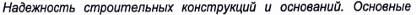
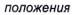
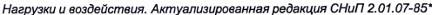
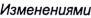
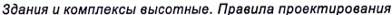
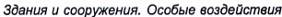

## PHỤ LỤC H  (Quy định)  HỆ SỐ TẦM QUAN TRỌNG CỦA CÔNG TRÌNH

**H.1**  Tùy thuộc vào cấp hậu quả của công trình, khi thiết kế cần sử dụng hệ số độ tin cậy về tầm quan trọng của công trình γn.

**H.2**  Việc phân cấp hậu quả của công trình theo [2] phụ thuộc vào công năng sử dụng, cũng như hậu quả về xã hội, môi trường và kinh tế do sự hư hỏng và phá hoại của nó gây ra.

**H.3**  Hệ số tầm quan trọng của công trình γn được lấy theo Bảng H.1 khi tính toán theo trạng thái giới hạn thứ nhất và lấy bằng 1,0 khi tính toán theo trạng thái giới hạn thứ hai.

**Bảng H.1 — Giá trị tối thiểu của hệ số tầm quan trọng γn**

| Cấp hậu quả của công trình | Mức độ quan trọng của công trình | Giá trị γn |
| :---: | :--- | :--- |
| C1 | Thấp | 0,87 |
| C2 | Trung bình | 1,00 |
| C3 | Cao | 1,15 |
| CHÚ THÍCH: Đối với nhà cao trên 250 m và mái nhịp lớn (không có trụ trung gian) với nhịp lớn hơn 120 m thì hệ số γn lấy không nhỏ hơn 1,2. |  |  |

Thư mục tài liệu tham khảo

[1] QCVN 02:2022/BXD, Quy chuẩn kỹ thuật quốc gia về Số liệu điều kiện tự nhiên dùng trong xây dựng

[2] QCVN 03:2022/BXD, Quy chuẩn kỹ thuật quốc gia về Phân cấp công trình phục vụ thiết kế xây dựng

[3] TCVN 2737:1995, Tải trọng và tác động - Tiêu chuẩn thiết kế

[4] TCVN 5574:2018, Thiết kế kết cấu bê tông và bê tông cốt thép

[5] BS EN 1990, Basis of structural design (BS EN 1990, Cơ sở thiết kế kết cấu)

[6] BS EN 1991, Actions on Structures (BS EN 1991, Tác động lên kết cấu)

[7] ASCE/SEI 7-16, Minimum design loads and associated criteria for buildings and other structures (ASCE/SEI 7-16, Tải trọng thiết kế tối thiểu và tiêu chí liên quan đối với nhà và các kết cấu khác)

[8] GOST 27751-2014,

(GOST 27751-2014, Độ tin cậy của kết cấu xây dựng và nền. Yêu cầu chung)

[9] SP 20.13330.2016,  (c  N 1, 2, 3, 4) (SP 20.13330.2016. Tải trọng và tác động. Phiên bản cập nhật SNiP 2.01.07- 85* (cùng các sửa đổi 1, 2, 3, 4))

[10] SP 267.1325800.2016,  (SP 267.1325800.2016 (c  N 1), Nhà và tổ hợp cao tầng. Nguyên tắc thiết kế (cùng sửa đổi 1))

[11] SP 296.1325800.2017,  (c  N 1, 2) (SP 296.1325800.2017, Nhà và công trình. Tác động đặc biệt (cùng các sửa đổi 1, 2))

MỤC LỤC

1  Phạm vi áp dụng

2  Tài liệu viện dẫn

3  Thuật ngữ, định nghĩa và ký hiệu

3.1  Thuật ngữ và định nghĩa

3.2  Ký hiệu

4  Yêu cầu chung

5  Phân loại tải trọng

6  Tổ hợp tải trọng

7  Trọng lượng của kết cấu và đất

8  Tải trọng do thiết bị, người, động vật, vật liệu và sản phẩm chất kho, phương tiện giao thông xe chữa cháy

8.1  Yêu cầu chung

8.2  Xác định tải trọng do thiết bị, vật liệu và sản phẩm chất kho

8.3  Tải trọng phân bố đều

8.4  Tải trọng tập trung

8.5  Tải trọng do phương tiện giao thông

8.6  Tải trọng do xe chữa cháy lên sàn mái phần hầm hoặc sàn mái khối đế của nhà

8.7  Tải trọng do trực thăng

8.8  Tải trọng va chạm do xe nâng

9  Tải trọng do cầu trục và cần trục treo

10  Tải trọng gió

10.1  Yêu cầu chung

10.2  Tải trọng gió chính

11  Độ võng và chuyển vị

11.1  Phạm vi áp dụng

11.2  Yêu cầu chung

11.3  Độ võng giới hạn

11.4  Chuyển vị giới hạn
