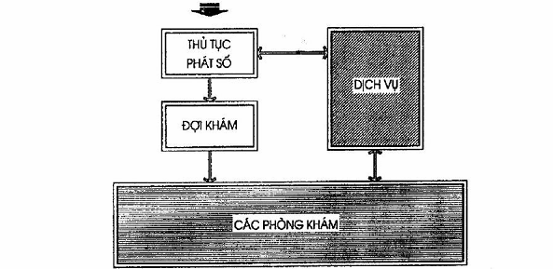
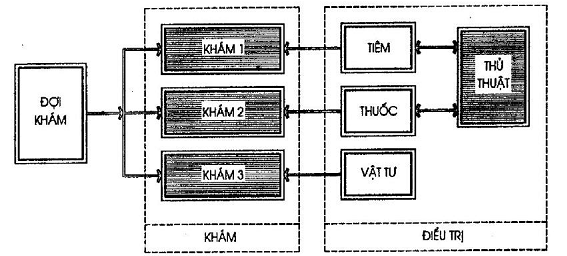
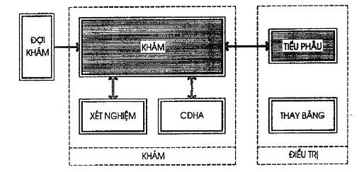
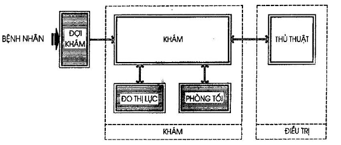
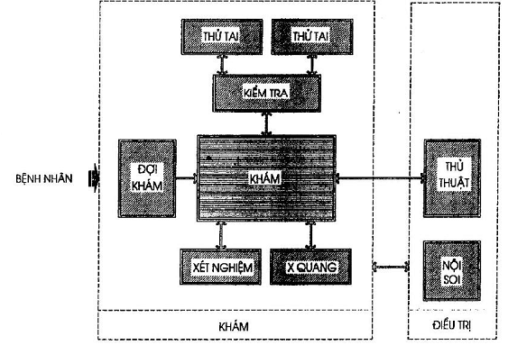
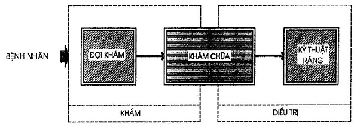
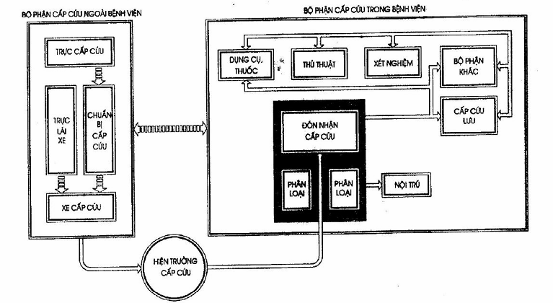
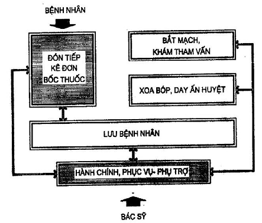
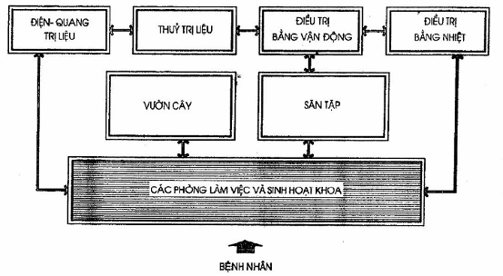

## PHỤ LỤC B (Tham khảo) — Khoa Khám bệnh đa khoa và điều trị ngoại trú

<strong>Hình B.1 — Sơ đồ dây chuyền Khoa Khám bệnh đa khoa và điều trị ngoại trú</strong>

<strong>Hình B.2 — Sơ đồ dây chuyền Khám chữa bệnh nội khoa</strong>

<strong>Hình B.3 — Sơ đồ dây chuyền Khám chữa bệnh ngoại khoa</strong>

<strong>Hình B.4 — Sơ đồ dây chuyền Khoa Mắt</strong>

<strong>Hình B.5 — Sơ đồ dây chuyền Khoa Tai Mũi Họng</strong>

<strong>Hình B.6 — Sơ đồ dây chuyền Khoa Răng Hàm Mặt</strong>

<strong>Hình B.7 — Sơ đồ dây chuyền hoạt động cấp cứu</strong>

<strong>Hình B.8 — Sơ đồ dây chuyền công năng khoa Y học cổ truyền</strong>

<strong>Hình B.9 — Sơ đồ dây chuyền Khoa Vật lý trị liệu - phục hồi chức năng</strong>
