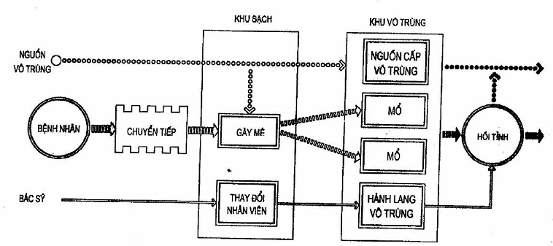
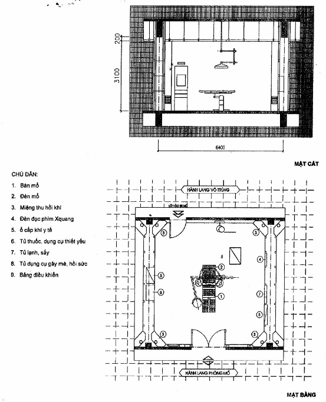
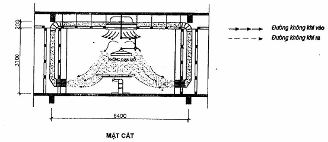

## PHỤ LỤC D (Tham khảo) — Khu Kỹ thuật nghiệp vụ

<strong>Hình D.1 — Sơ đồ dây chuyền khoa Phẫu thuật - gây mê hồi sức</strong>

<strong>Hình D.2 — Phòng mổ</strong>

<strong>Hình D.3 — Hệ thống khí sạch phòng mổ</strong>

<!-- DIAGRAM: word/media/image16.png -->