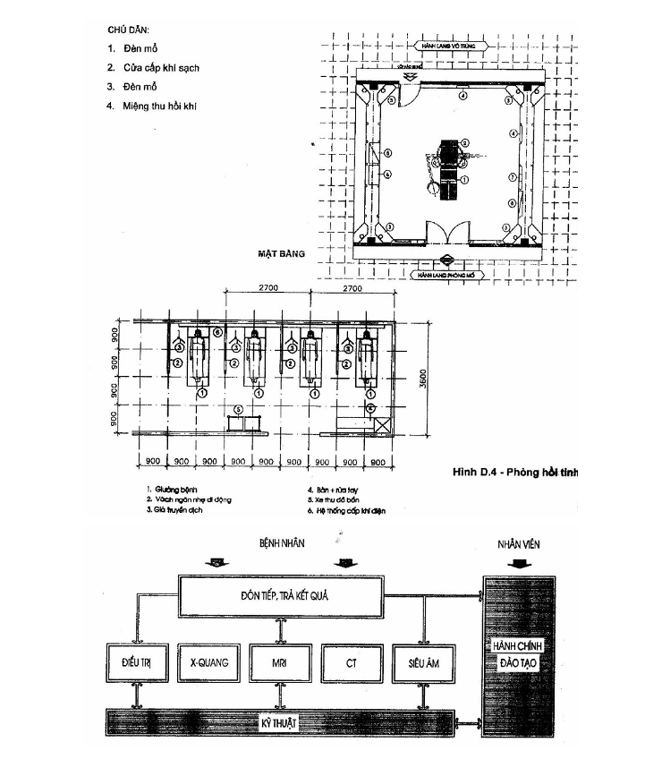
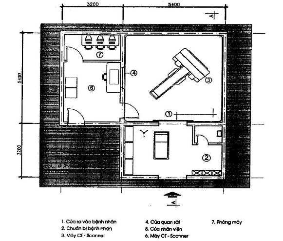
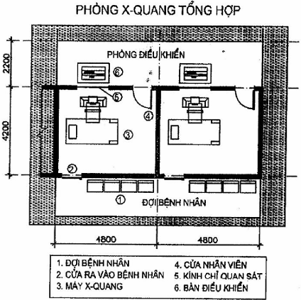
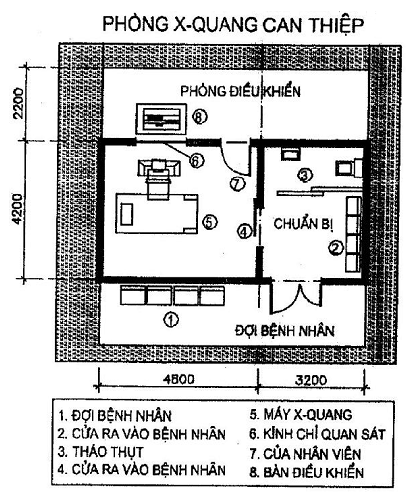
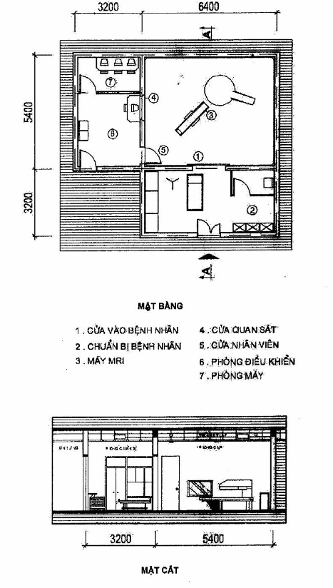
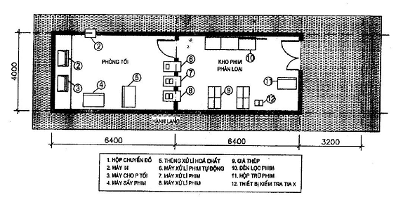

## PHỤ LỤC E (Tham khảo) — Khoa Chẩn đoán hình ảnh

<strong>Hình E.1 — Sơ đồ dây chuyền khoa Chẩn đoán hình ảnh</strong>

<strong>Hình E.2 — Phòng CT-SCANNER</strong>

<strong>Hình E.3 — Phòng X- quang tổng hợp</strong>

<strong>Hình E.4 — Phòng X- quang can thiệp</strong>

<strong>Hình E.5 — Phòng MRI</strong>

<strong>Hình E.6 — Phòng tối, phòng phân loại</strong>
