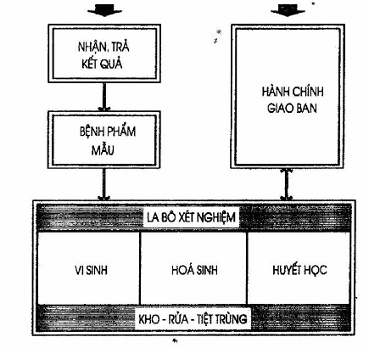
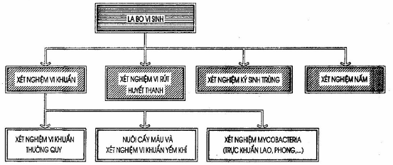
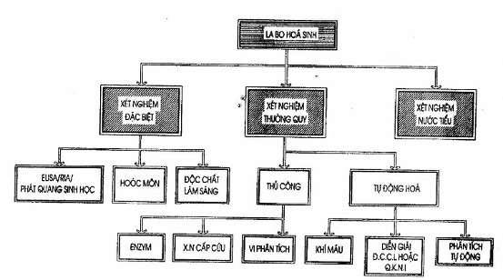
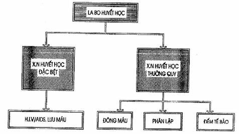
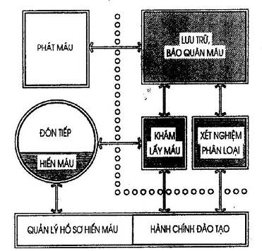
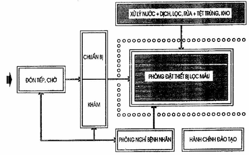
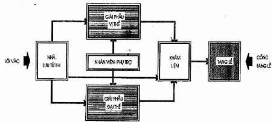

## PHỤ LỤC G (Tham khảo) — Các khoa Xét nghiệm, Truyền máu, Lọc máu, Giải phẫu bệnh

<strong>Hình G.1 — Sơ đồ dây chuyền công năng khoa Xét nghiệm</strong>

<strong>Hình G.2 — Sơ đồ dây chuyền khoa Vi sinh</strong>

<strong>Hình G.3 — Sơ đồ dây chuyền khoa Hóa Sinh</strong>

<strong>Hình G.4 — Sơ đồ dây chuyền khoa Huyết học</strong>

<strong>Hình G.5 — Sơ đồ dây chuyền khoa Truyền máu</strong>

<strong>Hình G.6 — Sơ đồ dây chuyền khoa Lọc máu</strong>

<strong>Hình G.7 — Sơ đồ dây chuyền khoa Giải phẫu bệnh</strong>
