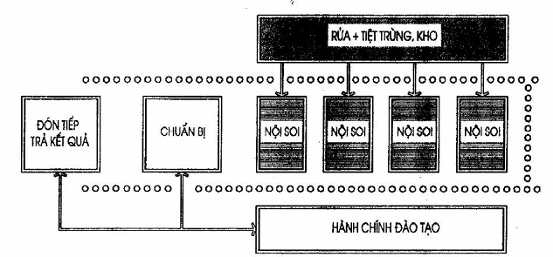
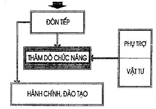
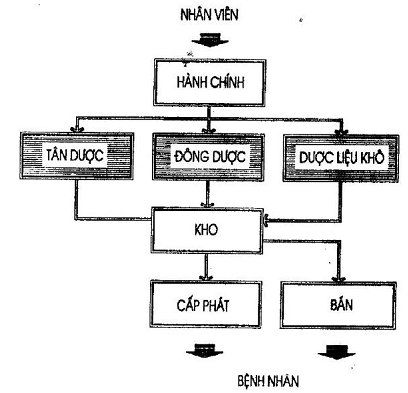

## PHỤ LỤC H (Tham khảo) — Khoa Nội soi, khoa Thăm dò chức năng, khoa Dược

<strong>Hình H.1 — Sơ đồ dây chuyền khoa Nội soi</strong>

<strong>Hình H.2 — Sơ đồ dây chuyền công năng khoa Thăm dò chức năng</strong>

<strong>Hình H.3 — Sơ đồ phân khu chức năng khoa Dược</strong>
