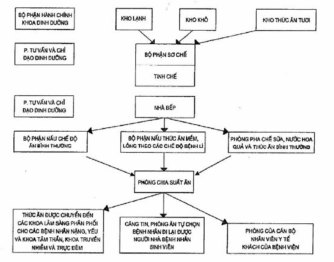
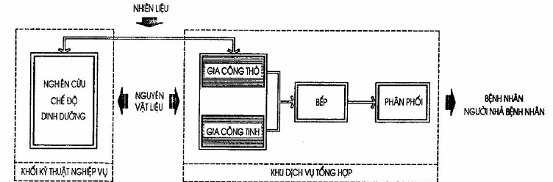
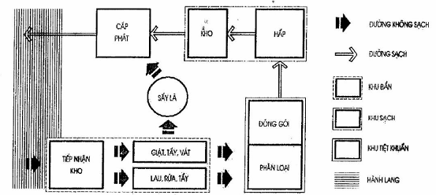

## PHỤ LỤC I (Tham khảo) — Khoa Dinh dưỡng, khoa Quản lý nhiễm khuẩn

<strong>Hình I.1 — Sơ đồ khoa Dinh dưỡng</strong>

<strong>Hình I.2 — Sơ đồ dây chuyền khoa Dinh dưỡng</strong>

<strong>Hình I.3 — Sơ đồ dây chuyền bộ phận giặt là khoa Quản lý nhiễm khuẩn</strong>
