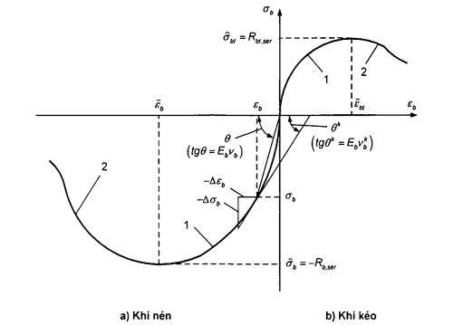

## PHỤ LỤC B  (Tham khảo)  CÁC BIỂU ĐỒ BIẾN DẠNG CỦA BÊ TÔNG

### B.1  Quan hệ giải tích của các biểu đồ biến dạng (dạng đường cong) của bê tông có dạng:

$$\begin{aligned} \varepsilon_m &= \frac{\sigma_m}{E_m v_m} \qquad (B.1) \\ d \varepsilon_m &= \frac{d \sigma_m}{E_m v_m^k} \qquad (B.2) \end{aligned}$$
<!-- formula_id: "F_TCVN_5574_2018_FORMULA_B_1_2" -->

trong đó:

&nbsp;&nbsp;&nbsp;&nbsp;\- $\epsilon_{m}$, $\sigma_{m}$, $E_{m}$  lần lượt là biến dạng tương đối, ứng suất và mô đun đàn hồi ban đầu (d là dấu vi phân);

&nbsp;&nbsp;&nbsp;&nbsp;\- m  là chỉ số vật liệu (đối với bê tông m = b, bt ; đối với cốt thép m = s);

&nbsp;&nbsp;&nbsp;&nbsp;\- $v_{m}$  là hệ số biến động của mô đun cát tuyến, được xác định theo công thức:

$$\nu_m = \hat{\nu}_m \pm \left(\nu_0 - \hat{\nu}_m\right)\sqrt{1 - \omega_1 \eta - \omega_2 \eta^2} \tag{B.3}$$
<!-- formula_id: "F_TCVN_5574_2018_FORMULA_B_3" -->

trong đó:

&nbsp;&nbsp;&nbsp;&nbsp;\- $\hat{v}_m$ là giá trị của hệ số biến động $v_{m}$ tại đỉnh biểu đồ (khi $\sigma_{m}$ = $\hat{\sigma}_m$);

&nbsp;&nbsp;&nbsp;&nbsp;\- $v_{0}$  là hệ số biến động ban đầu của mô đun cát tuyến (tại điểm bắt đầu của biểu đồ hoặc tại điểm bắt đầu của đoạn cong của biểu đồ);

&nbsp;&nbsp;&nbsp;&nbsp;\- $\omega_{1}$, $\omega_{2}$  là các hệ số đặc trưng cho độ điền đầy của biểu đồ vật liệu, $\omega_{2}$ = 1 - $\omega_{1}$;

&nbsp;&nbsp;&nbsp;&nbsp;\- $\eta$ là mức gia tăng ứng suất, được xác định theo công thức:

$$\eta = \frac{\sigma_m - \sigma_{m,pl}}{\bar{\sigma}_m - \sigma_{m,pl}} \tag{B.4}$$
<!-- formula_id: "F_TCVN_5574_2018_FORMULA_B_4" -->

trong đó:

&nbsp;&nbsp;&nbsp;&nbsp;\- $\sigma_{m}$- $\sigma_{m,el}$≥ 0;

&nbsp;&nbsp;&nbsp;&nbsp;\- $\sigma_{m,el}$  là ứng suất ứng với giới hạn đàn hồi của vật liệu;

&nbsp;&nbsp;&nbsp;&nbsp;\- $v_m^k$  là hệ số biến động của mô đun tiếp tuyến, có quan hệ với hệ số biến động của mô đun cát tuyến bằng công thức:

$$\frac{1}{v_m^*} = \frac{1}{v_m} \pm \frac{\sigma_m(v_0 - \tilde{v}_m)(\omega_1 + 2 \omega_2 \eta)}{2v_m^2(\tilde{\sigma}_m - \sigma_{m,el})\sqrt{1 - \omega_1 \eta - \omega_2 \eta^2}} \tag{B.5}$$
<!-- formula_id: "F_TCVN_5574_2018_FORMULA_B_5" -->

Trong các công thức (B.3) và (B.5), lấy dấu “cộng” đối với biểu đồ biến dạng của cốt thép và đối với nhánh lên của biểu đồ biến dạng của bê tông, lấy dấu “trừ" đối với nhánh xuống của biểu đồ biến dạng của bê tông. Cho phép sử dụng nhánh xuống của biểu đồ đến mức ứng suất η ≥ 0,85 (có kể đến các chỉ dẫn bổ sung trong B.3).

### B.2  Khi nén một trục và nén thuần túy đối với bê tông thì biểu đồ biến dạng ban đầu của bê tông (Hình B.1a) được mô tả bằng các quan hệ từ (B.1) đến (B.5), trong đó các đại lượng được lấy như sau:

**CHÚ DẪN:**

1 - Nhánh lên; 2 - Nhánh xuống.

<strong>Hình B.1 — Các biểu đồ biến dạng (dạng đường cong) của bê tông</strong>

&nbsp;&nbsp;\- Đối với cả hai nhánh của biểu đồ:

$$\begin{aligned} \hat{\sigma}_b &= -R_{b,ser} \qquad (B.6) \\ \sigma_{b,el} &= 0 \qquad (B.7) \\ \hat{\nu} &= \frac{\hat{\sigma}_b}{\hat{\varepsilon}_b E_b} \qquad (B.8) \\ \eta &= \frac{\sigma_b}{\hat{\sigma}_b} \qquad (B.9) \end{aligned}$$
<!-- formula_id: "F_TCVN_5574_2018_FORMULA_B_6_9" -->

&nbsp;&nbsp;\- Đối với nhánh lên:

$$\begin{aligned} v_0 &= 1 \qquad (B.10) \\ \omega_1 &= 2 - 2,5\hat{v}_b \qquad (B.11) \end{aligned}$$
<!-- formula_id: "F_TCVN_5574_2018_FORMULA_B_10_11" -->

&nbsp;&nbsp;\- Đối với nhánh xuống:

$$\begin{aligned} v_0 &= 2,05\,\hat{v}_b \qquad (B.12) \\ \omega_1 &= 1,95\hat{v}_b - 0,138 \qquad (B.13) \end{aligned}$$
<!-- formula_id: "F_TCVN_5574_2018_FORMULA_B_12_13" -->

Hoành độ của đỉnh biểu đồ nén đọc trục của bê tông được xác định theo công thức:

$$\bar{\varepsilon}_b = -\frac{B}{E_b} \cdot \lambda \cdot \frac{1 + \frac{0,75 \lambda B}{60} + \frac{0,2 \lambda}{B}}{0,12 + \frac{B}{60} + \frac{0,2}{B}} \tag{B.14}$$
<!-- formula_id: "F_TCVN_5574_2018_FORMULA_B_14" -->

trong đó:

&nbsp;&nbsp;&nbsp;&nbsp;\- B  là cấp cường độ chịu nén của bê tông;

&nbsp;&nbsp;&nbsp;&nbsp;\- $\lambda$ là hệ số không thứ nguyên, phụ thuộc vào loại bê tông và lấy bằng:

Đối với bê tông nặng và bê tông hạt nhỏ: λ = 1;

Đối với bê tông nhẹ có khối lượng thể tích trung bình D (kg/$m^{3}$): λ = D/2400;

Đối với bê tông tổ ong: λ = 0,25 + 0,35B.

Khi kéo một trục và kéo thuần túy đối với bê tông thì biểu đồ biến dạng ban đầu của bê tông (Hình B.1 b) được mô tả bằng các quan hệ từ (B.1) đến (B.4), trong đó các đại lượng được lấy như sau:

$$\begin{aligned} \tilde{\sigma}_{bt} &= R_{bt,ser} \tilde{\gamma}_{btq} \qquad (B.15) \\ \sigma_{bt,el} &= 0 \qquad (B.16) \\ \eta &= \frac{\sigma_{bt}}{\tilde{\sigma}_{bt}} \qquad (B.17) \\ \tilde{\nu}_{bt} &= \frac{0,6 + 0,15\frac{R_{bt,n}}{R_{bt,n}}}{\tilde{\gamma}_{btq}} \qquad (B.18) \end{aligned}$$
<!-- formula_id: "F_TCVN_5574_2018_FORMULA_B_15_18" -->

trong đó:

&nbsp;&nbsp;&nbsp;&nbsp;\- $\tilde{\gamma}_{b/q}$ là hệ số, lấy như sau:

Khi kéo đúng tâm: bằng 1,0;

Đối với cấu kiện chịu uốn:

$$\tilde{\gamma}_{btq} = \tilde{\gamma}_h + 0,007 \tag{B.19}$$
<!-- formula_id: "F_TCVN_5574_2018_FORMULA_B_19" -->

với

$$0,9 \le \tilde{\gamma}_n = 2 - \sqrt[5]{h/h_o} \qquad \text{(B.20)}$$
<!-- formula_id: "F_TCVN_5574_2018_RID337" -->

trong đó:

&nbsp;&nbsp;&nbsp;&nbsp;\- $h_{e}$  là chiều cao chuẩn của tiết diện, $h_{e}$ = 30 cm;

&nbsp;&nbsp;&nbsp;&nbsp;\- h  là chiều cao tiết diện, tính bằng centimét (cm);

&nbsp;&nbsp;&nbsp;&nbsp;\- $R_{0t,n}$ = 2,5 MPa.

&nbsp;&nbsp;&nbsp;&nbsp;\- Các thông số $v_{0}$, $\omega_{1}$ được tính theo các công thức (B.10) đến (B.13) nhưng thay $\gamma_d$ bằng $\hat{v}_{\text{bx}}$.

