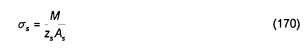

## PHỤ LỤC F  (Tham khảo)  TÍNH TOÁN CỘT TIẾT DIỆN VÀNH KHUYÊN VÀ TRÒN

### F.1  Cột tiết diện vành khuyên

Tính toán độ bền tiết diện vành khuyên của cột (Hình F.1) có tỷ số giữa bán kính trong và ngoài $r_{1}$/$r_{2}$ > 0,5 và đặt cốt thép phân bố đều theo chu vi (với số thanh cốt thép dọc tối thiểu là 7), được tiến hành phụ thuộc vào diện tích tương đối của vùng chịu nén của bê tông $\xi_{cir}$:

$$\xi_{cir} = \frac{N + R_s A_{s,tot}}{R_b A + (R_{sc} + 1,7R_s) A_{s,tot}} \tag{F.1}$$
<!-- formula_id: "F_TCVN_5574_2018_FORMULA_F_1" -->

a) \- Khi 0,15 < $\xi_{cir}$ < 0,6: theo điều kiện

$$M \le \left(R_b A_r m + R_s A_{s,tot} r_s\right)\frac{\sin \pi\,\xi_{cir}}{\pi} + R_s A_{s,tot} r_s \left(1 - 1,7\,\xi_{cir}\right)\left(0,2 + 1,3\,\xi_{cir}\right) \tag{F.2}$$
<!-- formula_id: "F_TCVN_5574_2018_FORMULA_F_2" -->

b) \- Khi $\xi_{cir}$ ≤ 0,15: theo điều kiện

$$M \le \left(R_b A_r m + R_s A_{s,tot} r_s\right)\frac{\sin \pi \xi_{cir1}}{\pi} + 0,295 R_s A_{s,tot} r_s \tag{F.3}$$
<!-- formula_id: "F_TCVN_5574_2018_FORMULA_F_3" -->

trong đó:

$$\xi_{or1} = \frac{N + 0,75 R_s A_{s,tot}}{R_b A + R_s A_{s,tot}} \tag{F.4}$$
<!-- formula_id: "F_TCVN_5574_2018_FORMULA_F_4" -->

c) \- Khi $\xi_{cir}$ ≥ 0,6: theo điều kiện

$$M \le \left(R_b A r_m + R_s A_{s,tot} r_s\right)\frac{\sin \pi \xi_{or2}}{\pi} \tag{F.5}$$
<!-- formula_id: "F_TCVN_5574_2018_FORMULA_F_5" -->

trong đó:

$$\xi_{cr2} = \frac{N}{R_b A + R_s A_{s,tot}} \tag{F.6}$$
<!-- formula_id: "F_TCVN_5574_2018_FORMULA_F_6" -->

Trong các công thức từ (F.1) đến (F.6):

$A_{s,tot}$ là diện tích toàn bộ cốt thép dọc;

$r_m - \frac{r_1 + r_2}{2}$;

$r_{s}$  là bán kính đường tròn đi qua trọng tâm các thanh cốt thép dọc.

Mô men uốn M được xác định có kể đến ảnh hưởng của uốn dọc cấu kiện.

**CHÚ DẪN:**

1 - Vùng chịu nén.

<strong>Hình F.1 — Sơ đồ tính toán tiết diện vành khuyên của cấu kiện chịu nén</strong>

### F.2  Cột tiết diện tròn

Tính toán độ bền tiết diện tròn của cột (Hình F.2) có cốt thép đặt phân bố đều theo chu vi (với số thanh cốt thép dọc tối thiểu là 7), khi sử dụng cốt thép từ CB400-V trở xuống, được kiểm tra theo điều kiện:

$$M \le \frac{2}{3} R_b A r \frac{\sin^3 \pi \xi_{or}}{\pi} + R_s A_{s,tot} \left( \frac{\sin \pi \xi_{or}}{\pi} + \varphi \right) r_s \tag{F.7}$$
<!-- formula_id: "F_TCVN_5574_2018_FORMULA_F_7" -->

trong đó:

&nbsp;&nbsp;&nbsp;&nbsp;\- r  là bán kính đường tròn của tiết diện;

&nbsp;&nbsp;&nbsp;&nbsp;\- $r_{s}$  là bán kính đường tròn đi qua trọng tâm các thanh cốt thép dọc;

&nbsp;&nbsp;&nbsp;&nbsp;\- $\xi_{cir}$  là diện tích tương đối của vùng chịu nén của bê tông, được xác định như sau:

Khi thỏa mãn điều kiện

$$N \le 0,77 R_{b} A + 0,645 R_{s}A_{s,tot} \tag{F.8}$$
<!-- formula_id: "F_TCVN_5574_2018_FORMULA_F_8" -->

thì

$$\xi_{or} = \frac{N + R_s A \frac{\sin 2 \pi \xi_{or}}{2 \pi}}{R_b A + R_s A_{s,tot}} \tag{F.9}$$
<!-- formula_id: "F_TCVN_5574_2018_FORMULA_F_9" -->

Khi điều kiện (F.8) không thỏa mãn thì

$$\xi_{cir} = \frac{N + R_s A_{s,tot} R_b A \frac{\sin 2 \pi \xi_{cir}}{2 \pi}}{\frac{R_b A + 2,55 R_s A_{s,tot}}{}}\tag{F.10}$$
<!-- formula_id: "F_TCVN_5574_2018_FORMULA_F_10" -->

φ  là hệ số, kể đến sự làm việc của cốt thép chịu kéo và lấy như sau:

Khi thỏa mãn điều kiện (F.8): φ = 1,6(1 - 1,55$\xi_{cir}$)$\xi_{cir}$, nhưng không lớn hơn 1,0;

Khi không thỏa mãn điều kiện (F.8): φ = 0;

$A_{s,tot}$  là diện tích tiết diện toàn bộ cốt thép dọc.

Mô men uốn M được xác định có kể đến ảnh hưởng của uốn dọc cấu kiện.

**CHÚ DẪN:**

1 - Vùng chịu nén.

<strong>Hình F.2 — Sơ đồ tính toán tiết diện tròn của cấu kiện chịu nén lệch tâm</strong>

